# 11. JavaFX 3D

JavaFX 9 强力支持真正的 3D 场景，将可调节的灯光、相机和模型作为该语言的一等公民。借助 JavaFX 9，可以将这些功能直接与本书中提到的更为人所知的 2D GUI 组件混合使用，无论是在视觉上还是在源代码中。专用 GPU 硬件的出现降低了特定语言支持 3D 渲染的门槛，使得 JavaFX 的性能与先前版本 Java 的第三方实现不相上下。

一本小书可能都难以详尽介绍 JavaFX 9 中 3D 图形工具的所有功能。为了满足初学者或中级学习者的需求，本章重点介绍如何快速建立具有简单对象真实三维可视化的场景。然后，通过描述在更复杂场景中常见的典型自定义设置来扩展这些概念。

在本章中，你将了解以下内容：

*   几何图元
*   相机和灯光
*   自定义 TriangleMesh 模型
*   事件处理以及与 3D 场景的交互

## JavaFX 中的基本 3D 场景

在本章关于 3D 的这一半内容中，你将使用一个逐步扩展的示例模型。它将带你经历几个步骤，从建立一个基本的空 3D 场景，到一个包含可以从不同距离和角度查看的对象的场景。

### 一个非常基础的 3D 场景示例

新的 JavaFX 3D 支持最棒的一点是，它是 Java 语言的一等公民。在设计 3D 包时非常用心，使得其与 2D 对应物相比，范式变化非常小。建立基本 3D 场景的区别仅在于相机。清单 11-1 演示了这一点。

```
/* 来自 SimpleScene3D.java */
Group sceneRoot = new Group();
Scene scene = new Scene(sceneRoot, sceneWidth, sceneHeight);
scene.setFill(Color.WHITE);
PerspectiveCamera camera = new PerspectiveCamera(true);
camera.setNearClip(0.1);
camera.setFarClip(10000.0);
camera.setTranslateZ(-1000);
scene.setCamera(camera);
primaryStage.setTitle("SimpleScene3D");
primaryStage.setScene(scene);
primaryStage.show();
清单 11-1.
使用相机初始化 3D 场景
```

将此代码片段添加到一个原本为空的 JavaFX 应用程序中，你将得到一个完整的 3D 场景。运行该应用程序，你应该会看到如图 11-1 所示的视图。

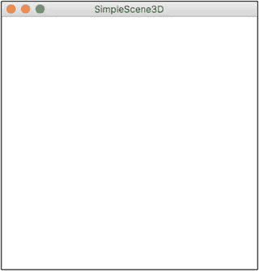

图 11-1.

一个基本的空 JavaFX 3D 场景

作为一个空场景，它并不令人兴奋；不过，你很快就会添加一些对象。该示例表明，任何 3D 场景与 2D 布局的区别仅在于两行代码：

```
PerspectiveCamera camera = new PerspectiveCamera(true);
scene.setCamera(camera);
```

创建一个 3D 相机节点（例如 `PerspectiveCamera`）会创建一个独立的场景图节点，其方式与你创建 BorderPane 或 Button 非常相似。从这个意义上说，它必须像任何其他节点一样添加到场景中。然而，相机节点是特殊的，因为它通过 `scene.setCamera()` 方法添加。`PerspectiveCamera` 构造函数的布尔参数决定了 3D 原点的位置。将此参数设置为 `true` 将从原点 (0,0,0) 建立所有 3D 布局，以便所有轴在屏幕中心交叉。这对于你期望使用 JavaFX 构建的大多数 3D 场景来说是典型的。将此参数设置为 `false` 会在左上角建立 3D 原点，类似于 2D 组件布局。对于大多数场景，`PerspectiveCamera(true)` 是理想的选择。某些场景，尤其是科学数据显示，使用左上角原点更为自然。

注意

选择相机类型的一个好的经验法则是，如果你打算在场景中大量平移和旋转相机，则应使用 `PerspectiveCamera(true)`。

## 图元

与大多数 3D 图形库一样，JavaFX 9 提供了几种开箱即用的几何形状，可以添加到场景中。这些形状通常被称为图元，并且可以像添加任何传统节点类型一样添加到场景中。

## 添加图元示例

本节扩展了之前非常简单的场景示例，以便你能看到一些内容。为此，你需要创建一个 `Cylinder` 对象，为其赋予一种彩色材质，并将其添加到场景中。清单 11-2 展示了演示此操作的代码。

```
/* SimpleScene3D.java */
//步骤 1b：添加一个图元
final Cylinder cylinder = new Cylinder(50, 100);
final PhongMaterial blueMaterial = new PhongMaterial();
blueMaterial.setDiffuseColor(Color.DEEPSKYBLUE);
blueMaterial.setSpecularColor(Color.BLUE);
cylinder.setMaterial(blueMaterial);
sceneRoot.getChildren().add(cylinder);
//结束步骤 1b
清单 11-2.
向 JavaFX 3D 场景添加圆柱体图元
```

将此代码添加到前面的示例中，将添加圆柱体并为其着色。重新编译并运行应用程序，你应该会看到如图 11-2 所示的视图。

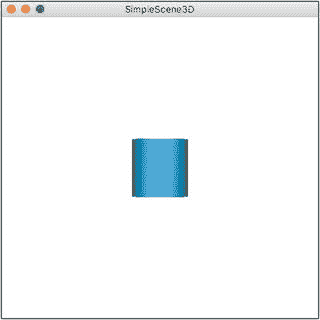

图 11-2.

带有 PhongMaterial 和 DrawMode.FILL 的圆柱体

这比空屏幕要好。这里使用的 `Cylinder` 构造函数：

```
final Cylinder cylinder = new Cylinder(50, 100);
```

指定了形状的直径和高度。为了实现那种带有华丽镜面高光的深蓝色，它使用了：

```
final PhongMaterial blueMaterial = new PhongMaterial();
```

`PhongMaterial` 是 `javafx.paint` 层次结构的扩展，允许在 3D 表面上进行丰富的平滑插值。`PhongMaterial` 对象可以在图元和其他 3D 节点之间重用，如下文所述。如果你不想使用 `PhongMaterial`，图元或任何 `Shape3D` 对象的默认渲染是线框视图。这将在后面的示例中演示。一旦你的形状构建并着色完毕，你可以使用以下代码将其添加到场景中：

```
sceneRoot.getChildren().add(cylinder);
```

在这行代码中，`Cylinder` 图元被当作你可能使用或创建的任何其他图形 `Node` 来处理。`Cylinder` 图元默认添加到场景的原点，即 `(0,0,0)`。


### 简单平移与旋转示例

现在你有了可观察的对象，就可以通过变换来利用第三维度了。JavaFX 3D 支持所有你期望的标准 3D 变换，并提供了易于使用的类。以下这些继承自 `Transform` 类的变换，都支持 3D 节点和组：

*   `Affine`（仿射变换）
*   `Rotate`（旋转变换）
*   `Scale`（缩放变换）
*   `Shear`（剪切变换）
*   `Translate`（平移变换）

通常在任何 3D 场景中，你最感兴趣的会是 `Rotate` 和 `Translate`，它们主要涉及移动和改变物体、灯光以及摄像机的朝向。诸如 `Cylinder` 类这样的 JavaFX Shape3D 对象提供了 setter 方法，可以轻松地应用简单的旋转或平移。清单 11-3 演示了如何将此应用于场景中的 `Cylinder`。

```
/* SimpleScene3D.java */
//步骤 1c：将图元平移并旋转到指定位置
cylinder.setRotationAxis(Rotate.X_AXIS);
cylinder.setRotate(45);
cylinder.setTranslateZ(-200);
//步骤 1c 结束
清单 11-3.
将图元平移并旋转到指定位置
```

将清单 11-3 中的代码片段添加到当前的 3D 场景应用程序中，将生成一个视图，其中圆柱体已被旋转并朝向摄像机平移。效果应类似于图 11-3。

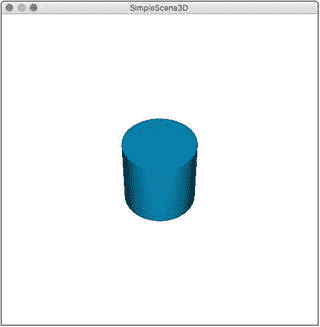

图 11-3.

一个绕 X 轴旋转了 45 度的圆柱体

在这个持续运行的示例中，你第一次可以通过绕 X 轴旋转和沿 Z 轴平移来看到第三维度。旋转角度以度为单位设置，范围是 0 到 360 度。首先使用 `setRotationAxis()` 设置当前的旋转轴非常重要。如果你需要在多个轴上进行多次旋转，则每次轴改变时都需要调用 `setRotationAxis()` 方法。每次调用 `setRotationAxis()` 仅影响当前的 Shape3D 对象。平移是沿着 set 命令的指定轴以像素为单位设置的，其处理方式与传统 2D 组件的平移相同。

注意

JavaFX 3D 场景的坐标系采用“Y 轴向下”，即 Y 轴正方向向下。与大多数 3D 系统一样，Z 轴正方向朝向屏幕内，X 轴正方向朝右。

### 多图元变换示例

本示例在现有设置的基础上进行了扩展，在与 `Cylinder` 相同的场景中添加并变换了 `Cube` 和 `Sphere` 图元。示例代码见清单 11-4。

```
/* SimpleScene3D.java */
//步骤 1d：添加并变换更多图元
final PhongMaterial greenMaterial = new PhongMaterial();
greenMaterial.setDiffuseColor(Color.DARKGREEN);
greenMaterial.setSpecularColor(Color.GREEN);
final Box cube = new Box(50, 50, 50);
cube.setMaterial(greenMaterial);
final PhongMaterial redMaterial = new PhongMaterial();
redMaterial.setDiffuseColor(Color.DARKRED);
redMaterial.setSpecularColor(Color.RED);
final Sphere sphere = new Sphere(50);
sphere.setMaterial(redMaterial);
cube.setRotationAxis(Rotate.Y_AXIS);
cube.setRotate(45);
cube.setTranslateX(-150);
cube.setTranslateY(-150);
cube.setTranslateZ(150);
sphere.setTranslateX(150);
sphere.setTranslateY(150);
sphere.setTranslateZ(-150);
sceneRoot.getChildren().addAll(cylinder,cube,sphere);
//步骤 1d 结束
清单 11-4.
添加并变换 Box 和 Sphere 图元
```

这段代码展示了将多种材质和颜色应用于多个图元。每个图元都被平移和旋转到 3D 场景中不同的深度和轴向上。

在同一个场景中拥有多个 `Shape3D` 对象可以展示出极佳的视觉深度。然而，当你向 3D 场景中添加多个节点或组时，必须将 `add()` 方法改为 `addAll()` 方法，如下面来自清单 11-4 的代码行所示：

```
sceneRoot.getChildren().addAll(cylinder,cube,sphere);
```

从这个意义上说，将 2D GUI 组件添加为场景子节点与在 3D 中添加没有区别。将前面的代码片段添加到示例中，并将 `add()` 改为 `addAll()`，应该会提供一个类似于图 11-4 的视图。

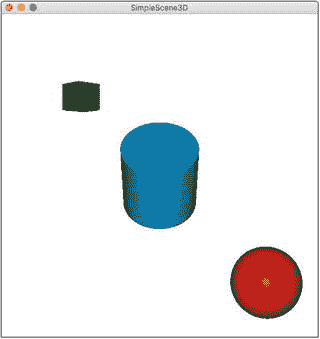

图 11-4.

一个立方体、圆柱体和球体图元

### 整合在一起：分组图元

随着场景变得越来越复杂，将每个 3D 对象都添加到场景中会变得很繁琐。图元和其他 Shape3D 节点经常被组合使用以形成更复杂的对象。这些复合对象通常作为一个整体进行变换，尽管每个组件通常可以独立可视化。使用组可以轻松实现这一点，如清单 11-5 所示。

```
/* SimpleScene3D.java */
//步骤 1e：整合在一起：分组图元
Group primitiveGroup = new Group(cylinder,cube,sphere);
primitiveGroup.setRotationAxis(Rotate.Z_AXIS);
primitiveGroup.setRotate(180); //将组作为一个整体旋转
sceneRoot.getChildren().addAll(primitiveGroup);
//步骤 1e 结束
清单 11-5.
分组并变换图元
```

每个图元通过以下代码行添加到 `Group` 对象中：

```
Group primitiveGroup = new Group(cylinder,cube,sphere)
```

然后可以简化许多批量操作。清单 11-5 演示了绕 Z 轴旋转 180 度，这有效地将整个场景作为一个同质单元进行旋转。将前面的代码片段添加到正在运行的图元示例中，应该会提供一个类似于图 11-5 的视图。

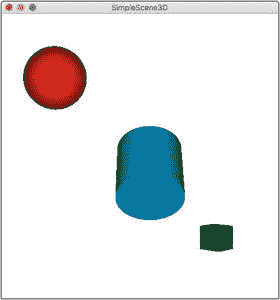

图 11-5.

均匀旋转的分组图元

请确保将新的 `Group` 对象添加到场景中，而不是添加单个图元，如清单 11-5 所述。单个图元对象仍然可以通过 `Group` 对象的 `getChildren()` 方法或直接引用来独立访问、旋转和平移。

注意

请记住，当将图元、组和其他 `Shape3D` 节点对象添加到 3D 场景时，默认位置是原点。大多数图元通过计算出的质心居中于原点。

## 与场景交互

将对象渲染到 3D 场景中通常只有在你能与该场景交互时才有用。用户至少应该能够在场景中移动并进行一些观察。本章的这一部分将介绍一个简单的第一人称视角控制示例。上一节中的图元示例被用作构建平台。


### 图元的拾取

当您直接与 3D 场景中的单个对象交互时（通常使用鼠标），需要检测鼠标类型事件以及这些事件是否与场景中的某个对象相关。好消息是，3D 场景中的事件处理遵循与传统 2D GUI 相同的模式。清单 11-6 演示了添加`MouseClicked`事件处理器的代码。

```
/* SimpleScene3D.java */
//步骤 2a：图元的拾取
scene.setOnMouseClicked(event-> {
Node picked = event.getPickResult().getIntersectedNode();
if(null != picked) {
double scalar = 2;
if(picked.getScaleX() > 1)
scalar = 1;
picked.setScaleX(scalar);
picked.setScaleY(scalar);
picked.setScaleZ(scalar);
}
});
//步骤 2a 结束
清单 11-6.
通过鼠标事件平移图元
```

将这一事件处理器添加到运行示例的场景中，会创建一种交互：点击某个 3D 对象会使其尺寸加倍，或将其恢复为正常大小。在每个图元上点击一次，应能看到类似于图 11-6 的视图。

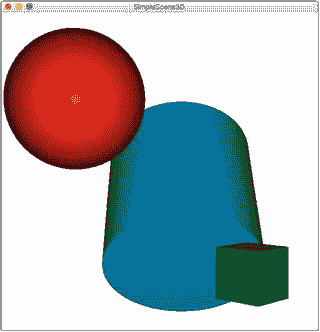

图 11-6.

在三个轴上均被放大的 3D 对象

这里的技巧在于判断`MouseEvent`是否与场景中的某个 3D 对象同时发生。关键代码行是：

```
Node picked = event.getPickResult().getIntersectedNode();
```

其中`MouseEvent`返回一个`PickResult`。用 3D 术语来说，`PickResult`是对 X、Y 屏幕坐标与 X、Y、Z 3D 场景坐标进行相交测试的结果。虽然`PickResults`在 JavaFX 2 中就已可用于 2D GUI 组件，但在 JavaFX 9 中，它们不仅在 3D 空间中有效，而且可以作为各种事件中易于访问的对象。与所有`MouseEvent`类型一样，可以查询事件以获取`PickResult`。如果发生了`PickResult`，那么`getIntersectedNode()`将返回被“拾取”的场景对象的 Node 对象表示。如果没有对象被“拾取”，则`getIntersectedNode()`返回`null`。

注意

不要忘记在三个轴上均匀缩放对象，如清单 11-6 所示。否则，您的对象会很快以奇怪的方式被拉伸。

### 使用键盘进行第一人称移动

在 3D 场景中导航的一种便捷方式是通过第一人称视角“飞行穿越”。这通常通过鼠标和键盘的组合来实现：键盘控制 X 轴和 Z 轴移动，鼠标控制摄像机旋转。这是此类游戏以及模拟和战术显示中的典型设置。

要为 3D 场景添加键盘导航，只需添加标准的 JavaFX 按键事件处理器即可。清单 11-7 中的代码是一个简单的`OnKeyPressed`事件处理器示例，它提供了前面描述的 X 轴和 Z 轴导航。该处理器产生的移动会通过 3D 场景平移摄像机节点本身。

```
/* SimpleScene3D.java */
//步骤 2b：添加移动键盘处理器
scene.setOnKeyPressed(event -> {
double change = cameraQuantity;
//添加 Shift 修饰键以模拟“奔跑速度”
if(event.isShiftDown()) {
change = cameraModifier;
}
//用户按下了哪个键？
KeyCode keycode = event.getCode();
//步骤 2c：添加缩放控制
if(keycode == KeyCode.W) {
camera.setTranslateZ(camera.getTranslateZ() + change);
}
if(keycode == KeyCode.S) {
camera.setTranslateZ(camera.getTranslateZ() - change);
}
//步骤 2d：添加平移控制
if(keycode == KeyCode.A) {
camera.setTranslateX(camera.getTranslateX() - change);
}
if(keycode == KeyCode.D) {
camera.setTranslateX(camera.getTranslateX() + change);
}
});
//步骤 2b-d 结束
清单 11-7.
一个简单的第一人称移动键盘事件处理器
```

分析这段代码片段，您会发现 JavaFX 使其变得非常简单直接。将事件处理器添加到场景中，与将事件处理器添加到任何传统 2D GUI 组件的方式相同，如`scene.setOnKeyPressed(event -> {`所示。

添加复合事件处理（例如，按住 Shift 键的同时按下另一个键）通过事件对象本身即可轻松实现。在清单 11-7 中，这是通过`event.isShiftDown()`完成的，它返回一个简单的布尔值来表示真伪。这些额外的元键无论实际发生什么事件，其值都为 true 或 false，并且无论事件是键盘、鼠标甚至触摸事件，都可以使用。

在决定摄像机移动方向时，只需从事件中获取`KeyCode`：

```
KeyCode keycode = event.getCode();
```

并通过简单的相等性检查来分支逻辑：

```
if(keycode == KeyCode.W) {
camera.setTranslateZ(camera.getTranslateZ() + change);
}
```

`KeyCode.W`是`KeyCode enum`的一部分，该枚举通过`Comparable`接口提供了每一个可能的按键。这对于为任何应用程序构建复杂的界面来说非常方便。


### 使用鼠标实现第一人称摄像机移动

之前的键盘处理示例提供了第一人称视角的一半功能，让你能够“飞越”3D 场景。键盘用于沿 X 轴和 Z 轴滑动。其原理是`PerspectiveCamera`节点沿这些轴进行平移。然而，之前的示例将这些平移限制在单一平面上。为了实现环顾四周的效果，即“头部转动”效果，你需要使用鼠标。

要为 3D 场景添加鼠标控制摄像机旋转的功能，只需添加一个 JavaFX 的`MouseMoved`事件处理器即可。清单 11-8 中的代码是一个基础的`OnMouseMoved`事件处理器示例，并运用了一些基本三角函数来旋转摄像机节点。该处理器产生的运动会使摄像机节点本身绕 Y 轴和 X 轴旋转。

```
/* SimpleScene3D.java */
//步骤 3：添加摄像机控制鼠标事件处理器
scene.setOnMouseMoved(event -> {
//从最近的事件中获取新的鼠标坐标
double mouseYnew = event.getSceneY();
double mouseXnew = event.getSceneX();
//为三角函数公式计算差值
double atan2Y = mouseYnew - mouseYold;
double atan2X = mouseXnew - mouseXold;
//创建新的旋转对象
Rotate xRotate = new Rotate();
Rotate yRotate = new Rotate();
//仅在发生变化时进行计算
if(mouseYnew != mouseYold) {
//当向上或向下看时，应绕 X 轴旋转
camera.setRotationAxis(Rotate.X_AXIS);
//计算摄像机俯仰角的变化量
double pitchRotate = camera.getRotate() + (Math.atan2(atan2Y,atan2X) / rotateModifier);
//设置摄像机俯仰角的最大/最小值，防止摄像机翻转
pitchRotate = pitchRotate > cameraYlimit ? cameraYlimit : pitchRotate;
pitchRotate = pitchRotate < -cameraYlimit ? -cameraYlimit : pitchRotate;
//用新的俯仰旋转替换旧的
//camera.setRotate(pitchRotate);  //当进行第二次旋转调用时，此方法无效
xRotate = new Rotate(pitchRotate,Rotate.X_AXIS);
}
if(mouseXnew != mouseXold) {
//当向左或向右看时，应绕 Y 轴旋转
camera.setRotationAxis(Rotate.Y_AXIS);
//计算摄像机偏航角的变化量
double yawRotate = camera.getRotate() + (Math.atan2(atan2X,atan2Y) / rotateModifier);
//camera.setRotate(yawRotate);  //这会替换之前的 X 轴旋转
yRotate = new Rotate(yawRotate, Rotate.Y_AXIS);
}
//应用组合旋转
camera.getTransforms().addAll(xRotate,yRotate);
mouseXold = mouseXnew;
mouseYold = mouseYnew;
});
//结束步骤 3
清单 11-8.
一个简单的第一人称摄像机旋转控制 MouseEvent 处理器
```

这段代码是迄今为止在运行示例中添加的最大单一代码块；然而，其中大部分代码都是为了实现摄像机节点平滑的旋转感。你会看到使用了一些三角函数来计算旋转，这可能会很快变得复杂。

这些旋转是以与之前运行示例不同的方式应用的。在详细介绍如何旋转摄像机之前，我们先来检查一下鼠标事件处理本身：

```
scene.setOnMouseMoved(event -> {
```

JavaFX 3D 使得向场景添加`MouseEvent`处理器变得非常简单直接。与所有输入事件一样，我们可以从`MouseEvent`中获取 X 和 Y 坐标。这里的目标是将鼠标位置的变化转换为摄像机的旋转。你可以通过一点三角函数来实现这一点：

```
double atan2Y = mouseYnew - mouseYold;
double pitchRotate = camera.getRotate() + (Math.atan2(atan2Y,atan2X) / rotateModifier);
```

这是一种非常基础的方法。大多数高性能的第一人称游戏和交互环境会使用更复杂的计算，并包含使用过程中容易出现的许多边界情况。其中一个边界情况是垂直旋转超过 180 度。如果不加限制，摄像机将无限制地垂直旋转，有时被称为“后空翻”或“摄像机甩动”。在清单 11-8 中，有以下代码行可以有效限制 X 轴（视觉上表现为 Y 轴）上的摄像机旋转：

```
pitchRotate = pitchRotate > cameraYlimit ? cameraYlimit : pitchRotate;
pitchRotate = pitchRotate < -cameraYlimit ? -cameraYlimit : pitchRotate;
```

注意

请记住，处理摄像机“看到”的内容与摄像机在场景中的定位方式是相反的。例如，沿 Y 轴“向上看”实际上是绕 X 轴旋转。

最后，当处理多个重复变换（尤其是旋转）时，更好的方法是将这些变换应用于对象，即使用对象的`getTransforms().addAll()`方法，如下所示：

```
camera.getTransforms().addAll(xRotate,yRotate);
```

这将确保你所有的旋转、平移和缩放变换都作为复合变换应用。如果你为每次旋转多次调用`setRotate`或`setTranslate`，那么后续的每次`setRotate`调用都会替换前一次。最终结果将只等于按顺序调用的最后一个变换。

## 进阶内容

本章 3D 内容的这一半将向你展示如何构建一个新的示例，重点介绍提供自定义渲染和交互的方法。第一部分讨论的一些概念将在此基础之上进行扩展。本节将解释`TriangleMesh`对象，如何使用三角形来“缠绕”一个 3D 对象，以及如何将`TriangleMesh`对象添加到 3D 场景中。然后，你将学习如何将其转换为可重用的代码，这可以实现许多自定义功能，并可能成为你自己 3D 图元库的开端。最后，本节将探讨一种适用于检查中心化对象的替代摄像机布局。

### 使用 TriangleMesh 类的自定义 3D 对象

有时，JavaFX 9 提供的预封装 3D 图元不足以构建你想要的场景。诚然，许多现实世界中的对象可以通过使用 Group 类型和一些巧妙的变换来组合这些图元来表示。然而，仅使用基础图元会显得卡通化，并且在代码库中维护起来非常繁琐。大多数实际应用需要自定义形状和模型，并且渲染必须快速。好消息是，JavaFX 9 提供了一种使用`TriangleMesh`类来实现这一点的方法。`TriangleMesh`类是一个`Shape3D`类，与`Box`、`Cylinder`和`Sphere`一样，它提供了对构成渲染几何体的点（顶点）、面和纹理坐标集合的直接访问。在三个基础图元的底层，是一个`TriangleMesh`，其中所有点和面都是根据相关参数计算得出的。要开始这个自定义`TriangleMesh`示例，你需要一个类似于之前示例的起始应用程序，如清单 11-9 所示。

```
/* 来自 TriangleMeshes.java */
public class TriangleMeshes extends Application {
private PerspectiveCamera camera;
private final double sceneWidth = 600;
private final double sceneHeight = 600;
private double scenex, sceney = 0;
private double fixedXAngle, fixedYAngle = 0;
private final DoubleProperty angleX = new SimpleDoubleProperty(0);
private final DoubleProperty angleY = new SimpleDoubleProperty(0);
.......//步骤 1：构建场景和摄像机
Group sceneRoot = new Group();
Scene scene = new Scene(sceneRoot, sceneWidth, sceneHeight);
scene.setFill(Color.BLACK);
PerspectiveCamera camera = new PerspectiveCamera(true);
camera.setNearClip(0.1);
camera.setFarClip(10000.0);
camera.setTranslateZ(-1000);
scene.setCamera(camera);
primaryStage.setTitle("TriangleMeshes");
primaryStage.setScene(scene);
primaryStage.show();
//结束步骤 1
清单 11-9.
使用摄像机初始化 3D 场景
```


### “绕序”与呼啸

对于这个自定义对象，我们将构建并渲染一个几何形状简单的物体，例如一个四棱锥。四棱锥有五个面：四个等边三角形侧面和一个正方形底面。这将使您能够专注于 `TriangleMesh` 接口，而不是复杂的数学计算。`TriangleMesh` 的目标是定义一系列三角形被渲染的过程，从而营造出连续 3D 表面的视觉效果。每个三角形都由 3D 场景中的一组顶点连接并定义。这种方法被称为“绕序”，因为在定义每个三角形的顶点时，顶点声明的顺序会向摄像机指示何时以及如何渲染该三角形的面。为了解释构建和查看 `TriangleMesh` 对象的过程，我们将分解一个使用参数构建四棱锥的方法。完整的方法如清单 11-10 所示。

```
/* 来自 TriangleMeshes.java */
//步骤 2a：创建一个通用的、带有高度和斜边参数的 Pyramid TriangleMesh 构建方法
private Group buildPyramid(float height, float hypotenuse,
Color color,
boolean ambient,
boolean fill) {
final TriangleMesh mesh = new TriangleMesh();
//步骤 2a 结束
//步骤 2b：添加 5 个点，稍后我们将基于这些点构建面
mesh.getPoints().addAll(
0,0,0,                   //点 0：金字塔顶点
0,height,-hypotenuse/2,  //点 1：距离摄像机最近的底边点
-hypotenuse/2,height,0,  //点 2：距离摄像机最左侧的底边点
hypotenuse/2,height,0,   //点 3：距离摄像机最远的底边点
0,height,hypotenuse/2    //点 4：距离摄像机最右侧的底边点
);//步骤 2b 结束
//步骤 2c：
//暂时我们只创建一个空的纹理坐标组
mesh.getTexCoords().addAll(0,0);
//步骤 2c 结束
//步骤 2d：添加面，通常以逆时针方向“绕序”排列点
mesh.getFaces().addAll( //使用虚拟纹理坐标
0,0,2,0,1,0,  // 垂直面“绕序”为逆时针
0,0,1,0,3,0,  // 垂直面“绕序”为逆时针
0,0,3,0,4,0,  // 垂直面“绕序”为逆时针
0,0,4,0,2,0,  // 垂直面“绕序”为逆时针
4,0,1,0,2,0,  // 底面三角形 1 “绕序”为顺时针，因为摄像机已旋转
4,0,3,0,1,0   // 底面三角形 2 “绕序”为顺时针，因为摄像机已旋转
); //步骤 2d 结束
//步骤 2e：创建一个可查看的 MeshView 以添加到场景中
//要将 TriangleMesh 添加到 3D 场景，需要一个 MeshView 容器对象
MeshView meshView = new MeshView(mesh);
//MeshView 允许您控制 TriangleMesh 的渲染方式
meshView.setDrawMode(DrawMode.LINE); //默认仅显示线条
meshView.setCullFace(CullFace.BACK); //移除背面剔除以显示背面线条
//步骤 2e 结束
//步骤 2f：将其添加到一个组中，这在后续会很有用
Group pyramidGroup = new Group();
pyramidGroup.getChildren().add(meshView);
//步骤 2f 结束
//步骤 2g：自定义您的金字塔
if(null != color) {
PhongMaterial material = new PhongMaterial(color);
meshView.setMaterial(material);
}
if(ambient) {
AmbientLight light = new AmbientLight(Color.WHITE);
light.getScope().add(meshView);
pyramidGroup.getChildren().add(light);
}
if(fill) {
meshView.setDrawMode(DrawMode.FILL);
}
//步骤 2g 结束
return pyramidGroup ;
}
清单 11-10.
一个用于构建自定义金字塔 TriangleMesh 的可复用方法
```

这个名为 `buildPyramid()` 的新方法将高度（表示从底面到金字塔顶点的距离）和斜边（底面正方形的对角线长度）转换为顶点。它还构建了一个 `TriangleMesh` 对象。其余参数将允许自定义金字塔的渲染方式，并将在本章后面解释。第一步是声明一个新的 `TriangleMesh` 对象。如果您已经从其他过程（或模型文件）中定义了点、面和纹理坐标，则可以将它们传递给另一个 `TriangleMesh` 构造函数。对于此示例，请使用以下方式定义点：

```
mesh.getPoints().addAll(float x, float y, float z)
```

`addAll()` 方法添加浮点数三元组，每个三元组代表场景坐标系中的一个点。这些点的添加顺序很重要，因为它们的索引稍后用于“绕序”三角形面。在绕序三角形之前，您必须首先定义与每个三角形面相关联的 2D 纹理坐标。这解释起来可能比较复杂，可能需要单独举例说明。幸运的是，只有当您打算用图像纹理文件包裹您的 3D `TriangleMesh` 时，才需要纹理坐标。此示例创建了一个占位坐标，用于填充面，方法如下：

```
mesh.getTexCoords().addAll(float x, float y);
```

最后，通过绕序之前定义的点来创建您的三角形。摘自清单 11-10：

```
mesh.getFaces().addAll( //使用虚拟纹理坐标
0,0,2,0,1,0,  // 垂直面“绕序”为逆时针
0,0,1,0,3,0,  // 垂直面“绕序”为逆时针
0,0,3,0,4,0,  // 垂直面“绕序”为逆时针
0,0,4,0,2,0,  // 垂直面“绕序”为逆时针
4,0,1,0,2,0,  // 底面三角形 1 “绕序”为顺时针，因为摄像机已旋转
4,0,3,0,1,0   // 底面三角形 2 “绕序”为顺时针，因为摄像机已旋转
); //步骤 2d 结束
```

`getFaces().addAll()` 接受整数，这些整数表示预定义点和纹理坐标的组合。图 11-7 分解了示例中的第一个面，演示了以逆时针方式绕序点的过程。

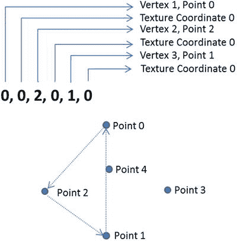

图 11-7.

使用预定义金字塔点进行三角形绕序

逆时针绕序顺序告诉摄像机系统，该面的“正面”朝上，或者在此例中，是从金字塔物体向外。为了构建正方形底面，我们再次使用三角形，使用两个三角形，但绕序是顺时针进行的。这是因为这些三角形的朝上面实际上朝向金字塔内部。通过顺时针绕序，它告诉摄像机以翻转的方式渲染这些面。这将营造出一个实心几何物体的视觉效果。


### MeshViews 与 DrawMode

`TriangleMesh` 对象本身无法直接添加和渲染，因为其几何体必须添加到可显示的 `Scenegraph` 节点对象中。JavaFX 8 通过 `MeshView` 类提供了这一功能。来自清单 11-10：

```
MeshView meshView = new MeshView(mesh);
```

`MeshView` 类不仅能够显示添加到其中的 `TriangleMesh`，还允许你自定义光照、填充、材质和其他特性。这在清单 11-10 中得到了演示。让我们使用新的 `buildPyramid()` 方法来展示 `MeshView` 类的灵活性。清单 11-11 使用 `buildPyramid()` 创建了一个金字塔，其材质为 `GoldenRod` 颜色的 `PhongMaterial`，并且 `DrawMode` 设置为 `LINE`。

```
/* 来自 TriangleMeshes.java */
//步骤 3a：创建一个带有颜色的金字塔并添加到场景中
//假设高度为 100，底部宽度（斜边）为 50。
Group pyramid1 = buildPyramid(100,200,Color.GOLDENROD,false,false);
Group pyramidGroup = new Group(pyramid1);
sceneRoot.getChildren().addAll(pyramidGroup);
清单 11-11.
创建单个金字塔
```

这将渲染出一个类似于图 11-8 的金字塔。`pyramid1` 对象的大部分内容不可见，因为默认的场景光照位置导致无法反射出大部分几何体。

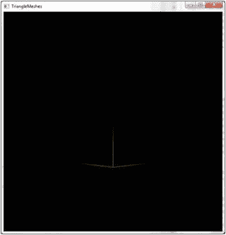

图 11-8.

使用默认光照的 TriangleMesh

为了在不受光照系统影响的情况下看到完整的几何体，请开启环境光照：

```
Group pyramid1 = buildPyramid(100,200,Color.GOLDENROD,true,false);
```

同时，我们将整个几何体向摄像机方向平移。

```
pyramid1.setTranslateZ(-100);
```

你将获得类似于图 11-9 的视图。你在 `TriangleMesh` 中定义的几何体现在清晰可见。

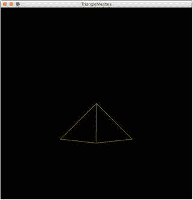

图 11-9.

使用环境光照的 TriangleMesh

将 `TriangleMesh` 对象放入 `MeshView` 对象和 `Group` 容器中，使得基本变换变得简单。对一个基本体进行旋转：

```
pyramid1.setRotationAxis(Rotate.Y_AXIS);
pyramid1.setRotate(45);
```

绕 Y 轴旋转 45 度后，效果应类似于图 11-10。

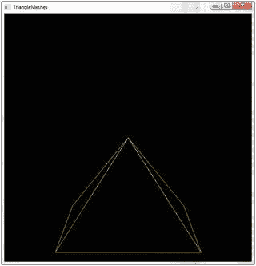

图 11-10.

旋转后的 TriangleMesh

要使用彩色侧面填充金字塔，请在 `buildPyramid()` 方法中使用 fill 参数：

```
Group pyramid1 = buildPyramid(100,200,Color.GOLDENROD, true, true);
```

这将提供类似于图 11-11 的视图。

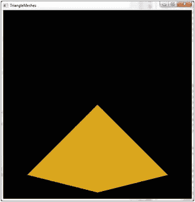

图 11-11.

使用 DrawMode.FILL 的 TriangleMesh

清单 11-12 展示了不同的变换组合，以体现新 `buildPyramid()` 方法的实用性。

```
/* 来自 TriangleMeshes.java */
//步骤 3b：使用 DrawMode FILL 创建并变换一个金字塔
Group pyramid2 = buildPyramid(100,200,Color.GOLDENROD,true,true);
//由于金字塔是一个组，它可以像基本体一样被平移和旋转
pyramid2.setTranslateX(-100);
pyramid2.setTranslateY(-100);
pyramid2.setRotationAxis(Rotate.Z_AXIS);
pyramid2.setRotate(180);
Group pyramidGroup = new Group(pyramid1,pyramid2);
sceneRoot.getChildren().addAll(pyramidGroup);
清单 11-12.
使用 DrawMode.FILL 创建并变换一个金字塔
```

清单 11-13 展示了 `buildPyramid()` 方法通过添加不同材质颜色的金字塔来改变每个金字塔外观的能力。

```
/* 来自 TriangleMeshes.java */
//步骤 3c：添加一些其他颜色的金字塔
Group pyramid3 = buildPyramid(100,200,Color.LAWNGREEN,true,true);
pyramid3.setTranslateX(100);
Group pyramid4 = buildPyramid(100,200,Color.LAWNGREEN,true,false);
pyramid4.setTranslateX(100);
pyramid4.setTranslateY(-100);
pyramid4.setRotationAxis(Rotate.Z_AXIS);
pyramid4.setRotate(180);
Group pyramidGroup = new Group(pyramid1,pyramid2,pyramid3,pyramid4);
sceneRoot.getChildren().addAll(pyramidGroup);
清单 11-13.
创建并变换不同颜色的金字塔
```

清单 11-12 和 11-13 清晰地展示了 `TriangleMesh` 和 `MeshView` 类在 3D 场景中的灵活性。将此代码添加到示例中，将提供类似于图 11-12 的视图。

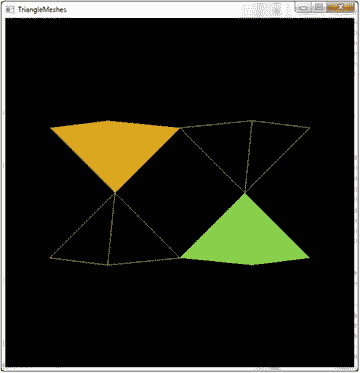

图 11-12.

多个自定义并变换后的金字塔

### 旋转摄像机！

新的金字塔看起来仍然有些扁平。你需要一种方法来让摄像机围绕金字塔旋转，就像卫星绕着一个原点旋转一样。事实上，清单 11-14 通过添加一个简单的鼠标处理器，并将鼠标移动转换为 `pyramidGroup` 自身的旋转变换，将 `pyramidGroup` 视为某种原点。

```
/* 来自 TriangleMeshes.java */
//步骤 4a：为旋转添加鼠标处理器
Rotate xRotate = new Rotate(0, Rotate.X_AXIS);
Rotate yRotate = new Rotate(0, Rotate.Y_AXIS);
pyramidGroup.getTransforms().addAll(xRotate,yRotate);
//使用绑定，这样你的旋转就不必重新创建
xRotate.angleProperty().bind(angleX);
yRotate.angleProperty().bind(angleY);
//仅在按下鼠标按钮时开始跟踪鼠标移动
scene.setOnMousePressed(event -> {
scenex = event.getSceneX();
sceney = event.getSceneY();
anchorAngleX = angleX.get();
anchorAngleY = angleY.get();
});
//仅在按下鼠标按钮时计算角度变化
scene.setOnMouseDragged(event -> {
angleX.set(anchorAngleX - (scenex -  event.getSceneY()));
angleY.set(anchorAngleY + sceney -  event.getSceneX());
});
清单 11-14.
固定原点的摄像机旋转鼠标处理器
```

这种摄像机控制与之前的示例不同，它实际上并不移动或旋转摄像机节点，而是移动场景中的对象。这给观察者和摄像机正在围绕场景旋转的错觉。这是一种用于查看面向内部场景的有效方法。诀窍是使用 JavaFX 绑定来更新一组现有的 Rotate 对象。这避免了事件处理器反复创建和替换各种变换对象。通过将此处理器添加到示例中并旋转它，你可以获得类似于图 11-13 的视角。

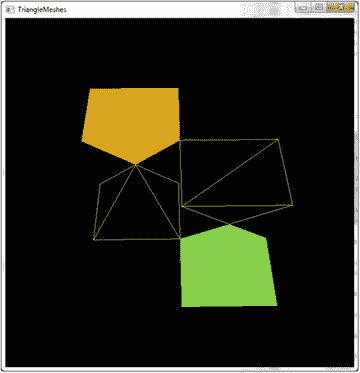

图 11-13.

围绕固定原点旋转摄像机

图 11-13 中显示的视图尤其好，因为它展示了各种金字塔的不同形态。特别值得注意的是金字塔底部的底面，它由两个三角形组成，采用顺时针缠绕，使得它们的“下”面朝外指向摄像机。


### 点亮灯光

在这个自定义金字塔示例中，我们已经走了很远，但 3D 几何图形看起来仍然有点卡通化。这是因为光照，特别是场景光照。要真正展示 3D 表面，你必须在场景中添加一个点光源。清单 11-15 为示例场景添加了一个简单的点光源。

```
/* 来自 TriangleMeshes.java */
//步骤 4b：添加点光源以显示镜面高光
PointLight light = new PointLight(Color.WHITE);
sceneRoot.getChildren().add(light);
light.setTranslateZ(-sceneWidth/2);
light.setTranslateY(-sceneHeight/2);
清单 11-15.
向场景添加点光源
```

清单 11-15 包含一些基本的平移操作，将光源移动到默认摄像机位置以外的位置，从而在每个填充的`Pyramid`的`PhongMaterials`上创建一些漂亮的镜面高光。将清单 11-15 添加到示例中并旋转摄像机，可以提供如图 11-14 所示的良好视图。

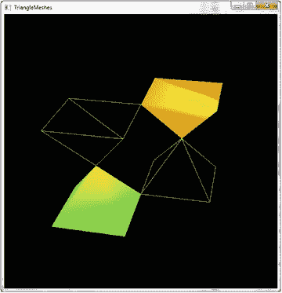

图 11-14.

点光源对各种金字塔 TriangleMesh 对象的影响

## 总结

正如本章开头所提到的，可以专门用一本书来讨论 JavaFX 9 的 3D 支持。有许多功能被提及但未讨论，因为它们需要整章的篇幅。整本书都致力于 3D 软件开发中的数学和抽象概念，因此这些内容没有详细讨论。

希望本章能浅尝辄止地介绍可能实现的功能，并希望能激发你学习 JavaFX 9 提供的新 3D 支持的兴趣。本章包含两个独立的运行示例，讨论了图元、摄像机节点、光照以及自定义几何体和三角形网格的用法。两个示例都展示了事件驱动的交互，并采用了不同的方法来通过键盘和鼠标操作摄像机或场景对象。你了解了一系列类，其中一些专门用于 3D 支持，另一些则足够通用，可以应用于 3D 或 2D 场景。利用本章提供的基础构件，可以开发出非常实用且高效的 3D 工具。

