# 12. JavaFX 与 Arduino

Arduino，一个开源电子原型平台，始于 2003 年，因此它几乎与我们今天理解的“物联网”（IoT）概念同时出现。事实上，像 Arduino 这样的低成本原型平台的出现，是促成这场新兴革命得以发生的基石之一，它同时支持了 DIY 理念和创客运动。

本章将快速介绍如何将 JavaFX 与 Arduino 板结合使用，来开发用于监控来自现实世界的数据或控制真实设备的桌面应用程序。

本章首先简要介绍可用的开发板，然后是微控制器编程所需的软件以及将其连接到计算机的步骤（无需任何 WiFi 或以太网扩展板解决方案）；最后，你将学习如何获取数据流、在 JavaFX 线程上表示数据以及控制设备。

## Arduino 开发板

Arduino 是一款带有微控制器的开源开发板。最知名的版本 Arduino Uno rev 3 基于 ATmega328 8 位 Atmel AVR 微控制器，而新的 Arduino Due 基于 Atmel SAM3X8E ARM Cortex-M3 CPU，是首款基于 32 位 ARM 内核的 Arduino 开发板。

得益于预编程的引导加载程序，程序可以直接从连接的计算机轻松上传到微控制器内存中。

Uno 提供 14 个数字 I/O 引脚和 6 个模拟输入，采用排母形式，因此可以安装扩展板，或者将简单的跳线连接到所需引脚。闪存为 32KB，时钟频率为 16MHz。更多详细信息可在此处查看：[`http://arduino.cc/en/Main/ArduinoBoardUno`](http://arduino.cc/en/Main/ArduinoBoardUno)。图 12-1 显示了 Uno 开发板的正面和背面视图。

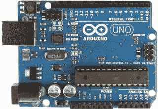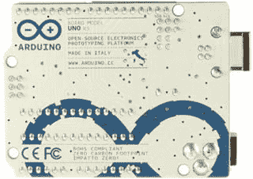

图 12-1.

Arduino Uno（正面和背面）

Due，如图 12-2 所示，将容量提升至 54 个数字 I/O 引脚和 14 个模拟引脚（12 个输入，2 个输出）。闪存现在为 512KB，时钟速度为 84MHz。更多详细信息可在此处查看：[`http://arduino.cc/en/Main/ArduinoBoardDue`](http://arduino.cc/en/Main/ArduinoBoardDue)。

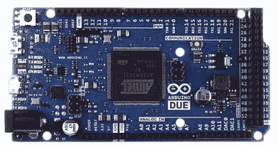

图 12-2.

Arduino Due（正面）

还有其他具有不同规格或组件的开发板。对于任何具体的应用，你应该仔细阅读[`http://arduino.cc/en/Main/Products`](http://arduino.cc/en/Main/Products)上的规格说明，选择适合你需求的开发板。

但值得一提的是，自 2016 年起，有一款有趣的新开发板问世：Arduino 101（美国）/ Genuino 101（美国以外地区）。如图 12-3 所示，它与英特尔合作设计，包含英特尔® Curie 模块，这是一个基于英特尔 Quark SE 系统级芯片的低功耗处理器，集成了运动传感器、蓝牙和电池充电功能。虽然它保持了与 Uno 相同的外形尺寸、相同的外设列表和相同的入门级价格，但它显著增加了板载低功耗蓝牙（Bluetooth LE）功能以及一个六轴加速度计和陀螺仪。

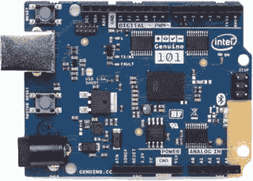

图 12-3.

Arduino 101 / Genuino 101（正面）

更多详细信息可在此处查看：[`https://www.arduino.cc/en/Main/ArduinoBoard101`](https://www.arduino.cc/en/Main/ArduinoBoard101)。

对于本章的示例，我们将使用 Genuino 101 开发板。如果你没有，有很多在线渠道可以购买，你可以通过此链接查看：[`https://store.arduino.cc`](https://store.arduino.cc)。

一旦你拥有了 Arduino 开发板，并且使用标准 USB 线缆（A 型插头转 B 型插头），你就可以将其连接到计算机，如图 12-4 所示。此连接将提供 5V 电压为开发板供电（检查绿色电源 LED 是否亮起），并提供一种从计算机对微控制器进行编程的方式。

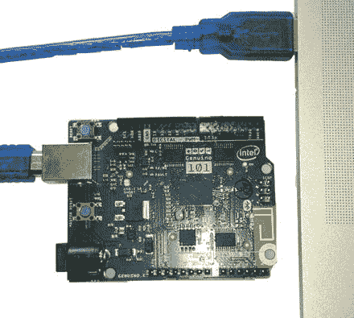

图 12-4.

连接到计算机的 Arduino

之后，在你对微控制器编程完成后，你可以使用外部电源，例如 9V 电池或 9 至 12V 直流适配器，根据所连接设备的不同，提供 250mA 至 1000mA 的电流，只需将 2.1mm 插头（中心正极）插入开发板的电源插孔即可。

## 对 Arduino 进行编程

任何了解 Arduino 的人都应该熟悉其 Arduino IDE，这是一个桌面开源应用程序，用于编写代码并将其上传到开发板，可在各个平台上运行。该 IDE 用 Java 编写，基于 Processing 和其他开源软件。

最近，出现了一个在线替代方案：新的 Arduino Web 编辑器可从任何浏览器访问，你可以在线编写草图，将其保存在云端，并始终拥有最新版本的 IDE，包括所有贡献的库和对新 Arduino 开发板的支持。


### Arduino Web 编辑器

Arduino Web 编辑器需要一次性安装插件，它允许你通过 USB 线缆或网络，将草图从浏览器上传到开发板上。设置此插件只需几个简单步骤：

1.  访问 Arduino Create 门户网站 [`https://create.arduino.cc/getting-started`](https://create.arduino.cc/getting-started)，然后点击 `Setup the Arduino Editor Plugin` 链接，如图 12-5 所示。

    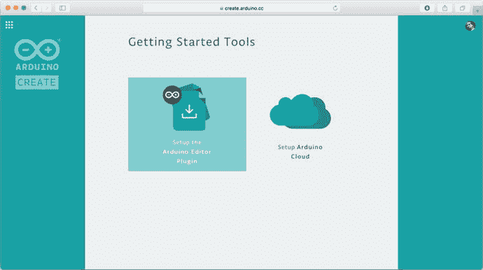

    图 12-5.

    Arduino 编辑器插件设置  
2.  点击“下一步”，根据你的平台，将插件下载到你的计算机上：[`http://create.arduino.cc/getting-started/plugin?page=2`](http://create.arduino.cc/getting-started/plugin?page=2) 。参见图 12-6。

    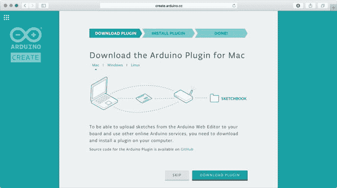

    图 12-6.

    下载 Arduino 插件  
3.  下载完成后，双击安装程序以启动安装流程，并按照安装程序中的步骤操作。  
4.  在流程结束时，你应该会在系统托盘图标（Windows）或 Mac 的菜单栏上看到 Arduino 插件图标。点击该托盘图标可链接到 Arduino Web 编辑器，或者如果你想暂停插件，也可点击，如图 12-7 所示。

    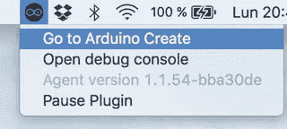

    图 12-7.

    Mac 上的托盘图标  
5.  Arduino Web 编辑器将在你的默认浏览器中打开，如图 12-8 所示。你需要注册并创建一个账户，以便跟踪你创建的不同草图，并访问其他在线功能。

    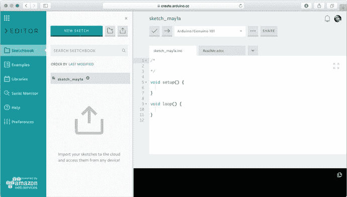

    图 12-8.

    Arduino Web 编辑器

### Arduino IDE

你也可以使用经典的桌面 IDE 对微控制器进行编程。为此，你需要先安装驱动程序和相应的软件。请访问 [`http://arduino.cc/en/Main/Software`](http://arduino.cc/en/Main/Software) 的“下载”部分，选择你的操作系统，并下载最新版本（在撰写本文时为 1.8.2）。请注意，对于 Arduino/Genuino 101 开发板，你至少需要 1.6.7 版本。

### Windows

下载 Windows 安装程序，然后双击它，按照图 12-9 所示的两个步骤进行操作。

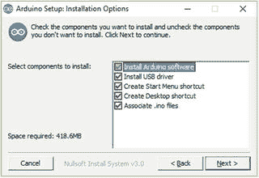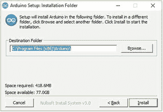

图 12-9.

在 Windows 上安装 Arduino IDE

在流程结束时，系统会要求你安装驱动程序。此时，将 Arduino 连接到计算机的 USB 端口，将建立一个 COM 连接。驱动程序应会自动安装。检查 Windows 设备管理器，确认在“端口”下能看到你的 Arduino 开发板已连接——展开“端口 (COM 和 LPT)”——你应该会看到一个 COM 端口，那就是你的 Arduino，如图 12-10 所示（本例中为 COM3）。

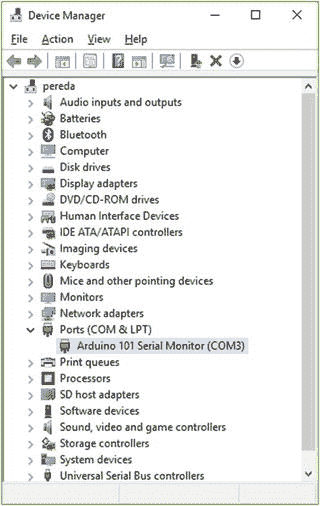

图 12-10.

Windows 中的 Arduino 串行端口

如果你在“其他设备”下的 Arduino 上发现一个黄色三角形，则需要手动安装驱动程序。右键单击 Arduino 并选择“更新驱动程序软件”。选择“浏览我的计算机以查找驱动程序软件”，然后找到 Arduino 安装文件夹下的 `Drivers` 文件夹。点击“下一步”。

系统会弹出一个安全窗口；选择“安装”。几秒钟后，一个成功窗口会通知你驱动程序已安装。

### MacOS X 或 Linux

在 MacOS X 上，下载文件并将其复制到你的“应用程序”文件夹。无需驱动程序。当你连接 Arduino 开发板时，你应该会看到它列在 `/dev/tty.usbmodemXXXX` 或 `/dev/tty.usbserialXXXX` 下。

在 Debian 发行版（例如，Raspberry Pi）上，你可以直接在终端中安装它：

```
$ sudo apt-get install arduino
```

对于其他发行版，你可以下载 32 位或 64 位的文件，解压，并安装所需的依赖项。

当你连接 Arduino 开发板时，你应该会看到它列在 `/dev/ttyACMX` 或 `/dev/ttyUSBX` 下。

### 运行 IDE

假设你的安装成功结束，启动应用程序；你将看到一个如图 12-11 所示的界面。

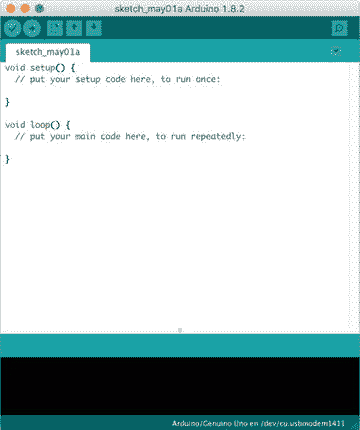

图 12-11.

Arduino IDE

首先要做的是选择“工具” ➤ “开发板”，然后从列表中选择正确的开发板。Arduino/Genuino Uno 指的是经典的 Arduino Uno 开发板。如果你第一次插入 Arduino/Genuino 101 开发板，Arduino IDE 会要求你安装一些软件包才能使用该开发板，如图 12-12 所示。

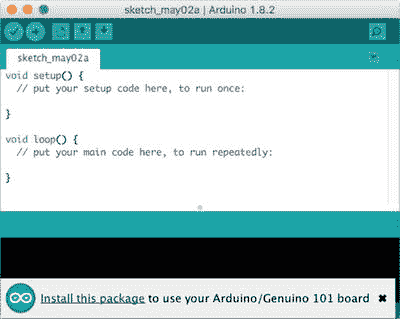

图 12-12.

101 开发板所需的库

点击该链接，“开发板管理器”将会出现。在“Intel Curie Boards by Intel”下，点击“更多信息”，然后按下“安装”按钮，如图 12-13 所示。几分钟后，软件包将安装完成。然后确保你从“工具” ➤ “开发板” ➤ “Arduino/Genuino 101”中选择了正确的开发板。

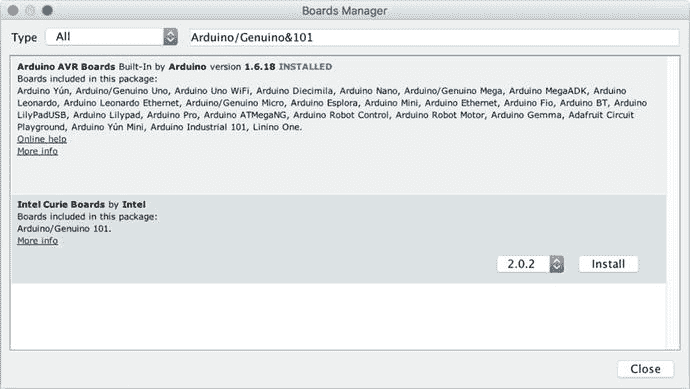

图 12-13.

安装 Intel Curie Boards 软件包

在“串行端口”下，选择开发板所连接的端口（例如，COM3 (Arduino/Genuino 101)）。当有多个选项时，找出正确端口的一个简单方法是拔掉开发板，查找消失的端口，然后重新插上，并选择该串行端口。

### Blink 示例

即使没有传感器（仪器或模拟/数字信号设备），你能做的最快测试是打开 Blink 示例（选择“文件” ➤ “示例” ➤ “01.Basics” ➤ “Blink”），如图 12-14 所示。Arduino 代码文件（称为草图）以扩展名 `.ino` 保存，位于按类别划分的 `Arduino/examples` 文件夹下。

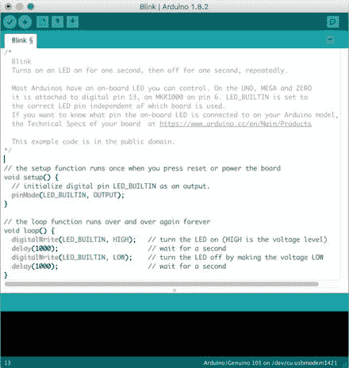

图 12-14.

Blink 草图（IDE 版本）

点击“上传”按钮（工具栏上左起第二个），等待状态栏上出现 `“Done uploading”` 消息。然后你应该会看到开发板上标有 L 的 LED 在闪烁。

如果你使用的是 Web 编辑器版本，请从左侧菜单中选择 Blink 示例（“示例” ➤ “01.Basics” ➤ “Blink”），如图 12-15 所示。确保你的开发板出现在右上角的下拉列表中，然后点击“上传”按钮（右箭头）。

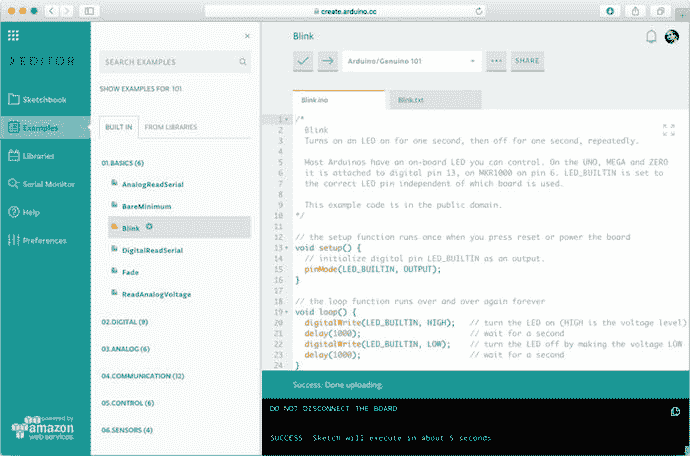

图 12-15.

Blink 草图（Web 编辑器版本）

开始使用 Arduino 开发板的示例代码的一个非常好的来源是 Arduino Playground：[`http://playground.arduino.cc/`](http://playground.arduino.cc/) 。你也可以访问项目中心网站 [`https://create.arduino.cc/projecthub/`](https://create.arduino.cc/projecthub/) ，那里有来自社区的大量项目集合。

要尝试大多数初级教程或你自己的实验，你需要一套基本的传感器和一小套电子元件。建议你购买 Arduino 开发板与电子元件捆绑在一起的入门套件。除了开发板，你还需要一根 USB 线缆、一块面包板、杜邦线、几种颜色的 LED、电阻、一个温度传感器、一个电位器、按钮开关等。


## 方向可视化器示例

本示例演示如何使用 Genuino 101 板载的六轴加速度计/陀螺仪读取加速度计和陀螺仪的 X、Y、Z 值。加速度计的值用于确定板子的方向，而陀螺仪则用于测量板子的角速度。该示例基于此链接：[`https://www.arduino.cc/en/Tutorial/Genuino101CurieIMUOrientationVisualiser`](https://www.arduino.cc/en/Tutorial/Genuino101CurieIMUOrientationVisualiser)。

所需的唯一硬件是 Arduino/Genuino 101 板。

该示例所需的软件是 Madgwick 库，可从库管理器中获取。使用 Arduino IDE，转到 项目 ➤ 加载库 ➤ 管理库。在那里，您可以搜索“Madgwick”并直接安装最新版本的库，如图 12-16 所示。该库的源代码可在 [`https://github.com/arduino-libraries/MadgwickAHRS`](https://github.com/arduino-libraries/MadgwickAHRS) 找到。

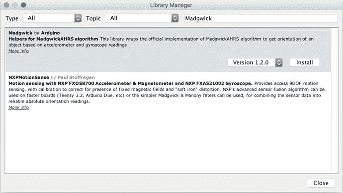

图 12-16.

安装 Madgwick 库

现在，从库文件夹中打开 `Visualize101.ino` 示例，该文件夹位于 `<用户>/Documents/Arduino/Libraries/Madgwick/examples/Visualize101`。您需要修改它，以便添加初始校准。清单 12-1 包含了修改后的源代码。

```
#include 
#include 
Madgwick filter;
unsigned long microsPerReading, microsPrevious;
float accelScale, gyroScale;
void setup() {
Serial.begin(9600);
while (!Serial);  // 等待串口打开
// 启动 IMU 和滤波器
CurieIMU.begin();
CurieIMU.setGyroRate(25);
CurieIMU.setAccelerometerRate(25);
filter.begin(25);
// 将加速度计量程设置为 2G
CurieIMU.setAccelerometerRange(2);
// 将陀螺仪量程设置为 250 度/秒
CurieIMU.setGyroRange(250);
// 开始陀螺仪校准
CurieIMU.autoCalibrateGyroOffset();
//  开始加速度校准...");
CurieIMU.autoCalibrateXAccelOffset(0);
CurieIMU.autoCalibrateYAccelOffset(0);
CurieIMU.autoCalibrateZAccelOffset(1);
// 启用陀螺仪/加速度偏移补偿
CurieIMU.setGyroOffsetEnabled(true);
CurieIMU.setAccelOffsetEnabled(true);
// 初始化变量以按正确速率更新
microsPerReading = 1000000 / 25;
microsPrevious = micros();
}
void loop() {
int aix, aiy, aiz;
int gix, giy, giz;
float ax, ay, az;
float gx, gy, gz;
float roll, pitch, heading;
unsigned long microsNow;
// 检查是否到了读取数据和更新滤波器的时间
microsNow = micros();
if (microsNow - microsPrevious >= microsPerReading) {
// 从 CurieIMU 读取原始数据
CurieIMU.readMotionSensor(aix, aiy, aiz, gix, giy, giz);
// 将原始数据转换为重力单位和度/秒单位
ax = convertRawAcceleration(aix);
ay = convertRawAcceleration(aiy);
az = convertRawAcceleration(aiz);
gx = convertRawGyro(gix);
gy = convertRawGyro(giy);
gz = convertRawGyro(giz);
// 更新滤波器，计算方向
filter.updateIMU(gx, gy, gz, ax, ay, az);
// 打印航向角、俯仰角和横滚角
roll = filter.getRoll();
pitch = filter.getPitch();
heading = filter.getYaw();
// Serial.print("方向: ");
Serial.print(heading);
Serial.print(" ");
Serial.print(pitch);
Serial.print(" ");
Serial.println(roll);
// 增加先前时间，以保持适当节奏
microsPrevious = microsPrevious + microsPerReading;
}
}
float convertRawAcceleration(int aRaw) {
// 因为我们使用的是 2G 量程
// -2g 映射到原始值 -32768
// +2g 映射到原始值 32767
float a = (aRaw * 2.0) / 32768.0;
return a;
}
float convertRawGyro(int gRaw) {
// 因为我们使用的是 250 度/秒量程
// -250 映射到原始值 -32768
// +250 映射到原始值 32767
float g = (gRaw * 250.0) / 32768.0;
return g;
}
清单 12-1.
包含校准的 Visualize101 源代码
```

运行 Web 编辑器，从 示例 ➤ 来自库 ➤ Madgwick 打开 Visualize101 项目，并包含校准，如图 12-17 所示。

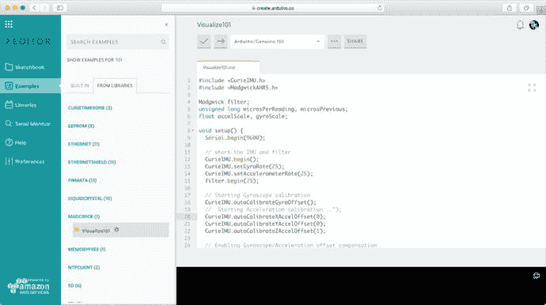

图 12-17.

Web 编辑器中的 Visualize101

确保您的板子已连接并选择了正确的端口。点击上传，几秒钟后项目将被编译并上传到板子。

您可以打开串口监视器，在手持板子并挥动时，查看打印出的航向角（偏航角）、俯仰角和横滚角（以度为单位）的值，如图 12-18 所示。

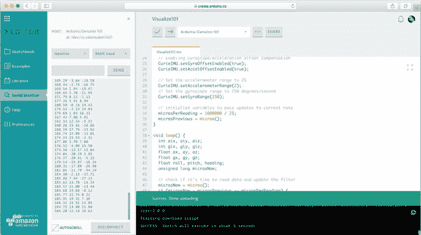

图 12-18.

运行 Visualize101

### 工作原理

该程序使用 CurieIMU 库中的函数从加速度计/陀螺仪获取数据。它有两个主要方法：`setup()` 和 `loop()`。

在 `setup()` 方法中，您通过将加速度计、陀螺仪和滤波器的采样率设置为 25Hz，加速度计量程设置为 2g，陀螺仪量程设置为 250 °/s，来配置串口速度和 CurieIMU 库。陀螺仪和加速度计最初都进行了校准。为此，建议您将 Arduino 板保持平稳并处于水平位置。

在 `loop()` 方法中，每 25 毫秒，您使用 CurieIMU 库中的函数获取加速度计和陀螺仪数据，并将原始数据转换为加速度（g）和角速度（°/s）。使用 Madgwick 库，这些值被转换为横滚角、俯仰角和偏航角，最终发送到串口。这些角度用于许多领域，例如导航，以定义物体的空间方向。

如果一切正常，是时候开始思考如何读取串口以获取这些测量值，以及如何在您的 JavaFX 应用程序中显示这些读数了。

## 串口读取

尽管您可以找到用于串口读取的第三方应用程序——例如 Windows 上的旧版 HyperTerminal、Linux 上的 Minicom 和 Mac 上的 Terminal——但您需要在您的应用程序中获取这些读数，为此，您需要一个执行该任务的 Java API。

请注意，串口读取是一项高度硬件相关的任务，它打破了 Java 跨平台的方法，因为您需要原生支持来访问端口。除了 Sun 的旧版 JavaComm API 之外，Java SE 发行版中没有捆绑用于通信的官方 API，因此您需要一个第三方库。

多年来，首选的串行通信 Java 库是 RXTX。它最初由 Trent Jarvi 开发，并在 LGPL v 2.1+链接覆盖控制接口许可下分发，其最后一个版本（2010 年的 2.2pre2）可在 [`http://rxtx.qbang.org/`](http://rxtx.qbang.org/) 获取。

但这个库已停止维护，甚至 Arduino IDE 也将其替换为一个新的库——Java Simple Serial Connector (jSSC)——因为它被大量用于 IDE 和板子之间的通信。


### Java 简易串行连接器

Java 简易串行连接器（jSSC）由 Alexey Sokolov 开发，采用 GNU Lesser GPL 许可证。截至撰写本文时，最新版本（jSSC-2.8.0）于 2014 年 1 月发布，该库被选为 Arduino IDE（从 1.5.6 版本开始）中替代 RXTX 的库。

jSSC 适用于所有平台和操作系统。你会注意到它比 RXTX 更快，并且修复了多个错误。jSSC 以一个简单的 JAR 文件形式提供，其中包含了所有必要的本地文件，因此你无需处理本地安装，它会在运行时自动将这些文件添加到类路径中。

包含最新版本的 JAR 文件可从 [`https://github.com/scream3r/java-simple-serial-connector/releases`](https://github.com/scream3r/java-simple-serial-connector/releases) 下载。如果你在 NetBeans 中将其添加为库或打开它，你将看到它的类（`jssc` 包）和本地内容（`libs` 包）。

## JavaFX、图表 API 和方向

在接下来的示例中，你将学习如何设计一个简单的 JavaFX 应用程序，该程序从 Arduino 板获取方向读数并将其显示在图表中。为清晰起见，该示例使用了两个类——一个用于串行读数（如清单 12-2 所示），另一个用于图表和 JavaFX 舞台（如清单 12-3 所示）。

你将通过使用一个 `StringProperty` 来绑定这些类（`Serial` 和 `OrientationFX`），该属性包含从串行端口读取的最后一行。通过监听 JavaFX 线程中此属性的变化，你将知道何时有新的读数需要添加到图表中。

### 创建模块项目

让我们从在 NetBeans 中创建一个模块项目开始，如图 12-19 所示。设置项目名称 `OrientationFX` 时，请确保选择 JDK 9 平台，如图 12-20 所示。

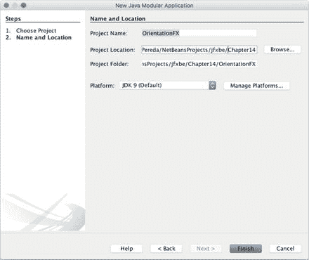

图 12-20.

项目名称和位置

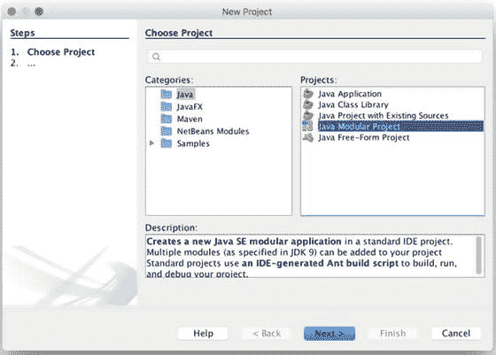

图 12-19.

在 NetBeans 中添加模块项目

点击“完成”，将创建新的空项目。右键单击该项目，选择“新建” ➤ “模块”，并将其命名为 `com.jfxbe.orientationfx`，如图 12-21 所示。点击“完成”。将创建名为 `module-info.java` 的空类。

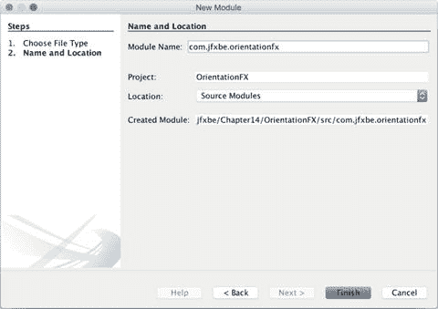

图 12-21.

模块名称

为方便起见，将 `jssc.jar` 放置在项目下的 `libs` 文件夹中，然后将其添加为库（选择“库” ➤ “添加 JAR/文件夹”）。

现在，你可以在模块描述符中添加 `requires` 子句，用于 `javafx.controls`，以包含 JavaFX `controls` 和 `base` 模块，以及用于 `jssc` 的子句，如清单 12-2 所示。

```
module com.jfxbe.orientationfx {
requires javafx.controls;
requires jssc;
}
清单 12-2.
Module-info 类
```

现在，你可以向 `com.jfxbe.orientationfx` 模块添加一个新包，并向其中添加一个新类，名为 `OrientationFX`。该类将扩展 `Application`。请注意，由于模块描述符中的 `requires` 子句，该类将可供导入。你只需添加一个 `Scene` 并显示舞台，如清单 12-3 所示。

```
public class OrientationFX extends Application {
@Override
public void start(Stage primaryStage) throws Exception {
Scene scene = new Scene(new StackPane(), 1000, 600);
primaryStage.setScene(scene);
primaryStage.show();
}
}
清单 12-3.
定义 OrientationFX 类
```

最后，你可以使用 `exports` 子句将此包添加到模块中，如清单 12-4 所示，并运行应用程序以确保初始设置正确。应该会出现一个空舞台。

```
module com.jfxbe.orientationfx {
requires javafx.controls;
requires jssc;
exports com.jfxbe.orientationfx;
}
清单 12-4.
最终的 Module-info 类
```

### 串行通信

你可以将 `Serial` 作为串行通信的类添加到包中。清单 12-5 包含其源代码。

```
package com.jfxbe.orientationfx;
import java.util.Arrays;
import java.util.List;
import javafx.beans.property.SimpleStringProperty;
import javafx.beans.property.StringProperty;
import jssc.SerialPort;
import jssc.SerialPortException;
import jssc.SerialPortList;
public class Serial {
/* 常用串行端口列表。根据需要添加更多或移除不需要的 */
private static final List USUAL_PORTS = Arrays.asList(
"/dev/cu.usbmodem1411", "/dev/tty.usbmodem1421", // Mac OS X
"/dev/usbdev","/dev/ttyUSB","/dev/ttyACM", "/dev/serial", // Linux
"COM3","COM4","COM5","COM6" // Windows
);
private final String ardPort;
private SerialPort serPort;
public static final String SEPARATOR = " ";
private static final String LINE_SEPARATOR = "\r\n";
private StringBuilder sb = new StringBuilder();
private final StringProperty line = new SimpleStringProperty("");
public Serial() {
this("");
}
public Serial(String port) {
ardPort  =port;
}
/* connect() 方法查找连接了 Arduino 板的有效串行端口。
* 如果找到，则打开该端口并添加一个监听器，这样每次
* 返回一行时，stringProperty 都会被设置为该行。
* 为此，使用 StringBuilder 存储字符，并在找到 '\r\n' 时
* 提取行内容。
*/
public boolean connect(){
Arrays.asList(SerialPortList.getPortNames())
.stream()
.filter(name ->
((!ardPort.isEmpty() && name.equals(ardPort)) ||
(ardPort.isEmpty() &&
USUAL_PORTS.stream()
.anyMatch(p -> name.startsWith(p)))))
.findFirst()
.ifPresent(name -> {
try {
serPort = new SerialPort(name);
System.out.println("正在连接到 " + serPort.getPortName());
if (serPort.openPort()) {
serPort.setParams(SerialPort.BAUDRATE_9600,
SerialPort.DATABITS_8,
SerialPort.STOPBITS_1,
SerialPort.PARITY_NONE);
serPort.setEventsMask(SerialPort.MASK_RXCHAR);
serPort.addEventListener(event -> {
if (event.isRXCHAR()) {
try {
sb.append(serPort.readString(event.getEventValue()));
String ch = sb.toString();
if (ch.endsWith(LINE_SEPARATOR)) {
// 添加时间戳
line.set(Long.toString(System.currentTimeMillis())
.concat(SEPARATOR)
.concat(ch.substring(
0, ch.indexOf(LINE_SEPARATOR))));
sb = new StringBuilder();
}
} catch (SerialPortException e) {
System.out.println("串行错误: " + e.toString());
}
}
});
}
} catch (SerialPortException ex) {
System.out.println("错误: 端口 '" + name + "': " + ex.toString());
}
});
return serPort != null;
}
public void write(String text) {
try {
serPort.writeBytes(text.getBytes());
} catch (SerialPortException ex) {
System.out.println("错误: 写入 '" + text + "': " + ex.toString());
}
}
public void disconnect() {
if (serPort != null) {
try {
serPort.removeEventListener();
if (serPort.isOpened()) {
serPort.closePort();
}
} catch (SerialPortException ex) {
System.out.println("错误关闭端口异常: " + ex.toString());
}
System.out.println("断开连接: 通信端口已关闭。");
}
}
public StringProperty getLine() {
return line;
}
public String getPortName() {
return serPort != null ? serPort.getPortName() : "";
}
}
清单 12-5.
Serial 类源代码
```


### 工作原理

首先请注意，如果你按照说明正确包含了 `jssc.jar`，那么 `jSSC` 的导入是可用的。接下来，你需要设置一个可能连接 Arduino 板的合适端口名称列表。这个列表可以扩展到你系统中的其他端口，也可以删除来自其他平台的端口。`ardPort` 变量可以通过构造函数设置端口名称，此时列表将不会被使用。

```
private static final List USUAL_PORTS = Arrays.asList(
"/dev/cu.usbmodem1411", "/dev/tty.usbmodem1421", // Mac OS X
"/dev/usbdev","/dev/ttyUSB","/dev/ttyACM", "/dev/serial", // Linux
"COM3","COM4","COM5","COM6" // Windows
);
private final String ardPort;
public Serial() {
this("");
}
public Serial(String port) {
ardPort  =port;
}
```

在 `connect()` 方法中，遍历系统中找到的有效串口列表。使用 lambda 表达式过滤这个集合，以便获取与 `ardPort` 值匹配的项（如果已设置），否则获取与 `USUAL_PORTS` 列表中的某个端口匹配的项：

```
public boolean connect(){
Arrays.asList(SerialPortList.getPortNames())
.stream()
.filter(name ->
((!ardPort.isEmpty() && name.equals(ardPort)) ||
(ardPort.isEmpty() &&
USUAL_PORTS.stream()
.anyMatch(p -> name.startsWith(p)))))
.findFirst()
```

如果找到了有效的串口，你可以尝试打开它，并为串口通信设置几个常用参数：

```
.ifPresent(name -> {
try {
serPort = new SerialPort(name);
System.out.println("Connecting to " + serPort.getPortName());
if (serPort.openPort()) {
serPort.setParams(SerialPort.BAUDRATE_9600,
SerialPort.DATABITS_8,
SerialPort.STOPBITS_1,
SerialPort.PARITY_NONE);
serPort.setEventsMask(SerialPort.MASK_RXCHAR);
```

由于你将监听串口，因此需要添加一个监听器，该监听器会对每个 `SerialPortEvent` 做出响应，它通过输入缓冲区中是否存在字节来检测事件。字节数由 `event.getEventValue()` 确定。当缓冲区中有字节时，`readString(int byteCount)` 方法会返回数据。你使用一个 `StringBuilder` 来存储所有读取的内容，并评估字符中是否存在回车和换行 `("\r\n"`) 序列。如果找到，则提取该行文本并重置构建器。使用 `StringProperty` 来存储该行，以便 JavaFX 线程可以监听该可观察对象的变化（通过 `getLine()` 方法暴露；参见本章后面的清单 12-6）。你会在字符串中添加一个时间戳，以记录读取的时刻。当测量值相同时，跟踪时间也有助于在图表上按顺序显示它们。

```
serPort.addEventListener(event -> {
if (event.isRXCHAR()) {
try {
sb.append(serPort.readString(event.getEventValue()));
String ch = sb.toString();
if (ch.endsWith(LINE_SEPARATOR)) {
// 添加时间戳
line.set(Long.toString(System.currentTimeMillis())
.concat(SEPARATOR)
.concat(ch.substring(
0, ch.indexOf(LINE_SEPARATOR))));
sb = new StringBuilder();
}
} catch (SerialPortException e) {
System.out.println("Serial error: " + e.toString());
}
}
});
```

请注意，如果你需要一次读取多个测量值，则必须在 Arduino 草图中使用相同的分隔符，以便将它们正确拆分为单独的读数。

最后，`disconnect()` 方法负责移除监听器并关闭端口：

```
public void disconnect() {
if (serPort != null) {
try {
serPort.removeEventListener();
if (serPort.isOpened()) {
serPort.closePort();
}
} catch (SerialPortException ex) {
System.out.println("ERROR closing port exception: " + ex.toString());
}
System.out.println("Disconnecting: comm port closed.");
}
}
```

### 测试串口通信

在进入图表 API 之前，让我们在 `Application` 类中添加一个快速测试，如清单 12-6 所示。在启动应用程序时打开串口，并在应用程序关闭时关闭它。

```
public class OrientationFX extends Application {
private Serial serial;
@Override
public void start(Stage primaryStage) throws Exception {
Scene scene = new Scene(new StackPane(), 800, 600);
primaryStage.setScene(scene);
primaryStage.show();
serial = new Serial();
serial.getLine().addListener((obs, ov, nv) -> {
String[] split = nv.split("\\s");
System.out.println("Orientation " + split[1] + " " + split[2] + " " + split[3]);
});
serial.connect();
}
@Override
public void stop() throws Exception {
if (serial != null) {
serial.disconnect();
}
}
}
清单 12-6.
测试串口通信
```

运行测试，看看是否能在控制台中看到方向值。

```
Connecting to /dev/tty.usbmodem1421
208.50 -1.67 -0.42
208.48 -2.14 -0.20
208.49 -1.75 -0.42
208.46 -2.11 -0.12
208.47 -1.79 -0.43
Disconnecting: comm port closed.
```

### JavaFX 图表 API

自 JavaFX 2.0 版本以来，就提供了带有两个轴（柱状图、面积图、折线图、气泡图或散点图）的图表，或者不带轴的饼图。每个图表都是一个节点，因此可以像其他任何节点一样添加到场景中。

在此示例中，你将添加一个 `LineChart` 来绘制三个方向角。这需要三个系列来绘制读数，每个点使用 `XYChart.Data` 作为值对，每个轴一个值。

为了方便起见，当系列的大小超过 300 个点时，将移除第一个值。清单 12-7 展示了 `ArduinoChart` 类，它创建了一个图表容器并处理任何可能的串口事件。

```
/**
* @author Jose Pereda
*/
public class ArduinoChart {
private static final int SIZE_MAX = 300;
private LineChart chart;
private Series rollSeries, pitchSeries, yawSeries;
private NumberAxis xAxis, yAxis;
private Label labelRoll, labelPitch, labelYaw;
public VBox createArduinoChart() {
xAxis = new NumberAxis();
xAxis.setLabel("时间");
xAxis.setAutoRanging(true);
xAxis.setForceZeroInRange(false);
xAxis.setTickLabelFormatter(new StringConverter() {
@Override
public String toString(Number t) {
return new SimpleDateFormat("HH:mm:ss")
.format(new Date(t.longValue()));
}
@Override
public Number fromString(String string) {
throw new UnsupportedOperationException("Not supported yet.");
}
});
yAxis = new NumberAxis();
yAxis.setLabel("角度 (º)");
chart = new LineChart(xAxis, yAxis);
chart.setCreateSymbols(true);
chart.setAnimated(false);
chart.setLegendVisible(true);
chart.setTitle("横滚角/俯仰角/偏航角");
rollSeries = new Series();
rollSeries.setName("横滚角 (º)");
pitchSeries = new Series();
pitchSeries.setName("俯仰角 (º)");
yawSeries = new Series();
yawSeries.setName("偏航角 (º)");
chart.getData().addAll(rollSeries, pitchSeries, yawSeries);
labelRoll = new Label();
labelPitch = new Label();
labelYaw = new Label();
final HBox hBox = new HBox(new Label("数值: "), labelRoll, labelPitch, labelYaw);
hBox.getStyleClass().add("box");
final VBox vBox = new VBox(chart, hBox);
vBox.getStyleClass().add("box");
return vBox;
}
public void processEvent(long time, double roll, double pitch, double yaw) {
rollSeries.getData().add(new Data(time, roll));
labelRoll.setText("横滚角: " + String.format("%3.2f º", roll));
if (rollSeries.getData().size() > SIZE_MAX) {
rollSeries.getData().remove(0);
}
pitchSeries.getData().add(new Data(time, pitch));
labelPitch.setText("俯仰角: " + String.format("%3.2f º", pitch));
if (pitchSeries.getData().size() > SIZE_MAX) {
pitchSeries.getData().remove(0);
}
yawSeries.getData().add(new Data(time, yaw));
labelYaw.setText("偏航角: " + String.format("%3.2f º", yaw));
if (yawSeries.getData().size() > SIZE_MAX) {
yawSeries.getData().remove(0);
}
}
}
清单 12-7.
ArduinoChart 类
```

清单 12-8 展示了 `OrientationFX`（即 `Application` 类）的代码，你将在其中添加一个 `BorderPane`，在顶部包含一对按钮，用于启动和停止串口通信，并在中央放置 `ArduinoChart` 实例。


```
/**
* @author Jose Pereda
*/
public class OrientationFX extends Application {
private static final double OFFSET_YAW = -180;
private Serial serial;
private ArduinoChart arduinoChart;
private TextField textYaw;
private final BooleanProperty connection = new SimpleBooleanProperty();
private final ChangeListener listener = (obs, ov, nv) -> {
String[] split = nv.split("\\s");
long time = Long.parseLong(split[0]);
double offset = OFFSET_YAW;
if (!textYaw.getText().isEmpty()) {
try {
offset = Double.parseDouble(textYaw.getText());
} catch (NumberFormatException nfe) { }
}
double yaw = Double.parseDouble(split[1]) + offset;
double pitch = - Double.parseDouble(split[2]);
double roll = - Double.parseDouble(split[3]);
Platform.runLater(() -> {
arduinoChart.processEvent(time, roll, pitch, yaw);
});
};
@Override
public void start(Stage primaryStage) throws Exception {
arduinoChart = new ArduinoChart();
BorderPane root = new BorderPane();
Button buttonStart = new Button();
buttonStart.setText("Start");
buttonStart.setOnAction(e -> startSerial());
Button buttonStop = new Button();
buttonStop.setText("Stop");
buttonStop.setOnAction(e -> stopSerial());
Label labelConnection = new Label("Not connected");
connection.addListener((obs, ov, nv) -> labelConnection.setText(nv ?
"Connected to: " + serial.getPortName() : "Not connected"));
labelConnection.setPrefWidth(400);
textYaw = new TextField("" + OFFSET_YAW);
HBox top = new HBox(buttonStart, buttonStop, new Label("Yaw Offset (º): "), textYaw);
top.getStyleClass().add("box");
root.setTop(top);
final VBox chartBox = arduinoChart.createArduinoChart();
chartBox.setPrefWidth(500);
HBox center = new HBox(chartBox);
center.getStyleClass().add("box");
center.setPrefHeight(500);
root.setCenter(center);
HBox bottom = new HBox(labelConnection);
bottom.getStyleClass().add("box");
root.setBottom(bottom);
Scene scene = new Scene(root, 1000, 600);
scene.getStylesheets().add(OrientationFX
.class.getResource("arduino.css").toExternalForm());
primaryStage.setTitle("OrientationFX");
primaryStage.setScene(scene);
primaryStage.show();
}
@Override
public void stop(){
stopSerial();
}
private void startSerial(){
if (serial == null) {
serial = new Serial();
}
serial.getLine().addListener(listener);
serial.connect();
connection.set(!serial.getPortName().isEmpty());
}
private void stopSerial(){
if (serial != null) {
serial.disconnect();
serial.getLine().removeListener(listener);
connection.set(false);
serial = null;
}
}
}
列表 12-8.
OrientationFX 类
```

列表 12-9 展示了作为应用程序样式表添加的 CSS 文件。

```
.root {
-fx-background-color: derive(beige, 60%);
-fx-font: 16px "Tahoma";
}
.box {
-fx-padding: 10px;
-fx-spacing: 20px;
-fx-alignment: center-left;
}
.chart {
-fx-padding: 0px;
}
.chart-plot-background {
-fx-background-color:  linear-gradient(to bottom, derive(beige, 40%), derive(beige, 20%));
}
.axis:bottom {
-fx-border-color: derive(beige, -20%) transparent transparent transparent;
}
.axis:left {
-fx-border-color: transparent derive(beige, -20%) transparent transparent;
}
.axis-tick-mark,
.axis-minor-tick-mark,
.chart-vertical-grid-lines,
.chart-horizontal-grid-lines,
.chart-vertical-zero-line,
.chart-horizontal-zero-line {
-fx-stroke: derive(beige,-20%);
}
.chart-legend {
-fx-background-color: linear-gradient(to bottom, derive(beige,40%), derive(beige,20%));
-fx-padding: 10px;
}
.chart-series-line {
-fx-stroke-width: 3px;
}
.default-color0.chart-series-line { -fx-stroke: blueviolet; }
.default-color1.chart-series-line { -fx-stroke: orangered; }
.default-color2.chart-series-line { -fx-stroke: firebrick; }
.default-color0.chart-line-symbol {
-fx-background-color: transparent, blueviolet;
-fx-background-radius: 3px;
}
.default-color1.chart-line-symbol {
-fx-background-color: transparent, orangered;
-fx-background-radius: 3px;
}
.default-color2.chart-line-symbol {
-fx-background-color: transparent, firebrick;
-fx-background-radius: 3px;
}
列表 12-9.
arduino.css 文件
```

### 构建并运行项目

若要从 NetBeans 构建并运行项目，请单击“运行项目”。请确保已将 `com.jfxbe.orientationfx.OrientationFX` 设置为 `mainClass`（选择“属性” ➤ “运行”）。

若要在 Java 9 环境下从命令行构建模块并运行项目，请执行列表 12-10 中的步骤。请注意，为了构建模块，你需要使用 `module-path` 选项包含 `jssc.jar` 文件。

```
javac --module-path libs/jssc.jar -d mods/com.jfxbe.orientationfx
$(find src/com.jfxbe.orientationfx -name "*.java")
cp src/com.jfxbe.orientationfx/classes/com/jfxbe/orientationfx/arduino.css
mods/com.jfxbe.orientationfx/com/jfxbe/orientationfx
java --module-path mods:libs -m com.jfxbe.orientationfx/com.jfxbe.orientationfx.OrientationFX
列表 12-10.
运行 OrientationFX 项目
```

如果一切就绪，并且你已经插入了 Arduino 101 开发板，那么你应该能够握住它并挥动它，得到类似图 12-22 所示的效果。

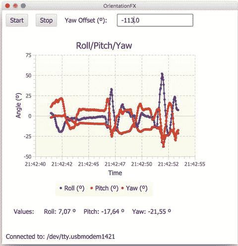

图 12-22.

运行 OrientationFX 示例


### 工作原理

当应用程序启动时，它会创建一个 `ArduinoChart` 实例。

```
@Override
public void start(Stage primaryStage) throws Exception {
arduinoChart = new ArduinoChart();
```

在 `arduinoChart` 类内部包含一个 `LineChart`，它有三个序列，每个序列接收成对的数值以绘制到各个坐标轴上，这些坐标轴是 `NumberAxis` 实例。这些序列定义了若干限制：每个序列的最大数据点数为 300：

```
private static final int SIZE_MAX = 300;
private LineChart chart;
private Series rollSeries, pitchSeries, yawSeries;
private NumberAxis xAxis, yAxis;
```

然后，通过创建两个坐标轴来构建图表。为了让 `xAxis` 显示格式化后的数据，本示例重写了 `toString()` 方法，使得每个以毫秒为单位的长整型数值都会以 `HH:mm:ss` 格式显示：

```
public VBox createArduinoChart() {
xAxis = new NumberAxis();
xAxis.setLabel("时间");
xAxis.setAutoRanging(true);
xAxis.setForceZeroInRange(false);
xAxis.setTickLabelFormatter(new StringConverter() {
@Override
public String toString(Number t) {
return new SimpleDateFormat("HH:mm:ss")
.format(new Date(t.longValue()));
}
@Override
public Number fromString(String string) {
throw new UnsupportedOperationException("暂不支持。");
}
});
yAxis = new NumberAxis();
yAxis.setLabel("角度 (º)");
```

接着，通过指定坐标轴来创建图表。它设置了一些属性：`setCreateSymbols(true)` 会在序列的每个数据点上绘制一个大的白色圆圈。你可以通过 CSS 调整默认大小和颜色。`setAnimated(false)` 避免了在添加新数据点后图表的动画效果。由于你以高频率绘制数据点，这样设置效果更好。而对于较低频率，则应将其设置为 `true` 以创建平滑的过渡效果。`setLegendVisible(true)` 会显示带有序列名称的图例：

```
chart = new LineChart(xAxis, yAxis);
chart.setCreateSymbols(true);
chart.setAnimated(false);
chart.setLegendVisible(true);
chart.setTitle("横滚角/俯仰角/偏航角");
```

然后，创建三个序列，为它们设置名称（这些名称将显示在图例框中），并将它们添加到 `Data` 图表中，该图表是一个 `Series` 的 `ObservableList`：

```
rollSeries = new Series();
rollSeries.setName("横滚角 (º)");
pitchSeries = new Series();
pitchSeries.setName("俯仰角 (º)");
yawSeries = new Series();
yawSeries.setName("偏航角 (º)");
chart.getData().addAll(rollSeries, pitchSeries, yawSeries);
```

最后，将图表添加到一个 `VBox` 中，同时还有一个包含即时数值标签的 `HBox`：

```
labelRoll = new Label();
labelPitch = new Label();
labelYaw = new Label();
final HBox hBox = new HBox(new Label("数值: "), labelRoll, labelPitch, labelYaw);
hBox.getStyleClass().add("box");
final VBox vBox = new VBox(chart, hBox);
vBox.getStyleClass().add("box");
return vBox;
}
```

回到应用程序类，将创建一个 `listener`，用于将串口上出现新行（对应来自 Arduino 101 的方向角度读数）与将这些值作为新数据对添加到序列中的操作绑定起来。为此，你将 x 坐标值设置为添加读数时的时间（以毫秒为单位，在图表上会格式化为 `HH:mm:ss`），y 坐标值则是 `String nv` 中 Arduino 报告的任一角度测量值的双精度浮点数。你需要将字符串解析为双精度浮点数。对于偏航角，你允许通过 `TextField` 添加一个偏移值，因为校准后，该角度并不总是重置为 0°。另外，请注意俯仰角和横滚角前的负号：这是由于 Arduino 和 JavaFX 之间坐标系变化导致的。

```
private final ChangeListener listener = (obs, ov, nv) -> {
String[] split = nv.split("\\s");
long time = Long.parseLong(split[0]);
double offset = OFFSET_YAW;
if (!textYaw.getText().isEmpty()) {
try {
offset = Double.parseDouble(textYaw.getText());
} catch (NumberFormatException nfe) { }
}
double yaw = Double.parseDouble(split[1]) + offset;
double pitch = - Double.parseDouble(split[2]);
double roll = - Double.parseDouble(split[3]);
```

通过使用 `Platform.runlater()`，你可以将数值传递给 `ArduinoChart`，以便在图表中渲染它们。这是强制性的，因为 `Serial` 任务在 JavaFX 线程之外运行。使用 `Platform.runlater()` 不仅可以将用传入数据填充序列的任务放入 JavaFX 线程，还能给场景图提供渲染图表所需的时间。如果速率过高，某些角度可能无法被处理。

```
Platform.runLater(() -> {
arduinoChart.processEvent(time, roll, pitch, yaw);
});
};
```

由于序列数据可能无限增长，为避免内存问题，你设置了 `SIZE_MAX` 值为 300 个数据点，并在超出该限制时移除序列中的第一个数据点。

```
public void processEvent(long time, double roll, double pitch, double yaw) {
rollSeries.getData().add(new Data(time, roll));
labelRoll.setText("横滚角: " + String.format("%3.2f º", roll));
if (rollSeries.getData().size() > SIZE_MAX) {
rollSeries.getData().remove(0);
}
pitchSeries.getData().add(new Data(time, pitch));
labelPitch.setText("俯仰角: " + String.format("%3.2f º", pitch));
if (pitchSeries.getData().size() > SIZE_MAX) {
pitchSeries.getData().remove(0);
}
yawSeries.getData().add(new Data(time, yaw));
labelYaw.setText("偏航角: " + String.format("%3.2f º", yaw));
if (yawSeries.getData().size() > SIZE_MAX) {
yawSeries.getData().remove(0);
}
}
```

图表准备好后，你创建场景，将其添加到舞台，最后显示出来。该示例创建了一个 `BorderPane`，因此在中央区域添加图表，在底部添加一个标签以显示连接状态（包括端口名称）。注意对根面板的样式设置。

```
BorderPane root = new BorderPane();
final VBox chartBox = arduinoChart.createArduinoChart();
chartBox.setPrefWidth(500);
HBox center = new HBox(chartBox); //, arduino3D.createArduino3D());
center.getStyleClass().add("box");
center.setPrefHeight(500);
root.setCenter(center);
Scene scene = new Scene(root, 600, 600);
scene.getStylesheets().add(OrientationFX
.class.getResource("arduino.css").toExternalForm());
primaryStage.setTitle("OrientationFX");
primaryStage.setScene(scene);
primaryStage.show();
```

最后，添加两个按钮用于启动和停止串口任务，以及一个用于修改偏航角偏移量的 `textfield`：

```
Button buttonStart = new Button();
buttonStart.setText("启动");
buttonStart.setOnAction(e -> startSerial());
Button buttonStop = new Button();
buttonStop.setText("停止");
buttonStop.setOnAction(e -> stopSerial());
textYaw = new TextField("" + OFFSET_YAW);
HBox top = new HBox(buttonStart, buttonStop, new Label("偏航角偏移 (º): "), textYaw);
top.getStyleClass().add("box");
root.setTop(top);
```

在 `startSerial` 方法中，你可以尝试打开串口并开始读取数据。监听器将被添加到 `serial.getLine()`，并且在这种情况下 `connection` 将被设置为 `true`：

```
private void startSerial(){
if (serial == null) {
serial = new Serial();
}
serial.getLine().addListener(listener);
serial.connect();
connection.set(!serial.getPortName().isEmpty());
}
```

每当应用程序关闭时，必须移除 `listener` 并调用 `serial.disconnect()` 方法，以正确关闭串口连接（参见清单 12-5）。

```
private void stopSerial(){
if (serial != null) {
serial.disconnect();
serial.getLine().removeListener(listener);
connection.set(false);
serial = null;
}
}
```


### 添加更多功能

如果你已经走到这一步，并且示例运行正常，那么你可能会想通过一项新的额外功能来继续升级应用程序。如果能以某种方式渲染一个 JavaFX 3D Arduino 板，并根据来自真实 Arduino 的方向角度来旋转它，那就太好了。

清单 12-11 包含了 `Arduino3D` 类的源代码，该类使用几个 JavaFX 3D `Box` 节点模拟了一个非常简单的 3D 板。

```
public class Arduino3D {
private static final int SIZE = 5;
private Affine affine;
private final List averageRoll = new ArrayList();
private final List averagePitch = new ArrayList();
private final List averageYaw = new ArrayList();
public VBox createArduino3D() {
Box board = new Box(300, 10, 200);
board.setMaterial(new PhongMaterial(Color.web("#008282")));
Box longHeader = new Box(210, 40, 10);
longHeader.setMaterial(new PhongMaterial(Color.web("#505050")));
longHeader.getTransforms().add(new Translate(40, -20, 90));
Box shortHeader = new Box(170, 40, 10);
shortHeader.setMaterial(new PhongMaterial(Color.web("#505050")));
shortHeader.getTransforms().add(new Translate(60, -20, -90));
Group arduino = new Group(board, longHeader, shortHeader);
affine = new Affine();
arduino.getTransforms().add(affine);
SubScene subScene = new SubScene(new Group(arduino), 400, 400,
true, SceneAntialiasing.BALANCED);
PerspectiveCamera camera = new PerspectiveCamera();
camera.setTranslateX(-200);
camera.setTranslateY(-200);
camera.setTranslateZ(-50);
subScene.setCamera(camera);
VBox vBox = new VBox(new Label("3D Rendering"), subScene);
vBox.getStyleClass().add("box");
return vBox;
}
public void processEvent(double roll, double pitch, double yaw) {
double avYaw = average(averageYaw, Math.toRadians(yaw));
double avPitch = average(averagePitch, Math.toRadians(pitch));
double avRoll = average(averageRoll, Math.toRadians(roll));
matrixRotateNode(avRoll, avPitch, avYaw);
}
private void matrixRotateNode(double roll, double pitch, double yaw) {
double mxx = Math.cos(pitch) * Math.cos(yaw);
double mxy = Math.cos(roll) * Math.sin(pitch) +
Math.cos(pitch) * Math.sin(roll) * Math.sin(yaw);
double mxz = Math.sin(pitch) * Math.sin(roll) -
Math.cos(pitch) * Math.cos(roll) * Math.sin(yaw);
double myx = -Math.cos(yaw) * Math.sin(pitch);
double myy = Math.cos(pitch) * Math.cos(roll) -
Math.sin(pitch) * Math.sin(roll) * Math.sin(yaw);
double myz = Math.cos(pitch) * Math.sin(roll) +
Math.cos(roll) * Math.sin(pitch) * Math.sin(yaw);
double mzx = Math.sin(yaw);
double mzy = -Math.cos(yaw) * Math.sin(roll);
double mzz = Math.cos(roll) * Math.cos(yaw);
affine.setToTransform(mxx, mxy, mxz, 0,
myx, myy, myz, 0,
mzx, mzy, mzz, 0);
}
private double average(List list, double value) {
while (list.size() > SIZE) {
list.remove(0);
}
list.add(value);
return list.stream()
.collect(Collectors.averagingDouble(d -> d));
}
}
清单 12-11.
Arduino3D 类
```

清单 12-12 包含了你需要对 `OrientationFX` 类进行的修改，以包含一个 `Arduino3D` 类的实例并渲染子场景，同时从串行任务发送事件并旋转 3D 板。

```
public class OrientationFX extends Application {
private Arduino3D arduino3D;
private final ChangeListener listener = (obs, ov, nv) -> {
Platform.runLater(() -> {
arduinoChart.processEvent(time, roll, pitch, yaw);
arduino3D.processEvent(roll, pitch, yaw);
});
};
@Override
public void start(Stage primaryStage) throws Exception {
arduinoChart = new ArduinoChart();
arduino3D = new Arduino3D();
BorderPane root = new BorderPane();
HBox center = new HBox(chartBox, arduino3D.createArduino3D());
root.setCenter(center);
Scene scene = new Scene(root, 600, 600);
primaryStage.setScene(scene);
primaryStage.show();
}
}
清单 12-12.
OrientationFX 类片段
```

### 构建并运行项目

要从 NetBeans 构建并运行项目，只需点击“运行项目”。要构建模块并从命令行使用 Java 9 运行项目，请执行清单 12-10 中提到的步骤。

插入你的 Arduino 101，点击“开始”按钮，然后拿起并挥动 Arduino。你应该会得到类似图 12-23 的结果，其中 3D 板的方向能够足够精确地模拟真实板的方向。

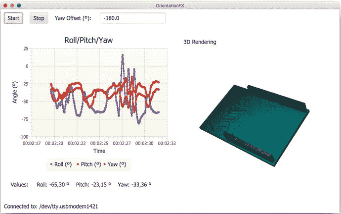

图 12-23.

运行高级 OrientationFX 示例

请注意，0,0,0 位置对应于你手中板子的状态，使得你可以从左到右阅读 Genuino 101 标志，并且电源插头保持在左侧。如果需要，可以调整偏航值。


### 工作原理

该示例通过向一个 `Group` 中添加三个立方体来创建 `Arduino3D` 的实例：

```
public VBox createArduino3D() {
Box board = new Box(300, 10, 200);
board.setMaterial(new PhongMaterial(Color.web("#008282")));
Box longHeader = new Box(210, 40, 10);
longHeader.setMaterial(new PhongMaterial(Color.web("#505050")));
longHeader.getTransforms().add(new Translate(40, -20, 90));
Box shortHeader = new Box(170, 40, 10);
shortHeader.setMaterial(new PhongMaterial(Color.web("#505050")));
shortHeader.getTransforms().add(new Translate(60, -20, -90));
Group arduino = new Group(board, longHeader, shortHeader);
```

然后，它将这个组添加到另一个组内的 `SubScene` 中。子场景允许你使用摄像机而不影响场景的其余部分：

```
SubScene subScene = new SubScene(new Group(arduino), 400, 400,
true, SceneAntialiasing.BALANCED);
PerspectiveCamera camera = new PerspectiveCamera();
camera.setTranslateX(-200);
camera.setTranslateY(-200);
camera.setTranslateZ(-50);
subScene.setCamera(camera);
VBox vBox = new VBox(new Label("Rendering 3D"), subScene);
vBox.getStyleClass().add("box");
return vBox;
```

Arduino 组在其变换列表中添加了一个仿射变换。你将这个组添加到另一个组内的 `SubScene` 中。子场景允许你使用摄像机而不影响场景的其余部分：

```
affine = new Affine();
arduino.getTransforms().add(affine);
```

因此，现在每当有串口事件并提供一组新的方向角时，你只需要更新仿射变换的系数即可。为此，你需要将三个旋转合并为一个旋转矩阵：

```
public void processEvent(double roll, double pitch, double yaw) {
matrixRotateNode(roll, pitch, yaw);
}
private void matrixRotateNode(double roll, double pitch, double yaw) {
double mxx = Math.cos(pitch) * Math.cos(yaw);
double mxy = Math.cos(roll) * Math.sin(pitch) +
Math.cos(pitch) * Math.sin(roll) * Math.sin(yaw);
double mxz = Math.sin(pitch) * Math.sin(roll) -
Math.cos(pitch) * Math.cos(roll) * Math.sin(yaw);
double myx = -Math.cos(yaw) * Math.sin(pitch);
double myy = Math.cos(pitch) * Math.cos(roll) -
Math.sin(pitch) * Math.sin(roll) * Math.sin(yaw);
double myz = Math.cos(pitch) * Math.sin(roll) +
Math.cos(roll) * Math.sin(pitch) * Math.sin(yaw);
double mzx = Math.sin(yaw);
double mzy = -Math.cos(yaw) * Math.sin(roll);
double mzz = Math.cos(roll) * Math.cos(yaw);
affine.setToTransform(mxx, mxy, mxz, 0,
myx, myy, myz, 0,
mzx, mzy, mzz, 0);
}
```

此过程中涉及的数学知识目前超出了范围，但可以在 [`https://en.wikipedia.org/wiki/Rotation_formalisms_in_three_dimensions`](https://en.wikipedia.org/wiki/Rotation_formalisms_in_three_dimensions) 找到很好的参考资料。

上述代码将为每组角度提供即时旋转，因此为了使其更稳定，使用每个角度的最后五个值的平均值会更方便。

```
private static final int SIZE = 5;
private final List averageRoll = new ArrayList();
private final List averagePitch = new ArrayList();
private final List averageYaw = new ArrayList();
public void processEvent(double roll, double pitch, double yaw) {
double avYaw = average(averageYaw, Math.toRadians(yaw));
double avPitch = average(averagePitch, Math.toRadians(pitch));
double avRoll = average(averageRoll, Math.toRadians(roll));
matrixRotateNode(avRoll, avPitch, avYaw);
}
private double average(List list, double value) {
while (list.size() > SIZE) {
list.remove(0);
}
list.add(value);
return list.stream()
.collect(Collectors.averagingDouble(d -> d));
}
```

## 更多示例

网上有大量资源可以演示或利用 Arduino，你可以尽情尝试你想到的任何点子！Arduino 及其所需设备价格低廉且（大多数情况下）安全，它们能让你提升自己的动手能力。

寻找一个价格合适的项目，购买所需材料，动手搭建，先在 Arduino IDE 上进行测试，然后设计一个 JavaFX 应用程序来监控和控制你的设备。

分享你的开发成果，并在需要时寻求帮助；在 Arduino 开发和 JavaFX 领域，都有非常棒的社区，里面的人们乐于提供帮助。

## 总结

在本章中，你了解了结合 Arduino 和 JavaFX 所能实现的功能。你首先学习了 Arduino 及其不同开发板和主要规格。接着，你了解了如何通过 Arduino IDE 与其通信。在学习了如何在 IDE 中加载示例后，你亲自尝试了 Arduino 101，上传了一个草图并在串口监视器中读取了方向角。

然后，你学习了从计算机读取串口的不同方法，并了解了 Java Simple Serial Connector 库。安装这个第三方组件后，你能够执行串口操作，如定位、打开、读取、写入和关闭。

为了监控和显示 Arduino 的读数，你学习了如何使用 JavaFX Charts API。接着，你看到了一个示例，其中使用来自串口的一系列数据绘制了一个 JavaFX 图表，该数据来自一个带有六轴加速度计和陀螺仪的 Arduino 开发板，以提供三个方向角。最后，你发现了如何通过添加真实开发板的 JavaFX 3D 模拟，并根据串口读数旋转它来增强应用程序。

