# 13. JavaFX 在移动设备上的应用

我们都多次听说过 WORA 口号（“一次编写，到处运行”），虽然 Java 确实可以在任何有 JVM 的地方运行，但在现代移动设备上情况并非如此。尽管最新趋势证实智能手机正在取代计算机，为什么我们仍然无法瞄准这个巨大的市场呢？幸运的是，开源项目 JavaFXPorts 应运而生，它允许所有 Java 开发者将他们的项目部署到移动设备（Android 和 iOS）上。

在本章中，你将了解 JavaFXPorts 项目，以及它如何催生了 Gluon Mobile，这是一个旨在增强 JavaFX 桌面设计的移动体验的库。

作为一个完整的示例，在本章中，你将看到如何使用 Gluon Mobile 创建一个简单的 JavaFX 应用程序：`BasketStats`。这是一个用于在篮球比赛中记录得分的简单应用，你将把它部署到 Android 和 iOS 上。

在进入示例之前，让我们先了解一下 `JavaFXPorts` 和 Gluon Mobile。

## JavaFXPorts：移植到移动设备

`JavaFXPorts` 是一个开源项目，它将 Java 和 JavaFX 带到了移动设备和嵌入式硬件上。这包括 iPhone、iPad、Android 设备，甚至树莓派。实现这一奇迹的不同项目可以在这里找到：[`https://bitbucket.org/javafxports`](https://bitbucket.org/javafxports) 。

这一冒险始于 2013 年底，当时 Johan Vos 和他的团队基于 OpenJFX 项目开始了将 JavaFX 移植到 Android 的工作。与此同时，RoboVM 作为一个类似的开源项目开始将 Java 移植到 iOS。2015 年 2 月，这些项目背后的公司 LodgOn 和 Trillian Mobile 宣布联合努力，将两个项目的精华结合到一个名为 jfxmobile-plugin 的单一插件中。这个唯一的 Gradle JavaFX 移动插件被创建出来，并通过 `JavaFXPorts` 仓库免费提供。

几周后，Gluon 公司（参见 [`http://gluonhq.com`](http://gluonhq.com) ）成立，旨在汇集围绕 JavaFXPorts 项目的所有努力，并交付 Gluon Mobile，这是一个轻量级的应用程序框架和一套移动控件，用于增强移动体验。


### JavaFXPorts 底层原理

当我们创建并编译 Java 应用程序时，得到的是 Java 字节码。要运行它，你需要 JRE，其中包含针对每个平台的原生库。由于移动设备没有 JRE，因此需要采用不同的方法。

在 Android 上，Google 的 Android SDK 包含用于将应用程序、资源和库打包成 Android 包（APK）的工具。`jfxmobile` 插件将使用这些工具，在 Android 的 Dalvik/Art 虚拟机（与 Java 虚拟机相对类似）之上创建并安装 Java 移动应用。

在 iOS 上，JRE 需要打包在应用内部。RoboVM 提前编译器用于将 Java 代码转换为原生 iOS 代码，并将所需的运行时库与应用程序链接起来。

目前，Android 运行时和 iOS AOT 编译器都使用 Apache Harmony 对 Java 类库的实现，这仅是 Java 7 的部分实现，且该项目已正式废弃。此外，RoboVM 项目在微软收购 Xamarin（而 Xamarin 最初收购了 RoboVM）后也已停止。

目前，这意味着 `JavaFXPorts` 支持大部分 Java 7 SE API，同时也支持少量 Java 8 API（例如 lambda 表达式，但不支持流）。

由于这些限制，Gluon 正在开发 GluonVM，这是一个高性能的 Java 8/9 虚拟机，它将利用 OpenJDK 类库，并在移动设备上提供完整的 Java 9 功能。预计它将在 Java 9 发布时可用。

注意

在 GluonVM 发布之前，鉴于上述限制，我们无法使用 Java 9 或模块系统在移动设备上运行 JavaFX。这就是本章示例使用现有实现（Java 7 和部分 Java 8 特性）的原因。

### JavaFXPorts 入门

有关使用 `JavaFXPorts` 创建 Java 移动应用的入门文档，请参见：[`http://docs.gluonhq.com/javafxports/`](http://docs.gluonhq.com/javafxports/) 。

Gradle 插件 `jfxmobile-plugin` 几乎完成了所有必要的工作。通过将此插件包含在常规的 JavaFX 应用程序中，它将自动为你创建一系列任务，并将你的应用程序打包为原生 iOS 或原生 Android 包。

以下是开始 Java 移动项目前的先决条件。在你的机器上：

*   为你的开发机器安装最新的 JDK 8 版本。请从此处获取：[`http://www.oracle.com/technetwork/java/javase/downloads/index.html`](http://www.oracle.com/technetwork/java/javase/downloads/index.html) 。
*   从 [`https://gradle.org/install`](https://gradle.org/install) 安装 Gradle 2.2 或更高版本。使用 `jfxmobile` 插件构建应用程序需要它。

如果你想部署到 Android：

*   从 [`https://developer.android.com/studio/index.html`](https://developer.android.com/studio/index.html) 安装 Android SDK。你可以下载 Android Studio，它捆绑了 SDK 和所需的 Android 工具，或者你也可以仅下载并安装该链接末尾的 SDK 工具。
*   运行 Android SDK 管理器（`Android Studio -> Tools -> Android -> SDK Manager` 或命令行 `<android sdk>/tools/android`），然后至少安装 Build-tools 版本 23.0.1、API 21 至 25 的 SDK Platform，以及 Extras 中的 Android Support Repository。
*   在 `<Users>/<User>/.gradle/gradle.properties` 中创建一个属性文件，并添加 `ANDROID_HOME=<path.to.Android.sdk>` 属性。

在部署到 Android 设备之前，你需要在设备上执行以下步骤：

*   进入 `设置 -> 关于手机 -> 版本号`，连续点击七次以启用开发者模式。
*   进入 `设置 -> 开发者选项 -> USB 调试`，选择启用。
*   进入 `设置 -> 安全 -> 未知来源`，启用从未知来源安装应用。

如果你想部署到 iOS：

*   你需要一台装有 MacOS X 10.11.5 或更高版本的 Mac
*   你需要 Xcode 8.x 或更高版本，可从 Mac App Store 获取

在部署到 iOS 设备之前，你需要从 Apple 开发者门户获取配置文件。有关如何获取免费配置文件以部署到你自己的设备，请参见此链接：[`http://docs.gluonhq.com/javafxports/#_ios_3`](http://docs.gluonhq.com/javafxports/#_ios_3) 。

## Hello Mobile World 示例

在满足所有先决条件后，让我们创建一个可以在桌面和移动平台上运行的 Hello Mobile World 示例。

在你喜欢的 IDE 中，可以创建一个新的 Gradle 项目。为其命名（`HelloMobile`），指定位置和主类，例如 `org.jfxbe.chap13.HelloMobile`。

编辑 `build.gradle` 文件并添加清单 13-1 中的内容。它将把 `jfxmobile` 插件应用到项目中。保存并重新加载项目以更新项目。首次执行此操作时，插件将下载并安装一些内部依赖项，因此可能需要一些时间。

```
buildscript {
repositories {
jcenter()
}
dependencies {
classpath 'org.javafxports:jfxmobile-plugin:1.3.5'
}
}
apply plugin: 'org.javafxports.jfxmobile'
repositories {
jcenter()
}
mainClassName = 'org.jfxbe.chap13.HelloMobile'
jfxmobile {
android {
}
ios {
forceLinkClasses = [ 'org.jfxbe.chap13.**.*' ]
}
}
清单 13-1.
build.gradle 文件
```

请注意，在撰写本文时，该插件的版本是 1.3.5。要获取最新版本，请查看 [`https://bitbucket.org/javafxports/javafxmobile-plugin`](https://bitbucket.org/javafxports/javafxmobile-plugin) 。

现在，在主类中，扩展 `Application` 并创建一个包含一些内容的 JavaFX `Scene`，如清单 13-2 所示。

```
package org.jfxbe.chap13;
import javafx.application.Application;
import javafx.geometry.Rectangle2D;
import javafx.scene.Scene;
import javafx.scene.control.Button;
import javafx.scene.layout.StackPane;
import javafx.stage.Screen;
import javafx.stage.Stage;
public class HelloMobile extends Application {
@Override
public void start(Stage primaryStage) throws Exception {
Rectangle2D bounds = Screen.getPrimary().getVisualBounds();
final Button button = new Button("Hello Mobile World!");
button.setStyle("-fx-font-size: 20pt;");
button.setOnAction(e -> button.setRotate(button.getRotate() - 30));
final StackPane stackPane = new StackPane(button);
Scene scene = new Scene(stackPane, bounds.getWidth(), bounds.getHeight());
primaryStage.setScene(scene);
primaryStage.show();
}
public static void main(String[] args) {
launch(args);
}
}
清单 13-2.
Hello Mobile 主类
```

最后，你可以构建应用程序并在你的平台上运行它。要运行 Gradle 构建，只需输入 `gradle` 后跟所需的任务名称，例如 `gradle build` 将构建项目。运行 `gradle run` 在你的开发机器上运行它，`gradle androidInstall` 将其部署到 Android 设备，或 `gradle launchIOSDevice` 部署到 iOS 设备。图 13-1 显示了该应用在 Android 上运行的截图。

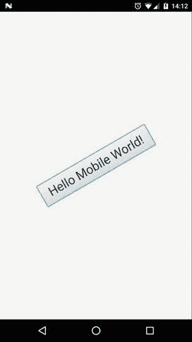

图 13-1.

Hello Mobile World 部署在 Android 上


### 工作原理是什么？

`jfxmobile` 插件会为你的 Java 应用添加一系列任务，使你能够创建可上传至 Apple App Store 和 Android Play Store 的软件包。

`jfxmobile` 插件会下载并安装所需的 JavaFX SDK：

*   **Android 的 Dalvik SDK**：该插件当前依赖于 `org.javafxports:dalvik-sdk:8.60.9` 和 `org.javafxports:jfxdvk:8.60.9`。
*   **Retrolambda 插件**：将代码转换为兼容 Java 6 的字节码，当前依赖于 `net.orfjackal.retrolambda:retrolambda:2.5.1`。
*   **iOS SDK**：该插件当前依赖于 `org.javafxports:ios-sdk:8.60.9`。
*   **MobiDevelop**：RoboVM 1.8.0 的一个分支，用于将代码编译为兼容 iOS 的字节码。当前依赖于 `com.mobidevelop.robovm:robovm-dist:tar.gz:nocompiler:2.3.0`。

上述 SDK 的源代码可在此处获取：[`http://bitbucket.org/javafxports/8u-dev-rt`](http://bitbucket.org/javafxports/8u-dev-rt)。

在 Android 上，该插件随后会执行一系列命令，最终在 `build/javafxports/android` 目录下生成一个 Android 软件包（APK）。该软件包将被部署并安装到设备上。清单 13-3 展示了在 Android 上成功部署的输出，其中列出了所有涉及的任务。

注意

运行 Gradle 任务时，请使用 `--info`、`--debug` 或 `--stracktrace` 来获取更详细的输出，这有助于你精确定位错误和问题，例如：`gradle --info androidInstall`。

```
$ gradle androidInstall
:validateManifest
:collectMultiDexComponents
:compileJava
:processResources UP-TO-DATE
:classes
:compileAndroidJava UP-TO-DATE
:copyClassesForRetrolambda
:applyRetrolambda
Retrolambda 2.5.1
:mergeClassesIntoJar
:shrinkMultiDexComponents
:createMainDexList
:writeInputListFile
:dex
:mergeAndroidAssets
:mergeAndroidResources
:processAndroidResources UP-TO-DATE
:processAndroidResourcesDebug
:validateSigningDebug
:apkDebug
:zipalignDebug
:androidInstall
Installed on device.
BUILD SUCCESSFUL
Total time: 41.168 secs
清单 13-3.
运行 androidInstall 时的输出
```

在 iOS 上，内部情况有所不同，但 Gradle 命令是相似的。该插件会下载并安装 RoboVM 编译器，并使用 RoboVM 编译器命令在 `build/javafxports/ios` 目录下创建一个 iOS 应用。

注意

在移动设备上运行应用时，可以通过在 Android 设备上运行 `<path.to.android skd>/platform-tools/adb logcat` 来访问标准输出。在 Mac 上，打开 Xcode ➤ Windows ➤ Devices 并选择 iOS 设备来访问输出。

最后，Gradle 遵循“约定优于配置”的原则，应用于该插件的默认配置使得 `build.gradle` 文件极其简单。你可以根据需要修改此配置。请查阅 [`http://docs.gluonhq.com/javafxports/#anchor-3`](http://docs.gluonhq.com/javafxports/#anchor-3) 上的文档，以获取 Android 和 iOS 上所有可修改属性的完整列表。

### 将应用提交到商店

当你在移动设备上完成应用测试后，可以继续将其上传到 Apple App Store 和 Android Play Store。为此，该插件已包含所需的任务。

在 Android 上，你需要提供有效的图标图像（位于 `/src/android/res` 下），并且必须在 `AndroidManifest` 文件中禁用调试选项：在 `application` 标签下，添加 `android:debuggable="false"`。最后，你需要对应用进行签名，具体方法如 [`https://developer.android.com/studio/publish/app-signing.html`](https://developer.android.com/studio/publish/app-signing.html) 所述。你可以将签名配置添加到 `build.gradle` 文件中，如清单 13-4 所示。

```
jfxmobile {
android {
signingConfig {
storeFile file("path/to/my-release-key.keystore")
storePassword 'STORE_PASSWORD'
keyAlias 'KEY_ALIAS'
keyPassword 'KEY_PASSWORD'
}
manifest = 'lib/android/AndroidManifest.xml'
}
}
清单 13-4.
Android 上的签名配置
```

如果一切设置完毕，运行 `gradle androidRelease` 以在 `/build/javafxports/android` 下生成 APK。要将其上传到商店，你需要注册成为 Google Play 开发者（ [`https://play.google.com/apps/publish/signup/`](https://play.google.com/apps/publish/signup/) `)` 并填写所需的表单。

在 iOS 上，提供应用的图标，并且一旦你注册了 Apple Developer 计划，就需要使用生产环境的配置文件对应用进行签名，如清单 13-5 所示。运行 `gradle createIpa`，然后通过 Xcode ➤ Open Developer Tool ➤ Application Loader 提交位于 `/build/javafxports/ios` 的应用。可以通过在 `/src/ios/Default-Info.plist` 文件中的 `plist` 里添加相应的键来修复该工具提示缺失的初始要求。完成后，前往 iTunes Connect ( [`https://itunesconnect.apple.com`](https://itunesconnect.apple.com) ) 准备发布应用。与任何其他常规 iOS 应用一样，通常需要经过几次迭代才能让应用获得提交批准，直到你满足审核者的所有要求。

```
jfxmobile {
ios {
arch = "arm64"
infoPList = file('src/ios/Default-Info.plist')
forceLinkClasses = ['your.package.**.*',...]
iosProvisioningProfile = 'MyApp'
iosSignIdentity = 'iPhone Distribution: ******'
}
}
清单 13-5.
iOS 上的签名配置
```

## Gluon Mobile

Gluon Mobile 库旨在帮助开发者从单一的 Java 代码库出发，为 iOS 和 Android 创建高性能、外观精美且支持云连接的移动应用。它通过提供用于现代 Material Design 用户界面的 API、访问移动设备功能、连接 Web 服务以及在多个设备间同步状态，从而缩短了应用上市时间。

Gluon Mobile 是一个客户端库和开发工具，它能够：

*   使用 Glisten（一个提供原生外观和感觉的 UI 组件，包含 JavaFX 控件和特定布局）为客户端应用提供 UI 控件。
*   使用 Connect（一个开源项目，允许与 Gluon CloudLink 本身及其他 Web 服务进行通信）处理与服务器端 Gluon CloudLink 的通信。更多信息请访问 [`http://gluonhq.com/products/mobile/connect/`](http://gluonhq.com/products/mobile/connect/)。
*   通过使用 Charm Down（一个开源项目，提供一系列服务，如文件系统、本地或推送通知、GPS、传感器、相机等）来抽象（部分）平台特定的 API。更多详情请访问 [`http://gluonhq.com/products/mobile/charm-down/`](http://gluonhq.com/products/mobile/charm-down/)。

要开始使用 Gluon Mobile，你可以从头创建一个 Gradle 项目，修改任何现有的示例（ [`http://gluonhq.com/support/samples/`](http://gluonhq.com/support/samples/) ），或者安装并使用适用于你 IDE 的 Gluon 插件。

### Gluon IDE 插件

适用于你 IDE 的 Gluon 插件有助于在你的 IDE 内部创建 Gluon 应用项目：以下 IDE 都有对应的插件：

*   **NetBeans**。参见说明：[`http://docs.gluonhq.com/charm/latest/#netbeans-plugin`](http://docs.gluonhq.com/charm/latest/#netbeans-plugin)。
*   **IntelliJ IDEA**。参见：[`http://docs.gluonhq.com/charm/latest/#intellij-plugin`](http://docs.gluonhq.com/charm/latest/#intellij-plugin)。
*   **Eclipse**。参见：[`http://docs.gluonhq.com/charm/latest/#eclipse-plugin`](http://docs.gluonhq.com/charm/latest/#eclipse-plugin)。

安装插件后，选择 New Project，进入 Gluon 类别，然后挑选一个可用的模板（见图 13-2）。你将创建一个项目，可以轻松修改和调整以创建自己的应用。

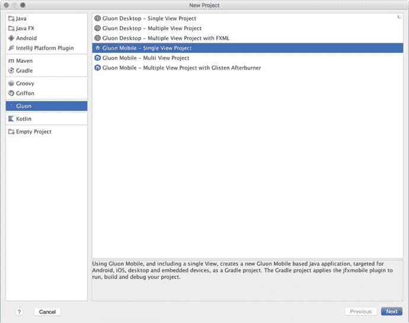

图 13-2.

IntelliJ 的 Gluon 插件及可用模板


### Charm Glisten

基类是 `MobileApplication`，它继承自 `Application`。它不需要实现任何特定方法，但通常可以重写 `init` 来注册不同的视图，而 `postInit` 则可以访问场景并应用样式表，例如。

Glisten 用户界面是使用视图构建的。视图是一个 Glisten 容器，允许你将节点添加到其顶部、中心和底部。

通常，通过为视图提供一个名称及其内容的节点来创建 `View` 实例。该实例被添加到一个视图工厂中，以便 Glisten UI 可以按需加载和卸载它们。

默认情况下，舞台显示时第一个显示的视图称为 `Home View`。它没有预定义的内容，因此该视图必须由开发者设计，但其名称已经分配好了：`MobileApplication.HOME_VIEW`。清单 13-6 中的简短代码片段将创建一个非常简单的移动应用程序，其中包含单个视图，如图 13-3 所示。

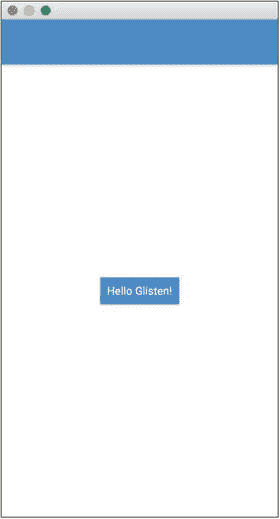

图 13-3.

在桌面上运行的 MyApp

默认情况下，`glisten.css` 是添加到 Gluon Mobile 应用程序中的样式表。它基于 Google 的 Material Design（ [`https://material.io`](https://material.io) ）。

请参阅 [`http://docs.gluonhq.com/charm/latest/#_charm_glisten`](http://docs.gluonhq.com/charm/latest/#_charm_glisten) 上的文档，以了解有关 Glisten 控件的更多信息。

```
import com.gluonhq.charm.glisten.application.MobileApplication;
import com.gluonhq.charm.glisten.mvc.View;
import com.gluonhq.charm.glisten.visual.Swatch;
import javafx.scene.Scene;
import javafx.scene.control.Button;
public class MyApp extends MobileApplication {
public static final String BASIC_VIEW = HOME_VIEW;
@Override
public void init() {
addViewFactory(BASIC_VIEW, () -> new View(new Button("Hello Glisten!")));
}
@Override
public void postInit(Scene scene) {
Swatch.BLUE.assignTo(scene);
}
}
清单 13-6.
创建主视图
```

### 许可证

虽然 `JavaFXPorts`、Charm Down 或 Charm Connect 是完全开源的项目，但 Gluon Mobile 是一个商业项目，需要许可证。正如你在 [`http://gluonhq.com/products/mobile/buy`](http://gluonhq.com/products/mobile/buy) 上看到的，有一个免费层级，该库可以在没有许可证的情况下用于测试，并具有 100% 的功能。

## 示例：BasketStats 应用

此示例向你展示如何逐步创建一个完整的 Java 移动应用，你可以将其部署到你的移动设备上。例如，你可以用它来记录你孩子篮球比赛期间的得分情况。

在本例中，你将使用 NetBeans 和 Gluon 插件。

### 创建项目

让我们使用 Gluon 插件创建一个新项目。在 NetBeans 中，选择文件 ➤ 新建项目，然后在左侧选择 Gluon。从可用项目列表中选择 Gluon Mobile – Glisten -Afterburner 项目，如图 13-4 所示。

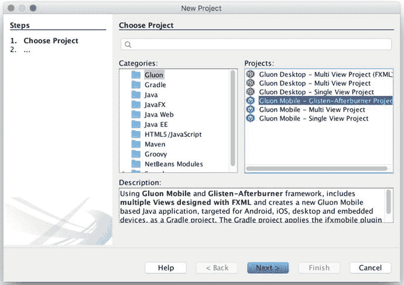

图 13-4.

新建项目：选择项目

为应用程序添加一个合适的名称（`BasketStats`），找到一个合适的位置，添加包名，并根据需要更改主类名，如图 13-5 所示。

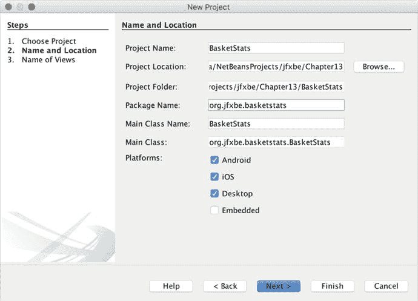

图 13-5.

新建项目：设置名称和位置

单击下一步，并设置这些名称——主视图为 `Main`，次视图为 `Board`——如图 13-6 所示。单击完成，项目将被创建。

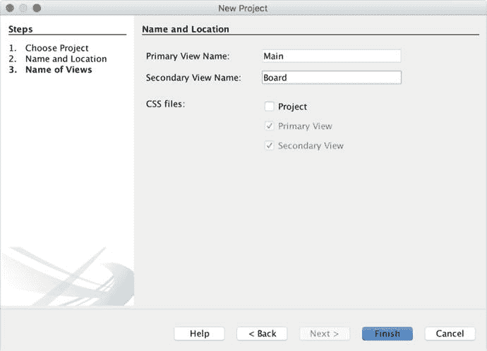

图 13-6.

新建项目：设置视图名称

项目的完整结构如图 13-7 所示。清单 13-7 包含了 `build.gradle` 文件，显示了撰写本文时可用的版本。

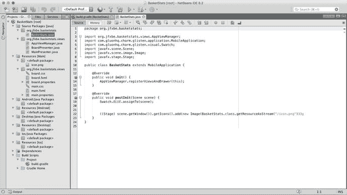

图 13-7.

项目已创建：MobileApplication 类

```
buildscript {
repositories {
jcenter()
}
dependencies {
classpath 'org.javafxports:jfxmobile-plugin:1.3.5'
}
}
apply plugin: 'org.javafxports.jfxmobile'
repositories {
jcenter()
maven {
url 'http://nexus.gluonhq.com/nexus/content/repositories/releases'
}
}
mainClassName = 'org.jfxbe.basketstats.BasketStats'
dependencies {
compile 'com.gluonhq:glisten-afterburner:1.2.0'
compile 'com.gluonhq:charm-glisten:4.3.5'
}
jfxmobile {
downConfig {
version = '3.3.0'
plugins 'display', 'lifecycle', 'statusbar', 'storage'
}
android {
manifest = 'src/android/AndroidManifest.xml'
}
ios {
infoPList = file('src/ios/Default-Info.plist')
forceLinkClasses = [
'org.jfxbe.basketstats.**.*',
'com.gluonhq.**.*',
'javax.annotations.**.*',
'javax.inject.**.*',
'javax.json.**.*',
'org.glassfish.json.**.*'
]
}
}
清单 13-7.
默认的 build.gradle 文件
```

在应用程序类中，重写了 `init` 方法来创建和注册视图。清单 13-8 包含了 `AppViewManager` 类，它负责将视图添加到 `AppViewRegistry` 实例中。视图是使用 `AppView` 类通过 FXML 创建的，并使用了 Afterburner 框架（ [`https://github.com/AdamBien/afterburner.fx`](https://github.com/AdamBien/afterburner.fx) ）。同时创建并注册了一个 `NavigationDrawer` 控件。图 13-8 显示了运行项目时的这一层。

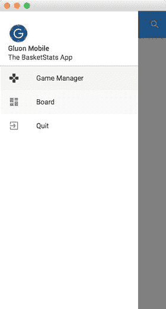

图 13-8.

在桌面上运行项目

```
package org.jfxbe.basketstats.views;
import com.gluonhq.charm.glisten.afterburner.AppView;
import static com.gluonhq.charm.glisten.afterburner.AppView.Flag.HOME_VIEW;
import static com.gluonhq.charm.glisten.afterburner.AppView.Flag.SHOW_IN_DRAWER;
import static com.gluonhq.charm.glisten.afterburner.AppView.Flag.SKIP_VIEW_STACK;
import com.gluonhq.charm.glisten.afterburner.AppViewRegistry;
import com.gluonhq.charm.glisten.afterburner.GluonPresenter;
import com.gluonhq.charm.glisten.afterburner.DefaultDrawerManager;
import com.gluonhq.charm.glisten.application.MobileApplication;
import com.gluonhq.charm.glisten.control.Avatar;
import com.gluonhq.charm.glisten.control.NavigationDrawer;
import com.gluonhq.charm.glisten.visual.MaterialDesignIcon;
import javafx.scene.image.Image;
import java.util.Locale;
import org.jfxbe.basketstats.BasketStats;
public class AppViewManager {
public static final AppViewRegistry REGISTRY = new AppViewRegistry();
public static final AppView MAIN_VIEW = view("Game Manager", MainPresenter.class,
MaterialDesignIcon.GAMES, SHOW_IN_DRAWER, HOME_VIEW, SKIP_VIEW_STACK);
public static final AppView BOARD_VIEW = view("Board", BoardPresenter.class,
MaterialDesignIcon.DASHBOARD, SHOW_IN_DRAWER);
private static AppView view(String title,
Class> presenterClass,
MaterialDesignIcon menuIcon, AppView.Flag... flags ) {
return REGISTRY.createView(name(presenterClass), title, presenterClass,
menuIcon, flags);
}
private static String name(Class> presenterClass) {
return presenterClass.getSimpleName().toUpperCase(Locale.ROOT)
.replace("PRESENTER", "");
}
public static void registerViewsAndDrawer(MobileApplication app) {
for (AppView view : REGISTRY.getViews()) {
view.registerView(app);
}
NavigationDrawer.Header header = new NavigationDrawer.Header("Gluon Mobile",
"The BasketStats App",
new Avatar(21,
new Image(BasketStats.class.getResourceAsStream("/icon.png"))));
DefaultDrawerManager drawerManager = new DefaultDrawerManager(app,
header, REGISTRY.getViews());
drawerManager.installDrawer();
}
}
清单 13-8.
AppViewManager 类
```


### 添加模型

现在我们来添加模型。首先，你需要定义一个 `GameEvent` 类，其中包含一些基本属性，例如记录的分数、事件发生的日期时间、节次编号以及球队编号。请参见代码清单 13-9。

```
package org.jfxbe.basketstats.model;
import java.time.LocalDateTime;
import java.time.ZoneOffset;
public class GameEvent {
private int score;
private long dateTime;
private int period;
private int team;
private String partialScore;
/**
* 球队得分时的事件
* @param score 0, 1, 2, 3。0 表示其他比赛事件
* @param dateTime
* @param period 1 到 4，5 表示比赛结束
* @param team 1 代表 A 队，2 代表 B 队，0 表示其他比赛事件
*/
public GameEvent(int score, long dateTime, int period, int team) {
this.score = score;
this.dateTime = dateTime;
this.period = period;
this.team = team;
}
/**
* 比赛开始一节或结束时的事件
* @param dateTime
* @param period
*/
public GameEvent(LocalDateTime dateTime, int period) {
this(0, dateTime.toInstant(ZoneOffset.UTC).getEpochSecond(), period, 0);
}
public GameEvent() {
this(0, 0, 0, 0);
}
public int getScore() {
return score;
}
public void setScore(int score) {
this.score = score;
}
public long getDateTime() {
return dateTime;
}
public LocalDateTime getLocalDateTime() {
return LocalDateTime.ofEpochSecond(dateTime, 0, ZoneOffset.UTC);
}
public void setDateTime(long dateTime) {
this.dateTime = dateTime;
}
public int getPeriod() {
return period;
}
public void setPeriod(int period) {
this.period = period;
}
public int getTeam() {
return team;
}
public void setTeam(int team) {
this.team = team;
}
public String getPartialScore() {
return partialScore;
}
public void setPartialScore(String partialScore) {
this.partialScore = partialScore;
}
}
代码清单 13-9.
GameEvent 类
```

接下来，你将创建一个 `Game` 类，其中包含一些 JavaFX 属性，例如球队名称和得分、比赛的本地日期和时间，以及一个比赛事件列表。请参见代码清单 13-10。

```
package org.jfxbe.basketstats.model;
import java.time.LocalDateTime;
import javafx.beans.property.IntegerProperty;
import javafx.beans.property.ListProperty;
import javafx.beans.property.ObjectProperty;
import javafx.beans.property.SimpleIntegerProperty;
import javafx.beans.property.SimpleListProperty;
import javafx.beans.property.SimpleObjectProperty;
import javafx.beans.property.SimpleStringProperty;
import javafx.beans.property.StringProperty;
import javafx.collections.FXCollections;
import javafx.collections.ObservableList;
public class Game {
private final ListProperty gameEvents;
public Game() {
gameEvents = new SimpleListProperty(FXCollections.observableArrayList());
}
private final IntegerProperty scoreA = new SimpleIntegerProperty(this, "scoreA", 0);
public final IntegerProperty scoreAProperty() { return scoreA; }
public final int getScoreA() { return scoreA.get(); }
public final void setScoreA(int value) { scoreA.set(value); }
private final IntegerProperty scoreB = new SimpleIntegerProperty(this, "scoreB", 0);
public final IntegerProperty scoreBProperty() { return scoreB; }
public final int getScoreB() { return scoreB.get(); }
public final void setScoreB(int value) { scoreB.set(value); }
private final StringProperty teamA = new SimpleStringProperty(this, "teamA", "");
public final StringProperty teamAProperty() { return teamA; }
public final String getTeamA() { return teamA.get(); }
public final void setTeamA(String teamA) { this.teamA.set(teamA); }
private final StringProperty teamB = new SimpleStringProperty(this, "teamB", "");
public final StringProperty teamBProperty() { return teamB; }
public final String getTeamB() { return teamB.get(); }
public final void setTeamB(String teamB) { this.teamB.set(teamB); }
private final ObjectProperty localDateTime =
new SimpleObjectProperty(this, "localDate", LocalDateTime.now());
public final ObjectProperty localDateTimeProperty() {
return localDateTime; }
public final LocalDateTime getLocalDateTime() { return localDateTime.get(); }
public final void setLocalDateTime(LocalDateTime localDateTime) {
this.localDateTime.set(localDateTime); }
public ListProperty gameEventsProperty() { return gameEvents; }
public ObservableList getGameEvents() { return gameEvents.get(); }
public void setGameEvents(ObservableList gluonGame) {
gameEvents.set(gluonGame); }
public final String getGameName() {
return "Game-" + teamA.get() + "-" + teamB.get() + "-" +
localDateTime.get().toLocalDate().toEpochDay() + "-" +
localDateTime.get().toLocalTime().toSecondOfDay() + ".gam";
}
}
代码清单 13-10.
Game 类
```


### 添加服务

此应用将使用每个游戏对应的文件，在本地存储游戏数据。现在你需要定义一个 `Service` 类来管理这些操作。虽然你可以使用任何常规的文件读写方法，但这里将采用 Gluon CloudLink Client 来将创建的游戏持久化到设备的本地存储中。尽管其主要用途是与云端通信，但你也可以将其用于本地操作。

为此，你需要添加一个依赖项，如代码清单 13-11 所示。

```
dependencies {
compile 'com.gluonhq:glisten-afterburner:1.2.0'
compile 'com.gluonhq:charm-glisten:4.3.5'
compile 'com.gluonhq:charm-cloudlink-client:4.3.5'
}
代码清单 13-11.
所需依赖项
```

如代码清单 13-12 所示，该服务在初始化时会创建 `Game` 和 `DataClient` 实例。后者将使用 `OperationMode.LOCAL_ONLY` 来指示仅进行本地操作。

`DataClient` 实例调用 `createListDataReader()` 方法，并传入以下参数：一个标识符（游戏的唯一名称）、要读取的对象类（`GameEvent.class`）以及同步标志：

*   `SyncFlag.LIST_WRITE_THROUGH`，确保游戏事件列表的更改自动存储到本地。
*   `SyncFlag.OBJECT_WRITE_THROUGH`，确保列表中任何游戏事件属性的更改也自动存储到本地。

该方法返回一个 `ListDataReader` 对象。使用静态方法 `DataProvider.retrieveList` 并传入该数据读取器，即可获得一个 `GluonObservableList<GameEvents>`，这是一个可观察的游戏事件列表，可在不同视图中用于获取或添加新的 `gameEvents`。这些事件会立即被添加到本地文件中。

```
package org.jfxbe.basketstats.service;
import com.gluonhq.cloudlink.client.data.DataClient;
import com.gluonhq.cloudlink.client.data.DataClientBuilder;
import com.gluonhq.cloudlink.client.data.OperationMode;
import com.gluonhq.cloudlink.client.data.SyncFlag;
import com.gluonhq.connect.GluonObservableList;
import com.gluonhq.connect.provider.DataProvider;
import javafx.beans.property.ListProperty;
import javax.annotation.PostConstruct;
import org.jfxbe.basketstats.model.Game;
import org.jfxbe.basketstats.model.GameEvent;
public class Service {
private DataClient dataClient;
private Game game;
@PostConstruct
public void postConstruct() {
dataClient = DataClientBuilder.create()
.operationMode(OperationMode.LOCAL_ONLY)
.build();
game = new Game();
}
public GluonObservableList retrieveGame(String nameGame) {
game.setGameEvents(null);
return DataProvider.retrieveList(dataClient.createListDataReader(nameGame,
GameEvent.class,
SyncFlag.LIST_WRITE_THROUGH, SyncFlag.OBJECT_WRITE_THROUGH));
}
public void addGameEvent(GameEvent gameEvent) {
updateScore(gameEvent);
gameEvent.setPartialScore("" + game.getScoreA() + " :: " + game.getScoreB());
game.getGameEvents().add(gameEvent);
}
public Game getGame() {
return game;
}
public final ListProperty gameEventsProperty() {
return game.gameEventsProperty();
}
public void updateScore(GameEvent event) {
switch (event.getTeam()) {
case 0:
if (event.getPeriod() == 1) {
game.setScoreA(0);
game.setScoreB(0);
}
break;
case 1:
game.setScoreA(game.getScoreA() + event.getScore());
break;
case 2:
game.setScoreB(game.getScoreB() + event.getScore());
break;
}
}
}
代码清单 13-12.
游戏服务
```

你可以查阅 Gluon CloudLink 文档中的“数据存储”部分（[`http://docs.gluonhq.com/cloudlink/#_data_storage`](http://docs.gluonhq.com/cloudlink/#_data_storage)），以更详细地了解 `DataClient` 和 `GluonObservableList` 的概念。

### 修改主视图

现在是时候修改默认视图了。它们的 FXML 文件可以使用 Scene Builder 进行编辑。自 8.3.0 版本起（可从 [`http://gluonhq.com/products/scene-builder/`](http://gluonhq.com/products/scene-builder/) 下载并安装），所需的依赖项已包含在内，你可以轻松设计 Gluon Mobile 视图。参见图 13-9。

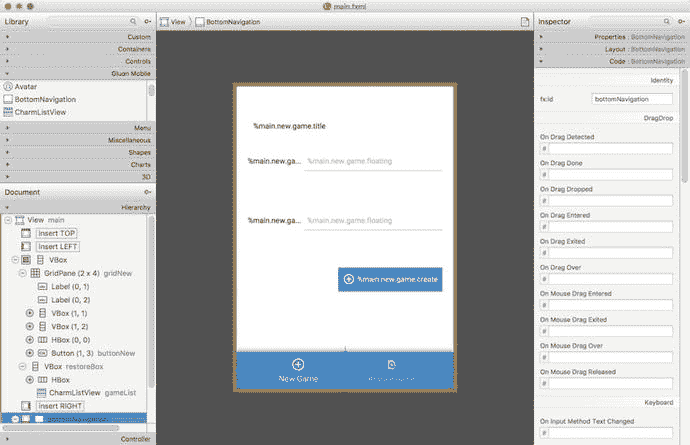

图 13-9.
使用 Scene Builder 编辑的主视图

首先，打开主视图（`main.fxml`）。要预览 Gluon 样式，请选择“预览” ➤ “JavaFX 主题” ➤ “Gluon Mobile”。删除默认内容，并在视图底部添加一个 `BottomNavigation` 控件，其中包含两个按钮：一个用于创建新游戏，另一个用于恢复已有游戏。

现在，添加一个 `VBox` 容器，该容器将包含一个 `GridPane`，其中放置两个来自 Gluon Mobile 的 `TextField` 控件，以便用户设置球队名称。当选中“新游戏”按钮时，该容器将可见。再添加第二个 `VBox`，它将包含一个 `CharmListView` 控件（一个带有标题的增强型列表），用于显示可用的不同游戏。当选中“恢复”按钮时，该容器将可见。请注意，对于添加的每个控件，你都需要分配一个 `fx:id` 标签，以便在控制器类中引用它们。图 13-9 显示了添加这些更改后的主视图。

编辑后的 FXML 文件，以及本示例的其他源代码，都可以在本书的代码仓库中找到。

现在，将所有带标签的控件添加到展示器中，如代码清单 13-13 所示。


```
package org.jfxbe.basketstats.views;
import static com.gluonhq.charm.glisten.afterburner.DefaultDrawerManager.DRAWER_LAYER;
import com.gluonhq.charm.glisten.afterburner.GluonPresenter;
import com.gluonhq.charm.glisten.control.*;
import com.gluonhq.charm.glisten.mvc.View;
import com.gluonhq.charm.glisten.visual.MaterialDesignIcon;
import java.time.*;
import java.util.ResourceBundle;
import javafx.collections.FXCollections;
import javafx.fxml.FXML;
import javafx.scene.control.*;
import javafx.scene.layout.*;
import javax.inject.Inject;
import org.jfxbe.basketstats.BasketStats;
import org.jfxbe.basketstats.service.Service;
import org.jfxbe.basketstats.utils.GameUtils;
import org.jfxbe.basketstats.views.cells.*;
public class MainPresenter extends GluonPresenter {
@Inject private Service service;
@FXML private View main;
@FXML private GridPane gridNew;
@FXML private TextField textNameA, textNameB;
@FXML private Button buttonNew;
@FXML private VBox restoreBox;
@FXML private CharmListView gameList;
@FXML private ToggleButton newToggle, restoreToggle;
@FXML private ResourceBundle resources;
public void initialize() {
main.showingProperty().addListener((obs, oldValue, newValue) -> {
if (newValue) {
AppBar appBar = getApp().getAppBar();
appBar.setNavIcon(MaterialDesignIcon.MENU.button(e ->
getApp().showLayer(DRAWER_LAYER)));
appBar.setTitleText(resources.getString("main.app.title"));
}
});
buttonNew.disableProperty().bind(textNameA.textProperty().isEmpty()
.or(textNameB.textProperty().isEmpty())
.or(textNameA.textProperty().isEqualTo(textNameB.textProperty())));
buttonNew.setOnAction(e -> {
service.getGame().setTeamA(textNameA.getText());
service.getGame().setTeamB(textNameB.getText());
service.getGame().setLocalDateTime(LocalDateTime.now());
GameUtils.restoreGame(service.getGame().getGameName());
});
restoreBox.managedProperty().bind(restoreBox.visibleProperty());
gridNew.managedProperty().bind(gridNew.visibleProperty());
gameList.setPlaceholder(new Label(resources.getString("main.listview.noitems")));
gameList.setHeadersFunction(GameUtils::getLocalDateFromGame);
gameList.setHeaderCellFactory(p -> new HeaderGameListCell());
gameList.setHeaderComparator((l1, l2) -> l2.compareTo(l1));
gameList.setCellFactory(p -> new GameListCell(resources));
restoreToggle.selectedProperty().addListener((obs, ov, nv) -> {
if (nv) {
gridNew.setVisible(false);
restoreBox.setVisible(true);
gameList.setItems(FXCollections.observableArrayList(
GameUtils.retrieveGames()));
}
});
newToggle.selectedProperty().addListener((obs, ov, nv) -> {
if (nv) {
restoreBox.setVisible(false);
gridNew.setVisible(true);
}
});
newToggle.setSelected(true);
}
}
清单 13-13.
主展示器
```

在初始化时，展示器为控件添加了所需的监听器，并为 `CharmListView` 控件的表头和常规单元格添加了单元格工厂（这两个单元格工厂类均可在本书的代码仓库中找到）。通过依赖注入，服务实例被添加到展示器中。要了解更多关于 Gluon Mobile 控件的信息，请查阅 [`http://docs.gluonhq.com/charm/javadoc/latest/`](http://docs.gluonhq.com/charm/javadoc/latest/) 上的文档。

当点击“新游戏”切换按钮时，网格可见，列表视图隐藏，如图 13-10a 所示。当选择“恢复游戏”切换按钮时，网格将隐藏，列表视图将显示到目前为止所有已存在的游戏，如图 13-10b 所示。请注意，存储的游戏具有类似 `Game-Bears-Tigers-17328-70904.gam` 的名称和扩展名，如 `Game` 类中所定义。

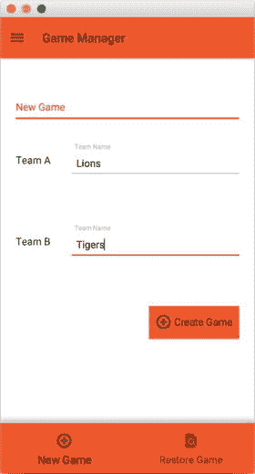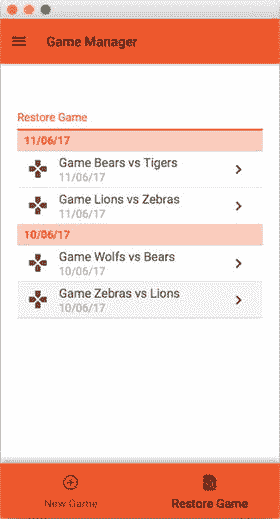

图 13-10.

主视图：a) 新游戏视图，b) 恢复游戏视图

请注意使用了 Charm Down 的 `Storage` 服务来检索本地文件夹中的可用文件。在 iOS 或 Android 的情况下，返回的目录是私有的，并且只能从该应用访问，如清单 13-14 所示。

```
package org.jfxbe.basketstats.utils;
public class GameUtils {
public static List retrieveGames() {
File root = Services.get(StorageService.class)
.flatMap(storage -> storage.getPrivateStorage())
.orElseThrow(() -> new RuntimeException("No storage found"));
List list = new ArrayList();
for (File file : root.listFiles((dir, name) -> name.startsWith("Game")
&& name.endsWith(".gam"))) {
list.add(file.getName());
}
return list;
}
}
清单 13-14.
使用存储服务
```

### 修改棋盘视图

现在你将看到如何修改棋盘视图。使用 Scene Builder 打开 `board.fxml`，移除默认内容，并在视图中心添加一个 Gluon Mobile `ExpansionPanelContainer` 控件，其中包含三个 `ExpansionPanel` 控件：

*   在第一个面板中，其 `ExpandedPanel` 将包含一个 `GridPane`，用于显示当前注释和节次，以及为每队注释一分、两分或三分的按钮。`CollapsedPanel` 将包含一个显示当前节次和比分的标签。
*   第二个面板的展开面板中将包含一个 `CharmListView` 控件，用于显示游戏事件：节次开始、某队得分以及具体分数。`CollapsedPanel` 将包含一个标签。
*   第三个面板的展开面板中将包含一个 `LinearChart` 控件，用于显示游戏进程。`CollapsedPanel` 将包含一个标签。

图 13-11 显示了在 Scene Builder 中修改后的视图。请注意，展示器中所需的每个控件都必须定义一个 `fx:id` 标签。编辑后的 FXML 文件可在本书的代码仓库中找到。

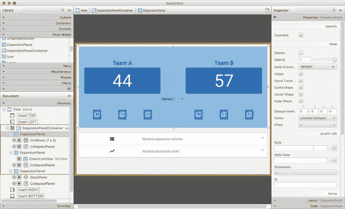

图 13-11.

使用 Scene Builder 编辑的棋盘视图

现在，你将把所有带标签的控件添加到展示器中，如清单 13-15 所示。工厂单元格类可在本书的代码仓库中找到。你可以从 `apress.com` 网站上的本书目录页面找到该仓库的链接。


```
package org.jfxbe.basketstats.views;
import static com.gluonhq.charm.glisten.afterburner.DefaultDrawerManager.DRAWER_LAYER;
import com.gluonhq.charm.glisten.afterburner.GluonPresenter;
import com.gluonhq.charm.glisten.control.*;
import com.gluonhq.charm.glisten.mvc.View;
import com.gluonhq.charm.glisten.visual.MaterialDesignIcon;
import com.gluonhq.connect.GluonObservableList;
import java.text.MessageFormat;
import java.time.*;
import java.time.format.*;
import java.util.Arrays;
import java.util.List;
import java.util.ResourceBundle;
import javafx.beans.binding.Bindings;
import javafx.beans.property.*;
import javafx.fxml.FXML;
import javafx.scene.chart.*;
import javafx.scene.chart.XYChart.Series;
import javafx.scene.control.*;
import javafx.util.StringConverter;
import javax.inject.Inject;
import org.jfxbe.basketstats.BasketStats;
import org.jfxbe.basketstats.model.GameEvent;
import org.jfxbe.basketstats.service.Service;
import org.jfxbe.basketstats.views.cells.*;
public class BoardPresenter extends GluonPresenter {
@Inject private Service service;
@FXML private View board;
@FXML private ExpansionPanelContainer expansion;
@FXML private Label labelTeamA, labelTeamB;
@FXML private Label scoreTeamA, scoreTeamB, globalScore;
@FXML private Button plusOneTeamA, plusTwoTeamA, plusThreeTeamA;
@FXML private Button plusOneTeamB, plusTwoTeamB, plusThreeTeamB;
@FXML private DropdownButton dropdown;
@FXML private MenuItem period1, period2, period3, period4;
@FXML private CharmListView listView;
@FXML private LineChart chart;
@FXML private NumberAxis xAxis, yAxis;
@FXML private ResourceBundle resources;
private Button buttonStart, buttonStop;
private List buttons;
private List periods;
private final IntegerProperty period = new SimpleIntegerProperty();
private Series teamASeries, teamBSeries;
public void initialize() {
buttons = Arrays.asList(plusOneTeamA, plusTwoTeamA, plusThreeTeamA,
plusOneTeamB, plusTwoTeamB, plusThreeTeamB);
periods = Arrays.asList(period1, period2, period3, period4);
enableGame(false);
buttonStart = MaterialDesignIcon.PLAY_CIRCLE_OUTLINE
.button(e -> startGame());
buttonStop = MaterialDesignIcon.STOP.button(e -> stopGame());
buttonStart.setDisable(true);
buttonStop.setDisable(true);
board.showingProperty().addListener((obs, oldValue, newValue) -> {
if (newValue) {
AppBar appBar = getApp().getAppBar();
appBar.setNavIcon(MaterialDesignIcon.MENU.button(e ->
getApp().showLayer(DRAWER_LAYER)));
appBar.setTitleText(resources.getString("board.app.title"));
appBar.getActionItems().addAll(buttonStart, buttonStop);
}
});
for (ExpansionPanel panel : expansion.getItems()) {
panel.expandedProperty().addListener((obs, ov, nv) -> {
if (nv) {
for (ExpansionPanel otherPanel : expansion.getItems()) {
if (!otherPanel.equals(panel)) {
otherPanel.setExpanded(false);
}
}
}
});
}
period2.setOnAction(e -> addPeriodEvent(2));
period3.setOnAction(e -> addPeriodEvent(3));
period4.setOnAction(e -> addPeriodEvent(4));
plusOneTeamA.setOnAction(e -> addScoreEvent(1, 1));
plusTwoTeamA.setOnAction(e -> addScoreEvent(2, 1));
plusThreeTeamA.setOnAction(e -> addScoreEvent(3, 1));
plusOneTeamB.setOnAction(e -> addScoreEvent(1, 2));
plusTwoTeamB.setOnAction(e -> addScoreEvent(2, 2));
plusThreeTeamB.setOnAction(e -> addScoreEvent(3, 2));
labelTeamA.textProperty().bind(service.getGame().teamAProperty());
labelTeamB.textProperty().bind(service.getGame().teamBProperty());
scoreTeamA.textProperty().bind(service.getGame().scoreAProperty().asString());
scoreTeamB.textProperty().bind(service.getGame().scoreBProperty().asString());
globalScore.textProperty().bind(Bindings.createStringBinding(() -> {
String p;
if (period.get() 
Long.compare(e1.getDateTime(), e2.getDateTime()));
listView.setHeaderCellFactory(p -> new HeaderGameEventListCell(resources));
listView.setCellFactory(p -> new GameEventListCell(resources));
listView.setItems(service.gameEventsProperty());
// Chart
xAxis.setAutoRanging(true);
xAxis.setForceZeroInRange(false);
xAxis.setTickLabelFormatter(new StringConverter() {
@Override
public String toString(Number t) {
return DateTimeFormatter.ofLocalizedTime(FormatStyle.MEDIUM)
.format(LocalDateTime.ofEpochSecond(t.longValue(), 0,
ZoneOffset.UTC));
}
@Override
public Number fromString(String string) {
throw new UnsupportedOperationException("Not supported yet.");
}
});
teamASeries = new Series();
teamASeries.setName(service.getGame().getTeamA());
teamBSeries = new Series();
teamBSeries.setName(service.getGame().getTeamB());
chart.getData().addAll(teamASeries, teamBSeries);
}
private void startGame() {
buttonStart.setDisable(true);
buttonStop.setDisable(false);
enableGame(true);
addPeriodEvent(1);
}
private void stopGame() {
buttonStop.setDisable(true);
enableGame(false);
addPeriodEvent(5);
}
private void addPeriodEvent(int period) {
addPeriodEvent(period, LocalDateTime.now());
}
private void addPeriodEvent(int period, LocalDateTime time) {
this.period.set(period);
service.addGameEvent(new GameEvent(time, period));
for (int i = 0; i (gameEvent.getDateTime(),
service.getGame().getScoreA()));
} else {
teamBSeries.getData().add(
new XYChart.Data(gameEvent.getDateTime(),
service.getGame().getScoreB()));
}
}
private void enableGame(boolean value) {
dropdown.setDisable(!value);
for (Button button : buttons) {
button.setDisable(!value);
}
}
public void restoreGame(String gameName) {
teamASeries.getData().clear();
teamBSeries.getData().clear();
final String[] split = gameName.split("-");
service.getGame().setTeamA(split[1]);
service.getGame().setTeamB(split[2]);
service.getGame().setScoreA(0);
service.getGame().setScoreB(0);
period.set(1);
dropdown.setSelectedItem(period1);
final GluonObservableList retrievedGame = service
.retrieveGame(gameName);
enableGame(false);
buttonStart.setDisable(false);
buttonStop.setDisable(true);
retrievedGame.initializedProperty().addListener((obs, ov, nv) -> {
if (nv) {
teamASeries.setName(service.getGame().getTeamA());
teamBSeries.setName(service.getGame().getTeamB());
service.getGame().setGameEvents(retrievedGame);
for (GameEvent event : retrievedGame) {
service.updateScore(event);
if (event.getScore() == 0) {
final int gamePeriod = event.getPeriod();
period.set(gamePeriod);
if (gamePeriod == 5) {
buttonStop.setDisable(true);
enableGame(false);
} else {
buttonStart.setDisable(true);
buttonStop.setDisable(false);
enableGame(true);
if (gamePeriod - 2 >= 0) {
periods.get(gamePeriod - 2).setDisable(true);
}
dropdown.setSelectedItem(periods.get(gamePeriod - 1));
}
} else {
if (event.getTeam() == 1) {
teamASeries.getData().add(
new XYChart.Data(event.getDateTime(),
service.getGame().getScoreA()));
} else {
teamBSeries.getData().add(
new XYChart.Data(event.getDateTime(),
service.getGame().getScoreB()));
}
}
}
}
});
}
}
清单 13-15.
Board 展示器
```

在初始化时，展示器为控件添加了所需的监听器，并为 `CharmListView` 控件的表头和常规单元格添加了单元格工厂（单元格工厂类可在本书的仓库中找到）。

当点击“开始”按钮时，网格被启用，设置第 1 节，比赛开始。现在，每当 A 队或 B 队有进球时，用户可以点击 A 队或 B 队的 1、2、3 按钮，或者选择下一节。最后，当用户点击“停止”按钮时，比赛结束，如图 13-12a 所示。

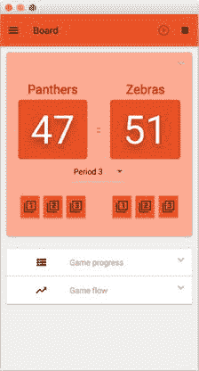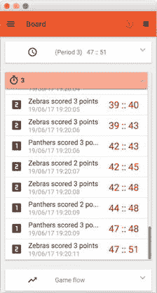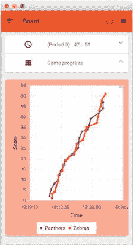

图 13-12.

Board 视图：a) 比赛注释视图，b) 比赛事件视图，c) 比赛进程视图

在任何时候，用户都可以展开另外两个扩展面板中的任意一个，以查看事件列表（见图 13-12b）或显示比赛进程的图表（见图 13-12c）。


### 部署到移动设备

完成前面所有步骤后，就该构建应用并将其部署到移动设备上进行测试和性能检查了。

右键单击根项目，从上下文菜单中选择 Tasks ➤ Android ➤ androidInstall 部署到 Android 设备，或选择 Tasks ➤ Launch ➤ launchIOSDevice 部署到 iOS 设备。图 13-13 展示了部署在 iPad 上的应用。

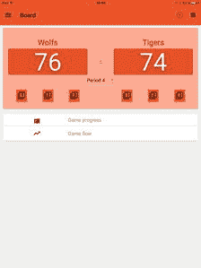

图 13-13.

部署在 iPad 上的应用

## 更多示例

如需更多关于使用 Gluon Mobile 在移动设备上使用 JavaFX 的示例，请访问：

*   [`http://gluonhq.com/support/samples/`](http://gluonhq.com/support/samples/)
*   [`https://github.com/gluonhq/gluon-samples`](https://github.com/gluonhq/gluon-samples)

如有任何关于使用 `JavaFXPorts` 或 Gluon Mobile 开发移动应用的问题，请访问 `StackOverflow` 论坛：

*   [`https://stackoverflow.com/tags/gluon/`](https://stackoverflow.com/tags/gluon/)
*   [`https://stackoverflow.com/tags/gluon-mobile/`](https://stackoverflow.com/tags/gluon-mobile/)
*   [`https://stackoverflow.com/tags/javafxports/`](https://stackoverflow.com/tags/javafxports/)

## 总结

在本章的第一部分，你了解了 `JavaFXPorts`，这是一个开源项目，允许 Java/JavaFX 开发者将其应用移植到 Android 和 iOS 平台。

在本章的第二部分，你探索了 Gluon Mobile 库。我们从 IDE 的 Gluon 插件创建的默认项目开始，开发了 `BasketStats` 应用。该应用使用相同的代码库，在桌面、Android 和 iOS 设备上运行，展示了如何使用 Scene Builder 处理 FXML 视图，以及如何创建和注入处理本地存储的服务。整个示例中使用了不同的 JavaFX 和 Gluon Mobile 控件，展示了使用该库的便捷性以及移动应用开发的速度。通过使用其他开源项目（如 Charm Down），可以轻松地使用平台无关的 API 调用设备上的原生服务（本例中为存储设备）。

