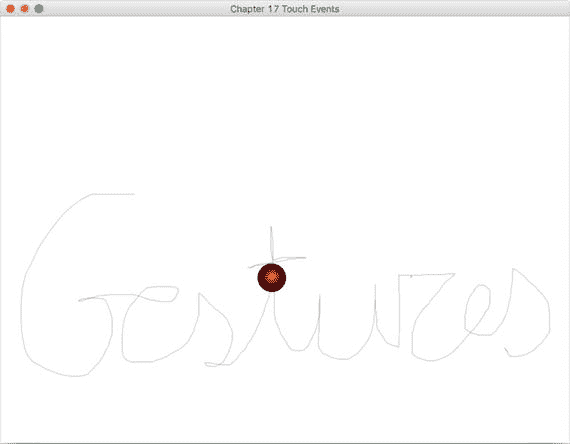
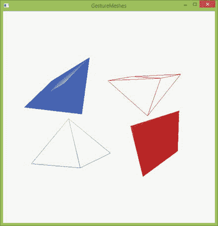
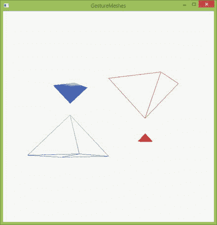
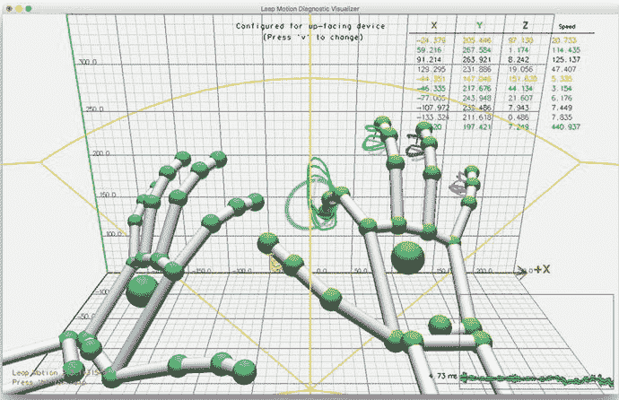
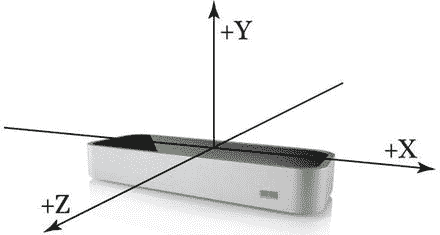
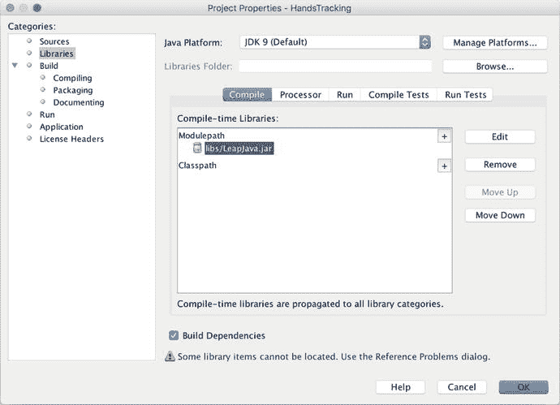
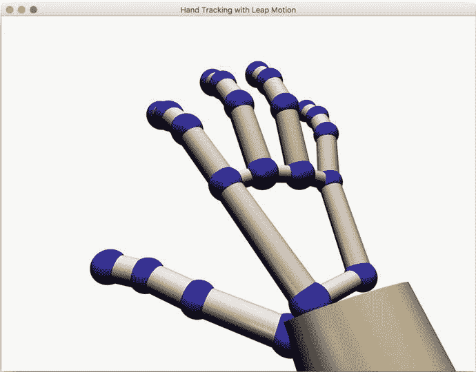
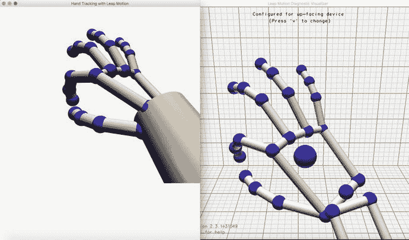

# 14. JavaFX 与手势

用户界面正日益摆脱以鼠标为中心的模式，转而支持多点触控甚至无触控输入。手势是人类与机器自然交流的方式之一，因为机器借助复杂的手势识别数学算法，开始理解人类的肢体语言。

在本章中，你将了解两种新的手势识别方法：在本章的第一部分，你将学习如何使用支持触控的设备（如 Windows 8 Surface）开发多点触控 JavaFX 应用。在本章的第二部分，你将发现一个很酷的小工具——Leap Motion 设备，它提供了一种无触控的方式来开发增强型 JavaFX 应用。

本章中的以下示例演示了 JavaFX 的触摸事件 API 和 Leap Motion 手势 API。

*   使用触摸事件沿路径为形状添加动画（Windows 8）
*   JavaFX 3D 中的触摸、旋转和缩放（Windows 8）
*   使用 Leap Motion 的骨骼追踪模型创建 3D 手部模型

在进入示例之前，我们先来看看 JavaFX 的触摸事件。

## 在应用中识别手势

支持触控的设备如今已成为我们文化的一部分。从智能手机到平板电脑，我们发现自己沉浸在各种软件中。在本节中，你将学习适用于触控设备的 JavaFX `TouchEvent` API。本节中的示例在 Windows 8 Surface 上执行。

如果你熟悉手势和一般的手势编程，可以直接跳到表 14-1，该表列出了 JavaFX 9 当前支持的所有手势事件。如果你对手势编程不熟悉，那么首先让我们讨论一下 `MouseEvent` 和 `GestureEvent` 之间的区别。

表 14-1. 手势事件

| 手势事件 | 描述 |
| --- | --- |
| `ROTATION_STARTED` | 识别到两个触摸点，其中一个触摸点开始进行圆周运动。 |
| `ROTATE` | 识别到两个触摸点，其中一个或两个触摸点正在进行圆周运动。 |
| `ROTATE_FINISHED` | 识别到两个触摸点，两个触摸点在完成圆周运动后停止。 |
| `SCROLL_STARTED` | 一个或多个触摸点开始进行缓慢的水平或垂直滑动运动。 |
| `SCROLL` | 一个或多个触摸点正在进行缓慢的水平或垂直滑动运动。 |
| `SCROLL_FINISHED` | 一个或多个触摸点已停止进行缓慢的水平或垂直滑动运动。 |
| `SWIPE_LEFT` | 一个或多个触摸点正在向屏幕左边缘快速滑动。 |
| `SWIPE_DOWN` | 一个或多个触摸点正在向屏幕底部边缘快速滑动。 |
| `SWIPE_RIGHT` | 一个或多个触摸点正在向屏幕右边缘快速滑动。 |
| `SWIPE_UP` | 一个或多个触摸点正在向屏幕顶部边缘快速滑动。 |
| `TOUCH_PRESSED` | 识别到单个触摸点。 |
| `TOUCH_STATIONARY` | 单个触摸点保持在相同的相对屏幕位置，没有移动。 |
| `TOUCH_MOVED` | 单个触摸点从先前识别的 `TOUCH_PRESSED` 或 `TOUCH_STATIONARY` 位置移动。 |
| `TOUCH_RELEASED` | 单个触摸点已从屏幕抬起。 |
| `ZOOM_STARTED` | 识别到两个触摸点，开始进行捏合或拉伸动作。 |
| `ZOOM` | 识别到两个触摸点，正在进行捏合或拉伸动作。 |
| `ZOOM_FINISHED` | 识别到两个触摸点，两个触摸点在完成捏合或拉伸动作后停止。 |

传统的 `MouseEvent` 编程基于与屏幕像素对齐的简单二维坐标系。通常，鼠标事件处理面向的是事件发生时鼠标所在的位置。手势则略有不同，它们面向的是触摸点及其相对运动。触摸点是屏幕或设备上通过物理接触检测交互的位置。可以同时存在多个触摸点，每个触摸点实例包含 X 和 Y 坐标、GUI 组件拾取以及相关触摸点的分组等信息。通常，触摸点的处理方式与鼠标点击类似。

本章第一个示例的代码（由清单 14-1 提供）并排展示了鼠标和触摸点事件处理。该示例解释了各种鼠标事件（如 `MousePressed`、`MouseDragged` 和 `MouseReleased`）对应的手势 `TouchPoint` 是什么。

触摸点是更有用手势（如旋转、滚动、滑动和缩放）的基础。这些更复杂的手势涉及多个触摸点以及与触摸点相关的移动或惯性。例如，在触摸屏上触摸并拖动手指，只会以类似于 `MouseEvent.MOUSE_DRAGGED` 的方式注册多个触摸点事件。然而，一个已注册的 `TouchPoint` 随后快速向设备边缘滑动，就会转化为一个滑动手势。这为开发者扩展了工具集，提供了标准鼠标和键盘 GUI 中通常不存在的大量额外界面选项。

手势事件以与所有事件处理相同的方式为你的应用启用：通过事件处理器。表 14-1 列出了可用的手势事件。


## 示例：使用触摸事件沿路径为形状添加动画

假设您希望允许应用程序的用户在可视化应用中描绘一条路径。通过视觉演示进行描绘对人类来说是一种非常自然的交互方式。一个简单的例子可能是记录鼠标在屏幕上的移动，然后通过流畅的 JavaFX 动画“回放”该移动。清单 14-1 展示了此功能的完整示例。清单 14-2 包含了 Java 9 模块定义。

```
package com.jfxbe.touchevents;
import javafx.animation.PathTransition;
import javafx.application.Application;
import javafx.geometry.Point2D;
import javafx.scene.Group;
import javafx.scene.Scene;
import javafx.scene.paint.Color;
import javafx.scene.paint.CycleMethod;
import javafx.scene.paint.RadialGradient;
import javafx.scene.paint.Stop;
import javafx.scene.shape.Circle;
import javafx.scene.shape.LineTo;
import javafx.scene.shape.MoveTo;
import javafx.scene.shape.Path;
import javafx.stage.Stage;
import javafx.util.Duration;
/**
* @author cdea
*/
public class TouchEvents extends Application {
private final Path onePath = new Path();
private Point2D anchorPt;
@Override
public void start(Stage primaryStage) {
primaryStage.setTitle("第 17 章 触摸事件");
Group root = new Group(onePath);
Scene scene = new Scene(root, 600, 800, Color.WHITE);
RadialGradient gradient1 = new RadialGradient(0, 0.1,
100, 100,
20,
false,
CycleMethod.NO_CYCLE,
new Stop(0, Color.RED),
new Stop(1, Color.BLACK));
// 创建一个球体
Circle sphere = new Circle(100, 100, 20, gradient1);
// 添加球体
root.getChildren().add(sphere);
// 通过跟随路径为球体添加动画
PathTransition pathTransition =
new PathTransition(Duration.millis(4000), onePath, sphere);
pathTransition.setCycleCount(1);
pathTransition.setOrientation(
PathTransition.OrientationType.ORTHOGONAL_TO_TANGENT);
// 完成后清除路径
pathTransition.setOnFinished(actionEvent ->
onePath.getElements().clear());
// 初始路径起点
scene.setOnMousePressed(mouseEvent ->
startPath(mouseEvent.getX(), mouseEvent.getY())
);
scene.setOnTouchPressed(touchEvent ->
startPath(touchEvent.getTouchPoint().getX(),
touchEvent.getTouchPoint().getY()));
// 拖拽操作会向路径添加 lineTo 元素
scene.setOnMouseDragged(mouseEvent ->
drawPath(mouseEvent.getX(), mouseEvent.getY()));
scene.setOnTouchMoved(touchEvent ->
drawPath(touchEvent.getTouchPoint().getX(),
touchEvent.getTouchPoint().getY()));
// 鼠标释放时结束路径
scene.setOnMouseReleased(mouseEvent -> endPath(pathTransition));
scene.setOnTouchReleased(touchEvent -> endPath(pathTransition));
primaryStage.setScene(scene);
primaryStage.show();
}
private void startPath(double x, double y) {
onePath.getElements().clear();
// 路径起点
anchorPt = new Point2D(x, y);
onePath.setStrokeWidth(3);
onePath.setStroke(Color.BLACK);
onePath.getElements()
.add(new MoveTo(anchorPt.getX(), anchorPt.getY()));
}
private void drawPath(double x, double y) {
onePath.getElements().add(new LineTo(x, y));
}
private void endPath(PathTransition pathTransition) {
onePath.setStrokeWidth(0.2);
if (onePath.getElements().size() > 1) {
pathTransition.stop();
pathTransition.playFromStart();
}
}
}
清单 14-1.
使用触摸事件为圆形添加动画
```

```
module com.jfxbe.touchevents {
requires javafx.controls;
exports com.jfxbe.touchevents;
}
清单 14-2.
触摸事件模块
```

要构建模块并使用 Java 9 从命令行运行项目，请执行清单 14-3 中的步骤。



图 14-1.

使用鼠标或触摸手势沿路径为形状添加动画

```
javac -d mods/com.jfxbe.touchevents $(find src/com.jfxbe.touchevents -name "*.java")
java --module-path build/modules -m com.jfxbe.touchevents/com.jfxbe.touchevents.TouchEvents
清单 14-3.
运行触摸事件项目
```

### 工作原理是什么？

这个 `circle` 对象使用 `PathTransition` 沿着 `onePath` 路径进行动画，过渡时间为 4000 毫秒。`onePath` 的点元素列表由 `LineTo` 对象定义，这些对象是根据从简单鼠标事件处理程序捕获的 x 和 y 坐标构建的。在这种情况下，捕获由 `OnMousePressed` 事件启动，由 `OnMouseDragged` 事件收集，并使用 `OnMouseReleased` 事件完成。

然而，如前所述，描绘是一种非常自然的人类交互方式，并且适合用手来完成。如果您在支持触摸的屏幕设备上运行此程序，您可以轻松使用 JavaFX 触摸事件支持来增强您的描绘应用程序。触摸事件，如同所有手势事件一样，在 JavaFX 9 中拥有一流的事件处理能力。如果某个 GUI 组件支持 `Mouse` 事件，那么它也将支持手势事件。最棒的是，`Mouse` 事件和手势事件可以在单个应用程序中很好地共存。您无需替换现有的 `Mouse` 事件处理程序，而是可以将每个 `Mouse` 事件处理程序与其对应的 `Touch` 事件处理程序匹配起来。这就是为什么在清单 14-1 中添加了 `MousePressed`、`TouchPressed`、`MouseDragged`、`TouchMoved`、`MouseReleased` 和 `TouchReleased` 事件。

如您所见，我们非常谨慎地确保手势事件处理能够像使用传统的 `Mouse` 事件处理一样无缝且自然。


## 在 3D 场景中触摸、旋转和缩放

在操作 3D 场景时，最重要的交互通常是旋转和缩放，这些操作主要涉及移动和改变物体或摄像头的朝向。将手势支持集成到你的 3D 应用程序中，是对传统鼠标和键盘操作的一种自然增强。JavaFX 的 `Shape3D` 对象，无论是基本几何体还是自定义三角形网格，都默认支持所有手势事件，例如 `Rotate` 和 `Zoom`。

为了演示在 JavaFX 3D 场景中使用手势事件，我们向一个 `TriangleMesh` 示例中添加了 `touchStationary`、`Rotate` 和 `Zoom` 手势事件。

基础的 `TriangleMesh` 示例创建了四个金字塔形的 `TriangleMesh` 对象，每个对象都被添加到一个 `MeshView` 容器中以便显示。每个 `MeshView` 容器都被添加到一个 `Group` 节点中，然后该节点再被添加到 3D 场景图中。

我们希望通过为每个金字塔添加一个 `Rotate` 手势事件来增强场景。用户应该能够触摸一个金字塔，然后使用旋转手势使其绕 z 轴旋转。如果你阅读过本章前面的示例，就会知道我们需要为 `Rotate` 手势添加一个事件处理器，在本例中是 `OnRotate`。但是，你必须首先提供一种方法，通知你的应用程序哪个屏幕上的对象是打算旋转的，否则你应该旋转摄像头的视角。如果你遵循多点触控的范式，你首先需要为 `OnTouchStationary` 添加一个事件处理器。`OnTouchStationary` 事件向应用程序指示发生了单次触摸，并且触摸点保持在相同的相对位置。这将其与 `OnTouchPressed` 和 `OnTouchMoved` 事件区分开来，后两者在设备上发生任何触摸时都会立即触发，无论该触摸是否是移动手势的一部分。

策略是选择一个屏幕上的对象作为活动节点，使其成为后续手势的焦点。`OnTouchStationary` 事件会在任何 `OnRotate` 或 `OnZoom` 事件之前发生，因此 `activeNode` 将对后续的手势事件可用。你可以通过添加以下事件处理器来使用此事件选择活动节点：

```
scene.setOnTouchStationary(event -> {
Node picked = event.getTouchPoint().getPickResult().getIntersectedNode();
if (null != picked) {
activeNode = picked;
} else {
activeNode = camera;
}
event.consume();
});
```

你可以通过 `TouchPoint` 对象访问位置数据。`TouchPoint` 对象内置了拾取支持，可以自动让你访问到被相交的节点，也就是屏幕上的对象 `picked`。如果没有拾取到任何对象，即触摸点不在任何屏幕对象上，那么摄像头将被设置为 `activeNode`。现在你可以添加 `OnRotate` 事件处理器：

```
scene.setOnRotate(event -> {
if (null == activeNode) {
activeNode = camera;
}
activeNode.setRotationAxis(Rotate.Z_AXIS);
activeNode.setRotate(activeNode.getRotate() + event.getAngle());
event.consume();
});
```

使用 `event.getAngle()` 访问 `Rotate` 手势提供的旋转角度值，并将其添加到当前节点的先前旋转值上。这将使屏幕上的对象旋转。如果用户没有触摸任何对象，那么摄像头本身将被旋转，这将导致整个场景看起来在旋转。图 14-2 展示了当你对场景中的几个对象（本例中是填充的对象）应用旋转手势时，场景的外观。



图 14-2.

使用手势旋转 3D 金字塔 注意

从技术上讲，任何场景中的所有对象都是节点。然而，在拾取对象时，JavaFX 返回的是对 `MeshView` 对象的引用。任何 `Group` 容器都会被忽略，因为 `Group` 容器会首先将其包含的节点对象提供给 `Picking` API，而 `Grabbing` API 只会将 `TouchPoint` 事件传递给屏幕上最顶层的 `Node`（按 z 轴顺序）。

现在，让我们遵循相同的模式，让用户能够缩放 `activeNode`。这将产生放大或缩小所选节点的效果。为此，我们利用 `OnZoom` 事件：

```
scene.setOnZoom(event -> {
if(null == activeNode) {
activeNode = camera;
}
double zoomFactor = event.getZoomFactor();
zoomFactor *= zoomFactor < 1.0 ? -1 : 1;
activeNode.setScaleX(activeNode.getScaleX() + zoomFactor / 50);
activeNode.setScaleY(activeNode.getScaleY() + zoomFactor / 50);
activeNode.setScaleZ(activeNode.getScaleZ() + zoomFactor / 50);
event.consume();
});
```

`Zoom` 事件提供了一个双精度浮点型的 `ZoomFactor`，它是一个从 0.0 开始的正值。返回值在 0.0 到 1.0 之间表示“捏合”缩放手势。返回值高于 1.0 表示“张开”缩放手势。在这里，你可以使用“捏合”值来负向缩放对象，而“张开”值可以正向缩放对象。图 14-3 是当你对场景中的几个对象应用缩放手势时屏幕的一个示例。



图 14-3.

使用手势缩放 3D 金字塔

这三个事件处理器——`OnTouchStationary`、`OnRotate` 和 `OnZoom`——已经为你的 3D 场景启用了多点触控手势支持。这些效果是叠加的，因为用户可以通过手指的“捏合”和“旋转”动作组合来同时进行旋转和缩放。这种交互方式不仅对人类来说非常自然，而且通常比使用鼠标和键盘的解决方案更简单。

注意

在这里，我们使用固定的整数 50 来“缩放”我们的缩放比例。这是为了补偿屏幕坐标和缩放坐标之间的差异。在处理 3D 场景时，这是一种常见做法，可以将其视为一个灵敏度变量。

## Leap Motion 控制器

Leap Motion 控制器（见图 14-4），也称为 Leap，是一个小型设备，尺寸为 80×30×12 毫米，通过 USB 端口连接到你的计算机。它不需要外部电源。


图 14-4.

Leap Motion 设备及其包装盒

Leap 软件可在 Windows、MacOS X 和 Linux 上运行，初始售价为 79.99 美元，于 2013 年 7 月推出，首批在全球销售了 60 万台。

该公司在此处有一些介绍视频：[`https://www.leapmotion.com/`](https://www.leapmotion.com/)。观看其中几个视频后，你会对该设备看似神奇的性能感到惊讶。

基本上，Leap 会以非常快的速度扫描你的手，并以非常精确的方式将你的动作和手势传输到计算机，因此任何支持 Leap 的应用程序都可以直接进行交互，无需使用鼠标、键盘或任何其他物理设备。

随着与机器交互的新时代开始，许多挑战也同时出现。作为用户，我们需要学习如何在 3D 环境中进行交互，执行一整套全新的手势；而作为开发者，我们将面临提供能够准确翻译这些手势的软件的挑战，以便新应用程序能按我们的预期做出响应。凭借提供的手部追踪功能，Leap Motion 目前正涉足虚拟现实和增强现实领域，以与全新世界进行交互，并与主要 VR 制造商合作，将 Leap Motion 技术嵌入到移动 VR/AR 头显中。

在本章中，我们将重点介绍桌面控制器，首先描述 Leap Motion 提供的硬件和软件。然后，我们将讨论使用该设备开发 JavaFX 程序的 API，并提供一个示例应用程序，以展示一旦你拥有 Leap 设备后可以实现的功能。


### 工作原理

该设备的主要硬件由三个红外 LED 灯和两个单色红外（IR）摄像头组成。LED 灯投射出由红外光点构成的 3D 图案，而摄像头则以近 300fps 的速率扫描反射数据。半径 50 厘米范围内的所有物体都会被扫描和处理。数据以 0.01 毫米的分辨率在主机上由 Leap Motion 软件通过专有运动检测算法进行分析。

根据 CPU 性能和分析的数据量，处理延迟范围在 2 毫秒到 33 毫秒之间。

体验 Leap 神奇效果的最佳方式就是将其插入 USB 端口，并从[`https://www.leapmotion.com/setup`](https://www.leapmotion.com/setup)安装软件。任务栏通知区域（Windows）或菜单栏（Mac）上会出现一个小的 Leap 图标，该图标应为绿色，与设备侧面的 LED 灯（应朝向您）颜色一致。点击该图标并选择“可视化工具”，即可看到您手指和手掌的惊人可视化效果。

当您看到灰色网格时，移动您的手，按 H 键查看菜单，按 N 键可视化手掌，按 T 键显示手指，按 O 键绘制手势，或按 L 键查看延迟。您将看到类似图 14-5 的画面。



图 14-5.

Leap Motion 诊断可视化工具应用

如您所见，该设备可在 60 厘米范围内和 120-150 度视角内检测到手、手指和尖锐工具。对于这些物体，3D 向量提供了位置、方向和速度信息，所有这些都参照一个右手笛卡尔坐标系，其原点位于设备中心，如图 14-6 所示。每次设备扫描并处理可用数据时，都会生成一个`Frame`对象，其中包含该时刻跟踪到的数据列表（手、手指和工具），以及通过对最近几帧分析发现的一组基本运动手势（滑动、点击和画圈）。



图 14-6.

以设备为中心的坐标系

您可能已经注意到，y 轴正方向与大多数计算机图形系统（包括 JavaFX）中的向下方向相反。但数据是参照设备位置，而非像您习惯的鼠标和触摸事件那样参照屏幕，这一事实极大地改变了您的思考方式。幸运的是，API 提供了几个有用的方法，可以随时找到您的手和手指指向的位置。

更复杂的任务需要理解空间几何，包括向量、向量叉积和矩阵运算等术语的知识。

### Leap SDK 入门

为了集成 Leap 设备事件并与软件应用交互，Leap Motion 在其开发者专区为多种编程语言（包括 Java）提供了 SDK。请确保选择仅适用于桌面的 V2 跟踪版本：[`https://developer.leapmotion.com/sdk/v2`](https://developer.leapmotion.com/sdk/v2)。他们新的 Orion 测试版仅适用于 Windows，且主要面向 VR。

下载适用于您操作系统的 SDK，您将获得入门所需的库。这些库主要包括`LeapJava.jar`和一系列原生库。SDK 还包含一个`HelloWorld.java`示例。

将这些文件集成到系统中的一种简单方法是在 Linux 或 Windows 上将 JAR 添加到`<JAVA_HOME>/jre/lib/ext`（在 Mac 上为`/Library/Java/Extensions`）。然后将原生库（Windows 的`LeapJava.dll`、`Leap.dll`和`Leapd.dll`，Mac 的`libLeapJava.dylib`和`libLeap.dylib`，Linux 的`libLeapJava.so`和`libLeap.so`）复制到`<JAVA_HOME>/bin`文件夹。

或者，您也可以将 JAR 作为依赖项添加到每个项目中，并将原生库作为 VM 参数加载：`-Djava.library.path=<原生库路径>`。这就是我们在示例中将要做的，这样您就能看到它在 Java 9 模块系统中的工作方式。

在进一步操作之前，请查阅[`https://developer.leapmotion.com/documentation/java/index.html`](https://developer.leapmotion.com/documentation/java/index.html)上的文档，并尝试运行`HelloWorld.java`示例。您会注意到以下几点：

*   需要一个`Controller`对象来建立 Leap 设备与应用之间的连接。
*   需要一个`Listener`子类来处理来自控制器的事件。
*   在`onConnect()`方法中启用手势跟踪。
*   该类中的主要方法是`onFrame()`，这是一个回调方法，当包含运动跟踪数据的新`Frame`可用时被调度。在这里，您可以获取手、手指或工具的列表，以及多个包含其位置、方向和速度的向量。
*   如果启用了手势，您还将根据对最近几帧的分析获得检测到的手势列表。您还将了解手势的状态：是刚刚开始、正在进行还是已经结束。

### 将 Leap SDK 添加到 JavaFX 项目

您在本书中可能已经发现的一件事是，必须小心处理所谓的 JavaFX 线程与其他非 JavaFX 线程的混合。此时，您会清楚地看到，Leap Listener 子类在非 JavaFX 线程中运行，以非常高的速率处理事件。

为了将这些事件引入 JavaFX 线程，您将在`Listener`子类中使用 JavaFX 的`ObjectProperty<T>`来存储每一帧上的所需值。然后在 JavaFX 类中，您将实现一个`ChangeListener<T>`来监听任何变化，并通过使用`Platform.runLater()`，将渲染这些变化到 JavaFX 场景图上的任务放到 JavaFX 线程上执行。

### 手部跟踪示例

以下示例利用 Leap Motion v2 版本及其骨骼跟踪模型的功能，创建了一个手部骨骼和手臂的 JavaFX 3D“实时”版本。

在开始编写代码之前，我们先设置`module-info`类。清单 14-4 显示了 JavaFX 常用的`requires`子句，以及您为包含`LeapJava`而添加的新子句。

```
module com.jfxbe.handstracking {
requires javafx.controls;
requires LeapJava
exports com.jfxbe.handstracking;
}
清单 14-4.
HandsTracking 模块
```

您必须将 Leap SDK 安装子文件夹`LeapSDK/lib`中的`LeapJava.jar`复制到项目内的`libs`文件夹中，并在 IDE 中将此 JAR 添加到库中，以便使用其 API，如图 14-7 所示。



图 14-7.

在 NetBeans 中将 LeapJava.jar 添加到项目库中


### LeapListener 类

`LeapListener` 子类将负责使用 Leap Motion API 追踪您的手部，并为每一帧返回一个有效的骨骼、手臂和关节对的列表。这里使用了一个 `BooleanProperty` 来标记手部处理的开始和结束，而不是使用可观察的列表。

在代码清单 14-5 中，如果存在有效的控制器（即，当您将 Leap Motion 控制器插入计算机时），主方法 `onFrame` 会每隔几毫秒被调用一次。在每一帧中，API 都会提供一个手指列表，并且对于每个 `Finger`，都会提供一个特定类型的 `Bones` 列表。

请查阅 Leap 追踪文档，了解其 API 的详细说明：[`https://developer.leapmotion.com/documentation/java/devguide/Leap_Overview.html`](https://developer.leapmotion.com/documentation/java/devguide/Leap_Overview.html)。

`Pair` 是一个工具类，您可以使用它来追踪关节，并在掌指关节和腕掌关节之间创建一个虚拟连接，如代码清单 14-6 所示。

```
/**
* @author Jose Pereda
*/
public class LeapListener extends Listener {
private final BooleanProperty doneList= new SimpleBooleanProperty(false);
private final List bones=new ArrayList();
private final List arms=new ArrayList();
private final List joints=new ArrayList();
@Override
public void onFrame(Controller controller) {
Frame frame = controller.frame();
doneList.set(false);
bones.clear();
arms.clear();
joints.clear();
if (!frame.hands().isEmpty()) {
Screen screen = controller.locatedScreens().get(0);
if (screen != null && screen.isValid()) {
for (Finger finger : frame.fingers()) {
if (finger.isValid()) {
for (Type b : Type.values()) {
if ((!finger.type().equals(Finger.Type.TYPE_RING) &&
!finger.type().equals(Finger.Type.TYPE_MIDDLE)) ||
!b.equals(Type.TYPE_METACARPAL)) {
bones.add(finger.bone(b));
}
}
}
}
for (Hand h : frame.hands()) {
if (h.isValid()) {
// arm
arms.add(h.arm());
FingerList fingers = h.fingers();
Finger index = null, middle = null, ring = null, pinky = null;
for (Finger f : fingers) {
if (f.isFinger() && f.isValid()) {
switch (f.type()) {
case TYPE_INDEX: index = f; break;
case TYPE_MIDDLE: middle = f; break;
case TYPE_RING: ring = f; break;
case TYPE_PINKY: pinky = f; break;
}
}
}
// joints
if (index != null && middle != null) {
Pair p = new Pair(index.bone(Type.TYPE_METACARPAL).nextJoint(),
middle.bone(Type.TYPE_METACARPAL).nextJoint(),
bones.get(0).width() / 2d);
joints.add(p);
}
if (middle != null && ring != null) {
Pair p = new Pair(middle.bone(Type.TYPE_METACARPAL).nextJoint(),
ring.bone(Type.TYPE_METACARPAL).nextJoint(),
bones.get(0).width() / 2d);
joints.add(p);
}
if (ring != null && pinky != null) {
Pair p = new Pair(ring.bone(Type.TYPE_METACARPAL).nextJoint(),
pinky.bone(Type.TYPE_METACARPAL).nextJoint(),
bones.get(0).width() / 2d);
joints.add(p);
}
if (index != null && pinky != null) {
Pair p = new Pair(index.bone(Type.TYPE_METACARPAL).prevJoint(),
pinky.bone(Type.TYPE_METACARPAL).prevJoint(),
bones.get(0).width() / 2d);
joints.add(p);
}
}
}
}
}
doneList.set(!bones.isEmpty() || !arms.isEmpty());
}
public List getBones() {
return bones.stream().collect(Collectors.toList());
}
public List getArms() {
return arms.stream().collect(Collectors.toList());
}
public List getJoints() {
return joints.stream().collect(Collectors.toList());
}
public BooleanProperty doneListProperty() {
return doneList ;
}
}
代码清单 14-5.
LeapListener 类
```

```
public class Pair {
/*
创建一个关节对（以 Vector 表示），用于连接两根骨骼的近端
*/
private final Vector v0;
private final Vector v1;
private final double width;
public Pair(Vector v0, Vector v1, double width){
this.v0 = v0;
this.v1 = v1;
this.width = width;
}
public Vector getCenter(){
return new Vector((v1.getX() + v0.getX()) / 2f,
(v1.getY() + v0.getY()) / 2f,
(v1.getZ() + v0.getZ()) / 2f);
}
public Vector getDirection(){
return new Vector(v1.getX() - v0.getX(),
v1.getY() - v0.getY(),
v1.getZ() - v0.getZ()).normalized();
}
// getters
}
代码清单 14-6.
Pair 类
```

### 3D 模型类

手部模型将使用 JavaFX 3D 的 `Cylinder` 和 `Sphere` 控件来模拟其骨骼和关节。为了在正确的位置和方向上渲染它们，您需要将从 Leap 向量获得的方向转换到 JavaFX 坐标系中。为此，您可以使用 `Utils` 类，如代码清单 14-7 所示。

```
public class Utils {
public static List getTransforms(Vector dir, Vector pos, double yOffset) {
final double ang = Math.acos(dir.getY() / dir.magnitude());
return Arrays.asList(
new Translate(pos.getX(), -pos.getY() + yOffset, -pos.getZ()),
new Rotate(- Math.toDegrees(ang), 0, -yOffset, 0,
new Point3D(-dir.getZ(), 0, -dir.getX())));
}
}
代码清单 14-7.
Utils 类
```

`getTransforms` 方法基于方向和位置返回一个变换列表。它接收来自 Leap Motion 坐标系的向量作为输入，并将它们转换为 JavaFX 坐标系中的平移和旋转。

变换以位于给定位置的垂直圆柱体作为参考。平移由 JavaFX 系统中的项目位置 `(pos.getX(), -pos.getY(), -pos.getZ())` 给出。旋转的枢轴点由 JavaFX 系统中的项目方向 `(dir.getX(), -dir.getY(),-dir.getZ())` 与同一系统中的圆柱体方向 `(0, -1, 0)` 的叉积给出。旋转角度由这两个参考向量之间的夹角给出。如果需要，可以从圆柱体的中心应用一个偏移量。

代码清单 14-8、14-9 和 14-10 展示了指骨、关节和前臂的 3D 模型。

```
public class Phalanx {
private final Bone bone;
private final Cylinder phalanx;
private final Sphere joint;
private final Sphere carpoMetaCarpalJoint ;
public Phalanx(Bone bone) {
this.bone = bone;
PhongMaterial materialPhalanx = new PhongMaterial();
materialPhalanx.setSpecularColor(Color.rgb(50, 50, 50));
PhongMaterial materialJoint = new PhongMaterial(Color.BLUE);
materialJoint.setSpecularColor(Color.rgb(50, 50, 50));
phalanx = new Cylinder(0.8 * bone.width() / 2d, bone.length());
phalanx.setMaterial(materialPhalanx);
phalanx.getTransforms().addAll(
Utils.getTransforms(bone.direction(), bone.center(), 0));
joint = new Sphere(bone.width() / 2d);
joint.setMaterial(materialJoint);
joint.getTransforms().addAll(
Utils.getTransforms(bone.direction(), bone.center(), bone.length() / 2d));
carpoMetaCarpalJoint = new Sphere(bone.width() / 2d);
carpoMetaCarpalJoint.setMaterial(materialJoint);
carpoMetaCarpalJoint.getTransforms().addAll(
Utils.getTransforms(bone.direction(), bone.center(), - bone.length() / 2d));
}
public Group getPhalanx() {
if (bone.type().equals(Type.TYPE_METACARPAL)) {
return new Group(phalanx, carpoMetaCarpalJoint);
} else if (bone.type().equals(Type.TYPE_PROXIMAL)) {
return new Group(phalanx, joint, carpoMetaCarpalJoint);
}
return new Group(phalanx, joint);
}
}
代码清单 14-8.
Phalanx 类
```

```
public class Joint{
private final Cylinder cylinder;
public Joint(Pair pair) {
PhongMaterial material = new PhongMaterial();
material.setSpecularColor(Color.rgb(30, 30, 30));
cylinder = new Cylinder(pair.getWidth() / 2d, pair.getV0().distanceTo(pair.getV1()));
cylinder.setMaterial(material);
cylinder.getTransforms().addAll(
Utils.getTransforms(pair.getDirection(), pair.getCenter(), 0));
}
public Shape3D getJoint() {
return cylinder ;
}
}
代码清单 14-9.
Joint 类
```


```
public class ForeArm{
private final Cylinder cylinder;
public Forearm(Arm arm) {
PhongMaterial materialArm = new PhongMaterial();
materialArm.setDiffuseColor(Color.CORNSILK);
materialArm.setSpecularColor(Color.rgb(30, 30, 30));
cylinder = new Cylinder(arm.width() / 2d,
arm.elbowPosition().minus(arm.wristPosition()).magnitude());
cylinder.setMaterial(materialArm);
cylinder.getTransforms().addAll(
Utils.getTransforms(arm.direction(), arm.center(), 0));
}
public Shape3D getForearm() {
return cylinder;
}
}
代码清单 14-10.
前臂类
```

### 应用程序类

最后，`HandsTracking`（如代码清单 14-11 所示）是一个 JavaFX 应用程序，它将创建一个新的 `Controller` 实例，该实例将开始基于 `LeapListener` 实例监听帧数据。

对于每一帧，当帧处理完毕时，`listener.doneListProperty()` 将变为 `true`，因此此时你将处理（Leap）骨骼、配对和手臂的列表，以创建并渲染（JavaFX 3D）指骨、关节和前臂。请注意，一个包含这些 3D 形状集合的 `Group` 是通过 `Platform.runLater()` 填充的。这意味着，如果帧率过高，并非所有帧都会被处理，但由于你获取的是正在被修改的列表的副本，因此当列表在不同帧之间发生变化时，不会出现并发修改异常。

```
public class HandsTracking extends Application {
private LeapListener listener = null;
private Controller controller = null;
@Override
public void start(Stage primaryStage) throws Exception {
listener = new LeapListener();
controller = new Controller();
controller.addListener(listener);
final PerspectiveCamera camera = new PerspectiveCamera();
camera.setFieldOfView(60);
camera.getTransforms().addAll(new Translate(-400, -500, 200));
final PointLight pointLight = new PointLight(Color.ANTIQUEWHITE);
pointLight.setTranslateX(0);
pointLight.setTranslateY(-1000);
pointLight.setTranslateZ(-800);
final Group root = new Group(pointLight);
final Group root3D = new Group(camera, root);
final SubScene subScene = new SubScene(root3D, 800, 600, true, SceneAntialiasing.BALANCED);
subScene.setCamera(camera);
Scene scene = new Scene(new AnchorPane(subScene), 800, 600, Color.WHITESMOKE);
listener.doneListProperty().addListener((obs, ov, nv) -> {
if (nv) {
List bones = listener.getBones();
List arms = listener.getArms();
List joints = listener.getJoints();
Platform.runLater(() -> {
root.getChildren().setAll(pointLight);
root.getChildren().addAll(bones.stream()
.filter(bone -> bone.isValid() && bone.length() > 0)
.map(Phalanx::new)
.map(Phalanx::getPhalanx)
.collect(Collectors.toList()));
root.getChildren().addAll(joints.stream()
.map(Joint::new)
.map(Joint::getJoint)
.collect(Collectors.toList()));
root.getChildren().addAll(arms.stream()
.filter(Arm::isValid)
.map(Forearm::new)
.map(Forearm::getForearm)
.collect(Collectors.toList()));
});
}
});
primaryStage.setTitle("Hand Tracking with Leap Motion");
primaryStage.setScene(scene);
primaryStage.show();
}
@Override
public void stop(){
controller.removeListener(listener);
}
}
代码清单 14-11.
工具类
```

### 构建并运行项目

要使用 Java 9 从命令行构建模块并运行项目，请执行代码清单 14-12 中的步骤。请注意，为了构建模块，你需要使用 `module-path` 选项包含 `LeapJava.jar`；为了运行项目，你需要使用 `-Djava.library.path` 添加原生库。

```
javac --module-path libs/LeapJava.jar -d mods/com.jfxbe.handstracking
$(find src/com.jfxbe.handstracking -name "*.java")
java -Djava.library.path=//LeapSDK/lib/ --module-path mods:libs -m com.jfxbe.handstracking/com.jfxbe.handstracking.HandsTracking
代码清单 14-12.
运行手势追踪项目
```

如果一切就绪并且你的 Leap Motion 控制器已插入，你应该能够在它上方挥手，并得到类似图 14-8 的结果。



图 14-8.

运行手势追踪示例

你可以通过 Visualize 应用程序检查你构建的 JavaFX 3D 模型是否与原生模型几乎相同，如图 14-9 所示。



图 14-9.

比较手势追踪模型与可视化模型

## 更多示例

有关将 JavaFX 与 Leap Motion 设备结合使用的更多示例，请参考以下在线资源：

*   [`http://jperedadnr.blogspot.com.es/2013/06/leap-motion-controller-and-javafx-new.html`](http://jperedadnr.blogspot.com.es/2013/06/leap-motion-controller-and-javafx-new.html)
*   [`http://jperedadnr.blogspot.com.es/2015/01/creating-and-texturing-javafx-3d-shapes.html#SkinningMeshes`](http://jperedadnr.blogspot.com.es/2015/01/creating-and-texturing-javafx-3d-shapes.html#SkinningMeshes)

如需与其他编程语言交互，请访问 [`https://gallery.leapmotion.com`](https://gallery.leapmotion.com) 。

## 总结

在本章的第一部分，你了解了各种手势事件以及它们之间的细微差别。你学习的事件包括 `TouchPressed`、`TouchReleased`、`TouchStationary`、`Rotate` 和 `Zoom`。你学习了如何为你的 JavaFX 应用程序添加手势事件处理，无论它是传统的 2D 场景还是 3D 场景。

在本章的第二部分，你发现了令人印象深刻的 Leap Motion 设备，以及使用它增强 JavaFX 应用程序所产生的绝佳组合效果。你首先了解了该设备及其工作原理；接着，你简要了解了它的 Java SDK 以及一个示例应用程序，在该示例中，你学习了如何在一个线程中监听和处理来自 Leap 设备的数据，同时在 JavaFX 线程中渲染追踪你双手的 3D 形状。

在下一章中，你将学习主题化以及如何自定义应用程序，了解 JavaFX CSS 样式的基础知识，以及如何创建自定义控件。

