# 15. 自定义用户界面

如果你能在不改变应用程序功能的情况下改变其外观，那该多好啊？许多公司花费大量金钱和时间来设计用户界面（UI）。

通常，公司在决定其 UI 的外观和行为之前，会先制作几个设计模型。根据范围的不同，许多公司还会构建支持不同屏幕尺寸的 UI。通常，平板电脑、智能手机、电视和台式机是 UI 设计师面临的主要挑战。

在本章中，你将学习主题化以及如何通过应用各种主题（外观和感觉）来自定义应用程序。接下来，你将学习 JavaFX CSS 样式的基础知识，这将使你能够更改任何场景图节点的属性，例如颜色、背景、边距等。在学习 CSS 样式之后，你将学习如何创建自定义控件。在这里，你将学习如何构建不属于 JavaFX 8 内置控件的 UI 控件。一些可能想到的自定义控件包括 LED、数字键盘、仪表、时钟和未来感上下文菜单。

在本章中，你将学习以下 API 和概念：

*   主题化
*   JavaFX CSS 样式
*   自定义控件


## 主题化

在设计用户界面时，你可能听说过“皮肤化”和“外观与感觉”这些术语。这些术语经常互换使用，它们都反映了主题化或 UI 样式设计的基本概念。主题化是指在不改变应用程序底层功能的前提下，改变其整体外观。例如，当你将应用程序的 UI 布局和控件从风格化的商务主题切换为运动主题时，这就是主题化的应用。通常，公司会尝试为应用程序“换肤”，使其外观与公司标志相似。他们还会使用精心挑选的漂亮字体（排版学）来体现其企业文化或目标受众。

在 JavaFX 中，你可以创建、修改或使用现有主题来为应用程序“换肤”。稍后，我将讨论如何创建主题，但现在，我将向你展示如何在 JavaFX 应用程序中应用现有主题（皮肤）。为了演示如何将主题应用于应用程序的 UI，我创建了一个 JavaFX 应用程序，如图 15-1 所示，该应用程序允许用户应用各种 UI 外观主题。

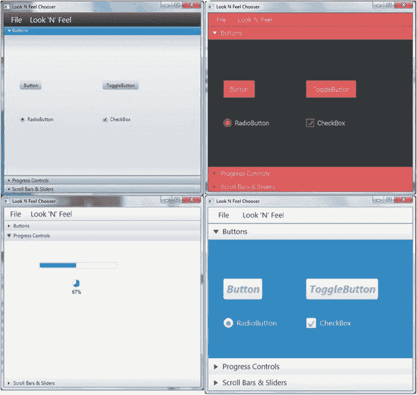

图 15-1.

使用 JavaFX CSS 样式设置应用程序的外观。从左上角开始逆时针方向依次是 Caspian、Modena、Sky 和 Flat Red 主题。

如你所见，同一个应用程序应用了四种 UI 皮肤。左上角是 Java FX 2.X 中熟悉的 Caspian 主题。多年来，Caspian 一直表现出色，至今仍具有相当专业的外观。左下角是一个展开的手风琴 UI 控件，展示了使用 JavaFX 8 的新默认主题 Modena 的进度控件。Modena 主题看起来更明亮、更简洁、更现代。

右下角是下一个主题，名为 Sky 外观，由本人（Carl Dea）创建。我的意图是为触摸屏创建一个主题，使控件略微放大，以适应成年人的手指。我想要一种友好的感觉，于是想到了凉爽的蓝色天空。

最后但同样重要的是，右上角是 Flat Red 外观，由 Gerrit Grunwald 创建。

Flat Red 使用自定义字体（Roboto），使控件上的文本看起来清晰整洁。Flat Red 主题的另一个优点是，它基于 UI 控件的伪类状态变化（例如，在滑块控件上按下鼠标）来使用 CSS 效果。如果你还不了解什么是伪类，请不要担心，本章后面你将详细了解伪类选择器。Grunwald 先生的外观也是触摸屏应用的绝佳选择。

### 原生外观

在进入示例代码之前，我想向 JavaFX 社区中那些制作了精美皮肤和主题的个人（先驱者）致敬，你会发现他们极具启发性。对于那些对 OS X（Mac 桌面）原生外观感兴趣的人，Claudine Zillmann（`@etteClaudette`）创建了 AquaFX（包含 Elements）。你可以从[`http://aquafx-project.com`](http://aquafx-project.com)下载 AquaFX。如图 15-2 所示，AquaFX 是一个库，允许开发者轻松地使用原生 OS X 外观来设计应用程序样式，并且还可以使用除通常的浅蓝色之外的其他颜色来对 UI 进行主题化。

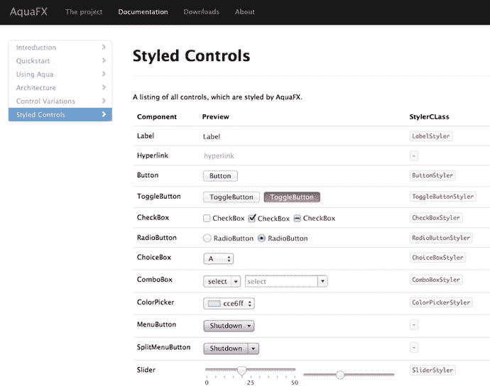

图 15-2.

AquaFX 是一个 JavaFX 库，用于设计类似于 OS X 原生外观的控件样式

对于那些对 Windows Metro 外观感兴趣的人，Pedro Duque Vieira（`@P_Duke`）创建了一个名为 JMetro 的项目。JMetro 有一个浅色主题，如图 15-3 所示，以及一个深色主题，如图 15-4 所示。

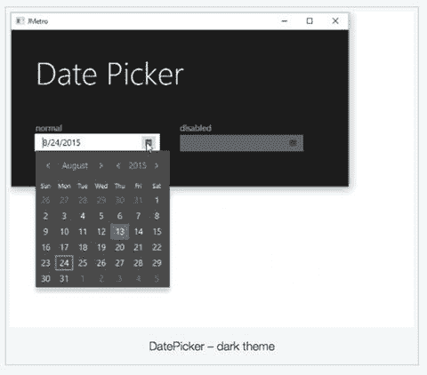

图 15-4.

使用 JMetro 深色主题样式化的日期选择器控件

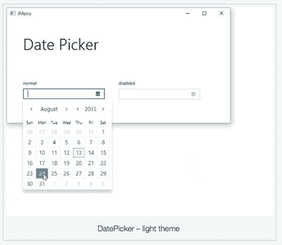

图 15-3.

使用 JMetro 浅色主题样式化的日期选择器控件

要下载 JMetro 主题，请访问 JFXtras 的样式部分，网址为[`https://github.com/JFXtras/jfxtras-styles/tree/master/src`](https://github.com/JFXtras/jfxtras-styles/tree/master/src)。

那么，有没有一种类似 Roku 或 Apple TV 界面的外观呢？它叫做 Flatter，由 Java Champion 兼书籍作者 Hendrik Ebbers（`@hendrikEbbers`）创建。Flatter 是为一个概念验证项目 BoxFX 设计的。BoxFX 是 Ebbers 先生创建的另一个项目，它使用运行 JavaFX 8 并应用 Flatter 外观的 Raspberry Pi 设备，如图 15-5 所示。

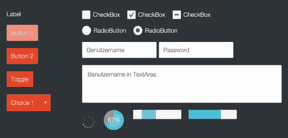

图 15-5.

应用于 JavaFX 应用程序的 Flatter 样式

以下是本节提到的 UI 样式的链接：

*   AquaFX（包含 Elements）：[`http://aquafx-project.com/project.html`](http://aquafx-project.com/project.html)
*   Jmetro
    *   [`http://pixelduke.wordpress.com/category/metro`](http://pixelduke.wordpress.com/category/metro)
    *   [`https://github.com/JFXtras/jfxtras-styles`](https://github.com/JFXtras/jfxtras-styles)
*   Flatter：[`http://www.guigarage.com/2013/09/flatter`](http://www.guigarage.com/2013/09/flatter)
*   BoxFX：[`http://www.guigarage.com/2013/08/boxfx-javaone-preview-1`](http://www.guigarage.com/2013/08/boxfx-javaone-preview-1)

现在你已经了解了原生样式和媒体设备样式，让我们来看看 Web 和移动 UI 样式。

### Web 和移动外观

根据应用程序的不同，用户可能更喜欢更偏向 Web 或移动端的外观。通常，设备的屏幕尺寸会迫使设计者决定采用非原生 UI 外观。非原生 UI 构成了大多数流行网站和移动应用的主体。那么，我指的是哪些流行的非原生 UI 呢？

作为一名 Web 开发者，当今最流行的 UI 样式（外观）是谷歌的 Material Design 和推特的 Bootstrap。例如，图 15-6 展示了一个应用了 Material Design 样式的 JavaFX 时钟和`TreeTableView`控件。

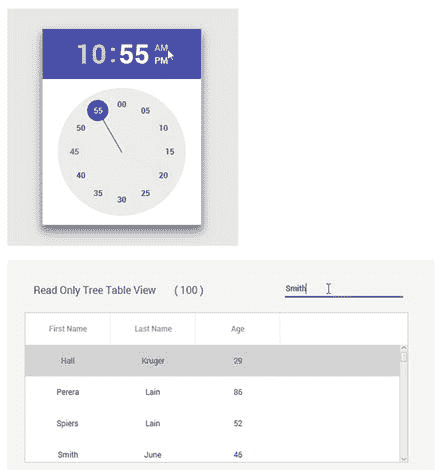

图 15-6.

应用于 JavaFX 应用程序的 Material Design 样式

图 15-7 展示了应用了推特 Bootstrap 外观的按钮。

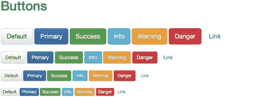

图 15-7.

应用于按钮控件的推特 Bootstrap 样式

随着 JavaFX 社区不断发展和适应这些新的 UI 样式，越来越多的开发者将这些流行的 UI 样式移植为库，以帮助你轻松地将 JavaFX 应用程序转换为这些流行的 UI 样式。

新加入创建流行 Web 和移动设备主题行列的开发者如下：

*   （谷歌）Material Design
    *   GluonHQ
        *   网站：[`http://gluonhq.com/products/mobile/`](http://gluonhq.com/products/mobile/)
    *   JFoenix
        *   网站：[`http://www.jfoenix.com`](http://www.jfoenix.com)
        *   作者：[`http://www.jfoenix.com/team.html`](http://www.jfoenix.com/team.html)
    *   MaterialFX
        *   网站：[`http://www.agix.pt/single-post/2015/09/02/MaterialFX-Material-Design-CSS-for-JavaFX`](http://www.agix.pt/single-post/2015/09/02/MaterialFX-Material-Design-CSS-for-JavaFX)
*   （推特）Bootstrap
    *   JBootx
        *   网站：[`https://github.com/dicolar/jbootx`](https://github.com/dicolar/jbootx)
        *   作者：[`https://github.com/dicolar/jbootx/graphs/contributors`](https://github.com/dicolar/jbootx/graphs/contributors)
    *   BootstrapFX
        *   网站：[`https://github.com/aalmiray/bootstrapfx`](https://github.com/aalmiray/bootstrapfx)
        *   作者：Andres Almiray


### 应用 JavaFX CSS 主题

在领略了一些精美的皮肤和 UI 样式之后，让我们来看看如何应用基于 JavaFX CSS 的样式。JavaFX 能够将层叠样式表应用于场景图及其节点，其方式与 Web 开发者对 HTML5 元素使用 CSS 样式表非常相似。这些 CSS 样式表是包含属性和值的外部文件，用于为 JavaFX 节点设置样式。一个 JavaFX CSS 文件的示例如清单 15-1 所示。

```
/* sample.css */
.button {
-fx-text-fill: brighter-sky-blue;
-fx-border-color: rgba(255, 255, 255, .80);
-fx-border-radius: 8;
-fx-padding: 6 6 6 6;
-fx-font: bold italic 20pt "LucidaBrightDemiBold";
}
/* ...更多样式 */
清单 15-1.
包含样式属性的 JavaFX CSS 文件
```

这段代码包含一个针对 JavaFX 按钮控件的 CSS 类样式定义。按钮 UI 控件默认具有一个类样式 `button`，该样式映射到以 `-fx-` 为前缀的属性。你将在本章后面学习 JavaFX CSS 样式设置，但现在我们先讨论如何在 CSS 样式表之间切换，从而动态地为应用程序换肤。

在本节中，你将学习两种将 CSS 样式表作为外观主题应用于 JavaFX 应用程序的方法。以下是将 JavaFX CSS 文件应用于场景图节点的两种方式。

*   `javafx.application.Application: setUserAgentStylesheet()`
*   `javafx.scene.Scene: getStylesheets().add()`

#### 使用 setUserAgentStylesheet(String URL) 方法

应用 CSS 样式表的第一种方法是在 JavaFX Application（`javafx.application.Application`）类上调用静态方法 `setUserAgentStylesheet()`。此静态方法会为 JavaFX 应用程序中的所有场景及其所有子节点设置样式，如下所示。

```
Application.setUserAgentStylesheet(url);
```

`setUserAgentStylesheet(String URL)` 方法接受一个表示 JavaFX CSS 文件的有效 URL 字符串。通常，CSS 文件被打包在 JAR 应用程序中；但它们也可以位于本地文件系统或远程 Web 服务器上。当 CSS 文件在类路径中时，调用以下方法将找到该 CSS 文件并生成一个用于访问该文件的 URL 字符串：

```
getClass().getResource("path/some_file.css").toExternalForm()
```

这假设该资源与编译后的类文件位于同一位置并被复制到一起。

以下代码片段将 `sample.css` 文件加载为 JavaFX 应用程序的当前外观。代码片段中的 `sample.css` 文件与当前类位于同一位置。换句话说，你的 Java 类和 CSS 文件在同一个目录中，因此文件名前不需要路径。

```
Application.setUserAgentStylesheet(getClass().getResource("sample.css")
.toExternalForm());
```

`setUserAgentStylesheet()` 方法会将样式全局应用于应用程序拥有的所有场景，例如上下文菜单和子弹出窗口。JavaFX 8 目前包含两个样式表——Caspian 和 Modena——它们作为默认的跨平台外观皮肤。由于这两个样式表是预定义的，你可以使用 `setUserAgentStylesheet()` 方法轻松地在它们之间切换。以下代码展示了如何在 Caspian 和 Modena 外观样式表之间切换。

```
// 切换到 JavaFX 2.x 的 CASPIAN 外观。
Application.setUserAgentStylesheet(STYLESHEET_CASPIAN);
// 切换到 JavaFX 8 的 Modena 外观。
Application.setUserAgentStylesheet(STYLESHEET_MODENA);
```

学习专业人士如何做到这一点（创建皮肤）的一个好方法是查看优秀的示例。你可以从 `jfxrt.jar` 文件中提取 CSS 文件（`caspian.css` 和 `modena.css`），或者查看位于 [`http://openjdk.java.net`](http://openjdk.java.net) 的 JavaFX 源代码。要获取 `jfxrt.jar`，你必须使用 Java 9 之前的 JDK。

由于 Java 9 不再在运行时或 JDK 中提供 `jfxrt.jar`，你需要在 `JAVA_HOME` 下查找 `jmods` 目录。Project Jigsaw 的一部分工作也是将运行时重构为模块。在 `jmods` 目录中，你应该会找到名为 `javafx.controls.jmod` 的模块。为了进入模块文件，你必须将该模块复制到某个临时目录。接下来，你应该重命名复制的模块，并以 `.jar` 扩展名结尾以便解压。最后，在重命名后的模块上调用 `jar xvf`。使用你的文件资源管理器或 Finder 定位以下文件：

```
classes/com/sun/javafx/scene/control/skin/modena/modena.css
```

`modena.css` 文件包含了默认外观的所有 JavaFX CSS 样式。你可以从这个文件中学习专家如何为 JavaFX 平台上的每个控件设置样式。

注意

当你通过传递 `null` 值调用 `setUserAgentStylesheet(null)` 方法时，默认样式表（Modena）将被自动加载并设置为当前外观。但是，如果你使用的是 JavaFX 2.x，默认样式表将是 Caspian。

#### 使用 Scene 的 getStylesheets().add(String URL) 方法

应用外观的第二种方法是调用 Scene 对象的 `getStylesheets().add()` 方法。与第一种应用外观的方法不同，`getStylesheets().add()` 方法用于为单个场景及其子节点设置样式。

通过调用 `getStylesheets().add()` 方法，你可以为单个场景及其子节点设置样式，如下所示：

```
Scene scene = ...
scene.getStylesheets().add(getClass().getResource("sample.css")
.toExternalForm());
```

与之前调用 `setUserAgentStylesheet()` 类似，你需要传入一个表示 JavaFX CSS 文件的 URL 字符串。稍后，你将看到一个示例应用程序，它通过使用 `setUserAgentStylesheet()` 或 `getStylesheets().add()` 方法在不同样式之间切换。如果你决定创建一个完整的 CSS 来为整个应用程序设置样式，你可能会犹豫是否要从头开始。

创建一个完整的外观需要数百甚至数千行代码，才能为 JavaFX 中的每个 UI 控件设置样式。因此，一个好的做法是从默认外观开始，然后使用 `getStylesheets().add()` 方法覆盖样式。

我基本上创建了非常小的外观样式表文件来演示切换主题的能力。这些简单的示例 CSS 文件只包含少量 CSS 样式，用于设置少量 UI 控件的样式。换句话说，示例中的小型 CSS 文件是通过 `getStylesheets().add()` 方法加载的，该方法仅对部分节点进行样式设置，而不是应用程序中的每个节点。

由于默认样式表（`Modena.css`）是通过先前调用 `setUserAgentStylesheet(null)` 方法加载的，因此较小的自定义 CSS 样式文件可以“依附”在默认样式表之上。好处是你无需从头开始创建新的外观。以下代码片段首先使用 `null` 值调用 `setUserAgentStylesheet()` 方法，该方法将 Modena 加载为默认外观。然后，它通过调用 `getStylesheets().add()` 方法来设置场景的附加样式。

```
Application.setUserAgentStylesheet(null); // 默认为 Modena
// 为场景应用自定义外观。
scene.getStylesheets()
.add(getClass().getResource("my_cool_skin.css")
.toExternalForm());
```


### 主题切换示例

为了演示如何在不同的 CSS 样式表（也称为皮肤或主题）之间切换，我创建了一个名为“外观选择器”的示例应用程序，它允许你在不同的预定义主题之间进行选择。图 15-8 展示了“外观选择器”示例应用程序的初始界面，它显示了一个包含常用 UI 控件的手风琴式 UI 控制面板，默认使用的是 Modena 外观。

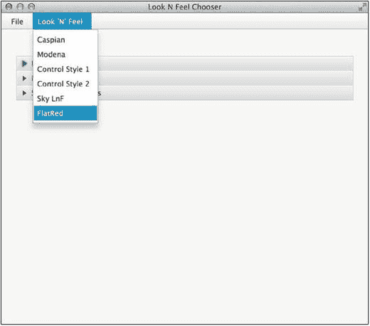

图 15-8.

可从“外观”菜单中选择的预定义外观主题

在图 15-8 中，你会注意到用于选择外观（皮肤）的菜单选项。一旦选择了某个外观，应用程序的外观将动态变化。图 15-9 展示了应用程序切换到 Flat Red 外观后的效果。

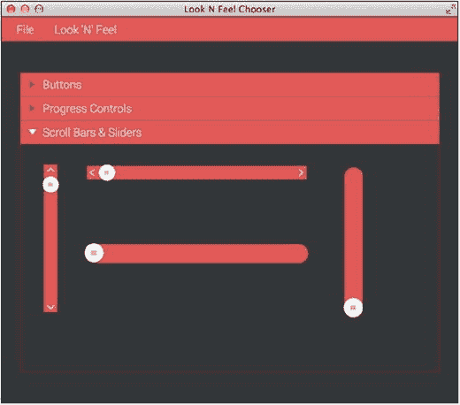

图 15-9.

使用 Flat Red 外观的“外观选择器”应用程序

在图 15-9 中，请注意手风琴式 UI 控件的标题栏显示为“滚动条与滑块”。它已展开，并展示了应用了所选外观的 UI 控件。这是一种向客户或用户展示不同外观主题的绝佳方式，同时应用程序的其他功能仍可正常运行。

下一节将解释清单 15-2 中“外观选择器”应用程序的主要源代码。为了节省篇幅，这里只展示 `start()` 方法，而非全部源代码。要查看“外观选择器”应用程序的完整源代码清单，请访问本书网站，下载第 15 章 `LookAndFeelChooser` 项目。

#### “外观选择器”示例应用程序代码

将“外观选择器”项目加载到 NetBeans IDE 中，可以看到源代码由六个文件组成：`LookNFeelChooser.java`、`lnf_demo.fxml`、`controlStyle1.css`、`controlStyle2.css`、`flatred.css` 和 `sky.css`。`.ttf` 文件是 Flat Red 外观中使用的 TrueType 字体。图 15-10 展示了 NetBeans IDE 中的项目结构。

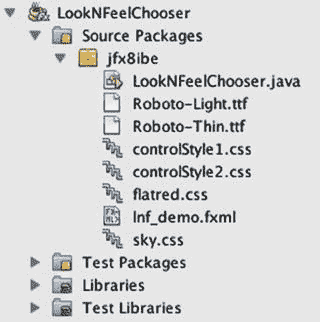

图 15-10.

NetBeans IDE 中的“外观选择器”项目结构

查看项目结构，你会注意到 `LookNFeelChooser.java` 文件是主要的驱动程序应用程序类。`lnf_demo.fxml` 文件是一个 FXML 格式的文件，代表中心内容，其中包含手风琴式 UI 控件及其他 UI 控件元素。该 FXML 文件由 Scene Builder 工具创建。其余文件是代表不同外观主题的 JavaFX CSS 样式表：`controlStyle1.css`、`controlStyle2.css`、`flatred.css` 和 `sky.css`。

清单 15-2 展示了 `LookNFeelChooser.java Application` 类的 `init()` 和 `start()` 方法。请记住，所有 JavaFX 应用程序首先通过 `init()` 方法进行初始化，然后从 `start()` 方法开始执行。在查看完清单 15-2 后，你可以阅读关于其工作原理的说明。

```
@Override public void init() {
Font.loadFont(LookNFeelChooser.class
.getResourceAsStream("Roboto-Thin.ttf"), 10)
.getName();
Font.loadFont(LookNFeelChooser.class
.getResourceAsStream("Roboto-Light.ttf"), 10)
.getName();
}
@Override public void start(Stage primaryStage) throws IOException {
BorderPane root    = new BorderPane();
Parent     content = FXMLLoader.load(getClass().getResource("lnf_demo.fxml"));
Scene      scene   = new Scene(root, 650, 550, Color.WHITE);
root.setCenter(content);
// 菜单栏
MenuBar menuBar = new MenuBar();
// 文件菜单
Menu     fileMenu = new Menu("_ 文件");
MenuItem exitItem = new MenuItem("退出");
exitItem.setAccelerator(new KeyCodeCombination(KeyCode.X, KeyCombination.SHORTCUT_DOWN));
exitItem.setOnAction(ae -> Platform.exit());
fileMenu.getItems().add(exitItem);
menuBar.getMenus().add(fileMenu);
// 外观菜单
Menu lookNFeelMenu = new Menu("_ 外观");
lookNFeelMenu.setMnemonicParsing(true);
menuBar.getMenus().add(lookNFeelMenu);
root.setTop(menuBar);
// 外观选择
MenuItem caspianMenuItem = new MenuItem("Caspian");
caspianMenuItem.setOnAction(ae -> {
scene.getStylesheets().clear();
setUserAgentStylesheet(null);
setUserAgentStylesheet(STYLESHEET_CASPIAN);
});
MenuItem modenaMenuItem = new MenuItem("Modena");
modenaMenuItem.setOnAction(ae -> {
scene.getStylesheets().clear();
setUserAgentStylesheet(null);
setUserAgentStylesheet(STYLESHEET_MODENA);
});
MenuItem style1MenuItem = new MenuItem("控件样式 1");
style1MenuItem.setOnAction(ae -> {
scene.getStylesheets().clear();
setUserAgentStylesheet(null);
scene.getStylesheets()
.add(getClass().getResource("controlStyle1.css")
.toExternalForm());
});
MenuItem style2MenuItem = new MenuItem("控件样式 2");
style2MenuItem.setOnAction(ae -> {
scene.getStylesheets().clear();
setUserAgentStylesheet(null);
scene.getStylesheets()
.add(getClass().getResource("controlStyle2.css")
.toExternalForm());
});
MenuItem skyMenuItem = new MenuItem("天空外观");
skyMenuItem.setOnAction(ae -> {
scene.getStylesheets().clear();
setUserAgentStylesheet(null);
scene.getStylesheets()
.add(getClass().getResource("sky.css")
.toExternalForm());
});
MenuItem flatRedMenuItem = new MenuItem("FlatRed");
flatRedMenuItem.setOnAction(ae -> {
scene.getStylesheets().clear();
setUserAgentStylesheet(null);
scene.getStylesheets()
.add(getClass().getResource("flatred.css")
.toExternalForm());
});
lookNFeelMenu.getItems()
.addAll(caspianMenuItem,
modenaMenuItem,
style1MenuItem,
style2MenuItem,
skyMenuItem,
flatRedMenuItem);
primaryStage.setTitle("外观选择器");
primaryStage.setScene(scene);
primaryStage.show();
}
清单 15-2.
用于在外观（JavaFX CSS）样式表之间切换的“外观选择器”项目源代码。(LookNFeelChooser.java)
```

注意

要运行此示例，请确保 CSS 和 TTF（TrueType 字体）文件位于编译后的类目录中。将资源文件放在与加载它们的编译类文件相同的目录（包）中，可以轻松加载它们。CSS 文件最初与此源代码示例文件位于同一位置。在 NetBeans 中，你可以选择“清理并构建项目”，或者将文件复制到类的构建目录中。


#### 工作原理

“外观选择器”应用程序首先通过重载方法 `init()` 进行初始化，该方法会加载“扁平红”外观主题所需的字体。执行 `init()` 方法后，JavaFX 应用程序生命周期将调用 `start()` 方法。

在 `start()` 方法中，代码首先创建一个边框窗格布局，然后加载一个 FXML 文件，并将其放置为中央内容区域。FXML 是一种基于 XML 的语言，用于描述 JavaFX 用户界面。这提供了一种将表示层与应用程序逻辑层分离的方法。通常，FXML 由 GUI 构建工具生成，允许设计人员拖放控件并以图形方式创建 UI。以下代码行使用 `FXMLLoader.load()` 方法对中央内容进行解组（反序列化）。中央内容窗格是一个 `AnchorPane` 布局，其中包含一个持有其他 UI 控件的 Accordion 控件。

```
Parent content = FXMLLoader.load(getClass().getResource("lnf_demo.fxml"));
```

要了解有关 Scene Builder 工具的更多信息，请参阅第 5 章。

继续看示例代码，你会注意到通常使用根节点创建场景。接下来，代码构建了一个包含菜单项的菜单栏。第一个菜单是“文件”菜单，允许用户退出应用程序。请注意，为了使用键盘快捷键快速退出，`KeyCodeCombination` 实例允许用户按下 Ctrl+X 组合键。要了解菜单和键盘快捷键，请参阅第 4 章。

“外观”菜单上的第二个菜单选项允许用户选择预定义的外观 CSS 样式表文件。菜单项被设置为调用基于 `onAction` 事件触发的处理程序代码（lambda 表达式）。以下代码片段是一个菜单项，负责使用 Caspian CSS 样式切换应用程序的外观：

```
MenuItem caspianMenuItem = new MenuItem("Caspian");
caspianMenuItem.setOnAction(ae -> {
scene.getStylesheets().clear();
setUserAgentStylesheet(STYLESHEET_CASPIAN);
});
```

在 JavaFX API 之上，`STYLESHEET_CASPIAN` 和 `STYLESHEET_MODENA` 值是表示基于其在类路径上位置的 CSS 文件的字符串。

由于其余代码非常相似，我将快进到最后一个外观菜单选项，该选项切换到“扁平红”外观。其他菜单项基本相同，并调用相同的方法来清除先前加载的 CSS 样式表文件。但是，对于“扁平红”外观，我使用了 `getStylesheets().add()` 方法仅对当前场景级别的节点进行样式设置。

“扁平红”外观对一部分 UI 控件进行样式设置，包括滑块、滚动条、按钮和进度控件。接下来显示的代码片段设置了一个可选的菜单项，该菜单项将使用“扁平红”外观为应用程序设置皮肤。`onAction` 代码清除场景的样式表，然后将 `UserAgentStylesheet` 设置为 `null`。最后，加载 `flatred.css` 文件来为给定场景设置样式。

```
MenuItem flatRedMenuItem = new MenuItem("FlatRed");
flatRedMenuItem.setOnAction(ae -> {
scene.getStylesheets().clear();
setUserAgentStylesheet(null);
scene.getStylesheets()
.add(getClass().getResource("flatred.css")
.toExternalForm());
});
```

## JavaFX CSS 样式设置

既然你已经知道如何加载 CSS 样式表文件，那么我们来讨论一下 JavaFX CSS 选择器和样式属性（规则）。与 HTML5 使用 CSS 样式表的方式类似，存在与场景图上的 Node 对象关联的选择器或样式类。所有 JavaFX 场景图节点都有 `setId()`、`getStyleClass().add()` 和 `setStyle()` 方法，用于应用可能更改节点背景颜色、边框、描边等的样式属性。

在学习选择器之前，我想让你参考以下位置的 JavaFX CSS 参考指南：

[`http://docs.oracle.com/javase/8/javafx/api/javafx/scene/doc-files/cssref.html`](http://docs.oracle.com/javase/8/javafx/api/javafx/scene/doc-files/cssref.html)

这份宝贵的参考指南在本书及以后的内容中都会非常有用。

### 什么是选择器？

与用于设置 HTML 元素样式的 W3C CSS（万维网联盟）标准类似，JavaFX CSS 也有选择器的概念。选择器基本上是用于定位场景图上 JavaFX 节点的标签，以便使用 CSS 样式定义进行样式设置。两种选择器类型是 `id` 和 `class`。`id` 选择器是在场景节点上设置的唯一字符串名称。

`class` 选择器也是一个字符串名称，可以作为标签添加到任何 JavaFX 节点。我还应该指出，类选择器与 C++ 或 Java 类的概念无关。类选择器允许任意数量的节点包含相同的类字符串名称，从而能够使用一个 CSS 样式定义来设置多个节点的样式。在接下来的部分中，你将进一步了解如何定义 CSS 选择器类型，然后我会给出一个示例。

#### CSS id 类型选择器

`id` 类型选择器是分配给节点的唯一字符串名称。这意味着没有其他节点的 ID 可以相同。使用 `id` 类型选择器时，你需要在 JavaFX 节点对象上调用 `setId(String ID)` 方法。例如，要定位一个 ID 为 `my-button` 的 `Button` 实例，你需要调用 `setId("my-button")` 方法。要为 ID 为 `my-button` 的按钮设置样式，你需要创建一个 CSS 样式定义块，并使用 ID 选择器 `#my-button` 声明，如下所示：

```
#my-button {
-fx-text-fill: rgba(17, 145, 213, .90);
-fx-border-color: rgba(255, 255, 255, .80);
-fx-border-radius: 8;
-fx-padding: 6 6 6 6;
-fx-font: bold italic 20pt "LucidaBrightDemiBold";
}
```

此 CSS 样式块将应用于具有唯一 ID `my-button` 的按钮。因此，不允许其他节点包含 ID `my-button`。你还会注意到，在样式块中使用 ID 选择器时，CSS 选择器名称以 `#` 符号为前缀，而在 Java 代码中设置 `id` 时，不使用 `#` 符号。

#### CSS class 类型选择器

使用类类型选择器时，你将调用 `getStyleClass().add(String styleClass)` 方法向节点添加选择器。该方法允许你拥有多个样式类来设置节点的样式。由于 `getStyleClass()` 方法返回一个 `ObservableList`，你可以临时添加和删除样式类，以动态更新它们的外观。例如，让我们通过 `getStyleClass().add("num-button")` 方法定位两个按钮，其样式类（`ObservableList`）包含一个名为 `num-button` 的类。以下是一个 CSS 样式定义块，使用类选择器 `.num-button` 声明：

```
.num-button {
-fx-background-color: white, rgb(189,218,230), white;
-fx-background-radius: 50%;
-fx-background-insets: 0, 1, 2;
-fx-font-family: "Helvetica";
-fx-text-fill: black;
-fx-font-size: 20px;
}
```

此 CSS 样式块将应用于具有样式类 `num-button` 的按钮。你将会注意到，使用类选择器时，CSS 选择器名称以点号（`.`）为前缀，而在 Java 代码中添加选择器时，不使用（`.`）符号。

#### 选择器模式

到目前为止，你只看到了简单的选择器；然而，选择器可以具有遍历场景图节点层次结构（从根节点到子节点）的模式。对选择器模式的全面讨论超出了本书的范围，但我将简要提及常见的选择器模式并介绍伪类。


##### 通用选择器模式

通常，你会希望基于通用选择器模式来设置多个节点的样式。一种典型的选择器模式是：为父节点属于特定类型的子节点设置样式。例如，你可能希望为所有父节点是 `HBox` 的按钮设置样式。

另一种模式是为两种不同类型的节点设置一个共同的属性。以下示例展示了这两种用例的选择器模式：

```
/* 为所有父节点是 HBox 的按钮设置样式 */
.hbox > .button {
-fx-text-fill: black;
}
/* 为所有标签和文本节点设置样式 */
.label, .text {
-fx-font-size: 20px;
}
```

如你所见，选择器模式 (`.hbox > .button`) 为 `HBox` 的后代 `Button` 节点设置样式。这非常直观。两个选择器之间的大于号让系统知道哪些节点需要被设置样式。

此外，正如 JavaFX CSS 参考指南中所述，UI 控件的选择器有一套命名约定。它们全部使用小写字母，如果控件名称包含多个单词，则用连字符分隔。例如，`GridPane` 的类选择器将是 `.grid-pane`。请记住，并非所有节点默认都有命名的类选择器，因此请参考 JavaFX CSS 参考指南。

第二个用例中的选择器模式 (`.label, .text`) 涉及为不同类型的节点设置一个共同的属性。这个示例是一个选择器模式，它为所有 `Label` 节点和 `Text` 节点设置相同的文本字体大小。逗号表示一个需要设置样式的选择器列表。换句话说，在此场景中，字体大小将被设置为 20 磅。

##### 伪类选择器

伪类选择器用于为具有不同状态的节点设置样式。一个例子是 `Button` 节点的悬停状态。一个按钮控件具有以下状态：`armed`、`disabled`、`focused`、`hover`、`pressed` 和 `show-mnemonic`。要指定带有伪类的选择器，你必须在主选择器名称后附加一个冒号和状态（类型）。以下代码片段展示了一个具有类选择器 `num-button` 的按钮的两种选择器模式：

```
.num-button {
-fx-background-color: white, bluish-gray, white;
-fx-background-radius: 50%;
-fx-background-insets: 0, 1, 2;
-fx-font-family: "Helvetica";
-fx-text-fill: black;
}
.num-button:hover {
-fx-background-color: black, white, black;
-fx-text-fill: white;
}
```

在这段 CSS 代码中，第一个选择器 (`.num-button`) 仅仅为按钮的正常状态设置样式。然而，第二个带有附加冒号和状态（hover）的选择器将更改一部分属性，对它们进行细微调整。在此场景中，当鼠标光标移动到（悬停）具有样式类 `num-button:hover` 的按钮上时，按钮的颜色和文本的填充颜色将会反转。图 15-11 展示了当鼠标悬停在数字键盘的按钮 3 上时，伪选择器生效的情况。


图 15-11.

当鼠标光标位于任何数字键盘按钮上方时，会使用带有 hover 伪类的选择器

#### 一个选择器样式设置示例

为了演示使用 `id` 和 `class` 类型选择器，我创建了一个类似智能手机数字键盘的应用程序，如图 15-12 所示。

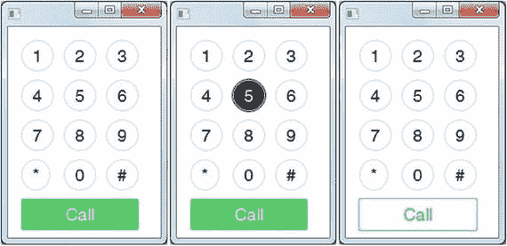

图 15-12.

一个模仿智能手机数字键盘的应用程序。

在图 15-12 中，注意数字键盘的 4 × 3 网格圆形按钮及其下方用于拨打电话的绿色矩形按钮。清单 15-3 是包含源代码的主要 `start()` 方法。清单 15-4 则展示了 CSS 文件 `mobile_buttons.css` 的内容。

```
@Override
public void start(Stage primaryStage) {
BorderPane root = new BorderPane();
Scene scene = new Scene(root, 180, 250);
scene.getStylesheets()
.add(getClass().getResource("mobile_buttons.css")
.toExternalForm());
String[] keys = {"1", "2", "3",
"4", "5", "6",
"7", "8", "9",
"*", "0", "#"};
GridPane numPad = new GridPane();
numPad.getStyleClass().add("num-pad");
for (int i=0; i < 12; i++) {
Button button = new Button(keys[i]);
button.getStyleClass().add("num-button");
numPad.add(button, i % 3, (int) Math.ceil(i/3) );
}
// 呼叫按钮
Button call = new Button("Call");
call.setId("call-button");
call.setMaxSize(Double.MAX_VALUE, Double.MAX_VALUE);
numPad.add(call, 0, 4);
GridPane.setColumnSpan(call, 3);
GridPane.setHgrow(call, Priority.ALWAYS);
root.setCenter(numPad);
primaryStage.setScene(scene);
primaryStage.show();
}
清单 15-3.
数字键盘应用程序的 JavaFX 源代码
```

清单 15-3 中的代码将加载 `mobile_button.css` 文件，该文件会应用于场景图。CSS 文件的内容如清单 15-4 所示。

```
.root {
-fx-background-color: white;
-fx-font-size: 20px;
bright-green: rgb(59,223, 86);
bluish-gray: rgb(189,218,230);
}
.num-pad {
-fx-padding: 15px, 15px, 15px, 15px;
-fx-hgap: 10px;
-fx-vgap: 8px;
}
.num-button {
-fx-background-color: white, bluish-gray, white;
-fx-background-radius: 50%;
-fx-background-insets: 0, 1, 2;
-fx-font-family: "Helvetica";
-fx-text-fill: black;
}
.num-button:hover {
-fx-background-color: black, white, black;
-fx-text-fill: white;
}
#call-button {
-fx-background-color: white, bright-green;
-fx-background-radius: 2;
-fx-background-insets: 0, 1;
-fx-font-family: "Helvetica";
-fx-text-fill: white;
}
#call-button:hover {
-fx-background-color: bright-green, white;
-fx-background-radius: 2;
-fx-background-insets: 0, 1;
-fx-font-family: "Helvetica";
-fx-text-fill: bright-green;
}
清单 15-4.
mobile_buttons.css CSS 文件的内容
```

#### 工作原理

代码首先创建一个场景，该场景以 `BorderPane` 作为根节点。创建场景后，代码加载 CSS 样式表文件 `mobile_buttons.css` 来为当前场景的节点设置样式。接下来，代码简单地使用 `GridPane` 类创建一个网格，并生成 12 个按钮放置在每个单元格中。注意在 `for` 循环中，每个按钮都通过 `getStyleClass().add()` 方法设置了名为 `num-button` 的样式类。

最后，绿色的呼叫按钮将被添加到网格面板的最后一行。由于呼叫按钮是唯一的，其 `id` 选择器被设置为 `call-button`，并使用 `id` 选择器设置样式，这意味着 CSS 文件中命名的选择器将以 `#` 符号为前缀。要查看一些令人惊叹的按钮样式，请访问 `FXExperience.com` 上关于使用 CSS 设置按钮样式的博客文章，链接如下：

[`http://fxexperience.com/2011/12/styling-fx-buttons-with-css`](http://fxexperience.com/2011/12/styling-fx-buttons-with-css)

在 FXExperience 上，这篇关于使用 CSS 设置 FX 按钮样式的博客文章由 Jasper Potts（Oracle 客户端 Java 开发体验架构师）撰写。

### 如何定义基于 -fx- 的样式属性（规则）

我相信到现在你已经注意到样式定义块中许多以 `-fx-` 为前缀的名称-值对（属性）。这些通常被称为规则的属性，可以被定义为其值能够设置区域边框宽度、背景填充颜色等。在本节中，你将学习如何使用选择器样式块来设置 JavaFX 节点的样式，以及如何通过内联样式来覆盖属性。


#### 使用选择器样式定义块为节点设置样式

选择器样式定义块始终以选择器名称开头，该名称以 `.` 或 `#` 符号为前缀。如前所述，该符号决定了选择器的类型。选择器将以左花括号开始一个代码块，随后是属性或规则定义。每个 JavaFX 主题属性或规则都将以 `-fx-` 及其相应的属性名作为前缀。属性名和值之间用 `:` 符号分隔，并以分号结束该键值对。要完成样式块，只需用右花括号结束该块即可。选择器样式定义块的语法如下所示：

```
. 或 # {
-fx- : ;
}
```

最后要提的一点是，可以为 CSS 样式定义添加注释。要添加注释，请使用开头的斜杠星号 `/*` 和结尾的星号斜杠 `*/`（与在 C/C++ 和 Java 中添加注释的方式相同）。下面是一个在选择器样式块定义中使用注释的示例：

```
.num-button {
-fx-background-color: white, rgb(189,218,230), white;
/* 这是一条注释。
-fx-background-radius: 50%;
*/
-fx-background-insets: 0, 1, 2;
-fx-font-family: "Helvetica";
-fx-text-fill: black;
-fx-font-size: 20px;
}
```

#### 通过内联 JavaFX CSS 样式属性为节点设置样式

虽然 CSS 选择器块是为 JavaFX 节点设置样式的推荐方式，但在某些情况下，您可能希望覆盖样式属性。例如，您可能希望在鼠标光标悬停（`OnMouseEntered`）在指定按钮上时，临时放大该按钮并更改其文本颜色。当鼠标光标不再悬停（`OnMouseExited`）时，按钮的内联样式将被移除，从而将样式恢复为父级 `class` 或 `id` 选择器样式块。要覆盖从其祖先（父级）`id` 或 `class` 选择器设置的节点样式属性，可以调用节点的 `setStyle()` 方法。

为了实现刚才提到的示例，以下代码片段实现了一个按钮，其中包含响应 `OnMouseEntered` 和 `OnMouseExited` 事件并切换按钮文本大小和颜色的处理程序代码。

```
Button button = new Button("Press Me");
button.getStyleClass()
.add("my-default-style");
button.setOnMouseEntered(actionEvent ->
button.setStyle("-fx-font-size: 30px; -fx-text-fill: green;"));
button.setOnMouseExited(actionEvent -> button.setStyle(""));
```

#### 样式属性（规则）的限制

由于所有图形节点都继承自 `Node` 类，派生类将能够从其祖先继承样式属性。了解节点类型的继承层次结构非常重要，因为节点类型将有助于确定您可以控制的样式属性类型。例如，`Rectangle` 类继承自 `Shape`，而 `Shape` 又继承自 `Node`。话虽如此，您稍后会看到，一些您认为应该存在于节点上的属性实际上并不存在。那么，如何知道存在哪些属性呢？解决方案是参考 JavaFX CSS 参考指南。同样，基于节点类型，您可以设置的样式是有限制的。

### 遵守 JavaFX CSS 规则

您知道样式属性（规则）可以被覆盖吗？要覆盖属性，您必须了解规则定义时的优先级顺序。图 15-13 描绘了一个典型的场景图，其中包含一个根（父级）节点和子节点。诸如 `BorderPane` 布局节点之类的根节点将包含一个名为 root 的类选择器，该选择器用于顶级属性。

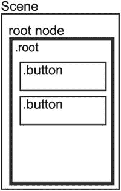

图 15-13.

一个包含根节点且子节点为按钮的场景

这些基本上是许多节点共有的属性，例如文本的字体大小或背景颜色。这对于主题化来说是一个很棒的功能，因为共享某个属性的许多节点都将继承该更改。如前所述，某些节点将包含默认选择器；例如，JavaFX `Button` 实例具有一个 `.button` 类选择器。

在图 15-13 中，类选择器 root 可能具有一个与文本相关的、在许多节点中通用的属性：

```
.root {
-fx-font-size: 12px;
}
.button {
-fx-font-size: 20px;
}
```

当您想要设置按钮文本字体大小的样式时，可以覆盖根节点的样式定义。为了覆盖 `-fx-font-size` 属性，按钮样式类定义块将用 20 磅字体覆盖父级的 12 磅字体。

信不信由你，除了刚才展示的方法之外，还有另一种方法可以覆盖类选择器 `.button` 的样式定义块。与 HTML5 CSS 类似，每个元素都有一个样式属性。JavaFX 的图形节点也有一个样式属性（属性）。以下是一个如何在 Java 代码中以编程方式设置样式属性的示例：

```
Button button = new Button("press it!");
button.setStyle("-fx-font-size: 30px;");
```

此代码将覆盖任何 `root-`、`id`- 或 `class`- 级别的选择器样式定义块。基本上，调用 `setStyle()` 方法允许您添加任意数量的属性-值对，只要它们用分号分隔即可。

## 自定义控件

> “原力与你同在，卢克。” ——欧比旺·克诺比

凭借您新获得的所有能力，还有一个强大的 API 您将需要掌握。想象一下，客户的需求要求使用专门的 UI 控件，例如 LED、仪表、旋钮和指示灯。当然，您可以尝试使用现有的 UI 控件并为其设置样式，但这即使不是不可能，也是相当困难的。那么，年轻的学徒该怎么做呢？（现在，请说出那句名言。）欢迎来到 JavaFX 自定义控件的世界（控件 API）！

作为创建自定义控件的一个示例，在本节中，您将学习如何创建一个发光二极管（LED）控件。本节首先描述 LED 控件。然后，当您查看创建自定义控件所涉及的类时，您将看到代码是如何组织的。之后，在您逐步了解代码细节之前，您将有机会查看代码。


### LED 自定义控件

发光二极管（LED）是许多电子设备中用于指示状态（如开或关）的常见元件。那么，为何不将 LED 作为代码中的自定义控件，用作视觉指示器呢？通常，一个 LED 包含两根导线和一个由透明塑料制成的本体，如图 15-14 所示。

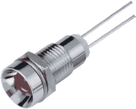

图 15-14.
一个典型的发光二极管（LED）

LED 通常安装在插座上。要创建一个模拟物理对象的自定义 JavaFX 控件，首先需要确定要描绘哪些材料和组件。

对于 LED 自定义 JavaFX 控件，我们可以近似模拟以下外观：

*   金属插座
*   塑料本体
*   由于曲面而在塑料本体顶部产生的光效

Java 开发者通常不喜欢的一件事，但对于设计自定义控件却非常有帮助，那就是使用绘图程序。准确地说，是矢量绘图程序。当控件的外观很重要时，使用一个擅长可视化事物的工具——比如用于创建图 15-15 的绘图程序——是很有意义的。因此，你应该做的第一件事就是为你计划创建的控件绘制一个矢量图。


图 15-15.
LED 控件的矢量图

你可以看到红色塑料本体周围的金属插座和白色高光。红色本体包含内阴影和外阴影，以营造更逼真的外观。如果你查看矢量图的各个部分，会发现三个填充了渐变的圆形，如图 15-16 所示。

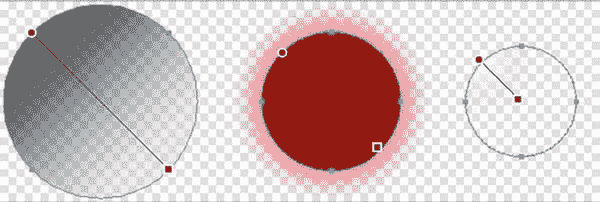

图 15-16.
矢量 LED 的三个组成部分

你从绘图程序开始编码，因为在这里你可以定义控件的大小、颜色、渐变和位置。使用绘图程序的一大优势是，通过更改颜色、大小和位置等参数，可以获得直接的视觉反馈。

在 JavaFX 中，创建自定义控件的方法不止一种，而是有很多种。以下是几种有效的方法：

*   自定义现有控件的 CSS
*   扩展现有控件
*   扩展 `Region` 节点
*   创建控件、皮肤和 CSS 文件
*   使用 Canvas 节点

本章重点介绍扩展 `Region` 节点并使用 CSS 的方法。要了解如何通过使用 `Canvas` 节点或使用单独的 `Control` 类、`Skin` 类和 CSS 文件来创建相同的 LED 控件，请查看 GitHub 仓库 [`http://github.com/HanSolo/JFX8CustomControls`](http://github.com/HanSolo/JFX8CustomControls)。对于本书，你可以从本书网站或以下地址获取源代码：

[`https://github.com/carldea/jfx9be/blob/master/chap15/JFX9CustomControls/src/jfx9controls/ledregion`](https://github.com/carldea/jfx9be/blob/master/chap15/JFX9CustomControls/src/jfx9controls/ledregion)

### LED 自定义控件示例代码的结构

我通常按以下方式组织控件中的代码：

*   构造函数
*   初始化：
    *   一个 `init()` 方法定义初始大小。
    *   一个 `initGraphics()` 方法设置控件的场景图。
    *   一个 `registerListeners()` 方法将监听器挂接到属性上。
*   一个 `Methods` 块包含 `get`、`set` 和 `property` 方法。
*   一个 `Resizing` 块包含调整控件大小和重绘控件的方法（如果需要）。

### LED 控件的属性

LED 控件将包含控件的逻辑（其属性）和可视化代码。由于 LED 是一个非常简单的控件，你不需要很多属性。本示例使用了五个属性：

*   `On`（当前状态的布尔属性）
*   `Blinking`（用于开关闪烁的布尔属性）
*   `Interval`（用于定义闪烁间隔的长整型属性）
*   `FrameVisible`（用于开关金属插座可见性的布尔属性）
*   `LedColor`（类型为 `Color` 的对象属性，用于定义 LED 的颜色）

清单 15-5 展示了这些属性的 `get`、`set` 和 `property` 方法。


```java
public class Led extends Region {
private static final double      PREFERRED_SIZE    = 16;
private static final double      MINIMUM_SIZE      = 8;
private static final double      MAXIMUM_SIZE      = 1024;
private static final PseudoClass ON_PSEUDO_CLASS   = PseudoClass.getPseudoClass("on");
private static final long        SHORTEST_INTERVAL = 50_000_000l;
private static final long        LONGEST_INTERVAL  = 5_000_000_000l;
// 模型/控制器相关
private ObjectProperty    ledColor;
private BooleanProperty          on;
private boolean                  _blinking = false;
private BooleanProperty          blinking;
private boolean                  _frameVisible = true;
private BooleanProperty          frameVisible;
private long                     lastTimerCall;
private long                     _interval = 500_000_000l;
private LongProperty             interval;
private AnimationTimer           timer;
// 视图相关
private double                   size;
private Region                   frame;
private Region                   led;
private Region                   highlight;
private InnerShadow              innerShadow;
private DropShadow               glow;
public final boolean isOn() {
return null == on ? false : on.get();
}
public final void setOn(final boolean ON) {
onProperty().set(ON);
}
public final BooleanProperty onProperty() {
if (null == on) {
on = new BooleanPropertyBase(false) {
@Override protected void invalidated() { pseudoClassStateChanged(ON_PSEUDO_CLASS, get()); }
@Override public Object getBean() { return this; }
@Override public String getName() { return "on"; }
};
}
return on;
}
public final boolean isBlinking() {
return null == blinking ? _blinking : blinking.get();
}
public final void setBlinking(final boolean BLINKING) {
if (null == blinking) {
_blinking = BLINKING;
if (BLINKING) {
timer.start();
} else {
timer.stop();
setOn(false);
}
} else {
blinking.set(BLINKING);
}
}
public final BooleanProperty blinkingProperty() {
if (null == blinking) {
blinking = new BooleanPropertyBase() {
@Override public void set(final boolean BLINKING) {
super.set(BLINKING);
if (BLINKING) {
timer.start();
} else {
timer.stop();
setOn(false);
}
}
@Override public Object getBean() {
return Led.this;
}
@Override public String getName() {
return "blinking";
}
};
}
return blinking;
}
public final long getInterval() {
return null == interval ? _interval : interval.get();
}
public final void setInterval(final long INTERVAL) {
if (null == interval) {
_interval = clamp(SHORTEST_INTERVAL, LONGEST_INTERVAL, INTERVAL);
} else {
interval.set(INTERVAL);
}
}
public final LongProperty intervalProperty() {
if (null == interval) {
interval = new LongPropertyBase() {
@Override public void set(final long INTERVAL) {
super.set(clamp(SHORTEST_INTERVAL, LONGEST_INTERVAL, INTERVAL));
}
@Override public Object getBean() {
return Led.this;
}
@Override public String getName() {
return "interval";
}
};
}
return interval;
}
public final boolean isFrameVisible() {
return null == frameVisible ? _frameVisible : frameVisible.get();
}
public final void setFrameVisible(final boolean FRAME_VISIBLE) {
if (null == frameVisible) {
_frameVisible = FRAME_VISIBLE;
} else {
frameVisible.set(FRAME_VISIBLE);
}
}
public final BooleanProperty frameVisibleProperty() {
if (null == frameVisible) {
frameVisible = new SimpleBooleanProperty(this, "frameVisible", _frameVisible);
}
return frameVisible;
}
public final Color getLedColor() {
return null == ledColor ? Color.RED : ledColor.get();
}
public final void setLedColor(final Color LED_COLOR) {
ledColorProperty().set(LED_COLOR);
}
public final ObjectProperty ledColorProperty() {
if (null == ledColor) {
ledColor = new SimpleObjectProperty(this, "ledColor", Color.RED);
}
return ledColor;
}
// ******************** 工具方法 ***********************************
public static long clamp(final long MIN, final long MAX, final long VALUE) {
if (VALUE < MIN) return MIN;
if (VALUE > MAX) return MAX;
return VALUE;
}
清单 15-5.
属性操作代码 (Led.java)
```

### LED 控件的初始化代码

在 LED 控件的构造函数中，首先要做的是加载对应的 CSS 文件并添加主样式类，如下所示：

```
public Led() {
getStylesheets().add(getClass().getResource("led.css").toExternalForm());
getStyleClass().add("led");
然后我们简单地初始化将用于使 LED 控件闪烁的 AnimationTimer：
lastTimerCall = System.nanoTime();
timer         = new AnimationTimer() {
@Override public void handle(final long NOW) {
if (NOW > lastTimerCall + getInterval()) {
setOn(!isOn());
lastTimerCall = NOW;
}
} };
```

在构造函数中最后要做的是调用这些方法来初始化控件的大小、初始化场景图并注册一些监听器：

```
init();
initGraphics();
registerListeners();
```

为了确保 LED 控件在初始化期间能够正确调整大小，必须在 `init()` 方法中设置最小、首选和最大尺寸，该方法如下所示：

```
private void init() {
if (Double.compare(getWidth(), 0) <= 0 || Double.compare(getHeight(), 0) <= 0 ||
Double.compare(getPrefWidth(), 0) <= 0 || Double.compare(getPrefHeight(), 0) <= 0) {
setPrefSize(PREFERRED_SIZE, PREFERRED_SIZE);
}
if (Double.compare(getMinWidth(), 0) <= 0 || Double.compare(getMinHeight(), 0) <= 0) {
setMinSize(MINIMUM_SIZE, MINIMUM_SIZE);
}
if (Double.compare(getMaxWidth(), 0) <= 0 || Double.compare(getMaxHeight(), 0) <= 0) {
setMaxSize(MAXIMUM_SIZE, MAXIMUM_SIZE);
}
}
```

#### 可视化代码

`javafx.scene.layout.Region` 节点是一个轻量级的 JavaFX 容器，它可以包含其他节点并通过 CSS 设置样式。通过扩展 `Region` 节点，自定义控件将包含控件的逻辑以及可视化代码。在清单 15-6 所示的 `initGraphics()` 方法中，代码通过创建所需的节点并为其应用适当的 CSS 样式来设置控件的场景图。

```
private void initGraphics() {
// 创建金属插座的节点
frame = new Region();
frame.getStyleClass().setAll("frame");
frame.setOpacity(isFrameVisible() ? 1 : 0);
// 创建主 LED 塑料主体的节点
led = new Region();
led.getStyleClass().setAll("main");
led.setStyle("-led-color: " + (getLedColor()).toString().replace("0x", "#") + ";");
// 为主 LED 主体创建内阴影效果
innerShadow = new InnerShadow(BlurType.TWO_PASS_BOX,
Color.rgb(0, 0, 0, 0.65),
8, 0d, 0d, 0d);
// 为主 LED 主体创建投影效果（发光效果）
glow = new DropShadow(BlurType.TWO_PASS_BOX,
getLedColor(),
20, 0d, 0d, 0d);
glow.setInput(innerShadow);
// 为主 LED 主体上的高光效果创建节点
highlight = new Region();
highlight.getStyleClass().setAll("highlight");
// 将所有节点添加到此控件的场景图中
getChildren().addAll(frame, led, highlight);
}
清单 15-6.
设置 LED 控件场景图
```

到目前为止，该示例已经创建了 LED 控件所需的每个节点，并从 CSS 文件中应用了适当的样式。


#### LED 控制器的 CSS 文件

在 `initGraphics()` 方法中创建的每个节点都有其专属的 CSS 样式类，这些类定义在 `led.css` 文件中。文件内容如下：

```
/* 主 LED 样式类，其中定义了 -led-color 变量 */
.led {
-led-color  : red;
-frame-color: linear-gradient(from 14% 14% to 84% 84%,
rgba(20, 20, 20, 0.64706) 0%,
rgba(20, 20, 20, 0.64706) 15%,
rgba(41, 41, 41, 0.64706) 26%,
rgba(200, 200, 200, 0.40631) 85%,
rgba(200, 200, 200, 0.3451) 100%);
}
/* .frame 子类，定义金属插座的填充 */
.led .frame {
-fx-background-color : -frame-color;
-fx-background-radius: 1024;
}
/* .main 子类，定义 LED 塑料外壳在关闭状态下的填充 */
.led .main {
-fx-background-color : linear-gradient(from 15% 15% to 83% 83%,
derive(-led-color, -80%) 0%,
derive(-led-color, -87%) 49%,
derive(-led-color, -80) 100%);
-fx-background-radius: 1024;
}
/* .main 子类与 :on 伪类结合，定义 LED 塑料外壳在开启状态下的填充 */
.led:on .main {
-fx-background-color: linear-gradient(from 15% 15% to 83% 83%,
derive(-led-color, -23%) 0%,
derive(-led-color, -50%) 49%,
-led-color 100%);
}
/* .highlight 子类，定义高光效果的填充 */
.led .highlight {
-fx-background-color : radial-gradient(center 15% 15%, radius 50%,
white 0%,
-fx-background-radius: 1024;
}
```

由于在 CSS 中可以使用百分比来定义渐变中的位置，因此无需担心控件的实际尺寸来计算渐变的起始和结束位置。与 Java Swing 相比，这是一个巨大的优势，因为在 Swing 中，每次控件尺寸变化时都必须重新计算所有这些值。而在 JavaFX 中，所有这些计算都将自动完成。正如你将看到的，这大大减少了调整尺寸的代码量。

#### 调整 LED 控制器的大小

在 JavaFX 中，布局容器的大小决定了其子项的大小，因此必须确保控件由其布局容器调整大小。这意味着，如果将 LED 控件放入 `StackPane`（它会根据自身大小调整子项大小），LED 的大小将与 `StackPane` 相同。因此，必须在 `registerListeners()` 方法中为控件的 `widthProperty()` 和 `heightProperty()` 挂接监听器。

```
private void registerListeners() {
widthProperty().addListener(observable -> resize());
heightProperty().addListener(observable -> resize());
frameVisibleProperty().addListener(observable ->
frame.setOpacity(isFrameVisible() ? 1 : 0));
onProperty().addListener(observable -> led.setEffect(isOn() ? glow : innerShadow));
ledColorProperty().addListener(observable -> {
led.setStyle("-led-color: " + (getLedColor()).toString().replace("0x", "#") + ";");
resize();
});
}
```

此方法为所有可能影响 LED 控件可视化效果或大小的属性挂接了监听器。当宽度和高度的监听器被触发时，它们将调用 `resize()` 方法，该方法将负责调整控件中所有节点的大小。

```
private void resize() {
size = getWidth()  0) {
if (getWidth() > getHeight()) {
setTranslateX(0.5 * (getWidth() - size));
} else if (getHeight() > getWidth()) {
setTranslateY(0.5 * (getHeight() - size));
}
innerShadow.setRadius(0.07 * size);
glow.setRadius(0.36 * size);
glow.setColor(getLedColor());
frame.setPrefSize(size, size);
led.setPrefSize(0.72 * size, 0.72 * size);
led.relocate(0.14 * size, 0.14 * size);
led.setEffect(isOn() ? glow : innerShadow);
highlight.setPrefSize(0.58 * size, 0.58 * size);
highlight.relocate(0.21 * size, 0.21 * size);
}
}
}
```

如你所见，在 `resize()` 方法中，你只需要为每个节点计算其大小并重新定位。因此，首先计算 LED 的最小尺寸（因为它是正方形，如果宽度小于高度则取宽度，反之亦然）。此外，必须确保仅在当前尺寸大于 0 时才执行调整大小操作。

#### 工作原理

现在所有部分都已就绪，你可以像使用其他任何控件一样简单地使用这个控件，如下所示：

```
@Override public void start(Stage stage) {
Led control = new Led();
StackPane pane = new StackPane();
pane.getChildren().add(control);
Scene scene = new Scene(pane);
stage.setTitle("JavaFX Led Control");
stage.setScene(scene);
stage.show();
control.setBlinking(true);
}
```

图 15-17 显示了结果。

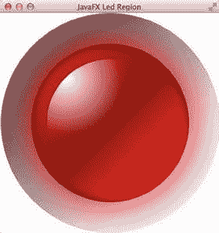

图 15-17.

基于区域的定制 LED 控件

### 创建自定义控件的其他方法

如前所述，在 JavaFX 中有多种创建自定义控件的方法。这里展示的“扩展 `Region`”方法是最常见的一种。这种方法带来的缺点是，你将模型/控制器与视图混合在一起，对于像这个 LED 这样的小控件是可以接受的，但对于依赖数据模型或作为控件库一部分的较大控件来说，这可能是一个糟糕的解决方案。

对于这些更复杂的控件，你应该将自定义的 `Control.class` 类与自定义的 `Skin.class` 以及你的 CSS 文件结合使用。主要区别在于，包含 `get`、`set` 和 `property` 方法的属性将放在 `Control.class` 中，而可视化代码将放在 `Skin.class` 中。这种方法在控制器逻辑和视图逻辑之间提供了适当的分离。

我想介绍的创建自定义控件的最后一种方法是使用 `Canvas` 节点。`Canvas` 节点代表一个单一的节点，其行为原理类似于一个可以绘制的图像。用于在 `Canvas` 节点上绘制的 API 取自 HTML5 的 `Canvas`，这意味着你不会使用 JavaFX 节点，而是直接在 `Canvas` 节点上绘制。（也就是说，你将在即时模式下工作，而不是保留模式。）你必须负责清除和重绘 `Canvas` 节点的表面。对于包含非常复杂的图形需要计算和绘制的控件，这种方法可能很有用，因为你只需要绘制一次。

## 总结

在本章中，你学习了如何使用以下方法通过自定义 CSS 文件来设置应用程序的样式：

*   `Application.setUserAgentStylesheet(String URL)`
*   `Scene: getStylesheets().add(String URL)`

然后，你了解了如何通过使用默认的 CSS 选择器或创建自己的选择器来在 JavaFX 中使用 CSS。你学习了 `id` 类型选择器、`class` 类型选择器和 CSS 伪类。此外，你还学习了如何在不同选择器模式中使用这些选择器。通过使用选择器模式，你可以将样式应用于一组节点及其兄弟节点。

最后，你学习了如何在 JavaFX 中创建一个 LED 自定义控件。在本节中，你有机会运用不同的策略来创建自定义控件。你学习了如何使用 `Control` 和 `Skin` 类来遵循创建自定义控件的标准方式。你还了解了其他有趣的策略，例如扩展 `Region` 或使用 `Canvas` 类在即时模式下渲染图元。

## Java 9 SDK

JavaFX 9 已内置于 Oracle 的 Java 9 SDK 中，这意味着你只需下载 Java 9 SDK 即可。Java 9 软件开发工具包及相关信息可从以下位置下载。

*   Oracle 技术网络上的 Java 9：[`https://docs.oracle.com/javase/9/`](https://docs.oracle.com/javase/9/)
*   Java 开发工具包下载地址：[`http://www.oracle.com/technetwork/java/javase/downloads/index.html`](http://www.oracle.com/technetwork/java/javase/downloads/index.html)


## Java 9 API 文档

Java 9 的文档和指南位于以下链接：

*   Java 9 Javadoc API 文档：[`http://docs.oracle.com/javase/9/`](http://docs.oracle.com/javase/9/)
*   JavaFX 9 Javadoc API 文档（可能变更）：[`http://download.java.net/java/jdk9/jfxdocs/index.html?overview-summary.html`](http://download.java.net/java/jdk9/jfxdocs/index.html?overview-summary.html) [`http://docs.oracle.com`](http://docs.oracle.com) `/en/java/`

## Java 9 特性

请查看以下链接，了解关于 Java 9 更具体和不断更新的信息：

*   Java 9 有哪些新特性？[`https://docs.oracle.com/javase/9/whatsnew/toc.htm`](https://docs.oracle.com/javase/9/whatsnew/toc.htm)
*   将改变你软件开发方式的 5 个 Java 9 特性（以及 2 个不会改变的），Alex Zhitnitsky，2015 年 6 月 17 日，Takipi 博客：[`http://blog.takipi.com/5-features-in-java-9-that-will-change-how-you-develop-software-and-2-that-wont/`](http://blog.takipi.com/5-features-in-java-9-that-will-change-how-you-develop-software-and-2-that-wont/)
*   Java 9 特性及示例，Rambabu Posa，2017 年 2 月 27 日：[`http://www.journaldev.com/13121/java-9-features-with-examples`](http://www.journaldev.com/13121/java-9-features-with-examples)
*   Java 9 新特性，Eugen Baeldung：[`http://www.baeldung.com/new-java-9`](http://www.baeldung.com/new-java-9)

## Java 9 Jigsaw

请查看以下链接，了解关于 Java 9 Jigsaw 更具体和不断更新的信息：

*   Jigsaw 项目（OpenJDK）：[`http://openjdk.java.net/projects/jigsaw`](http://openjdk.java.net/projects/jigsaw)
*   快速入门指南：[`http://openjdk.java.net/projects/jigsaw/quick-start`](http://openjdk.java.net/projects/jigsaw/quick-start)
*   迁移到 Java 9：[`https://docs.oracle.com/javase/9/migrate/toc.htm`](https://docs.oracle.com/javase/9/migrate/toc.htm)
*   Java 9 模块的“大杀器”（`--permit-illegal-access`）：[`http://mail.openjdk.java.net/pipermail/jigsaw-dev/2017-March/011763.html`](http://mail.openjdk.java.net/pipermail/jigsaw-dev/2017-March/011763.html)
*   专家组和行业领袖投票推动 Java 9 模块系统向前发展：[`https://jcp.org/en/jsr/results?id=6016`](https://jcp.org/en/jsr/results?id=6016)

## 集成开发环境（IDE）

集成开发环境用于输入源代码和编译 Java 代码。以下是业界常用的流行 IDE。

*   NetBeans：[`https://netbeans.org/`](https://netbeans.org/)
*   IDEA IntelliJ：[`http://www.jetbrains.com/idea`](http://www.jetbrains.com/idea)
*   Eclipse：[`https://www.eclipse.org/`](https://www.eclipse.org/)
*   BlueJ：[`http://www.bluej.org/`](http://www.bluej.org/)

## 部署应用程序

在部署 JavaFX 应用程序时，您需要使用以下库和工具来打包您的应用程序。

*   部署 JavaFX 应用程序：[`https://docs.oracle.com/javase/9/deploy/toc.htm`](https://docs.oracle.com/javase/9/deploy/toc.htm)
*   将 JavaFX 应用程序打包为原生安装程序：[`http://fxexperience.com/2012/03/packaging-javafx-applications-as-native`](http://fxexperience.com/2012/03/packaging-javafx-applications-as-native)
*   Launch4J：[`http://launch4j.sourceforge.net`](http://launch4j.sourceforge.net)
*   FXLauncher：[`https://github.com/edvin/fxlauncher`](https://github.com/edvin/fxlauncher)

## JavaFX 2D 形状

Javadoc API 文档包含了关于在 JavaFX 场景图中绘制形状节点的丰富信息：

*   [`http://docs.oracle.com/javase/8/javafx/api/javafx/scene/shape/Shape.html`](http://docs.oracle.com/javase/8/javafx/api/javafx/scene/shape/Shape.html)
*   [`http://docs.oracle.com/javase/8/javafx/api/javafx/scene/shape/Path.html`](http://docs.oracle.com/javase/8/javafx/api/javafx/scene/shape/Path.html)
*   [`http://docs.oracle.com/javase/8/javafx/api/javafx/scene/shape/SVGPath.html`](http://docs.oracle.com/javase/8/javafx/api/javafx/scene/shape/SVGPath.html)
*   [`http://docs.oracle.com/javase/8/javafx/api/javafx/scene/text/Text.html`](http://docs.oracle.com/javase/8/javafx/api/javafx/scene/text/Text.html)

## JavaFX 颜色

Javadoc API 文档还包含以下关于渐变颜色填充的信息：

*   [`http://docs.oracle.com/javase/8/javafx/api/javafx/scene/paint/LinearGradient.html`](http://docs.oracle.com/javase/8/javafx/api/javafx/scene/paint/LinearGradient.html)
*   [`http://docs.oracle.com/javase/8/javafx/api/javafx/scene/paint/RadialGradient.html`](http://docs.oracle.com/javase/8/javafx/api/javafx/scene/paint/RadialGradient.html)
*   [`http://docs.oracle.com/javase/8/javafx/api/javafx/scene/effect/Blend.html`](http://docs.oracle.com/javase/8/javafx/api/javafx/scene/effect/Blend.html)
*   [`http://docs.oracle.com/javase/8/javafx/api/javafx/scene/paint/ImagePattern.html`](http://docs.oracle.com/javase/8/javafx/api/javafx/scene/paint/ImagePattern.html)

## JavaFX 2.x Builder 类

在 JavaFX 8 之前，出于很好的理由，Builder 类的使用非常广泛。然而，某些错误与新的 Java 8 产生了冲突，因此 JavaFX 团队决定弃用 Builder 类。以下链接讨论了这一变更：

*   Oracle JavaFX 论坛上关于弃用 Builder 类原因的讨论：[`https://community.oracle.com/thread/2544323?tstart=0`](https://community.oracle.com/thread/2544323?tstart=0)
*   Open JDK 上关于 JavaFX Builder 类在 Java 8 中被弃用的真正原因的邮件线程：[`http://mail.openjdk.java.net/pipermail/openjfx-dev/2013-March/006725.html`](http://mail.openjdk.java.net/pipermail/openjfx-dev/2013-March/006725.html)

## JavaFX 打印

Java 8 新增了 JavaFX 打印 API。本书不讨论如何使用打印 API，但以下链接将帮助您入门：

*   Javadoc API 文档：[`http://docs.oracle.com/javase/8/javafx/api/javafx/print/package-summary.html`](http://docs.oracle.com/javase/8/javafx/api/javafx/print/package-summary.html)
*   所有适合打印的节点（第 1 部分），Phil Race（Oracle）：[`https://www.youtube.com/watch?v=Ma506QBmj90`](https://www.youtube.com/watch%3Fv=Ma506QBmj90)
*   所有适合打印的节点（第 2 部分），Phil Race（Oracle）：[`https://www.youtube.com/watch?v=-fEOt7L0v-8`](https://www.youtube.com/watch%3Fv=-fEOt7L0v-8)


## Lambda 项目

Java 8 核心新增的语言特性是 lambda 表达式和 Stream API。以下参考资料是关于 Lambda 项目的路线图、博客和视频。

*   Lambda 现状，Brian Goetz（Oracle）：[`http://cr.openjdk.java.net/~briangoetz/lambda/lambda-state-final.html`](http://cr.openjdk.java.net/%7Ebriangoetz/lambda/lambda-state-final.html)
*   与 Brian Goetz 和 Stuart Marks 的问答（由 Oracle 的 Stephen Chin 主持的 NightHacking 之旅）：[`https://www.youtube.com/watch?v=vaSv3FjUIVI`](https://www.youtube.com/watch%3Fv=vaSv3FjUIVI)
*   Java 8：Lambda，第二部分，Ted Neward：[`http://www.oracle.com/technetwork/articles/java/architect-lambdas-part2-2081439.html`](http://www.oracle.com/technetwork/articles/java/architect-lambdas-part2-2081439.html)
*   Java 8 揭秘：Lambda、默认方法和批量数据操作，Anton Arhipov：[`http://zeroturnaround.com/rebellabs/java-8-revealed-lambdas-default-methods-and-bulk-data-operations`](http://zeroturnaround.com/rebellabs/java-8-revealed-lambdas-default-methods-and-bulk-data-operations)
*   Java 8 中 Lambda 表达式和 Stream 的 10 个示例，Javin Paul：[`http://javarevisited.blogspot.com/2014/02/10-example-of-lambda-expressions-in-java8.html`](http://javarevisited.blogspot.com/2014/02/10-example-of-lambda-expressions-in-java8.html)
*   Java SE 8：Lambda 快速入门，Oracle：[`http://www.oracle.com/webfolder/technetwork/tutorials/obe/java/Lambda-QuickStart/index.html`](http://www.oracle.com/webfolder/technetwork/tutorials/obe/java/Lambda-QuickStart/index.html)
*   Java 8：Lambda 表达式基础，Blue Sky Workshop：[`http://blueskyworkshop.com/topics/Java-Pages/lambda-expression-basics`](http://blueskyworkshop.com/topics/Java-Pages/lambda-expression-basics)
*   Java 8：闭包与 Lambda 表达式解析，Frank Hinkel：[`http://frankhinkel.blogspot.com/2012/11/java-8-closures-lambda-expressions.html`](http://frankhinkel.blogspot.com/2012/11/java-8-closures-lambda-expressions.html)
*   Maurice Naftalin 的 Lambda 常见问题解答：[`http://www.lambdafaq.org`](http://www.lambdafaq.org)
*   Lambda 表达式教程，Oracle：[`http://docs.oracle.com/javase/tutorial/java/javaOO/lambdaexpressions.html`](http://docs.oracle.com/javase/tutorial/java/javaOO/lambdaexpressions.html)
*   Java 函数式编程：利用 Java 8 Lambda 表达式的威力，Venkat Subramaniam。Pragmatic Bookshelf，2014 年。ISBN-13：978-1937785468。
*   Java 8 Streams，Sven Ruppert（`@SvenRuppert`）（德语版由 EntWickler Press 出版）：[`http://www.amazon.de/dp/B00HALCBMC`](http://www.amazon.de/dp/B00HALCBMC) [`http://www.barnesandnoble.com/w/java-8-streams-sven-ruppert/1117767060`](http://www.barnesandnoble.com/w/java-8-streams-sven-ruppert/1117767060)

## Nashorn

Java 8 包含一个名为 Nashorn 的新脚本引擎，这是一个为 Java 运行时环境打造的全新且改进的 JavaScript 引擎。该引擎使开发者能够使用 JavaScript 来编写应用程序。以下链接和参考资料是描述 Nashorn 的文章和博客。

*   Nashorn 和 JavaFX：[`https://docs.oracle.com/javase/8/docs/technotes/guides/scripting/nashorn/javafx.html`](https://docs.oracle.com/javase/8/docs/technotes/guides/scripting/nashorn/javafx.html)
*   Oracle 的 Nashorn：面向 JVM 的下一代 JavaScript 引擎，Julien Ponge：[`http://www.oracle.com/technetwork/articles/java/jf14-nashorn-2126515.html`](http://www.oracle.com/technetwork/articles/java/jf14-nashorn-2126515.html)
*   Open JDK 的 Nashorn 站点：[`http://openjdk.java.net/projects/nashorn/`](http://openjdk.java.net/projects/nashorn/)
*   Nashorn 博客：[`https://blogs.oracle.com/nashorn`](https://blogs.oracle.com/nashorn)

## 属性和绑定

在 JavaFX 节点之间同步值时，属性和绑定至关重要。以下是关于只读属性、监听器以及 JavaFX Bean 角色的优秀资源。

*   在 JavaFX 中创建只读属性，Michael Heinrichs：[`http://blog.netopyr.com/2012/02/02/creating-read-only-properties-in-javafx`](http://blog.netopyr.com/2012/02/02/creating-read-only-properties-in-javafx)
*   何时使用 ChangeListener 或 InvalidationListener，Michael Heinrichs：[`http://blog.netopyr.com/2012/02/08/when-to-use-a-changelistener-or-an-invalidationlistener`](http://blog.netopyr.com/2012/02/08/when-to-use-a-changelistener-or-an-invalidationlistener)
*   未知的 JavaBean，Richard Bair：[`https://community.oracle.com/blogs/rbair/2006/05/31/unknown-javabean`](https://community.oracle.com/blogs/rbair/2006/05/31/unknown-javabean)
*   使用 JavaFX 属性和绑定，Scott Hommel：[`http://docs.oracle.com/javafx/2/binding/jfxpub-binding.htm`](http://docs.oracle.com/javafx/2/binding/jfxpub-binding.htm)
*   创建 JavaFX 属性，Michael Heinrichs：[`http://blog.netopyr.com/2011/05/19/creating-javafx-properties`](http://blog.netopyr.com/2011/05/19/creating-javafx-properties)
*   Pro JavaFX 8，（第 4 章，“属性和绑定”），Johan Vos、James Weaver、Weiqi Gao、Stephen Chin 和 Dean Iverson，Apress，2014 年：[`http://www.apress.com/9781430265740`](http://www.apress.com/9781430265740)
*   mvvm(fx)：一个应用程序框架，提供使用 JavaFX 实现 MVVM 模式所需的组件：[`https://github.com/sialcasa/mvvmFX`](https://github.com/sialcasa/mvvmFX)
*   Open Dolphin：一个 JavaFX MVC 框架（由 Canoo Engineering 的 Dierk Koenig 创立）：[`http://open-dolphin.org/dolphin_website/Home.html`](http://open-dolphin.org/dolphin_website/Home.html)
*   基于约定优于配置和依赖注入的 JavaFX MVP 框架（由 Adam Bien 创立）：[`http://afterburner.adam-bien.com`](http://afterburner.adam-bien.com)

## 布局

在布局方面，构建用户界面可能是一项挑战。以下参考资料中的教程和库讨论了如何使用 JavaFX 节点。

*   使用 JavaFX 2.0 布局用户界面，Jim Weaver（Oracle）：[`http://www.oracle.com/technetwork/articles/java/layoutfx-1536156.html`](http://www.oracle.com/technetwork/articles/java/layoutfx-1536156.html)
*   在 JavaFX 中使用布局，Joni Gordon：[`http://docs.oracle.com/javafx/2/layout/jfxpub-layout.htm`](http://docs.oracle.com/javafx/2/layout/jfxpub-layout.htm)
*   Pro JavaFX 2，第 4 章，“在 JavaFX 中构建动态 UI 布局”（Apress，2012 年）：[`http://www.apress.com/9781430268727`](http://www.apress.com/9781430268727)
*   使用 JavaFX Scene Builder 进行深入布局和样式设计：[`http://www.youtube.com/watch?v=7Nu3_5doZK4`](http://www.youtube.com/watch?v=7Nu3_5doZK4)
*   Miglayout，Mikael Grev：[`http://www.miglayout.com`](http://www.miglayout.com)
*   JavaFX 2.0 EA 和 MigLayout，Tom Eugelink：[`http://tbeernot.wordpress.com/2011/03/11/javafx-2-0-ea-and-miglayout`](http://tbeernot.wordpress.com/2011/03/11/javafx-2-0-ea-and-miglayout)
*   Flex Box FX：JavaFX 的响应式设计。CSS3 FlexBox 布局管理器的 JavaFX 移植版：[`http://flexboxfx.io`](http://flexboxfx.io)
*   JFoenix：一个用于 JavaFX 的 Material Design 框架：[`http://www.jfoenix.com`](http://www.jfoenix.com)
*   BootstrapFX：JavaFX 的 Bootstrap 移植版：[`https://github.com/aalmiray/bootstrapfx`](https://github.com/aalmiray/bootstrapfx)
*   Jbootx：JavaFX 的 Bootstrap 外观：[`https://github.com/dicolar/jbootx`](https://github.com/dicolar/jbootx)


## JavaFX 工具

您可以通过以下链接找到从构建图形用户界面到调试应用程序的有用工具：

*   Scene Builder：一种使用 FMXL 标记语言构建基于 JavaFX 的用户界面的工具：[`http://www.oracle.com/technetwork/java/javafx/tools/index.html`](http://www.oracle.com/technetwork/java/javafx/tools/index.html)
*   Scenic View 工具：一种在运行时可视化调试 JavaFX 用户界面的工具：[`http://fxexperience.com/scenic-view`](http://fxexperience.com/scenic-view)
*   Caspian Styler、动画样条线编辑器和派生颜色计算器：[`http://fxexperience.com/2012/03/announcing-fx-experience-tools`](http://fxexperience.com/2012/03/announcing-fx-experience-tools)
*   用于 Eclipse 和 OSGi 的 JavaFX 工具和运行时（创始人 Tom Schindl）：[`http://www.eclipse.org/efxclipse/index.html`](http://www.eclipse.org/efxclipse/index.html) [`http://tomsondev.bestsolution.at`](http://tomsondev.bestsolution.at)
*   Firebug Lite：一种基于浏览器的 JavaFX WebView 节点调试工具：[`http://stackoverflow.com/questions/17387981/javafx-webview-webengine-firebuglite-or-some-other-debugger`](http://stackoverflow.com/questions/17387981/javafx-webview-webengine-firebuglite-or-some-other-debugger)
*   JavaFX 3D 查看器和导入器：[`http://www.interactivemesh.org/models/jfx3dimporter.html`](http://www.interactivemesh.org/models/jfx3dimporter.html)
*   IDR Solutions 展示用于 JavaFX 的 PDF 查看器：[`http://blog.idrsolutions.com/2014/03/sneak-preview-new-javafx-pdf-viewer`](http://blog.idrsolutions.com/2014/03/sneak-preview-new-javafx-pdf-viewer)
*   TestFX：用于测试 JavaFX 的易用库：[`https://github.com/TestFX/TestFX`](https://github.com/TestFX/TestFX)
*   介绍 MarvinFx，作者 Hendrik Ebbers：轻松测试 JavaFX 控件和场景，特别关注属性：[`http://www.guigarage.com/2013/03/introducing-marvinfx`](http://www.guigarage.com/2013/03/introducing-marvinfx)
*   JemmyFX：提供用于在应用程序中测试 JavaFX 用户界面的 API：[`https://jemmy.java.net/JemmyFXGuide/jemmy-guide.html`](https://jemmy.java.net/JemmyFXGuide/jemmy-guide.html)
*   ReactiveX/RxJavaFX，作者 Thomas Nield：RxJava 的 JavaFX 绑定。RxJavaFX 是一个轻量级库，用于将 JavaFX 事件转换为 RxJava Observables/Flowables，反之亦然。它还提供了一个调度器，可以安全地将发射移动到 JavaFX 事件调度线程：[`https://github.com/ReactiveX/RxJavaFX`](https://github.com/ReactiveX/RxJavaFX) Twitter：`@thomasnield9727`

## 企业级 GUI 框架

GUI 框架使开发人员能够快速开发企业级应用程序。从绑定到 MVC 框架模式，以下内容将帮助您在开发 JavaFX 应用程序时提高效率。

*   Gluon Mobile：Gluon 提供了一种端到端的企业移动解决方案，用于开发跨平台移动应用程序，这些应用程序可以轻松连接到企业后端和云服务，同时实现集中管理：[`http://gluonhq.com`](http://gluonhq.com)
*   Griffon（项目负责人 Andres Almiray，`@aalmiray`）：Griffon 是一个用于在 JVM 上开发桌面应用程序的应用程序框架：[`http://griffon-framework.org`](http://griffon-framework.org)
*   jpro：一种无需 Java 插件即可将 Java 带回浏览器的新技术。为此，jpro 在服务器上运行 JavaFX，并将其场景图直接映射到浏览器中。客户端渲染通过浏览器端近似进行了高度优化，以获得流畅、无延迟的用户体验：[`https://www.jpro.io`](https://www.jpro.io) Twitter：[`https://twitter.com/jpro_io`](https://twitter.com/jpro_io) 联合创始人 Tobias Bley，`@tobibley`
*   DukeScript：一种用于创建跨平台移动、桌面和 Web 应用程序的新技术。DukeScript 应用程序是普通的 Java 应用程序，内部使用 HTML5 技术和 JavaScript 进行渲染。这样，开发人员只需编写干净的 Java 代码，同时仍能利用现代 UI 技术的最新发展：[`https://dukescript.com`](https://dukescript.com) Twitter：`@DukeScript`
*   TornadoFX，作者 Edvin Syse：用于 Kotlin 语言的轻量级 JavaFX 框架：GitHub：[`https://github.com/edvin/tornadofx`](https://github.com/edvin/tornadofx) Twitter：`@edvinsyse`
*   Open Dolphin：一个 JavaFX MVC 框架（由 Canoo Engineering 的 Dierk Koenig（`@mittie`）创立）：[`http://open-dolphin.org/dolphin_website/Home.html`](http://open-dolphin.org/dolphin_website/Home.html)
*   基于约定优于配置和依赖注入的 JavaFX MVP 框架。由 Adam Bien（`@AdamBien`）创立：[`http://afterburner.adam-bien.com`](http://afterburner.adam-bien.com)
*   ReduxFX 0.2，作者 Michael Heinrichs：[`https://netopyr.com/2017/02/27/new-features-reduxfx-0-2/`](https://netopyr.com/2017/02/27/new-features-reduxfx-0-2/) [`https://netopyr.com`](https://netopyr.com) Twitter：`@net0pyr`
*   NetBeansIDE-AfterburnerFX-Plugin，作者 Peter Rogge：NetBeansIDE-AfterburnerFX-Plugin 是一个 NetBeans IDE 插件，支持在 JavaFX 项目中按照库 `afterburner.fx` 的约定生成文件：[`https://github.com/Naoghuman/NetBeansIDE-AfterburnerFX-Plugin`](https://github.com/Naoghuman/NetBeansIDE-AfterburnerFX-Plugin) Twitter：`@naoghuman`
*   FXForm2：一个提供自动 JavaFX 2.0 表单生成的库：[`http://dooapp.github.io/FXForm2`](http://dooapp.github.io/FXForm2)
*   通过 MVP Java 将 Spring Boot 与 JavaFX 集成：[`https://youtu.be/hjeSOxi3uPg`](https://youtu.be/hjeSOxi3uPg)
*   通过 MVP Java 实现 JavaFX 多控制器：[`https://www.youtube.com/watch?v=osIRfgHTfyg`](https://www.youtube.com/watch?v=osIRfgHTfyg)

## 领域特定语言

用于图形的领域特定语言有助于消除大量样板代码，同时使代码更易于阅读和管理。以下是在 Java 运行时环境之上运行的各种计算机语言的 JavaFX 领域特定语言。

*   TornadoFX：一种基于 Kotlin 的领域特定语言，用于创建 JavaFX 应用程序：[`https://github.com/edvin/tornadofx`](https://github.com/edvin/tornadofx)
*   GroovyFX：一种基于 Groovy 的领域特定语言，用于创建 JavaFX 应用程序：[`http://groovyfx.org`](http://groovyfx.org)
*   ScalaFX：一种基于 Scala 的领域特定语言，用于创建 JavaFX 应用程序：[`https://code.google.com/p/scalafx`](https://code.google.com/p/scalafx)
*   RubyFX：一种基于 Ruby 的领域特定语言，用于创建 JavaFX 应用程序：[`https://github.com/jruby/jrubyfx`](https://github.com/jruby/jrubyfx)
*   Visage：一种基于 JavaFX 的领域特定语言，用于创建 JavaFX 应用程序：[`https://code.google.com/p/visage`](https://code.google.com/p/visage)

## 自定义用户界面

您可以自定义用户界面，例如使用 CSS 进行样式设置或使用自定义控件。以下链接是参考指南和博客。


*   JavaFX 8 CSS 参考文档：[`http://docs.oracle.com/javase/8/javafx/api/javafx/scene/doc-files/cssref.html`](http://docs.oracle.com/javase/8/javafx/api/javafx/scene/doc-files/cssref.html)
*   JavaFX FXML 介绍：[`http://docs.oracle.com/javase/8/javafx/api/javafx/fxml/doc-files/introduction_to_fxml.html`](http://docs.oracle.com/javase/8/javafx/api/javafx/fxml/doc-files/introduction_to_fxml.html)
*   使用 CSS 设置 UI 控件样式：[`http://docs.oracle.com/javase/8/javafx/user-interface-tutorial/apply-css.htm`](http://docs.oracle.com/javase/8/javafx/user-interface-tutorial/apply-css.htm)
*   JavaFX 8 的 Modena 主题，Jasper Potts：[`http://fxexperience.com/2013/03/modena-theme-update`](http://fxexperience.com/2013/03/modena-theme-update)
*   《精通 JavaFX 8 控件》，Hendrik Ebbers 著。Oracle Press，2014 年。ISBN 9780071833776：[`http://mhprofessional.com/product.php?isbn=0071833773`](http://mhprofessional.com/product.php?isbn=0071833773) [`http://www.guigarage.com/javafx-book`](http://www.guigarage.com/javafx-book)
*   名为 AquaFX with Elements 的 macOS 外观，Claudine Zillmann（`@etteClaudette`）：[`http://aquafx-project.com/project.html`](http://aquafx-project.com/project.html)
*   名为 JMetro 的 Windows 8 外观，Pedro Duque Vieira（`@P_Duke`）：[`http://pixelduke.wordpress.com/category/metro`](http://pixelduke.wordpress.com/category/metro) [`https://github.com/JFXtras/jfxtras-styles`](https://github.com/JFXtras/jfxtras-styles)
*   David Gilbert 开发的 Orson Charts：适用于 Java 应用程序（JavaFX、Swing 或服务器端）的 3D 图表库。[`https://github.com/jfree/orson-charts`](https://github.com/jfree/orson-charts)
*   名为 Flatter 外观的类 Roku 或类 Apple TV 界面，Hendrik Ebbers（@hendrikEbbers）：[`http://www.guigarage.com/2013/09/flatter`](http://www.guigarage.com/2013/09/flatter) [`http://www.guigarage.com/2013/08/boxfx-javaone-preview-1`](http://www.guigarage.com/2013/08/boxfx-javaone-preview-1)
*   GuiGarage 在 JavaOne 上收集的 JavaFX 演讲（由 Parleys 提供）：[`http://www.guigarage.com/2013/12/javafx-at-javaone`](http://www.guigarage.com/2013/12/javafx-at-javaone)
*   Oracle 的 Irina Fedortsova 撰写的《为何使用 FXML》：[`http://docs.oracle.com/javafx/2/fxml:get_started/why_use_fxml.htm`](http://docs.oracle.com/javafx/2/fxml:get_started/why_use_fxml.htm)
*   Gerrit Grunwald 的 JavaFX 8 示例，展示了多种制作自定义控件的策略：[`https://github.com/HanSolo/JFX8CustomControls`](https://github.com/HanSolo/JFX8CustomControls)
*   Enzo：JavaFX 仪表盘、时钟及众多自定义控件，Gerrit Grunwald：[`https://bitbucket.org/hansolo/enzo/wiki/Home`](https://bitbucket.org/hansolo/enzo/wiki/Home)
*   Gerrit Grunwald 开发的 Medusa：用于创建仪表盘和刻度盘（非 CSS）的 JavaFX 自定义控件库。[`https://bintray.com/hansolo/Medusa/Medusa`](https://bintray.com/hansolo/Medusa/Medusa) Twitter：`@hansolo_`
*   JFXtras：一个 JavaFX 自定义控件社区：[`http://jfxtras.org`](http://jfxtras.org)
*   ControlsFX：由 Oracle 的 Jonathan Giles 发起并领导的另一个自定义控件社区：[`http://fxexperience.com/controlsfx`](http://fxexperience.com/controlsfx)
*   JideFX 亮点：JideFX Beta 版发布（1/3），David Qiao：[`http://www.jidesoft.com/blog/2013/06/10/highlights-of-the-jidefx-beta-release-1-of-3`](http://www.jidesoft.com/blog/2013/06/10/highlights-of-the-jidefx-beta-release-1-of-3) [`http://www.jidesoft.com`](http://www.jidesoft.com)
*   使用 CSS 设置 FX 按钮样式，Jasper Potts：[`http://fxexperience.com/2011/12/styling-fx-buttons-with-css`](http://fxexperience.com/2011/12/styling-fx-buttons-with-css)
*   JavaFX 自定义控件：Nest 恒温器 第 1-3 部分，Laurent Nicolas：[`http://www.javacodegeeks.com/2014/01/javafx-custom-control-nest-thermostat-part-1.html`](http://www.javacodegeeks.com/2014/01/javafx-custom-control-nest-thermostat-part-1.html) Twitter：@`MrLoNee`
*   自己动手：自定义 JavaFX 控件，Gerrit Grunwald：[`https://www.youtube.com/watch?v=ts_b2mBix3U`](https://www.youtube.com/watch%3Fv=ts_b2mBix3U)
*   SIB Visions 的自定义控件：FXSelectableLabel、FXMonthView、FXDateTimePicker 等：[`https://blog.sibvisions.com/2015/04/24/javafx-custom-controls/`](https://blog.sibvisions.com/2015/04/24/javafx-custom-controls/) Twitter：`@sibvisions`
*   yWorks GmbH 的 yFiles for JavaFX：一个将久经考验的 yFiles 图表绘制强大功能与易用性带入前沿 JavaFX 应用程序的库。该库包含用于绘制、查看和编辑图表的 UI 控件，以及成熟的图形布局算法，可一键自动排列复杂的图形和网络：[`http://www.yworks.com/products/yfiles-for-javafx`](http://www.yworks.com/products/yfiles-for-javafx)
*   JylooSoftware 制作的 SyntheticaFX：用于 JavaFX 商业/企业解决方案的库。提供主要面向专业桌面商业应用程序的主题和组件。该库正在不断增长，新的控件正在开发中，并将在未来版本中添加。最终版本的目标平台是 Java 9 或更高版本：[`http://www.jyloo.com/syntheticafx/`](http://www.jyloo.com/syntheticafx/) 创始人：W.Zitzelsberger Twitter：`@wzberger`
*   Jide Software, Inc. 的 JideFX：JavaFX 平台的各种扩展和实用程序集合。JideFX Common Layer 相当于 Swing 的 JIDE 组件中的 JIDE Common Layer：[`https://github.com/jidesoft/jidefx-oss`](https://github.com/jidesoft/jidefx-oss)
*   Pedro Duque Vieira 开发的、支持 JSR-310 的 DateAxis：使用 XYBarChart 的 JavaFX 图表现在可以利用 Java 8 中的新日期 API：[`https://pixelduke.wordpress.com/2013/12/13/dateaxis-and-xybarchart-update/`](https://pixelduke.wordpress.com/2013/12/13/dateaxis-and-xybarchart-update/)
*   Pedro Duque Vieira 开发的 FXValidation：一个用于处理 FXML GUI 表单的 JavaFX 验证库：[`https://pixelduke.wordpress.com/2014/07/26/validation-in-java-javafx/`](https://pixelduke.wordpress.com/2014/07/26/validation-in-java-javafx/) GitHub：[`https://github.com/dukke/FXValidation`](https://github.com/dukke/FXValidation) Twitter：`@P_Duke`
*   Pedro Duque Vieira 开发的 FXRibbon：Microsoft Office 应用程序中常见的 GUI 控件：博客：[`https://pixelduke.wordpress.com/2015/01/11/ribbon-for-java-using-javafx/`](https://pixelduke.wordpress.com/2015/01/11/ribbon-for-java-using-javafx/) GitHub：[`https://github.com/dukke/FXRibbon`](https://github.com/dukke/FXRibbon)
*   Narayan G. Maharjan 的自定义 JavaFX 样式：[`http://blog.ngopal.com.np/2012/07/11/customize-scrollbar-via-css/`](http://blog.ngopal.com.np/2012/07/11/customize-scrollbar-via-css/) [`http://blog.ngopal.com.np`](http://blog.ngopal.com.np) Twitter：`@javadeveloping`
*   Arnaud Nouard 开发的 Undecorator：一个用于为应用程序创建不规则形状半透明窗口的库：[`https://github.com/in-sideFX/UndecoratorBis`](https://github.com/in-sideFX/UndecoratorBis) Twitter：`@In_SideFX`
*   JavaFx JFoenix 教程 #2：Material Design 按钮：[`https://youtu.be/22QlOj6JVe4`](https://youtu.be/22QlOj6JVe4)
*   Martin Gunnarsson 和 Pär Sikö 的《让你的 JavaFX 应用大放异彩的十种方法》：[`https://www.youtube.com/watch?v=98ZmnN215m0`](https://www.youtube.com/watch%3Fv=98ZmnN215m0)


## 操作系统风格指南

在 JavaFX 中，有多种方法可以开发美观的应用程序；然而，有时你需要关于宿主操作系统的风格指导。以下链接是许多主流操作系统的风格指南。

*   iOS7 风格指南：[`https://developer.apple.com/library/ios/documentation/userexperience/conceptual/MobileHIG/index.html`](https://developer.apple.com/library/ios/documentation/userexperience/conceptual/MobileHIG/index.html)
*   Android 风格指南：[`http://developer.android.com/design/style/index.html`](http://developer.android.com/design/style/index.html)
*   Windows 风格指南：[`http://msdn.microsoft.com/en-us/library/windows/apps/hh465424.aspx`](http://msdn.microsoft.com/en-us/library/windows/apps/hh465424.aspx)
*   Ubuntu 设计指南：[`http://design.ubuntu.com/apps`](http://design.ubuntu.com/apps)
*   BlackBerry 设计指南：[`http://developer.blackberry.com/native/documentation/cascades/best_practices/uiguidelines`](http://developer.blackberry.com/native/documentation/cascades/best_practices/uiguidelines)
*   HTML 样式：w3schools.com 的 CSS：[`http://www.w3schools.com/html/html_css.asp`](http://www.w3schools.com/html/html_css.asp)

## JavaFX 媒体

JavaFX 包含一个强大的媒体 API，能够处理音频和视频。在这里，你将找到许多链接，帮助你充分利用 `MediaView` 和 `MediaPlayer` API。此外，你还会看到许多有助于创建内容的链接。

*   Oracle 关于使用 JavaFX 集成媒体的教程：[`http://docs.oracle.com/javase/8/javafx/media-tutorial/overview.htm`](http://docs.oracle.com/javase/8/javafx/media-tutorial/overview.htm)
*   Brian Burkhalter 和 David DeHaven（Oracle 技术团队主要成员）关于 JavaFX 中音频和视频处理的演讲：[`https://www.youtube.com/watch?v=jaPUbzfJx2A`](https://www.youtube.com/watch%3Fv=jaPUbzfJx2A)
*   《Pro JavaFX 2》第 8 章“媒体类”（Apress，2014）：[`https://www.apress.com/9781430268727`](https://www.apress.com/9781430268727)
*   Media College：[`http://www.mediacollege.com/adobe/flash/video/tutorial/example-flv.html`](http://www.mediacollege.com/adobe/flash/video/tutorial/example-flv.html)
*   FLV 容器格式的 VP6 编码器：[`http://www.wildform.com`](http://www.wildform.com)
*   Sony Vegas：[`http://www.sonycreativesoftware.com/vegassoftware`](http://www.sonycreativesoftware.com/vegassoftware)
*   Adobe Premier：[`http://www.adobe.com/products/premiere.html`](http://www.adobe.com/products/premiere.html)
*   Apple 的 Final Cut Pro：电影制作软件：[`http://www.apple.com/final-cut-pro`](http://www.apple.com/final-cut-pro)
*   Apple 的 iMovie：电影制作软件：[`https://www.apple.com/mac/imovie`](https://www.apple.com/mac/imovie)
*   Apple 的 Quick Time Pro：媒体播放器：[`http://www.apple.com/quicktime`](http://www.apple.com/quicktime)
*   FFmpeg：一个完整的跨平台解决方案，用于录制、转换和流式传输音频和视频：[`http://www.ffmpeg.org`](http://www.ffmpeg.org)
*   On2 Technologies 被 Google 收购：[`http://en.wikipedia.org/wiki/On2_Technologies`](http://en.wikipedia.org/wiki/On2_Technologies)

## JavaFX 在 Web 上

以下许多链接都与 JavaFX 中强大的 WebView 节点以及如何与 Web 服务交互有关。此外，你还会看到一些新颖有趣的概念，例如使用 JavaScript 在浏览器中运行 JavaFX。

*   JavaFX WebView 组件概述：[`http://docs.oracle.com/javase/8/javafx/embedded-browser-tutorial/overview.htm`](http://docs.oracle.com/javase/8/javafx/embedded-browser-tutorial/overview.htm)
*   Ryan Cuprak（在硅谷 JavaFX 用户组）关于 HTML5 和 JavaFX 的演讲：[`https://www.youtube.com/watch?v=xdgD7EBX4fw`](https://www.youtube.com/watch%3Fv=xdgD7EBX4fw)
*   其他 w3c 文档对象模型 API：JDOM：[`http://www.jdom.org`](http://www.jdom.org)
*   DOM4J：[`http://dom4j.sourceforge.net`](http://dom4j.sourceforge.net)
*   关于加载文件扩展名不是 `.html` 的 HTML5 文件的 Bug RT-35757：[`https://javafx-jira.kenai.com/browse/RT-35757`](https://javafx-jira.kenai.com/browse/RT-35757)
*   将 w3c 文档转换为字符串：[`http://stackoverflow.com/questions/2567416/document-to-string`](http://stackoverflow.com/questions/2567416/document-to-string)
*   将单个文本文件作为字符串加载，作者 Pat Niemeyer：[`https://weblogs.java.net/blog/pat/archive/2004/10/stupid_scanner.html`](https://weblogs.java.net/blog/pat/archive/2004/10/stupid_scanner.html)
*   使用 Java 单行读取文本文件，作者 Fuad Saud：[`https://coderwall.com/p/lyalwg`](https://coderwall.com/p/lyalwg)
*   如何在 Java 中将 InputStream 中的数据读取为字符串，作者 Lokesh Gupta：[`http://howtodoinjava.com/2013/10/06/how-to-read-data-from-inputstream-into-string-in-java`](http://howtodoinjava.com/2013/10/06/how-to-read-data-from-inputstream-into-string-in-java)
*   使用 Java 8 Streams API 读取文件，作者 Cay Horstmann：[`https://weblogs.java.net/blog/cayhorstmann/archive/2013/12/06/java-8-really-impatient`](https://weblogs.java.net/blog/cayhorstmann/archive/2013/12/06/java-8-really-impatient)
*   Firebug Lite：[`http://stackoverflow.com/questions/17387981/javafx-webview-webengine-firebuglite-or-some-other-debugger/18396900`](http://stackoverflow.com/questions/17387981/javafx-webview-webengine-firebuglite-or-some-other-debugger/18396900)
*   使用 URL Connection 读取 JSON：[`http://docs.oracle.com/javase/tutorial/networking/urls/readingWriting.html`](http://docs.oracle.com/javase/tutorial/networking/urls/readingWriting.html)
*   使用 URL Connection 发起 POST 请求而非 GET 请求：[`http://stackoverflow.com/questions/4205980/java-sending-http-parameters-via-post-method-easily`](http://stackoverflow.com/questions/4205980/java-sending-http-parameters-via-post-method-easily)
*   JavaScript 12 小时制 AM 和 PM 格式日期：[`http://stackoverflow.com/questions/8888491/how-do-you-display-javascript-datetime-in-12-hour-am-pm-format`](http://stackoverflow.com/questions/8888491/how-do-you-display-javascript-datetime-in-12-hour-am-pm-format)
*   OpenWeatherMap：免费天气数据和预报 API：[`http://openweathermap.org`](http://openweathermap.org)
*   免费地理位置服务：[`http://freegeoip.net/json`](http://freegeoip.net/json)
*   JSObject Live connect：[`https://developer.mozilla.org/en-US/docs/LiveConnect/LiveConnect_Reference/JSObject`](https://developer.mozilla.org/en-US/docs/LiveConnect/LiveConnect_Reference/JSObject)
*   DataFX，作者 Johan Vos、Jonathan Giles 和 Hendrik Ebbers：[`http://www.javafxdata.org`](http://www.javafxdata.org)
*   使用 JSR 356 构建富客户端应用程序：Java WebSocket API，作者 Johan Vos：[`http://www.oraclejavamagazine-digital.com/javamagazine_twitter/20140102#pg67`](http://www.oraclejavamagazine-digital.com/javamagazine_twitter/20140102#pg67)
*   Bck2Brwsr：浏览器中的 JavaFX：[`http://wiki.apidesign.org/wiki/Bck2Brwsr`](http://wiki.apidesign.org/wiki/Bck2Brwsr)
*   Bck2Brwsr 的 Canvas：[`http://jayskills.com/blog/2013/01/22/canvas-for-bck2brwsr`](http://jayskills.com/blog/2013/01/22/canvas-for-bck2brwsr)


## JavaFX 3D

备受期待的 JavaFX 3D API 终于面世，它是 Java 8 版本的一部分。以下链接指向的视频和教程将丰富您的 JavaFX 3D 技能：

*   JavaFX 3D Oracle 教程：[`http://docs.oracle.com/javafx/8/3d_graphics/jfxpub-3d_graphics.htm`](http://docs.oracle.com/javafx/8/3d_graphics/jfxpub-3d_graphics.htm) [`http://docs.oracle.com/javase/8/javafx/graphics-tutorial/javafx-3d-graphics.htm`](http://docs.oracle.com/javase/8/javafx/graphics-tutorial/javafx-3d-graphics.htm)
*   JavaFX 商业应用：在 JavaOne 2012 上监控集装箱码头，作者：Dierk Konig 和 Andres Almiray：[`https://www.youtube.com/watch?v=m5NcuWGKnDo`](https://www.youtube.com/watch%3Fv=m5NcuWGKnDo)
*   在 JavaFX 3D 中建模、纹理化和光照网格几何体，作者：Oracle 的 John Yoon：[`http://www.parleys.com/share.html#play/5252e81de4b0c4f11ec576b0`](http://www.parleys.com/share.html#play/5252e81de4b0c4f11ec576b0)
*   JavaFX 3D：第三维度 [CON7810] 在 JavaOne 2013，作者：Kevin Rushforth 和 Chien Yang：[`https://oracleus.activeevents.com/2013/connect/sessionDetail.ww?SESSION_ID=7810`](https://oracleus.activeevents.com/2013/connect/sessionDetail.ww?SESSION_ID=7810)
*   Polaris、JavaFX、ControlsFX 和 F(X)yz 支持 NASA 任务，作者：Sean Phillips：[`https://www.youtube.com/watch?v=aA5GfWc8ho4`](https://www.youtube.com/watch%3Fv=aA5GfWc8ho4)

## JavaFX 游戏开发

您可能认为 JavaFX 只适用于商业应用。那么，请看看以下链接，了解一些有趣好玩的游戏。

*   JavaFX 游戏开发框架：[`https://github.com/AlmasB/FXGL`](https://github.com/AlmasB/FXGL) Twitter：`@AlmasB`
*   使用 Scala 的 JavaFX 游戏和 OpenCV 应用示例，作者：Robert Ladstätter：[`https://github.com/rladstaetter`](https://github.com/rladstaetter) Twitter：`@rladstaetter`
*   GameComposer，作者：Mirko Sertic：一个面向桌面和移动设备的游戏创作工具和游戏运行时环境：GitHub：[`https://github.com/mirkosertic/GameComposer`](https://github.com/mirkosertic/GameComposer) Twitter：`@mirkosertic`
*   在 JavaFX 中编写瓦片引擎，作者：Toni Epple：[`http://www.javacodegeeks.com/2013/01/writing-a-tile-engine-in-javafx.html`](http://www.javacodegeeks.com/2013/01/writing-a-tile-engine-in-javafx.html)
*   SokubanFX，作者：Peter Rogge：一款基于 JavaFX 的推箱子类运输解谜游戏，玩家在仓库中推动箱子或板条箱，试图将它们推到存储位置。该谜题通常以电子游戏形式实现：[`https://github.com/Naoghuman/SokubanFX`](https://github.com/Naoghuman/SokubanFX) Twitter：`@naoghuman`
*   RolandC 制作的塔防类游戏：[`http://wecode4fun.blogspot.co.at/2015/05/simple-game-engine-tower-defense.html`](http://wecode4fun.blogspot.co.at/2015/05/simple-game-engine-tower-defense.html)
*   Angry Duke：基于物理的 JavaFX 游戏，作者：Toni Epple：[`https://www.youtube.com/watch?v=jcSp2E0MTyE`](https://www.youtube.com/watch%3Fv=jcSp2E0MTyE)
*   JavaOne 2013 国际象棋机器人，作者：Jasper Potts：在 JavaOne 2013 技术主题演讲中，Java 团队演示了一个由 Java 控制的下国际象棋的机器人：[`http://vimeo.com/75368008`](http://vimeo.com/75368008)
*   基于 JavaFX 的游戏创作系统，作者：Mirko Sertic：[`http://www.mirkosertic.de/doku.php/javastuff/javafxgameauthoring`](http://www.mirkosertic.de/doku.php/javastuff/javafxgameauthoring)
*   使用 JavaFX 3D II 的魔方，作者：José Pereda：[`https://www.youtube.com/watch?v=ZVPIBkDgZV4`](https://www.youtube.com/watch%3Fv=ZVPIBkDgZV4) [`https://github.com/jperedadnr/RubikFX`](https://github.com/jperedadnr/RubikFX)
*   JavaFX 游戏教程第 1-6 部分，作者：Carl Dea：[`http://carlfx.wordpress.com/2012/03/29/javafx-2-gametutorial-part-1`](http://carlfx.wordpress.com/2012/03/29/javafx-2-gametutorial-part-1)

## Java IoT 与 JavaFX 嵌入式

以下链接和参考资料展示了结合 Java 嵌入式与 JavaFX 的非常酷的 DIY 项目。其中许多链接是视频，将帮助您一窥物联网的未来。

*   Java 8 嵌入式文档：[`http://docs.oracle.com/javase/8/javase-embedded.htm`](http://docs.oracle.com/javase/8/javase-embedded.htm)
*   Robo4J，作者：Miro Wengner 和 Marcus Hirt：一个用于快速入门构建和运行机器人及物联网设备的框架：[`http://www.robo4j.io/p/home.html`](http://www.robo4j.io/p/home.html) 视频：[`http://www.robo4j.io/p/videos.html`](http://www.robo4j.io/p/videos.html) Miro Wengner：`@miragemiko` Marcus Hirt：`@hirt`
*   PiDome：家庭自动化 PiDome 是一个专为树莓派开发的开源家庭自动化平台，将其提升为完整的家庭自动化解决方案：[`https://pidome.org`](https://pidome.org) Twitter：`@Pi_Dome`
*   MQTT.fx，作者：Jens Deter：基于 JavaFX 的 MQTT 客户端：[`http://www.mqttfx.org`](http://www.mqttfx.org) Twitter：`@MQTT_fx` Twitter：`@Jerady` [`http://www.jensd.de`](http://www.jensd.de)
*   基于 JavaFX 的平板电脑：[`http://j.mp/DukePad`](http://j.mp/DukePad) [`https://wiki.openjdk.java.net/display/OpenJFX/DukePad`](https://wiki.openjdk.java.net/display/OpenJFX/DukePad) [`http://vimeo.com/76486818`](http://vimeo.com/76486818)
*   Nao 机器人 NightHacking：[`http://nighthacking.com/nao-robot-nighthacking-part-1`](http://nighthacking.com/nao-robot-nighthacking-part-1) [`http://nighthacking.com/nao-robot-nighthacking-part-2`](http://nighthacking.com/nao-robot-nighthacking-part-2)
*   与 Mark Heckler 的预访谈（NightHacking 之旅，由 Oracle 的 Stephen Chin 主持）：[`https://www.youtube.com/watch?v=LXRp57B58e8`](https://www.youtube.com/watch%3Fv=LXRp57B58e8)
*   与 Gerrit Grunwald 在树莓派、XBee 和传感器网络上的 NightHacking（NightHacking 之旅，由 Oracle 的 Stephen Chin 主持）：[`https://www.youtube.com/watch?v=GTr0CtrlNGY`](https://www.youtube.com/watch%3Fv=GTr0CtrlNGY)
*   与 Gerrit Grunwald 和 Michael Hoffer 的 NightHacking（NightHacking 之旅，由 Oracle 的 Stephen Chin 主持）：[`https://www.youtube.com/watch?v=cWFW4VT8auw`](https://www.youtube.com/watch%3Fv=cWFW4VT8auw)
*   超越美观：JavaFX、视差、触控、陀螺仪等，作者：Angela Caicedo（Oracle Java 布道师）（NightHacking 之旅，由 Oracle 的 Stephen Chin 主持）：[`https://www.youtube.com/watch?v=rYt45rs2Bjk`](https://www.youtube.com/watch%3Fv=rYt45rs2Bjk)
*   树莓派 Java 论坛：[`http://www.raspberrypi.org/phpBB3/viewforum.php?f=81`](http://www.raspberrypi.org/phpBB3/viewforum.php?f=81)
*   如何安全地超频您的树莓派，作者：Eben Upton（树莓派创始人，树莓派工程团队 CEO）：[`http://www.raspberrypi.org/archives/2008`](http://www.raspberrypi.org/archives/2008)
*   使用 NetBeans IDE 8 实现端到端树莓派开发，作者：José Pereda：[`http://netbeans.dzone.com/articles/nb-8-raspberry-pi-end2end`](http://netbeans.dzone.com/articles/nb-8-raspberry-pi-end2end) Twitter：`@JPeredaDnr`

## 软件与设备制造商

在最后几章中，我们讨论了 Java 嵌入式设备和基于手势的输入设备。以下链接引用了各种制造商。

*   树莓派：[`http://www.raspberrypi.org`](http://www.raspberrypi.org)
*   Arduino：[`http://www.arduino.cc`](http://www.arduino.cc)
*   BeagleBoard：[`http://beagleboard.org/Products/BeagleBone`](http://beagleboard.org/Products/BeagleBone)
*   Leap Motion：[`https://www.leapmotion.com`](https://www.leapmotion.com)
*   微软 Windows 8 Surface：[`http://www.microsoft.com/surface/en-us`](http://www.microsoft.com/surface/en-us)
*   Oculus Rift：[`http://www.oculusvr.com`](http://www.oculusvr.com)
*   Thalmic Labs：[`https://www.thalmic.com/en/myo`](https://www.thalmic.com/en/myo)


## JavaFX 社区

想加入 JavaFX 社区吗？请查看以下链接。

*   Java.net JavaFX 社区网站：[`https://www.java.net/community/javafx`](https://www.java.net/community/javafx)
*   FXExperience：JavaFX 新闻、演示和见解：[`http://fxexperience.com`](http://fxexperience.com) Twitter：`@fxexperience`
*   Nighthacking：由 Stephen Chin 主持。一场环游世界之旅，探索关于 Java、JavaFX 和物联网的一切。精彩的现场演讲。[`http://nighthacking.com`](http://nighthacking.com) Twitter：`@_nighthacking`
*   Oracle 的 JavaFX 社区门户，涵盖真实世界用例、社区支持、第三方工具和 Open JFX：[`http://www.oracle.com/technetwork/java/javase/community/index.html`](http://www.oracle.com/technetwork/java/javase/community/index.html)
*   JFXtras：一个 JavaFX 自定义控件社区：[`http://jfxtras.org`](http://jfxtras.org)
*   ControlsFX：另一个自定义控件社区，由 Oracle 的 Jonathan Giles 发起：[`http://fxexperience.com/controlsfx`](http://fxexperience.com/controlsfx)
*   Gerrit Grunwald 的 Enzo：JavaFX 自定义控件库，用于使用 JavaFX CSS 样式创建仪表和刻度盘：[`https://bintray.com/hansolo/Enzo/Enzo_All_In_One`](https://bintray.com/hansolo/Enzo/Enzo_All_In_One)
*   Feed Cluster：所有 JavaFX 新闻：[`http://javafx-blogs.feedcluster.com`](http://javafx-blogs.feedcluster.com)
*   硅谷 JavaFX 用户组：[`http://www.meetup.com/svjugfx`](http://www.meetup.com/svjugfx)
*   硅谷 JavaFX 用户组直播：[`http://www.ustream.tv/channel/silicon-valley-javafx-user-group`](http://www.ustream.tv/channel/silicon-valley-javafx-user-group)
*   Oracle 关于 JavaFX 的论坛：[`https://community.oracle.com/community/developer/english/java/javafx/javafx_2.0_and_later`](https://community.oracle.com/community/developer/english/java/javafx/javafx_2.0_and_later)

## 应用程序

以下许多链接都是使用 JavaFX 平台编写的丰富 GUI 应用程序。

*   20 个 JavaFX 真实世界应用程序，Dirk Lemmermann 和 Alexander Casall：[`https://jaxenter.com/20-javafx-real-world-applications-123653.html`](https://jaxenter.com/20-javafx-real-world-applications-123653.html) Dirk Lemmermann：`@dlemmermann` Alexander Casall：`@sialcasa`
*   FXDesktopSearch，Mirko Sertic：一个基于 Java 和 JavaFX 的桌面搜索应用程序。它会爬取配置好的目录集，并允许你使用不同的语言支持进行全文搜索：[`https://github.com/mirkosertic/FXDesktopSearch`](https://github.com/mirkosertic/FXDesktopSearch) Twitter：`@mirkosertic`
*   Picmodo（由 Jens Deter 创立）：一个基于 JavaFX 的图片数据库应用程序：[`http://www.jensd.de/wordpress/?page_id=22`](http://www.jensd.de/wordpress/?page_id=22) Twitter：`@Jerady`
*   Michael Hoffer 的 VWorkflows：一个科学可视化工具：[`https://github.com/miho/VWorkflows`](https://github.com/miho/VWorkflows) `:` [`http://mihosoft.eu`](http://mihosoft.eu) Twitter：`@mihosoft`
*   eteoBoard：交互式数字任务板。一个基于触摸和手势的团队协作应用工具：[`http://www.eteoboard.de`](http://www.eteoboard.de) [`http://www.saxsys.de`](http://www.saxsys.de)
*   PiDome 客户端，John Sirach：PiDome 是一个为 Raspberry Pi 开发的开源家庭自动化平台，将其打造成一个完整的家庭自动化解决方案。[`https://pidome.org`](https://pidome.org) Twitter：`@Pi_Dome`
*   FlexGanttFX：飞机/航班调度应用程序，作者 Dirk Lemmermann，`@dlemmermann`：[`http://www.dlsc.com`](http://www.dlsc.com) [`https://www.youtube.com/channel/UCFyRQ_euxxPDwlqyhff-x0Q`](https://www.youtube.com/channel/UCFyRQ_euxxPDwlqyhff-x0Q)
*   BaufiFX，Thomas Bolz：一个家庭财务计算器：[`http://www.baufifx.de`](http://www.baufifx.de)
*   SnapCode 是一个用于教育、娱乐和企业的 IDE 和 RAD 工具。Report Mill Software：[`http://www.reportmill.com/snap`](http://www.reportmill.com/snap)
*   Modellus 是一个免费应用程序，使学生和教师（高中和大学）能够使用数学来交互式地创建或探索模型。Modellus 由 Vitor Duarte Teodoro、João Paulo Duque Vieira 和 Pedro Duque Vieira 开发：[`http://modellus.co/index.php/en`](http://modellus.co/index.php/en)
*   Christoph Nahr 的 MIME Browser 是一个紧凑的 JavaFX 桌面应用程序，用于浏览本地存储在标准 EML 文件中的 MIME 消息：[`http://kynosarges.org/MimeBrowser.html`](http://kynosarges.org/MimeBrowser.html)
*   Adam Carroll 的 Vocab Hunter：VocabHunter 是一个帮助外语学习者的系统：GitHub：[`https://vocabhunter.github.io`](https://vocabhunter.github.io) Twitter：`@vocabhunterapp`
*   Carl Antaki 的 Bloom Uploader。Bloom 是一个桌面应用程序，让你可以轻松高效地将照片和视频上传到 Facebook、下载相册、查看你的照片以及部分好友的照片：视频：[`http://bloomuploader.com`](http://bloomuploader.com) Twitter：`@carcour`
*   Rahman USTA 的 AsciidocFX：Asciidoc FX 是一个书籍/文档编辑器，用于构建 PDF、Epub、Mobi 和 HTML 书籍、文档和幻灯片。AsciidocFX 也是 2015 年 Duke's Choice Award 的获奖者：[`https://github.com/asciidocfx/AsciidocFX`](https://github.com/asciidocfx/AsciidocFX) Twitter：`@ustarahman`
*   Chris Newland 的 JITWatch 代码缓存可视化。可视化 HotSpot JVM 代码缓存如何随着 JIT 编译器从你的字节码生成优化的本地代码而填满：[`https://github.com/AdoptOpenJDK/jitwatch`](https://github.com/AdoptOpenJDK/jitwatch)
*   MuseuID，Angelica Leite。该软件协助 Santana do Cariri 的古生物学博物馆。它管理化石收藏和博物馆活动：视频：[`http://t.co/3MuofK4eZF`](http://t.co/3MuofK4eZF) GitHub：[`https://github.com/angelicalleite/museuid`](https://github.com/angelicalleite/museuid) Twitter：`@angelicalleite`
*   AZoi Capital Atlas Trader 软件 JavaFX，Rob Terpilowski：视频：[`https://youtu.be/tm05AIkvJAs`](https://youtu.be/tm05AIkvJAs) Twitter：`@RobTerpilowski`
*   Power Scene Viewer 2.0，Marlon Trujillo：SCADA 软件：[`https://www.youtube.com/watch?v=8DUAf9TrJuI`](https://www.youtube.com/watch%3Fv=8DUAf9TrJuI) [`https://www.youtube.com/watch?v=FHph2jrS0EU`](https://www.youtube.com/watch%3Fv=FHph2jrS0EU) Twitter：`@marlon__marlon`
*   FXDesktopSearch：一个基于 Java 和 JavaFX 的桌面搜索应用程序。它会爬取配置好的目录集，并允许你使用不同的语言支持进行全文搜索：[`https://github.com/mirkosertic/FXDesktopSearch`](https://github.com/mirkosertic/FXDesktopSearch)


## Java/JavaFX 书籍与杂志

以下链接是与新 Java 8 和 JavaFX 8 平台相关的最新书籍。

*   《Pro JavaFX 8》，作者：Johan Vos、James Weaver、Weiqi Gao、Stephen Chin、Dean Iverson。Apress，2014 年出版。ISBN：978-1-4302-6574-0：[`http://www.apress.com/9781430265740`](http://www.apress.com/9781430265740)
*   《Java 8 Recipes》，作者：Josh Juneau（Apress，2014 年出版。ISBN：978-1-4302-6827-7）：[`http://www.apress.com/9781430268277`](http://www.apress.com/9781430268277)
*   《基于 NetBeans 平台的 JavaFX 富客户端编程》，作者：Paul Anderson 和 Gail Anderson。Addison-Wesley Professional，2014 年出版。ISBN：978-0321927712：[`https://blogs.oracle.com/geertjan/entry/new_book_javafx_rich_client`](https://blogs.oracle.com/geertjan/entry/new_book_javafx_rich_client) [`http://www.amazon.com/JavaFX-Client-Programming-NetBeans-Platform/dp/0321927710`](http://www.amazon.com/JavaFX-Client-Programming-NetBeans-Platform/dp/0321927710)
*   《精通 JavaFX 8 控件》，作者：Hendrik Ebbers。Oracle Press，2014 年出版。ISBN：9780071833776：[`http://mhprofessional.com/product.php?isbn=0071833773`](http://mhprofessional.com/product.php?isbn=0071833773) [`http://www.guigarage.com/javafx-book`](http://www.guigarage.com/javafx-book)
*   《JavaFX 快速入门指南》，作者：J.F. DiMarzio。Oracle Press，2014 年出版。ISBN：978-0071808965：[`http://www.mhprofessional.com/product.php?isbn=0071808965`](http://www.mhprofessional.com/product.php?isbn=0071808965)
*   《为性急者准备的 Java SE 8》，作者：Cay S. Horstmann。Addison-Wesley，2014 年出版。ISBN：978-0321927767：[`https://www.pearson.com/us/higher-education/program/Horstmann-Java-SE-8-for-the-Really-Impatient-A-Short-Course-on-the-Basics/PGM214606.html`](https://www.pearson.com/us/higher-education/program/Horstmann-Java-SE-8-for-the-Really-Impatient-A-Short-Course-on-the-Basics/PGM214606.html)
*   《精通 Lambda 表达式》，作者：Maurice Naftalin。Oracle Press，2014 年出版。ISBN：007-1829628：[`https://www.amazon.com/Mastering-Lambdas-Programming-Multicore-Oracle/dp/0071829628`](https://www.amazon.com/Mastering-Lambdas-Programming-Multicore-Oracle/dp/0071829628)
*   Oracle 出版的《Java Magazine》：[`http://www.oracle.com/technetwork/java/javamagazine/index.html`](http://www.oracle.com/technetwork/java/javamagazine/index.html)
*   《JavaFX 参考卡》，作者：Hendrik Ebbers 和 Michael Heinrichs：[`https://dzone.com/refcardz/javafx-8-1`](https://dzone.com/refcardz/javafx-8-1)
*   《Java Everywhere》，作者：Anton Epple。一本关于 DukeScript 平台的书籍：[`https://leanpub.com/dukescript`](https://leanpub.com/dukescript) Twitter：`@monacotoni`

## 作者博客

如果您对本书的内容或代码示例有任何疑问，欢迎在 `apress.com` 上本书的目录页面的勘误标签中发表评论或提出问题。如果您完全被难住了，请随时通过 Twitter 或博客联系本书作者。

以下是本书作者及其 Twitter 账号和博客网址：

*   Carl Dea（`@carldea`）：[`http://carlfx.wordpress.com`](http://carlfx.wordpress.com)
*   Gerrit Grunwald（`@hansolo_)`：[`http://harmoniccode.blogspot.com`](http://harmoniccode.blogspot.com)
*   Mark Heckler（`@MkHeck`）：[`http://www.thehecklers.org/`](http://www.thehecklers.org/)
*   José Pereda（`@JPeredaDnr`）：[`http://jperedadnr.blogspot.com`](http://jperedadnr.blogspot.com)
*   Sean Phillips（`@SeanMiPhillips`）：[`http://birdasaur.tumblr.com`](http://birdasaur.tumblr.com)

## 教程、课程、咨询公司和演示

以下链接是您可以找到专家和爱好者的地方，他们提供许多免费的在线教程和课程。其中一些链接是来自主要咨询公司的演示文稿，用于教学和演示实际应用程序。

*   JavaFX 社区的 FXDocs：JavaFX 文档项目旨在从网络上汇集对 JavaFX 开发人员有用的信息。该项目是开源的，并鼓励社区参与，以确保文档尽可能精良和有用：[`https://fxdocs.github.io/docs/index.html`](https://fxdocs.github.io/docs/index.html)
*   AwesomeJavaFX，作者：Hossein Rimaz：精选的 JavaFX 库、书籍、框架等列表：[`https://github.com/mhrimaz/AwesomeJavaFX`](https://github.com/mhrimaz/AwesomeJavaFX) Twitter：`@mhrimaz`
*   使用 JavaFX 的各种算法，作者：Hossein Rimaz：[`https://github.com/mhrimaz`](https://github.com/mhrimaz) Twitter：`@mhrimaz`
*   Paul 和 Gail Anderson 的 JavaFX 培训课程，他们是作者、教师和演讲者：Twitter：`@Paul_ASGTeach` 和 `@gail_asgteach` [`http://asgteach.com/courses/java-and-javafx/javafx-programming-course/`](http://asgteach.com/courses/java-and-javafx/javafx-programming-course/)
*   Bekwam Courses，作者：Carl Walker。构建基于 JavaFX 的实际应用程序的教程和示例：[`https://www.bekwam.com`](https://www.bekwam.com) [`https://courses.bekwam.net/public_tutorials/index.html`](https://courses.bekwam.net/public_tutorials/index.html) Twitter：`@bekwaminc`
*   优秀的 JavaFX 教程，作者：Jörn Hameister：[`http://www.hameister.org/JavaFX.html`](http://www.hameister.org/JavaFX.html) Twitter：`@Hameiste`
*   JavaFX 演示，例如 FXCubes 和 FXFrostedPanel，作者：Alessio Vinerbi。令人惊叹的 JavaFX 演示，展示了视频和 3D 效果的混合：[`https://github.com/alexbodogit`](https://github.com/alexbodogit) Twitter：`@Alessio_Vinerbi`
*   JavaFX 教程，作者：Jakob Jenkov：[`http://tutorials.jenkov.com/javafx/index.html`](http://tutorials.jenkov.com/javafx/index.html) Twitter：`@jjenkov`
*   JavaFX 教程，作者：Dirk Lemmermann Consulting。优秀的教程：[`http://dlsc.com/blog/`](http://dlsc.com/blog/) Twitter：`@dlemmermann`
*   基于 JavaFX 的教程，作者：William Antônio。从机器学习到物联网的快速简便教程：[`https://fxapps.blogspot.com`](https://fxapps.blogspot.com) [`https://github.com/jesuino`](https://github.com/jesuino) Twitter：`@William_Antonio`
*   使用 Ceylon 语言的 JavaFX 示例，作者：Gavin King：[`https://github.com/ceylon/ceylon-examples-javafx`](https://github.com/ceylon/ceylon-examples-javafx) Twitter：`@1ovthafew`
*   使用 JavaFX 和 Gluon 构建 MyDevoxx 应用，作者：Johan Vos 和 Eugene Ryzhikov：[`https://www.youtube.com/watch?v=1I38pmEnfVQ&list=PLy7t4z5SYNaRN2IDmjq_SSCrb9Sph4zAC&index=12`](https://www.youtube.com/watch%3Fv=1I38pmEnfVQ%26list=PLy7t4z5SYNaRN2IDmjq_SSCrb9Sph4zAC%26index=12) Johan Vos：`@johanvos` Eugene Ryzhikov：`@eryzhikov`
*   最新的 JavaFX Daily！，作者：Michael Heinrichs。关于 JavaFX 的新闻提要主题！：[`http://paper.li/net0pyr/1312275601#/`](http://paper.li/net0pyr/1312275601#/) Twitter：`@net0pyr`

## 工具、应用程序和库


*   TilesFX，作者 Gerrit Grunwald。一个包含仪表盘磁贴的 JavaFX 库：[`https://bintray.com/hansolo/tilesfx/tilesfx/1.4.5`](https://bintray.com/hansolo/tilesfx/tilesfx/1.4.5) Twitter：`@hansolo_`
*   AnchorFX，作者 Alessio Vinerbi。JavaFX 平台的停靠框架：[`https://github.com/alexbodogit/AnchorFX`](https://github.com/alexbodogit/AnchorFX) Twitter：`@Alessio_Vinerbi`
*   JFXGL，作者 Jeff Martin。JFXGL 是一个跨平台解决方案，用于在 JVM 8 应用程序中将现代风格的 OpenGL 渲染（v3.2+）与 JavaFX UI 集成。该项目面向桌面使用，支持所有三大主流平台：Linux、OS X 和 Windows：[`https://bitbucket.org/cuchaz/jfxgl`](https://bitbucket.org/cuchaz/jfxgl) Twitter：`@cuchaz`
*   OpenJFX 8 每日构建版和稳定版（8u60）构建，作者 Chris Newland。适用于 Linux amd64（桌面）、OS X、x86egl（Monocle）和 armv6hf（Raspberry Pi）的 OpenJFX 8 构建：[`https://chriswhocodes.com`](https://chriswhocodes.com) Twitter：`@chriswhocodes`
*   FontAwesomeFX，作者 Jens Deter。一个包含流行字体包的库，用于应用于 JavaFX 按钮和标签：[`https://bitbucket.org/Jerady/fontawesomefx`](https://bitbucket.org/Jerady/fontawesomefx) Twitter：`@FontAwesomeFX`
*   FlexGanttFX 和 CalendarFX，作者 Dirk Lemmermann。用于甘特图和计划日历的专业级自定义控件。用于商业应用程序：[`http://dlsc.com`](http://dlsc.com) Twitter：`@dlemmermann`
*   FXEventBus，作者 Almas Baimagambetov：基于 JavaFX 事件分发机制的简单事件总线实现。GitHub：[`https://github.com/AlmasB/FXEventBus`](https://github.com/AlmasB/FXEventBus) Twitter：`@AlmasBaim`
*   FXGL，作者 Almas Baimagambetov：JavaFX 游戏开发框架：GitHub：[`https://github.com/AlmasB/FXGL`](https://github.com/AlmasB/FXGL) 视频：[`https://www.youtube.com/almasb0/videos`](https://www.youtube.com/almasb0/videos) Twitter：`@AlmasBaim`
*   JStackFX，作者 Thierry Wasylczenko：一个用于分析线程转储的工具：[`https://github.com/twasyl/jstackfx`](https://github.com/twasyl/jstackfx) Twitter：`@twasyl`
*   SlideshowFX，作者 Thierry Wasylczenko：为演示文稿创建交互式幻灯片：[`http://slideshowfx.github.io`](http://slideshowfx.github.io) Twitter：`@SlideshowFX`，`@twasyl`
*   Orson Charts，作者 David Gilbert：一个用于 Java 应用程序（JavaFX、Swing 或服务器端）的 3D 图表库：[`https://github.com/jfree/orson-charts`](https://github.com/jfree/orson-charts)
*   JavaFX Maven Docker 镜像，作者 Jeff Miller：[`http://www.mymiller.name/wordpress/app/devops/javafx-maven-docker-image-openjfx/`](http://www.mymiller.name/wordpress/app/devops/javafx-maven-docker-image-openjfx/)
*   UL Viewer，作者 Yasumasa Suenaga。UL Viewer 是用于 JEP 158：统一 JVM 日志记录和 JEP 271：统一 GC 日志记录的日志解析器：GitHub：[`https://github.com/YaSuenag/ulviewer/releases/tag/v0.1.0`](https://github.com/YaSuenag/ulviewer/releases/tag/v0.1.0) Twitter：`@YaSuenag`
*   HeapStats，作者 Yasumasa Suenaga。JVMTI 代理和 JavaFX 分析器，用于收集 JVM 运行时信息以进行事后分析：GitHub：[`https://github.com/HeapStats/heapstats`](https://github.com/HeapStats/heapstats) Twitter：`@YaSuenag`
*   JVx，作者 SIB Visions。一个 MDI（多文档界面）库：[`https://blog.sibvisions.com/2015/06/22/jvx-javafxui-1-0/`](https://blog.sibvisions.com/2015/06/22/jvx-javafxui-1-0/) Twitter：`@sibvisions`
*   JCSG-PathExtensions，作者 Michael Hoffer。一个用于处理简单路径（线性化 SVG 路径、挤出和扩展）的 JCSG 扩展库：GitHub：[`https://github.com/miho/JCSG-PathExtensions`](https://github.com/miho/JCSG-PathExtensions) [`https://bintray.com/miho/JCSG/JCSG-PathExtensions/0.1`](https://bintray.com/miho/JCSG/JCSG-PathExtensions/0.1) Twitter：`@mihosoft`
*   VRL.Studio，作者 Michael Hoffer。创新、直观且功能强大的可视化 IDE，适用于快速原型设计、学习、教学和实验：[`http://vrl-studio.mihosoft.eu`](http://vrl-studio.mihosoft.eu) Twitter：`@mihosoft`
*   VWorkflows，作者 Michael Hoffer。用于构建特定领域可视化编程环境的交互式流程/图形可视化库：[`https://bintray.com/miho/VWorkflows`](https://bintray.com/miho/VWorkflows) Twitter：`@mihosoft`
*   Erlyberly，作者 Andy Till。一个使用 erlang 追踪功能的 erlang、elixir 和 LFE 调试器。可能是开始调试节点最简单快捷的方法：[`https://github.com/andytill/erlyberly`](https://github.com/andytill/erlyberly) Twitter：`@andy_till`
*   mapjfx 1.13.1（使用 OpenLayers 4.2.0），作者 Peter-Josef Meisch。使用 OpenLayers 和 JavaFX8 实现地图的 JavaFX 实现：[`https://www.sothawo.com/projects/mapjfx/`](https://www.sothawo.com/projects/mapjfx/) Twitter：`@sothawo`

## 关于 JavaFX 的视频和演示文稿


*   TornadoFX，作者 Edvin Syse。面向 Kotlin 语言的轻量级 JavaFX 框架：GitHub：[`https://github.com/edvin/tornadofx`](https://github.com/edvin/tornadofx) Twitter：`@edvinsyse` 在 TornadoFX 中创建登录界面：[`https://www.youtube.com/watch?v=Jyuf4xn0oy4`](https://www.youtube.com/watch%3Fv=Jyuf4xn0oy4)
*   DemoFX 第一、二、三部分，作者 Chris Newland。用于测量 JavaFX 性能的测试平台。受 demoscene 启发的 JavaFX：[`https://www.youtube.com/watch?v=N1rihYA8c2M`](https://www.youtube.com/watch%3Fv=N1rihYA8c2M) [`https://www.youtube.com/watch?v=WZf0j4GUFYM`](https://www.youtube.com/watch%3Fv=WZf0j4GUFYM) [`https://www.youtube.com/watch?v=9jztG_l8qrk`](https://www.youtube.com/watch%3Fv=9jztG_l8qrk) GitHub：[`https://github.com/chriswhocodes/DemoFX`](https://github.com/chriswhocodes/DemoFX) Twitter：`@chriswhocodes`
*   eteoBoard。Scrum 看板功能，Saxonia Systems AG：[`https://www.youtube.com/watch?v=mX1SvXeUetQ`](https://www.youtube.com/watch%3Fv=mX1SvXeUetQ) [`https://www.youtube.com/watch?v=4SEvfbudVwM`](https://www.youtube.com/watch%3Fv=4SEvfbudVwM)
*   JavaFX 实战，作者 Alexander Casall：[`https://www.youtube.com/watch?v=WQPcuCEnipE`](https://www.youtube.com/watch%3Fv=WQPcuCEnipE)
*   使用 JavaFX 轻松实现 3D，作者 Kevin Rushforth 和 Chien Yang：[`https://www.youtube.com/watch?v=EBKHdV-_rIc`](https://www.youtube.com/watch%3Fv=EBKHdV-_rIc)
*   在 JavaFX 3D 中建模、纹理化和光照网格几何体，作者 John Yoon：[`https://www.youtube.com/watch?v=lJvHSCOdnCY`](https://www.youtube.com/watch%3Fv=lJvHSCOdnCY)
*   JavaFX 3D，F(x)yz Sampler 预览，作者 Jason Pollastrini：[`https://www.youtube.com/watch?v=3zOfsV_8lG0`](https://www.youtube.com/watch%3Fv=3zOfsV_8lG0) [`https://www.youtube.com/watch?v=dEUZ0clj2y0`](https://www.youtube.com/watch%3Fv=dEUZ0clj2y0)
*   使用 JavaFX 和 Leap Motion 进行骨骼手部动画，作者 José Pereda：[`https://www.youtube.com/watch?v=8_xiv1pV3tI`](https://www.youtube.com/watch%3Fv=8_xiv1pV3tI)
*   JavaFX 无处不在：[`https://www.youtube.com/watch?v=a3dAteWr40k`](https://www.youtube.com/watch%3Fv=a3dAteWr40k)
*   将 Spring Boot 与 JavaFX 集成，MVP Java：[`https://www.youtube.com/watch?v=hjeSOxi3uPg`](https://www.youtube.com/watch%3Fv=hjeSOxi3uPg) [`https://github.com/mvpjava`](https://github.com/mvpjava)
*   JavaFX 多控制器，MVP Java：[`https://www.youtube.com/watch?v=osIRfgHTfyg`](https://www.youtube.com/watch%3Fv=osIRfgHTfyg)
*   JavaFX，像大佬一样切换场景！，MVP Java：[`https://www.youtube.com/watch?v=RifjriAxbw8`](https://www.youtube.com/watch%3Fv=RifjriAxbw8)
*   将 JavaFX 应用逐个类转换为 Kotlin/TornadoFX，作者 Edvin Syse：[`https://www.youtube.com/watch?v=aSv5rwHxmrA`](https://www.youtube.com/watch%3Fv=aSv5rwHxmrA)
*   JavaFX PiDome 客户端中的 3D 楼层可视化：[`https://www.youtube.com/watch?v=ROlXtpefjqM`](https://www.youtube.com/watch%3Fv=ROlXtpefjqM) [`https://www.youtube.com/channel/UCcussRDCHBh0G7sIys9C7zg/feed`](https://www.youtube.com/channel/UCcussRDCHBh0G7sIys9C7zg/feed)
*   JavaFX Material Design：设置并制作登录应用，Genuine Coder：[`https://www.youtube.com/watch?v=1jiuM-gNyBc`](https://www.youtube.com/watch%3Fv=1jiuM-gNyBc)
*   JavaFX JFoenix 教程 #9：Material Design 导航抽屉：[`https://www.youtube.com/watch?v=tgV8dDP9DtM`](https://www.youtube.com/watch%3Fv=tgV8dDP9DtM)
*   使用 JavaFX 实现类似 iOS 的平滑过渡，Bekwam, Inc.：[`https://www.youtube.com/watch?v=hpcpCGwPepM`](https://www.youtube.com/watch%3Fv=hpcpCGwPepM) [`https://www.youtube.com/channel/UCk2pGxJ397c5aC5-WhGPpog`](https://www.youtube.com/channel/UCk2pGxJ397c5aC5-WhGPpog) Twitter：`@bekwaminc`
*   让我们湿身吧！AquaFX 以及 JavaFX 控件皮肤化的最佳实践，作者 Claudine Zillmann 和 Hendrik Ebbers：[`https://www.youtube.com/watch?v=ucvdYGLWLT0`](https://www.youtube.com/watch%3Fv=ucvdYGLWLT0) Twitter：`@etteClaudette`，`@hendrikEbbers`
*   使用 JavaFX 进行测试驱动开发，作者 Sven Ruppert 和 Hendrik Ebbers：[`https://www.youtube.com/watch?v=PaB0t8NP3Oc&t=1479s`](https://www.youtube.com/watch%3Fv=PaB0t8NP3Oc%26t=1479s) Twitter：`@SvenRuppert`，`@hendrikEbbers`
*   月球、木星以及更远：JavaFX 在最终前沿的应用，作者 Sean Phillips：[`https://www.youtube.com/watch?v=WaybbwQNNOA`](https://www.youtube.com/watch%3Fv=WaybbwQNNOA)
*   Sean Phillips：JavaFX 实战：[`https://www.youtube.com/watch?v=rfyHcsfFQyE`](https://www.youtube.com/watch%3Fv=rfyHcsfFQyE)
*   JavaFX 深空轨迹探索器，作者 Sean Phillips：[`https://www.youtube.com/watch?v=MotQ1PC1xT8`](https://www.youtube.com/watch%3Fv=MotQ1PC1xT8) [`https://www.youtube.com/channel/UCm8fN1bUnpIaz2-ycI5L45w`](https://www.youtube.com/channel/UCm8fN1bUnpIaz2-ycI5L45w)
*   在 Eights 上进行 NASA 任务软件开发：Java 8、JavaFX 8 和 NetBeans 8：[`https://www.youtube.com/watch?v=6O9V5nc13h8`](https://www.youtube.com/watch%3Fv=6O9V5nc13h8)
*   Dex，作者 Patrick Martin：一个用 Java/Groovy/JavaFX 编写的数据可视化工具，具备强大的 ETL 和发布网络可视化功能：[`https://dexvis.net`](https://dexvis.net) [`https://www.youtube.com/watch?v=r54dsc58c_s`](https://www.youtube.com/watch%3Fv=r54dsc58c_s) [`https://github.com/PatMartin/Dex`](https://github.com/PatMartin/Dex)
*   TUT2097 你在听吗？面向富客户端 UI 的 JavaFX 绑定技术，作者 Paul 和 Gail Anderson：[`https://www.youtube.com/watch?v=lnvAKjZaRpE`](https://www.youtube.com/watch%3Fv=lnvAKjZaRpE) [`http://asgteach.com`](http://asgteach.com) Paul Anderson Twitter：`@Paul_ASGTeach` Gail Anderson Twitter：`@gail_asgteach`


索引 A 动画 JavaFX 过渡类 关键帧 关键值 时间线 过渡 参见 过渡类 另请参阅 复合过渡 应用程序 参见 JavaFX，应用程序生命周期 Arduino 板 Due IDE Blink 草图 执行 MacOS X/Linux Windows Uno Web 编辑器 Arduino 101/Genuino 101 AsciidocFX 音频播放 anchorPt 变量 关闭按钮 拖放支持，设置 文件拖放 媒体 元数据 MP3 播放器 应用程序 实例变量 关闭按钮 自定义按钮面板 创建 播放进度、快退和快进 进度和搜索位置滑块控件 源代码 频谱 面积图 可视化 舞台窗口，设置 停止、播放和暂停按钮 playMedia() 方法 快退 可视化 更新，AudioSpectrumListener 接口 音频频谱数据 B BasketStats 应用 添加模型 板视图 修改 板演示器 ExpansionPanel 控件 游戏注释视图 游戏事件视图 游戏演变视图 场景构建器 创建 AppViewManager 类 默认 build.gradle 文件 Gluon 插件 MobileApplication 类 设置名称和位置 设置视图名称 部署到移动设备 主视图 修改 主演示器 场景构建器 存储服务 服务 添加 Bloom 上传器 Body 处理器 BorderPane 布局 边界矩形 在父节点中 Builder 类 构建和运行，项目 Arduino3D 类 OrientationFX 类 子场景 工作流程 C 捕获变量 笛卡尔坐标系 隐藏字幕视频 复杂形状 三次曲线 甜甜圈示例 冰淇淋蛋筒形状 笑脸 start() 方法 支持 复合过渡 另请参阅 过渡类 createClosedCaptionArea() 方法 createMediaView() 方法 三次曲线 循环方法 D 默认方法 猫示例 代码示例 代码解释 Defender 方法 依赖注入 disconnect() 方法 领域特定语言 甜甜圈形状 拖放 DragOver TransferMode.LINK DragBoard 绘制线条 通用属性 java lambda 表达式 offset 属性 根节点 setStrokeWidth() 方法 绘制矩形 绘制形状 复杂矩形 绘制文本 应用效果 更改文本字体 创建随机值 示例 3D 场景 DrawMode 第一人称移动 键盘事件处理器 鼠标事件处理器 使用相机初始化 MeshViews 鼠标类型事件 点光源 滚动相机 旋转 触摸 TriangleMesh 类 缠绕与呼啸 缩放 DukeScript E 事件驱动架构 (EDA) F 第一人称移动 键盘事件处理器 鼠标事件处理器 FlowPane 布局 表单类型应用 列约束 网格线 可见 输出 顶部横幅区域 Fuzzy FXDesktopSearch FXForm2 G 手势事件 触摸事件 动画圆圈 运行 触摸点 Getter 方法 GluonHQ 公司 Gluon Mobile 开发工具 Glisten 用户界面 IDE 插件 许可证 渐变颜色 创建 线性渐变 径向渐变 反射循环 半透明 停止颜色 Gradle 基于的项目 安装 GridPane 布局 列约束 表单类型应用 网格线 可见 输出 顶部横幅区域 Griffon 分组基元 GUI 框架 DukeScript FXForm2 Gluon Mobile Griffon JavaFX MVP 框架 jpro NetBeansIDE-AfterburnerFX-Plugin Open Dolphin ReduxFX TornadoFX H 手部追踪项目 应用类 3D 模型类 前臂 关节 指骨 Utils LeapListener 类 Pair 类 运行 HBox 创建边框 四个矩形示例 设置间距 形状节点 单参数构造函数 总宽度（像素） Hello Mobile World build.gradle 文件 jfxmobile 插件 主类 运行 androidInstall 签名配置 HTML5 模拟时钟 HTML DOM 内容 body 处理器 getDocument() HttpClient.Builder 类 HTTP GET 请求 HTTP POST 请求 HttpRequest API HttpRequest.Builder 请求属性方法 JavaScript 桥接 函数到 java jdk.incubator.httpclient JSON 文本 RESTful 请求 String 对象 I 冰淇淋蛋筒形状 ImageInfo.java 图像 通用参数 显示 getClassLoader() 方法 加载 从 Web 服务器加载 从类路径加载 从文件系统加载 资源目录 toURL() 方法 Web 服务器 ImageView 参见 图像 ImageViewButtons.java Inkscape 和 SVG 集成开发环境 (IDE) J JAR 地狱 Java 8 书籍和杂志 JavaFX 打印 API lambda 表达式 Nashorn Java 9 API 文档 特性 IDE Jigsaw JavaBeans java.beans.PropertyChangeSupport 另请参阅 属性 Java 开发工具包 (JDK) Javadoc API 文档 JavaFX 应用程序 生命周期 应用 音频播放器 书籍和杂志 笛卡尔坐标系与屏幕坐标系 Charts API 颜色 社区 3D 部署应用 2D 形状 嵌入式 fuzzy 游戏 JavaBean JavaFXPorts JFXGL 布局 线条 媒体对象 操作系统 样式指南 打印 属性和绑定 只读属性 读写属性 过渡类 视频和演示 WebView 节点 包装器对象 2.x builder 类 yFiles javafx.animation.FadeTransition javafx.animation.PathTransition javafx.animation.ScaleTransition javafx.animation.Transition javafx.animation.TranslateTransition javafx.beans.property.ReadOnlyBooleanWrapper javafx.beans.property.ReadOnlyDoubleWrapper javafx.beans.property.ReadOnlyIntegerWrapper javafx.beans.property.ReadOnlyStringWrapper javafx.beans.property.SimpleBooleanProperty javafx.beans.property.SimpleDoubleProperty javafx.beans.property.SimpleIntegerProperty javafx.beans.property.SimpleStringProperty JavaFX HelloWorld 应用 命令行提示符 Netbeans IDE Java 平台管理器 启动主项目 新创建的 HelloWorld 项目 项目和类别 项目位置和项目文件夹字段 项目属性 源代码 JavaFX 节点 main() 方法 重写的 start() 方法 打包 javafx.scene.image.ImageView Java IoT Java/JavaFX 基于 Web 的 API Java 8 JDK 下载 所需软件 环境变量 MacOS X 或 Linux Windows，设置 安装完成 目标文件夹 下一步按钮 可选功能 进度条 安全警告 Java 9 JDK 在 Linux Fedora、CentOS、Oracle Linux Red Hat 替代方案 Ubuntu/Debian 在 MacOS X 上 在 Microsoft Windows 上 Java 模块和类 Java 规范请求 (JSR) 103 JFrog JideFX Jigsaw 自动模块 优点 定义 缺点 JAR 地狱 Java 9 jdeps 工具 终止开关 Maven 坐标 OSGi 仓库 jpro JylooSoftware K 键盘事件处理器 关键帧 关键值 L Lambda 表达式 聚合操作 匿名内部类 绑定 双向 高级 低级 闭包 希腊符号 JSR 103 并行流 管道操作 项目 语法 布局 BorderPane FlowPane GridPane HBox VBox 惰性求值 Leap Motion 控制器 笛卡尔坐标系 设备和盒子 诊断可视化器应用 手部追踪项目 参见 手部追踪项目 LED SDK 下载 JAR JavaFX 线程 onConnect() 方法 生命周期 init() start() stop() 登录对话框 类成员变量 代码 显示 start() 方法 M Madgwick 库 Maven 媒体事件 媒体标记事件 媒体播放器 Status.PLAYING MediaPlayer 事件 MediaView 节点 方法引用 Modellus 应用 模块化应用 应用代码 编译代码 复制资源 JAR 包 应用 运行应用 模块定义 项目结构 运行应用 模块路径 模块项目位置 module-info 类 命名 NetBeans OrientationFX 类 模块 应用 自动 定义 导出 平台 需要 未命名 鼠标事件 鼠标事件处理器 MPEG-4 Myst 游戏 N Nano 编辑器的键盘命令 Nashorn NetBeans IDE 安装 检查更新选项 目标目录 许可协议 NetBeansIDE-AfterburnerFX-Plugin 下一步按钮 进度条 设置完成 起始页 非局部变量 参见 捕获变量 O 操作系统 样式指南 方向可视化器 OSGi P, Q 绘制颜色 并行性 PhotoViewer2 loadAndDisplayImage() 方法 transitionByFading() 方法 照片查看器应用 调整颜色 ImageInfo.java ImageViewButtons.java 加载图像 photo-viewer.css PhotoViewer.java 颜色调整菜单 常量 createSliderMenuItem() 方法 工厂函数 文件菜单 isValidImageFile() 方法 loadAndDisplayImage() 方法 main() 菜单选项 进度指示器 rotateImageView() 方法 旋转菜单 保存图像 setupDragNDrop() 方法 start() 状态变量 stop() updateSliders() 方法 URL 加载和渲染图像 wireupRotateAngleBy() wireupUIBehavior() 方法 上一张/下一张图像按钮 进度指示器 调整图像大小 旋转图像 另存为选项 UML 类 PiDome 普通 Java 对象 (POJO) playMedia() 方法 点击游戏 淡入淡出过渡 JavaFX 过渡 API 缩放过渡 SVG 节点 点光源 基元 圆柱体对象 分组变换 立方体和球体 平移和旋转 打印 API MyPrinterHelper.createPages() Printer 和 PrinterJob 配置 PrinterAttributes 网页 属性 属性更改支持 change() 方法 invalidated() 方法 R 径向渐变 范围偏移 反射循环渐变 RESTful 请求 保留模式方法 富互联网应用 (RIA) Robo4J 滚动相机 旋转手势 S 场景构建器 BorderPane 控制器类 依赖注入 下载 名字标签 fx:id 名称 @FXML 注解 FXMLContactForm.java FXML 文件 FXMLLoader.load() 方法 GridPane 布局 层次面板 安装 姓氏标签 启动 子部分 用户界面 WYSIWYG 编辑器 Scene.lookup() 方法 屏幕坐标系 半透明渐变 SequentialTransition 另请参阅 过渡类 串行通信 串行读取 Setter 方法 单抽象方法 (SAM) 笑脸 软件安装 Java 8 JDK 参见 Java 8 JDK Java 9 JDK 参见 Java 9 JDK NetBeans IDE 参见 NetBeans IDE 操作系统 start() 方法 ATTEMPTS 属性 CSS 文件 密码字段 矩形背景 SVG 路径表示法 User 类 停止颜色 streamToString() 方法 SyntheticaFX T 测试串行通信 文本字体，更改 时间线 TornadoFX 触摸事件 动画圆圈 运行 触摸手势 触摸点 过渡类 TriangleMesh 类 U Ubuntu/Debian 系统 UML 类 用户界面 (UI) 自定义 模式 V VBox 布局 子节点 五像素间距 四个矩形示例 总宽度（像素） 视频播放器 隐藏字幕视频 MediaView 节点 MPEG-4 源代码 舞台窗口，全屏模式 start() 方法 VP6 .flv vi 编辑器的键盘命令 虚拟扩展方法 VP6 .flv W, X, Y 天气小部件 WebDocPrinter 应用 打印模式 WebView WebEngine API WebEvents WebSockets 客户端套接字 HTML5 内容 服务器端套接字 缠绕 addAll() 方法 buildPyramid() getFaces().addAll() 方形金字塔 TriangleMesh 对象 WYSIWYG 编辑器 Z 缩放手势
