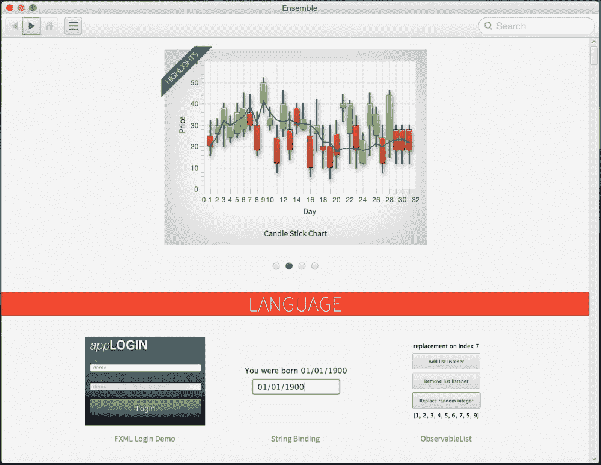
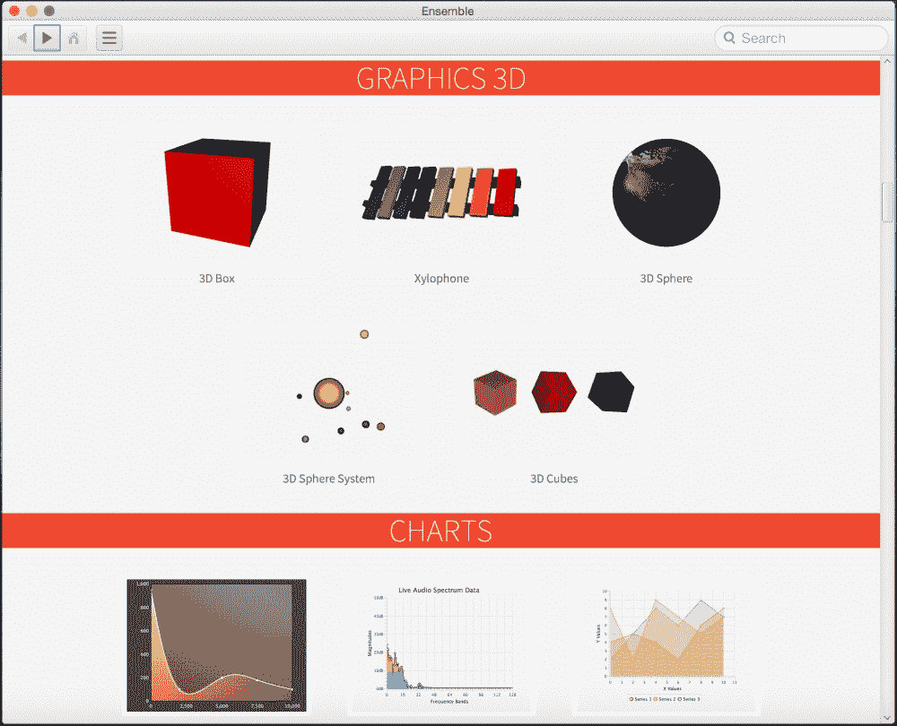

# JavaFX 特性

根据 JavaFX 官方文档，JavaFX 8 及更高版本包含以下特性：

*   **Java API**：JavaFX 是一个 Java 库，包含用 Java 代码编写的类和接口。
*   **FXML 和 Scene Builder**：这是一种基于 XML 的声明式标记语言，用于构建 JavaFX 应用程序用户界面。你可以使用 FXML 编码，或使用 JavaFX Scene Builder 以交互方式设计 GUI。Scene Builder 生成的 FXML 标记可以移植到 NetBeans 等 IDE 中，你可以在其中添加业务逻辑。此外，生成的 FXML 文件可以直接在 JavaFX 应用程序内部使用。
*   **WebView**：这是一个 Web 组件，它使用 `WebKit`（一种 HTML 渲染引擎技术）使得在 JavaFX 应用程序中嵌入网页成为可能。在 `WebView` 中运行的 JavaScript 可以调用 Java API，反之亦然。
*   **Swing/SWT 互操作性**：现有的 Swing 和 SWT 应用程序可以利用 JavaFX 的特性，例如丰富的图形、媒体播放和嵌入式 Web 内容。
*   **内置 UI 控件和 CSS**：JavaFX 提供了所有主要的 UI 控件，以及一些开发全功能应用程序所需的额外不常见控件，如图表、分页和手风琴式布局。组件可以使用标准 Web 技术（如 CSS）进行皮肤定制。
*   **3D 图形特性**：包含对 3D 图形库的支持。
*   **Canvas API**：你可以使用 Canvas API 直接在 JavaFX 场景区域内绘图，该 API 包含一个图形元素（节点）。
*   **多点触控支持**：基于底层平台的能力支持多点触控操作。
*   **硬件加速图形管线**：JavaFX 图形基于图形渲染管线 *Prism*。当与支持的显卡或**图形处理单元**（**GPU**）一起使用时，Prism 引擎可以平滑快速地渲染 JavaFX 图形。如果系统不具备这些条件，则 Prism 默认使用软件渲染堆栈。
*   **高性能媒体引擎**：该引擎提供了一个稳定、低延迟的媒体框架，该框架基于 `GStreamer` 多媒体框架。通过媒体管线支持 Web 多媒体内容的播放。
*   **自包含部署模型**：自包含应用程序包包含所有应用程序资源以及 Java 和 JavaFX 运行时的私有副本。它们作为本机可安装包分发，并提供与该操作系统本机应用程序相同的安装和启动体验。

## JavaFX 8 的新特性

以下是 Java SE 8 版本中 JavaFX 组件的新特性和重大产品变更的简要总结：

*   新的 *Modena 主题* 现在是 JavaFX 应用程序的默认主题。
*   增加了对更多 HTML5 特性的支持，包括 Web Sockets、Web Workers、Web Fonts 和打印功能。
*   API 通过新的 `SwingNode` 类使你能够将 **Swing** 内容嵌入到 JavaFX 应用程序中，从而改进了 Swing 互操作性特性。
*   现在提供了 `DatePicker`、`Spinner` 和 `TableView` 内置 UI 控件。
*   通过 `javafx.print` 包提供了公共的 JavaFX 打印 API。
*   提供了对高 DPI 显示器的支持。
*   CSS 样式类成为公共 API。
*   引入了一个计划服务类。
*   3D 图形库通过几个新的 API 类得到了增强。
*   此版本中对 *Camera API* 类进行了重大更新。
*   现在 JavaFX 8 支持富文本功能。这包括 UI 控件中的双向和复杂文本脚本（如泰语和印地语），以及文本节点中的多行、多样式文本。
*   支持对话框和辅助功能 API。

在附录 *成为 JavaFX 大师* 中，我提供了成为 JavaFX 大师所需的所有参考资料（链接、书籍、杂志、文章、博客和工具）以及真实的 JavaFX 8 生产应用程序列表。

下图展示了使用 JavaFX 8 构建的 `Ensemble8.jar` 应用程序，显示了涉及各种 JavaFX 8 组件、主题和概念的示例。更有趣的是，其源代码可供学习和修改——请参阅最后一章了解如何安装此应用程序。

JavaFX 8 应用程序

该应用程序涵盖了许多主题，尤其是新的 JavaFX 8 3D API，可以在“Graphics 3D”部分找到，如下图所示：

JavaFX 8 3D 应用程序

