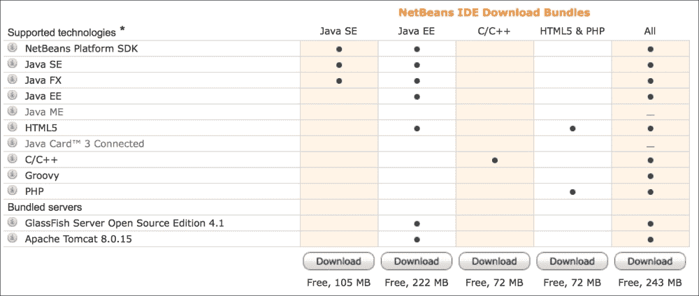
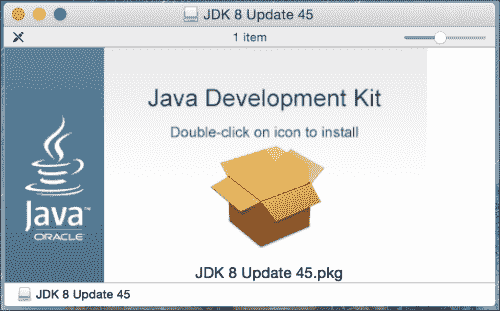
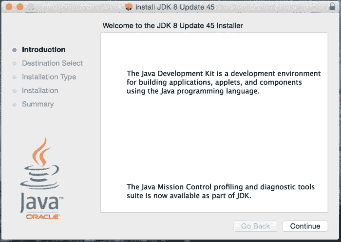
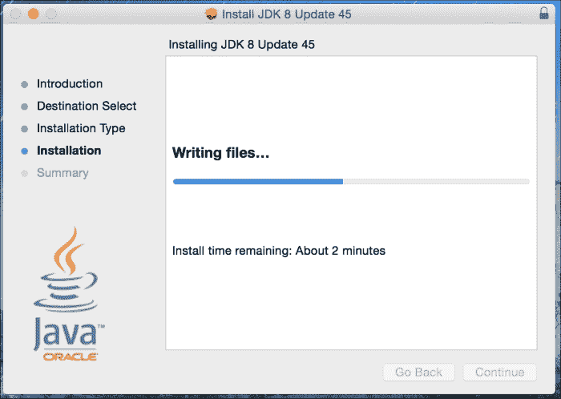
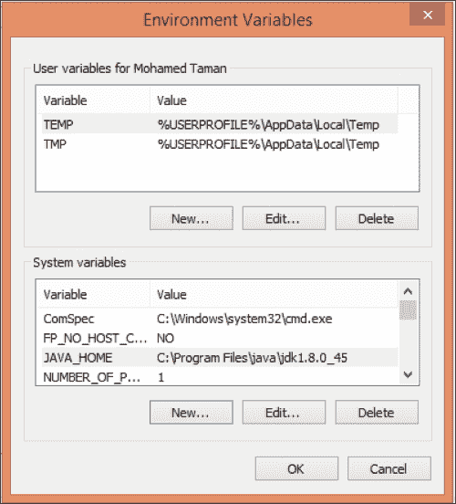
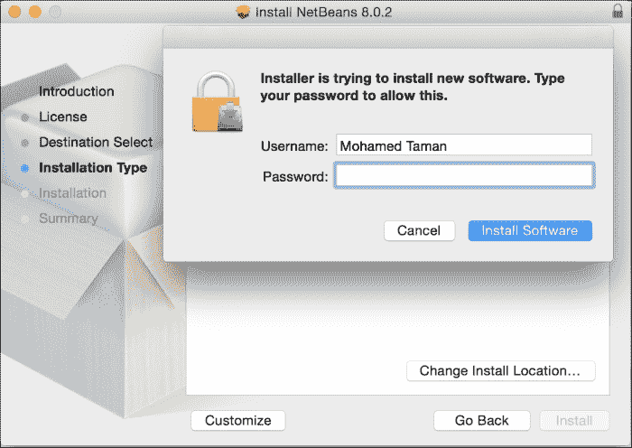
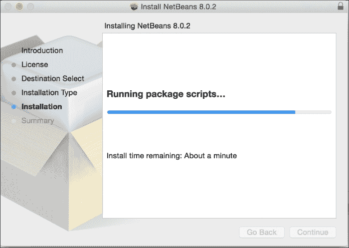
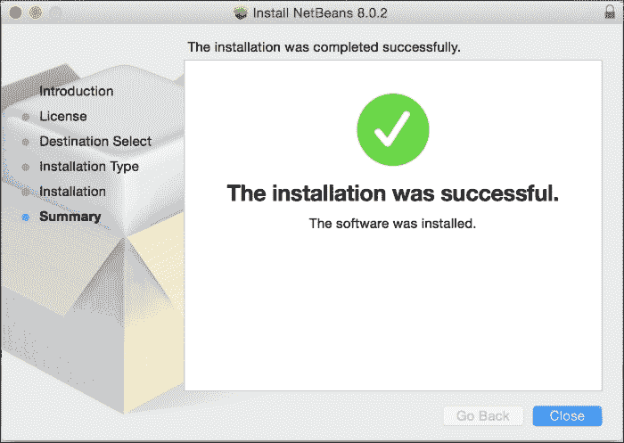

# 安装所需软件

到目前为止，我们已经对 JavaFX 有了很好的了解，我和你一样渴望开始创建并启动我们的第一个 `"Hello JavaFX 8"` 应用程序。但这需要下载并安装正确的工具，以便我们能够创建和编译本书中的大部分代码。

你需要下载并安装 *Java 8 开发工具包*（JDK）或更高版本。注意不是运行时版本（JRE）。

从以下位置下载最新的 Java SE 8u45 JDK 或更高版本：

[`www.oracle.com/technetwork/java/javase/downloads/index.html`](http://www.oracle.com/technetwork/java/javase/downloads/index.html)

从以下链接 [`netbeans.org/downloads`](https://netbeans.org/downloads) 下载并安装 NetBeans 8.0.2 或更高版本，虽然推荐使用 NetBeans IDE **All** 捆绑包，*你也可以使用 Java EE 捆绑包*，如下图所示：



NetBeans 捆绑包下载。

目前，JavaFX 8 支持以下操作系统：

*   Windows 操作系统（XP、Vista、7、8）32 位和 64 位
*   Mac OS X（64 位）
*   Linux（32 位和 64 位）、Linux ARMv6/7 VFP、HardFP ABI（32 位）
*   Solaris（32 位和 64 位）


## 安装 Java SE 8 JDK

本节概述的步骤将指导您成功下载并安装 Java SE 8。请从以下位置下载 Java SE 8 JDK：

[`www.oracle.com/technetwork/java/javase/downloads/jdk8-downloads-2133151.html`](http://www.oracle.com/technetwork/java/javase/downloads/jdk8-downloads-2133151.html)

在以下步骤中，将以 Mac OS X Yosemite (10.10.3) 操作系统上的 Java SE 8u45 JDK 64 位版本（撰写本文时的版本）为例。

其他操作系统和 JDK 版本的步骤类似。但是，如果您的环境不同，请参考以下链接获取更多详细信息：

[`docs.oracle.com/javase/8/docs/technotes/guides/install/toc.html`](http://docs.oracle.com/javase/8/docs/technotes/guides/install/toc.html)

以下是安装 Java SE 8 JDK 的步骤：

1.  通过启动镜像文件 `jdk-8u45-macosx-x64.dmg` 来安装 Java 8 JDK。启动 JDK 8 安装镜像文件后，将出现如下截图所示的屏幕。这是软件包安装文件。双击它，安装程序将启动：

    JDK 8 安装镜像文件

    ### 提示

    通常，您需要拥有机器的管理员权限才能安装软件。

2.  开始安装 Java 8 JDK。安装过程开始时将出现如下截图所示的屏幕。点击**继续**按钮，然后在**安装类型**屏幕向导中，点击**安装**以开始安装。

    Java SE 开发工具包 8 安装

3.  点击**安装**后，系统可能会要求您提供密码。提供密码，点击**确定**，安装将继续并显示进度条，如下图所示：

    Java SE 开发工具包 8 安装进行中

4.  安装程序将完成 Java 8 SE 开发工具包的安装。点击**关闭**按钮退出。

### 设置环境变量

现在您需要设置几个关键的环境变量。设置方式及其值取决于您的操作系统。需要设置的两个变量是：

*   **JAVA_HOME**：此变量告诉您的操作系统 Java 的安装目录在哪里。
*   **PATH**：此变量指定 Java 可执行文件目录的位置。此环境变量允许系统搜索包含可执行文件的路径或目录。Java 可执行文件位于 `JAVA_HOME` 主目录下的 bin 目录中。

为了使 `JAVA_HOME` 和 `PATH` 的设置更持久，您需要将它们添加到系统中，以便在每次启动或登录时始终可用。根据您的操作系统，您需要能够编辑环境变量名称和值。

在 *Windows 环境*中，您可以使用键盘快捷键 *Windows 徽标键 + Pause/Break 键*，然后点击**高级系统设置**以显示**系统属性**对话框。

接下来，点击**环境变量**。您可以在此处添加、编辑和删除环境变量。您将通过使用已安装的主目录作为值来添加或编辑 `JAVA_HOME` 环境变量。此截图显示了 Windows 操作系统上的环境变量对话框：



Windows 环境变量

让我们设置环境变量：

*   要为 **Mac OS X** 平台设置您的 `JAVA_HOME` 环境变量，您需要启动一个终端窗口，通过添加以下 export 命令来编辑您主目录下的 `.bash_profile` 文件：

    ```
    export JAVA_HOME=$(/usr/libexec/java_home -v 1.8)
    ```

*   在 **Linux** 和其他使用 Bash shell 环境的 **Unix** 操作系统上，启动一个终端窗口，编辑 `~/.bashrc` 或 `~/.profile` 文件，使其包含 export 命令：

    ```
    export JAVA_HOME=/usr/java/jdk1.8.0
    export PATH=$PATH:$JAVA_HOME/bin
    ```

*   在 Linux 和其他使用 `C` shell (csh) 环境的 Unix 操作系统上，启动一个终端窗口，编辑 `~/.cshrc` 或 `~/.login` 文件，使其包含 `setenv` 命令：

    ```
    setenv JAVA_HOME /usr/java/jdk1.8.0_45
    setenv PATH ${JAVA_HOME}/bin:${PATH}
    ```

设置好路径和 `JAVA_HOME` 环境变量后，您需要验证设置，方法是启动一个终端窗口，并在命令提示符下执行以下两个命令：

```
java -version
javac –version
```

### 注意

每个命令的输出都应显示一条消息，指示 Java SE 8 的语言和运行时版本。

## 安装 NetBeans IDE

在开发 JavaFX 应用程序时，您将使用 NetBeans IDE（或您喜欢的任何其他 IDE）。请务必下载包含 JavaFX 的正确 NetBeans 版本。要安装 NetBeans IDE，请遵循以下步骤：

1.  从以下位置下载 NetBeans IDE 8.0.2 或更高版本：

    [`netbeans.org/downloads/index.html`](https://netbeans.org/downloads/index.html)

2.  启动 `.dmg` 镜像文件 `netbeans-8.0.2-macosx.dmg`。镜像将被验证，然后会打开一个包含安装程序包存档 `netbeans-8.0.2.pkg` 的文件夹；双击它以启动安装程序。将出现一个对话框，显示消息：*此软件包将运行一个程序以确定是否可以安装该软件。* 点击**继续**按钮。
3.  启动 NetBeans 安装对话框后，再次点击**继续**。接下来，接受许可协议，点击**继续**，然后点击**同意**。
4.  点击**安装**按钮继续。以下截图显示了一个 **Mac** 安全警告提示；提供您的密码并点击**安装软件**。

    Mac 安全警告对话框

5.  NetBeans IDE 安装过程将开始。以下截图显示了安装进度条：

    安装进度

6.  点击**关闭**按钮完成安装，如下所示：

    安装完成

现在您可以继续创建 JavaFX 应用程序了。

