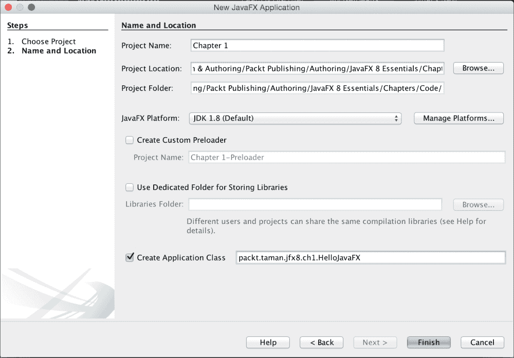
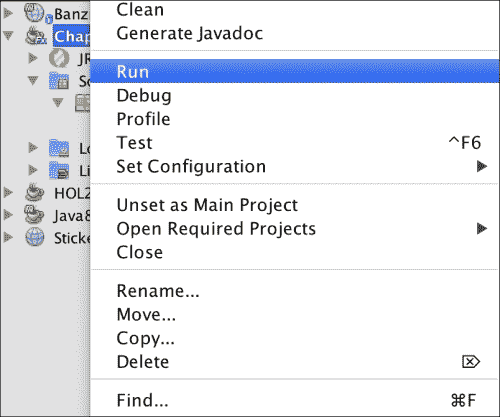
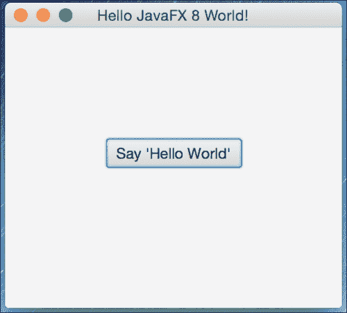
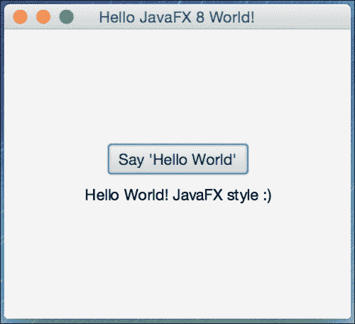

# 创建 "Hello World" JavaFX 风格的应用程序

向您展示创建和构建 JavaFX 应用程序是什么样的最好方式，就是通过一个 `Hello World` 应用程序。

在本节中，您将使用我们刚刚安装的 NetBeans IDE 来开发、编译和运行一个基于 JavaFX 的 `Hello World` 应用程序。


## 使用 NetBeans IDE

要快速开始使用 NetBeans IDE 创建、编码、编译并运行一个简单的 JavaFX 风格的 `Hello World` 应用程序，请遵循本节概述的步骤：

1.  从 **文件** 菜单中，选择 **新建项目**。
2.  从 **JavaFX 应用程序类别** 中，选择 **JavaFX 应用程序**。点击 **下一步**。
3.  将项目命名为 `HelloJavaFX`。你也可以选择为应用程序类定义包结构。然后点击 **完成**，如下图所示：

    

    新建 JavaFX 应用程序向导

    NetBeans 会打开 `HelloJavaFX.java` 文件，并用一个基本的“Hello World”应用程序代码填充它。

    ### 注意

    你会发现此版本的代码与 NetBeans 实际生成的代码略有不同，你可以比较它们以找出差异，但它们具有相同的结构。我这样做是为了在点击 **说“Hello World”** 按钮时，将结果显示在 `Scene` 上的文本节点中，而不是控制台中。为此，还使用了一个 `VBox` 容器。

4.  右键点击项目，然后从菜单中选择 **运行**，如下图所示：

    运行应用程序

5.  NetBeans 将编译并运行该应用程序。输出应如下图所示：

    从 NetBeans IDE 启动的 JavaFX Hello World

6.  点击按钮，你应该会看到以下结果：

    JavaFX Hello World 结果

以下是基本 Hello World 应用程序 (`HelloJavaFX.java`) 的修改后代码：

```
import javafx.application.Application;
import javafx.scene.Scene;
import javafx.scene.control.Button;
import javafx.scene.text.Text;
import javafx.stage.Stage;
import static javafx.geometry.Pos.CENTER;
import javafx.scene.layout.VBox;

/**
  * @author mohamed_taman
 */
public class HelloJavaFX extends Application {

  @Override
  public void start(Stage primaryStage) {

    Button btn = new Button();
    Text message = new Text();

    btn.setText("Say 'Hello World'");

    btn.setOnAction(event -> {
      message.setText("Hello World! JavaFX style :)");
    });

    VBox root = new VBox(10,btn,message);
    root.setAlignment(CENTER);

    Scene scene = new Scene(root, 300, 250);

    primaryStage.setTitle("Hello JavaFX 8 World!");
    primaryStage.setScene(scene);
    primaryStage.show();
  }
  public static void main(String[] args) {
    launch(args);
  }
}
```

## 工作原理

以下是关于 JavaFX 应用程序基本结构需要了解的重要事项：

*   JavaFX 应用程序的主类应继承 `javafx.application.Application` 类。`start()` 方法是所有 JavaFX 应用程序的*主入口点*。
*   JavaFX 应用程序通过*舞台*和*场景*来定义用户界面容器。JavaFX `Stage` 类是顶层的 JavaFX 容器。JavaFX `Scene` 类是所有内容的容器。以下代码片段创建了一个舞台和场景，并使场景在给定的像素大小下可见——`new Scene(root, 300, 250)`。
*   在 JavaFX 中，场景的内容表示为节点的分层场景图。在此示例中，根节点是一个 `VBox` 布局对象，它是一个可调整大小的布局节点。这意味着根节点的大小会跟随场景的大小，并在用户调整舞台大小时发生变化。
*   这里使用 `VBox` 作为容器，将其内容节点垂直排列成单列多行。我们将按钮 **btn** 控件添加到列的第一行，然后将文本 **message** 控件添加到同一列的第二行，垂直间距为 10 像素，如下代码片段所示：

    ```
    VBox root = new VBox(10,btn,message);
    root.setAlignment(CENTER);
    ```

*   我们为按钮控件设置了文本，并添加了一个事件处理器，当按钮被点击时，将消息文本控件设置为 **Hello World! JavaFX style :)**。
*   你可能会注意到一段用 Java 编写的奇怪代码语法，却没有编译器错误。这是一个 **Lambda** 表达式，它已被添加到 Java SE 8 中，我们将在第 2 章 *JavaFX 8 要点与创建自定义 UI* 中简要讨论它。与旧的匿名内部类风格稍作比较，现在使用 Lambda 表达式更简洁、更精炼。请看这段代码对比：

    旧式写法：

    ```
    btn.setOnAction(new EventHandler<ActionEvent>() {
      @Override
      public void handle(ActionEvent event) {
        message.setText("Hello World! JavaFX style :)");
      }
    });
    ```

    新时代写法：

    ```
    btn.setOnAction(event -> {
        message.setText("Hello World! JavaFX style :)");
    });
    ```

*   当应用程序的 **JAR** 文件是使用 JavaFX Packager 工具创建时，该工具会将 JavaFX Launcher 嵌入到 JAR 文件中，因此 JavaFX 应用程序不需要 `main()` 方法。
*   然而，包含 `main()` 方法是有用的，这样你就可以运行那些没有使用 JavaFX Launcher 创建的 JAR 文件，例如在使用 JavaFX 工具未完全集成的 IDE 时。此外，嵌入 JavaFX 代码的 **Swing** 应用程序也需要 `main()` 方法。
*   在这里，在我们的 `main()` 方法的入口点，我们通过简单地将命令行参数传递给 `Application.launch()` 方法来启动 JavaFX 应用程序。
*   在 `Application.launch()` 方法执行后，应用程序将进入就绪状态，框架内部将调用 `start()` 方法来开始。
*   此时，程序执行发生在 *JavaFX 应用程序线程* 上，而不是 **主线程** 上。当调用 `start()` 方法时，一个 JavaFX `javafx.stage.Stage` 对象可供你使用和操作。

### 注意

高级主题将在接下来的章节中详细讨论。更重要的是，我们将在接下来的章节中深入了解 JavaFX 应用程序线程。在最后三章中，我们将看到如何将其他线程的结果带入 JavaFX 应用程序线程，以便在场景上正确渲染。

