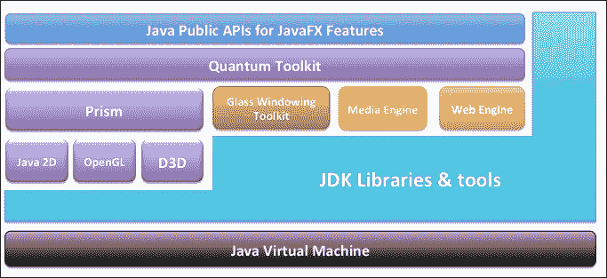
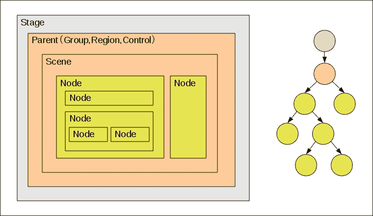
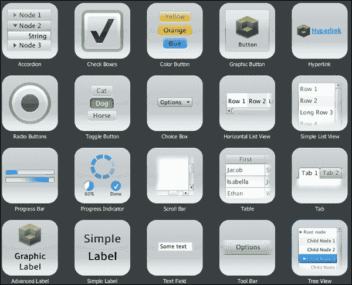

# JavaFX 8 架构快速回顾

为了更好地理解框架的组件和引擎如何协同工作来运行你的 JavaFX 应用程序，本节将对 JavaFX 架构和生态系统进行高层描述。

下图展示了 JavaFX 平台的架构组件。它显示了每个组件以及它们之间如何相互连接。

负责运行你的 JavaFX 应用程序代码的引擎位于 JavaFX 公共 API 之下。

该引擎由子组件组成。这些组件包括 **Prism**（一个 JavaFX 高性能图形引擎）、Glass 工具包（一个小巧高效的窗口系统）、一个媒体引擎和一个 Web 引擎。

### 注意

虽然这些组件未通过公共 API 公开，但我们仍将对其进行描述，以便你更好地了解是什么让 JavaFX 应用程序能够高效地成功运行。

JavaFX 架构图

有关 JavaFX 架构和生态系统的更多信息和描述，请访问 [`docs.oracle.com/javase/8/javafx/get-started-tutorial/jfx-architecture.htm`](http://docs.oracle.com/javase/8/javafx/get-started-tutorial/jfx-architecture.htm)。

## 场景图

每个应用程序都有一个起始根节点来构建 UI 层次结构，而 JavaFX 应用程序的起点是*场景图*。在上面的截图中，它显示为顶层蓝色部分的一部分。它是节点的根树，代表了应用程序用户界面的所有视觉元素。它还跟踪并处理任何用户输入，并且可以被渲染，因为它本身就是一个 UI 节点。

*节点*是场景图树中的任何一个元素。每个节点默认具有以下属性：用于标识的 ID、用于更改其视觉属性的样式类列表，以及一个边界体积，以便与场景上的其他组件及其父布局容器节点（场景图的根节点除外）正确适配。

场景图树中的每个节点都有一个父节点，但可以有零个或多个子节点；然而，场景根节点没有父节点（为 null）。此外，JavaFX 有一种机制来确保一个节点只能有一个父节点；它还可以具有以下内容：

*   视觉效果，例如模糊和阴影
*   通过不透明度控制组件透明度
*   CPU 加速的 2D 变换、过渡和旋转
*   3D 变换，例如过渡、缩放和旋转
*   事件处理器（例如鼠标事件、键盘事件或其他输入方法，如触摸事件）
*   特定于应用程序的状态

下图显示了舞台、场景、UI 节点和图形树之间的关系：

JavaFX UI 树层次结构关系

图形基元也是 JavaFX 场景图不可或缺的一部分，例如线条、矩形和文本，以及图像、媒体、UI 控件和布局容器。

在为客户提供复杂且丰富的 UI 时，场景图简化了这项任务。此外，你可以使用 `javafx.animation` API 快速轻松地动画化场景图中的各种图形。

除了这些特性之外，`javafx.scene` API 还允许创建和指定以下几种内容类型：

*   **节点**：任何表示为 UI 控件、图表、组、容器、嵌入式 Web 浏览器、形状（2D 和 3D）、图像、媒体和文本的节点元素
*   **效果**：这些是简单的对象，当应用于 UI 节点时，会改变其在场景图节点上的外观，例如模糊、阴影和颜色调整
*   **状态**：任何特定于应用程序的状态，例如变换（节点的定位和方向）和视觉效果

## 用于 JavaFX 特性的 Java 公共 API

这是你的瑞士军刀工具包，以一套完整的 Java 公共 API 形式提供，支持富客户端应用程序开发。

这些 API 为你提供了前所未有的灵活性，通过将 Java SE 平台的最佳功能与全面、沉浸式的媒体功能相结合，构建你的富客户端 UI 应用程序，形成一个直观且全面的、触手可及的一站式开发环境。

这些用于 JavaFX 的 Java API 允许你执行以下操作：

*   使用 Java SE 的强大功能，从泛型、注解和多线程，到新的 Lambda 表达式（在 Java SE 8 中引入）。
*   为 Web 开发人员提供了一种更简单的方法，从其他基于 JVM 的动态语言（例如 *JavaScript*）中使用 JavaFX。
*   通过集成其他系统语言（例如 *Groovy*）来编写大型且复杂的 JavaFX 应用程序。
*   将你的 UI 控件绑定到控制器属性，以便自动通知和更新从模型反映到绑定的 UI 节点。绑定包括对高性能惰性绑定、绑定表达式、绑定序列表达式和部分绑定重新评估的支持。我们将在第 3 章 *开发 JavaFX 桌面和 Web 应用程序*中看到这一点以及更多内容。
*   引入可观察列表和映射，通过扩展 Java 集合库，允许应用程序将 UI 连接到数据模型，以观察这些数据模型中的变化并相应地更新相应的 UI 控件。

## 图形系统

JavaFX 图形系统（上图中以紫色显示）支持 2D 和 3D 场景图，使其能够在 JavaFX 场景图层上流畅运行。作为该层之下的实现细节，当系统缺乏足够的图形硬件来支持硬件加速渲染时，它会提供渲染软件栈。

JavaFX 平台拥有两条实现图形加速的管线：

*   **Prism**：这是处理所有渲染作业的引擎。它可以在硬件和软件渲染器上运行，包括 3D 渲染。JavaFX 场景的栅格化和渲染均由该引擎负责。根据所使用的设备，可能采用以下多种渲染路径：
    *   Windows XP 和 Vista 上的 DirectX 9，以及 Windows 7 上的 DirectX 11
    *   Linux、Mac 和嵌入式系统上的 OpenGL
    *   当无法进行硬件加速时的软件渲染
*   **Quantum Toolkit**：负责将 Prism 引擎和 Glass 窗口工具包连接在一起，使其可供堆栈中上层的 JavaFX 层使用。此外，它还管理与渲染和事件处理相关的任何线程规则。

## Glass 窗口工具包

Glass 窗口工具包（上图中部以红色显示）作为平台相关层，负责将 JavaFX 平台连接到原生操作系统。

其主要职责是提供原生操作系统服务，例如管理定时器、窗口和表面，因此它在渲染堆栈中的位置是最低的。

## JavaFX 线程

通常，系统在任何给定时间会运行以下两个或多个线程：

*   **JavaFX 应用程序线程**：这是 JavaFX 应用程序运行所使用的主要线程。
*   **Prism 渲染线程**：该线程独立于事件分发器处理渲染。它在准备处理下一帧（第 N+1 帧）的同时，渲染当前帧（第 N 帧）。其巨大优势在于能够执行并发处理，尤其是在拥有多个处理器的现代系统上。
*   **媒体线程**：该线程在后台运行，并通过使用 JavaFX 应用程序线程，经由场景图同步最新的帧。
*   **脉冲**：它提供了一种异步处理事件的方式。它有助于管理 JavaFX 场景图元素状态与 Prism 引擎中场景图事件之间的同步。当脉冲被触发时，场景图上元素的状态会同步到渲染层。

### 注意

任何布局节点和 CSS 也都与脉冲事件相关联。

*Glass 窗口工具包*使用高精度原生定时器来执行所有脉冲事件。

## 媒体与图像

JavaFX 的 `javafx.scene.media` API 提供了媒体功能。JavaFX 支持视觉和音频媒体。对于音频文件，它支持 `MP3`、`AIFF` 和 `WAV` 文件以及 `FLV` 视频文件。

你可以通过 JavaFX 媒体提供的三个主要独立组件来访问媒体功能——`Media` 对象代表一个媒体文件，`MediaPlayer` 播放媒体文件，`MediaView` 是一个节点，用于将媒体显示到场景图中。

### 注意

媒体引擎组件（上图中以橙色显示）在设计时充分考虑了稳定性和性能，以在所有支持的平台上提供一致的行为。

## Web 组件

Web 引擎组件（上图中以绿色显示）是最重要的 JavaFX UI 控件之一，它基于 WebKit 引擎构建，WebKit 是一个开源 Web 浏览器引擎，支持 HTML5、JavaScript、CSS、DOM 渲染和 SVG 图形。它通过其 API 提供 Web 查看器和完整的浏览功能。我们将在第 3 章 *开发 JavaFX 桌面和 Web 应用程序*中深入探讨这一点，届时将开发 Web 应用程序。

它允许你在 Java 应用程序中添加和实现以下功能：

*   渲染来自本地或远程 URL 的任何 HTML 内容
*   提供前进和后退导航，并支持历史记录
*   重新加载内容以获取任何更新
*   为 Web 组件添加动画并应用 CSS 效果
*   为 HTML 内容提供丰富的编辑控件
*   可以执行 JavaScript 命令并处理 Web 控件事件

## 布局组件

在构建丰富且复杂的 UI 时，我们需要一种方法来灵活、动态地安排 JavaFX 应用程序中的 UI 控件。这是使用布局容器或窗格的最佳场景。

布局 API 包含以下容器类，它们可以自动化常见的布局 UI 模式：

*   **BorderPane**：将其内容节点布局在顶部、底部、右侧、左侧或中心区域
*   **HBox**：将其内容节点水平排列成单行
*   **VBox**：将其内容节点垂直排列成单列
*   **StackPane**：将其内容节点以从后到前的顺序堆叠在窗格中心
*   **GridPane**：允许创建灵活的行列网格，用于布局内容节点
*   **FlowPane**：将其内容节点按水平或垂直方向流动排列，并在达到指定宽度（水平方向）或高度（垂直方向）边界时自动换行
*   **TilePane**：将其内容节点放置在统一大小的布局单元格或磁贴中
*   **AnchorPane**：允许创建锚定节点到布局的顶部、底部、左侧或中心，并且我们可以自由定位其子节点

### 提示

不同的容器可以在 JavaFX 应用程序中嵌套使用；为了实现所需的布局结构，我们将在接下来开发自定义 UI 时看到实际应用。

## JavaFX 控件

JavaFX 控件是 UI 布局的构建块，它们作为一组 JavaFX API 位于 `javafx.scene.control` 包中。它们通过使用场景图中的节点构建而成。可以通过 JavaFX CSS 对它们进行主题化和外观定制。它们可跨不同平台*移植*。它们充分利用了 JavaFX 平台丰富的视觉特性。

下图展示了一些当前支持的 UI 控件，此外还有更多未在此显示：

JavaFX UI 控件示例

### 注意

有关所有可用 JavaFX UI 控件的更多详细信息，请参阅官方教程 [`docs.oracle.com/javase/8/javafx/user-interface-tutorial/ui_controls.htm#JFXUI336`](http://docs.oracle.com/javase/8/javafx/user-interface-tutorial/ui_controls.htm#JFXUI336) 以及 `javafx.scene.control` 包的 API 文档。

