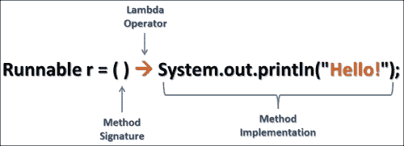

# Java SE 8 特性

我们将浅尝 Java SE 8，以理解两个最重要的特性——lambda 或 lambda 表达式以及函数式接口（它们使 lambda 可用），从而帮助我们编写更好、更简洁、样板代码更少的 JavaFX 8 代码。但请记住，本书不会涉及每个 lambda 细节，因为这不是一本关于 Java SE 8 的书。

### 注意

要更好地了解 Java 的 lambda 路线图，请访问以下官方教程：[`docs.oracle.com/javase/tutorial/java/javaOO/lambdaexpressions.html`](http://docs.oracle.com/javase/tutorial/java/javaOO/lambdaexpressions.html)。


## Lambda 表达式

Java 语言中 **lambda** 项目的首要目标是解决函数式编程缺失的问题，并提供一种通过创建匿名（未命名）函数来轻松实现函数式编程的方式，其方式类似于在 Java 中创建匿名对象而非方法。

正如你在第 1 章的示例中所见，*JavaFX 8 入门*，我们讨论了为 JavaFX 按钮的按下事件定义处理器的常规方法——使用匿名内部类：

```
btn.setOnAction(new EventHandler<ActionEvent>() {
   @Override
   public void handle(ActionEvent event) {
     message.setText("Hello World! JavaFX style :)");
   }
});
```

这段代码与仅仅编写一行设置按钮动作中消息文本字段 `text` 属性的代码相比，显得非常冗长。如果能重写这段包含逻辑的代码，而无需这么多样板代码，那该多好啊？

Java SE 8 通过 Lambda 表达式解决了这个问题，如下所示：

```
btn.setOnAction(event -> {
    message.setText("Hello World! JavaFX style :)");
});
```

除了使代码更简洁易读之外，lambda 表达式还能让你的代码性能更佳。

### 语法

编写 lambda 表达式有两种方式，其通用形式如下图所示：



Lambda 表达式通用形式——以创建新线程为例

这两种方式如下：

*   `(param1, param2, ...) -> expression;`
*   `(param1, param2, ...) -> { /* 代码语句 */ };`

第一种形式，即表达式形式，用于我们只分配一行代码或一个简单表达式的情况。而第二种形式，即代码块形式，包含单行或多行代码体，并带有 return 语句，因此我们需要用花括号将它们括起来。

以下三条语句是等价的：

*   `btn.setOnAction((ActionEvent event) -> {message.setText("Hello World!");});`
*   `btn.setOnAction( (event) -> message.setText("Hello World!"));`
*   `btn.setOnAction(event -> message.setText("Hello World!"));`

### 提示

为了更深入地了解新的 lambda 表达式及其相关特性，以及 Java SE 8 的功能，我建议你阅读这个系列文章——Java SE 8 新特性之旅：[`tamanmohamed.blogspot.com/2014/06/java-se-8-new-features-tour-big-change.html`](http://tamanmohamed.blogspot.com/2014/06/java-se-8-new-features-tour-big-change.html)

## 函数式接口

Lambda 表达式很棒，不是吗？但你可能想知道它的确切类型是什么，这样它才能被赋值给变量并传递给方法。

答案在于函数式接口的强大功能。如何实现呢？函数式接口由 Java 语言设计者/架构师巧妙地创建为闭包，它使用了**单一抽象方法**（**SAM**）的概念，提供了一个仅包含一个抽象方法的接口，以及 `@FunctionalInterface` 注解。单一抽象方法模式是 Java SE 8 lambda 表达式不可或缺的一部分。

让我们通过一个示例来阐明函数式接口和 lambda 表达式的概念。我创建了一个名为 `Calculator.java` 的函数式接口，其中包含一个名为 `calculate()` 的单一抽象方法。一旦创建完成，你就可以声明变量并将 lambda 表达式赋值给它们。以下是该函数式接口：

```
@FunctionalInterface
public interface Calculator {
    double calculate(double width, double height);
}
```

现在，我们准备创建变量并将 lambda 表达式赋值给它们。以下代码创建了 lambda 表达式并将其赋值给我们的函数式接口变量：

```
Calculator area = (width, height) -> width * height; //面积 = 宽 × 高
//周长 = 2(宽+高)
Calculator perimeter = (width, height) -> 2 * (height + width);
out.println("矩形面积: "+ area.calculate(4, 5)+" 厘米.");
out.println("矩形周长: "+ perimeter.calculate(4, 5)+" 厘米.");
```

代码的输出应如下所示：

```
矩形面积: 20.0 厘米.
矩形周长: 18.0 厘米.
```

