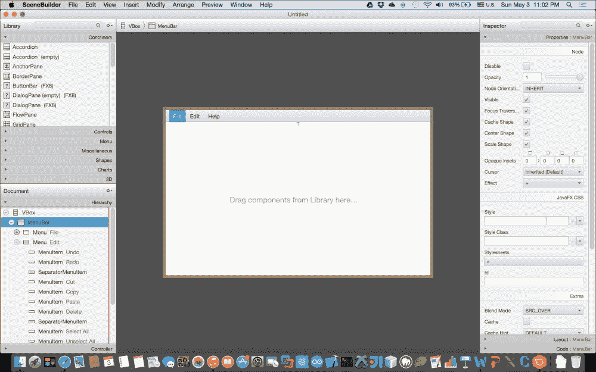

# Scene Builder

对于大多数复杂且精细的 UI 需求，设计师使用一种工具，通过所见即所得的界面来设计 UI，无需编写任何代码，然后将结果（`FXML` 文件）加载到他们的 JavaFX 应用程序逻辑中，这样不是更容易吗？

因此，你需要 JavaFX Scene Builder；它是一个可视化布局工具，允许你轻松布局 UI 控件，以便快速构建带有效果和动画的应用程序原型。Scene Builder（2.0 及以上版本）是与 JavaFX 8 兼容的版本。

在项目创建过程中的任何时候，你都可以预览你的工作，以检查其在实际部署前的真实外观。

它是开源的，因此可以与大多数 IDE 集成，但与 NetBeans IDE 的集成更为紧密。它也是一个跨平台、自包含的应用程序，可在大多数平台上运行。

除了支持 CSS 之外，它还允许你轻松地为原型应用自定义主题。

## 下载与启动

2015 年初，Oracle 发布了 JavaFX Scene Builder 工具 2.0 版本，并宣布将不再提供 JavaFX Scene Builder 工具（编译形式）的构建版本。

一家名为 **Gluon** ([`gluonhq.com`](http://gluonhq.com)) 的公司深知工具可以成就或破坏编码体验。因此，他们决定开始提供基于他们将在公开可访问的仓库中维护的一个分支的构建版本。

Gluon 提供 IDE 插件，以及基于 OpenJFX 最新源码改进的 JavaFX Scene Builder 工具构建版本，这些改进源于社区参与以及更好地支持第三方项目的愿望，例如 **ControlsFX** ([`www.controlsfx.org/`](http://www.controlsfx.org/))、**FXyz** ([`github.com/FXyz/FXyz`](https://github.com/FXyz/FXyz)) 和 **DataFX** ([`www.datafx.io/`](http://www.datafx.io/))。

让我们开始从以下 URL 下载该工具：[`gluonhq.com/products/downloads/`](http://gluonhq.com/products/downloads/)。

下载 8.0 版本并安装后，启动它，Scene Builder 工具应打开，如下图所示：



JavaFX 8 Scene Builder 工具。

## FXML

在添加组件并构建你精美的 UI 布局时，Scene Builder 会在后台自动为你生成一个基于 FXML 和 XML 的标记文件，该文件稍后将用于将你的 UI 绑定到 Java 应用程序逻辑。

FXML 提供的主要优势之一是关注点分离，因为它将 UI 层（*视图*）与逻辑（*控制器*）解耦；这意味着你可以随时更改 UI，而无需更改底层逻辑。由于 FXML 文件不被编译，它可以在运行时动态加载，无需任何编译。这意味着它有助于你进行快速原型设计。

### 将 FXML 加载到 JavaFX 应用程序中

从 Scene Builder 工具生成 UI 设计后，将其添加到应用程序中是非常容易的。以下是在 `start()` 方法中加载 FXML 文件的代码：

```
BorderPane root = new BorderPane();
Parent content = FXMLLoader.load(getClass().getResource("filename.fxml"));
root.setCenter(content);
```

如你所见，我使用了 `javafx.fxml.FXMLLoader` 类的静态方法 `load`。`load()` 方法将加载（反序列化）由 Scene Builder 工具创建的 FXML 文件。

