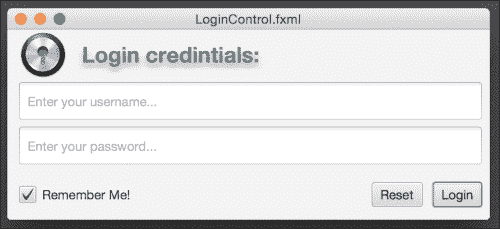
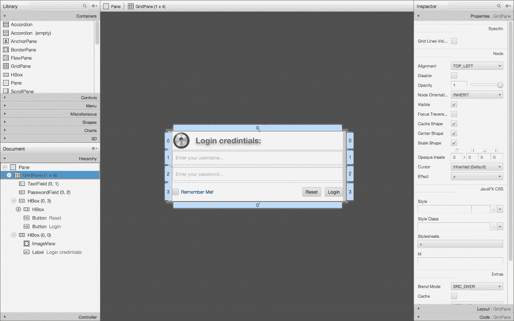
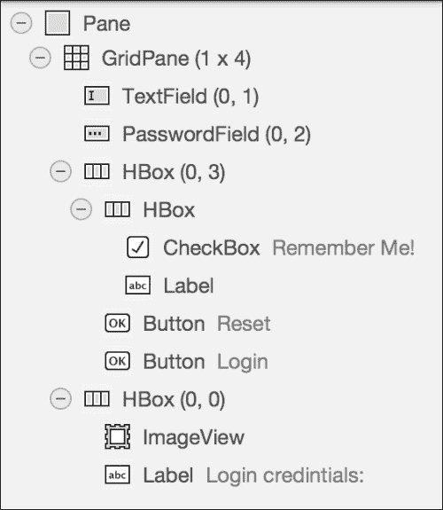
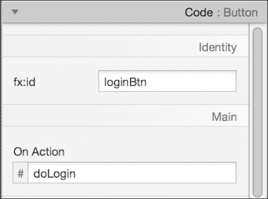
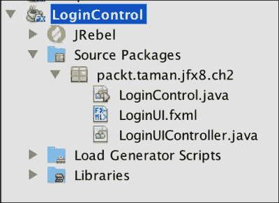
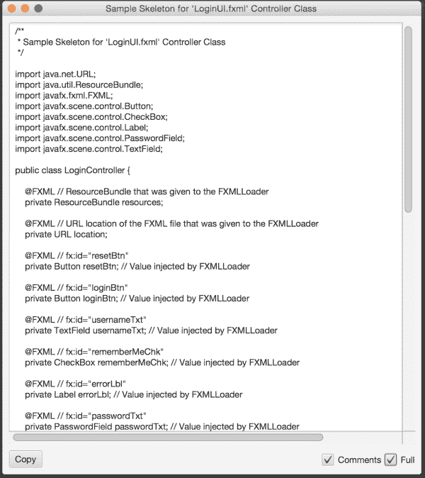
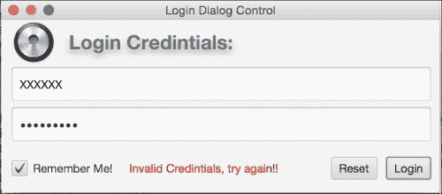
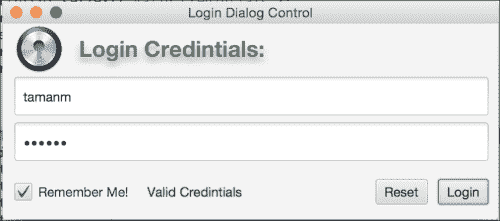

# 开发自定义 UI

在本章的最后一节，我们将基于 JavaFX 8 的内置控件开发一个自定义 UI 组件。

我们将使用之前讨论过的基于 FXML 的概念来开发这个自定义 UI；其主要优势是关注点分离，以便以后自定义组件时无需更改其功能或与之绑定的任何其他逻辑。

## 登录对话框自定义 UI

我们将使用前面介绍的大部分工具和技术来开发我们的自定义 UI：登录对话框，这是每个企业应用程序中必不可少的组件。我们的 UI 组件将如下图所示：



登录自定义 UI 组件

### 登录对话框自定义 UI 的结构

基于 FXML 标记的自定义组件开发中最常见的结构和阶段如下：

*   在 Scene Builder 工具中开发 UI；然后将结果导出为基于 FXML 的文件
*   从 Scene Builder 中提取控制器骨架
*   创建一个控制器，将 UI（视图）绑定到其逻辑，并扩展一个控件或布局
*   在控制器构造函数中加载 FXML 文件
*   创建一个初始化方法，确保所有 FXML 控件都已成功初始化和加载
*   公开公共属性以获取和设置控件数据，以及需要实现逻辑的操作方法
*   开发一个单独的 CSS 文件
*   在你的应用程序中使用自定义组件


### 编写登录对话框自定义 UI

让我们来编写并开发自定义 UI——登录对话框：

1.  打开 Scene Builder 工具并创建 UI。其属性如下图所示：
2.  登录对话框的布局层级结构如下所示：



它由一个 Pane 布局作为顶层和根布局节点。然后，使用 `GridPane(1,4)` 将控件排列成一行四列的网格，具体如下：

*   **第一**行在位置 (`0,0`) 处包含 `HBox` 布局控件，用于水平排列控件。它由显示徽标的 `ImageView` 控件和显示标题的 Label 组成。
    *   **第二**行在位置 (`0,1`) 处放置用于输入用户名的 `TextField` 控件。
    *   **第三**行在位置 (`0,2`) 处放置用于输入密码的 `PasswordField` 控件。
    *   **最后**一行位于位置 (`0,3`)，包含一个根布局控件 `HBox`，该控件内部又包含另一个 HBox，其中放置了 `CheckBox` 和 `Label`（用于显示错误及其他消息）控件，并居左对齐。然后我们有两个按钮控件，**Reset** 和 **Login**，它们居右对齐。
    *   在“代码”选项卡中，为对话框中的所有控件添加合适的 **fx:id** 名称，并为按钮和复选框事件的 `onAction` 添加名称，如下截图所示：

登录按钮属性

3.  从 Scene Builder 的 **Preview** 菜单中选择 **Show preview in windows**。你的布局将会弹出。如果一切正常且你对最终设计满意，从菜单栏点击 **File**，然后 **Save**，并将文件名输入为 `LoginUI.fxml`。恭喜！你已经创建了第一个 JavaFX UI 布局。
4.  现在我们将打开 NetBeans 来设置一个 JavaFX FXML 项目，因此启动 NetBeans，并从 **File** 菜单中选择 **New Project**。
5.  在 **JavaFX** 类别中，选择 **JavaFX FXML Application**。点击 **Next**。然后将项目命名为 **LoginControl**，将 **FXML name** 改为 `LoginUI`，并点击 **Finish**。

### 提示

确保 JavaFX 平台为 Java SE 8。

6.  NetBeans 将创建一个如下所示的项目结构：

Login Control NetBeans 项目结构。

### 注意

在运行项目之前，务必*清理并构建*项目，以避免可能遇到的问题，尤其是在运行应用程序时，运行时加载 `*.fxml` 文件可能返回 `null`。

7.  转到 Scene Builder 工具，从 **View** 中选择 **Show sample controller skeleton**。将打开如下截图所示的窗口，我们将复制其内容，替换 `LoginUIController.java`（该类扩展了 `Pane` 类，将 NetBeans 中复制的内容替换原有代码），然后修复缺失的导入。
8.  用 NetBeans 已创建的 `LoginUI.fxml` 文件替换之前从 Scene Builder 生成并保存的文件。
9.  右键点击 `LoginController.java` 文件，选择 **Refactor**，然后 **Rename**，将其重命名为 `Main.java`。
10. 最后，在 `Main.java` 类的 `start(Stage stage)` 方法中添加如下代码。我们正在创建一个登录组件的新实例，作为场景的根节点，并将其添加到舞台中：

```
    LoginUIController loginPane = new LoginUIController();

stage.setScene(new Scene(loginPane));
    stage.setTitle("Login Dialog Control");
    stage.setWidth(500);
    stage.setHeight(220);
    stage.show();
    ```


11. 在 `LoginUIController.java` 类中，右键点击类名下方，选择 **Insert Code**；然后选择 **Constructor**，最后在构造函数中添加以下代码：

```
    public LoginUIController() throws IOException {
      FXMLLoader fxmlLoader = new FXMLLoader(getClass().getResource("LoginUI.fxml"));
      fxmlLoader.setRoot(this);
      fxmlLoader.setController(this);
      fxmlLoader.load();
    }
    ```

此代码加载我们的 `LoginUI.fxml` 文档，并将其作为包含层级结构的 Pane 布局返回。然后，它将其绑定到当前控制器实例，同时作为控制器和根节点。请注意，控制器扩展了 Pane，这与 `LoginUI.fxml` 中的根元素定义一致。

12. 在 NetBeans 中，选择 **Clean and Build**，然后右键点击项目并选择 **Run**。之前看到的相同屏幕应该会出现。
13. 程序运行时，输入任意凭据并点击 **Login** 按钮；将出现一条红色错误消息，如下截图所示：

Login Control 无效登录。

14. 如果输入了正确的凭据（用户名：*tamanm*，密码：*Tamanm*），则会显示绿色消息“*Valid Credentials*”，如下图所示。
15. 如果点击 **Reset** 按钮，则所有控件将恢复为默认值。

恭喜！您已成功创建并实现了一个自定义 UI 控件。



