# 开发笔记应用

仅为一个平台构建应用程序已经不够了。成功的产品需要支持桌面、Web、移动和嵌入式环境，但学习不同环境很困难。这时 JavaFX 的强大之处就体现出来了——只需简单调整，就能编写出在不同平台上运行的应用程序，正如本章将要展示的那样。

在这里，我们将同时为桌面和 Web 构建一个*笔记*应用。在这个项目中，我将向你展示如何使用 JavaFX 8 SDK 和 Java 编程语言，利用之前安装的开发工具（参考第 1 章，*开始使用 JavaFX 8*），从零开始创建一个完整的 JavaFX 应用程序。

然后，我将展示如何创建应用程序的两个屏幕布局，并创建控制它们的 Java 类。我将创建按钮来控制不同场景之间的导航、保存数据，并通过属性绑定的强大功能动态更新 UI 控件。

最终项目将如下图所示：

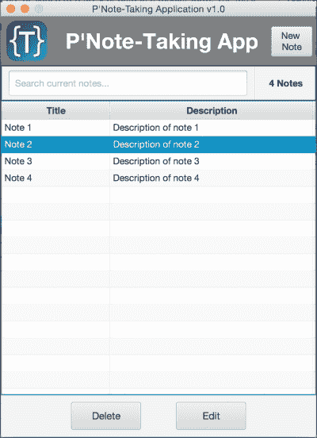

笔记应用

此图显示了从主屏幕的“新建笔记”按钮打开的添加和编辑屏幕，用于添加新笔记，或通过“编辑”按钮编辑列出的笔记之一，如下所示：

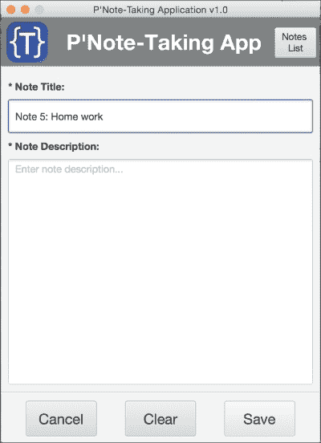

那么，你还在等什么？让我们开始吧！

## 构建 UI 原型

构建任何成功的**复杂 UI**（即使是简单的 UI）应用的第一步，都是对布局、屏幕关系、状态和导航进行原型设计。先在纸上画出草图，然后从团队和经理那里获取反馈。修改后，一旦获得批准，就开始为客户构建一个真正的交互式原型，以便获取他们对最终产品的反馈。

这就是我们现在要做的。我们的应用已经在纸上或任何易于使用的 UI 草图工具中布局好了，如下图所示。然后，我们将使用 Scene Builder 工具将其开发为完整的原型。

此外，我们还将看到 NetBeans 与 Scene Builder 工具之间的互操作性。

### 注意

请注意，先在纸上画出布局草图更容易，因为这是一种非常快速的方法，可以在使用工具开发之前编辑、改进并确定最终的应用布局。

现在，我们已经画好了草图，准备构建应用的真实原型。

充分利用这些工具的最佳方式是在 NetBeans IDE 中创建应用骨架（*控制器类和 FXML 基础页面定义*），然后在 Scene Builder 工具中创建和开发 FXML 页面。这就是两个工具之间强大的互操作性。

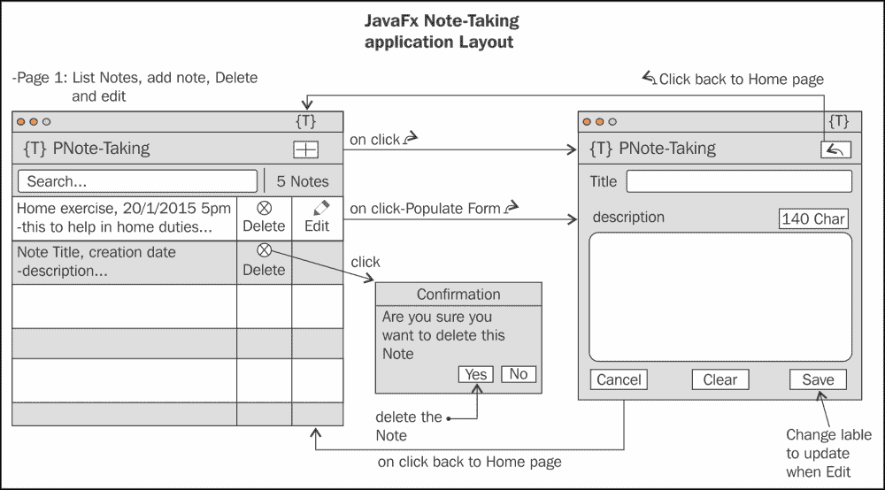

以下是开始使用 JavaFX FXML 应用的步骤：

1.  打开 NetBeans IDE，从主菜单中选择**文件**，然后选择**新建项目**，将打开**新建项目**对话框。从**类别**中选择**JavaFX**，然后在**项目**下选择**JavaFX FXML 应用程序**。然后点击**下一步**按钮：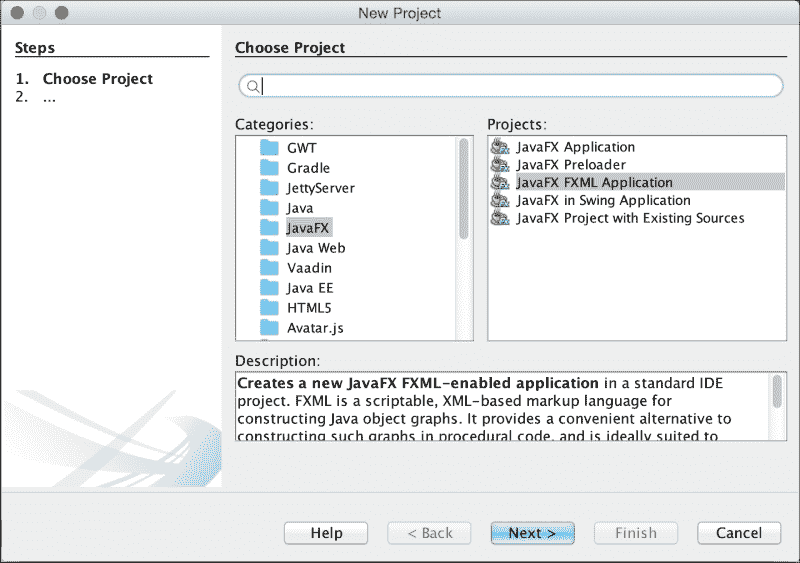

一个新的 JavaFX FXML 应用程序

2.  在**JavaFX FXML 应用程序**对话框中，添加相关信息。在**项目名称**中，添加位置和**FXML 名称**（在我的例子中是`ListNotesUI`）。在**创建应用程序类**中，我添加了`packt.taman.jfx8.ch3.NoteTakingApp`，如下图所示。点击**完成**。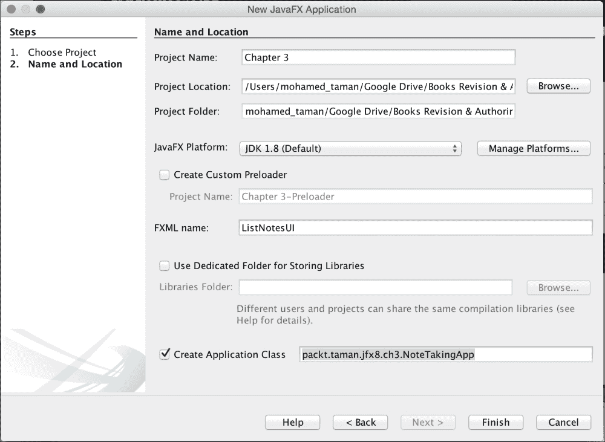
3.  现在我们有了一个包含第一个 FXML UI 文档（`ListNotesUI.fxml`）的项目，我们需要添加第二个 FXML UI 文档（`AddEditUI.fxml`）及其控制器。
4.  为此，从文件菜单中选择**新建文件**；然后在**类别**列表中选择**JavaFX**，从**文件类型**列表中选择**空 FXML**，最后点击**下一步**，如下图所示。
5.  在**新建空 FXML 和位置**对话框中，将**FXML 名称**字段编辑为`AddEditUI`，然后点击**下一步**。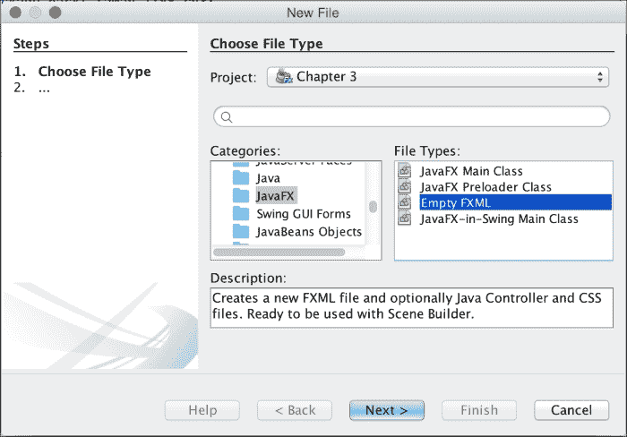

添加新的空 FXML 文档

6.  在如下屏幕所示的**控制器类**对话框中，勾选**使用 Java 控制器**复选框。确保已选择**创建新控制器**，并将**控制器名称**设为`AddEditUIController`。然后点击**下一步**，跳过**层叠样式表**对话框，最后点击**完成**：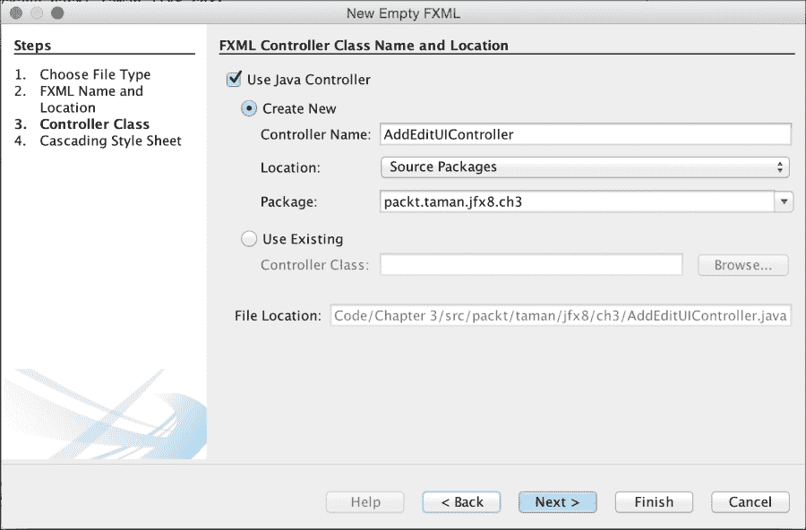

为 FXML 文档添加新控制器

构建好项目结构后，是时候使用 Scene Builder 将控件添加到页面 UI 中了，就像我们在纸上画的那样。操作很简单：

1.  在 NetBeans 中，右键点击`ListNotesUI.fxml`并选择**打开**，或者直接双击它。**Scene Builder**将以设计模式打开你的 FXML 文档。

### 注意

注意：仅当你的机器上安装了 Scene Builder 时才有效。

2.  按照以下截图设计页面。最重要的是，在返回 NetBeans 或关闭**Scene Builder**进行逻辑实现之前，别忘了保存更改。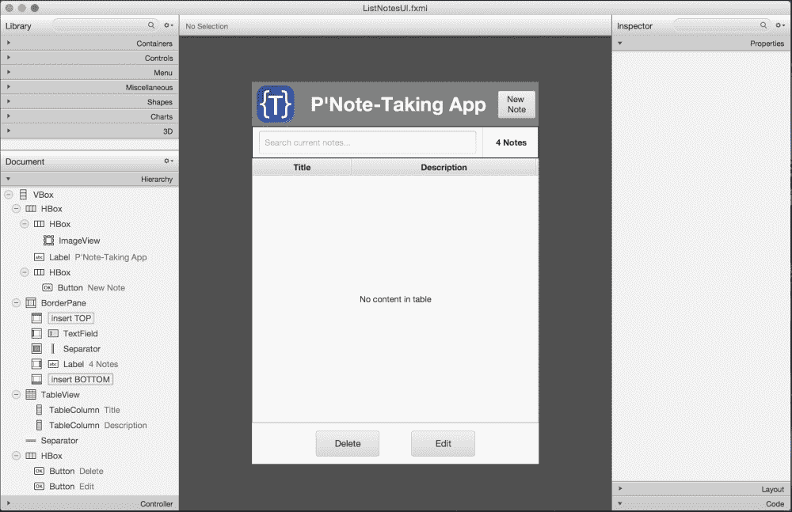

完整的 ListNotesUI.fxml 文档设计

3.  对`AddEditUI.fxml`执行相同步骤，你的设计应如下所示：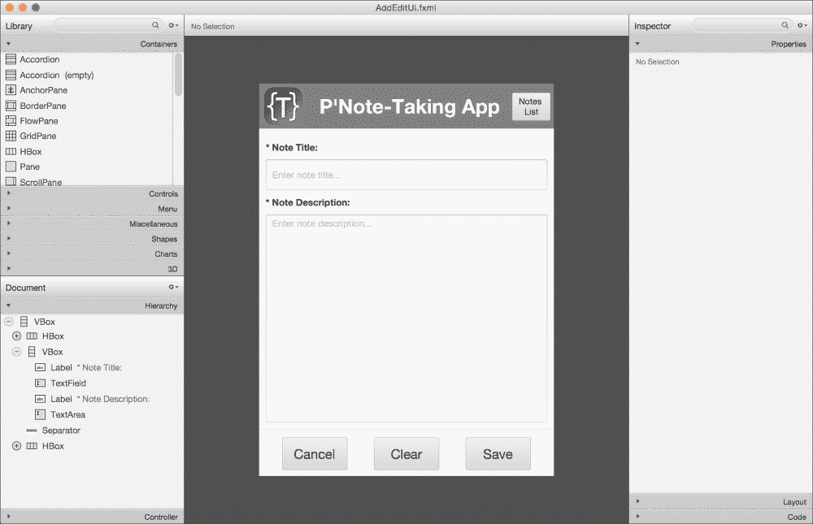

完整的 AddEditUI.fxml 文档设计

你需要检查 FXML 文档，看看我们是如何嵌套许多容器和 UI 控件来实现之前草图的 UI 的，此外还使用了它们的属性来控制间距、对齐、字体和颜色。

恭喜！你已经将草图布局转化为生动的原型，可以作为无逻辑的项目展示给团队领导和经理，获取他们对颜色、主题和最终布局的反馈。而且，一旦获得批准，你就可以在深入业务逻辑之前，继续获取最终客户的反馈。


## 为应用程序注入活力——添加交互功能

设计好应用程序后，你需要通过使其更具交互性，并能对客户提出的功能需求做出响应，来让它真正“活”起来。

我做的第一件事总是添加页面间的导航处理器，并且我已经在每个 FXML 文档的控制器类中完成了这项工作。

为了消除冗余并实现模块化，我在 `BaseController.java` 类中创建了一个基础的导航方法，系统中所有的控制器都将继承这个类。这个类对于添加任何通用功能和共享属性都非常有用。

以下 `navigate(Event event, URL fxmlDocName)` 方法是我们所有系统导航中最重要的代码片段之一（注释说明了其工作机制）：

```
protected void navigate(Event event, URL fxmlDocName) throws IOException {
  //加载新的 fxml UI 文档
  Parent pageParent = FXMLLoader.load(fxmlDocName);
  //创建新场景
  Scene scene = new Scene(pageParent);
  //获取当前舞台
  Stage appStage = (Stage)((Node) event.getSource()).getScene().getWindow();
  //隐藏旧舞台
  appStage.hide(); // 可选
  //为舞台设置新场景
  appStage.setScene(scene);
  //显示舞台
  appStage.show();
}
```

此方法将分别从 `ListNotesUI.fxml` 页面（位于 `ListNotesUIController.java`）中的**新建笔记**和编辑按钮，以及 `AddEditUI.fxml` 页面（位于 `AddEditUIController.java`）中的**笔记列表**、保存和**取消**按钮的动作处理器中调用，具体如下所示。

请注意 FXML 文档中定义的按钮与控制器之间的关系。`@FXML` 注解在此发挥作用，它将 FXML 属性（*使用 #*）与控制器中定义的动作绑定在一起：

`ListNotesUI.fxml` 文件中的**新建笔记**按钮定义如下：

```
<Button alignment="TOP_CENTER"
        contentDisplay="TEXT_ONLY"
        mnemonicParsing="false"
        onAction="#newNote" 
        text="新建笔记" 
        textAlignment="CENTER" 
        wrapText="true" 
/>
```

**新建笔记**动作在 `ListNotesUIController.java` 中定义，并通过 `onAction="#newNote"` 与上述按钮绑定：

```
@FXML
 private void newNote(ActionEvent event) throws IOException {
        editNote = null;
        navigate(event, ADD.getPage());
 }
```

`AddEditUI.fxml` 文件中的**返回**按钮定义如下：

```
<Button alignment="TOP_CENTER"    
        contentDisplay="TEXT_ONLY"
        mnemonicParsing="false"
        onAction="#back" 
        text="笔记列表" 
        textAlignment="CENTER"
        wrapText="true"
/>
```

**返回**动作在 `AddEditUIController.java` 中定义，并通过 `onAction="#back"` 与上述按钮绑定：

```
@FXML
private void back(ActionEvent event) throws IOException {
        navigate(event, FXMLPage.LIST.getPage());
}
```

你可能想知道 `FXMLPage.java` 类是做什么的。它是一个枚举（关于枚举的更多信息，请访问 [`docs.oracle.com/javase/tutorial/java/javaOO/enum.html`](https://docs.oracle.com/javase/tutorial/java/javaOO/enum.html)）。我创建了枚举来定义我们所有的 FXML 文档名称及其位置，以及与这些 FXML 文档相关的任何实用方法，这有助于简化我们系统中的编码工作。

### 提示

这种可维护性的概念有助于在大型系统中将恒定的属性和功能集中在一个地方，以便将来轻松重构，并允许我们在一个地方更改名称，而无需在整个系统中四处寻找并修改同一个名称。

如果你检查系统控制器，你会发现处理其他按钮动作（删除、编辑、清除和保存笔记）的所有逻辑。


### 使用属性实现电源应用变更同步

属性是基于 JavaFX 的对象属性（如 String 或 Integer）的包装器对象。属性允许你添加监听器代码，以便在对象包装值发生更改或被标记为无效时做出响应。此外，属性对象可以相互绑定。

绑定行为允许属性根据另一个属性的更改值来更新或同步其值。

属性是包装器对象，能够使值以可读写或只读的方式访问。

简而言之，JavaFX 的属性是持有实际值的包装器对象，同时提供变更支持、失效支持和绑定功能。我稍后会讨论绑定，但现在，让我们先看看常用的属性类。

所有包装器属性类都位于 `javafx.beans.property.* package` 命名空间中。下面列出的是常用的属性类。要查看所有属性类，请参阅 Javadoc 中的文档（[`docs.oracle.com/javase/8/javafx/api/index.html?javafx/beans/property.html`](https://docs.oracle.com/javase/8/javafx/api/index.html?javafx/beans/property.html)）。

*   `javafx.beans.property.SimpleBooleanProperty`
*   `javafx.beans.property.ReadOnlyBooleanWrapper`
*   `javafx.beans.property.SimpleIntegerProperty`
*   `javafx.beans.property.ReadOnlyIntegerWrapper`
*   `javafx.beans.property.SimpleDoubleProperty`
*   `javafx.beans.property.ReadOnlyDoubleWrapper`
*   `javafx.beans.property.SimpleStringProperty`
*   `javafx.beans.property.ReadOnlyStringWrapper`

前缀为 `Simple`、后缀为 `Property` 的属性是*可读写属性*类，而前缀为 `ReadOnly`、后缀为 `Wrapper` 的类是只读属性。稍后，你将看到如何使用这些常用属性创建 JavaFX bean。

让我们快进到 JavaFX 的 Properties API，看看它如何处理常见问题。你可能已经注意到，主页面中添加了 `TableView` 控件，用于列出当前加载的笔记以及任何新添加的笔记。

为了用数据正确填充 `TableView`，我们应该有一个数据模型来表示笔记数据，这也是我第一次在 JavaFX JavaBean 风格的 Note 类中使用 Properties API 的地方，该类定义如下：

```
public class Note {
    private final SimpleStringProperty title;
    private final SimpleStringProperty description;
    public Note(String title, String description) {
        this.title = new SimpleStringProperty(title);
        this.description = new SimpleStringProperty(description);
    }
    public String getTitle() {
        return title.get();
    }
    public void setTitle(String title) {
        this.title.set(title);
    }
    public String getDescription() {
        return description.get();
    }
    public void setDescription(String description) {
        this.description.set(description);
    }
}
```

为了用已存储在应用程序数据库中的数据填充 `TableView` 类，例如（我们这里的数据库是瞬态的，使用笔记对象 data 的 `ObservableList<Note>`），我们必须传递一个此数据的集合。

我们需要摆脱每次笔记数据集合更新时手动更新 UI 控件（在我们的例子中是 `TableView` 控件）的负担。因此，我们需要一个解决方案，能够自动同步表格视图和笔记数据集合模型之间的变更，例如添加、更新或删除数据，而无需从代码中对 UI 控件进行任何进一步修改。只有数据模型集合得到更新——UI 应该自动同步。

此功能已经是 JavaFX 集合的一个组成部分。我们将使用 JavaFX 的 `ObservableList` 类。`ObservableList` 类是一个集合，能够在对象被添加、更新或删除时通知 UI 控件。

JavaFX 的 `ObservableList` 类通常用于列表 UI 控件，例如 `ListView` 和 `TableView`。让我们看看我们将如何使用 `ObservableList` 集合类。

在 `BaseController` 中，我创建了静态数据作为 `ObservableList<Note>`，以便在所有控制器之间共享，从而能够从中添加、更新和删除笔记。此外，它还用一些数据进行了初始化，如下所示：

```
protected static ObservableList<Note> data = FXCollections.<Note>observableArrayList(
  new Note("笔记 1", "笔记 41 的描述"),
    new Note("笔记 2", "笔记 32 的描述"),
    new Note("笔记 3", "笔记 23 的描述"),
    new Note("笔记 4", "笔记 14 的描述"));
```

在 `ListNotesUIController.java` 类的 `initialize()` 方法中，我创建了一个 `javafx.collections.transformation.FilteredList` 类的实例，该实例将用作我们在表格内容中搜索时的过滤类。它将传递类型为 `ObservableList<Note>` 的 `data` 对象作为源数据：

```
FilteredList<Note> filteredData = new FilteredList<>(data, n -> true);
```

`FilteredList` 的第二个参数是用于过滤数据的谓词；这里它返回 `true`，表示不过滤，我们稍后会添加过滤谓词。

创建的类型为 `ObservableList<Note>` 的数据列表应传递给我们的 `TableView` 数据，以便表格视图监视当前数据集合的操作，例如添加、删除、编辑和过滤，如下面的 `ListNotesUIController.java` 类的 `initialize()` 方法所示，但我们传递的是 `filteredData` 包装器实例：

```
notesListTable.setItems(filteredData);
```

最后一步是告知我们的 `notesListTable` 列（类型为 `TableColumn`）以及要渲染和处理的 Note 类的哪个属性。我们使用 `setCellValueFactory()` 方法来实现这一点，如下所示：

```
titleTc.setCellValueFactory(new PropertyValueFactory<>("title"));
descriptionTc.setCellValueFactory(new PropertyValueFactory<>("description"));
```

请注意，`title` 和 `description` 是 `Note` 类的实例变量名。

查看最终项目代码以获取完整实现。然后，从 NetBeans 主菜单运行应用程序，选择“运行”，然后单击**运行主项目**。

尝试添加一条新笔记，并在表格视图中查看你新添加的笔记。尝试选择并删除笔记，或更新现有笔记。你将立即看到更改。

通过检查应用程序代码，你将看到我们所做的只是操作数据列表，而所有其他同步工作都是借助 `ObservableList` 类完成的。


#### 过滤 TableView 数据列表

在此，我们将接触到 Java SE 8 和 JavaFX 8 两个最强大的特性：`Predicate` 和 `FilteredList`。让我们说明当前面临的问题，以及如何利用 `stream` 特性来解决它。

在我们的 `ListNotesUI.fxml` 页面中，你可能会注意到笔记表格上方的文本字段；其作用是过滤当前表格数据，缩小结果范围以找到特定笔记。同时，我们需要维护当前列表，注意不要从中移除任何数据，也不要为每次搜索命中而查询数据库。

我们已经有了笔记数据列表，接下来将使用文本字段来过滤该列表，查找任何笔记标题或描述中包含该字符或字符组合的内容，如下图所示：

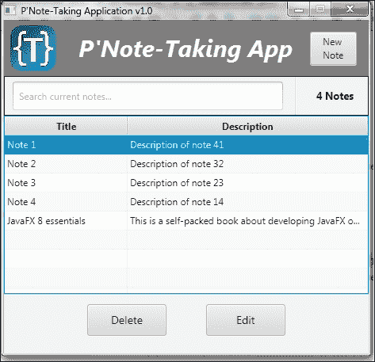

填充了数据的表格

现在，输入 `d`、`de`、`dev` 或 `developing`、`JavaFX` 后，表格将被过滤，如下截图所示。此外，尝试删除所有文本，你会发现数据会再次恢复。接下来，我们将揭示如何实现这一效果。

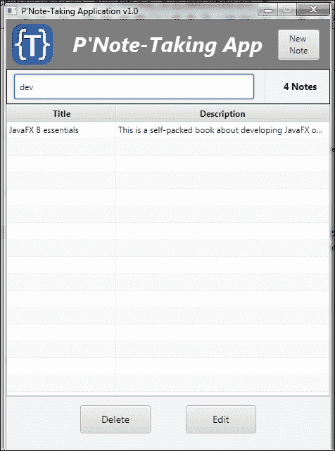

通过搜索字段中的文本过滤后的表格数据

以下是实现这一功能的神奇代码片段：

```
searchNotes.setOnKeyReleased(e ->
{
  filteredData.setPredicate(n ->
  {              
if (searchNotes.getText() == null || searchNotes.getText().isEmpty())
return true;

return n.getTitle().contains(searchNotes.getText())
|| n.getDescription().contains(searchNotes.getText());
  });
});
```

`searchNotes` 是我们用于过滤笔记数据的文本字段的引用。我们为其注册了一个 `setOnKeyReleased(EventHandler<? super KeyEvent> value)` 方法，一旦输入任何字符，该方法就会获取我们的文本进行过滤。同时，请注意我们在此处使用了 Lambda 表达式，使代码更加简洁清晰。

在动作方法的定义内部，`filteredData` 是一个 `FilteredList<Note>` 类，我们将一个谓词 `test()` 方法的实现传递给了 `setPredicate(Predicate<? super E> predicate)`，以仅过滤与 `searchNotes` 文本输入匹配的笔记标题或描述。

过滤后的数据会自动更新到表格 UI 中。

有关 Predicate API 的更多信息，请访问 [`docs.oracle.com/javase/8/docs/api/java/util/function/Predicate.html`](http://docs.oracle.com/javase/8/docs/api/java/util/function/Predicate.html)。

## 作为桌面应用的笔记应用

完成应用程序后，更专业的做法不是分发最终的 jar 文件，而是要求用户安装 JRE 环境才能运行你的应用程序，尤其是当你面向大量用户时。

更专业的做法是准备本机安装程序包，如 `.exe`、`.msi`、`.dmg` 或 `.img` 格式。

每个安装程序都会管理应用程序所需的资源和运行时环境。这也能确保你的应用程序在多个平台上运行。

### 为桌面分发部署应用程序

NetBeans 的高级特性之一是允许你通过其部署处理程序为不同平台打包应用程序，这提供了以下主要功能：

*   通过本机安装程序部署应用程序
*   管理应用程序资源，如应用程序图标、启动画面和本机安装程序图标
*   在准备最终包时接受应用程序最终签名的证书
*   管理所需的 JavaFX 运行时版本
*   在 Windows 上添加开始菜单的桌面快捷方式
*   处理 Java Web Start 技术的需求和自定义设置

让我们看看 NetBeans 部署的配置：

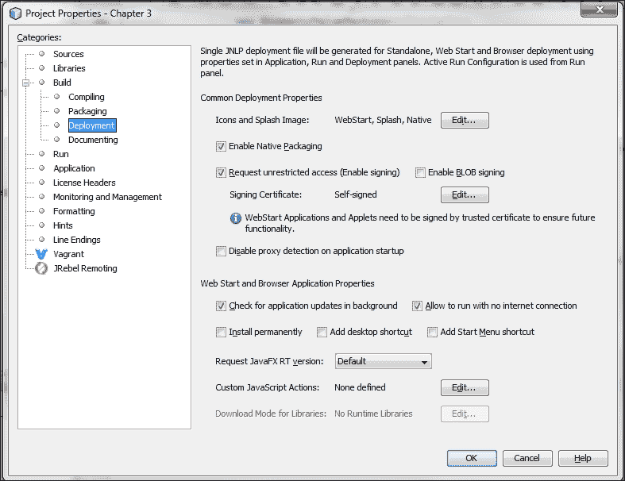

NetBeans 部署配置

要了解如何将应用程序打包成针对每个目标平台的本机安装程序，请访问以下 URL，其中提供了完成该任务所需的所有步骤和软件：

[`netbeans.org/kb/docs/java/native_pkg.html`](https://netbeans.org/kb/docs/java/native_pkg.html)

