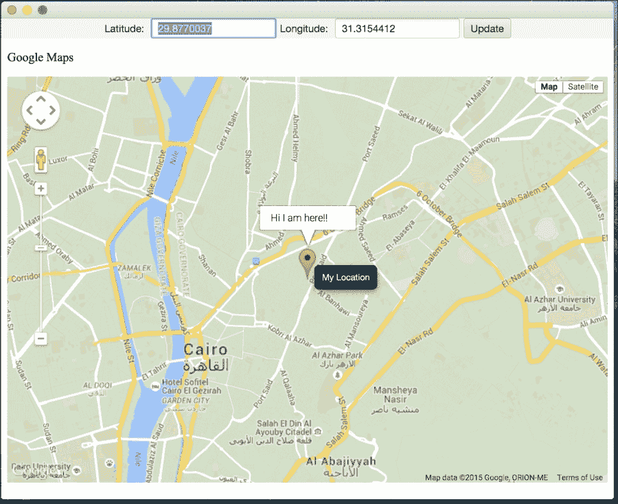
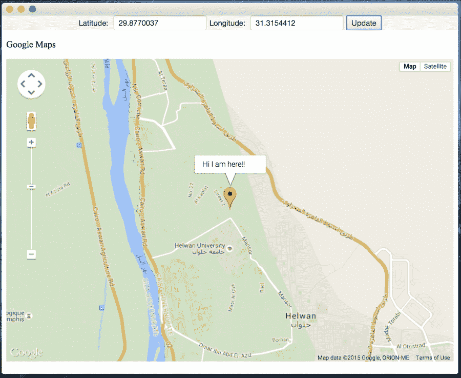
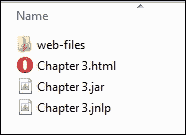

# Web 上的 JavaFX

在本节中，我们将了解 Web 上的 JavaFX，以及如何将我们的笔记应用部署到 Web 上。

## WebEngine

JavaFX 提供了一个能够加载 HTML5 内容的非 GUI 组件，称为 **WebEngine** API（`javafx.scene.web.WebEngine`）。该 API 本质上是 `WebEngine` 类的一个对象实例，用于加载包含 HTML5 内容的文件。HTML5 文件可以从本地文件系统、Web 服务器或 JAR 文件内部加载。

当使用 Web 引擎对象加载文件时，会使用后台线程来加载文件内容，以避免阻塞 *JavaFX 应用程序线程*。

以下是两个用于加载 HTML5 内容的 `WebEngine` 方法：

*   load(String URL)
*   loadContent(String HTML)

## WebView

JavaFX 提供了一个 GUI `WebView`（`javafx.scene.web.WebView`）节点，可以将 HTML5 内容渲染到场景图上。`WebView` 节点本质上是一个迷你浏览器，能够响应 Web 事件，并允许开发者与 HTML5 内容进行交互。

由于加载 Web 内容与显示 Web 内容之间的紧密关系，`WebView` 节点对象也包含一个 `WebEngine` 实例。

JavaFX 8 的 `WebView` 类实现支持以下 HTML5 特性：

*   Canvas 和 SVG
*   媒体播放
*   表单控件
*   历史记录维护
*   交互式元素标签
*   DOM
*   Web Workers
*   Web Sockets
*   Web 字体


### WebView 与引擎实战

接下来，我们将通过一个简单示例，演示如何使用 `WebView` 加载包含谷歌地图的 HTML5 网页文档，并将其作为 JavaFX 场景控件进行集成。随后，我们利用 `WebEngine` 从 JavaFX 的 `TextField` 控件中获取经纬度，执行一个 JavaScript 方法，将地图定位到新传入的位置并显示标记，如下图所示：



JavaFX 8 应用中的谷歌地图查看器

为清晰起见，我将仅展示并解释代码中体现前述概念的关键部分。本章的完整代码请查看 `web` 包中的 `GoogleMapViewerFX.java` 类和 `map.html` 文件。

要在 JavaFX 应用中显示谷歌地图，首先需要创建一个 HTML 文件来加载并集成 Maps API，该文件定义在 `map.html` 中。如上图所示，地图中心定位在埃及开罗（我的城市），这是在创建地图时作为经纬度值传入的，如以下代码片段所示：

```
var latlng = new google.maps.LatLng(30.0594885, 31.2584644);
var Options = {
    zoom: 13,
    center: latlng,
    mapTypeId: google.maps.MapTypeId.ROADMAP
};
var map = new google.maps.Map(document.getElementById("canvas"), Options);
```

接下来，请注意 JavaScript 方法 `goToLocation(lng, lat)`；该方法将通过 `webEngine` 实例从 JavaFX 应用中被调用，以便根据 JavaFX 控件传入的经纬度来定位地图。

在 `GoogleMapViewerFX.java` 中，我们创建了四个控件来组成用户界面——两个用于输入经纬度的 `TextField` 类、一个更新按钮，以及一个用于显示 `map.html` 文档的 `WebView` 对象：

```
WebView webView = new WebView();
WebEngine webEngine = webView.getEngine();
final TextField latitude = new TextField("" + 29.8770037);
final TextField longitude = new TextField("" + 31.3154412);
Button update = new Button("Update");
```

请注意，我创建的文本控件中初始经纬度与原始地图位置不同。这个位置是我的家庭住址，你可以将其改为你自己的位置，然后点击更新按钮查看新位置。

要加载 `map.html` 文件，我们需要将其传递给从已创建的 `WebView` 类中实例化的 `WebEngine` 类，如上文代码片段所示。

实现按钮的 `onAction()` 方法，通过 `webEngine` 的 `executeScript()` 方法实现 JavaFX 控件与 JavaScript 之间的集成，代码如下：

```
update.setOnAction(evt -> {
   double lat = Double.parseDouble(latitude.getText());
   double lon = Double.parseDouble(longitude.getText());

   webEngine.executeScript("" +
             "window.lat = " + lat + ";" +
             "window.lon = " + lon + ";" +
             "document.goToLocation(window.lat, window.lon);");
});
```

运行应用，你应该会看到上图定位到开罗市！点击更新按钮，你应该会看到我的家，如下图所示。

尝试获取你所在位置的经纬度，然后也定位到你的家吧！

很强大，不是吗？集成 HTML5 内容并与已有的 Web 应用交互，从而为现有的 JavaFX 应用添加更丰富的网络内容，这非常容易。



在 JavaFX 8 应用中更改谷歌地图位置

## 作为 Web 应用的笔记功能

一旦你的应用经过测试（如前所述），你就可以将其分发到多个平台和环境。我们已经通过本章介绍的方法，使用项目 `dist` 文件夹下的 `.jar` 文件，为桌面平台生成了原生安装程序。

同样的 `.jar` 文件也可用于 Web 部署，并且可以通过多种方式将应用部署为 Web 应用，我们将在下文介绍。

### 在 Web 上运行应用

在 Web 上运行 JavaFX 应用有三种方式：

1.  使用 **Java Web Start** 一次性下载并启动应用；之后，你可以从本地机器离线使用它。
2.  将你的 JAR 文件嵌入 HTML 文件中，以便在企业环境中运行。
3.  如前所述，从 `WebEngine` 类加载 HTML 内容，并通过 `WebView` 类进行显示。

#### Java Web Start

Java Web Start 软件提供了单击启动全功能应用的能力。用户可以下载并启动诸如完整电子表格程序或互联网聊天客户端等应用，而无需经历冗长的安装过程。

使用 Java Web Start，用户只需点击网页上的链接即可启动 Java 应用。该链接指向一个 **JNLP**（**Java 网络启动协议**）文件，该文件指示 Java Web Start 下载、缓存并运行该应用。

Java Web Start 为 Java 开发者和用户提供了许多部署优势：

*   使用 Java Web Start，你可以将单个 Java 应用放置在 Web 服务器上，以部署到包括 Windows、Linux 和 Solaris 在内的多种平台。
*   它支持 Java 平台的多个并发版本。应用可以请求特定版本的 Java 运行时环境（JRE）软件，而不会与其他应用的需求冲突。
*   用户可以在浏览器外创建桌面快捷方式，以启动 Java Web Start 应用。
*   Java Web Start 利用了 Java 平台固有的安全性。默认情况下，应用对本地磁盘和网络资源的访问受到限制。
*   使用 Java Web Start 启动的应用会被缓存到本地，以提高性能。
*   当 Java Web Start 应用在用户桌面上独立运行时，其更新会自动下载。

Java Web Start 作为 JRE 软件的一部分安装。用户无需单独安装 Java Web Start 或执行额外任务即可使用 Java Web Start 应用。

有关 **Java Web Start** 的更多信息，请参阅以下链接：

*   Java Web Start 指南 ([`docs.oracle.com/javase/8/docs/technotes/guides/javaws/developersguide/contents.html`](http://docs.oracle.com/javase/8/docs/technotes/guides/javaws/developersguide/contents.html))
*   `javax.jnlp` API 文档 ([`docs.oracle.com/javase/8/docs/jre/api/javaws/jnlp/index.html`](http://docs.oracle.com/javase/8/docs/jre/api/javaws/jnlp/index.html))
*   Java Web Start 开发者网站 ([`www.oracle.com/technetwork/java/javase/javawebstart/index.html`](http://www.oracle.com/technetwork/java/javase/javawebstart/index.html))

### 为 Web 分发部署应用

要将 JavaFX 应用部署到 Web 上，有一种使用 NetBeans 的非常简单的方法。

NetBeans 已经为你的 JavaFX 应用提供了三种部署类型——桌面、Java Web Start 和 Web——如下图所示：




