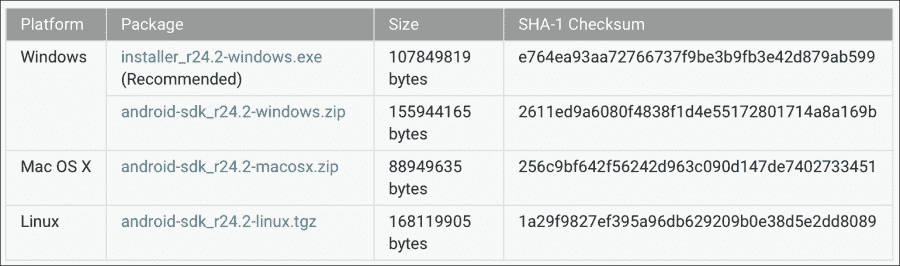
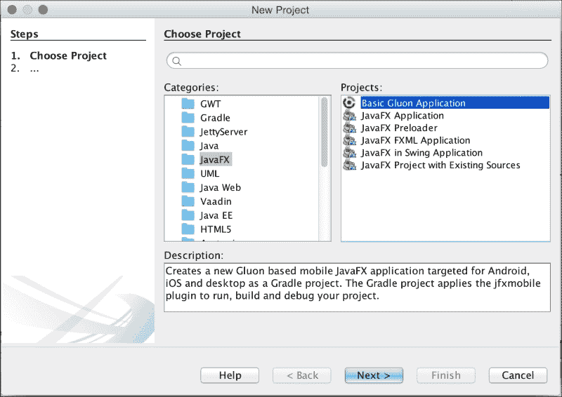
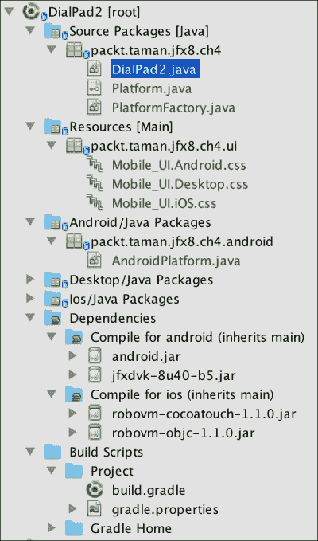
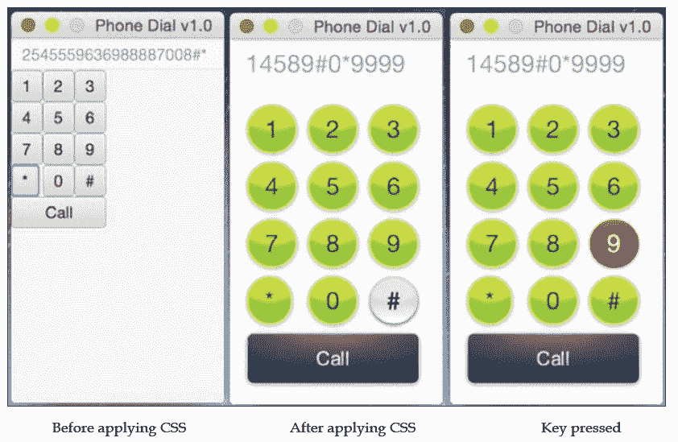
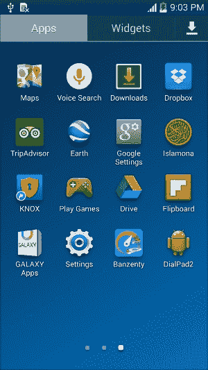
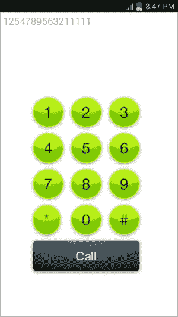

# 开始入门

现在我们已经掌握了足够的信息，了解之前讨论的工具和 SDK 如何帮助我们开始开发 JavaFX 应用程序，并将其移植到 Android 移动设备上。

但在进入开发阶段之前，我们需要正确安装和配置相关工具与软件，以便基于所提供的 SDK 完成整个开发流程，最终生成一个可用的 `.apk` 包。

我们将把这个 `.apk` 包部署到真实设备上，最后对其进行签名，以便最终提交到 Google Play 商店。

那么，让我们开始安装必要的工具和软件，以便着手开发我们的应用程序。

## 准备并安装必备软件

我们需要安装以下工具和软件，以确保构建过程能够顺利完成，不会出现任何问题。

### Java SE 8 JDK8 u45

我们之前已经完成过这一步；请参考第 1 章中的*安装 Java SE 8 JDK* 部分，该章节标题为*开始使用 JavaFX 8*。

### 注意

开发适用于 Android 的 JavaFX 应用程序，至少需要 Java SE 8 update 40 版本。

### Gradle

根据其官网的定义，Gradle 是：

> *Gradle 是一个开源构建自动化系统。Gradle 可以自动化完成软件包或其他类型项目（例如生成的静态网站、生成的文档，或者实际上任何其他内容）的构建、测试、发布、部署等任务。*

最近，Android 开发工具将其构建系统切换到了 Gradle。RoboVM 和 JavaFXPorts 移植项目也采用了相同的工具。

安装 Gradle 是一项非常直接的任务：

1.  访问 [`gradle.org`](https://gradle.org)。
2.  在右侧的 **GET GRADLE!** 部分下，点击 **Downloads 2.4**（截至撰写本文时），将开始下载 `gradle-2.4-all.zip` 文件。
3.  将下载的 `.zip` 文件复制到你选择的方便位置，并解压缩。
4.  最后一步是在你的系统中设置环境变量，如下所示：
    *   在 Windows 上 – 假设 Gradle 安装在 `c:\tools\gradle_2.4`：

        ```
        set GRADLE_HOME=c:\tools\gradle_2.4
        set PATH=%PATH%;%GRADLE_HOME%\bin
        ```

    *   在 Mac 上 – 假设 Gradle 安装在 `/usr/local/tools/gradle_2.4`：

        ```
        export GRADLE_HOME=/usr/local/tools/gradle_2.4
        export PATH=${PATH}:${GRADLE_HOME}/bin
        ```

### Android SDK

Android SDK 包含了 Android 平台完整的开发和调试工具集。

安装 Android SDK 也是一项非常直接的任务：

1.  访问 [`developer.android.com/sdk/index.html#Other`](http://developer.android.com/sdk/index.html#Other)。
2.  在“仅 SDK 工具”下，根据你偏好的平台名称，点击对应的 `android-sdk_r24.2-{platform}`。`{exe|zip|tgz}`（截至撰写本文时）：
3.  将打开一个 `Download` 页面；接受条款，点击 `Download android-sdk_r24.2-{platform}`。`{exe|zip|tgz}` 按钮，下载过程将开始。
4.  将下载的 `.zip` 文件复制到一个方便的位置并解压缩，或者在 Windows 上双击 `.exe` 文件开始安装。
5.  在命令行中运行以下命令：

    ```
    $ android
    ```

    Android SDK Manager 将打开；点击 `Build-tools version 21.1.2` 或更高版本，以及 API 21 或更高版本的 SDK Platform。

    点击 **Install x packages**，接受许可协议，然后点击 **Install**。这样就完成了。

    Android SDK Manager 的一个很好的参考文档位于 [`developer.android.com/sdk/installing/adding-packages.html`](http://developer.android.com/sdk/installing/adding-packages.html)。

6.  最后一步是在你的系统中设置环境变量，如下所示：
    *   在 Windows 上 – 假设 Android SDK 安装在 `c:\tools\android_ADT`：

        ```
        set ANDROID_HOME=c:\tools\android_ADT\sdk
        set PATH=%PATH%;%ANDROID_HOME%\platform-tools;%ANDROID_HOME%\tools
        ```

    *   在 Mac 上 – 假设 Android SDK 安装在 `/usr/local/tools/android_ADT`：

        ```
        export ANDROID_HOME=/usr/local/tools/android_adt/sdk
        export PATH=${PATH}:${ANDROID_HOME}/tools:${ANDROID_HOME}/platform-tools
        ```

    *   最佳做法是在 `C:\Users\<user>\.gradle\gradle.properties` 下创建一个名为 ANDROID_HOME 的 Gradle 属性。

## 为 Android 准备项目

我们已经成功安装了必备的软件和工具，并配置了环境变量，因此我们已经准备好开始开发将要移植到 Android 设备上的应用程序了。

但在开始之前，我们还需要准备好项目结构和构建文件，以便能够使用 JavaFXPorts 库来构建和打包我们的应用程序。

在此之前，搭建一个包含三个不同平台的复杂项目是一项艰巨的任务。但最近，Gluon (http://gluonhq.com/) 发布了一个 NetBeans 插件 ([`gluonhq.com/gluon-plugin-for-netbeans/`](http://gluonhq.com/gluon-plugin-for-netbeans/))，极大地简化了这项任务。

### 项目结构

最简单的方法是使用 Gluon 的 NetBeans 插件。这将为你创建一切：一个 Java 项目，你只需添加 JavaFX 源代码，以及一个包含所有就绪任务的 `build.gradle` 文件。

安装好插件后，执行以下任务：

1.  只需创建一个新的 JavaFX 项目，并选择 **Basic Gluon Application**，如下所示：
2.  为项目（`DialPad2`）、包（`packt.taman.jfx8.ch4`）和主类（`DialPad2`）选择有效的名称，你会在新项目中看到一堆文件夹。
3.  使用 Gluon 插件后的顶层项目结构将更加复杂，应如下图所示：

    Gluon 插件项目结构

接下来，我们将添加构建脚本文件以完成我们的任务。

#### 使用 Gradle

要构建一个 Gradle 项目，我们需要 `build.gradle` 脚本文件。Gluon 插件默认已经为你添加了这个文件，其中包含了允许我们的应用程序成功运行和编译的所有属性。

默认的 Gradle 构建文件 `build.gradle` 内容应如下所示：

```
buildscript {
    repositories {
        jcenter()
    }
    dependencies {
        classpath 'org.javafxports:jfxmobile-plugin:1.0.0-b8'
    }
}

apply plugin: 'org.javafxports.jfxmobile'

repositories {
    jcenter()
}

mainClassName = 'packt.taman.jfx8.ch4.DialPad2'

jfxmobile {

    android {
        manifest = 'lib/android/AndroidManifest.xml'
    }
}
```

唯一需要更改的重要事项是将 `jfxmobile-plugin` 版本更新为 1.0.0-b8（或最新版本；请经常查看 [`bitbucket.org/javafxports/javafxmobile-plugin/overview`](https://bitbucket.org/javafxports/javafxmobile-plugin/overview) 以保持更新）。

## 应用程序

既然你已经读到了这一部分，说明我们已经正确完成了应用程序项目结构的搭建，现在它已准备好用于移动设备开发。

我们的应用程序将是一个新的智能手机拨号盘界面，用于通过设备的默认拨号器进行通话。它将使用 CSS 进行定制，以控制其外观样式，并且可以修改以获得不同平台的原生外观和感觉。

该应用程序的主要目的是提供一个全新的 UI 概念（使用 CSS 定制应用程序），你将学习如何使用 CSS 的 id 和类选择器，以及如何从代码内部设置它们以应用于不同的控件。

以下截图显示了应用 CSS 文件前后的应用程序界面：




### 使用 CSS 开发和设计应用程序 UI

正如我们之前所学，我将开始制作应用程序的原型；原型制作完成后，我们应该能看到之前见过的应用程序 UI。

这个应用程序 UI 是直接写在 `DialPad2.java` 类的 `start(Stage)` 函数中的，这是一种不使用静态 FXML 设计来开发 UI 的替代方法。

在这里，我们从代码内部嵌套控件，以便在需要动态生成 UI 控件并为其分配不同的设置、`CSS` 类、`id` 选择器和`监听器`时使用。

以下代码片段展示了我们如何生成上述应用程序 UI：

```
BorderPane root = new BorderPane();
Rectangle2D bounds = Screen.getPrimary().getVisualBounds();
Scene scene = new Scene(root, bounds.getWidth(), bounds.getHeight());
scene.getStylesheets().add(getClass().getResource("ui/Mobile_UI."+PlatformFactory.getName()+".css").toExternalForm());
TextField output = new TextField("");
output.setDisable(true);

root.setTop(output);
String[] keys = {"1", "2", "3",
                 "4", "5", "6",
                 "7", "8", "9",
                 "*", "0", "#"};

GridPane numPad = new GridPane();
numPad.setAlignment(Pos.CENTER);
numPad.getStyleClass().add("num-pad");
for (int i = 0; i < keys.length; i++) {
       Button button = new Button(keys[i]);
       button.getStyleClass().add("dial-num-btn");
       button.setOnAction(e -> output.setText(output.getText().concat(Button.class.
      cast(e.getSource()).getText())));
      numPad.add(button, i % 3, (int) Math.ceil(i / 3));
}
// 呼叫按钮
Button call = new Button("Call");
call.setOnAction(e->PlatformFactory.getPlatform().callNumber(output.getText()));
call.setId("call-btn");
call.setMaxSize(Double.MAX_VALUE, Double.MAX_VALUE);
numPad.add(call, 0, 4);
GridPane.setColumnSpan(call, 3);
GridPane.setHgrow(call, Priority.ALWAYS);
root.setCenter(numPad);

// 舞台设置
stage.setScene(scene);
stage.setTitle("Phone Dial v2.0");
stage.show();
```

代码首先创建一个以 `BorderPane` 为根节点的场景。创建场景后，代码通过 `getStylesheets().add()` 方法加载 CSS 样式表文件 `Mobile_UI.<platform>.css`，以设置当前场景节点的样式，如下所示：

```
scene.getStylesheets().add(getClass().getResource("ui/Mobile_UI."+PlatformFactory.getName()+".css").toExternalForm());
```

在我们创建了一个 `TextField` 输出来显示拨号结果，并将其设置为禁用状态（这样我们就无法编辑它）之后，只需点击按钮即可添加并显示数字。

接下来，代码简单地使用 `GridPane` 类创建了一个网格，并生成了 12 个按钮放置在每个单元格中。注意在 for 循环中，每个按钮都通过 `getStyleClass().add()` 方法设置了名为 `dial-num-btn` 的样式类。

### 注意

我们在这里使用了一个经典的旧式 `for` 循环来添加按钮，而不是花哨的 Java 8 流。请注意，`Dalvik VM` 仅在 Java 7 上运行，并且只能使用 lambda 表达式（因为 JavaFXPorts 内部使用了 Retrolambda 项目）。

最后，深蓝色的**呼叫**按钮将被添加到网格面板的最后一行。由于**呼叫**按钮是唯一的，其 id 选择器被设置为 `#call-btn`，并且它将使用 id 选择器进行样式设置，这意味着 CSS 文件中命名的选择器将以 `#` 符号为前缀。

以下是用于设置应用程序样式的 CSS 文件：

```
.root {
    -fx-background-color: white;
    -fx-font-size: 20px;
    bright-green: rgb(59,223, 86);
    bluish-gray: rgb(189,218,230);
}
.num-pad {
    -fx-padding: 15px, 15px, 15px, 15px;
    -fx-hgap: 10px;
    -fx-vgap: 8px;
}

#call-btn {
    -fx-background-color: 
        #090a0c,
        linear-gradient(#38424b 0%, #1f2429 20%, #191d22 100%),
        linear-gradient(#20262b, #191d22),
        radial-gradient(center 50% 0%, radius 100%, rgba(114,131,148,0.9), rgba(255,255,255,0));
    -fx-background-radius: 5,4,3,5;
    -fx-background-insets: 0,1,2,0;
    -fx-text-fill: white;
    -fx-effect: dropshadow( three-pass-box , rgba(0,0,0,0.6) , 5, 0.0 , 0 , 1 );
    -fx-font-family: "Arial";
    -fx-text-fill: linear-gradient(white, #d0d0d0);
    -fx-font-size: 16px;
    -fx-padding: 10 20 10 20;
}
#call-btn .text {
    -fx-effect: dropshadow( one-pass-box , rgba(0,0,0,0.9) , 1, 0.0 , 0 , 1 );
}

.dial-num-btn {
    -fx-background-color:
        linear-gradient(#f0ff35, #a9ff00),
        radial-gradient(center 50% -40%, radius 200%, #b8ee36 45%, #80c800 50%);
    -fx-background-radius: 30;
    -fx-background-insets: 0,1,1;
    -fx-effect: dropshadow( three-pass-box , rgba(0,0,0,0.4) , 5, 0.0 , 0 , 1 );
    -fx-text-fill: #395306;
}

.dial-num-btn:hover {
    -fx-background-color: 
        #c3c4c4,
        linear-gradient(#d6d6d6 50%, white 100%),
        radial-gradient(center 50% -40%, radius 200%, #e6e6e6 45%, rgba(230,230,230,0) 50%);
    -fx-background-radius: 30;
    -fx-background-insets: 0,1,1;
    -fx-text-fill: black;
    -fx-effect: dropshadow( three-pass-box , rgba(0,0,0,0.6) , 3, 0.0 , 0 , 1 );
}

.dial-num-btn:pressed {
    -fx-background-color: linear-gradient(#ff5400, #be1d00);
    -fx-background-radius: 30;
    -fx-background-insets: 0,1,1;
    -fx-text-fill: white;
}
```

有关 JavaFX 8 CSS 属性的更多信息，请访问以下 JavaFX 8 CSS 参考文档：

[`docs.oracle.com/javase/8/javafx/api/javafx/scene/doc-files/cssref.html`](http://docs.oracle.com/javase/8/javafx/api/javafx/scene/doc-files/cssref.html)

### 添加一些逻辑

正如你在代码片段中所见，12 个按钮中的每一个都使用动态创建的 lambda 表达式分配了一个动作，如下所示：

```
button.setOnAction(e -> output.setText(output.getText().concat(Button.class.cast(e.getSource()).getText())));
```

我们获取输出 `TextField`，并通过获取事件 `e` 的源（在我们的例子中是点击的按钮），然后获取其文本值（包含要拨打的号码），来拼接下一个数字、星号或井号。


### 让项目适配移动设备

基本上，这个新项目是使用 Gluon 插件生成的（`build.gradle` 已更新至 **b8**）。

为了让应用程序适配移动设备，我们需要根据目标设备的屏幕调整其高度和宽度，并使 UI 树做出相应响应。

这是一个非常简单但重要的步骤，我们可以通过动态地将场景的高度和宽度设置为目标设备的屏幕尺寸来调整以下代码行。请看下面这行代码：

```
Scene scene = new Scene(root, 175, 300);
```

将其修改为以下代码行：

```
Rectangle2D bounds = Screen.getPrimary().getVisualBounds();
Scene scene = new Scene(root, bounds.getWidth(), bounds.getHeight());
```

第一行代码获取设备屏幕的 `bounds`（边界）。然后，我们根据这个边界变量设置场景的高度和宽度。

第二行代码将你的源代码添加到“源包”[Java] 和“资源”[Main] 中。然后，它会添加一个 `PlatformFactory` 类，该类负责查找项目运行在哪个平台上。请看带有方法签名的 `Platform` 接口：

```
public interface Platform {   
    void callNumber(String number);
}
```

这允许你在源代码中调用以下方法：

```
Button call = new Button("Call");
call.setOnAction(e-> PlatformFactory.getPlatform().callNumber(output.getText()));
```

最后，你需要为每个平台提供原生解决方案。例如，对于 Android：

```
public class AndroidPlatform implements Platform {

    @Override
    public void callNumber(String number) {
        if (!number.equals("")) {
            Uri uriNumber = Uri.parse("tel:" + number);
            Intent dial = new Intent(Intent.ACTION_CALL, uriNumber);
            FXActivity.getInstance().startActivity(dial);
         }
    }
}
```

为了在 Android 上运行，我们只需要修改 `AndroidManifest.xml`，添加所需的权限和 Activity Intent。这个自定义清单文件必须在 `build.gradle` 文件中被引用，如下所示：

```
android {
    manifest = 'lib/android/AndroidManifest.xml'
  }
```

#### 与底层 Android API 的互操作性

你需要 `android.jar` 来使用 Android API，并且需要 `jfxdvk.jar` 来访问 `FXActivity` 类，该类是 `JavaFX` 和 `Dalvik` 运行时之间的桥梁。我们在 `FXActivity` 上使用一个静态方法来获取 `FXActivity`，它继承了 Android 的 `Context`。这个 `Context` 可用于查找 Android 服务。

## 构建应用程序

为了为我们的应用程序创建 Android `.apk` 包文件，我们首先需要构建应用程序；这是一项非常简单的任务。在命令行中（或者在 NetBeans 中，右键单击**项目**选项卡并选择 `Tasks/task`），定位到当前项目文件夹，运行以下命令：

```
$ gradle build
```

Gradle 将下载所有必需的库并开始构建我们的应用程序。完成后，你应该看到类似如下的成功输出：

```
$ gradle build
Download https://jcenter.bintray.com/org/robovm/robovm-rt/1.0.0-beta-04/robovm-rt-1.0.0-beta-08.pom
:compileJava
:compileRetrolambdaMain
Download https://jcenter.bintray.com/net/orfjackal/retrolambda/retrolambda/1.8.0/retrolambda-1.8.0.pom
:processResources UP-TO-DATE
:classes
:compileDesktopJava UP-TO-DATE
:compileRetrolambdaDesktop SKIPPED
……...…
:check UP-TO-DATE
:build

BUILD SUCCESSFUL
Total time: 44.74 secs
```

到目前为止，我们已经成功构建了应用程序。接下来，我们需要生成 `.apk` 并将其部署到多个源。

### 构建最终的 .apk Android 包

在构建 `.apk` 文件时，我们有两个选项。第一个是运行以下命令：

```
gradle android 
```

这将在目录 `build/javafxports/android` 中生成 `.apk` 文件。

第二个是运行以下命令：

```
androidInstall 
```

这会将生成的 `.apk` 包部署到连接到你的台式机或笔记本电脑的设备上。

我们将使用第一个选项（`gradle android`）来确保我们能够成功生成 `.apk` 文件。成功完成后，你应该会在前面提到的路径下找到一个名为 `DialPad2.apk` 的文件。

## 部署应用程序

为了能够使用 `gradle androidInstall` 命令将我们的应用程序部署到已连接的移动设备上，你需要在设备上启用**开发者选项**并在其中启用一些其他设置，具体步骤如下：

1.  在你的设备上，点击**设置**以打开设置菜单。
2.  从顶部菜单中，选择**更多**。具体选项取决于你的设备。
3.  在**更多选项**菜单列表的末尾，你应该会看到**开发者选项**。
4.  点击**开发者选项**菜单。
5.  通过打开右上角的滑块来启用**开发者选项**。
6.  在**调试**下，启用 **USB 调试**，点击**允许 USB 调试**警告窗口中的**确定**按钮，并启用**未知来源**。
7.  恭喜！你已经完成了——让我们去安装我们的应用程序吧。

### 注意

**可选**：如果你没有看到**开发者选项**，请不要担心。它存在但被隐藏了。诀窍如下——点击**关于设备**，找到**版本号**，并连续点击 7 次（在 Lollipop 系统上）。你会看到一个数字倒计时，最后**开发者选项**将被启用。

### 在基于 Android 的设备上部署

现在我们已经准备好了，运行以下命令：

```
$ gradle androidinstall
```

发出此命令后，它将开始构建和打包 JavaFX 8 应用程序。该插件将连接到你的已连接设备并将应用程序安装到其中。你应该会得到如下结果：

```
:compileJava
:compileRetrolambdaMain
………...…
:processAndroidResources UP-TO-DATE
:apk
:zipalign
:androidInstall
Installed on device.

BUILD SUCCESSFUL
Total time: 47.537 secs
```

现在打开你的设备，从主屏幕找到你的应用程序图标；在右下角，你应该会看到你的 `DialPad2` JavaFX 应用程序已安装，如下面的屏幕截图所示，带有默认的 Android 图标：



安装在 Android 设备上的 JavaFX 8 应用程序

点击 **DialPad2** 应用程序，你应该会看到你的应用程序在你的设备上启动并运行，并且功能完全符合预期：



在 Android 设备上运行的 JavaFX 8 应用程序

点击**呼叫**按钮，Android 默认拨号器将被启动，并拨打你输入的号码，如下所示：


JavaFX 8 应用程序正在拨号

如果某些功能未按预期工作，请转到命令行并输入：

```
$ adb logcat 
```

你将看到设备上所有应用程序的输出。


### 在 Google Play 商店部署

要在 Google Play 商店部署你的应用程序，你需要执行以下步骤：

1.  你必须先注册成为 Google Play 开发者（[`play.google.com/apps/publish/`](https://play.google.com/apps/publish/)），填写包含应用描述和若干截图的表单，最后提交 DialPad2 的 apk 文件。
2.  在 `AndroidManifest.xml` 文件中，你需要通过在 `application` 标签中添加 `android:debuggable="false"` 来禁用调试选项。
3.  你还可以在 `application` 标签下添加应用图标（`android:icon="@icons/ic_launcher"`）。这里的 `icons-*` 是包含多种分辨率图片的文件夹。

#### 签署 APK

`apk` 文件必须经过签署才能发布。**签署**意味着你需要一个私钥；为此，我们可以使用 keytool（[`developer.android.com/tools/publishing/app-signing.html#signing-manually`](http://developer.android.com/tools/publishing/app-signing.html#signing-manually)）。

而**发布**则意味着我们需要将签署配置添加到 `build.gradle` 文件中，如下所示：

```
jfxmobile {
    android {
        signingConfig {
            storeFile file("path/to/my-release-key.keystore")
            storePassword 'STORE_PASSWORD'
            keyAlias 'KEY_ALIAS'
            keyPassword 'KEY_PASSWORD'
        }
        manifest = 'lib/android/AndroidManifest.xml'
        resDirectory = 'src/android/resources'
    }
}
```

右键点击 **DialPad2** 项目，从 **Tasks** 菜单中选择 **apk**，然后选择 **apkRelease**。

恭喜！生成的 `DialPad2.apk` 文件已准备好提交到 Google Play 商店。

## 测试技巧

在交付应用之前，最重要的一点是进行测试，尤其是在各种基于 Android 的移动设备上进行测试。

根据我在移动行业的经验，我接触过十多个厂商的测试手机和平板电脑，它们都运行 Android 平台，但每个设备都定制了不同功能和性能的 UI 层。

根据我的经验，移动测试领域的四条黄金法则是：

1.  尽可能在多种真实设备和 Android 平台上进行测试，以覆盖你的应用可能运行的所有情况，并了解其在生产环境中的表现。
2.  模拟器仅适用于 *GUI 测试和功能测试*，不适用于*性能测试*。所有模拟器都依赖于你底层的 PC/笔记本电脑硬件和内存，而移动硬件的情况则大不相同，要达到相同的性能非常具有挑战性。
3.  有一个名为 ARC Welder 的新模拟器，适用于 Chrome。请访问 [`developer.chrome.com/apps/getstarted_arc`](https://developer.chrome.com/apps/getstarted_arc) 查看。
4.  在真实设备上进行最终的生产和性能测试。这样你才能确保你的应用在目标市场的设备上能够正常运行。

