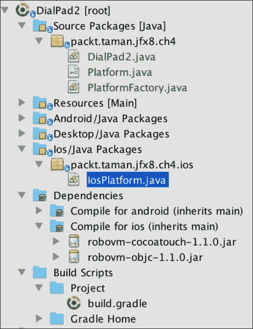
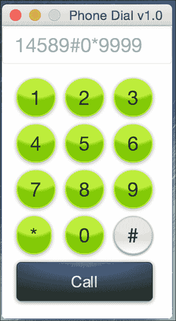
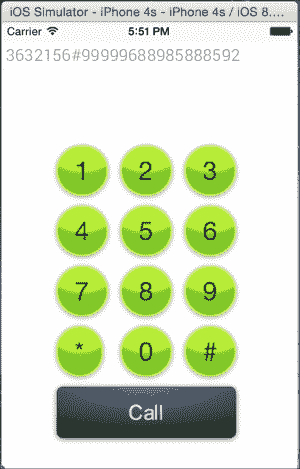
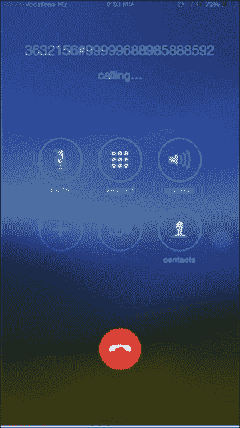

# 入门指南

在本节中，你将学习如何使用 `JavaFXMobile` 插件安装 RoboVM 编译器，并通过重用我们之前在第 4 章 *为 Android 开发 JavaFX 应用程序* 中为 Android 平台开发的同一应用（Phone Dial 版本 1.0）来确保工具链正常工作。

## 前提条件

为了使用 RoboVM 编译器构建 iOS 应用，需要以下工具：

*   Oracle 的 Java SE JDK 8 update 45。请参考第 1 章 *JavaFX 8 入门* 中的 *安装 Java SE 8 JDK* 部分。
*   需要 Gradle 2.4 或更高版本才能使用 `jfxmobile` 插件构建应用程序。请参考第 4 章 *为 Android 开发 JavaFX 应用程序* 中的 *安装 Gradle 2.4* 部分。
*   一台运行 **Mac OS X** 10.9 或更高版本的 Mac。
*   来自 Mac App Store 的 Xcode 6.x ([`itunes.apple.com/us/app/xcode/id497799835?mt=12`](https://itunes.apple.com/us/app/xcode/id497799835?mt=12))。

### 提示

首次安装 **Xcode** 时，以及每次更新到新版本时，都必须打开一次以同意 Xcode 条款。

## 为 iOS 准备项目

我们将重用之前在第 4 章 *为 Android 开发 JavaFX 应用程序* 中为 Android 平台开发的项目，因为针对 iOS 时，代码、项目结构或 Gradle 构建脚本没有区别。

它们共享相同的属性和特性，但使用不同的 Gradle 命令来服务于 iOS 开发，并且 Gradle 构建脚本针对 RoboVM 编译器做了微小改动。

因此，我们将通过同一个应用看到 **WORA** *一次编写，到处运行* 的强大之处。

### 项目结构

基于第 4 章 *为 Android 开发 JavaFX 应用程序* 中 Android 示例的相同项目结构，我们 iOS 应用的项目结构应如下图所示：



### 应用程序

我们将重用第 4 章 *为 Android 开发 JavaFX 应用程序* 中的同一个应用：Phone DialPad 版本 2.0 JavaFX 8 应用程序：



如你所见，重用同一代码库是一个非常强大且有用的特性，尤其是当你同时针对 iOS 和 Android 等多个移动平台进行开发时。

#### 与底层 iOS API 的互操作性

为了像我们在 Android 上所做的那样，从我们的应用中实现原生调用默认 iOS 电话拨号器的相同功能，我们必须为 iOS 提供原生解决方案，如下面的 `IosPlatform` 实现所示：

```
import org.robovm.apple.foundation.NSURL;
import org.robovm.apple.uikit.UIApplication;
import packt.taman.jfx8.ch4.Platform;

public class IosPlatform implements Platform {

  @Override
  public void callNumber(String number) {
    if (!number.equals("")) {
      NSURL nsURL = new NSURL("telprompt://" + number);
      UIApplication.getSharedApplication().openURL(nsURL);
    }
  }
}
```

### Gradle 构建文件

我们将使用第 4 章 *为 Android 开发 JavaFX 应用程序* 中使用的相同 Gradle 构建脚本文件，但做了一处微小改动，在脚本末尾添加了以下几行：

```
jfxmobile {
  ios {
    forceLinkClasses = [ 'packt.taman.jfx8.ch4.**.*' ]
  }
  android {
    manifest = 'lib/android/AndroidManifest.xml' 
  }
}
```

安装和使用 `robovm` 编译器的所有工作都由 `jfxmobile` 插件完成。

这些行的目的是告诉 RoboVM 编译器需要在运行时加载的主应用类的位置，因为编译器默认情况下无法看到它。

`forceLinkClasses` 属性确保这些类在 RoboVM 编译期间被链接进来。

#### 构建应用程序

在添加了为 iOS 构建脚本所需的配置集之后，是时候构建应用程序以将其部署到不同的 iOS 目标设备上了。为此，我们需要运行以下命令：

```
$ gradle build
```

我们应该会看到以下输出：

```
BUILD SUCCESSFUL

Total time: 44.74 secs
```

我们已经成功构建了应用程序；接下来，我们需要生成 .`ipa` 文件，并且在生产环境中，你必须通过将其部署到尽可能多的 iOS 版本上进行测试。

#### 生成 iOS .ipa 包文件

为了为我们的 JavaFX 8 应用程序生成最终的 .ipa iOS 包（这对于最终分发到任何设备或 AppStore 是必需的），你需要运行以下 `gradle` 命令：

```
gradle ios 
```

这将在 `build/javafxports/ios` 目录中生成 .`ipa` 文件。


### 部署应用程序

在开发过程中，我们需要在 iOS 模拟器上检查应用程序的图形界面和最终原型，并在不同设备上衡量应用的性能和功能。这些步骤非常有用，尤其对于测试人员而言。

接下来，我们将看到在模拟器或真实设备上运行应用程序是多么简单的事情。

#### 部署到模拟器

在模拟器上，你可以直接运行以下命令来检查应用程序是否正常运行：

```
$ gradle launchIPhoneSimulator 
```

该命令将打包并在 *iPhone 模拟器* 中启动应用程序，如下图所示：



在 iOS 8.3/iPhone 4s 模拟器上运行的 DialPad2 JavaFX 8 应用程序

以下命令将在 iPad 模拟器中启动应用程序：

```
$ gradle launchIPadSimulator 
```

#### 部署到 Apple 设备

为了打包 JavaFX 8 应用程序并将其部署到 Apple 设备，只需运行以下命令：

```
$ gradle launchIOSDevice 
```

该命令将在连接到你的台式机/笔记本电脑的设备上启动 JavaFX 8 应用程序。

然后，一旦应用程序在你的设备上启动，输入任意号码并点击“呼叫”。

iPhone 会请求使用默认拨号器拨号的权限；点击**确定**。默认拨号器将启动并显示该号码，如下图所示：



默认拨号器

### 注意

要在你的设备上测试和部署应用，你需要拥有 Apple 开发者计划的活跃订阅。请访问 Apple 开发者门户 [`developer.apple.com/register/index.action`](https://developer.apple.com/register/index.action) 进行注册。你还需要为开发配置你的设备。你可以在 Apple 开发者门户中找到关于设备配置的信息，或参考本指南：[`www.bignerdranch.com/we-teach/how-to-prepare/ios-device-provisioning/`](http://www.bignerdranch.com/we-teach/how-to-prepare/ios-device-provisioning/)。

