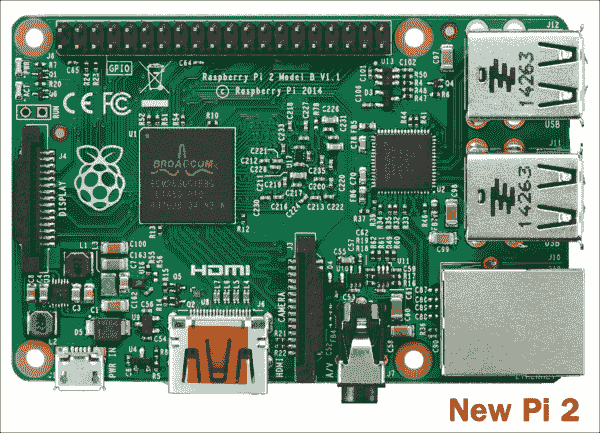

# 什么是 Raspberry Pi？

正如我们之前提到的，Raspberry Pi 是一台计算机——一台非常小巧且低成本的计算机。事实上，它大约只有信用卡大小。不要被它的尺寸所迷惑；正如我们所知，好东西往往是小包装。然而，Raspberry Pi 根本没有包装。

它没有外壳，其电路板和芯片完全可见，如下图所示。你可以将 Raspberry Pi 插入数字电视或显示器，并使用 USB 键盘和鼠标进行操作，使用起来非常方便。由于其体积小巧，你可以轻松地将其携带到任何地方。

Raspberry Pi 是一款功能强大的设备，允许所有年龄段的人探索计算，并学习如何使用 Java、JavaFX、Python 和 Scratch 等语言进行编程。此外，它能完成台式计算机能做的所有事情——从浏览互联网、播放高清视频或游戏，到处理电子表格或文字处理软件。

新款 Raspberry Pi 2 型号 B

## 你能用它做什么？

Raspberry Pi 让你有机会构建并控制一个能按你意愿工作的设备。例如，你可以部署一个由你编写的程序控制的机械臂。你可以设计并创建自己的角色扮演游戏，或者通过代码创作出精美的计算机艺术或音乐。

此外，Raspberry Pi 基金会的主要目标是让全世界的孩子们在学习编程和理解计算机工作原理的过程中感到乐趣。

