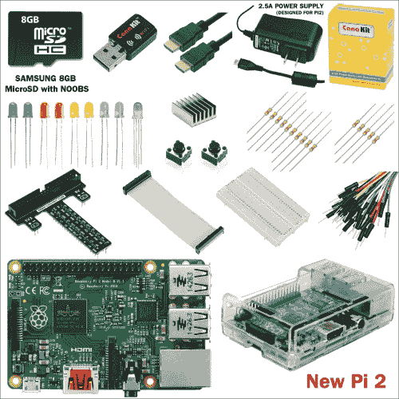

# 应该购买哪个型号？

在撰写本文时，树莓派共有五个型号：A、A+、B、B+，以及自 2015 年 2 月起推出的新型号 Pi 2 Model B。以下是 A+ 和 2 B 两个版本的对比。

| Model A+ | Model 2 B |
| --- | --- |
| 售价约 25 美元 | 售价约 35 美元 |
| 一个 USB 端口 | 四个 USB 端口 |
| 无以太网接口 | 标准以太网连接 |
| 256 MB 内存 | 1 GB 内存 |

Model A+ 更便宜，但只有一个 USB 端口且没有以太网连接。这可能不是问题。如果你为 Model A+ 连接一个带电源的 USB 集线器，再使用一个 USB 转 WiFi 适配器，就能拥有 Model B+ 的所有网络功能。两个型号之间的一个主要区别是内存大小。Model A+ 有 256 MB 内存，Model B+ 有 512 MB 内存，而 2 B 有 1 GB 内存。这两个型号的内存均不可升级。

所有树莓派微型计算机都配有一个 SD 存储卡插槽、音频输出插孔、RCA 和 HDMI 视频端口，以及一排通用输入输出引脚。还有两个用于连接显示屏和摄像头的额外接口，但两者都需要高度专业化的硬件。考虑到价格差异很小（通常在 10 到 25 美元之间），我建议从 Model 2 B 开始入手。如果你要为（例如）一个教室购买多台，那么 Model A+ 可能就足够了。

你可以从任何在线商店以不超过 100 美元的价格购买一个包含所有入门所需物品的套件，它将包括：

*   新型树莓派 2（RPi2）四核 900 MHz 1GB 内存和 CanaKit WiFi 适配器
*   优质 6 英尺 HDMI 线缆、GPIO 转面包板接口板、排线、面包板、跳线、GPIO 快速参考卡和电阻色环快速参考卡
*   8 GB 三星 MicroSD 卡（树莓派基金会推荐的预装 NOOBS 的 MicroSD 卡）、高品质树莓派 2 外壳和散热片
*   RGB LED、8 个 LED（蓝/红/黄/绿）、15 个电阻、2 个按钮开关和电子元件初学者通用指南
*   专为树莓派 2 设计的 2.5A USB 电源适配器，带 5 英尺 Micro USB 线缆（UL 认证）

树莓派 B Model 2 的典型套件组件

## 购买树莓派

树莓派由英国的树莓派基金会制造。不幸的是，它历来有缺货待发的历史。幸运的是，你可以从多家供应商处购买，其中一些列在 [`www.raspberrypi.org/`](https://www.raspberrypi.org/) 的主页上。你也可以从 [`www.amazon.com`](http://www.amazon.com) 购买，尽管价格会稍高一些。价格与你在此处看到的会有所不同。

最后，请查看 [`www.adafruit.com`](http://www.adafruit.com)。他们的价格合理，并且还提供一些你未来项目中会用到的有用配件。在这些商店里，你还可以找到包含树莓派和入门所需组件的入门套件。

## 相关网站和文档

互联网上有大量关于树莓派的信息。当你研究更高级的主题时，知道在哪里寻找答案会很有帮助。

树莓派基金会的官方网站是 [`www.rasberrypi.org`](http://www.rasberrypi.org)。它列出了购买树莓派微型计算机的渠道。网站上还有各种教程和有用的论坛。

有关在树莓派上运行的 Linux 版本的更多信息，请访问 [`elinux.org/index.php?title=RPi_Hub&redirect=no`](http://elinux.org/index.php?title=RPi_Hub&redirect=no)。那里有关于通用输入输出引脚的信息；Raspbian Wheezy（专为树莓派设计的 Linux 版本）；以及示例项目。你还会找到关于其他嵌入式系统的信息，例如 **Minnow board** 和 **BeagleBoard**。

Neil Black 编写了一份出色的树莓派初学者指南，值得掌声。如果你在设置过程中感到困惑，请访问 [`neil-black.co.uk/the-updated-raspberry-pi-beginners-guide`](http://neil-black.co.uk/the-updated-raspberry-pi-beginners-guide)。

最后，访问 [`www.adafruit.com`](http://www.adafruit.com) 购买树莓派以及电源、电机控制板和实验套件。如果你无法在当地购买零件，这个团队是购买配件和其他组件的绝佳选择。

