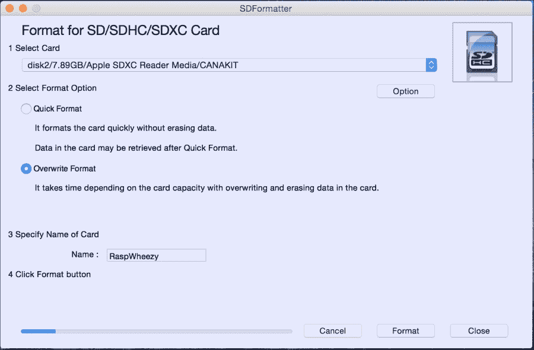
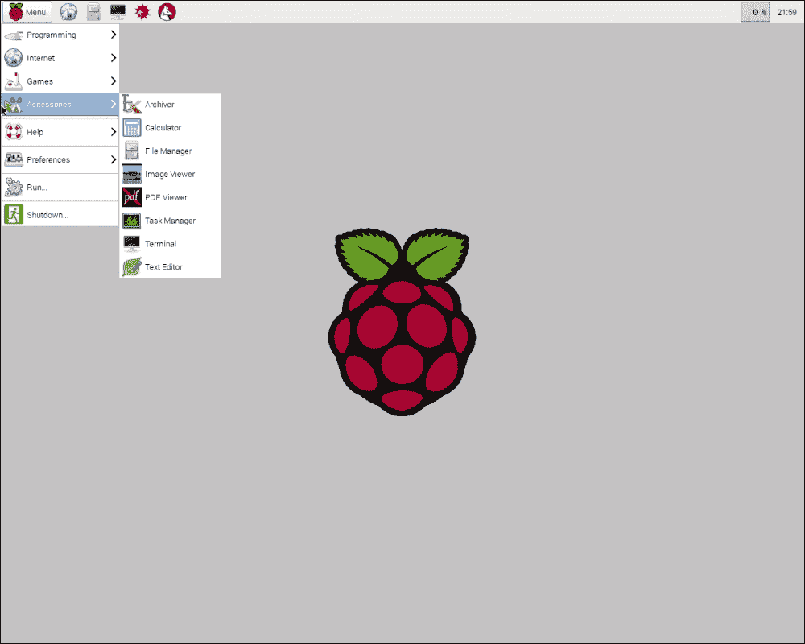
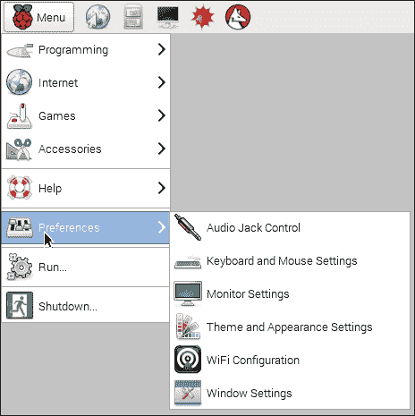
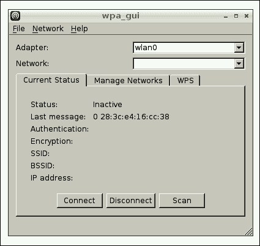
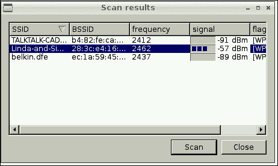
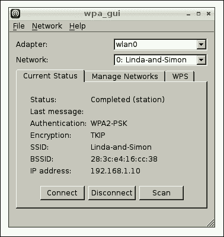
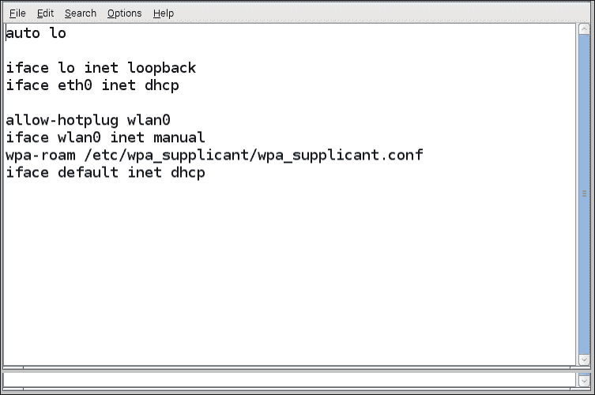
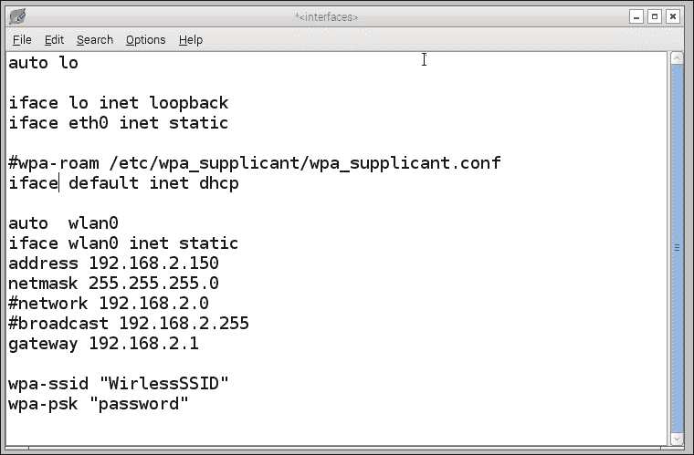
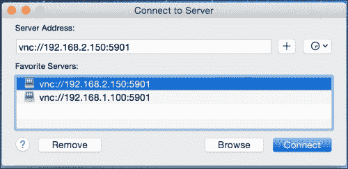

# 为 JavaFX 8 准备树莓派

没有操作系统，你的树莓派将无法工作，操作系统从 SD 卡加载。我们需要一种与之交互的方式，首先安装支持的操作系统，在我们的例子中是 Raspbian Wheezy；所有官方支持的树莓派操作系统都已列出，并可从链接 [`www.raspberrypi.org/downloads/`](http://www.raspberrypi.org/downloads/) 下载。

然后，我们将配置树莓派的网络设置，以便远程连接它。最后，我们将检查默认安装的 Java SE 8 版本，并继续检查更新（如果操作系统尚未预装的话）。

如前所述，最新的更新不包含 JavaFX，因此我们将找到添加它的方法。让我们开始准备 SD 卡以安装 Raspbian Wheezy 操作系统，并使树莓派启动并运行。

## 创建可启动 SD 卡

现在，我们将准备带有 Raspbian Wheezy 操作系统的 SD 卡，这将使我们能够与树莓派进行交互。这是非常重要的一步。有两种方法可以做到这一点：


### 使用 NOOBS

NOOBS 是一款简易的操作系统安装器，其中包含 Raspbian。但精简版并未捆绑 Raspbian。它还提供了一系列可供选择的其他操作系统，这些系统会从互联网下载并安装。

初学者应从 NOOBS 方法入手，但这需要网速良好的互联网连接来下载首选操作系统。

如果你购买的套件中已包含预装 NOOBS 的 SD 卡，可以直接跳到下一步。或者，如果你需要 SD 卡，可以从 Swag 商店订购一张，网址为 [`swag.raspberrypi.org/products/noobs-8gb-sd-card`](http://swag.raspberrypi.org/products/noobs-8gb-sd-card)；你也可以自行下载并将其设置到你的 SD 卡上。所有步骤均可在链接 [`www.raspberrypi.org/help/noobs-setup/`](http://www.raspberrypi.org/help/noobs-setup/) 中找到。

**将 Raspbian Wheezy 操作系统烧录到你的 SD 卡：**

这是我最喜欢的设置方式，因为我已下载好操作系统，并会直接将其烧录到我的 SD 卡上；以下是在 Mac OS X 上操作的步骤（请确保你有一张有效的 SD 卡，容量为 4/8/16 GB，且为 Class 10 级别）：

我们需要将 SD 卡格式化为 FAT32 格式。我们可以使用适用于 Windows 或 Mac 的 SD Formatter 4.0 轻松完成此操作，该软件可从 SD 协会网站下载，网址为 [`www.sdcard.org/downloads/formatter_4/eula_mac/index.html`](https://www.sdcard.org/downloads/formatter_4/eula_mac/index.html)。

按照说明安装该软件包：

1.  将你的 SD 卡插入电脑或笔记本电脑的 SD 卡读卡器，并*记下*分配给它的驱动器盘符——例如，在我的电脑上是 `/disk2`。
2.  在 **SDFormatter** 中，选择你的 SD 卡的驱动器盘符，进入 **Format Option** 并选择 **Overwrite format**，将其命名为 `RaspWheezy`（可选），然后点击 **Format**。根据卡的大小，格式化 SD 卡可能需要一些时间。

    使用 SDFormatter 应用程序格式化 SD 卡

3.  格式化完成后，关闭 SDFormatter。如果你使用的是 Mac 或 Linux，请在终端中运行以下命令行来检查磁盘盘符和格式类型：

    ```
    $ diskutil list
    ```

    在此例中，SD 卡是 `/dev/disk2`，格式类型为 `DOS_FAT_32`，名称为 `RASPWHEEZY`。在 Windows 上，请打开 Windows 资源管理器并检查驱动器。

    ### 注意

    切勿搞错，否则你可能会销毁错误 `disk/card/drive` 上的所有数据。

4.  从链接 [`downloads.raspberrypi.org/raspbian_latest`](http://downloads.raspberrypi.org/raspbian_latest) 下载 Raspbian Wheezy 操作系统，解压缩后，你应该会得到 `2015-02-16-raspbian-wheezy.img` 文件。
5.  在 Mac 或 Linux 的命令行中，卸载磁盘但不要弹出：

    ```
    $ diskutil unmountDisk /dev/disk2
    ```

6.  然后使用 `dd` 命令行将镜像写入 SD 卡：

    ```
    $ sudo dd if=/path/to/2015-02-16-raspbian-wheezy.img of=/dev/rdisk2 bs=1m
    ```

    输入密码后，写入过程开始，你需要等待直到再次看到提示符。这需要几分钟时间。在 Windows 上，你可以使用 Win32DiskImager（可从 [`www.raspberry-projects.com/pi/pi-operating-systems/win32diskimager`](http://www.raspberry-projects.com/pi/pi-operating-systems/win32diskimager) 下载）。

7.  `dd` 命令完成后，弹出卡片：

    ```
    $ sudo diskutil eject /dev/rdisk2
    ```

    ### 注意

    请注意，`dd` 在出现错误或完成之前不会反馈任何信息；完成后会显示信息，并且磁盘会重新挂载。但是，如果你想查看进度，可以使用 *Ctrl* + *T* 快捷键。这会生成 **SIGINFO**，即你 `tty` 的状态参数，并显示有关进程的信息。

恭喜，现在将你的 SD 卡装入 Raspberry Pi，并连接合适的显示器以启动它。

## 配置 Raspberry Pi

现在，我们需要为 Pi 的首次启动进行设置，并配置一个静态 IP，以便从我们的笔记本电脑远程连接：

1.  装入我们之前准备好的 SD 卡。
2.  插入键盘、鼠标和显示器线缆。
3.  将你的 WiFi 适配器插入其中一个 USB 端口。
4.  现在，将电源线插入你的 Pi。
5.  你应该会在屏幕上看到一些详细输出，显示 Raspbian 操作系统正在启动。大胆前进，无需畏惧。
6.  首次启动时，Raspberry Pi 配置屏幕将会显示，并为你提供一系列可用于配置 Raspberry Pi 的选项。基本上，你需要设置时区和本地化配置。检查 CPU 和 GPU 之间的内存分配设置，或启用 SSH。但大多数情况下，你可以直接忽略它们，使用箭头键移动到最后一个选项，然后按回车键。
7.  如果在配置过程中选择了不喜欢的选项，你可以通过在控制台输入 `sudo raspi-config` 来重新启动配置。
8.  如果 Raspberry Pi 配置正确，你会看到一系列 Linux 启动信息滚动而过，随后出现登录请求。默认用户登录名是 `pi`，密码是 `raspberry`。现在，你将看到一个标准的 Linux 提示符。恭喜，你的 Raspberry Pi 已启动并运行。
9.  Wheezy 带有图形用户界面。只需输入 `sudo startx`，你就会看到一个色彩丰富的用户界面，其中包含游戏、文字处理器和网页浏览器，如下面的截图所示：

    Raspberry Pi 桌面

Raspberry Pi 桌面是**轻量级 X11 桌面环境**（**LXDE**）。花些时间探索一下。你会发现它非常熟悉，尽管比你的高性能台式电脑稍慢一些。

当你完成 LXDE 的使用后，只需注销，你就会回到 Linux 提示符。为了 SD 卡上数据的安全，优雅地关闭你的 Raspberry Pi 非常重要。在拔出电源线之前，请发出关机命令：

```
$ sudo shutdown -h now.
```

这将确保在所有进程关闭之前，所有内容都已写入 SD 卡。现在，你可以安全地拔出电源线，这就是 Raspberry Pi 开关的全部操作。

恭喜，你已经完成了 Raspberry Pi 的首次使用。


## 远程连接树莓派

通常情况下，你会使用外设和显示器来连接树莓派，但并非总是如此——在开发阶段，或者当树莓派本身被用作控制家用电器的酷炫服务器时，你需要从电脑、浏览器甚至手机来控制它。

为树莓派设置固定网络地址并非必需，但强烈建议这样做。这样一来，你就能始终使用相同的地址（或名称，如果你在 hosts 文件中创建了条目）连接到树莓派，从而消除了开发过程中的一个潜在变量。

同时，最好将树莓派的 IP 地址更新到网络 DHCP 设备/路由器中，这样它就不会尝试将该地址分配给网络上的其他设备。具体操作步骤因交换机/路由器制造商而异。

我们将在树莓派上安装 VNC 服务器。**虚拟网络计算**（**VNC**）允许你通过网络从一台电脑控制另一台电脑。它提供了一个图形用户界面，包括鼠标和键盘。在我们的场景中，它将使我们无需在树莓派上连接实体键盘和鼠标，就能查看和使用树莓派的图形用户界面。

目前，这只是一个便利功能，如果你对当前的鼠标、键盘和显示器设置感到满意，可以跳过此部分。当你开始使用需要占用一个或多个 USB 端口的设备时，VNC 将成为必需品。

设置 VNC 需要五个步骤：

1.  连接到家庭 WiFi 互联网连接。
2.  在树莓派上安装 VNC。
3.  设置为开机自启动。
4.  设置静态 IP 地址。
5.  使用客户端连接到 VNC。

连接到 WiFi 互联网连接，Raspbian Wheezy 包含一个 WiFi 配置工具。此外，所有在 2012 年 10 月 28 日之后发布的 Raspbian 版本都预装了此工具。

### 注意

设置 WiFi 需要你的路由器正在广播 SSID。请确保你的路由器已设置*广播 SSID*！这对于私有 SSID 设置无效。

现在，让我们远程连接到树莓派：

1.  在 Raspbian 桌面上，转到 **菜单** | **首选项** | **WiFi 配置**，如下截图所示：

    选择 WiFi 配置工具

2.  双击该图标，你将看到以下窗口：

    WiFi 配置工具图形用户界面

3.  点击 **扫描** 按钮，将打开第二个窗口。在列表中找到你的无线接入点并双击它。这将打开另一个窗口：

    接入点列表

4.  在 `PSK` 字段中输入你的密码，然后点击 **添加**。查看第一个窗口时，你应该会看到连接已设置完毕，可供使用。

    添加接入点的最终状态

你可以使用按钮进行连接或断开连接。在上面的截图中，你可以看到树莓派的 IP 地址显示在窗口底部。

请注意，在终端上设置 WiFi 连接有一个手动方法。这需要编辑 `config` 文件并手动添加网络的 SSID 和密码。更多信息，请访问 [`www.raspberrypi.org/documentation/configuration/wireless/wireless-cli.md`](https://www.raspberrypi.org/documentation/configuration/wireless/wireless-cli.md)。

恭喜，你的树莓派已连接到互联网。现在让我们安装一个 VNC 服务器。

### 在树莓派上安装 VNC

现在你已经有了互联网连接，可以在树莓派上安装 VNC 服务器了。如果你使用的是 Raspbian Wheezy，这很简单。在命令提示符下，输入以下行：

```
$ sudo apt-get install tightvncserver
```

你会看到消息：**是否继续？是或否？**

让我们用大写字母 *Y* 回答，然后休息一下。当安装完成时，输入以下命令：

```
$ vncserver
```

系统会要求你创建一个密码，我使用 *raspberry*。它会提示密码长度超过八个字符；继续重新输入 `raspberry`。接下来，系统会询问：**是否要输入一个仅供查看的密码？** 输入 *N* 表示否。

恭喜，你已经在树莓派上运行 VNC 了。

#### 设置 VNC 开机自启动

随着你越来越熟练，你可能并不总是需要 VNC，但假设你希望每次启动树莓派时 VNC 都运行：

1.  使用树莓派 **LX 终端** 中的以下命令编辑 `rc.local` 文件：

    ```
    $ sudo nano /etc/rc.local
    ```

2.  滚动到底部，在 `exit 0` 上方添加以下行：

    ```
    su -c "/usr/bin/tightvncserver -geometry 1280x1024" pi
    ```

3.  保存文件并使用以下命令重启树莓派：

    ```
    $ sudo shutdown -r now
    ```

4.  现在，每次启动树莓派时，VNC 都将可用。

### 设置静态 IP 地址

通过 VNC 连接树莓派需要一个静态 IP 地址，即一个不会改变的地址。接下来我将向你展示如何为有线和无线网络获取静态 IP：

1.  如果你在家庭网络中，需要找到一个可用的 IP 地址。为此，打开树莓派 LX 终端，输入：

    ```
    mohamed_taman$ ifconfig –a
    ```

    然后，输入以下命令：

    ```
    mohamed_taman$ netstat -nr
    ```

2.  收集以下信息：*当前 IP*（如果你想保留它）、*子网掩码*、*网关*、*目标地址*和*广播地址*。记下这些信息，你很快就会用到！
3.  在树莓派上，通过运行以下命令备份 `/etc/network/interfaces`：

    ```
    $ sudo cp /etc/network/interfaces /etc/network/interfaces.org
    ```

4.  使用以下命令修改 `interfaces` 文件：

    ```
    $ sudo nano /etc/network/interfaces
    ```

5.  将 `interfaces` 文件从：

    编辑前的 interfaces 文件

6.  选择适合你网络的 IP 号码；同时将 `wpa-ssid` 改为你的无线网络名称，将 `wpa-psk` 改为无线密码：

    编辑后的 interfaces 文件

7.  保存文件并重启树莓派。这些设置对有线和无线连接都有效。恭喜，你现在可以使用 VNC 客户端连接到你的树莓派了。


### 树莓派自动登录

和大多数人一样，你购买树莓派可能是为了搭建家庭或办公室的专属设备。接下来你需要设置树莓派，连接外设，并安装或开发必要的软件。

项目最终的目标是：通电后，设备能直接展现出你所期待的全部神奇功能。

然而，当树莓派启动到登录提示符并等待你输入用户名和密码时，这种体验就大打折扣了。那么，让我们来实现树莓派的自动登录：

1.  在树莓派上，打开终端，使用以下命令编辑 `inittab` 文件：

    ```
    sudo nano /etc/inittab
    ```

2.  通过定位到 `inittab` 中的以下行来禁用 `getty` 程序：

    ```
    1:2345:respawn:/sbin/getty 115200 tty1
    ```

3.  在该行开头添加一个 `#` 将其注释掉，如下所示：

    ```
    #1:2345:respawn:/sbin/getty 115200 tty1
    ```

4.  在注释行的正下方，向 `inittab` 添加一个登录程序：

    ```
    1:2345:respawn:/bin/login -f pi tty1 </dev/tty1 >/dev/tty1 2>&1
    ```

5.  这将使用 `pi` 用户运行登录程序，无需任何身份验证。
6.  按 *Ctrl* + *X* 保存并退出，然后按 *Y* 保存文件，最后按 *Enter* 确认文件名。

重启树莓派，它将直接启动到 shell 提示符 `pi@raspberrypi`，而不会提示你输入用户名或密码。

### 使用客户端连接 VNC

在继续之前，让我们确保一切工作正常。为此，你需要一个 VNC 客户端。如果你使用的是装有较新版本 Mac OS X 的 Macintosh 电脑，这很简单。

前往 **Finder** | **前往** | **连接服务器**。输入 `vnc://` 以及你分配给树莓派的 IP 地址。在我的例子中，IP 地址是 192.168.2.150，后面跟一个冒号和端口号 5901，如下面的截图所示。完整的 URL 应为 **vnc://192.168.2.150:5901**。



连接到树莓派 VNC 服务器。

如图所示，`5901` 是树莓派 VNC 服务器监听的端口号。点击 **连接**。不用担心屏幕共享加密，再次点击 **连接**。然后输入你之前创建的密码（`raspberry`）。如果一切正常，你将看到一个巨大的树莓图标。恭喜你！

如果你不是 Macintosh 电脑用户，则需要下载一个 VNC 客户端。你可以从 [`realvnc.com/`](http://realvnc.com/) 获取免费查看器。这里有适用于 Windows、iOS、Android 和 Chrome 浏览器的客户端。是的，你可以通过手机控制树莓派。

