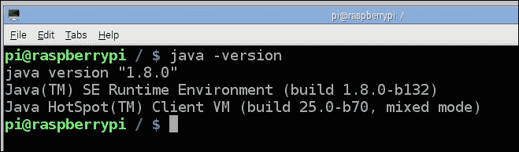
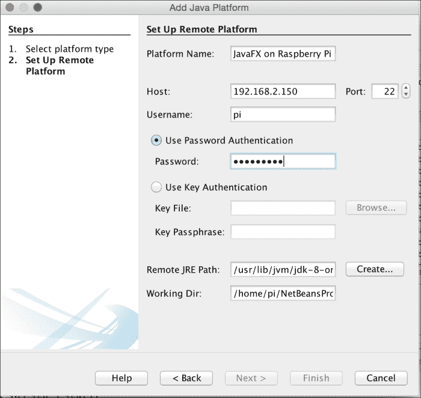

# JavaFX 8 开发前提条件

现在我们已经设置并配置好了用于开发的树莓派，我们需要在开发机器和树莓派上安装相同且正确匹配的 JDK 8 构建版本。这对于在运行 JavaFX 8 应用程序时避免库/版本问题非常重要，这也是我们接下来要做的事情。

## 在树莓派上安装 Java SE 8

在撰写本文时，Raspbian Wheezy 系统预装了 JDK 8。要检查，只需在树莓派命令提示符下输入以下命令：

```
pi@raspberrypi ~ $ java –version
```

根据当前安装并可访问的版本，你将看到类似如下的信息：



树莓派上的 Raspbian Wheezy Java 版本

关键信息在第二行：如果它没有显示 1.8.n，你就需要安装 JDK 8。

## 安装 Java SE 8

我们之前已经安装过 JDK 8，所有必要的步骤都在第 1 章 *JavaFX 8 入门* 的 *安装 Java SE 8 JDK* 部分中进行了描述。

## 添加 JavaFX

如前所述，Oracle 已停止对 JavaFX Embedded 的支持。如果你安装了 JDK 8u45 或 Raspbian Wheezy 上预装的版本，则没有捆绑 `jfxrt.jar`，因此我们需要提供它才能在树莓派上运行 JavaFX 应用程序。

一种方法是按照 [`wiki.openjdk.java.net/display/OpenJFX/Cross+Building+for+ARM+Hard+Float`](https://wiki.openjdk.java.net/display/OpenJFX/Cross+Building+for+ARM+Hard+Float) 上的教程，为 ARM 交叉构建 OpenJFX。这适合真正的高级开发者。

更简单的方法是下载一个预构建的发行版，例如托管在 JavaFXPorts 项目上的 `armv6hf-sdk.zip`（[`bitbucket.org/javafxports/arm/downloads`](https://bitbucket.org/javafxports/arm/downloads)）。

下载 `armv6hf-sdk.zip` 后，解压缩它，并添加以下命令行选项，通过扩展机制将外部源附加到 `classpath`：

```
-Djava.ext.dirs=<path to armv6hf-sdk>/rt/lib/ext
```

或者，你可以将此 zip 文件中 `rt/lib/ext` 和 `rt/lib/arm` 的内容复制到你的 JVM 文件夹中，从而避免使用扩展机制。

## 为树莓派配置 NetBeans

NetBeans 8 增加了指向远程 JDK 的能力，并用于远程调试和执行你在本地开发机器上编写的程序。它甚至能自动无缝地部署你的应用程序。正如 José Pereda 在他的文章 [`netbeans.dzone.com/articles/nb-8-raspberry-pi-end2end`](http://netbeans.dzone.com/articles/nb-8-raspberry-pi-end2end) 中所记载的，你可以通过以下步骤启用此功能：

1.  在你的机器上启动 NetBeans。
2.  从菜单栏中选择 **工具**，然后选择 **Java 平台**。点击 **添加平台** 按钮。
3.  选择 **远程 Java 标准版** 单选按钮，然后点击 **下一步**。
4.  提供以下条目（如下面的截图示例所示）：

    **平台名称**：`JavaFX on Raspberry Pi JDK 8`

    **主机**：输入你之前分配给树莓派的静态 IP 地址或主机名

    **用户名**：`pi`

    **密码**：`raspberry`

    **远程 JRE 路径**：`/usr/lib/jvm/jdk-8-oracle-arm-vfp-hflt/jre`

    

    为树莓派设置远程平台

5.  点击 **完成** 按钮，等待 NetBeans 建立并配置远程 JDK 连接。
6.  远程 JDK 就位后，点击 **关闭** 按钮。

现在我们已经完成了设置，你应该拥有一个为树莓派开发 JavaFX 8 应用程序的最佳开发环境之一。那么，让我们开始吧！

