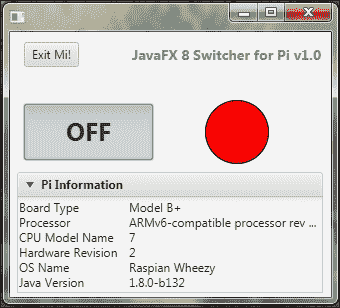
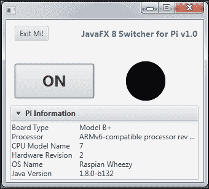
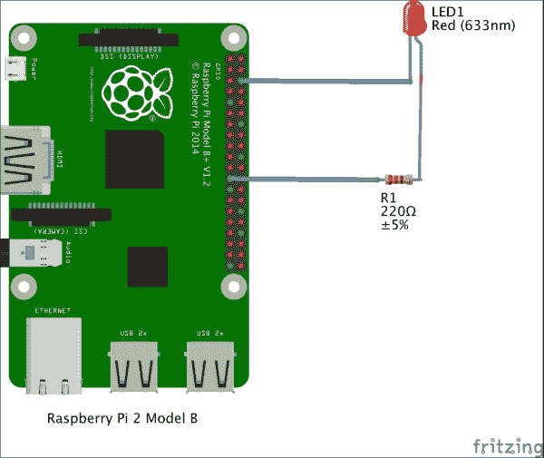
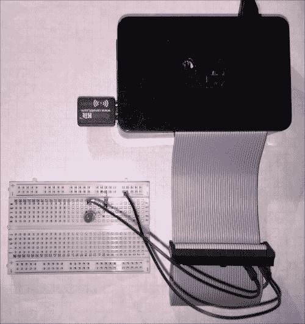
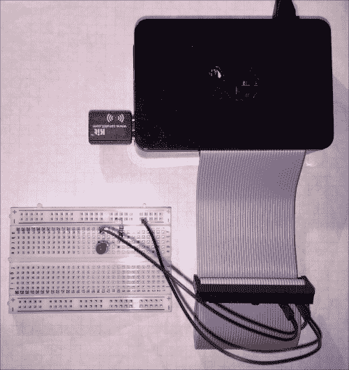

# 开关应用程序

开关应用程序本质上非常简单，但其理念主要分为两个要点：如何在树莓派上运行 JavaFX 8 应用程序，以及如何从树莓派的**通用输入/输出**（**GPIO**）控制外部世界。为此，我们将使用一个名为 **Pi4j** 的项目。

思路很简单；我们将创建一个 JavaFX 应用程序，它将作为一个开关控制器，用于控制一个连接到树莓派电路上的 LED。

以下截图显示了应用程序在开启和关闭状态下的样子：



开关应用程序开启状态

.



开关应用程序关闭状态


## 什么是 Pi4J 库？

Pi4J 库（[`pi4j.com`](http://pi4j.com)）是一个旨在为原生库与 Java 之间搭建桥梁的项目，以便全面访问树莓派的功能和控制接口，从而让你能够轻松地在 Java 项目中访问 GPIO 引脚。

请访问 [`pi4j.com/pins/model-2b-rev1.html`](http://pi4j.com/pins/model-2b-rev1.html) 查看树莓派 2 代 B 型（J8 排针）的 GPIO 引脚编号。此外，你的套件中的 GPIO 适配器可能附带一份 GPIO 排针快速参考指南。

对于本示例，你需要一些基本的电子元件，例如一个 LED、一个电阻和一个面包板。如果你的套件中没有包含这些元件，可以从网上商店购买。

### 电路搭建

现在我们需要搭建电路：在面包板上放置一个 LED 并串联一个 220 欧姆的上拉电阻，然后将 LED 的阳极连接到 GPIO 引脚 #1，阴极连接到 GPIO 的 GND 引脚，如下图所示（CanaKit 套件附带了一份常用电子元件的通用组装指南）：



开关应用电路搭建

## 应用程序

如前所述，应用程序界面包含两个按钮。**退出我！** 按钮负责关闭 GPIO 控制器并退出应用程序。第二个按钮是一个开关按钮（**开**/**关**），用作开关。它有两种状态：选中时状态为 true，未选中时为 false。此外，我们通过编程方式更改其标签，以指示当前受控 LED 的状态。

此外，还有一个圆形图形用于模拟物理 LED 的状态。因此，当开关按钮处于“开”状态时，圆形将填充为红色。“关”状态则将其变为黑色，这是默认状态。

最后，在应用程序场景的底部，我们添加了一个标签为“Pi 信息”的 `TitledPane`，用于显示一些树莓派信息。

查看 `SwitchUIController.java` 类，你会发现在与 `Pi4J` 库交互之前，我们需要声明一些非常重要的字段：

```
private GpioController gpio;
private GpioPinDigitalOutput pin;
```

第一行代码负责创建一个新的 GPIO 控制器实例，这是在 `initialize()` 方法中通过 `GpioFactory` 完成的，因为它包含一个用于创建 GPIO 控制器的 `createInstance` 方法：

```
gpio = GpioFactory.getInstance();
```

### 注意

你的项目应仅实例化一个 GPIO 控制器实例，并且该实例应在整个项目中共享。

要访问 GPIO 引脚，你必须首先配置（provision）该引脚。配置过程会根据你的使用意图来设置引脚。配置可以自动导出引脚、设置其方向，并为基于中断的事件建立任何边缘检测：

```
// 将 GPIO 引脚 #01 配置为输出引脚并开启
pin = gpio.provisionDigitalOutputPin(GPIO_01);
```

这就是配置输出引脚 #1 的方法。你的程序将只能控制那些被配置为输出引脚的引脚状态。输出引脚用于控制继电器、LED 和晶体管。

现在，我们想要做的就是从应用程序中通过开关按钮来控制 LED。这是通过注册到开关按钮的 `doOnOff()` 事件函数实现的，如下代码所示：

```
 @FXML
    private void doOnOff(ActionEvent event) {
        if (switchTgl.isSelected()) {
            pin.high();
            led.setFill(RED);
            switchTgl.setText("OFF");
            System.out.println("Switch is On");
        } else {
            pin.low();
            led.setFill(BLACK);
            switchTgl.setText("ON");
            System.out.println("Switch is Off");
        }
    }
```

`Pi4J` 库提供了许多便捷方法来控制 GPIO 引脚或向其写入状态。在我们的应用程序中，我们使用 `pin.high()` 来点亮 LED，使用 `pin.low()` 来熄灭 LED。

最后，当应用程序退出时，我们必须关闭 GPIO 控制器。Pi4J 项目提供了一种实现，可以在应用程序终止时自动将 GPIO 引脚状态设置为非活动状态。

这对于确保程序关闭时 GPIO 引脚状态不会保持活动或留下某些活动状态非常有用。我们可以通过之前创建的 GPIO 实例，使用下面这行代码轻松实现这一点：

```
gpio.shutdown();
```

当你按下开关按钮打开 LED 时，你会看到绿色的 LED 亮起。当它关闭时，你会看到 LED 熄灭。



应用电路——LED 关闭



应用电路——LED 开启

接下来，让我们配置项目，以便从 NetBeans 直接在树莓派上运行我们的 JavaFX 开关应用程序。

