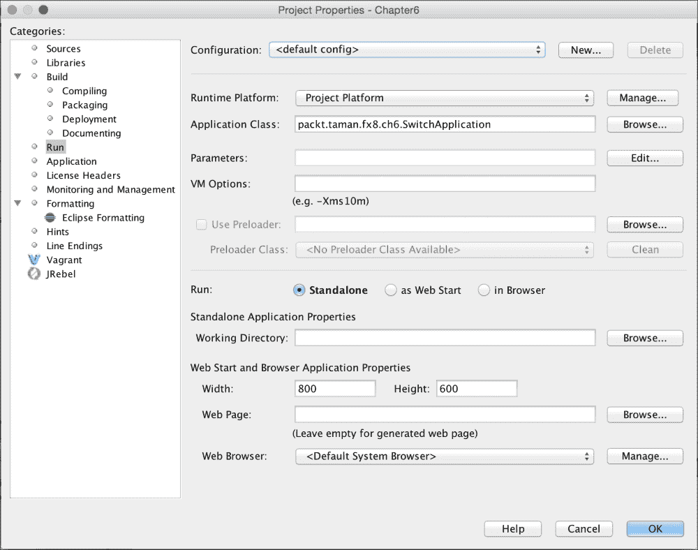
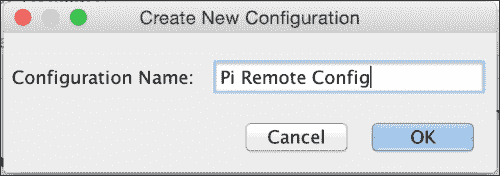
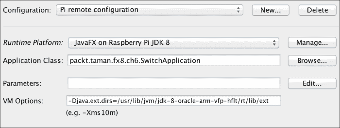

# 在树莓派上使用 NetBeans

在讨论了应用程序逻辑并了解了其工作原理之后，接下来是最精彩的部分：构建你的应用程序并使用 NetBeans 在树莓派上运行它。步骤如下：

1.  在 NetBeans 的 **项目** 选项卡中，右键点击 `Chapter6` 项目，然后选择 **属性**。
2.  在 **项目属性** 对话框中，从左侧的 **类别** 菜单中选择 **运行**。你将看到一个类似于以下截图的对话框：

    项目属性对话框与运行配置

3.  点击所选 **配置** 右侧的 **新建** 按钮。为 **新建配置** 设置一个名称（`Pi 远程配置`），然后点击 **确定** 按钮，如下图所示：

    新建配置

4.  现在，你需要将一个远程 JDK 与你的远程配置关联起来。为此，点击标记为 **运行时平台** 的下拉框，然后选择你之前配置的 `JavaFX on Raspberry Pi JDK 8`。别忘了在 **VM 选项** 中添加 `jfxrt.jar` 的路径：

    远程 Pi JDK 关联

5.  最后一步是构建应用程序并将其部署到树莓派上。为此，请转到 **运行** 菜单，选择 **运行项目**，然后观察 NetBeans 的输出窗口/选项卡。如果在运行应用程序时留意树莓派的屏幕，你将看到以下输出信息：

    ```
    jfx-deployment-script:
    jfx-deployment:
    jar:
    Connecting to 192.168.2.150:22
    cmd : mkdir -p '/home/pi/NetBeansProjects/Chapter6/dist'
    Connecting to 192.168.2.150:22
    done.
    profile-rp-calibrate-passwd:
    Connecting to 192.168.2.150:22
    cmd : cd '/home/pi/NetBeansProjects/Chapter6';
    '/usr/lib/jvm/jdk-8-oracle-arm-vfp-hflt/jre/bin/java'  -Dfile.encoding=UTF-8 -jar /home/pi/NetBeansProjects/Chapter6/dist/Chapter6.jar
    ```


