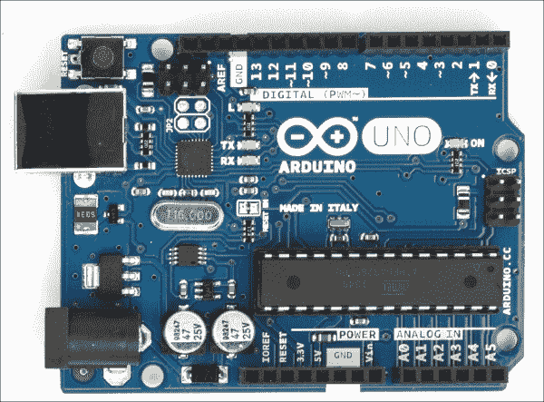
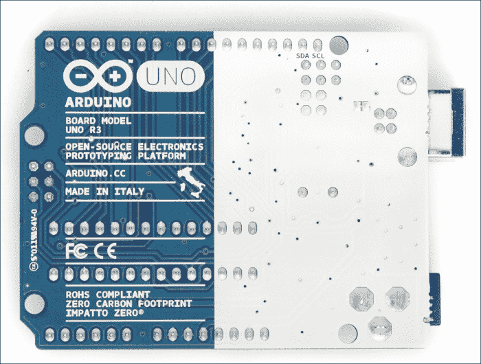
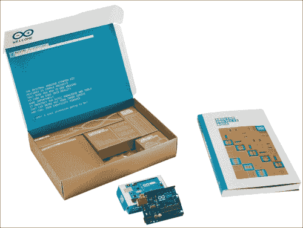
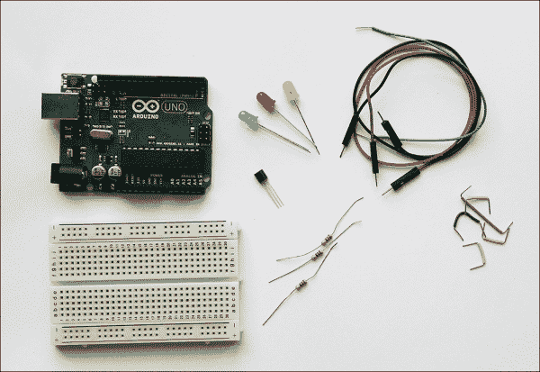
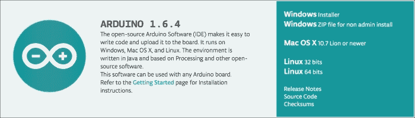
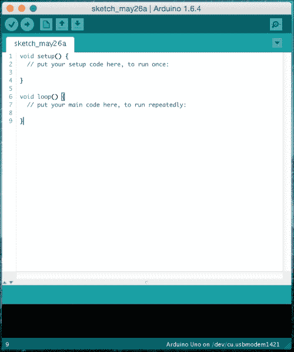
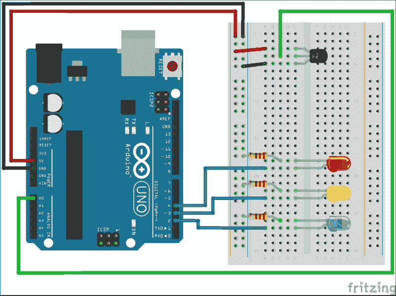
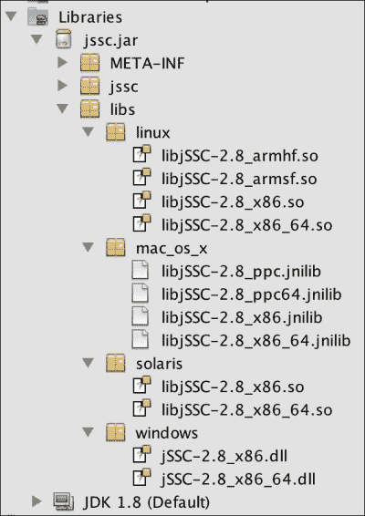
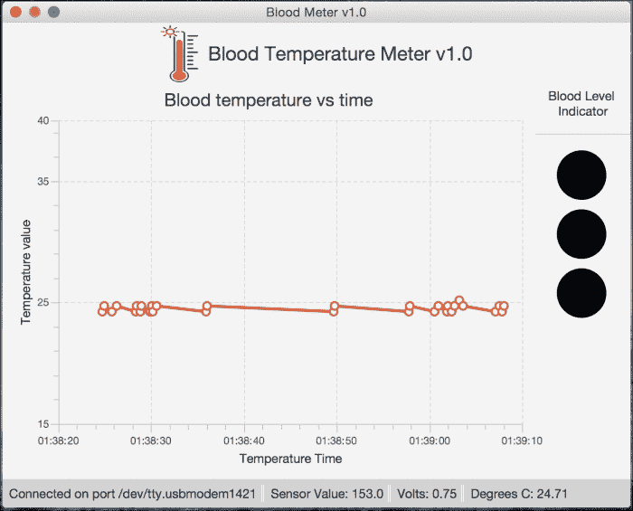
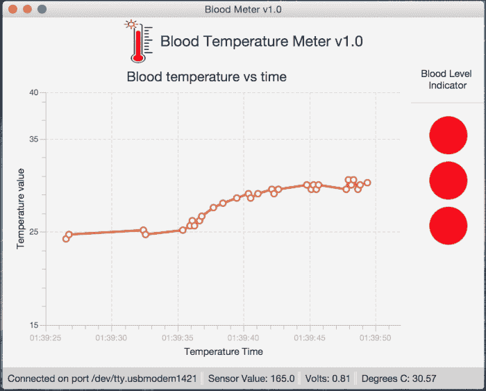

# 什么是 Arduino 板？

Arduino Uno 是最著名的 Arduino 板，它是一款基于 **ATmega328** 数据手册（[`www.atmel.com/dyn/resources/prod_documents/doc8161.pdf`](http://www.atmel.com/dyn/resources/prod_documents/doc8161.pdf)）的微控制器板，该芯片是板子的“大脑”。它的尺寸大约为 3 x 2 英寸。它有 14 个数字输入/输出引脚、6 个模拟输入引脚和 32 KB 的闪存。

每块板都包含一个复位按钮。此外，它还包括一个 USB 端口，因此当它连接到计算机时，它既可以作为电源，也可以作为通信工具。如果你没有连接到计算机，你可以使用替代电源，例如一个 9 至 12 伏的交流直流适配器，通过将一个 2.1 毫米中心正极插头插入板子的电源插孔来连接，或者使用一个 9 伏电池组。

数字引脚中，编号旁边带有波浪符号的六个引脚是允许进行**脉冲宽度调制**（**PWM**）的引脚，这是一种在数字输入引脚上控制功率和模拟模拟信号的技术。使用这些引脚的一个原因可能是控制 LED 的亮度。

Arduino Uno 的官方规格可以在 [`arduino.cc`](http://arduino.cc) 网站上的 [`arduino.cc/en/Main/ArduinoBoardUno`](http://arduino.cc/en/Main/ArduinoBoardUno) 找到。访问 [`www.arduino.cc/en/Main/Products`](http://www.arduino.cc/en/Main/Products) 可以找到关于其他 Arduino 板的信息，例如 **Mega**、**Due** 或 **Yun**，以及后续发布的 **Tre** 和 **Zero**。

下图展示了 Arduino Uno R3 板：

 

## 你能用它做什么？

你的 Arduino 板可能很小，但不要被它的尺寸所欺骗。它功能强大，并且有很大的扩展空间。它之所以特别强大，是因为它建立在开放的硬件和开放的软件平台之上。我们不会花时间讨论开源；简而言之，这意味着关于硬件和软件的信息是免费提供的，并且很容易找到。

Arduino 可以通过接收输入来感知环境。它也可以控制输出，例如灯、电机、传感器等。

你可以使用开源的 Arduino 编程语言对板上的微控制器进行编程。

### 相关网站和文档

开源和开放硬件平台的一大优势是，你可以在互联网上找到信息。

开始查找 Arduino 相关信息的一个好地方是官方页面：[`arduino.cc`](http://arduino.cc) 网站上的 [`arduino.cc/en/Guide/HomePage`](http://arduino.cc/en/Guide/HomePage)。随着你技能的增长，你会想要研究更高级的主题，知道在哪里找到答案会很有帮助。

另一个很棒的网站是 [`adafruit.com`](http://adafruit.com)。这个网站有教程、示例、有用的论坛，以及一个购买所需零件的商店。

另一个适合孩子们的有趣且实用的应用是将**乐高头脑风暴**传感器和电机与 Arduino 结合起来。我推荐网站 [`wayneandlayne.com`](http://wayneandlayne.com)，因为它是我将乐高和 Arduino 集成的灵感和起点。如果你正在寻找零件和项目，这是一个值得访问的好网站。

## 设置你的 Arduino

如果这是你第一次接触 Arduino，我强烈建议你从套件开始，而不是组装所有单独的组件。

本章中的大部分活动都可以使用 arduino.cc 提供的名为 Arduino 入门套件的套件完成，如下图所示。它包括一个 Arduino Uno R3 和其他组件，以完成大多数预装项目。有关该套件的完整描述，请访问 [`store.arduino.cc/product/K000007`](http://store.arduino.cc/product/K000007)。



Arduino 入门套件（包含组件、板和项目手册的套件）


### 购买 Arduino

虽然一块 Arduino Uno 板的价格约为 25 美元，但你可以购买包含该板在内的各种套件——从基础的预算包（50 美元）到 Arduino 入门套件（65 美元），可在 [`adafruit.com`](http://adafruit.com) 购买；或者从 [`arduino.cc`](http://arduino.cc) 购买入门套件（90 美元）。这些套件包含与预算包相同的组件，但还额外提供了一些用于更高级动手实践的配件。

从 [`arduino.cc`](http://arduino.cc) 购买的入门套件有一个不错的优势：它附带一本指南手册，其中包含 15 个不同技能水平的项目。

如果你是亚马逊用户，通常可以在其网站上找到相同的套件，但价格可能有所不同。

大多数电路板的核心组件位于相同位置。因此，更高级的电路板会通过增大尺寸来容纳额外的组件。

以下是一些购买组件和书籍的网站：[`arduino.cc`](http://arduino.cc)、[`Adafruit.com`](http://Adafruit.com)、[`makershed.com`](http://makershed.com)、[`sparkfun.com`](http://sparkfun.com) 和 [`Amazon.com`](http://Amazon.com)。

### 你需要的其他组件

除了 Arduino 之外，你还需要一台装有 Windows、Mac OS 或 Linux 系统的电脑，并带有 USB 端口，用于将电脑连接到电路板。

对于血氧仪项目，你需要用到 Arduino 入门套件中已包含的一些组件。以下是你应该备好的组件简要清单。

一台带有 USB 端口的电脑、一根 USB 线缆、一块无焊面包板、柔性导线、一个 TMP36 温度传感器、三个 220 欧姆电阻以及三个 LED 灯（黄色、蓝色和红色），如下图所示：



血氧仪项目的工具和材料

### Arduino IDE

为了与 Arduino 微控制器交互并为其编程，我们需要下载并安装 Arduino 集成开发环境。

Arduino 软件包含编写代码所需的所有组件：一个文本编辑器，以及一个用于将代码转换为机器语言、上传到电路板并运行代码的编译器。

#### 下载 IDE

在撰写本文时，Arduino IDE 的版本是 1.6.3，但你可以从链接 [`www.arduino.cc/en/Main/Software`](http://www.arduino.cc/en/Main/Software) 获取最新版本的 Arduino 软件。除了下图中显示的 Arduino 版本外，请点击首选操作系统的链接；就我而言，我选择了 Mac OS X。

在捐赠页面，你可以选择捐赠，或者直接点击 **仅下载** 链接开始下载 IDE；就我而言，我选择了 `arduino-1.6.4-macosx.zip`。

下载完成后，解压文件并将 `Arduino.app` 文件复制到 Mac 的应用程序文件夹中，或者将 Arduino 可执行文件链接到一个方便你访问的位置。

下载好 IDE 后，在开始编程之前，你还需要处理一些硬件方面的问题。



下载 Arduino IDE 1.6.4

#### 安装驱动程序

首先，你需要使用 USB 线缆将 Arduino 电路板连接到电脑。绿色的电源指示灯（标有 PWR 或 ON）应该会亮起。

##### Windows 设置

让我们在 Windows 中设置 Arduino：

1.  插入电路板，等待 Windows 开始其驱动程序安装过程。
2.  点击 **开始菜单**，打开 **控制面板**。
3.  在 **控制面板** 中，导航到 **系统和安全**。接着，点击 **系统**。系统窗口打开后，选择 **设备管理器**。
4.  查看 **端口 (COM 和 LPT)** 下方。你应该会看到一个名为 `Arduino UNO (COMxx)` 的开放端口。如果没有 **COM 和 LPT** 部分，请查看 **其他设备** 下的 **未知设备**。
5.  右键点击 **Arduino UNO (COMxx)** 端口，选择 **更新驱动程序软件** 选项。
6.  接着选择 **浏览我的电脑以查找驱动程序软件** 选项。
7.  最后，导航并选择名为 `arduino.inf` 的驱动程序文件，该文件位于 Arduino 软件下载目录的 `Drivers` 文件夹中（而不是 `FTDI USB Drivers` 子目录）。
8.  Windows 将从那里完成驱动程序安装。

    ### 提示

    如果你使用的是 Windows 8 并且驱动程序未正确安装，请尝试禁用驱动程序签名强制。

##### Mac OS X 和 Linux 设置

对于 Mac OS X 和 Linux 操作系统，无需安装驱动程序。

对于 Mac OS X，当你连接 Arduino 电路板时，应该会在 `/dev/tty.usbmodemXXXX 或 /dev/tty.usbserialXXXX` 下看到它。

在 Linux 上，当你连接 Arduino 电路板时，应该会在 `/dev/ttyACMX 或 /dev/ttyUSBX` 下看到它。

#### 探索 IDE 和草图

假设安装成功结束，双击 Arduino 应用程序，你应该会看到以下屏幕：



Arduino IDE，首次运行，带有一个空草图

现在你需要做两件重要的事情，以便正确连接并将你的草图上传到 Arduino 电路板。首先，通过导航到 **工具** | **开发板** 来选择你的电路板。然后，通过进入 **工具** | **串口** 来选择 Arduino 电路板的串口。

最后的验证步骤是运行一个 Arduino 的 `Hello world`，你可以通过打开 LED 闪烁示例草图来实现，路径为 **文件** | **示例** | **1.基础** | **闪烁**。

现在，只需点击环境中的 **上传** 按钮。如果上传成功，状态栏中会出现 **上传完成** 的消息。

等待几秒钟，你会看到电路板上的 **RX** 和 **TX** LED 灯闪烁。

如果遇到任何问题，请查看 [`arduino.cc/en/Guide/Troubleshooting`](http://arduino.cc/en/Guide/Troubleshooting) 上的故障排除建议。

恭喜你，你的 Arduino 已经成功运行！

## 血氧仪项目

在这个项目中，我们将使用一个温度传感器来测量你皮肤的温度，然后根据温度指示开始打开（或关闭）LED 灯。

首先，我们将动手操作电路板，并使用前面 *你需要的其他组件* 部分描述的组件来准备项目。然后，我们将编写草图来读取传感器数据，并根据你皮肤温度的数据，打开和关闭 LED 灯。

最后，我们将把温度传感器数据输入到我们的 JavaFX 应用程序中，并使用图表 API 显示结果，以指示你皮肤温度的水平。

### 动手搭建电路

现在，我们将动手搭建下图所示的血氧仪电路。首先，将杜邦线连接到 Arduino UNO 和面包板之间。我已经将 TMP36 温度传感器安装在面包板上，传感器的圆角部分背对 Arduino。引脚的顺序非常重要！请注意，我们将左侧引脚连接到电源，右侧引脚接地，而提供电压输出的中心引脚连接到电路板上的模拟引脚 A0。截图如下：



血氧仪示例的电路布局

最后，我连接了三个 LED 灯和电阻，并将它们连接到 Arduino 数字 PMW~ 引脚排的引脚 4、~3 和 2。

像往常一样，我将面包板的 + 行连接到电源（5V），- 行连接到地（GND）。

### 注意

请记住，在设置组件时，保持电路板断电。


#### 草图

在完成电路搭建和配置后，我们需要对微控制器进行编程。这正是草图（sketch）施展魔法的地方：

```
/*
  第 7 章示例
  项目 - 血液温度计

  本草图是为《JavaFX 8 精髓》一书中的项目编写的

  所需零件：
  1 个 TMP36 温度传感器
  3 个 红色 LED
  3 个 220 欧姆电阻

  创建于 2015 年 4 月 5 日
  作者：Mohamed Mahmoud Taman
  */

// 传感器所连接引脚的命名常量
const int sensorPin = A0;
// 室温（摄氏度）
const float baselineTemp = 25.0;

void setup() {
  // 打开串行连接以显示数值
  Serial.begin(9600);
  // 将 LED 引脚设置为输出模式
  // for() 循环节省了一些额外编码
  for (int pinNumber = 2; pinNumber < 5; pinNumber++) {
    pinMode(pinNumber, OUTPUT);
    digitalWrite(pinNumber, LOW);
  }
}

void loop() {
  // 读取模拟输入引脚 0 的值
  // 并将其存储在一个变量中
  int sensorVal = analogRead(sensorPin);

  // 将 10 位传感器值发送到串行端口
  Serial.print("传感器值: ");
  Serial.print(sensorVal);

  // 将 ADC 读数转换为电压
  float voltage = (sensorVal / 1024.0) * 5.0;

  // 将电压值发送到串行端口
  Serial.print(", 电压: ");
  Serial.print(voltage);

  // 将电压转换为摄氏度温度
  // 传感器每度变化 10 mV
  // 数据手册显示有 500 mV 的偏移量
  // ((电压 - 500mV) 乘以 100)
  Serial.print(", 摄氏度: ");
  float temperature = (voltage - .5) * 100;
  Serial.println(temperature);

  // 如果当前温度低于基准温度
  // 关闭所有 LED
  if (temperature < baselineTemp) {
    digitalWrite(2, LOW);
    digitalWrite(3, LOW);
    digitalWrite(4, LOW);
  } // 如果温度升高 2-4 度，点亮一个 LED
  else if (temperature >= baselineTemp + 2 && temperature < baselineTemp + 4) {
    digitalWrite(2, HIGH);
    digitalWrite(3, LOW);
    digitalWrite(4, LOW);
  } // 如果温度升高 4-6 度，点亮第二个 LED
  else if (temperature >= baselineTemp + 4 && temperature < baselineTemp + 6) {
    digitalWrite(2, HIGH);
    digitalWrite(3, HIGH);
    digitalWrite(4, LOW);
  } // 如果温度升高超过 6 度，点亮所有 LED
  else if (temperature >= baselineTemp + 6) {
    digitalWrite(2, HIGH);
    digitalWrite(3, HIGH);
    digitalWrite(4, HIGH);
  }
  delay(100);
}
```

#### 工作原理

如果你阅读了每一行的注释，就能理解这段代码。在不深入细节的情况下，以下是草图的主要要点。

每个 Arduino 草图都有两个主要方法：`setup()` 和 `loop()`。第一个方法用于初始化引脚（作为输入或输出）、打开串行端口、设置其速度等。第二个方法在微控制器内重复执行任务。

在开头，我们有一对有用的常量：一个引用模拟输入，另一个保存基准温度。每当温度比基准温度高出 *2 度*，就会有一个 LED 点亮。

在 `setup()` 方法内部，我们将串行端口初始化为所需的 9600 比特/秒的速度，并使用一个 `for` 循环将一些引脚设置为方向（输出引脚）并关闭它们。

在 `loop()` 方法内部，我们开始读取温度传感器，其电压值介于 0 到 1023 之间，然后使用 `Serial.print()` 将传感器值发送到串行端口，以便任何连接的设备（例如，我们的计算机）都能读取它们。这些模拟读数测量的是室温，或者如果你触摸传感器，则测量的是你的皮肤温度。

我们需要使用以下公式将模拟传感器读数转换为电压值：

```
voltage = (sensorVal / 1024.0) * 5.0
```

根据数据手册，我们使用传感器规格通过以下公式将电压转换为温度：

```
temperature = (voltage - .5) * 100
```

有了实际温度，你可以设置一个 `if else` 语句来点亮 LED。以基准温度为起点，每当温度比基准温度升高 2 度，你就点亮一个 LED。

当你在温度范围内移动时，需要寻找一系列的值。

**模数转换器**（**ADC**）读取速度非常快（微秒级），建议在 `loop()` 函数末尾添加 1 毫秒的延迟。但由于数据要发送到串行端口，最终设置了 100 毫秒的延迟。

#### 测试、验证并将草图上传到 Arduino

将代码上传到 Arduino 后，点击串行监视器图标，如下图所示：


Arduino IDE 工具栏图标

你应该会看到一串数值输出，格式如下：

```
传感器值: 158, 电压: 0.77, 摄氏度: 27.15
```

现在，当传感器插在面包板上时，尝试用手指触摸传感器周围，观察串行监视器中的数值变化。

记下传感器暴露在空气中时的温度。关闭串行监视器，将 `baselineTemp` 常量修改为你刚才观察到的值。再次上传代码并尝试握住传感器；随着温度升高，你应该会看到 LED 一个接一个地亮起。

恭喜，你真是个高手！

### 从串行端口读取数据

Java 中没有读取串行端口的标准方法，因为这是一个特定于硬件的任务，打破了 Java 跨平台的概念。因此，我们需要一个第三方库来完成这项工作，并且它应该用 Java 编写，以便与我们的应用程序集成。

Arduino IDE 使用了第一个用于串行通信的库，称为 **RXTX**。该库最初由 Trent Jarvi 开发，并在 LGPL v2.1+ 链接受控接口许可下分发，它随 Arduino IDE 一起分发，直到 1.5.5 beta 版本，用于与开发板通信。然而，它非常慢，现在已被弃用。

新的 **Java 简单串行连接器**（**jSSC**）库由 Alexey Sokolov 开发，并在 GNU Lesser GPL 许可下发布。从 1.5.6 beta 版本开始，Arduino IDE 使用这个新库进行开发板通信，因为它比其前身更快。

这个库的另一个巨大优势是它作为一个单独的 `jssc.jar` 文件分发，其中包含所有平台的原生接口，以减少在每个平台和操作系统上进行本地安装的麻烦。它在运行时将它们添加到 `classpath` 中，如下图所示：



jSSC 2.8.0 原生库

你可以从 [`github.com/scream3r/java-simple-serial-connector/releases`](https://github.com/scream3r/java-simple-serial-connector/releases) 下载最新版本。在撰写本文时，jSSC 的版本是 2.8.0。

### JavaFX 血液温度计监控应用

我们将设计一个 JavaFX 8 应用程序，它从温度传感器读取数据，并在折线图中显示这些值。我们还将使用一组模拟开发板 LED 的形状来显示开发板上 LED 的状态。为了清晰起见，我们将使用两个类：一个用于串行读取，另一个用于 JavaFX UI 和主应用程序 `BloodMeterFX` 文件，其中包含图表 API。

我们将使用一个包含从串行端口读取的最后一行内容的 `StringProperty` 来绑定这两个类（Serial 和 BloodMeterFX）。通过监听 JavaFX 线程中此属性的变化，我们就能知道何时有新读数可以添加到图表中。

完整的项目代码可以从 *Packt Publishing* 网站下载。


#### Java 中的串行通信

首先，我们来解释一下 `Serial.java` 类。该类代码大部分取自 *JavaFX 8 入门示例（Apress 出版社）*，但核心读取函数有所改动，如下列代码片段所示：

你需要将 `jSSC.jar` 文件添加到类路径中，可以通过将其放入 Linux 或 Windows 系统的 `<JAVA_HOME>/jre/lib/ext` 目录（Mac 系统则为 `/Library/Java/Extensions`），或者更推荐的做法是，如果你打算分发你的应用程序，可以像上一张截图那样，将其添加到你的项目库中。

为了能够读取串口，我们需要导入以下 jSSC 类：

```
import jssc.SerialPort;
import static jssc.SerialPort.*;
import jssc.SerialPortException;
import jssc.SerialPortList;
```

为了动态读取端口，如果你不知道要通过该类的构造函数设置的确切端口名称，我们提供了一组端口名称，帮助你选择 Arduino 板可能连接的正确端口。

```
private static final List<String> USUAL_PORTS = Arrays.asList(
  "/dev/tty.usbmodem", "/dev/tty.usbserial", //Mac OS X
  "/dev/usbdev", "/dev/ttyUSB", "/dev/ttyACM", "/dev/serial", //Linux
  "COM3", "COM4", "COM5", "COM6" //Windows
);

private final String ardPort;

public Serial() {
      ardPort = "";
}

public Serial(String port) {
      ardPort = port;
}
```

`connect()` 方法会查找一个有效的串口（如果尚未设置连接 Arduino 板的端口）。如果找到，则打开该端口并添加一个监听器。每当 Arduino 输出返回一行数据时，该监听器负责从串口获取输入读数。`stringProperty` 会设置为该行内容。我们使用了一个 `StringBuilder` 来存储字符，并在找到 `'\r\n'` 时提取行内容。我们在此处使用了 lambda 表达式提供的集合批量操作，以便简化端口列表的查找过程，并根据操作系统返回有效的端口。

找到的每一行都通过 `set()` 方法设置到 `line` 变量中，以便通过注册到 `line` 变量的变更监听器事件来对图表进行必要的更改，该变量通过 `getLine()` 方法暴露。代码如下：

```
public boolean connect() {
  out.println("Serial port is openning now...");
  Arrays.asList(SerialPortList.getPortNames()).stream()
  .filter(name -> ((!ardPort.isEmpty() && name.equals(ardPort))|| (ardPort.isEmpty() && USUAL_PORTS.stream()
  .anyMatch(p -> name.startsWith(p)))))
  .findFirst()
  .ifPresent(name -> {
  try {
    serPort = new SerialPort(name);
      out.println("Connecting to " + serPort.getPortName());
      if (serPort.openPort()) {
        serPort.setParams(BAUDRATE_9600,
        DATABITS_8,
        STOPBITS_1,
        PARITY_NONE);
        serPort.setEventsMask(MASK_RXCHAR);
        serPort.addEventListener(event -> {
         if (event.isRXCHAR()) {
           try {
             sb.append(serPort.readString(event.getEventValue()));
             String ch = sb.toString();
             if (ch.endsWith("\r\n")) {
               line.set(ch.substring(0, ch.indexOf("\r\n")));
               sb = new StringBuilder();
             }
           } catch (SerialPortException e) {
             out.println("SerialEvent error:" + e.toString());
           }
         }
       });
     }
  } catch (SerialPortException ex) {
    out.println("ERROR: Port '" + name + "': " + ex.toString());
  }});
  return serPort != null;
}
```

最后，`disconnect()` 方法负责从端口移除监听器并关闭端口连接，以释放应用程序使用的资源。代码如下：

```
public void disconnect() {
  if (serPort != null) {
    try {
      serPort.removeEventListener();
      if (serPort.isOpened()) {
        serPort.closePort();
      }
      } catch (SerialPortException ex) {
      out.println("ERROR closing port exception: " + ex.toString());
    }
    out.println("Disconnecting: comm port closed.");
  }
}
```


#### 应用逻辑与图表 API

我们应用的主要组件是 `LineChart<Number, Number>` 图表类 API，它将用于绘制你的血液温度水平（Y 轴）随时间（X 轴）变化的曲线。

自 JavaFX 2 以来，双轴图表（如折线图、柱状图和面积图）就已可用，它们属于 `Node` 类，这使得它们可以像其他节点一样轻松添加到 `Scene` 中。

在我们的应用中，我们将添加以下 `createBloodChart()` 方法，该方法负责创建和准备图表，并将其返回以添加到主应用场景中。

在应用开始时，我们有一些实例变量：一个用于处理 Arduino 连接和读取数据的 `Serial` 对象；一个注册到 `Serial` 线路对象的 `listener`；一个用于跟踪连接状态的 `BooleanProperty`；以及三个分别跟踪所有传感器数据实际值、电压转换值以及最终将电压转换为摄氏温度的浮点属性。代码如下：

```
private final Serial serial = new Serial();
private ChangeListener<String> listener;
private final BooleanProperty connection = new SimpleBooleanProperty(false);
private final FloatProperty bloodTemp = new SimpleFloatProperty(0);
private final FloatProperty volts = new SimpleFloatProperty(0);
private final FloatProperty sensorVal = new SimpleFloatProperty(0);
```

我们将添加 `LineChart` 来绘制来自温度传感器的温度水平，其中包含一个 `Series`，它接收成对的数字以对应每个轴进行绘制；这些数字是 `NumberAxis` 实例。`XYChart.Data` 作为每个点的 *X* 和 *Y* 值对添加到系列数据中，以绘制读数。

每当 `Series` 的大小超过 40 个点时，为了内存效率，将移除第一个值。代码如下：

```
private LineChart<Number, Number> createBloodChart() {
  final NumberAxis xAxis = new NumberAxis();
  xAxis.setLabel("温度时间");
  xAxis.setAutoRanging(true);
  xAxis.setForceZeroInRange(false);
  xAxis.setTickLabelFormatter(new StringConverter<Number>() {
    @Override
    public String toString(Number t) {
      return new SimpleDateFormat("HH:mm:ss").format(new Date(t.longValue()));
    }
    @Override
    public Number fromString(String string) {
      throw new UnsupportedOperationException("Not supported yet.");
    }
  });
  final NumberAxis yAxis = new NumberAxis("温度值", baselineTemp - 10, 40.0, 10);
  final LineChart<Number, Number> bc = new LineChart<>(xAxis, yAxis);
  bc.setTitle("血液温度 vs 时间");
  bc.setLegendVisible(false);

  Series series = new Series();
  series.getData().add(new Data(currentTimeMillis(), baselineTemp));
  bc.getData().add(series);

  listener = (ov, t, t1) -> {
    runLater(() -> {
      String[] values = t1.split(",");
      if (values.length == 3) {
        sensorVal.set(parseFloat(values[0].split(":")[1].trim()));
        volts.set(parseFloat(values[1].split(":")[1].trim()));
        bloodTemp.set(parseFloat(values[2].split(":")[1].trim()));
        series.getData().add(new Data(currentTimeMillis(),
        bloodTemp.getValue()));

        if (series.getData().size() > 40) {
          series.getData().remove(0);
        }
      }

    });
  };
  serial.getLine().addListener(listener);

  return bc;
}
```

这里最有趣的部分是我们使用 lambda 表达式创建的更改监听器 `listener = (ov, t, t1) -> {}`，它将被注册到我们之前描述的 `Serial` 类的 `line` 对象上。通过这样做，一旦检测到来自 Arduino 的任何输入，我们就能够更改图表数据。

为此，我们将 *x* 坐标值设置为添加读数时的时间（以毫秒为单位）（在图表上，它将格式化为 *HH:MM:SS*），而 *y* 坐标值则是 Arduino 在字符串 `t1` 中报告的温度水平的浮点测量值。

### 注意

`Platform.runLater()` 的主要用途是将使用传入的 Arduino 输入填充系列数据的任务放入 JavaFX 线程中，但它也为 `Scene` 图形渲染图表提供了所需的时间，如果值添加得太快，则会跳过这些值。

我添加了四个 `Circle` 形状，它们将用于根据温度水平模拟电路 LED 的亮灭，一旦通过更改监听器对 `FloatProperty` `bloodTemp` 进行了任何更改。代码如下：

```
Circle IndicatorLevel1 = new Circle(26.0, Color.BLACK);
bloodTemp.addListener((ol, ov, nv) -> {
  tempLbl.setText("摄氏度: ".concat(nv.toString()));

  // 如果当前温度低于基线，则关闭所有 LED
  if (nv.floatValue() < baselineTemp +2) {
    IndictorLevel1.setFill(Paint.valueOf("Black"));
    IndictorLevel2.setFill(Paint.valueOf("Black"));
    IndictorLevel3.setFill(Paint.valueOf("Black"));
  } // 如果温度升高 1-3 度，则打开一个 LED
  else if (nv.floatValue() >= baselineTemp + 1 && nv.floatValue()< baselineTemp + 3) {
      IndictorLevel1.setFill(Paint.valueOf("RED"));
      IndictorLevel2.setFill(Paint.valueOf("Black"));
      IndictorLevel3.setFill(Paint.valueOf("Black"));
    } // 如果温度升高 3-5 度，则打开第二个 LED
    else if (nv.floatValue() >= baselineTemp + 4 && nv.floatValue() < baselineTemp + 6) {
      IndictorLevel1.setFill(Paint.valueOf("RED"));
      IndictorLevel2.setFill(Paint.valueOf("RED"));
      IndictorLevel3.setFill(Paint.valueOf("Black"));
    }//如果温度升高超过 6 度，则打开所有 LED
    else if (nv.floatValue() >= baselineTemp + 6 {
    IndictorLevel1.setFill(Paint.valueOf("RED"));
    IndictorLevel2.setFill(Paint.valueOf("RED"));
    IndictorLevel3.setFill(Paint.valueOf("RED"));
  }
});
```

最后，主 UI 由 `loadMainUI()` 方法创建，该方法负责创建整个 UI 并将所有必需的变量绑定到 UI 控件，以便动态地与来自 Arduino 输入的事件进行交互。

一旦场景根节点（`BorderPane`）对象由 `loadMainUI()` 准备和设置好，我们就创建场景并将其添加到舞台中，以便按如下方式运行我们的应用：

```
Scene scene = new Scene(loadMainUI(), 660, 510);
stage.setTitle("血液测量仪 v1.0");
stage.setScene(scene);
stage.show();
//连接到 Arduino 端口并开始监听
connectArduino();
```

最后，从 `Application` 类继承的重写的 `stop()` 方法将通过关闭 `Serial` 端口连接并从线路对象中移除 `listener` 来处理任何资源释放。代码如下：

```
@Override
public void stop() {
  System.out.println("串口正在关闭...");
  serial.getLine().removeListener(listener);
  if (connection.get()) {
  serial.disconnect();
  connection.set(false);
}}
```

#### 运行应用

一切就绪后——包含前面描述的类和已添加的 `jSSC.jar` 库的 JavaFX 项目——在 Arduino 板连接到你的笔记本电脑/PC 时编译并运行你的应用。如果一切正常，你将看到以下截图，其中显示了图表上随时间变化的温度值，这些值将基于你的室温。

恭喜，你现在正在监控 Arduino 输入，并且可以通过 `jSSC.jar` 库与 Arduino 交互以控制它。



初始血液测量仪应用读数，温度为 24.71 度

尝试用手指握住传感器并监控图表上的读数。在我的案例中，它达到了 30.57 度。同时，观察工具栏上的指示灯级别和板上的 LED。你应该会看到类似于以下截图的内容：



血液测量仪应用读数，温度为 30.57 度


