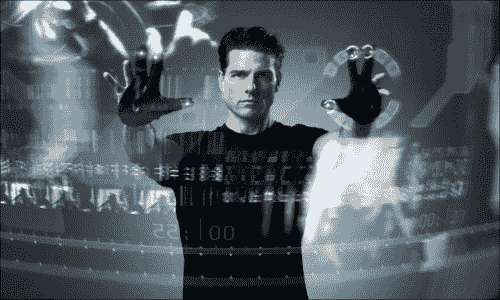

# 第 8 章 使用 JavaFX 开发交互式 Leap Motion 应用

现在，我们来到了本书最激动人心的部分，我们将深入探讨人机交互的全新非接触时代，通过将肢体语言转化为指令来控制周围的物体和计算机。

每天我们都能注意到，输入界面正逐渐减少对鼠标的依赖，而更倾向于非接触式输入。*手势*是当今人类与机器进行自然交流的方式之一。

几十年来，动作控制一直存在于我们对未来的想象中。我们目睹了流行媒体中的超级英雄、疯狂科学家和太空牛仔仅凭挥手就能控制数字体验。

汤姆·克鲁斯通过手势进行运算

我们一直被这些强大、自然且直观的交互方式所吸引——想象着如果自己也能拥有这种能力会是什么样子。例如，*《星际迷航》的全息甲板*和*《少数派报告》的犯罪预判计算机*。你还记得汤姆·克鲁斯在后者中如何通过手势在透明显示屏上进行运算吗？所有这些都散发出一种力量感和掌控感，同时伴随着矛盾的感觉：简单、轻松、直观和人性化。简而言之，这些体验感觉就像魔法一样。

目前市场上有几种设备允许我们仅用身体的部分部位与计算机交互：微软游戏主机 **Xbox** 的许多游戏都使用 **Kinect** 控制器来识别用户的肢体动作。肌电臂环可以检测你肌肉的运动并将其转化为手势，从而让你与计算机交互。Leap Motion 控制器可以识别用户的手和手指，并将动作和手势传输给计算机。

在本章中，你将学习如何使用 **Leap Motion** 设备进行手势识别，这是一款出色的设备，允许采用非接触式方法来开发增强型的 JavaFX 应用程序。

以下是本章将讨论的部分主题：

*   介绍 Leap 控制器，其工作原理以及如何获取
*   获取并安装 SDK，配置其驱动程序，并验证其是否正常工作
*   基于 Leap 的应用构建模块基础
*   开发令人惊叹的非接触式 JavaFX 应用程序

