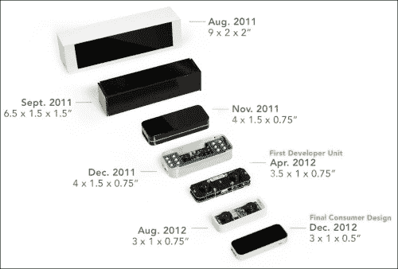
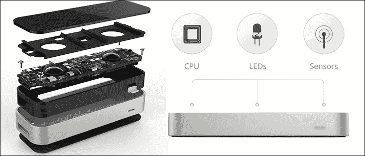
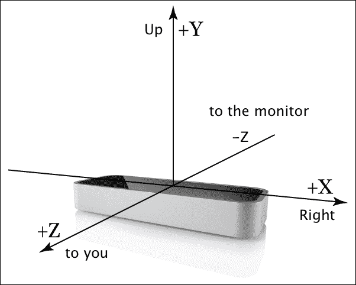
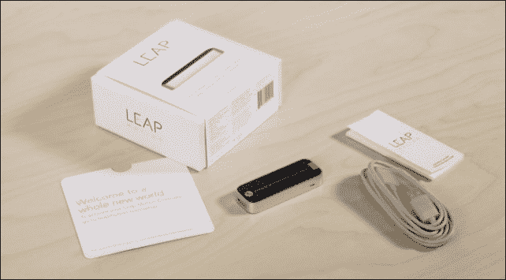
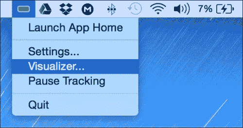
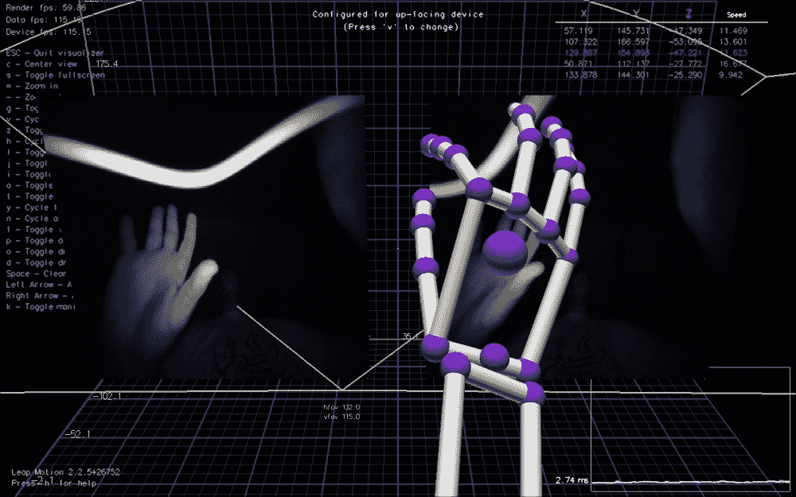

# Leap Motion 控制器

这是一款非常小巧的设备，高 13 毫米，宽 30 毫米，深 76 毫米，重 45 克（*最终尺寸：0.5 英寸 x 1.2 英寸 x 3 英寸*）。在你的计算机上运行 Leap Motion 软件后，只需将控制器插入 Mac 或 PC 的 USB 接口即可使用（无需外部电源）。

它能够检测其上方区域，几乎实时（200-300 fps）捕捉你手部和手指的单独运动，并将手势转化为计算机上运行应用程序中的不同操作。这款售价 79.99 美元、于 2013 年推出的设备被称为 Leap Motion 控制器。

Leap Motion 尺寸与人类手掌对比

从开发者的角度来看，该设备允许设计仅通过用户*手部*和*手指*的手势和动作就能控制的应用程序，就像在*《少数派报告》*中一样！

它能感知你自然移动手部的方式，让你以一种全新的方式使用计算机——指向、挥动、伸手、抓取或拾起某物并移动它。你可以做到以前从未想象过的事情。

看看你的手；仅仅一只手就有 29 块骨头、29 个关节、123 条韧带、48 条神经和 30 条动脉。这非常精密和复杂。该控制器已经非常接近完全解析这一切。

实际上，仔细想想，Leap Motion 的魔力在于软件，但该公司在硬件上付出了巨大努力来实现其技术。自 2011 年成立以来，它一直在开发中。其演变过程如下图所示：

Leap Motion 控制器的演变

## 工作原理

Leap Motion 的技术依赖于特殊的接收器硬件和定制软件，能够以 1/100 毫米的精度追踪运动，且无明显延迟。Leap Motion 控制器拥有 *150 度* 的视野，并以 290 fps 的速率追踪单个手部和全部 10 根手指。

该设备的主要硬件由三个红外 LED 和两个单色红外 (IR) 摄像头组成。当 LED 生成红外光的 3D 点阵图案时，摄像头以近 290 fps 的速率扫描反射数据。半径 50 厘米内的所有物体都将被扫描和处理，分辨率为 0.01 毫米。该设备的主要组件如下图所示：

Leap Motion 控制器硬件层及内部组件

这就是计算机交互的未来——Leap Motion 极其快速和精确的自然用户界面，它以非常精确的方式将所有运动数据发送到计算机。这些数据将在主机上由 Leap Motion 专有软件检测算法进行分析，任何支持 Leap 的应用程序都可以直接与之交互，而无需使用任何其他物理输入设备。

### 坐标系

在应用程序中使用 Leap Motion 控制器时，将从控制器接收到的坐标值映射到适当的 JavaFX 坐标系是一项基本任务。

从之前的讨论中，你可以观察到该设备能够在超宽的 150 度视野和用于深度的 z 轴范围内检测手部、手指和反光工具。这意味着你可以像在现实世界中一样在 3D 空间中移动你的手。

设备坐标系使用右手笛卡尔坐标系，原点位于设备中心。如下图所示：

以设备为中心的坐标系

每次设备扫描并将你的手部运动分析为数据时，都会生成一个 Frame 对象，其中包含所有已处理和追踪的数据列表（以实例形式呈现，如手、手指和工具），以及在该帧中发现的一组运动手势（*滑动、点击或画圈*）。

你可能已经注意到，y 轴的正方向与包括 JavaFX 在内的大多数计算机图形系统中的向下方向相反。

然而，数据是相对于设备位置而非屏幕位置（正如我们习惯的鼠标和触摸事件那样）这一事实，极大地改变了我们需要思考的方式。

幸运的是，API 提供了几种有用的方法，可以随时确定我们的手和手指指向的位置。

## 获取设备

受到这项神奇技术的启发，我们需要着手使用该设备进行开发。因此，我们首先需要获取一个。

该设备可从亚马逊、百思买等众多供应商处购买。当然，你也可以直接从 Leap Motion 商店购买（[`store-world.leapmotion.com`](http://store-world.leapmotion.com)）。

我是在 2014 年底购买的设备，现在你或许能在某些商店找到特别折扣。

### 包装内容

当你购买 Leap Motion 套装时，至少应包含下图所示的物品：

Leap Motion 套装内容

在撰写本文时，套装包含：

*   Leap Motion 控制器
*   两根定制长度的 USB 2.0 数据线
*   欢迎卡
*   重要信息指南

## Leap SDK 入门

现在我们已经有了硬件，接下来需要安装软件并开始开发。这非常简单；只需将鼠标指向你常用浏览器的地址栏，输入网址 [`developer.leapmotion.com/downloads`](https://developer.leapmotion.com/downloads)，然后按下 *Enter* 键即可。

在撰写本文时，最新版本是 SDK 2.2.6.29154。点击你的操作系统图标开始下载支持的版本。或者，直接点击标有 **Download SDK 2.2.6.29154 for OSX**（适用于 Mac OS X）的绿色按钮。这将自动检测你的电脑/笔记本操作系统，并允许你下载适合的 SDK。

### 安装控制器驱动和软件

安装过程以及让设备准备好进行交互只需几个简单步骤。下载`zip`文件后，解压并运行软件安装程序，一切就绪：

1.  下载、解压并运行软件安装程序。
2.  安装完成后，连接你的 Leap Motion 控制器并打开可视化工具，如下方截图所示：

    运行可视化工具

3.  SDK 包含一个 `LeapJava.jar` 库以及一系列用于控制器集成的原生库。在系统上集成 `LeapJava.jar` 的一个简单方法是在 Linux 或 Windows 上将该 JAR 文件添加到 `<JAVA_HOME>/jre/lib/ext` 目录（或在 Mac 上添加到 `/Library/Java/Extensions` 目录）。
4.  将原生库（Windows 下的 `LeapJava.dll`、`Leap.dll` 和 `Leapd.dll`；Mac 下的 `libLeapJava.dylib` 和 `libLeap.dylib`；Linux 下的 `libLeapJava.so` 和 `libLeap.so`）复制到 `<JAVA_HOME>/jre/bin` 文件夹。
5.  或者，你也可以直接将 JAR 文件作为依赖项添加到每个项目中，并通过 VM 参数 `-Djava.library.path=<原生库路径>` 加载原生库。

    ### 注意

    SDK 还包含许多基于支持语言的示例，包括 `HelloWorld.java` 示例，这是一个非常好的起点，可以帮助你理解如何将控制器与 Java 应用程序集成。

#### 验证是否正常工作

如果一切正常，任务栏通知区域（Windows）或菜单栏（Mac）上应该会出现一个小的 Leap Motion 图标，并且该图标应为绿色，如上图所示。设备上的 LED 指示灯应亮起绿光，并且*朝向您以确保设备方向正确*。

如果你能够交互并在可视化工具打开时看到手指和手的可视化图像，如下方截图所示，那么就可以开始开发了。

Leap Motion 诊断可视化工具应用程序

## 支持的语言

在深入探讨我们的应用程序之前，我想提一下，Leap Motion SDK 支持多种语言，包括 Java 以及其他语言，例如用于 Web 的 JavaScript、C#、C++、Python、Unity、Objective-C 和 Unreal 游戏引擎。

