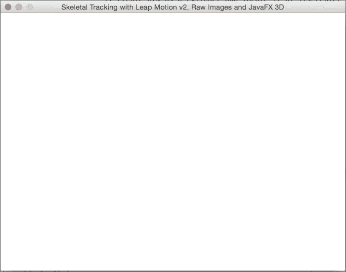
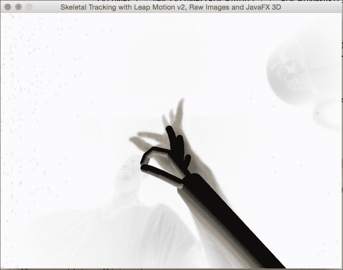
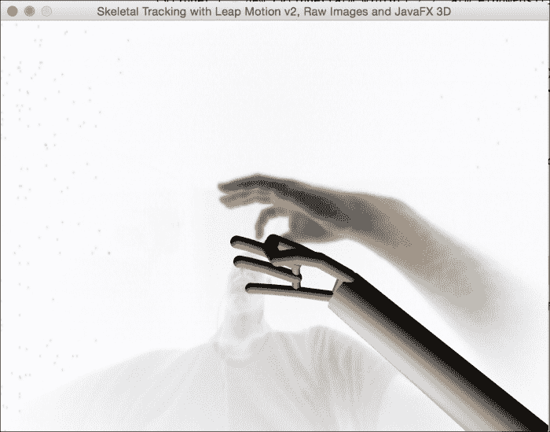

# Leap JavaFX 应用程序

和你一样，我也迫不及待地想开始开发过程，现在你将学习如何与连接到 Leap Motion 设备的基于 JavaFX 8 3D 的应用程序进行非接触式交互。

鉴于本书尚未介绍 3D API，这是一个很好的机会来简要描述 3D API，并将 Leap Motion v2 骨骼建模（3D 手部）以及一些 3D 交互引入到我们的 JavaFX 应用程序中。

Leap Motion API v2.0 引入了一种新的骨骼跟踪模型，该模型提供有关手部和手指的额外信息，预测未清晰可见的手指和手部的位置，并改进整体跟踪数据。有关 API 的更多信息，请访问 [`developer.leapmotion.com/documentation/java/devguide/Intro_Skeleton_API.html?proglang=java`](https://developer.leapmotion.com/documentation/java/devguide/Intro_Skeleton_API.html?proglang=java)。

我们将构建并展示如何将 Leap Motion v2 的新骨骼模型轻松集成到 JavaFX 3D 场景中。我们将使用 JavaFX 提供的预定义 3D 形状 API 来快速创建开箱即用的 3D 对象。这些形状包括我们将在应用程序中使用的长方体、圆柱体和球体。

## JavaFX 3D API 概览

3D 意味着*三维*或具有*宽度*、*高度*和*深度*（或*长度*）的物体。我们的物理环境是三维的，我们每天都在三维空间中活动。

JavaFX 3D 图形库包含 Shape3D API，JavaFX 中有两种类型的 3D 形状：

*   **预定义形状**：这些形状旨在让你更轻松地快速创建开箱即用的 3D 对象。这些形状包括长方体、圆柱体和球体。
*   **用户定义形状**：JavaFX Mesh 类层次结构包含 `TriangleMesh` 子类。三角形网格是 3D 布局中最常用的一种网格。

在我们的应用程序中，我们将使用预定义形状。有关 JavaFX 3D API 及示例的更多信息，请访问 [`docs.oracle.com/javase/8/javafx/graphics-tutorial/javafx-3d-graphics.htm`](http://docs.oracle.com/javase/8/javafx/graphics-tutorial/javafx-3d-graphics.htm)。

## 更多学习资源

一个丰富的资源是 SDK 附带的 `HelloWorld.java` 示例，它将帮助你在 Leap Motion 控制器和普通 Java 应用程序之间进行开发和集成。

另一个讨论与 Java 集成的资源是 Leap Motion 文档中的 *Java 开发入门* 部分，可访问 [`developer.leapmotion.com/documentation/java/devguide/Leap_Guides.html`](https://developer.leapmotion.com/documentation/java/devguide/Leap_Guides.html)。

## 基本应用程序结构

在查看了 `HelloWorld.java` 示例和文档示例后，你会注意到以下几点：

*   我们需要一个 `Controller` 对象，用于建立 Leap 设备与应用程序之间的连接。
*   我们需要一个 `Listener` 子类来处理来自控制器的事件。
*   在 `onConnect()` 方法中启用手势跟踪。
*   该类中的主要方法是 `onFrame()`，这是一个 `回调` 方法，当包含运动跟踪数据的新的 `Frame` 对象可用时被调度。该对象包含手部、手指或工具的列表，以及多个表示其位置、方向和运动速度的向量。
*   如果启用了手势，我们还将根据对最近帧的分析获得已发现手势的列表。此外，你还可以了解手势的状态，是刚刚开始、正在进行还是已经结束。


### JavaFX 8 3D 应用程序

我们在此讨论的应用程序是一个复杂的 JavaFX 8 3D 应用程序，它将帮助你理解基于 Leap 的应用程序开发结构，与设备交互以识别*手部位置*，并通过*手势*交互在 3D 环境中为我们的手部建模。

你可以在后面的示例部分找到更多资源，包括使用 JavaFX 开发基于 Leap 的应用程序的更高级概念。

在此应用程序中，我们将以圆柱体和球体的形式检测骨骼、手臂和关节（位置和方向），以便在我们的 JavaFX 应用程序 `SubScene` 中为手部进行 3D 建模。然后，我们将检测它们的位置，以模拟我们在 Leap Motion 设备上方的真实手部运动。

我们还将添加原始 `image`，以便你可以在应用程序背景中看到模型和你的真实手部。

该应用程序由三个类组成：

*   `LeapListener.java`：这个类是一个监听器，它与 Leap Motion 控制器线程交互，将所有分析后的数据（手臂、骨骼、手指和关节）传输到 JavaFX 应用程序。
*   `LeapJavaFX.java`：这个类是一个 JavaFX 应用程序线程，它将与 `LeapListener.java` 交互，以便创建 3D 形状（在每一帧上），而无需跟踪之前的形状。这得益于 Observable JavaFX bean 属性的强大功能，它允许从 Leap 线程传输的数据在 JavaFX 线程中渲染。
*   `Pair.java`：这是一个便捷的小型配对类，用于存储每个关节中连接的两块骨骼。

那么，让我们开始看看如何实现这一点。

### 提示

你必须通过在 **常规** 选项卡下勾选 **允许图像** 选项来在 Leap Motion 控制面板上启用图像，并确保在 **追踪** 选项卡下禁用 **稳健模式** 选项以获得更高质量的图像。

### 工作原理

首先，我们将解释我们应用程序的主要桥梁，即 Leap 事件监听器 `LeapListener.java`。

开发 JavaFX 应用程序时的主要关注点是如何将 JavaFX 线程与其他非 JavaFX 线程混合，在我们的案例中，这个非 JavaFX 线程是以非常高的速率处理事件的 Leap Motion 事件 `Listener` 子类。

为了将这些事件引入 JavaFX 线程，我们将在 `LeapListener.java` 类中使用 `BooleanProperty` 对象。由于我们只监听 `doneList` 对象的变化，我们不需要列表本身也是可观察的，因为它们会在任何变化（添加一块骨骼）时触发事件。

这就是为什么它们是普通列表，并且我们只使用一个布尔可观察属性，在创建每个 Leap `Frame` 对象中的所有列表后将其设置为 true：

```
private final BooleanProperty doneList= new
SimpleBooleanProperty(false);
private final List<Bone> bones=new ArrayList<>();
private final List<Arm> arms=new ArrayList<>();
private final List<Pair> joints=new ArrayList<>();
private final List<WritableImage> raw =new ArrayList<>();
```

为了获取原始图像，我们必须在 `onInit()` 中设置此策略，并且出于隐私原因，用户还必须在 Leap Motion 控制面板中为任何应用程序启用该功能，才能获取原始相机图像。

```
@Override
public void onInit(Controller controller){
 controller.setPolicy(Controller.PolicyFlag.POLICY_IMAGES);
}
```

（*如你所知，如果你想处理手势，就在这里启用此功能，所以你可以暂时将它们注释掉。*）

让我们继续创建 Frame 方法：

```
@Override
public void onFrame(Controller controller) {
  Frame frame = controller.frame();
  doneList.set(false);
  doneList.set(!bones.isEmpty() || !arms.isEmpty());
}
public BooleanProperty doneListProperty() {
  return doneList;
}
```

对于每一帧，重置 `doneList`，处理数据，最后如果存在骨骼或手臂（如果手没有放在 Leap 上方，帧仍会被处理），则将其设置为 `true`。公开该属性以便在 JavaFX 应用程序中监听。

现在处理帧对象数据。首先，处理图像（这也可以在最后完成）。在每一帧清除列表，然后检索图像（来自左、右相机）。如果你想了解其工作原理，Leap 文档非常有帮助。请访问 [`developer.leapmotion.com/documentation/java/devguide/Leap_Images.html`](https://developer.leapmotion.com/documentation/java/devguide/Leap_Images.html)。

实际上，这段代码是第一个示例的一部分，添加了 `PixelWriter` 来生成 JavaFX 图像。由于 Leap 提供的是亮像素，我对其进行了取反 *(1- (r|g|b))* 以获得负片图像，使手部更清晰可见。同时，我还将图像从左到右翻转，如下所示：

```
(newPixels[i*width+(width-j-1)]).raw.clear();
ImageList images = frame.images();
for(Image image : images){
  int width = (int)image.width();
  int height = (int)image.height();
  int[] newPixels = new int[width * height];
  WritablePixelFormat<IntBuffer> pixelFormat = PixelFormat.getIntArgbPreInstance();
  WritableImage wi=new WritableImage(width, height);
  PixelWriter pw = wi.getPixelWriter();
  //从 Image 对象获取包含图像数据的字节数组
  byte[] imageData = image.data();

//将图像数据复制到显示对象中
  for(int i = 0; i < height; i++){
  for(int j = 0; j < width; j++){
    //转换为无符号数并移位到正确位置
    int r = (imageData[i*width+j] & 0xFF) << 16;
    int g = (imageData[i*width+j] & 0xFF) << 8;
    int b = imageData[i*width+j] & 0xFF;
    // 反转图像
    newPixels[i*width+(width-j-1)] = 1- (r | g | b);
  }
  }
  pw.setPixels(0, 0, width, height, pixelFormat, newPixels, 0,width);
  raw.add(wi);
}
```

然后清除骨骼、手臂和关节列表，如下代码所示：

```
bones.clear();
arms.clear();
joints.clear();
if (!frame.hands().isEmpty()) {
Screen screen = controller.locatedScreens().get(0);
if (screen != null && screen.isValid()){
```


获取骨骼列表；对于找到的每根手指，遍历该手指的骨骼类型（最多 5 种），以避开无名指和中指的掌骨。代码如下：

```
for(Finger finger : frame.fingers()){
  if(finger.isValid()){
  for(Bone.Type b : Bone.Type.values()) {
    if((!finger.type().equals(Finger.Type.TYPE_RING) &&!finger.type().equals(Finger.Type.TYPE_MIDDLE)) ||!b.equals(Bone.Type.TYPE_METACARPAL)){
          bones.add(finger.bone(b));
      }
    }
  }
}
```

现在我们将遍历手部列表，获取每只手的手臂并将其添加到手臂列表中，如下所示：

```
for(Hand h: frame.hands()){
  if(h.isValid()){
  // arm
  arms.add(h.arm());
```

接下来获取手指关节。详细解释如何获取每个关节会有些复杂。基本上，我会找到每只手的手指，识别出除拇指外的四根手指。代码如下：

```
FingerList fingers = h.fingers();
Finger index=null, middle=null, ring=null, pinky=null;
for(Finger f: fingers){
  if(f.isFinger() && f.isValid()){
    switch(f.type()){
    case TYPE_INDEX: index=f; break;
    case TYPE_MIDDLE: middle=f; break;
    case TYPE_RING: ring=f; break;
    case TYPE_PINKY: pinky=f; break;
    }
  }
}
```

识别出手指后，我只需定义每对手指之间的关节（前三个关节）以及手腕关节（最后一个）。代码如下：

```
// joints
if(index!=null && middle!=null){
  Pair p=new Pair(index.bone(Bone.Type.TYPE_METACARPAL).nextJoint(),middle.bone(Bone.Type.TYPE_METACARPAL).nextJoint());
  joints.add(p);
  }
  if(middle!=null && ring!=null){
    Pair p=new Pair(middle.bone(Bone.Type.TYPE_METACARPAL).nextJoint(),
    ring.bone(Bone.Type.TYPE_METACARPAL).nextJoint());
    joints.add(p);
  }
  if(ring!=null && pinky!=null){
    Pair p=new Pair(ring.bone(Bone.Type.TYPE_METACARPAL).nextJoint(),
    pinky.bone(Bone.Type.TYPE_METACARPAL).nextJoint());
    joints.add(p);
  }
  if(index!=null && pinky!=null){
    Pair p=new Pair(index.bone(Bone.Type.TYPE_METACARPAL).prevJoint(),pinky.bone(Bone.Type.TYPE_METACARPAL).prevJoint());
    joints.add(p);
  }
```

最后，上述代码返回骨骼集合的一个全新副本，以避免在遍历该列表时出现并发异常。请注意，Leap 的帧率非常高。在性能强劲的计算机上，大约为 5 - 10 毫秒。代码如下：

```
public List<Bone> getBones(){
 return bones.stream().collect(Collectors.toList());
}
```

这比 JavaFX 的脉冲（60 fps，约 16 毫秒）更快，因此在渲染骨骼时列表可能会发生变化。通过这种*克隆*方法，我们避免了任何并发问题。

LeapJavaFX 应用程序的监听器方法如下：

```
Override
  public void start(Stage primaryStage) {
    listener = new LeapListener();
    controller = new Controller();
    controller.addListener(listener);
```

初始化 Leap 监听器类和控制器，然后添加监听器：

```
final PerspectiveCamera camera = new PerspectiveCamera();
camera.setFieldOfView(60);
camera.getTransforms().addAll(new Translate(-320,-480,-100));
final PointLight pointLight = new PointLight(Color.ANTIQUEWHITE);
pointLight.setTranslateZ(-500);
root.getChildren().addAll(pointLight);
```

为 3D `subScene` 创建一个透视相机，将其平移到屏幕中间、底部并朝向用户。同时，添加一些点光源。代码如下：

```
rawView=new ImageView();
rawView.setScaleY(2);
```

为 Leap 图像创建一个 `ImageView`，在关闭鲁棒模式（在 Leap 控制面板中取消勾选该选项）时，图像尺寸为 640 x 240，因此我们在 Y 轴上将其放大，以获得更清晰的图像。代码如下：

```
Group root3D=new Group();
root3D.getChildren().addAll(camera, root);
SubScene subScene = new SubScene(root3D, 640, 480, true,
SceneAntialiasing.BALANCED);
subScene.setCamera(camera);
StackPane pane=new StackPane(rawView,subScene);
Scene scene = new Scene(pane, 640, 480);
```

创建一个包含相机和内部灯光组的组，作为 `subScene` 的根节点。请注意，为了获得更好的渲染效果，启用了深度缓冲和抗锯齿。相机也被添加到 `subScene` 中。

主根节点将是一个 `StackPane`：底层是 `ImageView`，顶层是透明的 `SubScene`。代码如下：

```
final PhongMaterial materialFinger = new PhongMaterial(Color.BURLYWOOD);
final PhongMaterial materialArm = new PhongMaterial(Color.CORNSILK);
```

为手指和手臂设置材质，并赋予漫反射颜色：

```
listener.doneListProperty().addListener((ov,b,b1)->{
  if(b1){
    ...
  }
});
```

我们监听 `doneList` 的变化。每当它为 `true` 时（在每一帧之后！），我们就处理 3D 手部的渲染：

```
List<Bone> bones=listener.getBones();
List<Arm> arms=listener.getArms();
List<Pair> joints=listener.getJoints();
List<WritableImage> images=listener.getRawImages();
```

首先，获取骨骼、手臂和关节集合的全新副本。然后，如果在 JavaFX 线程中存在有效图像，我们就在 `ImageView` 上设置图像，并移除根节点中除灯光外的所有子节点（这样我们就可以重新创建手部骨骼）：

```
Platform.runLater(()->{
    if(images.size()>0){
    // left camera
    rawView.setImage(images.get(0));
  }
  if(root.getChildren().size()>1){
    // clean old bones
    root.getChildren().remove(1,root.getChildren().size()-1);
}
```

骨骼 遍历列表并将骨骼添加到场景中。如果集合发生变化，我们在遍历其副本时不会出现任何并发异常。

```
bones.stream().filter(bone -> bone.isValid() && bone.length()>0).forEach(bone -> {
```

现在为每根骨骼创建一个圆柱体。这涉及一些计算。如果你想深入了解细节，可以将每根骨骼视为一个具有位置和方向的向量。创建一个垂直圆柱体，其半径是骨骼宽度的一半，高度与骨骼长度相同。然后为其指定材质。代码如下：

```
final Vector p=bone.center();
// create bone as a vertical cylinder and locate it at its center position
Cylinder c=new Cylinder(bone.width()/2,bone.length());
c.setMaterial(materialFinger);
```

然后我们计算实际骨骼方向与垂直方向的叉积；这将得到旋转的垂直向量。（符号因坐标系变化而异）。`ang` 对象是这两个向量之间的夹角。可以通过平移至骨骼中心并围绕给定向量旋转 `ang` 角度来应用变换。代码如下：

```
// translate and rotate the cylinder towards its direction
final Vector v=bone.direction();
Vector cross = (new Vector(v.getX(),-v.getY(), v.getZ())).cross(new Vector(0,-1,0));
double ang=(new Vector(v.getX(),-v.getY(),-v.getZ())).angleTo(new Vector(0,-1,0));
c.getTransforms().addAll(new Translate(p.getX(),-p.getY(),-p.getZ()),new Rotate(-Math.toDegrees(ang), 0, 0, 0, new Point3D(cross.getX(),-cross.getY(),cross.getZ())));
  // add bone to scene
root.getChildren().add(c);
```

现在在每根骨骼的起点和终点添加球体：

```
// add sphere at the end of the bone
Sphere s=new Sphere(bone.width()/2f);
s.setMaterial(materialFinger);
s.getTransforms().addAll(new Translate(p.getX(),-p.getY()+bone.length()/2d,-p.getZ()),new Rotate(-Math.toDegrees(ang), 0, -bone.length()/2d, 0, new Point3D(cross.getX(),-cross.getY(),cross.getZ())));
  // add sphere to scene
  root.getChildren().add(s);
  // add sphere at the beginning of the bone
  Sphere s2=new Sphere(bone.width()/2f);
  s2.setMaterial(materialFinger);
  s2.getTransforms().addAll(new Translate(p.getX(),-p.getY()-bone.length()/2d,-p.getZ()),new Rotate(Math.toDegrees(ang), 0, bone.length()/2d, 0, new Point3D(cross.getX(),-cross.getY(),cross.getZ())));
  // add sphere to scene
  root.getChildren().add(s2);
});
```


现在来处理关节；我们再次使用圆柱体。两个连接元素之间的距离决定了长度，我们通过获取位置和方向来生成并变换圆柱体。代码如下：

```
joints.stream().forEach(joint->{
  double length=joint.getV0().distanceTo(joint.getV1());
  Cylinder c=new Cylinder(bones.get(0).width()/3,length);
  c.setMaterial(materialArm);
  final Vector p=joint.getCenter();
  final Vector v=joint.getDirection();
  Vector cross = (new Vector(v.getX(),-v.getY(), v.getZ())).cross(new Vector(0,-1,0));
  double ang = (new Vector(v.getX(),-v.getY(),-v.getZ())).angleTo(new Vector(0,-1,0));
  c.getTransforms().addAll(new Translate(p.getX(),-p.getY(),-p.getZ()), new Rotate(-Math.toDegrees(ang), 0, 0, 0, new Point3D(cross.getX(),-cross.getY(),cross.getZ())));
  // 将关节添加到场景中
  root.getChildren().add(c);
});
```

最后，我们通过肘部和手腕之间的距离来获取长度。所有这些信息都可以在 API 中找到：[`developer.leapmotion.com/documentation/java/api/Leap.Arm.html`](https://developer.leapmotion.com/documentation/java/api/Leap.Arm.html)。代码如下：

```
arms.stream().
filter(arm->arm.isValid()).
forEach(arm->{
  final Vector p=arm.center();
  // 将手臂创建为圆柱体，并将其定位在中心位置
  Cylinder c=new Cylinder(arm.width()/2,arm.elbowPosition().
  minus(arm.wristPosition()).magnitude());
  c.setMaterial(materialArm);
  // 将圆柱体旋转至其方向
  final Vector v=arm.direction();
  Vector cross = (new Vector(v.getX(),-v.getY(),-v.getZ())).cross(new Vector(0,-1,0));
  double ang=(new Vector(v.getX(),-v.getY(),-v.getZ())).
  angleTo(new Vector(0,-1,0));
  c.getTransforms().addAll(new Translate(p.getX(),-p.getY(),-p.getZ()),new Rotate(- Math.toDegrees(ang), 0, 0, 0, new Point3D(cross.getX(),- cross.getY(),cross.getZ())));
  // 将手臂添加到场景中
  root.getChildren().add(c);
});
```

### 运行应用程序

恭喜！现在连接你的 Leap 控制器（Leap 图标应为绿色）并运行你的应用程序。如果一切正常，你最初应该会看到一个空的应用程序场景，如下面的截图所示：



Leap JavaFX 应用程序的初始运行

移动并挥动你的手，你手部的骨骼模型应该会随着你真实的手在背景中显现，并响应你的真实动作，如下所示：



Leap JavaFX 应用程序与 Leap 控制器的交互

尝试不同的手臂或手部姿势和位置；你应该会在你的 JavaFX 应用程序场景中看到相应的复制效果，如下面的截图所示：



Leap JavaFX 应用程序与 Leap 控制器的交互（不同手部姿势）

