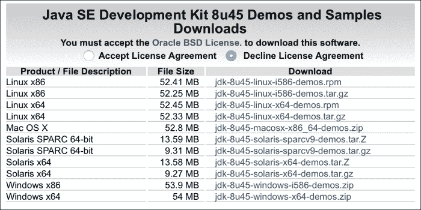
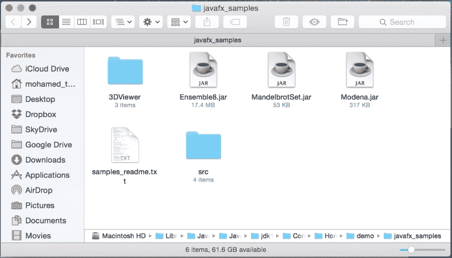
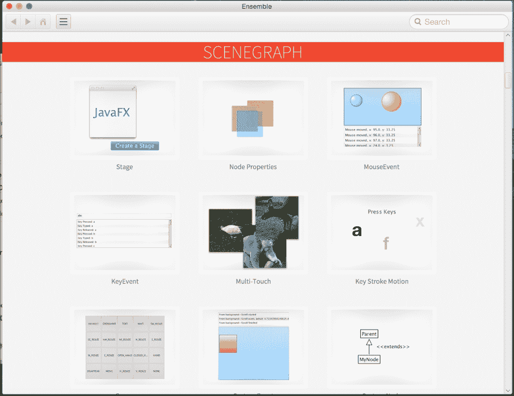
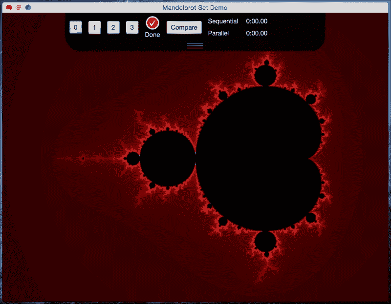
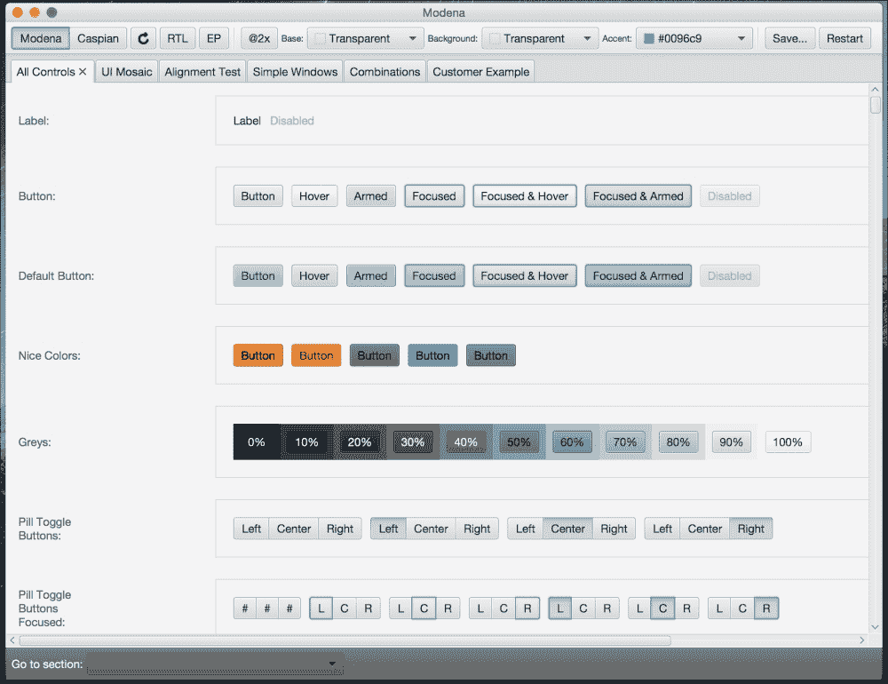
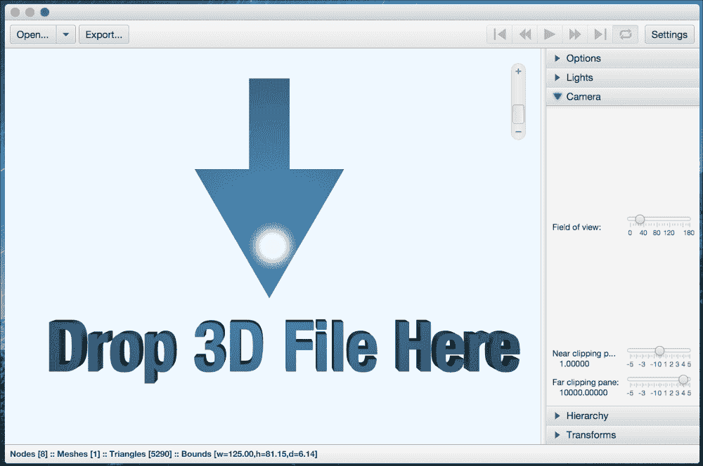

# 附录 A. 成为 JavaFX 专家

你的 JavaFX 8 之旅会止步于此吗？绝对不会！JavaFX 是一个非常庞大的主题，它每天都在发展，从 Oracle 发布的核心版本（包含新特性、功能和稳定性），到许多社区个人和公司创建的第三方库，以填补你可能遇到的任何空白，或者围绕它发明核心中不存在的新功能。

当然，通过本书，我无法涵盖所有 JavaFX 8 主题。相反，我试图触及许多 JavaFX 领域的表面，并打开关键主题，以便通过找到你自己的方法并了解如何自行操作，让你的探索之旅更加轻松。

然而，我们还通过开发传统的 Web 和桌面应用程序讨论了许多其他工具和技术，然后转向了一个更高级且市场需求更大的领域——移动开发。

我们通过了解**物联网**（**IoT**，即信息技术的下一个时代）来探索未来，我们涵盖的主题就越有趣。我们曾在电影中多次看到运动并想象过它，通过使用令人惊叹的 Leap Motion v2 小工具开发增强型非接触式 JavaFX 8，我们让梦想成真。

要成为 JavaFX 专家并获得其他经验，还有很多内容本书没有讨论。

*那么，我们接下来该何去何从？*

现在，既然你已经拥有许多可运行的 JavaFX 8 应用程序，并了解了它在多个平台和硬件上的工作原理，剩下的就取决于你和你的创造力了。

加入 Facebook、Twitter 上的社区，关注技术专家的博客、JavaFX 博客 [`blogs.oracle.com/javafx/`](http://blogs.oracle.com/javafx/)，并在 [`fxexperience.com/`](http://fxexperience.com/) 上查找新闻、演示和见解。最重要的是，要动手实验。

在本章末尾，请务必查看当今在生产环境中使用 JavaFX 的许多*框架*、*库*和*项目*。

## 官方文档

*   **JavaFX 文档**：这是一个指向所有 JavaFX 资源、新闻、经验、视频、书籍、API 文档、技术文章和教程的绝佳资源：

    [`www.oracle.com/technetwork/java/javase/documentation/javafx-docs-2159875.html`](http://www.oracle.com/technetwork/java/javase/documentation/javafx-docs-2159875.html)

*   **Java 平台标准版 (Java SE) 8**：其中的*客户端技术*包含许多涵盖所有 JavaFX 主题的示例：[`docs.oracle.com/javase/8/javase-clienttechnologies.htm`](http://docs.oracle.com/javase/8/javase-clienttechnologies.htm)


## JavaFX 示例

学习 JavaFX 8 的最佳资源之一是 Java 开发工具包 8 的示例和演示，其中包含一个 JavaFX 演示文件夹，里面有许多精彩且高级的应用程序，涵盖了所有 JavaFX 主题，并附带了可供您自行实验的源代码。

您只需访问以下链接即可下载示例：[`www.oracle.com/technetwork/java/javase/downloads/jdk8-downloads-2133151.html`](http://www.oracle.com/technetwork/java/javase/downloads/jdk8-downloads-2133151.html)，然后转到 **Java SE Development Kit 8u45 Demos and Samples Downloads** 表格，选中 **Accept License Agreement** 单选按钮，并点击与您操作系统相关的 zip 文件链接，如下图所示：



下载 JDK 和 JavaFX 8 演示及示例

`samples` zip 文件包含可运行的预构建示例，以及每个示例的 NetBeans 项目文件。

解压 zip 文件后，会生成以下目录结构：

```
--src  (包含每个示例的 NetBeans 项目)
 --<Sample1>
  --nbproject
  --src
  --build.xml
  --manifest.mf
  --<Sample2>
  <sample1>.jar(作为独立应用程序运行示例)
<sample2>.jar
```



JavaFX 示例文件夹内容

任何 `sample.jar` 都可以作为独立应用程序运行；双击 JAR 文件，我们将看到四个应用程序：

1.  `Ensemble8.jar`：一个示例应用程序库，展示了大量 JavaFX 功能，包括动画、图表和控件。对于每个示例，您可以在所有平台上执行以下操作：

*   查看正在运行的示例并与之交互
    *   阅读其描述。

您只能在桌面平台上对每个示例执行以下操作：

*   复制其源代码
    *   对于某些示例，您可以调整示例组件的属性
    *   如果您已连接到互联网，还可以点击链接访问相关的 API 文档 *Ensemble8 也可以在 JavaFX for ARM（意味着在树莓派上运行）上运行*。

正在运行的 Ensemble8 应用程序

2.  `MandelbrotSet.jar`：一个示例应用程序，演示了使用 Java 并行 API 进行并行执行的优势。

该应用程序使用曼德勃罗集算法渲染图像，并提供了在输入参数范围内的直观导航。

更多信息请参见 `MandelbrotSet` 文件夹内的 `index.html` 文件。



正在运行的 MandelbrotSet 应用程序

3.  `Modena.jar`：一个示例应用程序，演示了使用 `Modena` 主题的 UI 组件外观。它让您可以选择对比 `Modena` 和 `Caspian` 主题，并探索这些主题的各个方面。 

正在运行的 Modena 应用程序

4.  `3DViewer.jar`：3DViewer 是一个示例应用程序，允许用户使用鼠标或触控板导航和检查 3D 场景。3DViewer 支持导入 **OBJ** 和 Maya 文件的部分功能。

对于 Maya 文件，还提供了导入动画的功能。（请注意，对于 Maya 文件，在保存为 Maya 文件时，应删除所有对象的构建历史。）3DViewer 还具有将场景内容导出为 Java 或 `FXML` 文件的功能。



正在运行的 3DViewer 应用程序

为了亲自尝试代码并实验您可能做出的任何更改，恭喜您，您有机会通过从 **NetBeans** 运行上述所有应用程序来实现，具体步骤如下：

5.  在 NetBeans IDE 中，点击工具栏上的 **Open Project**，或点击 **File** 菜单并选择 **Open Project**。
6.  导航到您解压示例的位置，在 `src` 目录中，选择一个项目，然后点击 **Open**。
7.  要在 NetBeans IDE 中运行应用程序，请在 **Project** 窗格中，右键点击该项目并选择 **Run**。

## Java SE 8

提醒一下，JavaFX 8 已内置于 Java 8 SDK 中。这意味着您只需下载 Java 8 SDK。Java 8 软件开发工具包及相关信息可从以下位置下载：

*   Oracle 技术网络上的 Java 8：

    [`oracle.com/java8`](http://oracle.com/java8)

*   Java 开发工具包：

    [`www.oracle.com/technetwork/java/javase/downloads/index.html`](http://www.oracle.com/technetwork/java/javase/downloads/index.html)

*   Java 8 有哪些新特性？让我们查看 Java 8 的新功能：

    [`www.oracle.com/technetwork/java/javase/8-whats-new-2157071.html`](http://www.oracle.com/technetwork/java/javase/8-whats-new-2157071.html)

*   Java SE 8 新特性之旅：

    [`tamanmohamed.blogspot.com/2014/06/java-se-8-new-features-tour-big-change.html`](http://tamanmohamed.blogspot.com/2014/06/java-se-8-new-features-tour-big-change.html)

### Java SE 8 API 文档和教程

Java 8 文档和指南位于以下链接：

*   Java SE 8 Javadoc API 文档：

    [`docs.oracle.com/javase/8`](http://docs.oracle.com/javase/8)

*   JavaFX 8 Javadoc API 文档：

    [`docs.oracle.com/javase/8/javafx/api`](http://docs.oracle.com/javase/8/javafx/api)

*   Java SE 8 概述文档：

    [`docs.oracle.com/javase/8/docs/index.html`](http://docs.oracle.com/javase/8/docs/index.html)

*   Java SE 8 教程：

    [`docs.oracle.com/javase/tutorial/tutorialLearningPaths.html`](http://docs.oracle.com/javase/tutorial/tutorialLearningPaths.html)

### Lambda 项目

Java SE 8 核心新增的语言特性是 lambda 表达式和流 API。以下参考资料是关于 Lambda 项目的路线图、博客和视频：

*   Lambda 现状，Brian Goetz (Oracle)：

    [`cr.openjdk.java.net/~briangoetz/lambda/lambda-state-final.html`](http://cr.openjdk.java.net/~briangoetz/lambda/lambda-state-final.html)

*   Java 8 揭秘：Lambda、默认方法和批量数据操作，Anton Arhipov：

    [`zeroturnaround.com/rebellabs/java-8-revealed-lambdas-defaultmethods-and-bulk-data-operations`](http://zeroturnaround.com/rebellabs/java-8-revealed-lambdas-defaultmethods-and-bulk-data-operations)

*   Java 8 中 Lambda 表达式和流的 10 个示例，Javin Paul：

    [`javarevisited.blogspot.com/2014/02/10-example-of-lambdaexpressions-in-java8.html`](http://javarevisited.blogspot.com/2014/02/10-example-of-lambdaexpressions-in-java8.html)

*   Java SE 8：Lambda 快速入门，Oracle：

    [`www.oracle.com/webfolder/technetwork/tutorials/obe/java/Lambda-QuickStart/index.html`](http://www.oracle.com/webfolder/technetwork/tutorials/obe/java/Lambda-QuickStart/index.html)

*   Java 8：闭包、Lambda 表达式解析，Frank Hinkel：

    [`frankhinkel.blogspot.com/2012/11/java-8-closures-lambdaexpressions.html`](http://frankhinkel.blogspot.com/2012/11/java-8-closures-lambdaexpressions.html)

### Nashorn

Java SE 8 包含一个名为 **Nashorn** 的新脚本引擎，这是一个用于 Java 运行时的全新改进版 JavaScript 引擎。该引擎使开发人员能够使用 JavaScript 语言编写应用程序。

以下链接和参考资料是描述 Nashorn 的文章和博客：

*   Oracle 的 Nashorn：JVM 的下一代 JavaScript 引擎，Julien Ponge：

    [`www.oraclejavamagazine-digital.com/javamagazine_twitter/20140102/?pg=60#pg60`](http://www.oraclejavamagazine-digital.com/javamagazine_twitter/20140102/?pg=60#pg60)

*   Open JDK 的 Nashorn 站点：

    [`wiki.openjdk.java.net/display/Nashorn/Main`](https://wiki.openjdk.java.net/display/Nashorn/Main)

*   Nashorn 博客：

    [`blogs.oracle.com/Nashorn`](https://blogs.oracle.com/Nashorn)


## JavaFX 属性和绑定

在 JavaFX 节点之间同步值时，属性和绑定至关重要。

以下是关于只读属性、监听器以及 JavaFX Bean 角色的优秀资源：

*   在 JavaFX 中创建只读属性，作者：Michael Heinrichs：

    [`blog.netopyr.com/2012/02/02/creating-read-only-properties-injavafx`](http://blog.netopyr.com/2012/02/02/creating-read-only-properties-injavafx)

*   未知的 JavaBean，作者：Richard Bair：

    [`weblogs.java.net/blog/rbair/archive/2006/05/the_unknown_jav.html`](https://weblogs.java.net/blog/rbair/archive/2006/05/the_unknown_jav.html)

*   使用 JavaFX 属性和绑定，作者：Scott Hommel：

    [`docs.oracle.com/javafx/2/binding/jfxpub-binding.htm`](http://docs.oracle.com/javafx/2/binding/jfxpub-binding.htm)

*   Pro JavaFX 8，（第 4 章，*属性和绑定*），作者：Johan Vos、James Weaver、Weiqi Gao、Stephen Chin 和 Dean Iverson，（Apress，2014 年）：

    [`www.apress.com/9781430265740`](http://www.apress.com/9781430265740)

*   Open Dolphin：一个 JavaFX MVC 框架（由 Canoo Engineering 的 Dierk Koenig 创立）：

    [`open-dolphin.org/dolphin_website/Home.html`](http://open-dolphin.org/dolphin_website/Home.html)

*   基于约定优于配置和依赖注入的 JavaFX MVP 框架（由 Adam Bien 创立）：

    [`afterburner.adam-bien.com`](http://afterburner.adam-bien.com)

## JavaFX 社区

你想参与 JavaFX 社区吗？请查看以下链接：

*   Java.net JavaFX 社区网站：

    [`www.java.net/community/javafx`](https://www.java.net/community/javafx)

*   FXExperience：JavaFX 新闻、演示和见解（@fxexperience）：

    [`fxexperience.com`](http://fxexperience.com)

*   Nighthacking（@_nighthacking）：由 Stephen Chin 主持。环游世界，了解 Java、JavaFX 和物联网的一切。精彩的现场演讲。

    [`nighthacking.com`](http://nighthacking.com)

*   Oracle 的 JavaFX 社区门户，涵盖真实世界用例、社区支持、第三方工具和 Open JFX：

    [`www.oracle.com/technetwork/java/javase/community/index.html`](http://www.oracle.com/technetwork/java/javase/community/index.html)

*   JFXtras：一个 JavaFX 自定义控件社区：

    [`jfxtras.org`](http://jfxtras.org)

*   ControlsFX：另一个自定义控件社区，由 Oracle 的 Jonathan Giles 发起：

    [`fxexperience.com/controlsfx`](http://fxexperience.com/controlsfx)

*   硅谷 JavaFX 用户组：

    [`www.meetup.com/svjugfx`](http://www.meetup.com/svjugfx)

*   硅谷 JavaFX 用户组直播流：

    [`www.ustream.tv/channel/silicon-valley-javafx-user-group`](http://www.ustream.tv/channel/silicon-valley-javafx-user-group)

*   Oracle 关于 JavaFX 的论坛：

    [`community.oracle.com/community/developer/english/java/javafx/javafx_2.0_and_later`](https://community.oracle.com/community/developer/english/java/javafx/javafx_2.0_and_later)

## Java SE / JavaFX 书籍与杂志

以下链接是与新的 Java SE 8 和 JavaFX 8 平台相关的新书标题：

*   一本精彩的书，*JavaFX 8：通过示例入门，第二版*，作者：Carl Dea、Mark Heckler、Gerrit Grunwald、José Pereda 和 Sean M. Phillips（Apress，2014 年。ISBN：978-1-4302-6460-6）

    [`www.apress.com/9781430264606`](http://www.apress.com/9781430264606)

*   Pro JavaFX 8，作者：Johan Vos、James Weaver、Weiqi Gao、Stephen Chin 和 Dean Iverson（Apress，2014 年。ISBN：978-1-4302-6574-0）

    [`www.apress.com/9781430265740`](http://www.apress.com/9781430265740)

*   Java 8 秘籍，作者：Josh Juneau（Apress，2014 年。ISBN：978-1-4302-6827-7）

    [`www.apress.com/9781430268277`](http://www.apress.com/9781430268277)

*   在 NetBeans 平台上进行 JavaFX 富客户端编程，作者：Paul Anderson 和 Gail Anderson（Addison-Wesley Professional，2014 年。ISBN：978-0321927712）：

    [`blogs.oracle.com/geertjan/entry/new_book_javafx_rich_client`](https://blogs.oracle.com/geertjan/entry/new_book_javafx_rich_client)

    [`www.amazon.com/JavaFX-Client-Programming-NetBeans-Platform/dp/0321927710`](http://www.amazon.com/JavaFX-Client-Programming-NetBeans-Platform/dp/0321927710)

*   精通 JavaFX 8 控件，作者：Hendrik Ebbers（Oracle Press，2014 年。ISBN：9780071833776）：

    [`mhprofessional.com/product.php?isbn=0071833773`](http://mhprofessional.com/product.php?isbn=0071833773)

    [`www.guigarage.com/javafx-book`](http://www.guigarage.com/javafx-book)

*   JavaFX 快速入门指南，作者：J.F. DiMarzio（Oracle Press，2014 年。ISBN：978-0071808965）：

    [`www.mhprofessional.com/product.php?isbn=0071808965`](http://www.mhprofessional.com/product.php?isbn=0071808965)

*   Java SE 8 极速入门，作者：Cay S. Horstmann（Addison-Wesley，2014 年。ISBN 978-0321927767）

    [`www.addison-wesley.de/9780321927767.html`](http://www.addison-wesley.de/9780321927767.html)

*   精通 Lambda 表达式，作者：Maurice Naftalin（Oracle Press，2014 年。ISBN：007-1829628）：

    [`www.mhprofessional.com/product.php?isbn=0071829628`](http://www.mhprofessional.com/product.php?isbn=0071829628)

*   Oracle 的 Java 杂志：

    [`www.oracle.com/technetwork/java/javamagazine/index.html`](http://www.oracle.com/technetwork/java/javamagazine/index.html)

> *感谢您付出的时间，希望您喜欢阅读本书，就像我喜欢为您撰写它一样。谢谢。*

