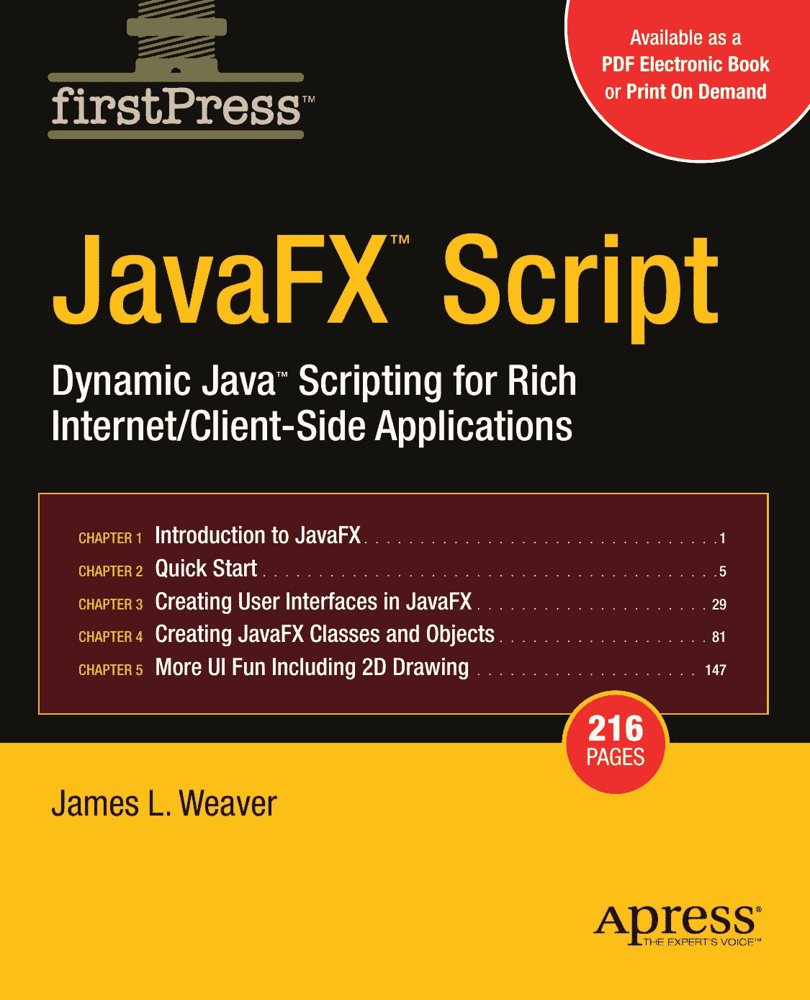


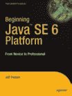

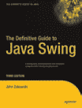


赋能 JAVA™ 开发者的生产力

提供形式：

Ja

**PDF 电子书**

Apress 的 **firstPress** 系列是您了解前沿技术的源泉。内容简短、高度精

或 **按需印刷版**

炼，并由专家撰写，Apress 的 firstPress 书籍为您节省时间和精力。它们包含 aFX

您通过密集研究或每隔一周参加一次会议（如果您有时间的话）才能获得的信息。它们涵盖了能让 *您* 始终走在技术曲线前沿的概念和技术。Apress 的 firstPress 书籍是真正的书籍，**以您**

™

**选择的电子版或按需印刷版形式**呈现，即使在技术本身尚不成熟时，也毫无粗糙之处。Script

您不能没有它们。

作者

**JavaFX**™ **Script: Dynamic Java**™ **Scripting for Rich Internet/Client-Side Applications** *Inside Java™*

亲爱的读者，

*Beginning J2EE™ 1.4*

JavaFX Script 在 2007 年 JavaOne 大会上亮相，被誉为一款能让开发者

*Pro J2EE™ 1.4*

使用 Sun Microsystems 的 JavaFX 产品系列创建富内容的工具。

*Beginning Java™ EE 5*

JavaFX™ Script

我撰写《JavaFX™ Script: Dynamic Java™ Scripting for Rich Internet/Client-Side Applications》这本书，是因为我对使用 JavaFX Script 创建能在多种平台（包括个人电脑和手机）上运行的富互联网应用程序的强大功能和简洁性感到兴奋。

Dynamic Java™ Scripting for Rich

我于 1995 年开始开发 Java 应用程序，见证了 Java 功能和复杂性的与日俱增。当我看到 JavaFX Script 如何为内容设计者和应用程序开发者提供一种简单而强大、背后拥有 Java 全部能力的语言时，我立刻认识到了它的潜力。例如，在 JavaFX Script 中，一个简单的声明式表达式就可以定义一个包含平台无关布局管理器的用户界面。在幕后，诸如布局管理器和 Swing 组件等 Java 设施会被自动调用来实现所需的用户界面。

Internet/Client-Side Applications

第 1 章 JavaFX 简介

我的教程式书籍将让您以最快的速度使用 JavaFX Script 开发应用程序。

. . . . . . . . . . . . . . . . . . . . . . . . . . . . . . . . 1

我将逐步引导您学习 JavaFX Script 的概念，每个概念都建立在您对前一概念的理解之上。

第 2 章 快速入门

全书穿插的练习和示例解答将测试您的理解程度，帮助您更快地学习，并结合教程的逻辑风格，

. . . . . . . . . . . . . . . . . . . . . . . . . . . . . . . . . . . . . . . . . 5

使其成为宝贵的课程教材或培训伴侣。关于 JavaFX Script 结构（如运算符）的复杂信息以表格形式呈现，

第 3 章 在 JavaFX 中创建用户界面

使本书成为一本易于参考、您会反复查阅的指南。JavaFX Script 非常新，并且仍在变化。

. . . . . . . . . . . . . . . . . . . . . 29

随着它的变化，本书将进行更新以反映这些变化。

第 4 章 创建 JavaFX 类和对象

我希望您能和我一样对 JavaFX Script 及其提供的潜力感到兴奋，并希望您能享受通过本书学习并掌握它的过程。

. . . . . . . . . . . . . . . . . . . 81

此致，

第 5 章 更多 UI 乐趣，包括 2D 绘图

James L. (Jim) Weaver, SCJD

. . . . . . . . . . . . . . . . . . . . 147

2007 年 10 月

**216**

页

W

相关书目

ea

James L. Weaver

ver

**源代码在线**

www.apress.com

用户级别：

初学者–中级

**此印刷品仅用于内容——尺寸和颜色不准确** **书脊 = 0.456 英寸 216 页**

关于 firstPress

Apress 的 **firstPress** 系列是您了解前沿技术的源泉。内容简短、高度精炼，并由专家撰写，Apress 的 firstPress 书籍为您节省时间和精力。它们包含您通过密集研究或每隔一周参加一次会议（如果您有时间的话）才能获得的信息。它们涵盖了能让 *您* 始终走在技术曲线前沿的概念和技术。Apress 的 firstPress 书籍是真正的书籍，以您选择的电子版或按需印刷版形式呈现，即使在技术本身尚不成熟时，也毫无粗糙之处。您不能没有它们。

JavaFX™ Script: Dynamic Java™ Scripting for

Rich Internet/Client-Side Applications

亲爱的读者，

JavaFX Script 在 2007 年 JavaOne 大会上亮相，被誉为一款能让开发者使用 Sun Microsystems 的 JavaFX 产品系列创建富内容的工具。我撰写《JavaFX™ Script: Dynamic Java™ Scripting for Rich Internet/Client-Side Applications》这本书，是因为我对使用 JavaFX Script 创建能在多种平台（包括个人电脑和手机）上运行的富互联网应用程序的强大功能和简洁性感到兴奋。

我于 1995 年开始开发 Java 应用程序，见证了 Java 功能和复杂性的与日俱增。当我看到 JavaFX Script 如何为内容设计者和应用程序开发者提供一种简单而强大、背后拥有 Java 全部能力的语言时，我立刻认识到了它的潜力。例如，在 JavaFX Script 中，一个简单的声明式表达式就可以定义一个包含平台无关布局管理器的用户界面。在幕后，诸如布局管理器和 Swing 组件等 Java 设施会被自动调用来实现所需的用户界面。

我的教程式书籍将让您以最快的速度使用 JavaFX Script 开发应用程序。我将逐步引导您学习 JavaFX Script 的概念，每个概念都建立在您对前一概念的理解之上。全书穿插的练习和示例解答将测试您的理解程度，帮助您更快地学习，并结合教程的逻辑风格，使其成为宝贵的课程教材或培训伴侣。关于 JavaFX Script 结构（如运算符）的复杂信息以表格形式呈现，使本书成为一本易于参考、您会反复查阅的指南。JavaFX Script 非常新，并且仍在变化。随着它的变化，本书将进行更新以反映这些变化。

我希望您能和我一样对 JavaFX Script 及其提供的潜力感到兴奋，并希望您能享受通过本书学习并掌握它的过程。

此致，

James L. (Jim) Weaver, SCJD

2007 年 10 月

JavaFX™ Script

Dynamic Java™ Scripting for Rich

Internet/Client-Side Applications

JAMES L. WEAVER

**《JavaFX™ Script: Dynamic Java™ Scripting for Rich Internet/Client-Side Applications》** **版权所有 © 2007 James L. Weaver**

保留所有权利。未经版权所有者及出版商的书面许可，不得以任何形式或通过任何方式（电子或机械，包括影印、录制或任何信息存储检索系统）复制或传播本作品的任何部分。

ISBN-13 (平装): 978-1-4302-0554-8

ISBN-10 (平装): 1-4302-0554-7

在美国印刷和装订 (POD)

本书中可能出现商标名称。我们无意侵犯商标权，仅在编辑风格下使用这些名称以利于商标所有者，而非在每个商标名称出现时都使用商标符号。


Java™ 及所有基于 Java 的商标均为 Sun Microsystems, Inc. 在美国及其他国家的商标或注册商标。Apress, Inc. 与 Sun Microsystems, Inc. 无关联，且本书编写未经 Sun Microsystems, Inc. 认可。

主审编辑：Steve Anglin

技术审校：Weiqi Gao

编辑委员会：Steve Anglin、Ewan Buckingham、Gary Cornell、Jonathan Gennick、Jason Gilmore、Jonathan Hassell、Chris Mills、Matthew Moodie、Jeffrey Pepper、Ben Renow-Clarke、Dominic Shakeshaft、Matt Wade、Tom Welsh  
项目经理：Richard Dal Porto

文案编辑经理：Nicole Flores

文案编辑：Damon Larson

助理制作总监：Kari Brooks-Copony

排版员：Richard Ables

封面设计师：Kurt Krames

制造总监：Tom Debolski

本书通过 Springer-Verlag New York, Inc. 在全球图书贸易中发行，地址：233 Spring Street, 6th Floor, New York, NY 10013。电话：1-800-SPRINGER，传真：201-348-4505，电子邮件：orders-ny@springer-sbm.com，或访问 [`www.springeronline.com`](http://www.springeronline.com)。

如需了解翻译相关信息，请直接联系 Apress，地址：2855 Telegraph Avenue, Suite 600, Berkeley, CA 94705。电话：510-549-5930，传真：510-549-5939，电子邮件：info@apress.com，或访问 [`www.apress.com`](http://www.apress.com)。

本书中的信息按“原样”提供，不提供任何担保。尽管在编写本书时已采取一切预防措施，但作者和 Apress 均不对因本书所含信息直接或间接造成的任何损失或损害承担任何责任。

本书的源代码可在 [`www.apress.com`](http://www.apress.com) 的“源代码/下载”部分获取。

目录

关于作者 . . . . . . . . . . . . . . . . . . . . . . . . . . . . . . . . . . . . . . . . . . . . . . . . . . . . . . . . . vii

关于技术审校 . . . . . . . . . . . . . . . . . . . . . . . . . . . . . . . . . . . . . . . . . . . . . . . . . . . . . . ix

致谢 . . . . . . . . . . . . . . . . . . . . . . . . . . . . . . . . . . . . . . . . . . . . . . . . . . . . . . . . . . . . . . xi

■**第 1 章**

JavaFX 简介 . . . . . . . . . . . . . . . . . . . . . . . . . . . . . . . . . . . . . . . . . . . . . . . . . . . . . . . 1

JavaFX 家族 . . . . . . . . . . . . . . . . . . . . . . . . . . . . . . . . . . . . . . . . . . . . . . . . . . . . . . 1

JavaFX Mobile . . . . . . . . . . . . . . . . . . . . . . . . . . . . . . . . . . . . . . . . . . . . . . . . . . . . 1

JavaFX Script . . . . . . . . . . . . . . . . . . . . . . . . . . . . . . . . . . . . . . . . . . . . . . . . . . . . 1

JavaFX Script 与 Java 的关系 . . . . . . . . . . . . . . . . . . . . . . . . . . . . . . . . . . . . . . . . . 2

JavaFX Script 的特性与优势 . . . . . . . . . . . . . . . . . . . . . . . . . . . . . . . . . . . . . . . . . . 2

JavaFX Script 的当前状态 . . . . . . . . . . . . . . . . . . . . . . . . . . . . . . . . . . . . . . . . . . . 3

充分利用本书 . . . . . . . . . . . . . . . . . . . . . . . . . . . . . . . . . . . . . . . . . . . . . . . . . . . . . . 3

总结 . . . . . . . . . . . . . . . . . . . . . . . . . . . . . . . . . . . . . . . . . . . . . . . . . . . . . . . . . . . . . 3

资源 . . . . . . . . . . . . . . . . . . . . . . . . . . . . . . . . . . . . . . . . . . . . . . . . . . . . . . . . . . . . . 4

■**第 2 章**

快速入门 . . . . . . . . . . . . . . . . . . . . . . . . . . . . . . . . . . . . . . . . . . . . . . . . . . . . . . . . . . 5

选择 JavaFX 开发环境 . . . . . . . . . . . . . . . . . . . . . . . . . . . . . . . . . . . . . . . . . . . . . . . 5


获取 JavaFXPad . . . . . . . . . . . . . . . . . . . . . . . . . . . . . . . . . . . . 6

获取 IDE 插件 . . . . . . . . . . . . . . . . . . . . . . . . . . . . . . . . . . . . . . . 6

Eclipse 插件 . . . . . . . . . . . . . . . . . . . . . . . . . . . . . . . . . . . . . . . . . . . 7

NetBeans 插件 . . . . . . . . . . . . . . . . . . . . . . . . . . . . . . . . . . . . . . . . 7

您的第一个 JavaFX 应用程序：HelloJFX . . . . . . . . . . . . . . . . . . . . . . . . . 7

理解 HelloJFX 应用程序 . . . . . . . . . . . . . . . . . . . . . . . . . . . . . . . . . 9

注释 . . . . . . . . . . . . . . . . . . . . . . . . . . . . . . . . . . . . . . . . . . . . . . . . 10

包声明 . . . . . . . . . . . . . . . . . . . . . . . . . . . . . . . . . . . . . . . . . . . . 10

import 语句 . . . . . . . . . . . . . . . . . . . . . . . . . . . . . . . . . . . . . . . . . . 10

定义用户界面的声明式代码 . . . . . . . . . . . . . . . . . . . . . . . . . . . . . . 11

使用 Frame 类 . . . . . . . . . . . . . . . . . . . . . . . . . . . . . . . . . . . . . . . . 12

创建字符串字面量 . . . . . . . . . . . . . . . . . . . . . . . . . . . . . . . . . . . . . 13

使用 Canvas GUI 控件 . . . . . . . . . . . . . . . . . . . . . . . . . . . . . . . . . . 13

绘制文本 . . . . . . . . . . . . . . . . . . . . . . . . . . . . . . . . . . . . . . . . . . . . 13

定义字体 . . . . . . . . . . . . . . . . . . . . . . . . . . . . . . . . . . . . . . . . . . . . 14

运行并检查 HelloJFXBind 应用程序 . . . . . . . . . . . . . . . . . . . . . . . . . . 15

最小 JavaFX 类的结构 . . . . . . . . . . . . . . . . . . . . . . . . . . . . . . . . . 17

类声明 . . . . . . . . . . . . . . . . . . . . . . . . . . . . . . . . . . . . . . . . . . . . . 17

**iii**

**iv**

■目录

属性声明 . . . . . . . . . . . . . . . . . . . . . . . . . . . . . . . . . . . . . . . . . . . . 18

创建类的实例 . . . . . . . . . . . . . . . . . . . . . . . . . . . . . . . . . . . . . . . 18

声明并赋值变量 . . . . . . . . . . . . . . . . . . . . . . . . . . . . . . . . . . . . . . 18

理解绑定 . . . . . . . . . . . . . . . . . . . . . . . . . . . . . . . . . . . . . . . . . . . 19

为文本对象分配颜色常量 . . . . . . . . . . . . . . . . . . . . . . . . . . . . . . . 20

为属性分配值数组 . . . . . . . . . . . . . . . . . . . . . . . . . . . . . . . . . . . . 21

将 HelloJFXModel 类移动到其自己的文件中 . . . . . . . . . . . . . . . . . . . . . 22

使用 JavaFXPad 运行此示例的特殊说明 . . . . . . . . . . . . . . . . . . . . . . 24

总结 . . . . . . . . . . . . . . . . . . . . . . . . . . . . . . . . . . . . . . . . . . . . . . . . . . 26

资源 . . . . . . . . . . . . . . . . . . . . . . . . . . . . . . . . . . . . . . . . . . . . . . . . . 27

■**第 3 章**

在 JavaFX 中创建用户界面 . . . . . . . . . . . . . . . . . . . . . . . . . . . . . . . . . . . 29

单词搜索生成器应用程序概述 . . . . . . . . . . . . . . . . . . . . . . . . . . . . . . . . 29

调用应用程序 . . . . . . . . . . . . . . . . . . . . . . . . . . . . . . . . . . . . . . . . 30

应用程序导览 . . . . . . . . . . . . . . . . . . . . . . . . . . . . . . . . . . . . . . . . 31

单词搜索生成器应用程序架构 . . . . . . . . . . . . . . . . . . . . . . . . . . . . . 36

声明式代码与类


[wordsearch_jfx.ui 包 . . . . . . . . . . . . . . . . . . . . . . . . . . . . . . . . . . . . . . . . . . . . . . . . . . . . . . . . . . . . . . . . . . . . . . . . . . . . . . . . . . . . . . . . . . . . . . . . . . . . . . . . . . . . . . . . . . . . . . . . . . . . . . . . . . . . . . . . . . . . . . . . . . . . . . . . . . . . . . . . . . . . . . . . . . . . . . . . . . . . . . . . . . . . . . . . . . . . . . . . . . . . . . . . . . . . . . . . . . . . . . . . . . . . . . . . . . . . . . . . . . . . . . . . . . . . . . . . . . . . . . . . . . . . . . . . . . . . . . . . . . . . . . . . . . . . . . . . . . . . . . . . . . . . . . . . . . . . . . . . . . . . . . . . . . . . . . . . . . . . . . . . . . . . . . . . . . . . . . . . . . . . . . . . . . . . . . . . . . . . . . . . . . . . . . . . . . . . . . . . . . . . . . . . . . . . . . . . . . . . . . . . . . . . . . . . . . . . . . . . . . . . . . . . . . . . . . . . . . . . . . . . . . . . . . . . . . . . . . . . . . . . . . . . . . . . . . . . . . . . . . . . . . . . . . . . . . . . . . . . . . . . . . . . . . . . . . . . . . . . . . . . . . . . . . . . . . . . . . . . . . . . . . . . . . . . . . . . . . . . . . . . . . . . . . . . . . . . . . . . . . . . . . . . . . . . . . . . . . . . . . . . . . . . . . . . . . . . . . . . . . . . . . . . . . . . . . . . . . . . . . . . . . . . . . . . . . . . . . . . . . . . . . . . . . . . . . . . . . . . . . . . . . . . . . . . . . . . . . . . . . . . . . . . . . . . . . . . . . . . . . . . . . . . . . . . . . . . . . . . . . . . . . . . . . . . . . . . . . . . . . . . . . . . . . . . . . . . . . . . . . . . . . . . . . . . . . . . . . . . . . . . . . . . . . . . . . . . . . . . . . . . . . . . . . . . . . . . . . . . . . . . . . . . . . . . . . . . . . . . . . . . . . . . . . . . . . . . . . . . . . . . . . . . . . . . . . . . . . . . . . . . . . . . . . . . . . . . . . . . . . . . . . . . . . . . . . . . . . . . . . . . . . . . . . . . . . . . . . . . . . . . . . . . . . . . . . . . . . . . . . . . . . . . . . . . . . . . . . . . . . . . . . . . . . . . . . . . . . . . . . . . . . . . . . . . . . . . . . . . . . . . . . . . . . . . . . . . . . . . . . . . . . . . . . . . . . . . . . . . . . . . . . . . . . . . . . . . . . . . . . . . . . . . . . . . . . . . . . . . . . . . . . . . . . . . . . . . . . . . . . . . . . . . . . . . . . . . . . . . . . . . . . . . . . . . . . . . . . . . . . . . . . . . . . . . . . . . . . . . . . . . . . . . . . . . . . . . . . . . . . . . . . . . . . . . . . . . . . . . . . . . . . . . . . . . . . . . . . . . . . . . . . . . . . . . . . . . . . . . . . . . . . . . . . . . . . . . . . . . . . . . . . . . . . . . . . . . . . . . . . . . . . . . . . . . . . . . . . . . . . . . . . . . . . . . . . . . . . . . . . . . . . . . . . . . . . . . . . . . . . . . . . . . . . . . . . . . . . . . . . . . . . . . . . . . . . . . . . . . . . . . . . . . . . . . . . . . . . . . . . . . . . . . . . . . . . . . . . . . . . . . . . . . . . . . . . . . . . . . . . . . . . . . . . . . . . . . . . . . . . . . . . . . . . . . . . . . . . . . . . . . . . . . . . . . . . . . . . . . . . . . . . . . . . . . . . . . . . . . . . . . . . . . . . . . . . . . . . . . . . . . . . . . . . . . . . . . . . . . . . . . . . . . . . . . . . . . . . . . . . . . . . . . . . . . . . . . . . . . . . . . . . . . . . . . . . . . . . . . . . . . . . . . . . . . . . . . . . . . . . . . . . . . . . . . . . . . . . . . . . . . . . . . . . . . . . . . . . . . . . . . . . . . . . . . . . . . . . . . . . . . . . . . . . . . . . . . . . . . . . . . . . . . . . . . . . . . . . . . . . . . . . . . . . . . . . . . . . . . . . . . . . . . . . . . . . . . . . . . . . . . . . . . . . . . . . . . . . . . . . . . . . . . . . . . . . . . . . . . . . . . . . . . . . . . . . . . . . . . . . . . . . . . . . . . . . . . . . . . . . . . . . . . . . . . . . . . . . . . . . . . . . . . . . . . . . . . . . . . . . . . . . . . . . . . . . . . . . . . . . . . . . . . . . . . . . . . . . . . . . . . . . . . . . . . . . . . . . . . . . . . . . . . . . . . . . . . . . . . . . . . . . . . . . . . . . . . . . . . . . . . . . . . . . . . . . . . . . . . . . . . . . . . . . . . . . . . . . . . . . . . . . . . . . . . . . . . . . . . . . . . . . . . . . . . . . . . . . . . . . . . . . . . . . . . . . . . . . . . . . . . . . . . . . . . . . . . . . . . . . . . . . . . . . . . . . . . . . . . . . . . . . . . . . . . . . . . . . . . . . . . . . . . . . . . . . . . . . . . . . . . . . . . . . . . . . . . . . . . . . . . . . . . . . . . . . . . . . . . . . . . . . . . . . . . . . . . . . . . . . . . . . . . . . . . . . . . . . . . . . . . . . . . . . . . . . . . . . . . . . . . . . . . . . . . . . . . . . . . . . . . . . . . . . . . . . . . . . . . . . . . . . . . . . . . . . . . . . . . . . . . . . . . . . . . . . . . . . . . . . . . . . . . . . . . . . . . . . . . . . . . . . . . . . . . . . . . . . . . . . . . . . . . . . . . . . . . . . . . . . . . . . . . . . . . . . . . . . . . . . . . . . . . . . . . . . . . . . . . . . . . . . . . . . . . . . . . . . . . . . . . . . . . . . . . . . . . . . . . . . . . . . . . . . . . . . . . . . . . . . . . . . . . . . . . . . . . . . . . . . . . . . . . . . . . . . . . . . . . . . . . . . . . . . . . . . . . . . . . . . . . . . . . . . . . . . . . . . . . . . . . . . . . . . . . . . . . . . . . . . . . . . . . . . . . . . . . . . . . . . . . . . . . . . . . . . . . . . . . . . . . . . . . . . . . . . . . . . . . . . . . . . . . . . . . . . . . . . . . . . . . . . . . . . . . . . . . . . . . . . . . . . . . . . . . . . . . . . . . . . . . . . . . . . . . . . . . . . . . . . . . . . . . . . . . . . . . . . . . . . . . . . . . . . . . . . . . . . . . . . . . . . . . . . . . . . . . . . . . . . . . . . . . . . . . . . . . . . . . . . . . . . . . . . . . . . . . . . . . . . . . . . . . . . . . . . . . . . . . . . . . . . . . . . . . . . . . . . . . . . . . . . . . . . . . . . . . . . . . . . . . . . . . . . . . . . . . . . . . . . . . . . . . . . . . . . . . . . . . . . . . . . . . . . . . . . . . . . . . . . . . . . . . . . . . . . . . . . . . . . . . . . . . . . . . . . . . . . . . . . . . . . . . . . . . . . . . . . . . . . . . . . . . . . . . . . . . . . . . . . . . . . . . . . . . . . . . . . . . . . . . . . . . . . . . . . . . . . . . . . . . . . . . . . . . . . . . . . . . . . . . . . . . . . . . . . . . . . . . . . . . . . . . . . . . . . . . . . . . . . . . . . . . . . . . . . . . . . . . . . . . . . . . . . . . . . . . . . . . . . . . . . . . . . . . . . . . . . . . . . . . . . . . . . . . . . . . . . . . . . . . . . . . . . . . . . . . . . . . . . . . . . . . . . . . . . . . . . . . . . . . . . . . . . . . . . . . . . . . . . . . . . . . . . . . . . . . . . . . . . . . . . . . . . . . . . . . . . . . . . . . . . . . . . . . . . . . . . . . . . . . . . . . . . . . . . . . . . . . . . . . . . . . . . . . . . . . . . . . . . . . . . . . . . . . . . . . . . . . . . . . . . . . . . . . . . . . . . . . . . . . . . . . . . . . . . . . . . . . . . . . . . . . . . . . . . . . . . . . . . . . . . . . . . . . . . . . . . . . . . . . . . . . . . . . . . . . . . . . . . . . . . . . . . . . . . . . . . . . . . . . . . . . . . . . . . . . . . . . . . . . . . . . . . . . . . . . . . . . . . . . . . . . . . . . . . . . . . . . . . . . . . . . . . . . . . . . . . . . . . . . . . . . . . . . . . . . . . . . . . . . . . . . . . . . . . . . . . . . . . . . . . . . . . . . . . . . . . . . . . . . . . . . . . . . . . . . . . . . . . . . . . . . . . . . . . . . . . . . . . . . . . . . . . . . . . . . . . . . . . . . . . . . . . . . . . . . . . . . . . . . . . . . . . . . . . . . . . . . . . . . . . . . . . . . . . . . . . . . . . . . . . . . . . . . . . . . . . . . . . . . . . . . . . . . . . . . . . . . . . . . . . . . . . . . . . . . . . . . . . . . . . . . . . . . . . . . . . . . . . . . . . . . . . . . . . . . . . . . . . . . . . . . . . . . . . . . . . . . . . . . . . . . . . . . . . . . . . . . . . . . . . . . . . . . . . . . . . . . . . . . . . . . . . . . . . . . . . . . . . . . . . . . . . . . . . . . . . . . . . . . . . . . . . . . . . . . . . . . . . . . . . . . . . . . . . . . . . . . . . . . . . . . . . . . . . . . . . . . . . . . . . . . . . . . . . . . . . . . . . . . . . . . . . . . . . . . . . . . . . . . . . . . . . . . . . . . . . . . . . . . . . . . . . . . . . . . . . . . . . . . . . . . . . . . . . . . . . . . . . . . . . . . . . . . . . . . . . . . . . . . . . . . . . . . . . . . . . . . . . . . . . . . . . . . . . . . . . . . . . . . . . . . . . . . . . . . . . . . . . . . . . . . . . . . . . . . . . . . . . . . . . . . . . . . . . . . . . . . . . . . . . . . . . . . . . . . . . . . . . . . . . . . . . . . . . . . . . . . . . . . . . . . . . . . . . . . . . . . . . . . . . . . . . . . . . . . . . . . . . . . . . . . . . . . . . . . . . . . . . . . . . . . . . . . . . . . . . . . . . . . . . . . . . . . . . . . . . . . . . . . . . . . . . . . . . . . . . . . . . . . . . . . . . . . . . . . . . . . . . . . . . . . . . . . . . . . . . . . . . . . . . . . . . . . . . . . . . . . . . . . . . . . . . . . . . . . . . . . . . . . . . . . . . . . . . . . . . . . . . . . . . . . . . . . . . . . . . . . . . . . . . . . . . . . . . . . . . . . . . . . . . . . . . . . . . . . . . . . . . . . . . . . . . . . . . . . . . . . . . . . . . . . . . . . . . . . . . . . . . . . . . . . . . . . . . . . . . . . . . . . . . . . . . . . . . . . . . . . . . . . . . . . . . . . . . . . . . . . . . . . . . . . . . . . . . . . . . . . . . . . . . . . . . . . . . . . . . . . . . . . . . . . . . . . . . . . . . . . . . . . . . . . . . . . . . . . . . . . . . . . . . . . . . . . . . . . . . . . . . . . . . . . . . . . . . . . . . . . . . . . . . . . . . . . . . . . . . . . . . . . . . . . . . . . . . . . . . . . . . . . . . . . . . . . . . . . . . . . . . . . . . . . . . . . . . . . . . . . . . . . . . . . . . . . . . . . . . . . . . . . . . . . . . . . . . . . . . . . . . . . . . . . . . . . . . . . . . . . . . . . . . . . . . . . . . . . . . . . . . . . . . . . . . . . . . . . . . . . . . . . . . . . . . . . . . . . . . . . . . . . . . . . . . . . . . . . . . . . . . . . . . . . . . . . . . . . . . . . . . . . . . . . . . . . . . . . . . . . . . . . . . . . . . . . . . . . . . . . . . . . . . . . . . . . . . . . . . . . . . . . . . . . . . . . . . . . . . . . . . . . . . . . . . . . . . . . . . . . . . . . . . . . . . . . . . . . . . . . . . . . . . . . . . . . . . . . . . . . . . . . . . . . . . . . . . . . . . . . . . . . . . . . . . . . . . . . . . . . . . . . . . . . . . . . . . . . . . . . . . . . . . . . . . . . . . . . . . . . . . . . . . . . . . . . . . . . . . . . . . . . . . . . . . . . . . . . . . . . . . . . . . . . . . . . . . . . . . . . . . . . . . . . . . . . . . . . . . . . . . . . . . . . . . . . . . . . . . . . . . . . . . . . . . . . . . . . . . . . . . . . . . . . . . . . . . . . . . . . . . . . . . . . . . . . . . . . . . . . . . . . . . . . . . . . . . . . . . . . . . . . . . . . . . . . . . . . . . . . . . . . . . . . . . . . . . . . . . . . . . . . . . . . . . . . . . . . . . . . . . . . . . . . . . . . . . . . . . . . . . . . . . . . . . . . . . . . . . . . . . . . . . . . . . . . . . . . . . . . . . . . . . . . . . . . . . . . . . . . . . . . . . . . . . . . . . . . . . . . . . . . . . . . . . . . . . . . . . . . . . . . . . . . . . . . . . . . . . . . . . . . . . . . . . . . . . . . . . . . . . . . . . . . . . . . . . . . . . . . . . . . . . . . . . . . . . . . . . . . . . . . . . . . . . . . . . . . . . . . . . . . . . . . . . . . . . . . . . . . . . . . . . . . . . . . . . . . . . . . . . . . . . . . . . . . . . . . . . . . . . . . . . . . . . . . . . . . . . . . . . . . . . . . . . . . . . . . . . . . . . . . . . . . . . . . . . . . . . . . . . . . . . . . . . . . . . . . . . . . . . . . . . . . . . . . . . . . . . . . . . . . . . . . . . . . . . . . . . . . . . . . . . . . . . . . . . . . . . . . . . . . . . . . . . . . . . . . . . . . . . . . . . . . . . . . . . . . . . . . . . . . . . . . . . . . . . . . . . . . . . . . . . . . . . . . . . . . . . . . . . . . . . . . . . . . . . . . . . . . . . . . . . . . . . . . . . . . . . . . . . . . . . . . . . . . . . . . . . . . . . . . . . . . . . . . . . . . . . . . . . . . . . . . . . . . . . . . . . . . . . . . . . . . . . . . . . . . . . . . . . . . . . . . . . . . . . . . . . . . . . . . . . . . . . . . . . . . . . . . . . . . . . . . . . . . . . . . . . . . . . . . . . . . . . . . . . . . . . . . . . . . . . . . . . . . . . . . . . . . . . . . . . . . . . . . . . . . . . . . . . . . . . . . . . . . . . . . . . . . . . . . . . . . . . . . . . . . . . . . . . . . . . . . . . . . . . . . . . . . . . . . . . . . . . . . . . . . . . . . . . . . . . . . . . . . . . . . . . . . . . . . . . . . . . . . . . . . . . . . . . . . . . . . . . . . . . . . . . . . . . . . . . . . . . . . . . . . . . . . . . . . . . . . . . . . . . . . . . . . . . . . . . . . . . . . . . . . . . . . . . . . . . . . . . . . . . . . . . . . . . . . . . . . . . . . . . . . . . . . . . . . . . . . . . . . . . . . . . . . . . . . . . . . . . . . . . . . . . . . . . . . . . . . . . . . . . . . . . . . . . . . . . . . . . . . . . . . . . . . . . . . . . . . . . . . . . . . . . . . . . . . . . . . . . . . . . . . . . . . . . . . . . . . . . . . . . . . . . . . . . . . . . . . . . . . . . . . . . . . . . . . . . . . . . . . . . . . . . . . . . . . . . . . . . . . . . . . . . . . . . . . . . . . . . . . . . . . . . . . . . . . . . . . . . . . . . . . . . . . . . . . . . . . . . . . . . . . . . . . . . . . . . . . . . . . . . . . . . . . . . . . . . . . . . . . . . . . . . . . . . . . . . . . . . . . . . . . . . . . . . . . . . . . . . . . . . . . . . . . . . . . . . . . . . . . . . . . . . . . . . . . . . . . . . . . . . . . . . . . . . . . . . . . . . . . . . . . . . . . . . . . . . . . . . . . . . . . . . . . . . . . . . . . . . . . . . . . . . . . . . . . . . . . . . . . . . . . . . . . . . . . . . . . . . . . . . . . . . . . . . . . . . . . . . . . . . . . . . . . . . . . . . . . . . . . . . . . . . . . . . . . . . . . . . . . . . . . . . . . . . . . . . . . . . . . . . . . . . . . . . . . . . . . . . . . . . . . . . . . . . . . . . . . . . . . . . . . . . . . . . . . . . . . . . . . . . . . . . . . . . . . . . . . . . . . . . . . . . . . . . . . . . . . . . . . . . . . . . . . . . . . . . . . . . . . . . . . . . . . . . . . . . . . . . . . . . . . . . . . . . . . . . . . . . . . . . . . . . . . . . . . . . . . . . . . . . . . . . . . . . . . . . . . . . . . . . . . . . . . . . . . . . . . . . . . . . . . . . . . . . . . . . . . . . . . . . . . . . . . . . . . . . . . . . . . . . . . . . . . . . . . . . . . . . . . . . . . . . . . . . . . . . . . . . . . . . . . . . . . . . . . . . . . . . . . . . . . . . . . . . . . . . . . . . . . . . . . . . . . . . . . . . . . . . . . . . . . . . . . . . . . . . . . . . . . . . . . . . . . . . . . . . . . . . . . . . . . . . . . . . . . . . . . . . . . . . . . . . . . . . . . . . . . . . . . . . . . . . . . . . . . . . . . . . . . . . . . . . . . . . . . . . . . . . . . . . . . . . . . . . . . . . . . . . . . . . . . . . . . . . . . . . . . . . . . . . . . . . . . . . . . . . . . . . . . . . . . . . . . . . . . . . . . . . . . . . . . . . . . . . . . . . . . . . . . . . . . . . . . . . . . . . . . . . . . . . . . . . . . . . . . . . . . . . . . . . . . . . . . . . . . . . . . . . . . . . . . . . . . . . . . . . . . . . . . . . . . . . . . . . . . . . . . . . . . . . . . . . . . . . . . . . . . . . . . . . . . . . . . . . . . . . . . . . . . . . . . . . . . . . . . . . . . . . . . . . . . . . . . . . . . . . . . . . . . . . . . . . . . . . . . . . . . . . . . . . . . . . . . . . . . . . . . . . . . . . . . . . . . . . . . . . . . . . . . . . . . . . . . . . . . . . . . . . . . . . . . . . . . . . . . . . . . . . . . . . . . . . . . . . . . . . . . . . . . . . . . . . . . . . . . . . . . . . . . . . . . . . . . . . . . . . . . . . . . . . . . . . . . . . . . . . . . . . . . . . . . . . . . . . . . . . . . . . . . . . . . . . . . . . . . . . . . . . . . . . . . . . . . . . . . . . . . . . . . . . . . . . . . . . . . . . . . . . . . . . . . . . . . . . . . . . . . . . . . . . . . . . . . . . . . . . . . . . . . . . . . . . . . . . . . . . . . . . . . . . . . . . . . . . . . . . . . . . . . . . . . . . . . . . . . . . . . . . . . . . . . . . . . . . . . . . . . . . . . . . . . . . . . . . . . . . . . . . . . . . . . . . . . . . . . . . . . . . . . . . . . . . . . . . . . . . . . . . . . . . . . . . . . . . . . . . . . . . . . . . . . . . . . . . . . . . . . . . . . . . . . . . . . . . . . . . . . . . . . . . . . . . . . . . . . . . . . . . . . . . . . . . . . . . . . . . . . . . . . . . . . . . . . . . . . . . . . . . . . . . . . . . . . . . . . . . . . . . . . . . . . . . . . . . . . . . . . . . . . . . . . . . . . . . . . . . . . . . . . . . . . . . . . . . . . . . . . . . . . . . . . . . . . . . . . . . . . . . . . . . . . . . . . . . . . . . . . . . . . . . . . . . . . . . . . . . . . . . . . . . . . . . . . . . . . . . . . . . . . . . . . . . . . . . . . . . . . . . . . . . . . . . . . . . . . . . . . . . . . . . . . . . . . . . . . . . . . . . . . . . . . . . . . . . . . . . . . . . . . . . . . . . . . . . . . . . . . . . . . . . . . . . . . . . . . . . . . . . . . . . . . . . . . . . . . . . . . . . . . . . . . . . . . . . . . . . . . . . . . . . . . . . . . . . . . . . . . . . . . . . . . . . . . . . . . . . . . . . . . . . . . . . . . . . . . . . . . . . . . . . . . . . . . . . . . . . . . . . . . . . . . . . . . . . . . . . . . . . . . . . . . . . . . . . . . . . . . . . . . . . . . . . . . . . . . . . . . . . . . . . . . . . . . . . . . . . . . . . . . . . . . . . . . . . . . . . . . . . . . . . . . . . . . . . . . . . . . . . . . . . . . . . . . . . . . . . . . . . . . . . . . . . . . . . . . . . . . . . . . . . . . . . . . . . . . . . . . . . . . . . . . . . . . . . . . . . . . . . . . . . . . . . . . . . . . . . . . . . . . . . . . . . . . . . . . . . . . . . . . . . . . . . . . . . . . . . . . . . . . . . . . . . . . . . . . . . . . . . . . . . . . . . . . . . . . . . . . . . . . . . . . . . . . . . . . . . . . . . . . . . . . . . . . . . . . . . . . . . . . . . . . . . . . . . . . . . . . . . . . . . . . . . . . . . . . . . . . . . . . . . . . . . . . . . . . . . . . . . . . . . . . . . . . . . . . . . . . . . . . . . . . . . . . . . . . . . . . . . . . . . . . . . . . . . . . . . . . . . . . . . . . . . . . . . . . . . . . . . . . . . . . . . . . . . . . . . . . . . . . . . . . . . . . . . . . . . . . . . . . . . . . . . . . . . . . . . . . . . . . . . . . . . . . . . . . . . . . . . . . . . . . . . . . . . . . . . . . . . . . . . . . . . . . . . . . . . . . . . . . . . . . . . . . . . . . . . . . . . . . . . . . . . . . . . . . . . . . . . . . . . . . . . . . . . . . . . . . . . . . . . . . . . . . . . . . . . . . . . . . . . . . . . . . . . . . . . . . . . . . . . . . . . . . . . . . . . . . . . . . . . . . . . . . . . . . . . . . . . . . . . . . . . . . . . . . . . . . . . . . . . . . . . . . . . . . . . . . . . . . . . . . . . . . . . . . . . . . . . . . . . . . . . . . . . . . . . . . . . . . . . . . . . . . . . . . . . . . . . . . . . . . . . . . . . . . . . . . . . . . . . . . . . . . . . . . . . . . . . . . . . . . . . . . . . . . . . . . . . . . . . . . . . . . . . . . . . . . . . . . . . . . . . . . . . . . . . . . . . . . . . . . . . . . . . . . . . . . . . . . . . . . . . . . . . . . . . . . . . . . . . . . . . . . . . . . . . . . . . . . . . . . . . . . . . . . . . . . . . . . . . . . . . . . . . . . . . . . . . . . . . . . . . . . . . . . . . . . . . . . . . . . . . . . . . . . . . . . . . . . . . . . . . . . . . . . . . . . . . . . . . . . . . . . . . . . . . . . . . . . . . . . . . . . . . . . . . . . . . . . . . . . . . . . . . . . . . . . . . . . . . . . . . . . . . . . . . . . . . . . . . . . . . . . . . . . . . . . . . . . . . . . . . . . . . . . . . . . . . . . . . . . . . . . . . . . . . . . . . . . . . . . . . . . . . . . . . . . . . . . . . . . . . . . . . . . . . . . . . . . . . . . . . . . . . . . . . . . . . . . . . . . . . . . . . . . . . . . . . . . . . . . . . . . . . . . . . . . . . . . . . . . . . . . . . . . . . . . . . . . . . . . . . . . . . . . . . . . . . . . . . . . . . . . . . . . . . . . . . . . . . . . . . . . . . . . . . . . . . . . . . . . . . . . . . . . . . . . . . . . . . . . . . . . . . . . . . . . . . . . . . . . . . . . . . . . . . . . . . . . . . . . . . . . . . . . . . . . . . . . . . . . . . . . . . . . . . . . . . . . . . . . . . . . . . . . . . . . . . . . . . . . . . . . . . . . . . . . . . . . . . . . . . . . . . . . . . . . . . . . . . . . . . . . . . . . . . . . . . . . . . . . . . . . . . . . . . . . . . . . . . . . . . . . . . . . . . . . . . . . . . . . . . . . . . . . . . . . . . . . . . . . . . . . . . . . . . . . . . . . . . . . . . . . . . . . . . . . . . . . . . . . . . . . . . . . . . . . . . . . . . . . . . . . . . . . . . . . . . . . . . . . . . . . . . . . . . . . . . . . . . . . . . . . . . . . . . . . . . . . . . . . . . . . . . . . . . . . . . . . . . . . . . . . . . . . . . . . . . . . . . . . . . . . . . . . . . . . . . . . . . . . . . . . . . . . . . . . . . . . . . . . . . . . . . . . . . . . . . . . . . . . . . . . . . . . . . . . . . . . . . . . . . . . . . . . . . . . . . . . . . . . . . . . . . . . . . . . . . . . . . . . . . . . . . . . . . . . . . . . . . . . . . . . . . . . . . . . . . . . . . . . . . . . . . . . . . . . . . . . . . . . . . . . . . . . . . . . . . . . . . . . . . . . . . . . . . . . . . . . . . . . . . . . . . . . . . . . . . . . . . . . . . . . . . . . . . . . . . . . . . . . . . . . . . . . . . . . . . . . . . . . . . . . . . . . . . . . . . . . . . . . . . . . . . . . . . . . . . . . . . . . . . . . . . . . . . . . . . . . . . . . . . . . . . . . . . . . . . . . . . . . . . . . . . . . . . . . . . . . . . . . . . . . . . . . . . . . . . . . . . . . . . . . . . . . . . . . . . . . . . . . . . . . . . . . . . . . . . . . . . . . . . . . . . . . . . . . . . . . . . . . . . . . . . . . . . . . . . . . . . . . . . . . . . . . . . . . . . . . . . . . . . . . . . . . . . . . . . . . . . . . . . . . . . . . . . . . . . . . . . . . . . . . . . . . . . . . . . . . . . . . . . . . . . . . . . . . . . . . . . . . . . . . . . . . . . . . . . . . . . . . . . . . . . . . . . . . . . . . . . . . . . . . . . . . . . . . . . . . . . . . . . . . . . . . . . . . . . . . . . . . . . . . . . . . . . . . . . . . . . . . . . . . . . . . . . . . . . . . . . . . . . . . . . . . . . . . . . . . . . . . . . . . . . . . . . . . . . . . . . . . . . . . . . . . . . . . . . . . . . . . . . . . . . . . . . . . . . . . . . . . . . . . . . . . . . . . . . . . . . . . . . . . . . . . . . . . . . . . . . . . . . . . . . . . . . . . . . . . . . . . . . . . . . . . . . . . . . . . . . . . . . . . . . . . . . . . . . . . . . . . . . . . . . . . . . . . . . . . . . . . . . . . . . . . . . . . . . . . . . . . . . . . . . . . . . . . . . . . . . . . . . . . . . . . . . . . . . . . . . . . . . . . . . . . . . . . . . . . . . . . . . . . . . . . . . . . . . . . . . . . . . . . . . . . . . . . . . . . . . . . . . . . . . . . . . . . . . . . . . . . . . . . . . . . . . . . . . . . . . . . . . . . . . . . . . . . . . . . . . . . . . . . . . . . . . . . . . . . . . . . . . . . . . . . . . . . . . . . . . . . . . . . . . . . . . . . . . . . . . . . . . . . . . . . . . . . . . . . . . . . . . . . . . . . . . . . . . . . . . . . . . . . . . . . . . . . . . . . . . . . . . . . . . . . . . . . . . . . . . . . . . . . . . . . . . . . . . . . . . . . . . . . . . . . . . . . . . . . . . . . . . . . . . . . . . . . . . . . . . . . . . . . . . . . . . . . . . . . . . . . . . . . . . . . . . . . . . . . . . . . . . . . . . . . . . . . . . . . . . . . . . . . . . . . . . . . . . . . . . . . . . . . . . . . . . . . . . . . . . . . . . . . . . . . . . . . . . . . . . . . . . . . . . . . . . . . . . . . . . . . . . . . . . . . . . . . . . . . . . . . . . . . . . . . . . . . . . . . . . . . . . . . . . . . . . . . . . . . . . . . . . . . . . . . . . . . . . . . . . . . . . . . . . . . . . . . . . . . . . . . . . . . . . . . . . . . . . . . . . . . . . . . . . . . . . . . . . . . . . . . . . . . . . . . . . . . . . . . . . . . . . . . . . . . . . . . . . . . . . . . . . . . . . . . . . . . . . . . . . . . . . . . . . . . . . . . . . . . . . . . . . . . . . . . . . . . . . . . . . . . . . . . . . . . . . . . . . . . . . . . . . . . . . . . . . . . . . . . . . . . . . . . . . . . . . . . . . . . . . . . . . . . . . . . . . . . . . . . . . . . . . . . . . . . . . . . . . . . . . . . . . . . . . . . . . . . . . . . . . . . . . . . . . . . . . . . . . . . . . . . . . . . . . . . . . . . . . . . . . . . . . . . . . . . . . . . . . . . . . . . . . . . . . . . . . . . . . . . . . . . . . . . . . . . . . . . . . . . . . . . . . . . . . . . . . . . . . . . . . . . . . . . . . . . . . . . . . . . . . . . . . . . . . . . . . . . . . . . . . . . . . . . . . . . . . . . . . . . . . . . . . . . . . . . . . . . . . . . . . . . . . . . . . . . . . . . . . . . . . . . . . . . . . . . . . . . . . . . . . . . . . . . . . . . . . . . . . . . . . . . . . . . . . . . . . . . . . . . . . . . . . . . . . . . . . . . . . . . . . . . . . . . . . . . . . . . . . . . . . . . . . . . . . . . . . . . . . . . . . . . . . . . . . . . . . . . . . . . . . . . . . . . . . . . . . . . . . . . . . . . . . . . . . . . . . . . . . . . . . . . . . . . . . . . . . . . . . . . . . . . . . . . . . . . . . . . . . . . . . . . . . . . . . . . . . . . . . . . . . . . . . . . . . . . . . . . . . . . . . . . . . . . . . . . . . . . . . . . . . . . . . . . . . . . . . . . . . . . . . . . . . . . . . . . . . . . . . . . . . . . . . . . . . . . . . . . . . . . . . . . . . . . . . . . . . . . . . . . . . . . . . . . . . . . . . . . . . . . . . . . . . . . . . . . . . . . . . . . . . . . . . . . . . . . . . . . . . . . . . . . . . . . . . . . . . . . . . . . . . . . . . . . . . . . . . . . . . . . . . . . . . . . . . . . . . . . . . . . . . . . . . . . . . . . . . . . . . . . . . . . . . . . . . . . . . . . . . . . . . . . . . . . . . . . . . . . . . . . . . . . . . . . . . . . . . . . . . . . . . . . . . . . . . . . . . . . . . . . . . . . . . . . . . . . . . . . . . . . . . . . . . . . . . . . . . . . . . . . . . . . . . . . . . . . . . . . . . . . . . . . . . . . . . . . . . . . . . . . . . . . . . . . . . . . . . . . . . . . . . . . . . . . . . . . . . . . . . . . . . . . . . . . . . . . . . . . . . . . . . . . . . . . . . . . . . . . . . . . . . . . . . . . . . . . . . . . . . . . . . . . . . . . . . . . . . . . . . . . . . . . . . . . . . . . . . . . . . . . . . . . . . . . . . . . . . . . . . . . . . . . . . . . . . . . . . . . . . . . . . . . . . . . . . . . . . . . . . . . . . . . . . . . . . . . . . . . . . . . . . . . . . . . . . . . . . . . . . . . . . . . . . . . . . . . . . . . . . . . . . . . . . . . . . . . . . . . . . . . . . . . . . . . . . . . . . . . . . . . . . . . . . . . . . . . . . . . . . . . . . . . . . . . . . . . . . . . . . . . . . . . . . . . . . . . . . . . . . . . . . . . . . . . . . . . . . . . . . . . . . . . . . . . . . . . . . . . . . . . . . . . . . . . . . . . . . . . . . . . . . . . . . . . . . . . . . . . . . . . . . . . . . . . . . . . . . . . . . . . . . . . . . . . . . . . . . . . . . . . . . . . . . . . . . . . . . . . . . . . . . . . . . . . . . . . . . . . . . . . . . . . . . . . . . . . . . . . . . . . . . . . . . . . . . . . . . . . . . . . . . . . . . . . . . . . . . . . . . . . . . . . . . . . . . . . . . . . . . . . . . . . . . . . . . . . . . . . . . . . . . . . . . . . . . . . . . . . . . . . . . . . . . . . . . . . . . . . . . . . . . . . . . . . . . . . . . . . . . . . . . . . . . . . . . . . . . . . . . . . . . . . . . . . . . . . . . . . . . . . . . . . . . . . . . . . . . . . . . . . . . . . . . . . . . . . . . . . . . . . . . . . . . . . . . . . . . . . . . . . . . . . . . . . . . . . . . . . . . . . . . . . . . . . . . . . . . . . . . . . . . . . . . . . . . . . . . . . . . . . . . . . . . . . . . . . . . . . . . . . . . . . . . . . . . . . . . . . . . . . . . . . . . . . . . . . . . . . . . . . . . . . . . . . . . . . . . . . . . . . . . . . . . . . . . . . . . . . . . . . . . . . . . . . . . . . . . . . . . . . . . . . . . . . . . . . . . . . . . . . . . . . . . . . . . . . . . . . . . . . . . . . . . . . . . . . . . . . . . . . . . . . . . . . . . . . . . . . . . . . . . . . . . . . . . . . . . . . . . . . . . . . . . . . . . . . . . . . . . . . . . . . . . . . . . . . . . . . . . . . . . . . . . . . . . . . . . . . . . . . . . . . . . . . . . . . . . . . . . . . . . . . . . . . . . . . . . . . . . . . . . . . . . . . . . . . . . . . . . . . . . . . . . . . . . . . . . . . . . . . . . . . . . . . . . . . . . . . . . . . . . . . . . . . . . . . . . . . . . . . . . . . . . . . . . . . . . . . . . . . . . . . . . . . . . . . . . . . . . . . . . . . . . . . . . . . . . . . . . . . . . . . . . . . . . . . . . . . . . . . . . . . . . . . . . . . . . . . . . . . . . . . . . . . . . . . . . . . . . . . . . . . . . . . . . . . . . . . . . . . . . . . . . . . . . . . . . . . . . . . . . . . . . . . . . . . . . . . . . . . . . . . . . . . . . . . . . . . . . . . . . . . . . . . . . . . . . . . . . . . . . . . . . . . . . . . . . . . . . . . . . . . . . . . . . . . . . . . . . . . . . . . . . . . . . . . . . . . . . . . . . . . . . . . . . . . . . . . . . . . . . . . . . . . . . . . . . . . . . . . . . . . . . . . . . . . . . . . . . . . . . . . . . . . . . . . . . . . . . . . . . . . . . . . . . . . . . . . . . . . . . . . . . . . . . . . . . . . . . . . . . . . . . . . . . . . . . . . . . . . . . . . . . . . . . . . . . . . . . . . . . . . . . . . . . . . . . . . . . . . . . . . . . . . . . . . . . . . . . . . . . . . . . . . . . . . . . . . . . . . . . . . . . . . . . . . . . . . . . . . . . . . . . . . . . . . . . . . . . . . . . . . . . . . . . . . . . . . . . . . . . . . . . . . . . . . . . . . . . . . . . . . . . . . . . . . . . . . . . . . . . . . . . . . . . . . . . . . . . . . . . . . . . . . . . . . . . . . . . . . . . . . . . . . . . . . . . . . . . . . . . . . . . . . . . . . . . . . . . . . . . . . . . . . . . . . . . . . . . . . . . . . . . . . . . . . . . . . . . . . . . . . . . . . . . . . . . . . . . . . . . . . . . . . . . . . . . . . . . . . . . . . . . . . . . . . . . . . . . . . . . . . . . . . . . . . . . . . . . . . . . . . . . . . . . . . . . . . . . . . . . . . . . . . . . . . . . . . . . . . . . . . . . . . . . . . . . . . . . . . . . . . . . . . . . . . . . . . . . . . . . . . . . . . . . . . . . . . . . . . . . . . . . . . . . . . . . . . . . . . . . . . . . . . . . . . . . . . . . . . . . . . . . . . . . . . . . . . . . . . . . . . . . . . . . . . . . . . . . . . . . . . . . . . . . . . . . . . . . . . . . . . . . . . . . . . . . . . . . . . . . . . . . . . . . . . . . . . . . . . . . . . . . . . . . . . . . . . . . . . . . . . . . . . . . . . . . . . . . . . . . . . . . . . . . . . . . . . . . . . . . . . . . . . . . . . . . . . . . . . . . . . . . . . . . . . . . . . . . . . . . . . . . . . . . . . . . . . . . . . . . . . . . . . . . . . . . . . . . . . . . . . . . . . . . . . . . . . . . . . . . . . . . . . . . . . . . . . . . . . . . . . . . . . . . . . . . . . . . . . . . . . . . . . . . . . . . . . . . . . . . . . . . . . . . . . . . . . . . . . . . . . . . . . . . . . . . . . . . . . . . . . . . . . . . . . . . . . . . . . . . . . . . . . . . . . . . . . . . . . . . . . . . . . . . . . . . . . . . . . . . . . . . . . . . . . . . . . . . . . . . . . . . . . . . . . . . . . . . . . . . . . . . . . . . . . . . . . . . . . . . . . . . . . . . . . . . . . . . . . . . . . . . . . . . . . . . . . . . . . . . . . . . . . . . . . . . . . . . . . . . . . . . . . . . . . . . . . . . . . . . . . . . . . . . . . . . . . . . . . . . . . . . . . . . . . . . . . . . . . . . . . . . . . . . . . . . . . . . . . . . . . . . . . . . . . . . . . . . . . . . . . . . . . . . . . . . . . . . . . . . . . . . . . . . . . . . . . . . . . . . . . . . . . . . . . . . . . . . . . . . . . . . . . . . . . . . . . . . . . . . . . . . . . . . . . . . . . . . . . . . . . . . . . . . . . . . . . . . . . . . . . . . . . . . . . . . . . . . . . . . . . . . . . . . . . . . . . . . . . . . . . . . . . . . . . . . . . . . . . . . . . . . . . . . . . . . . . . . . . . . . . . . . . . . . . . . . . . . . . . . . . . . . . . . . . . . . . . . . . . . . . . . . . . . . . . . . . . . . . . . . . . . . . . . . . . . . . . . . . . . . . . . . . . . . . . . . . . . . . . . . . . . . . . . . . . . . . . . . . . . . . . . . . . . . . . . . . . . . . . . . . . . . . . . . . . . . . . . . . . . . . . . . . . . . . . . . . . . . . . . . . . . . . . . . . . . . . . . . . . . . . . . . . . . . . . . . . . . . . . . . . . . . . . . . . . . . . . . . . . . . . . . . . . . . . . . . . . . . . . . . . . . . . . . . . . . . . . . . . . . . . . . . . . . . . . . . . . . . . . . . . . . . . . . . . . . . . . . . . . . . . . . . . . . . . . . . . . . . . . . . . . . . . . . . . . . . . . . . . . . . . . . . . . . . . . . . . . . . . . . . . . . . . . . . . . . . . . . . . . . . . . . . . . . . . . . . . . . . . . . . . . . . . . . . . . . . . . . . . . . . . . . . . . . . . . . . . . . . . . . . . . . . . . . . . . . . . . . . . . . . . . . . . . . . . . . . . . . . . . . . . . . . . . . . . . . . . . . . . . . . . . . . . . . . . . . . . . . . . . . . . . . . . . . . . . . . . . . . . . . . . . . . . . . . . . . . . . . . . . . . . . . . . . . . . . . . . . . . . . . . . . . . . . . . . . . . . . . . . . . . . . . . . . . . . . . . . . . . . . . . . . . . . . . . . . . . . . . . . . . . . . . . . . . . . . . . . . . . . . . . . . . . . . . . . . . . . . . . . . . . . . . . . . . . . . . . . . . . . . . . . . . . . . . . . . . . . . . . . . . . . . . . . . . . . . . . . . . . . . . . . . . . . . . . . . . . . . . . . . . . . . . . . . . . . . . . . . . . . . . . . . . . . . . . . . . . . . . . . . . . . . . . . . . . . . . . . . . . . . . . . . . . . . . . . . . . . . . . . . . . . . . . . . . . . . . . . . . . . . . . . . . . . . . . . . . . . . . . . . . . . . . . . . . . . . . . . . . . . . . . . . . . . . . . . . . . . . . . . . . . . . . . . . . . . . . . . . . . . . . . . . . . . . . . . . . . . . . . . . . . . . . . . . . . . . . . . . . . . . . . . . . . . . . . . . . . . . . . . . . . . . . . . . . . . . . . . . . . . . . . . . . . . . . . . . . . . . . . . . . . . . . . . . . . . . . . . . . . . . . . . . . . . . . . . . . . . . . . . . . . . . . . . . . . . . . . . . . . . . . . . . . . . . . . . . . . . . . . . . . . . . . . . . . . . . . . . . . . . . . . . . . . . . . . . . . . . . . . . . . . . . . . . . . . . . . . . . . . . . . . . . . . . . . . . . . . . . . . . . . . . . . . . . . . . . . . . . . . . . . . . . . . . . . . . . . . . . . . . . . . . . . . . . . . . . . . . . . . . . . . . . . . . . . . . . . . . . . . . . . . . . . . . . . . . . . . . . . . . . . . . . . . . . . . . . . . . . . . . . . . . . . . . . . . . . . . . . . . . . . . . . . . . . . . . . . . . . . . . . . . . . . . . . . . . . . . . . . . . . . . . . . . . . . . . . . . . . . . . . . . . . . . . . . . . . . . . . . . . . . . . . . . . . . . . . . . . . . . . . . . . . . . . . . . . . . . . . . . . . . . . . . . . . . . . . . . . . . . . . . . . . . . . . . . . . . . . . . . . . . . . . . . . . . . . . . . . . . . . . . . . . . . . . . . . . . . . . . . . . . . . . . . . . . . . . . . . . . . . . . . . . . . . . . . . . . . . . . . . . . . . . . . . . . . . . . . . . . . . . . . . . . . . . . . . . . . . . . . . . . . . . . . . . . . . . . . . . . . . . . . . . . . . . . . . . . . . . . . . . . . . . . . . . . . . . . . . . . . . . . . . . . . . . . . . . . . . . . . . . . . . . . . . . . . . . . . . . . . . . . . . . . . . . . . . . . . . . . . . . . . . . . . . . . . . . . . . . . . . . . . . . . . . . . . . . . . . . . . . . . . . . . . . . . . . . . . . . . . . . . . . . . . . . . . . . . . . . . . . . . . . . . . . . . . . . . . . . . . . . . . . . . . . . . . . . . . . . . . . . . . . . . . . . . . . . . . . . . . . . . . . . . . . . . . . . . . . . . . . . . . . . . . . . . . . . . . . . . . . . . . . . . . . . . . . . . . . . . . . . . . . . . . . . . . . . . . . . . . . . . . . . . . . . . . . . . . . . . . . . . . . . . . . . . . . . . . . . . . . . . . . . . . . . . . . . . . . . . . . . . . . . . . . . . . . . . . . . . . . . . . . . . . . . . . . . . . . . . . . . . . . . . . . . . . . . . . . . . . . . . . . . . . . . . . . . . . . . . . . . . . . . . . . . . . . . . . . . . . . . . . . . . . . . . . . . . . . . . . . . . . . . . . . . . . . . . . . . . . . . . . . . . . . . . . . . . . . . . . . . . . . . . . . . . . . . . . . . . . . . . . . . . . . . . . . . . . . . . . . . . . . . . . . . . . . . . . . . . . . . . . . . . . . . . . . . . . . . . . . . . . . . . . . . . . . . . . . . . . . . . . . . . . . . . . . . . . . . . . . . . . . . . . . . . . . . . . . . . . . . . . . . . . . . . . . . . . . . . . . . . . . . . . . . . . . . . . . . . . . . . . . . . . . . . . . . . . . . . . . . . . . . . . . . . . . . . . . . . . . . . . . . . . . . . . . . . . . . . . . . . . . . . . . . . . . . . . . . . . . . . . . . . . . . . . . . . . . . . . . . . . . . . . . . . . . . . . . . . . . . . . . . . . . . . . . . . . . . . . . . . . . . . . . . . . . . . . . . . . . . . . . . . . . . . . . . . . . . . . . . . . . . . . . . . . . . . . . . . . . . . . . . . . . . . . . . . . . . . . . . . . . . . . . . . . . . . . . . . . . . . . . . . . . . . . . . . . . . . . . . . . . . . . . . . . . . . . . . . . . . . . . . . . . . . . . . . . . . . . . . . . . . . . . . . . . . . . . . . . . . . . . . . . . . . . . . . . . . . . . . . . . . . . . . . . . . . . . . . . . . . . . . . . . . . . . . . . . . . . . . . . . . . . . . . . . . . . . . . . . . . . . . . . . . . . . . . . . . . . . . . . . . . . . . . . . . . . . . . . . . . . . . . . . . . . . . . . . . . . . . . . . . . . . . . . . . . . . . . . . . . . . . . . . . . . . . . . . . . . . . . . . . . . . . . . . . . . . . . . . . . . . . . . . . . . . . . . . . . . . . . . . . . . . . . . . . . . . . . . . . . . . . . . . . . . . . . . . . . . . . . . . . . . . . . . . . . . . . . . . . . . . . . . . . . . . . . . . . . . . . . . . . . . . . . . . . . . . . . . . . . . . . . . . . . . . . . . . . . . . . . . . . . . . . . . . . . . . . . . . . . . . . . . . . . . . . . . . . . . . . . . . . . . . . . . . . . . . . . . . . . . . . . . . . . . . . . . . . . . . . . . . . . . . . . . . . . . . . . . . . . . . . . . . . . . . . . . . . . . . . . . . . . . . . . . . . . . . . . . . . . . . . . . . . . . . . . . . . . . . . . . . . . . . . . . . . . . . . . . . . . . . . . . . . . . . . . . . . . . . . . . . . . . . . . . . . . . . . . . . . . . . . . . . . . . . . . . . . . . . . . . . . . . . . . . . . . . . . . . . . . . . . . . . . . . . . . . . . . . . . . . . . . . . . . . . . . . . . . . . . . . . . . . . . . . . . . . . . . . . . . . . . . . . . . . . . . . . . . . . . . . . . . . . . . . . . . . . . . . . . . . . . . . . . . . . . . . . . . . . . . . . . . . . . . . . . . . . . . . . . . . . . . . . . . . . . . . . . . . . . . . . . . . . . . . . . . . . . . . . . . . . . . . . . . . . . . . . . . . . . . . . . . . . . . . . . . . . . . . . . . . . . . . . . . . . . . . . . . . . . . . . . . . . . . . . . . . . . . . . . . . . . . . . . . . . . . . . . . . . . . . . . . . . . . . . . . . . . . . . . . . . . . . . . . . . . . . . . . . . . . . . . . . . . . . . . . . . . . . . . . . . . . . . . . . . . . . . . . . . . . . . . . . . . . . . . . . . . . . . . . . . . . . . . . . . . . . . . . . . . . . . . . . . . . . . . . . . . . . . . . . . . . . . . . . . . . . . . . . . . . . . . . . . . . . . . . . . . . . . . . . . . . . . . . . . . . . . . . . . . . . . . . . . . . . . . . . . . . . . . . . . . . . . . . . . . . . . . . . . . . . . . . . . . . . . . . . . . . . . . . . . . . . . . . . . . . . . . . . . . . . . . . . . . . . . . . . . . . . . . . . . . . . . . . . . . . . . . . . . . . . . . . . . . . . . . . . . . . . . . . . . . . . . . . . . . . . . . . . . . . . . . . . . . . . . . . . . . . . . . . . . . . . . . . . . . . . . . . . . . . . . . . . . . . . . . . . . . . . . . . . . . . . . . . . . . . . . . . . . . . . . . . . . . . . . . . . . . . . . . . . . . . . . . . . . . . . . . . . . . . . . . . . . . . . . . . . . . . . . . . . . . . . . . . . . . . . . . . . . . . . . . . . . . . . . . . . . . . . . . . . . . . . . . . . . . . . . . . . . . . . . . . . . . . . . . . . . . . . . . . . . . . . . . . . . . . . . . . . . . . . . . . . . . . . . . . . . . . . . . . . . . . . . . . . . . . . . . . . . . . . . . . . . . . . . . . . . . . . . . . . . . . . . . . . . . . . . . . . . . . . . . . . . . . . . . . . . . . . . . . . . . . . . . . . . . . . . . . . . . . . . . . . . . . . . . . . . . . . . . . . . . . . . . . . . . . . . . . . . . . . . . . . . . . . . . . . . . . . . . . . . . . . . . . . . . . . . . . . . . . . . . . . . . . . . . . . . . . . . . . . . . . . . . . . . . . . . . . . . . . . . . . . . . . . . . . . . . . . . . . . . . . . . . . . . . . . . . . . . . . . . . . . . . . . . . . . . . . . . . . . . . . . . . . . . . . . . . . . . . . . . . . . . . . . . . . . . . . . . . . . . . . . . . . . . . . . . . . . . . . . . . . . . . . . . . . . . . . . . . . . . . . . . . . . . . . . . . . . . . . . . . . . . . . . . . . . . . . . . . . . . . . . . . . . . . . . . . . . . . . . . . . . . . . . . . . . . . . . . . . . . . . . . . . . . . . . . . . . . . . . . . . . . . . . . . . . . . . . . . . . . . . . . . . . . . . . . . . . . . . . . . . . . . . . . . . . . . . . . . . . . . . . . . . . . . . . . . . . . . . . . . . . . . . . . . . . . . . . . . . . . . . . . . . . . . . . . . . . . . . . . . . . . . . . . . . . . . . . . . . . . . . . . . . . . . . . . . . . . . . . . . . . . . . . . . . . . . . . . . . . . . . . . . . . . . . . . . . . . . . . . . . . . . . . . . . . . . . . . . . . . . . . . . . . . . . . . . . . . . . . . . . . . . . . . . . . . . . . . . . . . . . . . . . . . . . . . . . . . . . . . . . . . . . . . . . . . . . . . . . . . . . . . . . . . . . . . . . . . . . . . . . . . . . . . . . . . . . . . . . . . . . . . . . . . . . . . . . . . . . . . . . . . . . . . . . . . . . . . . . . . . . . . . . . . . . . . . . . . . . . . . . . . . . . . . . . . . . . . . . . . . . . . . . . . . . . . . . . . . . . . . . . . . . . . . . . . . . . . . . . . . . . . . . . . . . . . . . . . . . . . . . . . . . . . . . . . . . . . . . . . . . . . . . . . . . . . . . . . . . . . . . . . . . . . . . . . . . . . . . . . . . . . . . . . . . . . . . . . . . . . . . . . . . . . . . . . . . . . . . . . . . . . . . . . . . . . . . . . . . . . . . . . . . . . . . . . . . . . . . . . . . . . . . . . . . . . . . . . . . . . . . . . . . . . . . . . . . . . . . . . . . . . . . . . . . . . . . . . . . . . . . . . . . . . . . . . . . . . . . . . . . . . . . . . . . . . . . . . . . . . . . . . . . . . . . . . . . . . . . . . . . . . . . . . . . . . . . . . . . . . . . . . . . . . . . . . . . . . . . . . . . . . . . . . . . . . . . . . . . . . . . . . . . . . . . . . . . . . . . . . . . . . . . . . . . . . . . . . . . . . . . . . . . . . . . . . . . . . . . . . . . . . . . . . . . . . . . . . . . . . . . . . . . . . . . . . . . . . . . . . . . . . . . . . . . . . . . . . . . . . . . . . . . . . . . . . . . . . . . . . . . . . . . . . . . . . . . . . . . . . . . . . . . . . . . . . . . . . . . . . . . . . . . . . . . . . . . . . . . . . . . . . . . . . . . . . . . . . . . . . . . . . . . . . . . . . . . . . . . . . . . . . . . . . . . . . . . . . . . . . . . . . . . . . . . . . . . . . . . . . . . . . . . . . . . . . . . . . . . . . . . . . . . . . . . . . . . . . . . . . . . . . . . . . . . . . . . . . . . . . . . . . . . . . . . . . . . . . . . . . . . . . . . . . . . . . . . . . . . . . . . . . . . . . . . . . . . . . . . . . . . . . . . . . . . . . . . . . . . . . . . . . . . . . . . . . . . . . . . . . . . . . . . . . . . . . . . . . . . . . . . . . . . . . . . . . . . . . . . . . . . . . . . . . . . . . . . . . . . . . . . . . . . . . . . . . . . . . . . . . . . . . . . . . . . . . . . . . . . . . . . . . . . . . . . . . . . . . . . . . . . . . . . . . . . . . . . . . . . . . . . . . . . . . . . . . . . . . . . . . . . . . . . . . . . . . . . . . . . . . . . . . . . . . . . . . . . . . . . . . . . . . . . . . . . . . . . . . . . . . . . . . . . . . . . . . . . . . . . . . . . . . . . . . . . . . . . . . . . . . . . . . . . . . . . . . . . . . . . . . . . . . . . . . . . . . . . . . . . . . . . . . . . . . . . . . . . . . . . . . . . . . . . . . . . . . . . . . . . . . . . . . . . . . . . . . . . . . . . . . . . . . . . . . . . . . . . . . . . . . . . . . . . . . . . . . . . . . . . . . . . . . . . . . . . . . . . . . . . . . . . . . . . . . . . . . . . . . . . . . . . . . . . . . . . . . . . . . . . . . . . . . . . . . . . . . . . . . . . . . . . . . . . . . . . . . . . . . . . . . . . . . . . . . . . . . . . . . . . . . . . . . . . . . . . . . . . . . . . . . . . . . . . . . . . . . . . . . . . . . . . . . . . . . . . . . . . . . . . . . . . . . . . . . . . . . . . . . . . . . . . . . . . . . . . . . . . . . . . . . . . . . . . . . . . . . . . . . . . . . . . . . . . . . . . . . . . . . . . . . . . . . . . . . . . . . . . . . . . . . . . . . . . . . . . . . . . . . . . . . . . . . . . . . . . . . . . . . . . . . . . . . . . . . . . . . . . . . . . . . . . . . . . . . . . . . . . . . . . . . . . . . . . . . . . . . . . . . . . . . . . . . . . . . . . . . . . . . . . . . . . . . . . . . . . . . . . . . . . . . . . . . . . . . . . . . . . . . . . . . . . . . . . . . . . . . . . . . . . . . . . . . . . . . . . . . . . . . . . . . . . . . . . . . . . . . . . . . . . . . . . . . . . . . . . . . . . . . . . . . . . . . . . . . . . . . . . . . . . . . . . . . . . . . . . . . . . . . . . . . . . . . . . . . . . . . . . . . . . . . . . . . . . . . . . . . . . . . . . . . . . . . . . . . . . . . . . . . . . . . . . . . . . . . . . . . . . . . . . . . . . . . . . . . . . . . . . . . . . . . . . . . . . . . . . . . . . . . . . . . . . . . . . . . . . . . . . . . . . . . . . . . . . . . . . . . . . . . . . . . . . . . . . . . . . . . . . . . . . . . . . . . . . . . . . . . . . . . . . . . . . . . . . . . . . . . . . . . . . . . . . . . . . . . . . . . . . . . . . . . . . . . . . . . . . . . . . . . . . . . . . . . . . . . . . . . . . . . . . . . . . . . . . . . . . . . . . . . . . . . . . . . . . . . . . . . . . . . . . . . . . . . . . . . . . . . . . . . . . . . . . . . . . . . . . . . . . . . . . . . . . . . . . . . . . . . . . . . . . . . . . . . . . . . . . . . . . . . . . . . . . . . . . . . . . . . . . . . . . . . . . . . . . . . . . . . . . . . . . . . . . . . . . . . . . . . . . . . . . . . . . . . . . . . . . . . . . . . . . . . . . . . . . . . . . . . . . . . . . . . . . . . . . . . . . . . . . . . . . . . . . . . . . . . . . . . . . . . . . . . . . . . . . . . . . . . . . . . . . . . . . . . . . . . . . . . . . . . . . . . . . . . . . . . . . . . . . . . . . . . . . . . . . . . . . . . . . . . . . . . . . . . . . . . . . . . . . . . . . . . . . . . . . . . . . . . . . . . . . . . . . . . . . . . . . . . . . . . . . . . . . . . . . . . . . . . . . . . . . . . . . . . . . . . . . . . . . . . . . . . . . . . . . . . . . . . . . . . . . . . . . . . . . . . . . . . . . . . . . . . . . . . . . . . . . . . . . . . . . . . . . . . . . . . . . . . . . . . . . . . . . . . . . . . . . . . . . . . . . . . . . . . . . . . . . . . . . . . . . . . . . . . . . . . . . . . . . . . . . . . . . . . . . . . . . . . . . . . . . . . . . . . . . . . . . . . . . . . . . . . . . . . . . . . . . . . . . . . . . . . . . . . . . . . . . . . . . . . . . . . . . . . . . . . . . . . . . . . . . . . . . . . . . . . . . . . . . . . . . . . . . . . . . . . . . . . . . . . . . . . . . . . . . . . . . . . . . . . . . . . . . . . . . . . . . . . . . . . . . . . . . . . . . . . . . . . . . . . . . . . . . . . . . . . . . . . . . . . . . . . . . . . . . . . . . . . . . . . . . . . . . . . . . . . . . . . . . . . . . . . . . . . . . . . . . . . . . . . . . . . . . . . . . . . . . . . . . . . . . . . . . . . . . . . . . . . . . . . . . . . . . . . . . . . . . . . . . . . . . . . . . . . . . . . . . . . . . . . . . . . . . . . . . . . . . . . . . . . . . . . . . . . . . . . . . . . . . . . . . . . . . . . . . . . . . . . . . . . . . . . . . . . . . . . . . . . . . . . . . . . . . . . . . . . . . . . . . . . . . . . . . . . . . . . . . . . . . . . . . . . . . . . . . . . . . . . . . . . . . . . . . . . . . . . . . . . . . . . . . . . . . . . . . . . . . . . . . . . . . . . . . . . . . . . . . . . . . . . . . . . . . . . . . . . . . . . . . . . . . . . . . . . . . . . . . . . . . . . . . . . . . . . . . . . . . . . . . . . . . . . . . . . . . . . . . . . . . . . . . . . . . . . . . . . . . . . . . . . . . . . . . . . . . . . . . . . . . . . . . . . . . . . . . . . . . . . . . . . . . . . . . . . . . . . . . . . . . . . . . . . . . . . . . . . . . . . . . . . . . . . . . . . . . . . . . . . . . . . . . . . . . . . . . . . . . . . . . . . . . . . . . . . . . . . . . . . . . . . . . . . . . . . . . . . . . . . . . . . . . . . . . . . . . . . . . . . . . . . . . . . . . . . . . . . . . . . . . . . . . . . . . . . . . . . . . . . . . . . . . . . . . . . . . . . . . . . . . . . . . . . . . . . . . . . . . . . . . . . . . . . . . . . . . . . . . . . . . . . . . . . . . . . . . . . . . . . . . . . . . . . . . . . . . . . . . . . . . . . . . . . . . . . . . . . . . . . . . . . . . . . . . . . . . . . . . . . . . . . . . . . . . . . . . . . . . . . . . . . . . . . . . . . . . . . . . . . . . . . . . . . . . . . . . . . . . . . . . . . . . . . . . . . . . . . . . . . . . . . . . . . . . . . . . . . . . . . . . . . . . . . . . . . . . . . . . . . . . . . . . . . . . . . . . . . . . . . . . . . . . . . . . . . . . . . . . . . . . . . . . . . . . . . . . . . . . . . . . . . . . . . . . . . . . . . . . . . . . . . . . . . . . . . . . . . . . . . . . . . . . . . . . . . . . . . . . . . . . . . . . . . . . . . . . . . . . . . . . . . . . . . . . . . . . . . . . . . . . . . . . . . . . . . . . . . . . . . . . . . . . . . . . . . . . . . . . . . . . . . . . . . . . . . . . . . . . . . . . . . . . . . . . . . . . . . . . . . . . . . . . . . . . . . . . . . . . . . . . . . . . . . . . . . . . . . . . . . . . . . . . . . . . . . . . . . . . . . . . . . . . . . . . . . . . . . . . . . . . . . . . . . . . . . . . . . . . . . . . . . . . . . . . . . . . . . . . . . . . . . . . . . . . . . . . . . . . . . . . . . . . . . . . . . . . . . . . . . . . . . . . . . . . . . . . . . . . . . . . . . . . . . . . . . . . . . . . . . . . . . . . . . . . . . . . . . . . . . . . . . . . . . . . . . . . . . . . . . . . . . . . . . . . . . . . . . . . . . . . . . . . . . . . . . . . . . . . . . . . . . . . . . . . . . . . . . . . . . . . . . . . . . . . . . . . . . . . . . . . . . . . . . . . . . . . . . . . . . . . . . . . . . . . . . . . . . . . . . . . . . . . . . . . . . . . . . . . . . . . . . . . . . . . . . . . . . . . . . . . . . . . . . . . . . . . . . . . . . . . . . . . . . . . . . . . . . . . . . . . . . . . . . . . . . . . . . . . . . . . . . . . . . . . . . . . . . . . . . . . . . . . . . . . . . . . . . . . . . . . . . . . . . . . . . . . . . . . . . . . . . . . . . . . . . . . . . . . . . . . . . . . . . . . . . . . . . . . . . . . . . . . . . . . . . . . . . . . . . . . . . . . . . . . . . . . . . . . . . . . . . . . . . . . . . . . . . . . . . . . . . . . . . . . . . . . . . . . . . . . . . . . . . . . . . . . . . . . . . . . . . . . . . . . . . . . . . . . . . . . . . . . . . . . . . . . . . . . . . . . . . . . . . . . . . . . . . . . . . . . . . . . . . . . . . . . . . . . . . . . . . . . . . . . . . . . . . . . . . . . . . . . . . . . . . . . . . . . . . . . . . . . . . . . . . . . . . . . . . . . . . . . . . . . . . . . . . . . . . . . . . . . . . . . . . . . . . . . . . . . . . . . . . . . . . . . . . . . . . . . . . . . . . . . . . . . . . . . . . . . . . . . . . . . . . . . . . . . . . . . . . . . . . . . . . . . . . . . . . . . . . . . . . . . . . . . . . . . . . . . . . . . . . . . . . . . . . . . . . . . . . . . . . . . . . . . . . . . . . . . . . . . . . . . . . . . . . . . . . . . . . . . . . . . . . . . . . . . . . . . . . . . . . . . . . . . . . . . . . . . . . . . . . . . . . . . . . . . . . . . . . . . . . . . . . . . . . . . . . . . . . . . . . . . . . . . . . . . . . . . . . . . . . . . . . . . . . . . . . . . . . . . . . . . . . . . . . . . . . . . . . . . . . . . . . . . . . . . . . . . . . . . . . . . . . . . . . . . . . . . . . . . . . . . . . . . . . . . . . . . . . . . . . . . . . . . . . . . . . . . . . . . . . . . . . . . . . . . . . . . . . . . . . . . . . . . . . . . . . . . . . . . . . . . . . . . . . . . . . . . . . . . . . . . . . . . . . . . . . . . . . . . . . . . . . . . . . . . . . . . . . . . . . . . . . . . . . . . . . . . . . . . . . . . . . . . . . . . . . . . . . . . . . . . . . . . . . . . . . . . . . . . . . . . . . . . . . . . . . . . . . . . . . . . . . . . . . . . . . . . . . . . . . . . . . . . . . . . . . . . . . . . . . . . . . . . . . . . . . . . . . . . . . . . . . . . . . . . . . . . . . . . . . . . . . . . . . . . . . . . . . . . . . . . . . . . . . . . . . . . . . . . . . . . . . . . . . . . . . . . . . . . . . . . . . . . . . . . . . . . . . . . . . . . . . . . . . . . . . . . . . . . . . . . . . . . . . . . . . . . . . . . . . . . . . . . . . . . . . . . . . . . . . . . . . . . . . . . . . . . . . . . . . . . . . . . . . . . . . . . . . . . . . . . . . . . . . . . . . . . . . . . . . . . . . . . . . . . . . . . . . . . . . . . . . . . . . . . . . . . . . . . . . . . . . . . . . . . . . . . . . . . . . . . . . . . . . . . . . . . . . . . . . . . . . . . . . . . . . . . . . . . . . . . . . . . . . . . . . . . . . . . . . . . . . . . . . . . . . . . . . . . . . . . . . . . . . . . . . . . . . . . . . . . . . . . . . . . . . . . . . . . . . . . . . . . . . . . . . . . . . . . . . . . . . . . . . . . . . . . . . . . . . . . . . . . . . . . . . . . . . . . . . . . . . . . . . . . . . . . . . . . . . . . . . . . . . . . . . . . . . . . . . . . . . . . . . . . . . . . . . . . . . . . . . . . . . . . . . . . . . . . . . . . . . . . . . . . . . . . . . . . . . . . . . . . . . . . . . . . . . . . . . . . . . . . . . . . . . . . . . . . . . . . . . . . . . . . . . . . . . . . . . . . . . . . . . . . . . . . . . . . . . . . . . . . . . . . . . . . . . . . . . . . . . . . . . . . . . . . . . . . . . . . . . . . . . . . . . . . . . . . . . . . . . . . . . . . . . . . . . . . . . . . . . . . . . . . . . . . . . . . . . . . . . . . . . . . . . . . . . . . . . . . . . . . . . . . . . . . . . . . . . . . . . . . . . . . . . . . . . . . . . . . . . . . . . . . . . . . . . . . . . . . . . . . . . . . . . . . . . . . . . . . . . . . . . . . . . . . . . . . . . . . . . . . . . . . . . . . . . . . . . . . . . . . . . . . . . . . . . . . . . . . . . . . . . . . . . . . . . . . . . . . . . . . . . . . . . . . . . . . . . . . . . . . . . . . . . . . . . . . . . . . . . . . . . . . . . . . . . . . . . . . . . . . . . . . . . . . . . . . . . . . . . . . . . . . . . . . . . . . . . . . . . . . . . . . . . . . . . . . . . . . . . . . . . . . . . . . . . . . . . . . . . . . . . . . . . . . . . . . . . . . . . . . . . . . . . . . . . . . . . . . . . . . . . . . . . . . . . . . . . . . . . . . . . . . . . . . . . . . . . . . . . . . . . . . . . . . . . . . . . . . . . . . . . . . . . . . . . . . . . . . . . . . . . . . . . . . . . . . . . . . . . . . . . . . . . . . . . . . . . . . . . . . . . . . . . . . . . . . . . . . . . . . . . . . . . . . . . . . . . . . . . . . . . . . . . . . . . . . . . . . . . . . . . . . . . . . . . . . . . . . . . . . . . . . . . . . . . . . . . . . . . . . . . . . . . . . . . . . . . . . . . . . . . . . . . . . . . . . . . . . . . . . . . . . . . . . . . . . . . . . . . . . . . . . . . . . . . . . . . . . . . . . . . . . . . . . . . . . . . . . . . . . . . . . . . . . . . . . . . . . . . . . . . . . . . . . . . . . . . . . . . . . . . . . . . . . . . . . . . . . . . . . . . . . . . . . . . . . . . . . . . . . . . . . . . . . . . . . . . . . . . . . . . . . . . . . . . . . . . . . . . . . . . . . . . . . . . . . . . . . . . . . . . . . . . . . . . . . . . . . . . . . . . . . . . . . . . . . . . . . . . . . . . . . . . . . . . . . . . . . . . . . . . . . . . . . . . . . . . . . . . . . . . . . . . . . . . . . . . . . . . . . . . . . . . . . . . . . . . . . . . . . . . . . . . . . . . . . . . . . . . . . . . . . . . . . . . . . . . . . . . . . . . . . . . . . . . . . . . . . . . . . . . . . . . . . . . . . . . . . . . . . . . . . . . . . . . . . . . . . . . . . . . . . . . . . . . . . . . . . . . . . . . . . . . . . . . . . . . . . . . . . . . . . . . . . . . . . . . . . . . . . . . . . . . . . . . . . . . . . . . . . . . . . . . . . . . . . . . . . . . . . . . . . . . . . . . . . . . . . . . . . . . . . . . . . . . . . . . . . . . . . . . . . . . . . . . . . . . . . . . . . . . . . . . . . . . . . . . . . . . . . . . . . . . . . . . . . . . . . . . . . . . . . . . . . . . . . . . . . . . . . . . . . . . . . . . . . . . . . . . . . . . . . . . . . . . . . . . . . . . . . . . . . . . . . . . . . . . . . . . . . . . . . . . . . . . . . . . . . . . . . . . . . . . . . . . . . . . . . . . . . . . . . . . . . . . . . . . . . . . . . . . . . . . . . . . . . . . . . . . . . . . . . . . . . . . . . . . . . . . . . . . . . . . . . . . . . . . . . . . . . . . . . . . . . . . . . . . . . . . . . . . . . . . . . . . . . . . . . . . . . . . . . . . . . . . . . . . . . . . . . . . . . . . . . . . . . . . . . . . . . . . . . . . . . . . . . . . . . . . . . . . . . . . . . . . . . . . . . . . . . . . . . . . . . . . . . . . . . . . . . . . . . . . . . . . . . . . . . . . . . . . . . . . . . . . . . . . . . . . . . . . . . . . . . . . . . . . . . . . . . . . . . . . . . . . . . . . . . . . . . . . . . . . . . . . . . . . . . . . . . . . . . . . . . . . . . . . . . . . . . . . . . . . . . . . . . . . . . . . . . . . . . . . . . . . . . . . . . . . . . . . . . . . . . . . . . . . . . . . . . . . . . . . . . . . . . . . . . . . . . . . . . . . . . . . . . . . . . . . . . . . . . . . . . . . . . . . . . . . . . . . . . . . . . . . . . . . . . . . . . . . . . . . . . . . . . . . . . . . . . . . . . . . . . . . . . . . . . . . . . . . . . . . . . . . . . . . . . . . . . . . . . . . . . . . . . . . . . . . . . . . . . . . . . . . . . . . . . . . . . . . . . . . . . . . . . . . . . . . . . . . . . . . . . . . . . . . . . . . . . . . . . . . . . . . . . . . . . . . . . . . . . . . . . . . . . . . . . . . . . . . . . . . . . . . . . . . . . . . . . . . . . . . . . . . . . . . . . . . . . . . . . . . . . . . . . . . . . . . . . . . . . . . . . . . . . . . . . . . . . . . . . . . . . . . . . . . . . . . . . . . . . . . . . . . . . . . . . . . . . . . . . . . . . . . . . . . . . . . . . . . . . . . . . . . . . . . . . . . . . . . . . . . . . . . . . . . . . . . . . . . . . . . . . . . . . . . . . . . . . . . . . . . . . . . . . . . . . . . . . . . . . . . . . . . . . . . . . . . . . . . . . . . . . . . . . . . . . . . . . . . . . . . . . . . . . . . . . . . . . . . . . . . . . . . . . . . . . . . . . . . . . . . . . . . . . . . . . . . . . . . . . . . . . . . . . . . . . . . . . . . . . . . . . . . . . . . . . . . . . . . . . . . . . . . . . . . . . . . . . . . . . . . . . . . . . . . . . . . . . . . . . . . . . . . . . . . . . . . . . . . . . . . . . . . . . . . . . . . . . . . . . . . . . . . . . . . . . . . . . . . . . . . . . . . . . . . . . . . . . . . . . . . . . . . . . . . . . . . . . . . . . . . . . . . . . . . . . . . . . . . . . . . . . . . . . . . . . . . . . . . . . . . . . . . . . . . . . . . . . . . . . . . . . . . . . . . . . . . . . . . . . . . . . . . . . . . . . . . . . . . . . . . . . . . . . . . . . . . . . . . . . . . . . . . . . . . . . . . . . . . . . . . . . . . . . . . . . . . . . . . . . . . . . . . . . . . . . . . . . . . . . . . . . . . . . . . . . . . . . . . . . . . . . . . . . . . . . . . . . . . . . . . . . . . . . . . . . . . . . . . . . . . . . . . . . . . . . . . . . . . . . . . . . . . . . . . . . . . . . . . . . . . . . . . . . . . . . . . . . . . . . . . . . . . . . . . . . . . . . . . . . . . . . . . . . . . . . . . . . . . . . . . . . . . . . . . . . . . . . . . . . . . . . . . . . . . . . . . . . . . . . . . . . . . . . . . . . . . . . . . . . . . . . . . . . . . . . . . . . . . . . . . . . . . . . . . . . . . . . . . . . . . . . . . . . . . . . . . . . . . . . . . . . . . . . . . . . . . . . . . . . . . . . . . . . . . . . . . . . . . . . . . . . . . . . . . . . . . . . . . . . . . . . . . . . . . . . . . . . . . . . . . . . . . . . . . . . . . . . . . . . . . . . . . . . . . . . . . . . . . . . . . . . . . . . . . . . . . . . . . . . . . . . . . . . . . . . . . . . . . . . . . . . . . . . . . . . . . . . . . . . . . . . . . . . . . . . . . . . . . . . . . . . . . . . . . . . . . . . . . . . . . . . . . . . . . . . . . . . . . . . . . . . . . . . . . . . . . . . . . . . . . . . . . . . . . . . . . . . . . . . . . . . . . . . . . . . . . . . . . . . . . . . . . . . . . . . . . . . . . . . . . . . . . . . . . . . . . . . . . . . . . . . . . . . . . . . . . . . . . . . . . . . . . . . . . . . . . . . . . . . . . . . . . . . . . . . . . . . . . . . . . . . . . . . . . . . . . . . . . . . . . . . . . . . . . . . . . . . . . . . . . . . . . . . . . . . . . . . . . . . . . . . . . . . . . . . . . . . . . . . . . . . . . . . . . . . . . . . . . . . . . . . . . . . . . . . . . . . . . . . . . . . . . . . . . . . . . . . . . . . . . . . . . . . . . . . . . . . . . . . . . . . . . . . . . . . . . . . . . . . . . . . . . . . . . . . . . . . . . . . . . . . . . . . . . . . . . . . . . . . . . . . . . . . . . . . . . . . . . . . . . . . . . . . . . . . . . . . . . . . . . . . . . . . . . . . . . . . . . . . . . . . . . . . . . . . . . . . . . . . . . . . . . . . . . . . . . . . . . . . . . . . . . . . . . . . . . . . . . . . . . . . . . . . . . . . . . . . . . . . . . . . . . . . . . . . . . . . . . . . . . . . . . . . . . . . . . . . . . . . . . . . . . . . . . . . . . . . . . . . . . . . . . . . . . . . . . . . . . . . . . . . . . . . . . . . . . . . . . . . . . . . . . . . . . . . . . . . . . . . . . . . . . . . . . . . . . . . . . . . . . . . . . . . . . . . . . . . . . . . . . . . . . . . . . . . . . . . . . . . . . . . . . . . . . . . . . . . . . . . . . . . . . . . . . . . . . . . . . . . . . . . . . . . . . . . . . . . . . . . . . . . . . . . . . . . . . . . . . . . . . . . . . . . . . . . . . . . . . . . . . . . . . . . . . . . . . . . . . . . . . . . . . . . . . . . . . . . . . . . . . . . . . . . . . . . . . . . . . . . . . . . . . . . . . . . . . . . . . . . . . . . . . . . . . . . . . . . . . . . . . . . . . . . . . . . . . . . . . . . . . . . . . . . . . . . . . . . . . . . . . . . . . . . . . . . . . . . . . . . . . . . . . . . . . . . . . . . . . . . . . . . . . . . . . . . . . . . . . . . . . . . . . . . . . . . . . . . . . . . . . . . . . . . . . . . . . . . . . . . . . . . . . . . . . . . . . . . . . . . . . . . . . . . . . . . . . . . . . . . . . . . . . . . . . . . . . . . . . . . . . . . . . . . . . . . . . . . . . . . . . . . . . . . . . . . . . . . . . . . . . . . . . . . . . . . . . . . . . . . . . . . . . . . . . . . . . . . . . . . . . . . . . . . . . . . . . . . . . . . . . . . . . . . . . . . . . . . . . . . . . . . . . . . . . . . . . . . . . . . . . . . . . . . . . . . . . . . . . . . . . . . . . . . . . . . . . . . . . . . . . . . . . . . . . . . . . . . . . . . . . . . . . . . . . . . . . . . . . . . . . . . . . . . . . . . . . . . . . . . . . . . . . . . . . . . . . . . . . . . . . . . . . . . . . . . . . . . . . . . . . . . . . . . . . . . . . . . . . . . . . . . . . . . . . . . . . . . . . . . . . . . . . . . . . . . . . . . . . . . . . . . . . . . . . . . . . . . . . . . . . . . . . . . . . . . . . . . . . . . . . . . . . . . . . . . . . . . . . . . . . . . . . . . . . . . . . . . . . . . . . . . . . . . . . . . . . . . . . . . . . . . . . . . . . . . . . . . . . . . . . . . . . . . . . . . . . . . . . . . . . . . . . . . . . . . . . . . . . . . . . . . . . . . . . . . . . . . . . . . . . . . . . . . . . . . . . . . . . . . . . . . . . . . . . . . . . . . . . . . . . . . . . . . . . . . . . . . . . . . . . . . . . . . . . . . . . . . . . . . . . . . . . . . . . . . . . . . . . . . . . . . . . . . . . . . . . . . . . . . . . . . . . . . . . . . . . . . . . . . . . . . . . . . . . . . . . . . . . . . . . . . . . . . . . . . . . . . . . . . . . . . . . . . . . . . . . . . . . . . . . . . . . . . . . . . . . . . . . . . . . . . . . . . . . . . . . . . . . . . . . . . . . . . . . . . . . . . . . . . . . . . . . . . . . . . . . . . . . . . . . . . . . . . . . . . . . . . . . . . . . . . . . . . . . . . . . . . . . . . . . . . . . . . . . . . . . . . . . . . . . . . . . . . . . . . . . . . . . . . . . . . . . . . . . . . . . . . . . . . . . . . . . . . . . . . . . . . . . . . . . . . . . . . . . . . . . . . . . . . . . . . . . . . . . . . . . . . . . . . . . . . . . . . . . . . . . . . . . . . . . . . . . . . . . . . . . . . . . . . . . . . . . . . . . . . . . . . . . . . . . . . . . . . . . . . . . . . . . . . . . . . . . . . . . . . . . . . . . . . . . . . . . . . . . . . . . . . . . . . . . . . . . . . . . . . . . . . . . . . . . . . . . . . . . . . . . . . . . . . . . . . . . . . . . . . . . . . . . . . . . . . . . . . . . . . . . . . . . . . . . . . . . . . . . . . . . . . . . . . . . . . . . . . . . . . . . . . . . . . . . . . . . . . . . . . . . . . . . . . . . . . . . . . . . . . . . . . . . . . . . . . . . . . . . . . . . . . . . . . . . . . . . . . . . . . . . . . . . . . . . . . . . . . . . . . . . . . . . . . . . . . . . . . . . . . . . . . . . . . . . . . . . . . . . . . . . . . . . . . . . . . . . . . . . . . . . . . . . . . . . . . . . . . . . . . . . . . . . . . . . . . . . . . . . . . . . . . . . . . . . . . . . . . . . . . . . . . . . . . . . . . . . . . . . . . . . . . . . . . . . . . . . . . . . . . . . . . . . . . . . . . . . . . . . . . . . . . . . . . . . . . . . . . . . . . . . . . . . . . . . . . . . . . . . . . . . . . . . . . . . . . . . . . . . . . . . . . . . . . . . . . . . . . . . . . . . . . . . . . . . . . . . . . . . . . . . . . . . . . . . . . . . . . . . . . . . . . . . . . . . . . . . . . . . . . . . . . . . . . . . . . . . . . . . . . . . . . . . . . . . . . . . . . . . . . . . . . . . . . . . . . . . . . . . . . . . . . . . . . . . . . . . . . . . . . . . . . . . . . . . . . . . . . . . . . . . . . . . . . . . . . . . . . . . . . . . . . . . . . . . . . . . . . . . . . . . . . . . . . . . . . . . . . . . . . . . . . . . . . . . . . . . . . . . . . . . . . . . . . . . . . . . . . . . . . . . . . . . . . . . . . . . . . . . . . . . . . . . . . . . . . . . . . . . . . . . . . . . . . . . . . . . . . . . . . . . . . . . . . . . . . . . . . . . . . . . . . . . . . . . . . . . . . . . . . . . . . . . . . . . . . . . . . . . . . . . . . . . . . . . . . . . . . . . . . . . . . . . . . . . . . . . . . . . . . . . . . . . . . . . . . . . . . . . . . . . . . . . . . . . . . . . . . . . . . . . . . . . . . . . . . . . . . . . . . . . . . . . . . . . . . . . . . . . . . . . . . . . . . . . . . . . . . . . . . . . . . . . . . . . . . . . . . . . . . . . . . . . . . . . . . . . . . . . . . . . . . . . . . . . . . . . . . . . . . . . . . . . . . . . . . . . . . . . . . . . . . . . . . . . . . . . . . . . . . . . . . . . . . . . . . . . . . . . . . . . . . . . . . . . . . . . . . . . . . . . . . . . . . . . . . . . . . . . . . . . . . . . . . . . . . . . . . . . . . . . . . . . . . . . . . . . . . . . . . . . . . . . . . . . . . . . . . . . . . . . . . . . . . . . . . . . . . . . . . . . . . . . . . . . . . . . . . . . . . . . . . . . . . . . . . . . . . . . . . . . . . . . . . . . . . . . . . . . . . . . . . . . . . . . . . . . . . . . . . . . . . . . . . . . . . . . . . . . . . . . . . . . . . . . . . . . . . . . . . . . . . . . . . . . . . . . . . . . . . . . . . . . . . . . . . . . . . . . . . . . . . . . . . . . . . . . . . . . . . . . . . . . . . . . . . . . . . . . . . . . . . . . . . . . . . . . . . . . . . . . . . . . . . . . . . . . . . . . . . . . . . . . . . . . . . . . . . . . . . . . . . . . . . . . . . . . . . . . . . . . . . . . . . . . . . . . . . . . . . . . . . . . . . . . . . . . . . . . . . . . . . . . . . . . . . . . . . . . . . . . . . . . . . . . . . . . . . . . . . . . . . . . . . . . . . . . . . . . . . . . . . . . . . . . . . . . . . . . . . . . . . . . . . . . . . . . . . . . . . . . . . . . . . . . . . . . . . . . . . . . . . . . . . . . . . . . . . . . . . . . . . . . . . . . . . . . . . . . . . . . . . . . . . . . . . . . . . . . . . . . . . . . . . . . . . . . . . . . . . . . . . . . . . . . . . . . . . . . . . . . . . . . . . . . . . . . . . . . . . . . . . . . . . . . . . . . . . . . . . . . . . . . . . . . . . . . . . . . . . . . . . . . . . . . . . . . . . . . . . . . . . . . . . . . . . . . . . . . . . . . . . . . . . . . . . . . . . . . . . . . . . . . . . . . . . . . . . . . . . . . . . . . . . . . . . . . . . . . . . . . . . . . . . . . . . . . . . . . . . . . . . . . . . . . . . . . . . . . . . . . . . . . . . . . . . . . . . . . . . . . . . . . . . . . . . . . . . . . . . . . . . . . . . . . . . . . . . . . . . . . . . . . . . . . . . . . . . . . . . . . . . . . . . . . . . . . . . . . . . . . . . . . . . . . . . . . . . . . . . . . . . . . . . . . . . . . . . . . . . . . . . . . . . . . . . . . . . . . . . . . . . . . . . . . . . . . . . . . . . . . . . . . . . . . . . . . . . . . . . . . . . . . . . . . . . . . . . . . . . . . . . . . . . . . . . . . . . . . . . . . . . . . . . . . . . . . . . . . . . . . . . . . . . . . . . . . . . . . . . . . . . . . . . . . . . . . . . . . . . . . . . . . . . . . . . . . . . . . . . . . . . . . . . . . . . . . . . . . . . . . . . . . . . . . . . . . . . . . . . . . . . . . . . . . . . . . . . . . . . . . . . . . . . . . . . . . . . . . . . . . . . . . . . . . . . . . . . . . . . . . . . . . . . . . . . . . . . . . . . . . . . . . . . . . . . . . . . . . . . . . . . . . . . . . . . . . . . . . . . . . . . . . . . . . . . . . . . . . . . . . . . . . . . . . . . . . . . . . . . . . . . . . . . . . . . . . . . . . . . . . . . . . . . . . . . . . . . . . . . . . . . . . . . . . . . . . . . . . . . . . . . . . . . . . . . . . . . . . . . . . . . . . . . . . . . . . . . . . . . . . . . . . . . . . . . . . . . . . . . . . . . . . . . . . . . . . . . . . . . . . . . . . . . . . . . . . . . . . . . . . . . . . . . . . . . . . . . . . . . . . . . . . . . . . . . . . . . . . . . . . . . . . . . . . . . . . . . . . . . . . . . . . . . . . . . . . . . . . . . . . . . . . . . . . . . . . . . . . . . . . . . . . . . . . . . . . . . . . . . . . . . . . . . . . . . . . . . . . . . . . . . . . . . . . . . . . . . . . . . . . . . . . . . . . . . . . . . . . . . . . . . . . . . . . . . . . . . . . . . . . . . . . . . . . . . . . . . . . . . . . . . . . . . . . . . . . . . . . . . . . . . . . . . . . . . . . . . . . . . . . . . . . . . . . . . . . . . . . . . . . . . . . . . . . . . . . . . . . . . . . . . . . . . . . . . . . . . . . . . . . . . . . . . . . . . . . . . . . . . . . . . . . . . . . . . . . . . . . . . . . . . . . . . . . . . . . . . . . . . . . . . . . . . . . . . . . . . . . . . . . . . . . . . . . . . . . . . . . . . . . . . . . . . . . . . . . . . . . . . . . . . . . . . . . . . . . . . . . . . . . . . . . . . . . . . . . . . . . . . . . . . . . . . . . . . . . . . . . . . . . . . . . . . . . . . . . . . . . . . . . . . . . . . . . . . . . . . . . . . . . . . . . . . . . . . . . . . . . . . . . . . . . . . . . . . . . . . . . . . . . . . . . . . . . . . . . . . . . . . . . . . . . . . . . . . . . . . . . . . . . . . . . . . . . . . . . . . . . . . . . . . . . . . . . . . . . . . . . . . . . . . . . . . . . . . . . . . . . . . . . . . . . . . . . . . . . . . . . . . . . . . . . . . . . . . . . . . . . . . . . . . . . . . . . . . . . . . . . . . . . . . . . . . . . . . . . . . . . . . . . . . . . . . . . . . . . . . . . . . . . . . . . . . . . . . . . . . . . . . . . . . . . . . . . . . . . . . . . . . . . . . . . . . . . . . . . . . . . . . . . . . . . . . . . . . . . . . . . . . . . . . . . . . . . . . . . . . . . . . . . . . . . . . . . . . . . . . . . . . . . . . . . . . . . . . . . . . . . . . . . . . . . . . . . . . . . . . . . . . . . . . . . . . . . . . . . . . . . . . . . . . . . . . . . . . . . . . . . . . . . . . . . . . . . . . . . . . . . . . . . . . . . . . . . . . . . . . . . . . . . . . . . . . . . . . . . . . . . . . . . . . . . . . . . . . . . . . . . . . . . . . . . . . . . . . . . . . . . . . . . . . . . . . . . . . . . . . . . . . . . . . . . . . . . . . . . . . . . . . . . . . . . . . . . . . . . . . . . . . . . . . . . . . . . . . . . . . . . . . . . . . . . . . . . . . . . . . . . . . . . . . . . . . . . . . . . . . . . . . . . . . . . . . . . . . . . . . . . . . . . . . . . . . . . . . . . . . . . . . . . . . . . . . . . . . . . . . . . . . . . . . . . . . . . . . . . . . . . . . . . . . . . . . . . . . . . . . . . . . . . . . . . . . . . . . . . . . . . . . . . . . . . . . . . . . . . . . . . . . . . . . . . . . . . . . . . . . . . . . . . . . . . . . . . . . . . . . . . . . . . . . . . . . . . . . . . . . . . . . . . . . . . . . . . . . . . . . . . . . . . . . . . . . . . . . . . . . . . . . . . . . . . . . . . . . . . . . . . . . . . . . . . . . . . . . . . . . . . . . . . . . . . . . . . . . . . . . . . . . . . . . . . . . . . . . . . . . . . . . . . . . . . . . . . . . . . . . . . . . . . . . . . . . . . . . . . . . . . . . . . . . . . . . . . . . . . . . . . . . . . . . . . . . . . . . . . . . . . . . . . . . . . . . . . . . . . . . . . . . . . . . . . . . . . . . . . . . . . . . . . . . . . . . . . . . . . . . . . . . . . . . . . . . . . . . . . . . . . . . . . . . . . . . . . . . . . . . . . . . . . . . . . . . . . . . . . . . . . . . . . . . . . . . . . . . . . . . . . . . . . . . . . . . . . . . . . . . . . . . . . . . . . . . . . . . . . . . . . . . . . . . . . . . . . . . . . . . . . . . . . . . . . . . . . . . . . . . . . . . . . . . . . . . . . . . . . . . . . . . . . . . . . . . . . . . . . . . . . . . . . . . . . . . . . . . . . . . . . . . . . . . . . . . . . . . . . . . . . . . . . . . . . . . . . . . . . . . . . . . . . . . . . . . . . . . . . . . . . . . . . . . . . . . . . . . . . . . . . . . . . . . . . . . . . . . . . . . . . . . . . . . . . . . . . . . . . . . . . . . . . . . . . . . . . . . . . . . . . . . . . . . . . . . . . . . . . . . . . . . . . . . . . . . . . . . . . . . . . . . . . . . . . . . . . . . . . . . . . . . . . . . . . . . . . . . . . . . . . . . . . . . . . . . . . . . . . . . . . . . . . . . . . . . . . . . . . . . . . . . . . . . . . . . . . . . . . . . . . . . . . . . . . . . . . . . . . . . . . . . . . . . . . . . . . . . . . . . . . . . . . . . . . . . . . . . . . . . . . . . . . . . . . . . . . . . . . . . . . . . . . . . . . . . . . . . . . . . . . . . . . . . . . . . . . . . . . . . . . . . . . . . . . . . . . . . . . . . . . . . . . . . . . . . . . . . . . . . . . . . . . . . . . . . . . . . . . . . . . . . . . . . . . . . . . . . . . . . . . . . . . . . . . . . . . . . . . . . . . . . . . . . . . . . . . . . . . . . . . . . . . . . . . . . . . . . . . . . . . . . . . . . . . . . . . . . . . . . . . . . . . . . . . . . . . . . . . . . . . . . . . . . . . . . . . . . . . . . . . . . . . . . . . . . . . . . . . . . . . . . . . . . . . . . . . . . . . . . . . . . . . . . . . . . . . . . . . . . . . . . . . . . . . . . . . . . . . . . . . . . . . . . . . . . . . . . . . . . . . . . . . . . . . . . . . . . . . . . . . . . . . . . . . . . . . . . . . . . . . . . . . . . . . . . . . . . . . . . . . . . . . . . . . . . . . . . . . . . . . . . . . . . . . . . . . . . . . . . . . . . . . . . . . . . . . . . . . . . . . . . . . . . . . . . . . . . . . . . . . . . . . . . . . . . . . . . . . . . . . . . . . . . . . . . . . . . . . . . . . . . . . . . . . . . . . . . . . . . . . . . . . . . . . . . . . . . . . . . . . . . . . . . . . . . . . . . . . . . . . . . . . . . . . . . . . . . . . . . . . . . . . . . . . . . . . . . . . . . . . . . . . . . . . . . . . . . . . . . . . . . . . . . . . . . . . . . . . . . . . . . . . . . . . . . . . . . . . . . . . . . . . . . . . . . . . . . . . . . . . . . . . . . . . . . . . . . . . . . . . . . . . . . . . . . . . . . . . . . . . . . . . . . . . . . . . . . . . . . . . . . . . . . . . . . . . . . . . . . . . . . . . . . . . . . . . . . . . . . . . . . . . . . . . . . . . . . . . . . . . . . . . . . . . . . . . . . . . . . . . . . . . . . . . . . . . . . . . . . . . . . . . . . . . . . . . . . . . . . . . . . . . . . . . . . . . . . . . . . . . . . . . . . . . . . . . . . . . . . . . . . . . . . . . . . . . . . . . . . . . . . . . . . . . . . . . . . . . . . . . . . . . . . . . . . . . . . . . . . . . . . . . . . . . . . . . . . . . . . . . . . . . . . . . . . . . . . . . . . . . . . . . . . . . . . . . . . . . . . . . . . . . . . . . . . . . . . . . . . . . . . . . . . . . . . . . . . . . . . . . . . . . . . . . . . . . . . . . . . . . . . . . . . . . . . . . . . . . . . . . . . . . . . . . . . . . . . . . . . . . . . . . . . . . . . . . . . . . . . . . . . . . . . . . . . . . . . . . . . . . . . . . . . . . . . . . . . . . . . . . . . . . . . . . . . . . . . . . . . . . . . . . . . . . . . . . . . . . . . . . . . . . . . . . . . . . . . . . . . . . . . . . . . . . . . . . . . . . . . . . . . . . . . . . . . . . . . . . . . . . . . . . . . . . . . . . . . . . . . . . . . . . . . . . . . . . . . . . . . . . . . . . . . . . . . . . . . . . . . . . . . . . . . . . . . . . . . . . . . . . . . . . . . . . . . . . . . . . . . . . . . . . . . . . . . . . . . . . . . . . . . . . . . . . . . . . . . . . . . . . . . . . . . . . . . . . . . . . . . . . . . . . . . . . . . . . . . . . . . . . . . . . . . . . . . . . . . . . . . . . . . . . . . . . . . . . . . . . . . . . . . . . . . . . . . . . . . . . . . . . . . . . . . . . . . . . . . . . . . . . . . . . . . . . . . . . . . . . . . . . . . . . . . . . . . . . . . . . . . . . . . . . . . . . . . . . . . . . . . . . . . . . . . . . . . . . . . . . . . . . . . . . . . . . . . . . . . . . . . . . . . . . . . . . . . . . . . . . . . . . . . . . . . . . . . . . . . . . . . . . . . . . . . . . . . . . . . . . . . . . . . . . . . . . . . . . . . . . . . . . . . . . . . . . . . . . . . . . . . . . . . . . . . . . . . . . . . . . . . . . . . . . . . . . . . . . . . . . . . . . . . . . . . . . . . . . . . . . . . . . . . . . . . . . . . . . . . . . . . . . . . . . . . . . . . . . . . . . . . . . . . . . . . . . . . . . . . . . . . . . . . . . . . . . . . . . . . . . . . . . . . . . . . . . . . . . . . . . . . . . . . . . . . . . . . . . . . . . . . . . . . . . . . . . . . . . . . . . . . . . . . . . . . . . . . . . . . . . . . . . . . . . . . . . . . . . . . . . . . . . . . . . . . . . . . . . . . . . . . . . . . . . . . . . . . . . . . . . . . . . . . . . . . . . . . . . . . . . . . . . . . . . . . . . . . . . . . . . . . . . . . . . . . . . . . . . . . . . . . . . . . . . . . . . . . . . . . . . . . . . . . . . . . . . . . . . . . . . . . . . . . . . . . . . . . . . . . . . . . . . . . . . . . . . . . . . . . . . . . . . . . . . . . . . . . . . . . . . . . . . . . . . . . . . . . . . . . . . . . . . . . . . . . . . . . . . . . . . . . . . . . . . . . . . . . . . . . . . . . . . . . . . . . . . . . . . . . . . . . . . . . . . . . . . . . . . . . . . . . . . . . . . . . . . . . . . . . . . . . . . . . . . . . . . . . . . . . . . . . . . . . . . . . . . . . . . . . . . . . . . . . . . . . . . . . . . . . . . . . . . . . . . . . . . . . . . . . . . . . . . . . . . . . . . . . . . . . . . . . . . . . . . . . . . . . . . . . . . . . . . . . . . . . . . . . . . . . . . . . . . . . . . . . . . . . . . . . . . . . . . . . . . . . . . . . . . . . . . . . . . . . . . . . . . . . . . . . . . . . . . . . . . . . . . . . . . . . . . . . . . . . . . . . . . . . . . . . . . . . . . . . . . . . . . . . . . . . . . . . . . . . . . . . . . . . . . . . . . . . . . . . . . . . . . . . . . . . . . . . . . . . . . . . . . . . . . . . . . . . . . . . . . . . . . . . . . . . . . . . . . . . . . . . . . . . . . . . . . . . . . . . . . . . . . . . . . . . . . . . . . . . . . . . . . . . . . . . . . . . . . . . . . . . . . . . . . . . . . . . . . . . . . . . . . . . . . . . . . . . . . . . . . . . . . . . . . . . . . . . . . . . . . . . . . . . . . . . . . . . . . . . . . . . . . . . . . . . . . . . . . . . . . . . . . . . . . . . . . . . . . . . . . . . . . . . . . . . . . . . . . . . . . . . . . . . . . . . . . . . . . . . . . . . . . . . . . . . . . . . . . . . . . . . . . . . . . . . . . . . . . . . . . . . . . . . . . . . . . . . . . . . . . . . . . . . . . . . . . . . . . . . . . . . . . . . . . . . . . . . . . . . . . . . . . . . . . . . . . . . . . . . . . . . . . . . . . . . . . . . . . . . . . . . . . . . . . . . . . . . . . . . . . . . . . . . . . . . . . . . . . . . . . . . . . . . . . . . . . . . . . . . . . . . . . . . . . . . . . . . . . . . . . . . . . . . . . . . . . . . . . . . . . . . . . . . . . . . . . . . . . . . . . . . . . . . . . . . . . . . . . . . . . . . . . . . . . . . . . . . . . . . . . . . . . . . . . . . . . . . . . . . . . . . . . . . . . . . . . . . . . . . . . . . . . . . . . . . . . . . . . . . . . . . . . . . . . . . . . . . . . . . . . . . . . . . . . . . . . . . . . . . . . . . . . . . . . . . . . . . . . . . . . . . . . . . . . . . . . . . . . . . . . . . . . . . . . . . . . . . . . . . . . . . . . . . . . . . . . . . . . . . . . . . . . . . . . . . . . . . . . . . . . . . . . . . . . . . . . . . . . . . . . . . . . . . . . . . . . . . . . . . . . . . . . . . . . . . . . . . . . . . . . . . . . . . . . . . . . . . . . . . . . . . . . . . . . . . . . . . . . . . . . . . . . . . . . . . . . . . . . . . . . . . . . . . . . . . . . . . . . . . . . . . . . . . . . . . . . . . . . . . . . . . . . . . . . . . . . . . . . . . . . . . . . . . . . . . . . . . . . . . . . . . . . . . . . . . . . . . . . . . . . . . . . . . . . . . . . . . . . . . . . . . . . . . . . . . . . . . . . . . . . . . . . . . . . . . . . . . . . . . . . . . . . . . . . . . . . . . . . . . . . . . . . . . . . . . . . . . . . . . . . . . . . . . . . . . . . . . . . . . . . . . . . . . . . . . . . . . . . . . . . . . . . . . . . . . . . . . . . . . . . . . . . . . . . . . . . . . . . . . . . . . . . . . . . . . . . . . . . . . . . . . . . . . . . . . . . . . . . . . . . . . . . . . . . . . . . . . . . . . . . . . . . . . . . . . . . . . . . . . . . . . . . . . . . . . . . . . . . . . . . . . . . . . . . . . . . . . . . . . . . . . . . . . . . . . . . . . . . . . . . . . . . . . . . . . . . . . . . . . . . . . . . . . . . . . . . . . . . . . . . . . . . . . . . . . . . . . . . . . . . . . . . . . . . . . . . . . . . . . . . . . . . . . . . . . . . . . . . . . . . . . . . . . . . . . . . . . . . . . . . . . . . . . . . . . . . . . . . . . . . . . . . . . . . . . . . . . . . . . . . . . . . . . . . . . . . . . . . . . . . . . . . . . . . . . . . . . . . . . . . . . . . . . . . . . . . . . . . . . . . . . . . . . . . . . . . . . . . . . . . . . . . . . . . . . . . . . . . . . . . . . . . . . . . . . . . . . . . . . . . . . . . . . . . . . . . . . . . . . . . . . . . . . . . . . . . . . . . . . . . . . . . . . . . . . . . . . . . . . . . . . . . . . . . . . . . . . . . . . . . . . . . . . . . . . . . . . . . . . . . . . . . . . . . . . . . . . . . . . . . . . . . . . . . . . . . . . . . . . . . . . . . . . . . . . . . . . . . . . . . . . . . . . . . . . . . . . . . . . . . . . . . . . . . . . . . . . . . . . . . . . . . . . . . . . . . . . . . . . . . . . . . . . . . . . . . . . . . . . . . . . . . . . . . . . . . . . . . . . . . . . . . . . . . . . . . . . . . . . . . . . . . . . . . . . . . . . . . . . . . . . . . . . . . . . . . . . . . . . . . . . . . . . . . . . . . . . . . . . . . . . . . . . . . . . . . . . . . . . . . . . . . . . . . . . . . . . . . . . . . . . . . . . . . . . . . . . . . . . . . . . . . . . . . . . . . . . . . . . . . . . . . . . . . . . . . . . . . . . . . . . . . . . . . . . . . . . . . . . . . . . . . . . . . . . . . . . . . . . . . . . . . . . . . . . . . . . . . . . . . . . . . . . . . . . . . . . . . . . . . . . . . . . . . . . . . . . . . . . . . . . . . . . . . . . . . . . . . . . . . . . . . . . . . . . . . . . . . . . . . . . . . . . . . . . . . . . . . . . . . . . . . . . . . . . . . . . . . . . . . . . . . . . . . . . . . . . . . . . . . . . . . . . . . . . . . . . . . . . . . . . . . . . . . . . . . . . . . . . . . . . . . . . . . . . . . . . . . . . . . . . . . . . . . . . . . . . . . . . . . . . . . . . . . . . . . . . . . . . . . . . . . . . . . . . . . . . . . . . . . . . . . . . . . . . . . . . . . . . . . . . . . . . . . . . . . . . . . . . . . . . . . . . . . . . . . . . . . . . . . . . . . . . . . . . . . . . . . . . . . . . . . . . . . . . . . . . . . . . . . . . . . . . . . . . . . . . . . . . . . . . . . . . . . . . . . . . . . . . . . . . . . . . . . . . . . . . . . . . . . . . . . . . . . . . . . . . . . . . . . . . . . . . . . . . . . . . . . . . . . . . . . . . . . . . . . . . . . . . . . . . . . . . . . . . . . . . . . . . . . . . . . . . . . . . . . . . . . . . . . . . . . . . . . . . . . . . . . . . . . . . . . . . . . . . . . . . . . . . . . . . . . . . . . . . . . . . . . . . . . . . . . . . . . . . . . . . . . . . . . . . . . . . . . . . . . . . . . . . . . . . . . . . . . . . . . . . . . . . . . . . . . . . . . . . . . . . . . . . . . . . . . . . . . . . . . . . . . . . . . . . . . . . . . . . . . . . . . . . . . . . . . . . . . . . . . . . . . . . . . . . . . . . . . . . . . . . . . . . . . . . . . . . . . . . . . . . . . . . . . . . . . . . . . . . . . . . . . . . . . . . . . . . . . . . . . . . . . . . . . . . . . . . . . . . . . . . . . . . . . . . . . . . . . . . . . . . . . . . . . . . . . . . . . . . . . . . . . . . . . . . . . . . . . . . . . . . . . . . . . . . . . . . . . . . . . . . . . . . . . . . . . . . . . . . . . . . . . . . . . . . . . . . . . . . . . . . . . . . . . . . . . . . . . . . . . . . . . . . . . . . . . . . . . . . . . . . . . . . . . . . . . . . . . . . . . . . . . . . . . . . . . . . . . . . . . . . . . . . . . . . . . . . . . . . . . . . . . . . . . . . . . . . . . . . . . . . . . . . . . . . . . . . . . . . . . . . . . . . . . . . . . . . . . . . . . . . . . . . . . . . . . . . . . . . . . . . . . . . . . . . . . . . . . . . . . . . . . . . . . . . . . . . . . . . . . . . . . . . . . . . . . . . . . . . . . . . . . . . . . . . . . . . . . . . . . . . . . . . . . . . . . . . . . . . . . . . . . . . . . . . . . . . . . . . . . . . . . . . . . . . . . . . . . . . . . . . . . . . . . . . . . . . . . . . . . . . . . . . . . . . . . . . . . . . . . . . . . . . . . . . . . . . . . . . . . . . . . . . . . . . . . . . . . . . . . . . . . . . . . . . . . . . . . . . . . . . . . . . . . . . . . . . . . . . . . . . . . . . . . . . . . . . . . . . . . . . . . . . . . . . . . . . . . . . . . . . . . . . . . . . . . . . . . . . . . . . . . . . . . . . . . . . . . . . . . . . . . . . . . . . . . . . . . . . . . . . . . . . . . . . . . . . . . . . . . . . . . . . . . . . . . . . . . . . . . . . . . . . . . . . . . . . . . . . . . . . . . . . . . . . . . . . . . . . . . . . . . . . . . . . . . . . . . . . . . . . . . . . . . . . . . . . . . . . . . . . . . . . . . . . . . . . . . . . . . . . . . . . . . . . . . . . . . . . . . . . . . . . . . . . . . . . . . . . . . . . . . . . . . . . . . . . . . . . . . . . . . . . . . . . . . . . . . . . . . . . . . . . . . . . . . . . . . . . . . . . . . . . . . . . . . . . . . . . . . . . . . . . . . . . . . . . . . . . . . . . . . . . . . . . . . . . . . . . . . . . . . . . . . . . . . . . . . . . . . . . . . . . . . . . . . . . . . . . . . . . . . . . . . . . . . . . . . . . . . . . . . . . . . . . . . . . . . . . . . . . . . . . . . . . . . . . . . . . . . . . . . . . . . . . . . . . . . . . . . . . . . . . . . . . . . . . . . . . . . . . . . . . . . . . . . . . . . . . . . . . . . . . . . . . . . . . . . . . . . . . . . . . . . . . . . . . . . . . . . . . . . . . . . . . . . . . . . . . . . . . . . . . . . . . . . . . . . . . . . . . . . . . . . . . . . . . . . . . . . . . . . . . . . . . . . . . . . . . . . . . . . . . . . . . . . . . . . . . . . . . . . . . . . . . . . . . . . . . . . . . . . . . . . . . . . . . . . . . . . . . . . . . . . . . . . . . . . . . . . . . . . . . . . . . . . . . . . . . . . . . . . . . . . . . . . . . . . . . . . . . . . . . . . . . . . . . . . . . . . . . . . . . . . . . . . . . . . . . . . . . . . . . . . . . . . . . . . . . . . . . . . . . . . . . . . . . . . . . . . . . . . . . . . . . . . . . . . . . . . . . . . . . . . . . . . . . . . . . . . . . . . . . . . . . . . . . . . . . . . . . . . . . . . . . . . . . . . . . . . . . . . . . . . . . . . . . . . . . . . . . . . . . . . . . . . . . . . . . . . . . . . . . . . . . . . . . . . . . . . . . . . . . . . . . . . . . . . . . . . . . . . . . . . . . . . . . . . . . . . . . . . . . . . . . . . . . . . . . . . . . . . . . . . . . . . . . . . . . . . . . . . . . . . . . . . . . . . . . . . . . . . . . . . . . . . . . . . . . . . . . . . . . . . . . . . . . . . . . . . . . . . . . . . . . . . . . . . . . . . . . . . . . . . . . . . . . . . . . . . . . . . . . . . . . . . . . . . . . . . . . . . . . . . . . . . . . . . . . . . . . . . . . . . . . . . . . . . . . . . . . . . . . . . . . . . . . . . . . . . . . . . . . . . . . . . . . . . . . . . . . . . . . . . . . . . . . . . . . . . . . . . . . . . . . . . . . . . . . . . . . . . . . . . . . . . . . . . . . . . . . . . . . . . . . . . . . . . . . . . . . . . . . . . . . . . . . . . . . . . . . . . . . . . . . . . . . . . . . . . . . . . . . . . . . . . . . . . . . . . . . . . . . . . . . . . . . . . . . . . . . . . . . . . . . . . . . . . . . . . . . . . . . . . . . . . . . . . . . . . . . . . . . . . . . . . . . . . . . . . . . . . . . . . . . . . . . . . . . . . . . . . . . . . . . . . . . . . . . . . . . . . . . . . . . . . . . . . . . . . . . . . . . . . . . . . . . . . . . . . . . . . . . . . . . . . . . . . . . . . . . . . . . . . . . . . . . . . . . . . . . . . . . . . . . . . . . . . . . . . . . . . . . . . . . . . . . . . . . . . . . . . . . . . . . . . . . . . . . . . . . . . . . . . . . . . . . . . . . . . . . . . . . . . . . . . . . . . . . . . . . . . . . . . . . . . . . . . . . . . . . . . . . . . . . . . . . . . . . . . . . . . . . . . . . . . . . . . . . . . . . . . . . . . . . . . . . . . . . . . . . . . . . . . . . . . . . . . . . . . . . . . . . . . . . . . . . . . . . . . . . . . . . . . . . . . . . . . . . . . . . . . . . . . . . . . . . . . . . . . . . . . . . . . . . . . . . . . . . . . . . . . . . . . . . . . . . . . . . . . . . . . . . . . . . . . . . . . . . . . . . . . . . . . . . . . . . . . . . . . . . . . . . . . . . . . . . . . . . . . . . . . . . . . . . . . . . . . . . . . . . . . . . . . . . . . . . . . . . . . . . . . . . . . . . . . . . . . . . . . . . . . . . . . . . . . . . . . . . . . . . . . . . . . . . . . . . . . . . . . . . . . . . . . . . . . . . . . . . . . . . . . . . . . . . . . . . . . . . . . . . . . . . . . . . . . . . . . . . . . . . . . . . . . . . . . . . . . . . . . . . . . . . . . . . . . . . . . . . . . . . . . . . . . . . . . . . . . . . . . . . . . . . . . . . . . . . . . . . . . . . . . . . . . . . . . . . . . . . . . . . . . . . . . . . . . . . . . . . . . . . . . . . . . . . . . . . . . . . . . . . . . . . . . . . . . . . . . . . . . . . . . . . . . . . . . . . . . . . . . . . . . . . . . . . . . . . . . . . . . . . . . . . . . . . . . . . . . . . . . . . . . . . . . . . . . . . . . . . . . . . . . . . . . . . . . . . . . . . . . . . . . . . . . . . . . . . . . . . . . . . . . . . . . . . . . . . . . . . . . . . . . . . . . . . . . . . . . . . . . . . . . . . . . . . . . . . . . . . . . . . . . . . . . . . . . . . . . . . . . . . . . . . . . . . . . . . . . . . . . . . . . . . . . . . . . . . . . . . . . . . . . . . . . . . . . . . . . . . . . . . . . . . . . . . . . . . . . . . . . . . . . . . . . . . . . . . . . . . . . . . . . . . . . . . . . . . . . . . . . . . . . . . . . . . . . . . . . . . . . . . . . . . . . . . . . . . . . . . . . . . . . . . . . . . . . . . . . . . . . . . . . . . . . . . . . . . . . . . . . . . . . . . . . . . . . . . . . . . . . . . . . . . . . . . . . . . . . . . . . . . . . . . . . . . . . . . . . . . . . . . . . . . . . . . . . . . . . . . . . . . . . . . . . . . . . . . . . . . . . . . . . . . . . . . . . . . . . . . . . . . . . . . . . . . . . . . . . . . . . . . . . . . . . . . . . . . . . . . . . . . . . . . . . . . . . . . . . . . . . . . . . . . . . . . . . . . . . . . . . . . . . . . . . . . . . . . . . . . . . . . . . . . . . . . . . . . . . . . . . . . . . . . . . . . . . . . . . . . . . . . . . . . . . . . . . . . . . . . . . . . . . . . . . . . . . . . . . . . . . . . . . . . . . . . . . . . . . . . . . . . . . . . . . . . . . . . . . . . . . . . . . . . . . . . . . . . . . . . . . . . . . . . . . . . . . . . . . . . . . . . . . . . . . . . . . . . . . . . . . . . . . . . . . . . . . . . . . . . . . . . . . . . . . . . . . . . . . . . . . . . . . . . . . . . . . . . . . . . . . . . . . . . . . . . . . . . . . . . . . . . . . . . . . . . . . . . . . . . . . . . . . . . . . . . . . . . . . . . . . . . . . . . . . . . . . . . . . . . . . . . . . . . . . . . . . . . . . . . . . . . . . . . . . . . . . . . . . . . . . . . . . . . . . . . . . . . . . . . . . . . . . . . . . . . . . . . . . . . . . . . . . . . . . . . . . . . . . . . . . . . . . . . . . . . . . . . . . . . . . . . . . . . . . . . . . . . . . . . . . . . . . . . . . . . . . . . . . . . . . . . . . . . . . . . . . . . . . . . . . . . . . . . . . . . . . . . . . . . . . . . . . . . . . . . . . . . . . . . . . . . . . . . . . . . . . . . . . . . . . . . . . . . . . . . . . . . . . . . . . . . . . . . . . . . . . . . . . . . . . . . . . . . . . . . . . . . . . . . . . . . . . . . . . . . . . . . . . . . . . . . . . . . . . . . . . . . . . . . . . . . . . . . . . . . . . . . . . . . . . . . . . . . . . . . . . . . . . . . . . . . . . . . . . . . . . . . . . . . . . . . . . . . . . . . . . . . . . . . . . . . . . . . . . . . . . . . . . . . . . . . . . . . . . . . . . . . . . . . . . . . . . . . . . . . . . . . . . . . . . . . . . . . . . . . . . . . . . . . . . . . . . . . . . . . . . . . . . . . . . . . . . . . . . . . . . . . . . . . . . . . . . . . . . . . . . . . . . . . . . . . . . . . . . . . . . . . . . . . . . . . . . . . . . . . . . . . . . . . . . . . . . . . . . . . . . . . . . . . . . . . . . . . . . . . . . . . . . . . . . . . . . . . . . . . . . . . . . . . . . . . . . . . . . . . . . . . . . . . . . . . . . . . . . . . . . . . . . . . . . . . . . . . . . . . . . . . . . . . . . . . . . . . . . . . . . . . . . . . . . . . . . . . . . . . . . . . . . . . . . . . . . . . . . . . . . . . . . . . . . . . . . . . . . . . . . . . . . . . . . . . . . . . . . . . . . . . . . . . . . . . . . . . . . . . . . . . . . . . . . . . . . . . . . . . . . . . . . . . . . . . . . . . . . . . . . . . . . . . . . . . . . . . . . . . . . . . . . . . . . . . . . . . . . . . . . . . . . . . . . . . . . . . . . . . . . . . . . . . . . . . . . . . . . . . . . . . . . . . . . . . . . . . . . . . . . . . . . . . . . . . . . . . . . . . . . . . . . . . . . . . . . . . . . . . . . . . . . . . . . . . . . . . . . . . . . . . . . . . . . . . . . . . . . . . . . . . . . . . . . . . . . . . . . . . . . . . . . . . . . . . . . . . . . . . . . . . . . . . . . . . . . . . . . . . . . . . . . . . . . . . . . . . . . . . . . . . . . . . . . . . . . . . . . . . . . . . . . . . . . . . . . . . . . . . . . . . . . . . . . . . . . . . . . . . . . . . . . . . . . . . . . . . . . . . . . . . . . . . . . . . . . . . . . . . . . . . . . . . . . . . . . . . . . . . . . . . . . . . . . . . . . . . . . . . . . . . . . . . . . . . . . . . . . . . . . . . . . . . . . . . . . . . . . . . . . . . . . . . . . . . . . . . . . . . . . . . . . . . . . . . . . . . . . . . . . . . . . . . . . . . . . . . . . . . . . . . . . . . . . . . . . . . . . . . . . . . . . . . . . . . . . . . . . . . . . . . . . . . . . . . . . . . . . . . . . . . . . . . . . . . . . . . . . . . . . . . . . . . . . . . . . . . . . . . . . . . . . . . . . . . . . . . . . . . . . . . . . . . . . . . . . . . . . . . . . . . . . . . . . . . . . . . . . . . . . . . . . . . . . . . . . . . . . . . . . . . . . . . . . . . . . . . . . . . . . . . . . . . . . . . . . . . . . . . . . . . . . . . . . . . . . . . . . . . . . . . . . . . . . . . . . . . . . . . . . . . . . . . . . . . . . . . . . . . . . . . . . . . . . . . . . . . . . . . . . . . . . . . . . . . . . . . . . . . . . . . . . . . . . . . . . . . . . . . . . . . . . . . . . . . . . . . . . . . . . . . . . . . . . . . . . . . . . . . . . . . . . . . . . . . . . . . . . . . . . . . . . . . . . . . . . . . . . . . . . . . . . . . . . . . . . . . . . . . . . . . . . . . . . . . . . . . . . . . . . . . . . . . . . . . . . . . . . . . . . . . . . . . . . . . . . . . . . . . . . . . . . . . . . . . . . . . . . . . . . . . . . . . . . . . . . . . . . . . . . . . . . . . . . . . . . . . . . . . . . . . . . . . . . . . . . . . . . . . . . . . . . . . . . . . . . . . . . . . . . . . . . . . . . . . . . . . . . . . . . . . . . . . . . . . . . . . . . . . . . . . . . . . . . . . . . . . . . . . . . . . . . . . . . . . . . . . . . . . . . . . . . . . . . . . . . . . . . . . . . . . . . . . . . . . . . . . . . . . . . . . . . . . . . . . . . . . . . . . . . . . . . . . . . . . . . . . . . . . . . . . . . . . . . . . . . . . . . . . . . . . . . . . . . . . . . . . . . . . . . . . . . . . . . . . . . . . . . . . . . . . . . . . . . . . . . . . . . . . . . . . . . . . . . . . . . . . . . . . . . . . . . . . . . . . . . . . . . . . . . . . . . . . . . . . . . . . . . . . . . . . . . . . . . . . . . . . . . . . . . . . . . . . . . . . . . . . . . . . . . . . . . . . . . . . . . . . . . . . . . . . . . . . . . . . . . . . . . . . . . . . . . . . . . . . . . . . . . . . . . . . . . . . . . . . . . . . . . . . . . . . . . . . . . . . . . . . . . . . . . . . . . . . . . . . . . . . . . . . . . . . . . . . . . . . . . . . . . . . . . . . . . . . . . . . . . . . . . . . . . . . . . . . . . . . . . . . . . . . . . . . . . . . . . . . . . . . . . . . . . . . . . . . . . . . . . . . . . . . . . . . . . . . . . . . . . . . . . . . . . . . . . . . . . . . . . . . . . . . . . . . . . . . . . . . . . . . . . . . . . . . . . . . . . . . . . . . . . . . . . . . . . . . . . . . . . . . . . . . . . . . . . . . . . . . . . . . . . . . . . . . . . . . . . . . . . . . . . . . . . . . . . . . . . . . . . . . . . . . . . . . . . . . . . . . . . . . . . . . . . . . . . .


理解 JavaFX 数据类型 . . . . . . . . . . . . . . . . . . . . . . . . 107

声明属性时的注意事项 . . . . . . . . . . . . . . . . . . . . . . . . . . . . . . . . . . . 108

声明 var 时的注意事项 . . . . . . . . . . . . . . . . . . . . . . . . . . . . . . . . . . . 110

定义和使用命名实例（常量）. . . . . . . . . . . . . . . . . . . . . . . . . . . . . . 111

创建操作和函数 . . . . . . . . . . . . . . . . . . . . . . . . . . . . . . . . . . . . . . . . . 112

定义操作的参数和返回类型 . . . . . . . . . . . . . . . . . . . . . . . . . . . . . . . 112

理解 new 运算符的作用 . . . . . . . . . . . . . . . . . . . . . . . . . . . . . . . . . . . 114

创建 JavaFX 函数 . . . . . . . . . . . . . . . . . . . . . . . . . . . . . . . . . . . . . . . . 116

理解 JavaFX 触发器 . . . . . . . . . . . . . . . . . . . . . . . . . . . . . . . . . . . . . . 116

使用 JavaFX 语句和运算符 . . . . . . . . . . . . . . . . . . . . . . . . . . . . . . . . 117

if/else 语句 . . . . . . . . . . . . . . . . . . . . . . . . . . . . . . . . . . . . . . . . . . . . . 118

while 语句 . . . . . . . . . . . . . . . . . . . . . . . . . . . . . . . . . . . . . . . . . . . . . . 119

break 语句 . . . . . . . . . . . . . . . . . . . . . . . . . . . . . . . . . . . . . . . . . . . . . . 120

使用 JavaFX 序列 . . . . . . . . . . . . . . . . . . . . . . . . . . . . . . . . . . . . . . . . 127

序列字面量 . . . . . . . . . . . . . . . . . . . . . . . . . . . . . . . . . . . . . . . . . . . . . . 130

访问序列的特定元素 . . . . . . . . . . . . . . . . . . . . . . . . . . . . . . . . . . . . . 131

遍历序列 . . . . . . . . . . . . . . . . . . . . . . . . . . . . . . . . . . . . . . . . . . . . . . . 132

插入序列元素 . . . . . . . . . . . . . . . . . . . . . . . . . . . . . . . . . . . . . . . . . . . 132

查询序列 . . . . . . . . . . . . . . . . . . . . . . . . . . . . . . . . . . . . . . . . . . . . . . . 133

删除序列元素 . . . . . . . . . . . . . . . . . . . . . . . . . . . . . . . . . . . . . . . . . . . 134

清空序列 . . . . . . . . . . . . . . . . . . . . . . . . . . . . . . . . . . . . . . . . . . . . . . . 135

JavaFX 语句 . . . . . . . . . . . . . . . . . . . . . . . . . . . . . . . . . . . . . . . . . . . . . 136

JavaFX 运算符 . . . . . . . . . . . . . . . . . . . . . . . . . . . . . . . . . . . . . . . . . . . 137

每个单词搜索网格单元格背后的模型 . . . . . . . . . . . . . . . . . . . . . . . . . . . . . . 139

单词列表框背后的模型 . . . . . . . . . . . . . . . . . . . . . . . . . . . . . . . . . . . . . . . . . 141

JavaFX 标识符的命名规则和约定 . . . . . . . . . . . . . . . . . . . . . . . . . . . . . . . 143

总结 . . . . . . . . . . . . . . . . . . . . . . . . . . . . . . . . . . . . . . . . . . . . . . . . . . . . . . . . . . 144

资源 . . . . . . . . . . . . . . . . . . . . . . . . . . . . . . . . . . . . . . . . . . . . . . . . . . . . . . . . . 145

■**第 5 章**

更多 UI 乐趣，包括 2D 绘图 . . . . . . . . . . . . . . . . . . . . . . . . . . . . . . . . . . . . . . . . 147

**vi**

■目录

理解 JavaFX 2D 图形 . . . . . . . . . . . . . . . . . . . . . . . . . . . . . . . . . . . . . . . . . . . . . 147

绘制和填充形状 . . . . . . . . . . . . . . . . . . . . . . . . . . . . . . . . . . . . . . . . . . . . . . . . 149

变换图形对象 . . . . . . . . . . . . . . . . . . . . . . . . . . . . . . . . . . . . . . . . . . . . . . . . . 150

使用 Group 节点将形状分组 . . . . . . . . . . . . . . . . . . . . . . . . . . . . . . . . . . . . . . 150

画布鼠标事件 . . . . . . . . . . . . . . . . . . . . . . . . . . . . . . . . . . . . . . . . . . . . . . . . . 155

使用 var 伪属性 . . . . . . . . . . . . . . . . . . . . . . . . . . . . . . . . . . . . . . . . . . . . . . . 157

创建自定义图形组件 . . . . . . . . . . . . . . . . . . . . . . . . . . . . . . . . . . . . . . . . . . . 158

扩展 CompositeNode . . . . . . . . . . . . . . . . . . . . . . . . . . . . . . . . . . . . . . . . . . . 162

在画布上处理图像 . . . . . . . . . . . . . . . . . . . . . . . . . . . . . . . . . . . . . . . . . . . . 163

控制节点的不透明度 . . . . . . . . . . . . . . . . . . . . . . . . . . . . . . . . . . . . . . . . . . . 164

为节点添加动画 . . . . . . . . . . . . . . . . . . . . . . . . . . . . . . . . . . . . . . . . . . . . . . . 165

在程序中使用自定义组件 . . . . . . . . . . . . . . . . . . . . . . . . . . . . . . . . . . . . . . . 165

检查 WordGridView

自定义图形组件 . . . . . . . . . . . . . . . . . . . . . . . . . . . . . . . . . . . . . . . . . . . . . . . 166

使用 PopupMenu 小部件 . . . . . . . . . . . . . . . . . . . . . . . . . . . . . . . . . . . . . . . 175

创建自定义小部件 . . . . . . . . . . . . . . . . . . . . . . . . . . . . . . . . . . . . . . . . . . . . . . 179

提供 composeWidget() 操作 . . . . . . . . . . . . . . . . . . . . . . . . . . . . . . . . . . . . . 181

创建和使用 ListBox 小部件 . . . . . . . . . . . . . . . . . . . . . . . . . . . . . . . . . . . . . . 181

创建对话框 . . . . . . . . . . . . . . . . . . . . . . . . . . . . . . . . . . . . . . . . . . . . . . . . . . . . 182

使用 JavaFX MessageDialog 类 . . . . . . . . . . . . . . . . . . . . . . . . . . . . . . . . . . 192

使用 Java Swing JOptionPane 类 . . . . . . . . . . . . . . . . . . . . . . . . . . . . . . . . 192

使用 JavaFX Dialog 类 . . . . . . . . . . . . . . . . . . . . . . . . . . . . . . . . . . . . . . . . . 194

体验 GroupPanel 布局 . . . . . . . . . . . . . . . . . . . . . . . . . . . . . . . . . . . . . . . . . 198

使用 RadioButton 小部件 . . . . . . . . . . . . . . . . . . . . . . . . . . . . . . . . . . . . . . . 198

更多 JavaFX UI 组件 . . . . . . . . . . . . . . . . . . . . . . . . . . . . . . . . . . . . . . . . . . . . 198

总结 . . . . . . . . . . . . . . . . . . . . . . . . . . . . . . . . . . . . . . . . . . . . . . . . . . . . . . . . . . 199

资源 . . . . . . . . . . . . . . . . . . . . . . . . . . . . . . . . . . . . . . . . . . . . . . . . . . . . . . . . . . 200


关于作者

■**詹姆斯·L.（吉姆）·韦弗**是 Learning Assistant Technologies (http://lat-inc.com/) 的首席技术官，这是一家技术咨询和软件开发公司。他也是 JMentor (http://jmentor.com/) 的总裁，他为其撰写书籍，并提供关于 JavaFX 和 Java™ 编程语言的培训和咨询服务。

在空闲时间，吉姆喜欢与家人（包括两个孙辈）共度时光，弹吉他，在福音四重唱中唱歌，并打壁球。

**vii**

关于技术审校者

■ **高伟奇**是 Object Computing, Inc. (http://ociweb.com) 的首席软件工程师，该公司位于密苏里州圣路易斯，是一家软件工程、培训、咨询和开源支持公司。自 1998 年以来，他一直使用 Java 技术，从事 Java AWT 和 Swing 用户界面库、基于 EJB 的软件系统和产品以及中间件标准实现方面的工作。他还是圣路易斯 Java 用户组指导委员会的成员。

**ix**

致谢


  
**本**书献给我的妻子朱莉；我的女儿洛丽和凯莉；我的“儿子”马蒂；以及我的孙辈凯勒布和吉莉安。感谢你们在写作密集期间始终如一的关爱、支持与理解。感谢梅里尔和芭芭拉·比希尔、玛丽莲·普雷特、沃尔特·韦弗，你们是杰出的榜样。也感谢劳拉·李和史蒂夫·布朗、吉尔·韦弗、莎莉和道格·比姆、韦德·韦弗、杰里和谢丽尔·比希尔、我的商业伙伴兼“兄弟”丹尼尔·赖特，以及史蒂夫·科尔特牧师。感谢史蒂夫·安格林、加里·康奈尔、蒂娜·尼尔森、理查德·达尔·波尔图和达蒙·拉尔森，与 Apress 合作写作始终是愉快的体验。感谢凯尔文·哈钦斯创作了“超级鸭子”图像，以及布莱恩·舒尔茨首次向我介绍 JavaFX。特别感谢高伟奇，他的专业知识和智慧在本书审阅和技术指导中发挥了宝贵作用。

詹姆斯·L·（吉姆）·韦弗

我要感谢吉姆·韦弗和 Apress 给予我担任本书技术审阅人的机会。

高伟奇

*“耶和华说：我知道我向你们所怀的意念，是赐平安的意念，不是降灾祸的意念，要叫你们末后有指望。”*

耶利米书 29:11

*7f672e752e259312b9d0e126a4b50034*

**xi**

**第 1 章**

**JavaFX 简介**

*我不愿为复杂性这一侧的简单性付出一分钱，但我愿意为复杂性另一侧的简单性付出生命。*

阿尔伯特·爱因斯坦

**JavaFX 家族**

在 2007 年 5 月的年度 JavaOne 大会上，Sun Microsystems 宣布了一个名为*JavaFX*的新产品家族。其既定目标包括在移动电话、电视、车载仪表盘系统和浏览器等消费设备上开发和部署富内容应用程序。据 Sun 公司称，JavaFX 产品家族的愿景是提供“从桌面到移动设备再到客厅，创建交互式内容、应用程序和服务的能力”。JavaFX 产品家族目前包含两项技术：JavaFX Mobile 和 JavaFX Script。

**JavaFX Mobile**

JavaFX Mobile 本质上是一个面向移动设备的分层软件系统，用 JavaFX Script 开发的程序可在其上运行。

**JavaFX Script**

JavaFX Script 是一种面向内容创作者的编程语言，无论其编程背景如何。通过使用简单的声明式脚本，内容创作者可以创建非常丰富的用户界面。除了声明式脚本功能外，JavaFX Script 还是一种完全面向对象的语言，包含方法（在 JavaFX 中称为操作和函数）和属性。与 Java 一样，JavaFX Script 是静态类型的。

*firstPress：JavaFX 简介*

**JavaFX Script 与 Java 的关系**

如果你做过大量 Java 开发，尤其是 Java Swing 开发，你会知道 Java 和 Java Swing 拥有惊人的功能，同时也非常复杂。

JavaFX 充分利用了 Java 的全部能力，因为 JavaFX 代码可以完全使用 Java 库。例如，它可以调用 Java 类的方法并实例化 Java 类。JavaFX 的许多用户界面（UI）功能在幕后都使用了 Java Swing 类。

最终效果是，内容开发者和应用程序开发者可以使用一种简单而优雅的语言，来驾驭 Java 和 Java Swing 的强大功能。正如本章开篇爱因斯坦的名言所暗示的那样，我对 JavaFX 如何找到“复杂性另一侧的简单性”感到兴奋。

**JavaFX Script 的特性与优势**

以下列表描述了 JavaFX Script 的一些优势：

• 其用于表达用户界面的简单声明式语法，包含一套非常丰富的*布局组件*，能以平台无关的方式轻松完成用户界面布局。内容创作者无需成为专业程序员，就能创建外观精美、功能完善的用户界面。

•


其天生支持模型-视图-控制器模式的能力源于其非常强大的*绑定*功能。这补充并实现了声明式编程语法，因为对象的属性（包括用户界面对象）可以绑定到模型类中包含的值，且通常是双向绑定。

•

*触发器*的概念（当特定条件发生时自动调用的功能，例如当属性值发生变化时）。这也实现了声明式语法，并使 UI 开发相对容易，因为 setter 和 getter 被触发器取代，当属性值发生变化时会自动调用这些触发器。

•

JavaFX 程序可以在任何能运行 Java 程序的地方运行，因为它们运行在 Java 虚拟机（JVM）的上下文中。目前有一个名为 OpenJFX 编译器孵化器项目的计划正在进行中，其使命是为 JavaFX 代码创建一个编译器，将其转换为 JVM 字节码。当这一目标完全实现后，JavaFX Script 的执行速度将与 Java 代码相媲美。

•

其用于定义、修改和查询序列（可视为数组）的语法非常强大。

*firstPress：JavaFX 入门*

一个附带好处是它能够快速开发应用程序原型。另一个附带好处是它非常适合在学校中用于教授编程概念。

**JavaFX Script 的当前状态**

正如您将在本书中看到的，JavaFX Script 借助 Java 库，目前功能非常完善且可靠。JavaFX Script 的语法在不断改进中处于变化状态，JavaFX Script 类库也在持续完善。由于 Project OpenJFX 是一个开放项目，JavaFX 社区正在为 JavaFX Script 的理念和开发做出贡献。这个包括开发工具提供商在内的社区将不断改进 JavaFX Script 开发工具的能力，增加诸如重构等功能。JavaFX Script 目前处于评估许可下，但很快将开源。

**如何充分利用本书**

本书采用教程风格编写，建议从头到尾按顺序阅读。我强烈建议运行所有示例并完成所有练习，这将加快您对内容的学习。本书在 Apress 网站上有代码下载，其中包含所有练习的示例解决方案（最后一个练习除外）。

我在本书中的目标不仅是教您 JavaFX Script 语法，还要将本书的主要示例（单词搜索拼图构建器）作为示例，供您从中汲取设计 JavaFX 程序的架构思路。我的另一个目标是帮助您真正享受学习 JavaFX Script 的过程。那么，让我们开始吧！

**总结**

在本章中，您学习了以下内容：

•

JavaFX 产品系列包括 JavaFX Mobile 和 JavaFX Script。

•

JavaFX Script 的目标受众之一是内容作者，他们可以使用简单的声明式脚本创建丰富的用户界面。

•

JavaFX Script 是面向对象且静态类型的。

•

JavaFX Script 利用了 Java 和 Java Swing 的强大功能。

*firstPress：JavaFX 入门*

•

布局控件使得开发平台无关的用户界面变得容易。

•

绑定功能有助于实现模型-视图-控制器模式以及声明式脚本编写。触发器也支持这些功能。

•

JavaFX Script 程序运行在 JVM 上，因此几乎可以在任何地方运行。此外，目前正在努力将 JavaFX Script 代码编译为 JVM 字节码。

•

JavaFX Script 具有非常强大的序列（数组）操作能力。

**资源**

有关 JavaFX 的一些背景信息，您可以查阅以下资源：

•

*Sun Microsystems JavaFX 网站*：该网站介绍了 JavaFX 产品系列。网址是[www.sun.com/javafx。](http://www.sun.com/javafx)

•


*JavaOne 大会上的 JavaFX 发布*：本页面包含 Sun Microsystems 公司
在 2007 年 5 月 JavaOne 大会上发布的原始 JavaFX 公告。网址为：
[www.sun.com/aboutsun/pr/2007-05/sunflash.20070508.2.xml](http://www.sun.com/aboutsun/pr/2007-05/sunflash.20070508.2.xml)

**第 2 章**

**快速入门**

*领先的秘诀是开始行动。开始的秘诀是将复杂繁重的任务分解为可管理的小任务，然后从第一个任务着手。*
——马克·吐温

现在，您已经对 JavaFX 有了宏观的了解，我们将遵循马克·吐温的建议，将 JavaFX Script 的学习曲线分解为可管理的小任务。

第一个任务是选择一个可以开始开发 JavaFX 程序的环境。

注意 ➡ 为简洁起见，本书后续内容通常将*JavaFX Script*简称为*JavaFX*。

**选择 JavaFX 开发环境**

开始开发 JavaFX 应用程序最实用的三种开发环境如下：

• *JavaFXPad*：这是一个快速输入和运行 JavaFX 程序的优秀工具。非常适合边玩边学，掌握 JavaFX 语言特性。

• *带 JavaFX 插件的 Eclipse*：Eclipse 是一个功能完备的 Java 集成开发环境（IDE），并拥有支持 JavaFX 的插件。这是开发 JavaFX 应用程序的不错选择。

• *带 JavaFX 插件的 NetBeans*：NetBeans 是另一个功能完备的 Java IDE，同样是开发 JavaFX 应用程序的好选择。

我将为您提供设置这三种环境的指导。建议您安装 JavaFXPad，并同时选择其中一个 IDE 及其 JavaFX Script 插件。

*firstPress：快速入门*

注意 ➡ 无论您选择哪种开发环境，都需要 Java 运行时环境（JRE）1.5 或更高版本（Mac OS 需要最新的 JRE 1.5 版本或 JRE 1.6）。对于 IDE，您需要 J2SE Java 开发工具包（JDK 5.0），该工具包自带 JRE。关于各平台所需 JDK 的具体说明，请参考我稍后将提供的 IDE 插件网址。

**获取 JavaFXPad**

您可以通过访问以下网址直接从互联网运行 JavaFXPad：
[`download.java.net/general/openjfx/demos/javafxpad.jnlp`](http://download.java.net/general/openjfx/demos/javafxpad.jnlp)

这将通过 Java Web Start（一种 Java 应用程序部署技术）启动 JavaFXPad。每次访问此网址时，它都会检查最新版本的 JavaFXPad，下载并自动执行。

另一种运行 JavaFXPad 的方式是从 Project OpenJFX 网站下载 JavaFX 运行时、库文件和演示程序。我强烈建议您这样做，因为除了 JavaFXPad 之外，您还可以访问 JavaFX 类的源代码、一些 JavaFX 演示程序以及 JavaFX 运行时库。您可以通过以下网址获取这个优秀的软件包，格式为.zip 或.tar.gz：
[`openjfx.dev.java.net/servlets/ProjectDocumentList`](https://openjfx.dev.java.net/servlets/ProjectDocumentList)

如果您希望通过 Subversion 版本控制客户端直接访问 JavaFX 代码仓库中的最新版本，可以通过以下网址获取相同的软件：
[`openjfx.dev.java.net/source/browse/openjfx/`](https://openjfx.dev.java.net/source/browse/openjfx/)

请继续从 Project OpenJFX 网站获取 JavaFX 软件包，因为本书中的说明将假设您已下载该软件包。

**获取 IDE 插件**

再次强调，我强烈建议使用 IDE 进行 JavaFX 开发，这有助于在您学习第 3 章的“单词搜索生成器”示例时，使代码更易于管理。在阅读本书的过程中，请考虑为您选择的 IDE 安装以下两个插件之一。

*firstPress：快速入门*

**Eclipse 插件**

要获取适用于 Eclipse 的 JavaFX 插件（需要 Eclipse 3.2 或更高版本），请按照以下网址的说明操作：
[`openjfx.dev.java.net/javafx-eclipse-plugin-install.html`](https://openjfx.dev.java.net/javafx-eclipse-plugin-install.html)

**NetBeans 插件**

要获取适用于 NetBeans 5.5 IDE 的 JavaFX 插件，请按照以下网址的说明操作：
[`openjfx.dev.java.net/javafx-nb55-plugin-install.html`](https://openjfx.dev.java.net/javafx-nb55-plugin-install.html)

如果您喜欢冒险（既然您在学习 JavaFX，很可能如此），那么您可以获取适用于 NetBeans 6.0 预览版 IDE 的插件。

**您的第一个 JavaFX 应用程序：HelloJFX**

自从 C 编程语言问世以来，人们学习的第一个程序通常是某种“Hello World”应用程序。为了不打破传统，我将从 HelloJFX 应用程序开始教您。

**运行 HelloJFX 应用程序**

图 2-1 显示了在 JavaFXPad 中运行 HelloJFX 应用程序的结果。如果您安装了带有 JavaFX 插件的 IDE，请随意使用它来运行此程序。要使用 JavaFXPad 运行该应用程序，请执行以下步骤：

1. 启动 JavaFXPad。这可以通过执行适用于您平台的相应脚本来完成，该脚本位于 JavaFX 软件包（来自本章前面“获取 JavaFXPad”部分提到的 Project OpenJFX 网站）的 trunk/demos/javafxpad 文件夹中。我的系统安装在 Windows 上，因此我将 PATH 环境变量设置为该文件夹，并执行了 javafxpad.bat 文件。

2. （可选）使用“运行 ➤ 自动运行”菜单选项关闭代码自动运行的功能。我通常关闭此选项，尤其是在输入代码更改时，因为默认情况下每次按键都会导致代码被重新评估并运行。

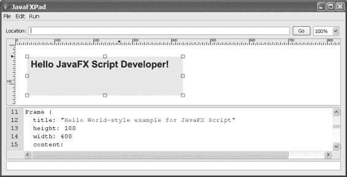

*firstPress：快速入门*

3. 使用“文件 ➤ 打开”菜单选项打开 HelloJFX.fx 文件。或者，您可以将 HelloJFX.fx 源代码剪切并粘贴到代码（中间）窗格中，替换默认显示的 JavaFX 代码。此程序以及我们将要检查的所有其他示例程序，都可以在 Apress 网站（[www.apress.com](http://www.apress.com)）上本书的代码下载中找到。更具体地说，HelloJFX.fx 文件位于该下载的 Chapter02/jfx_book 文件夹中。

4. 如果您禁用了“运行 ➤ 自动运行”选项，则通过选择“运行 ➤ 运行”菜单选项来启动应用程序。

您的输出应该类似于图 2-1 所示的窗口。

*图 2-1. HelloJFX 应用程序*

成功完成此练习后，您将验证所有设置是否正确，以便进行后续练习并创建自己的 JavaFX 程序。

*firstPress：快速入门*

**理解 HelloJFX 应用程序**

现在您已经运行了该应用程序，让我们一起浏览程序清单。HelloJFX 应用程序的代码如清单 2-1 所示。

*清单 2-1. HelloJFX.fx 程序*

/*
 * HelloJFX.fx - 一个 JavaFX Script 的“Hello World”风格示例
 *
 * 2007 年由 James L. Weaver 开发（jim.weaver at jmentor dot com）
 */

package jfx_book;

import javafx.ui.*;
import javafx.ui.canvas.*;

Frame {
    title: "JavaFX Script 的 Hello World 风格示例"
    height: 100
    width: 400
    content:
        Canvas {
            content:
                Text {
                    font:
                        Font {
                            faceName: "Sans Serif"
                            style: BOLD
                            size: 24
                        }
                    x: 10
                    y: 10
                    content: "Hello JavaFX Script Developer!"
                }
        }
    // 在屏幕上显示 Frame
    visible: true
}

让我们详细地逐行分析代码，因为这是第一个示例。

*firstPress：快速入门*

**注释**

JavaFX 中有两种类型的注释（记住，我们将“JavaFX Script”简称为“JavaFX”）


为了在本书中简洁起见，简称为“JavaFX”）：多行注释和单行注释。*多行注释*以两个字符 `/*` 开头，并以相反顺序的相同两个字符 `*/` 结尾——JavaFX 会忽略两者之间的任何内容。清单 2-1 的开头展示了一个多行注释的示例。*单行注释*以两个字符 `//` 开头——在同一行中，这两个字符之后的任何内容都将被忽略。代码清单底部附近显示了一个单行注释的示例。

**包声明**

JavaFX 包类似于文件系统中的文件夹。它们提供了一种逻辑组织构成应用程序的源代码文件的方法。前面示例中的包是 `jfx_book`，这表明 `HelloJFX.fx` 源代码位于名为 `jfx_book` 的文件夹中。包名可以由多个节点组成（例如 `com.apress.jfx_book`），在这种情况下，源代码文件将位于名为 `jfx_book` 的文件夹中，而该文件夹又位于名为 `apress` 的文件夹中，依此类推。实际上，包名通常以开发该应用程序的公司或组织的域名开头（按相反顺序，从顶级域名开始，例如 `com` 或 `org`）。

包声明是可选的，但除了最简单的程序之外，在所有程序中使用它是一个非常好的实践。如果使用，`package` 语句必须位于源代码的顶部（不包括空白和注释）。

**import 语句**

JavaFX 程序通常使用由 JavaFX（以及可选的 Java）代码组成的库。

在此示例中，每个 `import` 语句都指明了此 `HelloJFX.fx` 文件中的其余代码在输出小部件和绘制屏幕时所依赖的 JavaFX 类的位置（包）。`import` 语句可以以星号（`*`）结尾，表示程序可以使用该包中的任何类。另一种形式是具体命名所使用的每个类，如下例所示：

```java
import javafx.ui.Frame;
```

除了最简单的应用程序之外，所有应用程序都应通过包声明来组织其源代码。一个源代码文件使用 `import` 语句来表明它使用了具有不同 `package` 语句的源代码文件中所包含的类。你将在下一章介绍的“单词搜索生成器”示例中看到这方面的示例。

*firstPress：快速入门*

`import` 语句可以出现在 JavaFX 源代码中的任何位置，并且每当遇到一个 `import` 语句时，被导入的 JavaFX 文件就会在认为合适的时候运行。

**定义用户界面的声明式代码**

JavaFX 最令人兴奋的特性之一是其能够使用简单、一致且强大的*声明式*语法来表达图形用户界面（GUI）。与过程式编程不同，声明式编程由一个单一的表达式组成（而不是按顺序执行的多个表达式）。JavaFX 支持这两种编程类型，但最好尽可能使用声明式语法。

在此示例中，整个程序（不包括 `package` 和 `import` 语句）是声明式的，因为它由一个表达式组成。这个声明式表达式首先定义一个 `Frame` 对象，后跟一个左花括号，并以程序最后一行的匹配右花括号结束。嵌套在其中的是 `Frame` 对象的*属性*，包括 `content` 属性，该属性被赋值为一个 `Canvas` *小部件*（GUI 组件）。

再嵌套其中是 `Canvas` 小部件的 `content` 属性，该属性被赋值为一个 `Text` 对象，依此类推。

注意 ➡ 属性是与对象关联的变量。属性将在本章后面更详细地讨论。

声明式代码会自动创建表达式中每个 JavaFX 类的一个实例（也称为对象）。它还会为新实例的属性赋值。

例如，看一下创建 `Font` 类实例的代码部分：

```java
Font {
    faceName: "Sans Serif"
    style: BOLD
    size: 24
}
```

这段代码创建了一个 JavaFX `Font` 类的实例，并将值 `Sans Serif` 赋给新 `Font` 实例的 `faceName` 属性。请注意，属性名称后面总是跟着一个冒号（`:`），在 JavaFX 声明式语法中，这意味着“将右侧表达式的值赋给左侧的属性”。这些相同的概念适用于此脚本中的所有类（`Frame`、`Canvas` 和 `Text`）。让我们逐一查看这些类。

*firstPress：快速入门*

**使用 Frame 类**

`Frame` 代表一个 GUI 窗口，它有自己的边框，并且可以在其中包含其他 GUI 组件。

注意 ➡ 在这个简单的 `HelloJFX.fx` 示例中，如图 2-1 所示，JavaFXPad 将 `Frame` 对象渲染为输出区域内的一个矩形区域，而不是一个单独的窗口。在图 2-3 所示的稍微复杂一点的示例截图中，JavaFXPad 将 `Frame` 对象渲染为一个单独的窗口。

与任何类一样，`Frame` 类也有一组属性。`Frame` 小部件所具有的属性集，如清单 2-1 中的以下代码片段所示，如下所示：

*   一个出现在窗口标题栏中的标题（再次，请查看图 2-3 以了解 `Frame` 对象的正确渲染，并注意其标题）。
*   决定窗口初始高度和宽度的 `height` 和 `width`（以像素为单位）。
*   一个 `content` 属性，定义了 `Frame` 对象的内容是什么。在这种情况下，`Frame` 对象将包含一个 `Canvas` 小部件，你将在其上绘制一个包含要显示消息的 `Text` 对象。
*   一个 `visible` 属性（在 `Canvas` 小部件的右花括号之后），用于控制 `Frame` 对象是否立即显示在屏幕上。

```java
Frame {
    title: "Hello World-style example for JavaFX Script"
    height: 100
    width: 400
    content:
    ...some code omitted...
    // Show the Frame on the screen
    visible: true
}
```

*firstPress：快速入门*

**创建字符串字面量**

JavaFX 拥有的数据类型之一是 `String`，它由零个或多个字符连接而成。如下面的 `Frame` 对象的 `title` 属性所示，字符串字面量是通过将一组字符括在双引号中来定义的：

```java
title: "Hello World-style example for JavaFX Script"
```

或者，字符串字面量也可以用单引号括起来。

**使用 Canvas GUI 小部件**

`Canvas` 小部件的用途是绘制二维（2D）图形，包括线条、形状和文本。它是一个 JavaFX 类，但我在这里将其称为*小部件*，因为它是 JavaFX `Widget` 类的子类。如下所示，`Canvas` 小部件的 `content` 属性指示了将在画布上绘制的内容——在本例中是一些文本：

```java
Canvas {
    content:
    Text {
        ...some code omitted...
    }
}
```

提示 ➡ 如果你想查看任何 JavaFX 类的代码，请查看 Project OpenJFX 站点软件包（本章前面“获取 JavaFXPad”部分提到过）中的 `trunk/src/javafx` 文件夹。JavaFX 类按包组织，特别是 `javafx.ui`、`javafx.ui.canvas` 和 `javafx.ui.filter` 包，因此你需要在相应的子文件夹中查找包含源代码的 FX 文件。

**绘制文本**

要在画布上绘制一些文本，你需要使用 `Text` 类，并提供 `x` 和 `y` 位置（以像素为单位）作为属性，文本的左上角将出现在该位置。`Text` 类的 `content` 属性包含将要绘制的字符串，`font` 属性指定了将要绘制的文本的外观。

*firstPress：快速入门*

```java
Text {
    font:
    Font {
        faceName: "Sans Serif"
        style: BOLD
        size: 24
    }
    x: 10
    y: 10
    content: "Hello JavaFX Script Developer!"
}
```

**定义字体**


最后，在定义此应用程序 UI 的声明式脚本的最内层，我们找到了 Font 类（参见前面的代码片段）。此类用于通过所示的 `faceName`、`style` 和 `size` 属性来指定 Text 小部件的特性。

为了实践并内化你目前学到的概念，请完成以下练习。

**长消息练习**

创建一个 JavaFX 程序，显示一条你选择的消息。该消息应足够长，以至于你需要将 Frame 实例的 `width` 属性值增加到超过 400。请将 Frame 实例的 `title` 属性更改为“长消息练习”。此程序应模仿本章前面的 `HelloJFX.fx` 示例，并且你的源文件应命名为 `LongerMessage.fx`。

包声明应如下所示：

package chapter2;

因此，请务必将你的源文件放在名为 `chapter2` 的文件夹中。图 2-2 显示了此练习示例解决方案的两种不同输出。你的输出应与其中之一类似，具体取决于你是否使用 JavaFXPad 运行你的解决方案。

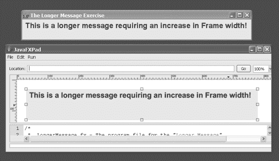

*firstPress: 快速入门*

*图 2-2. 长消息练习的两个示例解决方案*

现在，你已经通过运行和检查 `HelloJFX.fx` 代码并完成长消息练习，学习了一些 JavaFX 概念，我想向你介绍更多概念。你将初步了解在 JavaFX 中创建类和对象是什么感觉，以及如何创建变量和使用常量。你还将学习 JavaFX 中一个看似简单但功能强大的概念：将视图绑定到模型。让我们在 `HelloJFXBind` 应用程序的上下文中逐步了解这些概念，该应用程序构建于之前的应用程序之上。

**运行和检查 HelloJFXBind 应用程序**

在你选择的 JavaFX 工具中运行 `HelloJFXBind.fx` 程序；输出应是一个看起来类似于图 2-3 的窗口。


*firstPress: 快速入门*

*图 2-3. HelloJFXBind 应用程序的输出*

现在让我们检查清单 2-2 中的源代码，特别注意新增的概念。

*清单 2-2. HelloJFXBind.fx 程序*

package jfx_book;

import javafx.ui.*;

import javafx.ui.canvas.*;

/**

* 此类作为用户界面背后的模型

*/

class HelloJFXModel {

attribute greeting:String;

}

/**

* 这是一个绑定到模型数据的 JavaFX 脚本。

*/

var hellojfxModel =

HelloJFXModel {

greeting: "Hello JavaFX Script Developer!"

};

Frame {

title: "JavaFX Script example that binds to a model"

height: 100

width: 400

content:

Canvas {

content:

Text {

font:

Font {

*firstPress: 快速入门*

faceName: "Sans Serif"

// 具有值集合的属性示例

style: [

BOLD,

ITALIC]

size: 24

}

// 为应用程序添加一些颜色

stroke: red

fill: red

x: 10

y: 10

content: bind hellojfxModel.greeting

}

}

visible: true

}

**最小 JavaFX 类的结构**

你会注意到的与前一个示例的第一个区别是，此程序在以下几行代码中定义了一个名为 `HelloJFXModel` 的类： class HelloJFXModel {

attribute greeting:String;

}

这是一个非常小的类，因为它没有很多可能的特性（你将在后面学习），但这是一个很好的起点。

**类声明**

类的声明始终包含 `class` 关键字，并且如前面的代码片段所示，具有左花括号和右花括号。还有其他 JavaFX 关键字，例如 `public` 和 `extends`，它们可以修饰 `class` 关键字。我们稍后将详细讨论这些内容。

*firstPress: 快速入门*

**属性声明**

`HelloJFXModel` 类中有一个名为 `greeting` 的属性，其数据类型为 `String`。如前所述，属性是与对象关联的变量。

当创建此类的实例时，每个实例都将能够持有一个名为 `greeting` 的字符串。


注意 ➡ 如示例所示，JavaFX 文件中存在第三种注释类型，称为 Javadoc 注释。这类注释以 `/**` 字符开头，以 `*/` 字符结尾。其目的是支持为 Java 类自动生成文档，我预计未来会有工具利用 Javadoc 风格的注释为 JavaFX 类生成文档。

**创建类的实例**

在定义了 `HelloJFXModel` 类之后，程序继续使用之前创建 UI 时用到的声明式语法来创建该类的一个实例：`var hellojfxModel =`

`HelloJFXModel {`

`greeting: "Hello JavaFX Script Developer!"`

`};`

这个新实例的 `greeting` 属性包含一个字符串，其值为 `Hello JavaFX Script Developer!`。

**声明与赋值变量**

如上所示，程序使用 `var` 关键字声明了一个名为 `hellojfxModel` 的变量。通过赋值运算符（`=`），该变量被赋予了对 `HelloJFXModel` 类新创建实例的引用。稍后你将需要 `hellojfxModel` 变量来获取这个实例的引用。值得注意的是，在使用 `var` 关键字声明的变量之前，应始终为其赋值。

对于你给变量（使用 `var` 或 `attribute` 关键字声明的标识符）命名的规则和约定如下：

*firstPress: 快速入门*

•

*规则*：变量必须以字母、下划线（`_`）或美元符号（`$`）开头。变量名中后续字符可以是数字、字母、下划线或美元符号。

•

*约定*：变量以小写字母开头，通常不包含下划线，绝不包含美元符号，并由一个或多个驼峰式单词组成。

在适当的情况下会使用数字。例如，`HelloJFXModel` 类中使用的变量名为 `greeting`。一个保存行星名称的变量可以命名为 `planetName`。

变量名在实用范围内可以尽可能长，并且应能传达含义。此外，与 JavaFX 中的大多数事物一样，变量名是区分大小写的。

**理解绑定**

请跳转到当前示例中 `Text` 对象的声明部分，如下所示：`Text {`

`font:`

`Font {`

`faceName: "Sans Serif"`

`// 一个包含值集合的属性示例`

`style: [`

`BOLD,`

`ITALIC]`

`size: 24`

`}`

`// 为应用添加一些颜色`

`stroke: red`

`fill: red`

`x: 10`

`y: 10`

`content: bind hellojfxModel.greeting`

`}`

这段*代码块*（左花括号与其匹配的右花括号之间的代码称为代码块）中包含一些新概念。我现在想指出的概念是将应用程序的*视图*（用户界面）绑定到应用程序的*模型*（数据）。在最后一行代码中，你会注意到 `Text` 实例的 `content` 属性包含了 `bind` 运算符。这会导致将 `Text` 实例的内容与 `HelloJFXModel` 实例的 `greeting` 属性进行绑定（增量更新）。如果

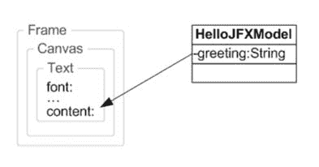

*firstPress: 快速入门*

`greeting` 属性发生变化，JavaFX 将自动导致 `Text` 实例的内容发生变化，从而立即更新应用程序中显示的消息。图 2-4 展示了这种绑定行为，左侧是 UI 组件的包含层次结构，右侧是 `HelloJFXModel` 类的类图。

*图 2-4. HelloJFXBind 应用中的绑定示意图* 由于绑定是一个如此强大的概念，你将在本书的示例应用中频繁看到它的使用。在结束这个示例之前，我想向你展示更多与在声明式表达式中为属性赋值相关的 JavaFX 概念。

**为 Text 对象分配颜色常量**


JavaFX 提供了许多预定义常量供您使用，同时也支持创建您自己的常量。我将在后面详细讲解如何创建常量，但这里我想先指出如何在代码中赋值常量。在当前示例的以下代码片段中，请注意 Text 对象的 stroke 和 fill 属性都被赋值为红色：Text {

font:

Font {

**...部分代码省略...**

}

// 为应用添加一些颜色

stroke: red

fill: red

x: 10

y: 10

content: bind hellojfxModel.greeting

}

*firstPress: 快速入门*

对于包括此 Text 对象在内的任何图形元素，stroke 属性定义了轮廓的颜色。fill 属性则定义了轮廓内部区域填充的颜色。

JavaFX 中的 Paint 类目前约有 140 个表示颜色的预定义常量。以下是其中一些常量：

•

red

•

green

•

blue

•

yellow

•

orange

•

black

•

white

•

lightblue

•

lemonchiffon

•

lightgoldenrodyellow

要查看所有可用的 Paint 常量，请查看 JavaFX 软件下载中的 Color.fx 文件（位于 javafx.ui 包中），该下载在本书前面“获取 JavaFXPad”一节中已提及。

注意 ➡ 类的常量有时定义在与该类本身不同的 FX 文件中。在这种情况下，Paint 类定义在 Paint.fx 文件中，但前面提到的 Paint 常量却定义在 Color.fx 类中。

**为属性赋值一个数组**

稍后我会详细讨论数组，因为它们是 JavaFX 中的主要数据结构。现在，我只想通过向您展示如何在声明式代码中创建数组并将其赋值给属性，来初步介绍这个主题。在当前示例的以下代码片段中，Font 对象的 style 属性被赋值为两个值，您可能已经猜对了，它们是常量：

*firstPress: 快速入门*

Font {

faceName: "Sans Serif"

// 属性包含多个值的示例

style: [

BOLD,

ITALIC]

size: 24

}

Font 类的 style 属性接受一个或多个值，为了表示这些值，这里实际上定义了一个数组字面量。如前面的代码片段所示，数组字面量由一个左方括号开头，后跟逗号分隔的元素，最后以右方括号结尾。Font 类的 style 属性可用的常量位于 javafx.ui 包中的 FontStyle.fx 文件中，具体如下：

•

BOLD

•

PLAIN

•

ITALIC

现在是时候探讨本章的最后一个概念了，我们将开始把代码组织成更接近真实世界 JavaFX 应用程序的形式。

**将 HelloJFXModel 类移入其专属文件**

随着应用程序变得越来越复杂，将代码组织到多个文件中，并将这些文件组织到多个包中，是明智的做法。我们现在就朝这个方向迈出一步，将 HelloJFXModel 类拆分到它自己的 FX 文件中。当一个 JavaFX 类位于单独的文件中时，为了在运行时能被找到，它需要位于一个与类同名的文件中。清单 2-3 包含了我已移至 HelloJFXModel.fx 文件的代码，而清单 2-4 包含了 UI 的声明式代码，我将其放在名为 HelloJFXBind2.fx 的文件中（稍作修改，我稍后会告诉您）。

*firstPress: 快速入门*

*清单 2-3. HelloJFXModel.fx 程序*

package jfx_book;

/**

* 此类作为用户界面背后的模型

*/

class HelloJFXModel {

attribute greeting:String;

}

*清单 2-4. HelloJFXBind2.fx 程序*

package jfx_book;

import javafx.ui.*;

import javafx.ui.canvas.*;

/**

* 这是一个绑定到模型数据的 JavaFX 脚本。

*/

Frame {

var hellojfxModel =

HelloJFXModel {

greeting: "Howdy JavaFX Script Developer!"

}

title: "JavaFX Script example that binds to a model"

height: 100

width: 400

content:

Canvas {

content:

Text {

font:

Font {

faceName: "Sans Serif"


// 具有值集合的属性的示例

style: [

BOLD,

ITALIC]

size: 24

}

*firstPress: 快速入门*

// 为应用添加一些颜色

stroke: red

fill: red

x: 10

y: 10

content: bind hellojfxModel.greeting

}

}

visible: true

}

请注意，这两个文件位于同一个包中，因此它们都位于名为 `jfx_book` 的文件夹内。当遇到引用 `HelloJFXModel` 类的代码时（参见以下代码片段），JavaFX 运行时将在 `jfx_book` 文件夹中查找名为 `HelloJFXModel.fx` 的文件，并创建该类的一个实例。

var hellojfxModel =

HelloJFXModel {

greeting: "Howdy JavaFX Script Developer!"

}

顺便提一下，前面的代码片段就是我之前提到的微小修改。

它演示了在声明式代码中间声明变量的思想。在这个例子中，我将这段代码从直接位于以 `Frame` 开头的声明式代码块上方，移到了该代码块内部。你可能已经注意到，有必要删除语句末尾的分号，因为它不再是一个单独的语句，而是更大的声明式表达式的一部分。声明的变量仅存在于其声明所在的块内，因此 `hellojfxModel` 变量的作用域是从 `Frame` 的左花括号到与之匹配的右花括号。如果我们是在 `Canvas` 块中声明它，那么作用域将仅限于该块。

**使用 JavaFXPad 运行此示例的特殊说明** 使用某个 IDE 时，你的项目会有一个基础路径，运行时它将从中查找必要的 FX 文件。使用 JavaFXPad 时，你必须告诉它这个基础文件夹是什么。在本例中，它是 `Chapter02` 文件夹（如果你使用的是本书的代码下载包）。从 `Run ➤ Source Path` 菜单选项中，选择 `Chapter02` 文件夹。运行位于 `Chapter02/jfx_book` 文件夹中的 `HelloJFXBind2.fx` 文件，你应该会看到图 2-5 所示的输出（注意，现在应该显示“Howdy”而不是“Hello”，这将确保你运行了正确的文件）。


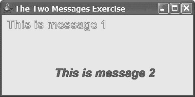

*firstPress: 快速入门*

*图 2-5. HelloJFXBind2 应用*

现在是做一个练习来巩固本章所学概念的好时机。

**两个消息练习**

创建一个 JavaFX 程序，该程序绑定到一个模型并显示两个 `Text` 对象。一个 `Text` 对象应显示在另一个的下方偏右位置。每个显示的 `Text` 对象都应有一个与其填充颜色不同的轮廓，并且每个对象应具有不同的字体样式。框架的标题栏应包含短语“The Two Messages Exercise”。模型类应位于其自己的源文件 `TwoMessagesModel.fx` 中，而你要运行的源文件应命名为 `TwoMessagesMain.fx`。两个源文件都应声明包名为 `chapter2`。

图 2-6 是该练习示例解决方案输出的截图。

*图 2-6. 两个消息练习的示例解决方案* 提示：由于 `Canvas` 实例的 `content` 属性现在将包含两个 `Text` 实例，你需要使用数组字面量表示法将两者都赋值给 `content` 属性。祝你在本练习中玩得开心！

*firstPress: 快速入门*

**总结**

恭喜你，在短时间内取得了长足的进步！在本章中，你完成了以下内容：

•

选择并安装了一个或多个用于开发和执行 JavaFX 程序的工具。

•

检查并运行了一个简单的 Hello World 风格的 JavaFX 程序。

•

学习了如何在 JavaFX 中使用单行和多行注释。

•

处理了 `package` 和 `import` 语句的使用。

•

理解了如何编写声明式 JavaFX 代码。

•

学习了使用多个 UI 类，包括 `Frame`、`Canvas`、`Text` 和 `Font`，以及它们的属性。

•

学习了如何在 JavaFX 中创建字符串字面量。

•

检查了一个非常精简的 JavaFX 类的结构，包括类和属性声明。

•

使用声明式 JavaFX 语法创建了这个精简类的一个实例。

•

学习了使用 JavaFX 的 `var` 关键字声明变量，并研究了变量命名的规则和约定。

•

理解了 `bind` 运算符以及如何使用它来保持应用中的 UI（视图）与数据（模型）同步。

•

学习了使用常量，特别是与颜色和字体相关的常量。

•

初步体验了创建数组字面量并将其赋值给声明式代码中的属性。

•

通过将声明式代码使用的类移动到其自己的 FX 文件中，开始组织应用。

•

学习了如何在更大的声明式表达式内部声明变量。

•

通过完成三个练习，将所学概念付诸实践。你确实做了这些练习，对吧？

*firstPress: 快速入门*

在下一章中，你将学习更多关于在 JavaFX 中创建用户界面的知识。为此，你将开始检查我为本书编写的一个构建单词搜索谜题的应用。

**资源**

以下是一些有用的 JavaFX 资源，你可以探索它们来补充本章所学内容：

•

*Project OpenJFX 网站*：该网站支持 OpenJFX 社区，你可以自由加入。你可能已经注意到，本章引用的几个资源都来自该网站。网址是 [`openjfx.dev.java.net`](https://openjfx.dev.java.net)/。

•

*Planet JFX 维基*：该维基包含由社区成员提交的与 JavaFX 相关的资源（例如代码示例和教程）。你也可以自由加入这个社区。网址是 [`jfx.wikia.com`](http://jfx.wikia.com)。

*firstPress: 快速入门*

**第 3 章**

**在 JavaFX 中创建用户界面**

*设计一个清晰、逻辑性强、易于理解的用户界面，很像表演单口喜剧。它比看起来要难，如果你失败了，很多无辜的人都会受苦。*

格伦·M·贝弗

为了帮助我完成教授你 JavaFX 的任务，我开发了一个创建单词搜索谜题的非平凡应用。本书剩余部分将使用该程序的源代码来解释和展示 JavaFX 的概念与结构。在我们进入本章的重点——即继续学习在 JavaFX 中开发用户界面并接触大量 GUI 组件——之前，请允许我简要地带你了解该应用的行为。充分理解这种行为将有助于你理解产生它的代码，我建议你在阅读本节时实际运行该应用并跟随操作。

**单词搜索构建器应用概述**

单词搜索构建器应用是一个用于创建单词搜索谜题的工具。用户将单词输入到单词列表中，并将这些单词放置在单词网格上。每个单词可以放置在网格上的特定位置和方向（水平、垂直、对角线向上或对角线向下）。或者，单词也可以随机放置位置和方向。

当单词位于单词网格上时，可以将其拖拽到网格上的其他位置，并且其方向也可以更改。

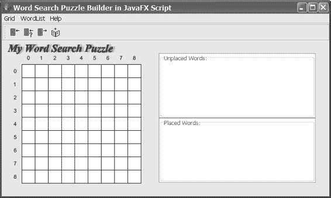

*firstPress: 在 JavaFX 中创建用户界面*

**调用应用**

要使用 JavaFXPad 执行单词搜索构建器应用，你需要在控制台中导航到本书源代码下载包的 `Chapter03` 文件夹。这是因为在运行时，应用将从 `Chapter03` 文件夹中的 `resources` 文件夹加载图像资源（工具栏图标）。如果你使用的是带有 JavaFX 插件的 IDE，则无需关心此细节。


启动 JavaFXPad 后，从 **运行** ➤ **源路径** 菜单选项中选择 Chapter03 文件夹。这是源文件所在的基础文件夹，当然，它是相对于包声明而言的。接着，从 **文件** ➤ **打开** 菜单，浏览到 `Chapter03/wordsearch_jfx/ui` 文件夹，并打开 `WordSearchMain.fx` 文件。

图 3-1 展示了应用程序首次启动时的界面。请注意，它包含一个菜单、一个工具栏、左侧的一个单词网格以及右侧的两个列表框。上方的列表框包含未放置的单词，即单词列表中尚未放置到单词网格中的单词。下方的列表框则包含已经放置好的单词。

*图 3-1. 单词搜索生成器应用程序启动界面*


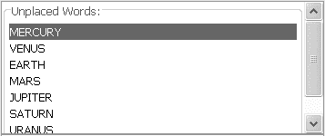

*firstPress: 在 JavaFX 中创建用户界面*

**应用程序概览**

要向“未放置单词”列表中添加单词，你可以通过以下几种方式之一进行操作：

•

选择 **单词列表** ➤ **添加单词** 选项。

•

点击最右侧的工具栏按钮。

•

按下 Insert 键（如果你的键盘上有此键）。

以上任一操作都会弹出如图 3-2 所示的对话框，你可以在其中输入一个单词，然后点击 **确定** 按钮（或按下 Enter 键）。

*图 3-2. 向单词列表添加单词对话框*

在添加了我们太阳系中八大行星的名称（抱歉，冥王星）之后，“未放置单词”列表框的外观应如图 3-3 所示。

*图 3-3. 将行星添加到单词列表后*

要将单词放置到网格中你选择的某个位置和方向上，可以选择 **网格** ➤ **放置单词** 菜单选项，或者点击最左侧的工具栏按钮。你应该会看到如图 3-4 所示的对话框，你可以在其中选择起始行、起始列以及单词的方向。

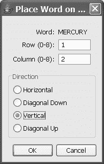

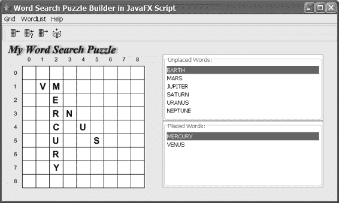

*firstPress: 在 JavaFX 中创建用户界面*

*图 3-4. 在网格上放置单词对话框*

以这种方式放置了前两个行星后，应用程序的外观如图 3-5 所示，这些单词既出现在单词网格中，也出现在“已放置单词”列表框中。

*图 3-5. 放置前两个行星后的单词搜索生成器应用程序*


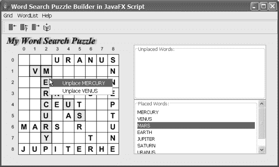

*firstPress: 在 JavaFX 中创建用户界面*

要将单词随机放置在网格上，请在“未放置单词”列表框中选中该单词，然后选择 **网格** ➤ **随机放置单词** 菜单选项。大多数菜单选项都有加速键（快捷键），你可以在下拉菜单中看到它们。例如，此选项也可以通过 `Ctrl+R` 快捷键组合来调用。另一种调用此选项的方式是双击“未放置单词”列表中要放置的单词。无论以何种方式调用，结果都会弹出一个对话框，要求你确认是否真的要放置该单词，如图 3-6 所示。

*图 3-6. 在网格上随机放置单词对话框*

要随机放置所有剩余的单词，请选择 **网格** ➤ **随机放置所有单词** 菜单选项。在点击确认对话框中的“确定”按钮（该对话框要求你确认是否要放置所有单词）后，所有单词都将被放置在网格上，并且也会出现在“已放置单词”列表框中。如果将光标悬停在单词网格中的某个字母上，相关的单词将会以黄色高亮显示。如果在某个字母上右键单击鼠标（或按住 Ctrl 键的同时单击鼠标），则会弹出一个菜单，允许你取消放置这些单词，如图 3-7 所示。

*图 3-7. 将剩余行星随机放置在单词网格上并调用某个字母的弹出菜单后*

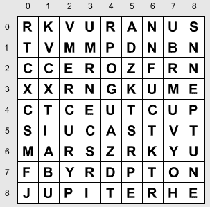

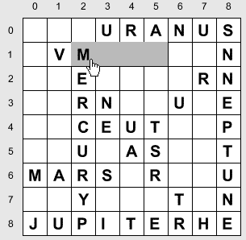

*firstPress: 在 JavaFX 中创建用户界面*

要用随机字母填充网格中剩余的单元格，请选择 **网格** ➤ **显示填充字母** 菜单选项，或按下 `Ctrl+F` 组合键。单词网格应会显示出来，类似于图 3-8 所示的样子。


*图 3-8：调用“显示填充字母”选项后的单词网格* 当填充字母显示在网格上时，大部分应用程序功能将被禁用，因此如果你下拉网格菜单，大多数菜单选项会变灰。请注意，其中三个工具栏按钮也被禁用了。

再次选择“网格 ➤ 显示填充字母”菜单选项（或按 Ctrl+F）将从网格中移除填充字母。

要将单词从网格的一个位置拖到另一个位置，请单击并拖动单词的第一个字母。当单词可以放置到当前位置时，被拖动单词的背景会变为青色，光标会变为手形图标。图 3-9 展示了这一行为的一个示例，其中 *MARS* 正被拖动以与 *MERCURY* 中的 *M* 相交。

*图 3-9：将单词 MARS 拖动到可放置的位置*

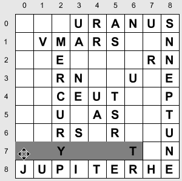

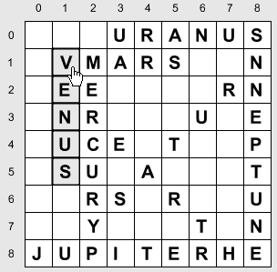

*firstPress：使用 JavaFX 创建用户界面*

当单词被拖动到无法放置的位置时，单词的背景会变为红色，光标会变为表示*移动*的图标（见图 3-10）。

*图 3-10：尝试将单词 JUPITER 拖动到无法放置的位置* 可以通过在单击单词第一个字母的同时按住 Shift 键来改变单词在网格上的方向。每次单击，单词都会以第一个字母为轴心，循环切换每个可用方向。图 3-11 显示了 *VENUS* 的方向从斜向下变为垂直，以字母 *V* 为轴心：

*图 3-11：将单词 VENUS 的方向从斜向下改为垂直* 除了使用图 3-7 中的弹出菜单从网格中移除单词外，你还可以在“已放置单词”列表框中选择一个单词，然后选择“网格 ➤ 取消放置单词”菜单

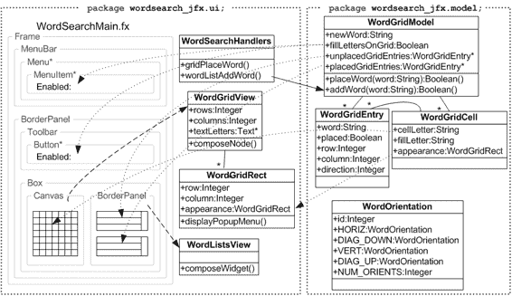

*firstPress：使用 JavaFX 创建用户界面*

选项。另一种方法是双击“已放置单词”列表框中的单词。在这两种情况下，系统都会提示你确认操作。

最后，要取消网格中所有单词的放置，请选择“网格 ➤ 取消放置所有单词”菜单选项，或使用 Alt+U 快捷键组合。同样，系统会提示你确认操作。

现在你已经对 Word Search Builder 应用程序的行为有了全面了解，我想向你展示其整体架构的高级视图。这将帮助你从整个应用程序的上下文中理解我们将要逐步分析的 Word Search Builder 代码。

**Word Search Builder 应用程序架构**

图 3-12 包含一个框图，描绘了 Word Search Builder 应用程序的整体架构。应用程序中的每个 FX 文件都有表示，但由于空间限制，我选择仅在其各自的类图中显示某些属性和操作（例如，标记为 WordGridModel 的框）。我也只展示了少数绑定操作（带有向左箭头的虚线）。请查看一下，我将指出一些最重要和有趣的要点。

*图 3-12：Word Search Builder 应用程序框图*

*firstPress：使用 JavaFX 创建用户界面*

Word Search Builder 应用程序的源代码位于两个包中（如图顶部由包语句和包含每个包中 FX 文件的虚线矩形所示）。这两个包是 wordsearch_jfx.ui 和 wordsearch_jfx.model。我们将逐一探讨它们。

**wordsearch_jfx.ui 包中的声明式代码和类** wordsearch_jfx.ui 包由构成 Word Search Builder 应用程序 UI（即视图）的类组成。该应用程序从 WordSearchMain.fx 中的声明式代码开始执行。图中 wordsearch_jfx.ui 包左侧下方的列显示了 WordSearchMain.fx 文件中 UI 类的包含层次结构。

注意 ➡ 我采用了一种命名约定，将第一个被调用的 FX 文件命名为

[Something]Main.fx。

WordSearchMain.fx 文件包含创建大部分用户界面的声明式代码。它在概念上与 HelloJFXBind2.fx 文件类似，但功能大大扩展了。

WordSearchHandlers 类用于处理用户与 UI 交互时发生的*事件*。当选择菜单项和工具栏按钮时，通常会调用 WordSearchHandlers 类中的关联方法。我采用一种约定，将 WordSearchHandlers 类中的处理程序方法命名为关联菜单选项的拼接。例如，如类图所示，WordSearchHandlers 类中有一个名为 gridPlaceWord() 的操作。当用户选择“网格 ➤ 放置单词”菜单选项时，会调用该操作。通常，当需要显示对话框以从用户处收集更多信息、确认选择或显示消息时，Word Search Builder 应用程序会调用 WordSearchHandlers 类中的操作。

如带箭头的虚线所示，WordGridView 类的一个实例存在于包含层次结构中的 Canvas 实例内。它是一个自定义组件，负责绘制和管理单词网格，包括显示字母和提供单词拖拽/重定向功能等功能。

WordGridRect 类本质上是一个二维矩形，并添加了此应用程序所需的某些功能，在网格单元级别为 WordGridView 类提供辅助。单词网格中的每个单元都会创建该类的一个实例。请注意图中 WordGridRect 类上方线条附近的星号 (*)。这意味着可能有多个 WordGridRect 实例与 WordGridView 实例相关联。

*firstPress：使用 JavaFX 创建用户界面*

WordGridRect 类还包含与单元外观相关的常量（例如，DRAGGING_LOOK 和 SELECTED_LOOK）。

如带箭头的虚线所示，WordListsView 类的一个实例存在于包含层次结构中的 BorderPanel 实例内。它是一个自定义组件，负责创建、显示和管理“未放置单词”和“已放置单词”列表框。

现在你已经对 wordsearch_jfx.ui 包中的架构有了概述，让我们将注意力转向 wordsearch_jfx.model 包。

**wordsearch_jfx.model 包中的类**

wordsearch_jfx.model 包由包含应用程序模型（表示数据的对象）的类组成。

WordGridModel 类是负责保存模型的主要类。例如，如类图所示，该类的属性之一是 fillLettersOnGrid。该属性保存填充字母当前是否显示在网格上的状态。如前所述，当填充字母显示在网格上时，许多菜单选项和工具栏按钮需要被禁用。为了实现这一点，如从该类的 fillLettersOnGrid 属性出发的两条虚线所示，某些菜单项和工具栏按钮的 enable 属性被绑定到 fillLettersOnGrid 属性。这是 bind 运算符如何帮助应用程序视图与模型保持同步的一个示例。这个 WordGridModel 类还具有为模型提供功能的操作。例如，当调用 addWord() 操作时（由 WordSearchHandlers 类中的 wordListAddWord() 方法调用），该操作中的逻辑会导致一个 WordGridEntry 被添加到 WordGridModel 实例中的 unplacedGridEntries 数组中。如从 unplacedGridEntries 和 placedGridEntries 属性出发的虚线所示，“未放置单词”和“已放置单词”列表框被绑定到这些数组，因此当这些数组的内容发生变化时，它们会自动更新。


注意 ➡ `placedGridEntries:WordGridEntry*` 属性后的星号 (*) 表示该属性是一个数组（也称为*序列*）。稍后我们将深入探讨数组。

`WordGridEntry` 类包含一个单词、该单词是否已放置的状态，以及如果已放置，则包含其放置的行、列和方向（垂直、水平等）。从图中可以注意到，`WordGridCell` 类与 `WordGridEntry` 类的实例之间存在一对多的关系。因此，当用户在网格上的某个字母上调用弹出菜单时，你可以显示该字母所属的单词列表。

`WordGridCell` 类包含网格中某个单元格的字母，以及一个随机生成的填充字母。它还使用 `WordGridRect` 类中定义的常量来保存单元格应具有的外观。如带箭头的虚线所示，视图中每个 `WordGridRect` 实例的外观属性都绑定到模型中相应 `WordGridCell` 实例的外观属性。此外，在 `WordGridView` 组件中绘制的每个文本字母都绑定到模型中每个 `WordGridCell` 实例的 `cellLetter` 属性。

最后，`WordOrientation` 类包含表示网格上单词方向的常量（例如，`HORIZ`、`DIAG_DOWN` 等）。其他类使用这些常量来影响放置在单词网格上的单词的方向。

现在你已经对单词搜索生成器应用程序的架构有了一个高层次的概述，让我们开始深入检查 UI 代码。

**创建框架和菜单结构**

我们将处理的 UI 的第一部分是整体结构，包括菜单、工具栏和应用程序的主窗口。我喜欢称之为 *UI 外骨骼*，因为它为应用程序的整体 UI 提供了一个可见的结构。

**单词搜索生成器 UI 的外骨骼**

请花点时间通读清单 3-1 中所示的 `WordSearchMain.fx` 脚本，该脚本是单词搜索生成器中的主（初始）程序，并为 UI 提供了外骨骼。之后，我们将详细检查这段代码的特定部分。

*清单 3-1. WordSearchMain.fx 程序*

package wordsearch_jfx.ui;

import javafx.ui.*;

import java.lang.System;

import wordsearch_jfx.model.WordGridModel;

var wgModel = new WordGridModel(9, 9);

var wsHandlers = WordSearchHandlers {

*firstPress: Creating User Interfaces in JavaFX*

wgModel:wgModel

};

var wordGridView = WordGridView {

wsHandlers: wsHandlers

wgModel: wgModel

};

var wordListsView = WordListsView {

wsHandlers: wsHandlers

border:

EmptyBorder {

top: 30

left: 30

bottom: 30

right: 30

}

wgModel: wgModel

};

wgModel.wordGridView = wordGridView;

wgModel.wordListsView = wordListsView;

wsHandlers.dlgOwner = wordListsView;

Frame {

title: "Word Search Puzzle Builder in JavaFX Script"

width: 750

height: 450

onClose: operation() {

System.exit(0);

}

visible: true

menubar: MenuBar {

menus: [

Menu {

text: "Grid"

mnemonic: G

items: [

MenuItem {

text: "Place Word..."

mnemonic: P

accelerator: {

modifier: CTRL

*firstPress: Creating User Interfaces in JavaFX*

keyStroke: P

}

enabled: bind not wgModel.fillLettersOnGrid

action: operation() {

wsHandlers.gridPlaceWord();

}

},

MenuItem {

text: "Place Word Randomly..."

mnemonic: R

accelerator: {

modifier: CTRL

keyStroke: R

}

enabled: bind not wgModel.fillLettersOnGrid

action: operation() {

wsHandlers.gridPlaceWordRandomly();

}

},

MenuItem {

text: "Place All Words Randomly..."

mnemonic: A

accelerator: {

modifier: ALT

keyStroke: P

}

enabled: bind not wgModel.fillLettersOnGrid

action: operation() {

wsHandlers.gridPlaceAllWords();

}

},

MenuSeparator,

MenuItem {

text: "Unplace Word..."

mnemonic: U

accelerator: {

modifier: CTRL

keyStroke: U

}

enabled: bind not wgModel.fillLettersOnGrid

action: operation() {

wsHandlers.gridUnplaceWord();

}

*firstPress: Creating User Interfaces in JavaFX*

},

MenuItem {

text: "Unplace All Words..."

mnemonic: L

accelerator: {


modifier: ALT

keyStroke: U

}

enabled: bind not wgModel.fillLettersOnGrid

action: operation() {

wsHandlers.gridUnplaceAllWords();

}

},

CheckBoxMenuItem {

text: "显示填充字母"

selected: bind wgModel.fillLettersOnGrid

mnemonic: F

accelerator: {

modifier: CTRL

keyStroke: F

}

},

MenuSeparator,

MenuItem {

text: "退出"

mnemonic: X

action: operation() {

System.exit(0);

}

},

]

},

Menu {

text: "单词列表"

mnemonic: W

items: [

MenuItem {

text: "添加单词"

mnemonic: W

accelerator: {

keyStroke: INSERT

}

action: operation() {

*firstPress: Creating User Interfaces in JavaFX*

wsHandlers.wordListAddWord();

}

},

MenuItem {

text: "删除单词"

mnemonic: D

accelerator: {

keyStroke: DELETE

}

enabled: bind not wgModel.fillLettersOnGrid

action: operation() {

wsHandlers.wordListDeleteWord();

}

}

]

},

Menu {

text: "帮助"

mnemonic: H

items: [

MenuItem {

text: "关于单词搜索谜题生成器..."

mnemonic: A

action: operation() {

MessageDialog {

title: "关于单词搜索谜题生成器"

message: "一个由 James L. Weaver (jim.weaver at jmentor dot com) 编写的 JavaFX Script 示例程序。最后修订于 2007 年 7 月。"

messageType: INFORMATION

visible: true

}

}

}

]

}

]

}

content:

BorderPanel {

top:

ToolBar {

floatable: true

border:

*firstPress: Creating User Interfaces in JavaFX*

EtchedBorder {

style:RAISED

}

buttons: 

Button {

icon:

Image {

url: "file:resources/place_word.gif"

}

toolTipText: "在网格上放置单词"

enabled: bind not wgModel.fillLettersOnGrid

action: operation() {

wsHandlers.gridPlaceWord();

}

},

Button {

icon:

Image {

url: "file:resources/place_random.gif"

}

toolTipText: "在网格上随机放置单词"

enabled: bind not wgModel.fillLettersOnGrid

action: operation() {

wsHandlers.gridPlaceWordRandomly();

}

},

Button {

icon:

Image {

url: "file:resources/unplace_word.gif"

}

toolTipText: "从网格中移除（取消放置）单词"

enabled: bind not wgModel.fillLettersOnGrid

action: operation() {

wsHandlers.gridUnplaceWord();

}

},

Button {

icon:

Image {

url: "file:resources/add_word.gif"

}

toolTipText: "将单词添加到单词列表"

![Image 24

*firstPress: Creating User Interfaces in JavaFX*

action: operation() {

wsHandlers.wordListAddWord();

}

}

]

}

center:

Box {

orientation: HORIZONTAL

content: [

Canvas {

content: bind wgModel.wordGridView

},

BorderPanel {

center: bind wgModel.wordListsView

}

]

}

}

}

**创建菜单**

我们将稍微跳跃式地浏览这个程序清单——一些概念因为已经介绍过而跳过，另一些概念则遵循一个逻辑教学顺序，该顺序与它们在清单中出现的顺序不同。我们将从声明式脚本的一部分开始，如清单 3-2 所示，这部分脚本创建了 Frame 及其内部的一些与菜单相关的 UI 组件。我们在清单 3-2 中重点关注的部分代码与创建单词搜索生成器应用程序的“网格”菜单相关，如图 3-13 所示。

*图 3-13\. 单词搜索生成器的菜单栏，显示了“网格”菜单*

*firstPress: Creating User Interfaces in JavaFX*

**创建 MenuBar 小部件**

*清单 3-2\. WordSearchMain.fx 中与菜单相关的一些代码* Frame {

title: "JavaFX Script 中的单词搜索谜题生成器"

width: 750

height: 450

onClose: operation() {

System.exit(0);

}

visible: true

menubar: MenuBar {

menus: [

Menu {

text: "网格"

mnemonic: G

items: [

MenuItem {

text: "放置单词..."

mnemonic: P

accelerator: {

modifier: CTRL

keyStroke: P

}

enabled: bind not wgModel.fillLettersOnGrid

action: operation() {

wsHandlers.gridPlaceWord();

}

},

MenuItem {

text: "随机放置单词..."

mnemonic: R

accelerator: {

modifier: CTRL

keyStroke: R

}

enabled: bind not wgModel.fillLettersOnGrid

action: operation() {

wsHandlers.gridPlaceWordRandomly();

}

},

**...部分代码省略...**

*firstPress: Creating User Interfaces in JavaFX*

CheckBoxMenuItem {

text: "显示填充字母"

selected: bind wgModel.fillLettersOnGrid

mnemonic: F

accelerator: {

modifier: CTRL

keyStroke: F

}

},

MenuSeparator,

MenuItem {

text: "退出"

mnemonic: X

action: operation() {

System.exit(0);

}

},

]

},

**...部分代码省略...**

]

}

}


如清单 3-2 所示，要在 Frame 中创建菜单，首先需要创建一个 MenuBar 小部件的实例来容纳它们，方法是将一个 MenuBar 赋值给 Frame 的 `menubar` 属性。

**创建 Menu 小部件**

要在 MenuBar 上创建菜单，需要将它们赋值给 MenuBar 的 `menus` 属性。

回顾一下，要将多个对象赋值给一个属性，需要使用数组字面量表示法，即用方括号括起逗号分隔的值。请注意，在 JavaFX 中数组也称为序列，因此在本书中我会交替使用这两个术语。

如清单 3-2 中的 Grid 菜单所示，Menu 小部件有几个可用的属性，包括：

*   一个 `text` 属性，用于确定菜单上的标签（在本例中为单词 *Grid*）。
*   一个 `mnemonic` 属性，用于指定一个可以与 Alt 键结合使用来调用该菜单的按键（在本例中为字母 *G*）。

*firstPress: Creating User Interfaces in JavaFX*

*   一个 `items` 属性，用于存放菜单项，如下一节所述。该属性也可以存放 Menu 小部件，以便定义多级菜单结构。

**创建 MenuItem 小部件**

如清单 3-2 中的 Place Word 菜单项所示，要在 Menu 上创建菜单项，需要使用数组字面量表示法将它们赋值给 Menu 小部件的 `items` 属性。

MenuItem 小部件有几个可用的属性，包括：

*   一个 `text` 属性，用于确定 MenuItem 上的标签（在本例中为文本 *Place Word..*）。
*   一个 `mnemonic` 属性，用于指定一个可以与 Alt 键结合使用来调用该 MenuItem 的按键（在本例中为字母 *P*）。
*   一个 `accelerator` 属性，用于定义调用 MenuItem 的快捷键，该快捷键借助 `Accelerator` 类的 `modifier` 和 `keystroke` 属性来定义。在本例中，快捷键组合是 Ctrl+P。
*   一个 `enabled` 属性，用于控制 MenuItem 是启用还是禁用。在本例中，如图 3-12 所示，`enabled` 属性的值绑定到 `WordGridModel` 的 `fillLettersOnGrid` 属性的状态。由于使用了 `not` 运算符，当 `fillLettersOnGrid` 为 `false` 时，此 MenuItem 被启用；当 `fillLettersOnGrid` 为 `true` 时，此 MenuItem 不被启用。
*   一个 `action` 属性，用于定义当动作事件发生时（即用户选择此 MenuItem 时）应调用哪个操作或函数。为此，需要像清单中所示的那样，将一个操作或函数赋值给 `action` 属性。在本例中，会调用 `WordSearchHandlers` 实例的 `gridPlaceWord()` 操作（稍后您将看到这个 `WordSearchHandlers` 实例是在哪里创建的）。我将在第 4 章详细讨论操作和函数，并在第 5 章进一步讨论事件。

MenuItem 是菜单结构中的叶节点，不能包含其他 MenuItem 小部件。

*firstPress: Creating User Interfaces in JavaFX*

注意 ➡ 您可能已经注意到，将 `Accelerator` 实例赋值给 `accelerator` 属性时，不需要在包含其属性的花括号前提到 `Accelerator` 类。这是因为 MenuItem 的 `accelerator` 属性只能被赋值为 `Accelerator` 类的实例，所以不存在歧义（与指定一个超类、其任何子类都可以被赋值的属性不同）。在您阅读完下一章后，这个解释可能会更有意义，但我还是想在这里指出来。顺便提一下，出于刚才解释的原因，在将 `MenuBar` 赋值给 `Frame` 类的 `menuBar` 属性时，也不需要提到 `MenuBar` 类。

**创建 CheckBoxMenuItem 小部件**

如清单 3-2 中的 Show Fill Letters 菜单项所示，有一种特殊的菜单项，名为 `CheckBoxMenuItem`，它的行为类似于复选框，因为它保存了当前是否被选中的状态。当用户选择这种菜单项时，`selected` 属性的状态会在 `true` 和 `false` 之间切换。在本例中，该状态绑定到 `WordGridModel` 的 `fillLettersOnGrid` 属性，因此前面描述的绑定行为会影响此 `CheckBoxMenuItem` 的状态。此外，每当一个其值可由用户更改的 UI 小部件被绑定时，该绑定就变成了双向绑定。对于这个 Show Fill Letters CheckBoxMenuItem，当用户使其被选中时，`WordGridModel` 的 `fillLettersOnGrid` 属性的状态变为 `true`。当用户使其被取消选中时，`WordGridModel` 的 `fillLettersOnGrid` 属性的状态变为 `false`。这是绑定运算符的另一个非常强大的方面。

`CheckBoxMenuItem` 小部件有一个本示例未使用的事件相关属性，名为 `onChange`。每当用户选择一个 `CheckBoxMenuItem` 时，就会发生 `onChange` 事件，并且被赋值给该属性的操作或函数会被调用，同时将当前是否被选中的状态作为参数传递。

**视觉上分隔菜单项**

如图 3-13 所示，有时用一条线在视觉上分隔菜单项是很有用的。

这允许您将相关的菜单项分组在一起。为此，可以在所需的菜单项之间使用 `MenuSeparator` 小部件，如清单 3-2 所示。

*firstPress: Creating User Interfaces in JavaFX*

**菜单相关小部件表**

供您参考，表 3-1 包含了与菜单相关的 JavaFX 小部件。在“公共属性”列中，显示了属性名称及其类型，两者用冒号分隔（正如您稍后将看到的，JavaFX 类中公共的属性对您的应用程序是可访问的）。如果该属性可以存放一个实例数组，则类型后面会跟一个星号（*）。如果某个属性是可选的，则类型后面会跟一个问号（?）。

这种表示法与图 3-12 中的图表以及 JavaFX 类中属性的定义方式一致。数据类型将在下一章详细讨论，但我希望您现在就能看到此表中每个属性对应的数据类型，以便作为参考。

这些类型要么是四种基本的 JavaFX 类型之一（`String`、`Boolean`、`Number` 和 `Integer`），要么是一个 JavaFX 类，您可以在我之前提到的 Project OpenJFX 网站下载中看到其源代码。您可以在该下载中看到此表中所有类（以及本书中任何其他表格）的源代码。

*表 3-1\. 菜单相关小部件*

**小部件**

**描述**

**公共属性**

MenuBar

一个存在于 Frame 对象中并容纳菜单的小部件

menus:Menu*

Menu

一个包含 MenuItem、CheckBoxMenuItem、RadioButtonMenuItem 和 MenuSeparator 小部件的小部件

text:String
mnemonic:KeyStroke?
items:AbstractMenuItem*

MenuItem

菜单上的一个项目，选中时可触发某些操作

mnemonic:KeyStroke?
accelerator:Accelerator?
text:String
icon:Icon?
action:function()
enabled:Boolean

*firstPress: Creating User Interfaces in JavaFX*

**小部件**

**描述**

**公共属性**

Accelerator

用于调用菜单项的快捷键组合

modifier:KeyModifier*
keyStroke:KeyStroke

CheckBoxMenuItem

一种特殊的菜单项，可以被选中和取消选中

与 MenuItem 属性相同，外加：
selected:Boolean
onChange:function(newValue:Boolean)

RadioButtonMenuItem

一种特殊的菜单项，同一组中一次只能选中一个菜单项

与 CheckBoxMenuItem 属性相同，外加：
buttonGroup:ButtonGroup

MenuSeparator

在视觉上分隔菜单项

无属性

注意 ➡ 创建和使用 `RadioButtonMenuItem` 与创建和使用 `RadioButton` 非常相似，后者将在第 5 章中讨论。


你可能已经注意到，清单 3-2 中仍有几行不熟悉的代码。现在让我们来看看这些代码。

**从 JavaFX 调用 Java 方法**

JavaFX 的优势之一在于你可以利用 Java 类的功能，考虑到 Java 库、第三方库等中存在的类数量之多，这意义重大。清单 3-2 中包含了一个示例：当用户选择“退出”菜单项时，会调用名为 System 的 Java 类的 exit()方法：

*firstPress: Creating User Interfaces in JavaFX*

MenuItem {

text: "退出"

mnemonic: X

action: operation() {

System.exit(0);

}

},

要告知 JavaFX 应用程序关于名为 System 的 Java 类，请使用我之前在导入 JavaFX 包和类时介绍过的 import 关键字。

在这种情况下，你需要指明将要使用位于名为 java.lang 的 Java 包中的 System 类：

import java.lang.System;

正如你所料，这条 import 语句位于 WordSearchMain.fx 文件的开头附近（参见清单 3-1）。我还想指出，我们之前讨论过的正是这种形式的 import 语句，即指定类的名称，而不是使用星号作为通配符来表示该包中的任何类。

注意 ➡ import 语句还允许你指定别名。以下语句将让你在程序中用 Sys 来引用 System 类：

import java.lang.System as Sys;

如果你恰好熟悉 Java，你会知道 exit()方法会关闭程序，这正是此处所需的行为。你还会认识到这是一个静态（类）方法，无需创建类的实例即可调用。

顺便提一下，清单 3-2 在以下几行代码中也使用了相同的技术：Frame {

title: "JavaFX 脚本中的单词搜索谜题生成器"

width: 750

height: 450

onClose: operation() {

System.exit(0);

}

**...大量代码已省略...**

}

*firstPress: Creating User Interfaces in JavaFX*

在这种情况下，用户关闭了应用程序的主窗口，这会导致 Frame 的 onClose 事件发生。与之前描述的 action 事件类似，我们为 onClose 属性分配了一个操作，该操作将在 onClose 事件发生时被调用。

在后续章节中，我将进一步讨论如何在 JavaFX 中使用 Java 功能，包括这些语言中数据类型之间的关系，以及如何创建 Java 类的新实例。与此同时，我将向你展示几种创建 JavaFX 类新实例的方法，然后我会继续教你关于 JavaFX UI 组件的内容。

**实例化模型、处理器和视图类**

正如你在图 3-12 中所见，单词搜索生成器应用程序由多个类组成。WordSearchMain.fx 中包含的与 UI 相关的声明式脚本需要直接访问其中四个类的实例。在清单 3-3 中（包含 WordSearchMain.fx 文件的前几行），你将看到这些 JavaFX 类是如何被实例化的。

*清单 3-3. 在 WordSearchMain.fx 中创建 JavaFX 类的实例* package wordsearch_jfx.ui;

import javafx.ui.*;

import java.lang.System;

import wordsearch_jfx.model.WordGridModel;

var wgModel = new WordGridModel(9, 9);

var wsHandlers = WordSearchHandlers {

wgModel:wgModel

};

var wordGridView = WordGridView {

wsHandlers: wsHandlers

wgModel: wgModel

};

var wordListsView = WordListsView {

wsHandlers: wsHandlers

border:

*firstPress: Creating User Interfaces in JavaFX*

EmptyBorder {

top: 30

left: 30

bottom: 30

right: 30

}

wgModel: wgModel

};

wgModel.wordGridView = wordGridView;

wgModel.wordListsView = wordListsView;

wsHandlers.dlgOwner = wordListsView;

**...大量代码已省略...**

我提到过有几种方法可以创建 JavaFX 类的实例（也称为对象）。其中一种方法是使用 new 运算符，如下所示，用于实例化 WordGridModel 类：


var wgModel = new WordGridModel(9, 9);

在下一章中，您将看到，以这种方式创建对象会调用 WordGridModel 类中名为 WordGridModel 的操作。顺便提一下，请注意，由于 WordGridModel 类位于不同的包（wordsearch_jfx.model）中，而此代码所在的包为（wordsearch_jfx.ui），因此需要使用如下所示的 import 语句：

import wordsearch_jfx.model.WordGridModel;

创建 JavaFX 类实例的另一种方法是使用声明式语法来表达一个*对象字面量*。下面展示了 WordSearchMain.fx 中与 UI 相关的脚本所需访问的其余三个类的实例化过程：

var wsHandlers = WordSearchHandlers {

wgModel:wgModel

};

var wordGridView = WordGridView {

wsHandlers: wsHandlers

wgModel: wgModel

};

var wordListsView = WordListsView {

wsHandlers: wsHandlers

border:

EmptyBorder {

*firstPress: 使用 JavaFX 创建用户界面*

top: 30

left: 30

bottom: 30

right: 30

}

wgModel: wgModel

};

您会认出这种语法，因为本书到目前为止一直在使用它来创建 UI 组件的实例，以及在第二章中创建 HelloJFXModel 类的实例（参见清单 2-4）。对于这三个类中的每一个，我们都在创建该类的实例，根据需要为其属性赋值，并将新实例的引用赋给一个变量。请注意，此代码片段中演示了两种为变量赋值的方式。冒号（:）赋值运算符用于为对象字面量中的属性赋值，而等号（=）赋值运算符用于为不在对象字面量中的变量赋值。

请注意，在 WordListsView 的实例化过程中，实例化了一个 EmptyBorder 类，并将其赋值给 WordListsView 类的 border 属性。EmptyBorder 是可用于构建 JavaFX 用户界面的几种边框类型之一。

**使用边框**

*边框*是一个 JavaFX 组件，用于在 JavaFX 控件周围提供间距和/或装饰。所有 JavaFX 控件都有一个 border 属性，可以将边框赋值给它。最简单的边框是 EmptyBorder，它会产生空白间距。在上一个代码清单中，EmptyBorder 的效果是在 WordListsView 组件的顶部、左侧、底部和右侧各产生 30 像素的空白空间（回顾图 3-12 后的解释，WordListsView 类是一个包含两个列表框的自定义组件）。请参见图 3-14 的截图，其中展示了此 EmptyBorder 的效果。

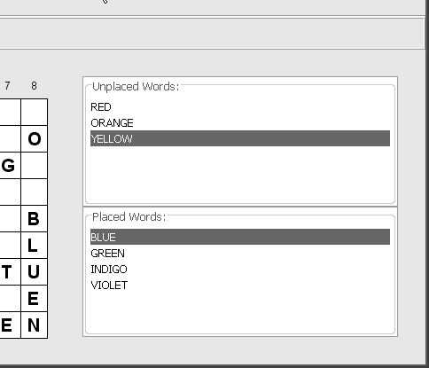


*firstPress: 使用 JavaFX 创建用户界面*

*图 3-14. 单词搜索生成器应用程序中 EmptyBorder 的效果* WordSearchMain.fx 中创建的另一种边框是 EtchedBorder，其外观是在 UI 组件周围有一层细的蚀刻（凸起或凹陷）。单词搜索生成器应用程序在工具栏周围有一个 EtchedBorder，如图 3-15 所示。

*图 3-15. 单词搜索生成器应用程序中工具栏周围的 EtchedBorder* 您可以在清单 3-4 顶部附近看到创建 EtchedBorder 并将其赋值给 ToolBar 边框的代码，其中指定了 RAISED 蚀刻样式。表 3-2 包含了 JavaFX 边框类型供您参考。与之前的表格一样，我在属性后面显示了属性的类型。在适用且实际的情况下，我也会显示该属性的常量。

*firstPress: 使用 JavaFX 创建用户界面*

*表 3-2. JavaFX 边框类型*

**边框类型**

**描述**

**公共属性**

BevelBorder

带有斜角的边框

style:BevelType LOWERED, RAISED

highlight:Color

shadow:Color

innerHighlight:Color?

innerShadow:Color?

EtchedBorder

带有凸起或凹陷

style:EtchType LOWERED, RAISED

蚀刻的边框

highlight:Color?

shadow:Color?

EmptyBorder

带有空白间距且

top:Number

尺寸可配置的边框

left:Number

bottom:Number


right:Number

LineBorder

带线条的边框

thickness:Integer

lineColor:Color

roundedCorners:Boolean

MatteBorder

具有可配置尺寸和哑光或平铺效果的边框

与 EmptyBorder 属性相同，另加：

matteColor:Color?

tileIcon:Icon?

ShadowedBorder

带阴影的边框

无属性

SoftBevelBorder

一种带有圆角的 BevelBorder

与 BevelBorder 属性相同

*(续)*

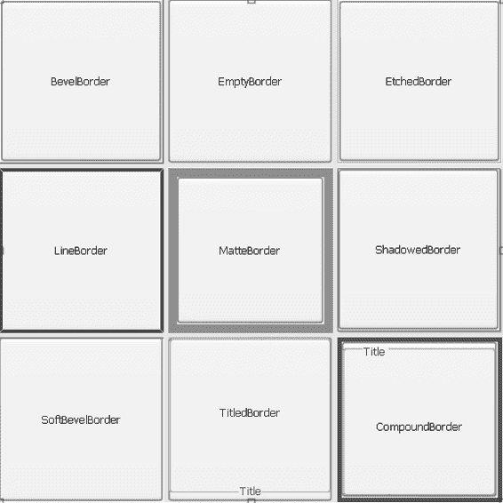

*firstPress: 使用 JavaFX 创建用户界面*

**边框类型**

**描述**

**公共属性**

TitledBorder

任何类型的边框，附加标题

border:Border?

title:String

titlePosition:TitledBorderPosition DEFAULT,

ABOVE_TOP, TOP, BELOW_TOP,

ABOVE_BOTTOM, BOTTOM,

BELOW_BOTTOM

titleJustification:TitledBorderJustification

DEFAULT, LEFT, CENTER, RIGHT, LEADING,

TRAILING

titleFont:Font?

titleColor:Color?

CompoundBorder

允许创建边框中的边框

borders:Border*

为了帮助您直观地了解每种边框类型，图 3-16 展示了 BordersExample.fx 中 JavaFX 脚本输出的截图。

*图 3-16. BordersExample.fx 的输出，包含每种 JavaFX 边框类型*

*firstPress: 使用 JavaFX 创建用户界面*

供您参考，生成图 3-16 中输出的代码如清单 3-4 所示。它为九个 Button 控件分别分配了不同的边框，Button 是 JavaFX 控件，用户可点击以触发某些操作。我们将在“单词搜索生成器”应用程序工具栏的上下文中更详细地介绍 Button 控件。这段代码还包含一个我们尚未讨论的概念，即*布局控件*，但将在下一节中介绍。现在，只需专注于与边框相关的代码即可。

*清单 3-4. BordersExample.fx 程序*

package jfx_book;

import javafx.ui.*;

import javafx.ui.canvas.*;

Frame {

title: "JavaFX 边框"

width: 500

height: 500

visible: true

content:

GridPanel {

rows: 3

columns: 3

vgap: 5

hgap: 5

cells: [

Button {

text: "BevelBorder"

border:

BevelBorder {

}

},

Button {

text: "EmptyBorder"

border:

EmptyBorder {

top: 20

left: 20

bottom: 20

right: 20

}

},

Button {

*firstPress: 使用 JavaFX 创建用户界面*

text: "EtchedBorder"

border:

EtchedBorder {

style: LOWERED

}

},

Button {

text: "LineBorder"

border:

LineBorder {

thickness: 4

lineColor: purple

roundedCorners: true

}

},

Button {

text: "MatteBorder"

border:

MatteBorder {

matteColor: cornflowerblue

top: 10

left: 10

bottom: 10

right: 10

}

},

Button {

text: "ShadowedBorder"

border:

ShadowedBorder {

}

},

Button {

text: "SoftBevelBorder"

border:

SoftBevelBorder {

style: LOWERED

}

},

Button {

text: "TitledBorder"

border:

TitledBorder {

*firstPress: 使用 JavaFX 创建用户界面*

title: "标题"

titlePosition: BOTTOM

titleJustification: CENTER

titleColor: darkmagenta

}

},

Button {

text: "CompoundBorder"

border:

CompoundBorder {

borders: [

MatteBorder {

matteColor: darkgreen

top: 5

left: 5

bottom: 5

right: 5

},

TitledBorder {

title: "标题"

titleColor: indigo

}

]

}

},

]

}

}

**理解 JavaFX 布局控件**

为不同平台设计用户界面面临诸多挑战，其中最主要的是不同平台上的 UI 组件在大小、外观和行为上通常存在差异。UI 组件的绝对定位可能适用于单一平台，但当您的 UI 需要在多个平台上良好运行时，就需要一种布局策略，使 UI 组件相对于彼此及其上下文进行定位。JavaFX *布局控件* 是解决此问题的一种非常简单且强大的方案。

布局控件有几种类型，它们可以协同使用以实现所需的组件放置。您刚刚在图 3-16 和清单 3-4 中看到的 BordersExample.fx 程序

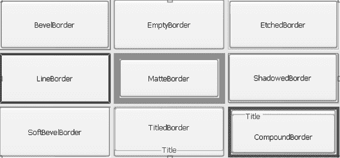

*firstPress: 使用 JavaFX 创建用户界面*

就是一个简单 UI 设计的良好示例，它只需要一个布局控件：GridPanel 布局控件。

**使用 GridPanel 布局控件**


如果你运行 `BordersExample.fx` 程序并垂直缩小窗口（或在使用 JavaFXPad 时移动拖拽手柄），结果仍会是九个均匀的单元格，每个单元格在垂直方向上比原来更小。图 3-17 展示了我调整窗口大小时观察到的结果。

*图 3-17\. 垂直调整窗口大小后 `BordersExample.fx` 的输出* 让我们分析一下 `BordersExample.fx` 程序中的部分代码片段（如下所示），以便你学习如何使用 `GridPanel` 布局控件：

Frame {

**...部分代码省略...**

content:

GridPanel {

rows: 3

columns: 3

vgap: 5

hgap: 5

cells: [

Button {

**...部分代码省略...**

},

Button {

**...部分代码省略...**

},

*firstPress: 在 JavaFX 中创建用户界面*

Button {

**...部分代码省略...**

},

Button {

**...部分代码省略...**

},

Button {

**...部分代码省略...**

},

Button {

**...部分代码省略...**

},

Button {

**...部分代码省略...**

},

Button {

**...部分代码省略...**

},

Button {

**...部分代码省略...**

},

]

}

}

在上述代码中，我们首先将一个 `GridPanel` 控件赋值给 `Frame` 的 `content` 属性。这导致 `Frame` 中 UI 组件的布局由 `GridPanel` 布局控件的规则控制。

接下来，我们通过为 `rows` 和 `columns` 属性赋予所需的值，告诉 `GridPanel` 网格中应有多少行和列。

从图 3-17 的截图中你会注意到，网格中的单元格之间存在一些间距。这是通过为 `vgap` 和 `hgap` 属性（以像素为单位）赋予所需的值来实现的，分别用于控制垂直和水平间距。

然后，我们使用数组字面量表示法，为 `GridPanel` 中的每个单元格分配一个 UI 组件。`GridPanel` 中的 UI 组件会扩展至单元格的大小，这就是为什么此示例中的 `Button` 控件几乎和单元格一样大。

注意 ➡ 虽然我展示了将 `GridPanel` 控件赋值给 `Frame` 的 `content`，但请注意，任何布局控件都可以赋值给任何能够包含控件的 GUI 组件。这包括例如 `Frame`、`Dialog` 以及所有布局控件。我将这些类型的组件统称为 *UI 容器*。


*firstPress: 在 JavaFX 中创建用户界面*

让我们来看另一个非常有用的布局控件，名为 `Box`。

**使用 Box 布局控件**

`Box` 布局控件用于在 UI 容器中垂直或水平堆叠 UI 组件。你可以在图 3-18 的截图中看到使用 `Box` 布局控件的效果，其中 `WordGridView` 和 `WordListsView` 自定义 UI 组件水平排列。请注意，我在此截图中添加了虚线，以显示 `Box` 布局控件的位置（外部虚线矩形）以及每个 UI 组件在 `Box` 布局控件内的位置（内部虚线矩形）。

*图 3-18\. 在 Word Search Builder 应用程序中使用 Box 布局控件* 你将在 `WordSearchMain.fx` 的以下代码片段中看到与 `Box` 控件相关的代码：

Box {

orientation: HORIZONTAL

content: [

Canvas {

content: bind wgModel.wordGridView

},

BorderPanel {

center: bind wgModel.wordListsView

}

]

}

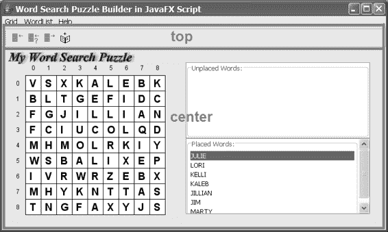

*firstPress: 在 JavaFX 中创建用户界面*

`orientation` 属性控制 `Box` 中的 UI 组件是水平排列还是垂直排列。`content` 属性通过数组字面量表示法分配一个或多个 UI 组件。请注意，其中一个被分配的 UI 组件是 `BorderPanel` 布局控件——这是一个布局控件嵌套在另一个布局控件中以实现所需 UI 组件放置的示例。

说到 `BorderPanel` 布局控件，让我们将注意力转向它。

**使用 BorderPanel 布局控件**


BorderPanel 布局控件在 Word Search Builder 应用程序中用于将工具栏放置在应用程序框架的顶部，并允许界面中的其余组件占据工具栏未占用的剩余可用区域。这一点在图 3-19 的截图中得到了说明，为了清晰起见，我在图中添加了粗线和 BorderPanel 的属性名称。

*图 3-19. 在 Word Search Builder 应用程序中使用 BorderPanel 布局控件* 你将在以下来自 WordSearchMain.fx 的代码片段中看到与 BorderPanel 控件相关的代码：

BorderPanel {

top:

ToolBar {

*firstPress: 使用 JavaFX 创建用户界面*

**...部分代码省略...**

}

center:

Box {

**...部分代码省略...**

}

}

BorderPanel 控件有五个可用属性：top、bottom、left、right 和 center。这些属性的任意组合都可以分配界面组件。未分配给 center 属性的界面组件所剩余的任何空间，都将由分配给 center 的界面组件（如果已分配）占据。

表 3-3 列出了所有 JavaFX 布局控件类型，以及描述和属性（在适用情况下包含常量）。

**布局控件类型**

*表 3-3. 布局控件类型*

**布局控件**

**描述**

**公共属性**

BorderPanel

提供将界面组件放置在

top:Widget?

界面容器的顶部、左侧、

left:Widget?

底部和/或右侧的能力，

bottom:Widget?

任何可用空间将由位于

right:Widget?

中心的界面组件（如果已

center:Widget?

分配给 center）占据。

Box

界面组件可以在界面

orientation:Orientation VERTICAL,

容器内水平或垂直堆叠。

HORIZONTAL

content:Widget*

CardPanel

提供一次查看一个界面

selection:Number

组件的能力，就像从一副

cards:Widget*

牌组中选择卡片一样。

*firstPress: 使用 JavaFX 创建用户界面*

**布局控件**

**描述**

**公共属性**

FlowPanel

界面组件从左到右流动，

Alignment:Alignment LEADING, TRAILING,

保持其原始大小。

CENTER, BASELINE

vgap:Number

hgap:Number

content:Widget*

GridBagPanel

一种非常灵活但复杂的

Cells:GridCell*

网格布局界面组件的

GridCell 具有：

方式。与 GridCell 类

配合使用。

insets:Insets?

Anchor:Anchor CENTER, NORTH, SOUTH,

EAST, WEST, NORTHWEST,

NORTHEAST, SOUTHWEST,

SOUTHEAST, PAGE_START, PAGE_END,

LINE_START, FIRST_LINE_START,

FIRST_LINE_END, LAST_LINE_START,

LAST_LINE_END

gridwidth:Number

gridheight:Number

gridx:Number

gridy:Number

fill:Fill HORIZONTAL, VERTICAL, BOTH,

NONE

weightx:Number

weighty:Number

ipadx:Number

ipady:Number

content:Widget

GridPanel

界面组件排列在网格中，

rows:Number

单元格大小相等。每个

columns:Number

组件扩展至网格单元格

hgap:Number?

的大小。

vgap:Number?

cells:Widget*

*(续)*

*firstPress: 使用 JavaFX 创建用户界面*

**布局控件**

**描述**

**公共属性**

GroupPanel

行和列使用 Row 和

autoCreateGaps:Boolean

Column 类定义，每个

autoCreateContainerGaps:Boolean

界面组件被分配到指定

Row 和 Column 具有：

的行和列。在布局对话框

alignment:Alignment? LEADING,

时非常有用。

TRAILING, CENTER, BASELINE

resizable: Boolean

StackPanel

将界面组件堆叠在彼此

content:Widget*

之上。

我们已经详细介绍了 BorderPanel、Box 和 GridPanel 布局控件的示例。在第 5 章中，你还会看到 GroupPanel 布局控件的实际应用。

提示 ➡ 大多数布局控件都是同名 Java 布局管理器的 JavaFX 改编版。Sun 的在线 Java 教程包含一个页面，展示了这些布局中大部分的图形示例。如果你深入研究使用这些布局创建界面的 Java 代码，你会体会到 JavaFX 声明式脚本在构建界面方面所提供的强大功能和简洁性。以下是链接：


[`java.sun.com/docs/books/tutorial/uiswing/layout/visual.html`](http://java.sun.com/docs/books/tutorial/uiswing/layout/visual.html)

在本章中，我想再教你一个概念：如何创建和使用工具栏。

**创建工具栏**

清单 3-5 包含了来自 WordSearchMain.fx 文件的一段代码片段，该代码与创建 Word Search Builder 应用程序的工具栏相关。

*firstPress: 使用 JavaFX 创建用户界面*

清单 3-5\. 在 WordSearchMain.fx 中创建工具栏组件 ToolBar {

floatable: true

border:

EtchedBorder {

style:RAISED

}

buttons: 

Button {

icon:

Image {

url: "file:resources/place_word.gif"

}

toolTipText: "在网格上放置单词"

enabled: bind not wgModel.fillLettersOnGrid

action: operation() {

wsHandlers.gridPlaceWord();

}

},

Button {

icon:

Image {

url: "file:resources/place_random.gif"

}

toolTipText: "在网格上随机放置单词"

enabled: bind not wgModel.fillLettersOnGrid

action: operation() {

wsHandlers.gridPlaceWordRandomly();

}

},

Button {

icon:

Image {

url: "file:resources/unplace_word.gif"

}

toolTipText: "从网格中移除（取消放置）单词"

enabled: bind not wgModel.fillLettersOnGrid

action: operation() {

wsHandlers.gridUnplaceWord();

}

},

Button {

![图片 31

*firstPress: 使用 JavaFX 创建用户界面*

icon:

Image {

url: "file:resources/add_word.gif"

}

toolTipText: "将单词添加到单词列表"

action: operation() {

wsHandlers.wordListAddWord();

}

}

]

}

正如你在图 3-19 和相关代码中所见，此工具栏组件被分配给了 BorderPanel 布局组件的 top 属性，这就是它出现在 Frame 顶部的原因。通过将 floatable 属性设置为 true，我们允许用户将此工具栏组件从 Frame 对象的顶部拖拽到其独立的浮动窗口中，如图 3-20 所示。

*图 3-20\. 工具栏的 floatable 属性允许用户取消停靠工具栏* 工具栏上最常用的 UI 组件是 Button 组件，但其他一些 JavaFX 组件也可以放置在工具栏上。

*firstPress: 使用 JavaFX 创建用户界面*

**在工具栏上使用按钮组件**

如清单 3-5 所示，要将 Button 组件（或其他类型的组件）放置在 ToolBar 组件上，你需要将它们分配给 buttons 属性。通常，工具栏按钮会显示一个图标，当用户将鼠标光标悬停在按钮上时，会出现一个工具提示，其中包含简要描述按钮用途的文本。图 3-20 显示了因悬停而显示的工具提示。要使图标显示在 Button 组件上，我们将一个 Image 实例分配给 icon 属性，并提供包含所需图像文件位置的 URL。要定义工具提示的文本，我们将一个字符串分配给 Button 组件的 toolTipText 属性。

我们在工具栏按钮上使用的另外两个属性与它们在 MenuItem 对应项上使用的属性相同，并且在本章前面已经描述过。

例如，将此工具栏上第一个 Button 组件的 enabled 和 action 属性所分配的值，与清单 3-2 中 Grid ➤ Place Word MenuItem 的相同属性进行比较。

供你参考，表 3-4 包含了本书迄今为止（按出现顺序）介绍过的 JavaFX 类，但这些类尚未在表格中出现过。此表还包含一个我尚未提及的类（名为 SimpleLabel），但你将在本表之后的练习中使用它。某些类包含的属性太多，无法在此全部展示，因此我选择了你在声明式代码中最可能使用的那些属性。要查看与某个类相关的其他公共属性（以及操作和函数），请查阅该类的 JavaFX 源代码。

*表 3-4\. 部分 JavaFX 类*

**类**

**描述**

**公共属性**

Frame

JavaFX 应用程序的

shape:Shape?

主窗口。

disposeOnClose:Boolean

hideOnClose:Boolean

screenx:Number?\

screeny:Number?

menubar:MenuBar?

content:Widget

dispose:Boolean

title:String

*(续)*


*firstPress: 在 JavaFX 中创建用户界面*

**类**

**描述**

**公共属性**

Frame

JavaFX 应用程序的主窗口。

height:Number?

width:Number?

onOpen:function()

onClose:function()

centerOnScreen:Boolean

background:Color?

visible:Boolean

resizable:Boolean

iconImage:Image?

undecorated:Boolean

showing:Boolean

iconified:Boolean

active:Boolean

Canvas

一个用于执行 2D 绘图的 JavaFX 控件。

content:Node*

scaleToFit:Boolean

Canvas 是 JavaFX Widget 类的子类（因此继承了其属性），因此您的应用程序在使用 Canvas 时可以使用 Widget 类中定义的属性（如下表所示）。

onDrop:function(e:CanvasDropEvent)?

onDragEnter:function(e:CanvasDropEvent)?

onDragExit:function(e:CanvasDropEvent)?

dropType:Class?

canAcceptDrop:function(e:CanvasDropEvent):Boolean?

Widget

所有非窗口 UI 组件（即控件）都派生自的 JavaFX 类。

keyboardAction:KeyboardAction*

x:Number?

y:Number?

width:Number?

height:Number?

toolTipText:String?

visible:Boolean?

*firstPress: 在 JavaFX 中创建用户界面*

Widget

所有非窗口 UI 组件（即控件）都派生自的 JavaFX 类。

background:AbstractColor?

foreground:Color?

font:Font?

border:Border?

cursor:Cursor?

enabled:Boolean?

onMouseEntered:function(e:MouseEvent)

onMouseExited:function(e:MouseEvent)

onMousePressed:function(e:MouseEvent)

onMouseReleased:function(e:MouseEvent)

onMouseClicked:function(e:MouseEvent)

onMouseMoved:function(e:MouseEvent)

onMouseDragged:function(e:MouseEvent)

onMouseWheelMoved:function(e:MouseWheelEvent)

onKeyUp:function(event:KeyEvent)

onKeyDown:function(event:KeyEvent)

onKeyTyped:function(event:KeyEvent)

Text

一个用于在画布上绘制文本的 JavaFX 类。

editable:Boolean

content:String

x:Number

y:Number

font:Font?

verticalAlignment:Alignment LEADING, TRAILING, CENTER, BASELINE

Font

一个指定字体的 JavaFX 类。

face:FontFace? ALBANY, ANDALE_SANS, ANDALE_SANS_UI, ARIAL, ARIAL_BLACK, ARIAL_NARROW, 等。

faceName:String?

size:Integer

style:FontStyle* BOLD, PLAIN, ITALIC

styleStr:String

*(续)*

*firstPress: 在 JavaFX 中创建用户界面*

ToolBar

通常位于窗口顶部的矩形区域，包含按钮和其他可能的控件。ToolBar 是 Widget 类（在本表前面的条目中已介绍）的子类，并继承其属性。

floatable:Boolean?

rollover:Boolean

borderPainted:Boolean?

orientation:Orientation

margin:Insets?

buttons:Widget*

Button

Widget 类的子类，用户可以点击（或以其他方式激活）它来触发某个操作。

defaultButton:Boolean?

defaultCancelButton:Boolean?

text:String?

mnemonic:KeyStroke?

icon:Icon?

selectedIcon:Icon?

pressedIcon:Icon?

rolloverIcon:Icon?

rolloverSelectedIcon:Icon?

rolloverEnabled:Boolean

disabledIcon:Icon?

disabledSelectedIcon:Icon?

iconTextGap:Number?

horizontalTextPosition:HorizontalAlignment? LEADING, CENTER, TRAILING

verticalTextPosition:VerticalAlignment? CENTER, TOP, BOTTOM

horizontalAlignment:HorizontalAlignment? LEADING, CENTER, TRAILING

verticalAlignment:VerticalAlignment? CENTER, TOP, BOTTOM

Image

一个图标，包含加载图形图像的位置（例如，来自 Web URL 或用户的本地文件系统）。

url:String?

size:Dimension?

onLoad:function()

*firstPress: 在 JavaFX 中创建用户界面*

SimpleLabel

Widget 类的子类，用于显示文本。它通常用作其他 UI 组件前面或上方的标签。

text:String

icon:Icon?

horizontalAlignment:HorizontalAlignment LEADING, CENTER, TRAILING

mnemonic:KeyStroke?

labelFor:Widget?

正如所承诺的，这里有一个练习，它使用了新介绍的 SimpleLabel，以及本章介绍的许多概念。

**键盘练习**

在本练习中，您将创建一个 JavaFX 程序，该程序大致类似于计算器上的键盘和数字显示屏。以下是本练习的要求：

•

键盘应有九个按钮，排列成三乘三的网格，数字 1 到 9 分配给它们的文本属性。在键盘周围放置某种明显的边框。提示：示例解决方案使用 GridPanel 来排列按钮。

•

数字显示屏应出现在键盘顶部，由一个 SimpleLabel 控件组成，该控件显示最后点击的按钮的数字。提示：为了实现这种排列，示例解决方案将 SimpleLabel 分配给 BorderPanel 的 top 属性，并将 GridPanel 分配给 BorderPanel 的 center 属性。

•

为了使其看起来更像计算器，数字应在 SimpleLabel 控件上右对齐。

•

SimpleLabel 应有一个 EmptyBorder，在右侧提供间距，以便数字看起来不会太靠近 Frame 的右边缘。

•

提示：类解决方案使用 SimpleLabel 的 font 属性（它从 Widget 类继承而来）使显示屏中的数字比默认值稍大一些。

*firstPress: 在 JavaFX 中创建用户界面*

• 程序应有一个菜单，菜单上有两个菜单项：

•

一个 CheckBoxMenuItem，其文本为 *Disabled*。当选中此菜单项时，所有按钮都被禁用；当未选中时，所有按钮都被启用。Ctrl+D 快捷键组合应选择此菜单项。提示：示例解决方案使用 bind 运算符来实现此功能。

•

一个 MenuItem，其文本为 *Exit*。当用户选择此菜单项时，程序将退出。

• 初始程序应位于名为 KeyPadMain.fx 的文件中，并应使用一个模型，其类名为 KeyPadModel，位于单独的文件中。为了给您一些帮助，以下是示例解决方案中 KeyPadModel 类的两行代码：attribute keysDisabled: Boolean;

attribute letterClicked: String;

对于此练习，我想再提供一个提示：示例解决方案中每个 Button 上的 action 属性赋值类似于以下内容：

operation() {

kpModel.letterClicked = "1";

}

图 3-21 是本练习示例解决方案输出的屏幕截图。

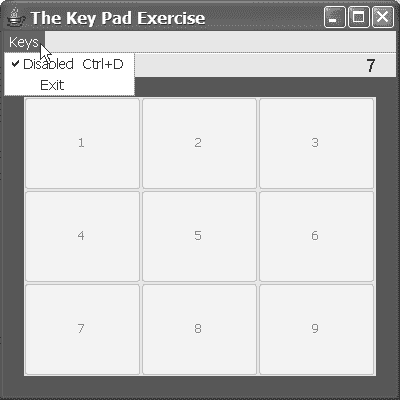

*firstPress: 在 JavaFX 中创建用户界面*

*图 3-21. 键盘练习的示例解决方案*

祝您享受这个练习！

**总结**

再次祝贺您取得的进步！我希望您觉得键盘练习有所帮助，并且至少有一点挑战性。以下是您现在可以庆祝的一些成就：

•

您参观了 Word Search Builder 应用程序，它作为一个重要的 JavaFX 示例，可供您学习 JavaFX。您还研究了它的架构，在设计自己的 JavaFX 应用程序时，可以将其用作参考。

•

您学习了为 JavaFX 应用程序创建菜单，并在此过程中学习了如何使用 MenuBar、Menu、MenuItem、CheckBoxMenuItem、MenuSeparator 和 Accelerator 类。您还发现有一个 RadioButtonMenuItem 类，其功能与您将在第 5 章中学习的 RadioButton 类类似。

•

您学习了如何通过调用 Java 类中包含的方法来利用现有 Java 代码的庞大资源。

*firstPress: 在 JavaFX 中创建用户界面*

•

您复习了创建 JavaFX 类实例的声明式语法，并学习了执行相同操作的过程式语法（使用 new 运算符）。

•

您学习了如何创建和使用 JavaFX 中的所有边框类型，包括 BevelBorder、EtchedBorder、EmptyBorder、LineBorder、MatteBorder、ShadowedBorder、SoftBevelBorder、TitledBorder 和 CompoundBorder。回想一下，CompoundBorder 使您能够组合多种边框类型，将一个边框放置在另一个边框内部。

•


你已了解了 JavaFX 如何通过其布局控件集（包括 `BorderPanel`、`Box`、`CardPanel`、`FlowPanel`、`GridBagPanel`、`GridPanel`、`GroupPanel` 和 `StackPanel`）在跨平台环境中处理 UI 组件的放置。其中，你在练习中使用了 `BorderPanel` 和 `GridPanel` 类，演练了一个 `Box` 类的示例，并了解了其余控件的描述和属性。

你将在第 5 章中获得一些使用 `GroupPanel` 布局控件的经验。

•

你已了解了如何创建 JavaFX `ToolBar` 控件，以及如何在工具栏上创建并放置包含图标的按钮。

•

你已了解了 `SimpleLabel` 控件的用途和属性列表，并在练习中使用了它。你还了解到，JavaFX UI 中的许多类（包括 `SimpleLabel`）都从 `Widget` 类继承其属性，并且你看到了其中的几个属性。

在下一章中，我将帮助你理解如何创建 JavaFX 类并涵盖相关概念，其中一些概念我在本章中已经提及。我们将讨论的概念包括 JavaFX 类、操作、触发器、语句、运算符、表达式、数组、数据类型和访问修饰符。下一章的任务确实很艰巨，但你将学到很多东西！

**资源**

以下是一些你可以探索的 JavaFX 资源，以补充本章所学内容，并了解 JavaFX 的历史视角：

*firstPress: Creating User Interfaces in JavaFX*

•

*Getting Started with the JavaFX Script Language (for Swing Programmers)*：这是 OpenJFX 网站上的一个网页，重点介绍如何使用 JavaFX 声明式代码创建用户界面。正如我所提到的，JavaFX 的优势之一在于它能够利用 Java 代码。Java Swing 是一套高度进化且丰富的用户界面库，JavaFX 使用它来实现你用 JavaFX 声明式代码表达的内容。

该资源探讨了许多这些 JavaFX UI 组件。其中一些材料对你来说是复习，但它也涵盖了一些本书范围之外的 UI 组件。网址是：

[`openjfx.dev.java.net/Getting_Started_With_JavaFX.html.`](https://openjfx.dev.java.net/Getting_Started_With_JavaFX.html)

•

*Chris Oliver*：Chris 是 F3（现在称为 JavaFX）的创建者。要了解其创建者对 JavaFX 的历史（且非常有趣的）视角，你可以查看他的 F3 博客：[`blogs.sun.com/chrisoliver/category/F3`](http://blogs.sun.com/chrisoliver/category/F3) 以及他的 JavaFX 博客：[`blogs.sun.com/chrisoliver/category/JavaFX.`](http://blogs.sun.com/chrisoliver/category/JavaFX)

*firstPress: Creating User Interfaces in JavaFX*

**第 4 章**

**创建 JavaFX 类和**

**对象**

*我按照我的想法来描绘对象，而不是按照我所见到的样子。*

巴勃罗·毕加索

既然你已经获得了一些在 JavaFX 中开发 UI 的经验，我想换个角度，更全面地向你展示如何定义类。在本章中，你将获得编写操作和函数以及*触发器*（触发器会在特定条件下自动调用）的理解和经验。你还将熟悉 JavaFX 语句、表达式、*序列*（也称为数组）以及与创建类相关的其他概念。我将以上一章开始研究的 Word Search Builder 应用程序为背景，带你逐一了解这些内容。

**测试 Word Search Builder 模型**

图 4-1 放大了上一章图 3-12 中的 `wordsearch_jfx.model` 包，并展示了该包中类里的许多属性、操作和触发器。你会注意到，该图的左上角是一个名为 `WordGridModelTester` 的新类，我们将使用它来独立测试模型，而不依赖于 `wordsearch_jfx.ui` 包中的 JavaFX 代码。


我可能无需再向您强调进行此类持续模块化测试的必要性。不过，我想说的是，像这样的测试类在初始开发阶段为我节省了大量时间，并且是确保模型在修改后仍能正确运行的快捷方式。稍后您将看到，JavaFX 为此类测试提供了一些出色的内置功能。

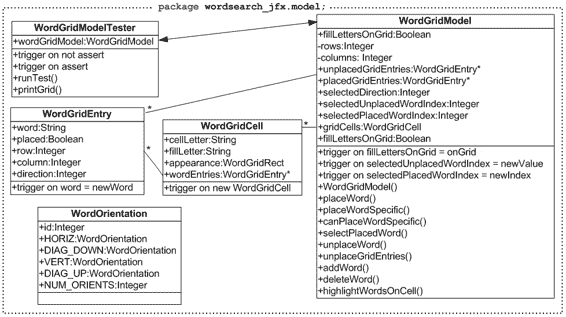

*firstPress: 创建 JavaFX 类与对象*

*图 4-1. 单词搜索生成器模型包框图* 请重新阅读第 3 章图 3-12 之后立即展示的类描述，然后执行 `WordGridModelTester.fx` 中的 JavaFX 脚本，该脚本包含 `WordGridModelTester` 类，如清单 4-2 所示。

我将向您展示另一种运行 JavaFX 程序的方法，这次是从命令行运行。只需按照以下步骤操作，并根据您的平台调整说明：1. 设置您的路径，使其包含从 Project OpenJFX 网站下载的 `trunk/bin` 文件夹。

2. 在命令提示符位于应用程序包所在文件夹（本例中为代码下载的 `Chapter04` 文件夹）的情况下，运行类似于以下命令的命令（我在 Windows 平台上使用了此命令）：`javafx.bat wordsearch_jfx.model.WordGridModelTester`

顺便提一下，该文件夹中还有一个 `javafx.sh` 文件。请注意，您需要使用要运行的 JavaFX 文件的完全限定名称（包括包名）。清单 4-1 包含了我刚才运行它时收到的控制台输出。

*firstPress: 创建 JavaFX 类与对象* 83

*清单 4-1. WordGridModelTester.fx 程序的示例输出*
`wordsearch_jfx.model.WordGridEntry {word: 'RED' placed: ➥
false row: 0 column: 0 direction: 0}`
`wordsearch_jfx.model.WordGridEntry {word: 'ORANGE' placed: ➥
false row: 0 column: 0 direction: 0}`
`wordsearch_jfx.model.WordGridEntry {word: 'YELLOW' placed: ➥
false row: 0 column: 0 direction: 0}`
`wordsearch_jfx.model.WordGridEntry {word: 'GREEN' placed: ➥
false row: 0 column: 0 direction: 0}`
`wordsearch_jfx.model.WordGridEntry {word: 'BLUE' placed: ➥
false row: 0 column: 0 direction: 0}`
`wordsearch_jfx.model.WordGridEntry {word: 'INDIGO' placed: ➥
false row: 0 column: 0 direction: 0}`
`wordsearch_jfx.model.WordGridEntry {word: 'VIOLET' placed: ➥
false row: 0 column: 0 direction: 0}`

红色已放置，结果为真。预期为真。
绿色已放置，结果为假。预期为真。
黑色已放置，结果为假。预期为假。
蓝色已放置，结果为真。预期为真。
黄色已放置，结果为假。预期为假。
靛蓝色已放置，结果为假。预期为假。
使用 'orange' 调用 placeWord，应返回 false
断言失败！
使用 'red' 调用 placeWord，应返回 false
断言通过！

|B
|
|L
E|
|U GD|
|E NE |
| AR |
| R
|
|O
|

将 fillLettersOnGrid 设置为 'true'
|BRYAIR|
|LGIJPE|
|URFDGD|
|ECRNEP|
|UEARCL|
|ARPLAD|

*firstPress: 创建 JavaFX 类与对象*
|OPNRXT|

如上所示，该程序通过调用 `WordGridModel` 类的操作来测试模型中的类，并将结果打印到控制台。

注意 ➡ 我已将所有单词搜索生成器文件放置在 `Chapter04` 文件夹中，因此您可以在命令行中使用适合您平台的 `javafx` 命令来运行单词搜索生成器程序。我在 Windows 平台上使用了以下命令：`javafx.bat wordsearch_jfx/ui/WordSearchMain`。

现在，让我们逐行分析清单 4-2（`WordGridModelTester.fx` 程序）中的代码，该程序产生了上面显示的输出。

*清单 4-2. WordGridModelTester.fx 程序*

`package wordsearch_jfx.model;`

`import javafx.ui.*;`

`import java.lang.System;`

`class WordGridModelTester {`

`attribute wordGridModel:WordGridModel;`

`operation runTest();`

`operation printGrid();`

`}`

`attribute WordGridModelTester.wordGridModel = new WordGridModel(7, 6);` `trigger on not assert assertion {`

`println("Assertion failed!");`

`}`

`trigger on assert assertion {`

`println("Assertion passed!");`

`}`


operation WordGridModelTester.runTest() {

wordGridModel.addWord("red");

wordGridModel.addWord("orange");

*firstPress: 创建 JavaFX 类和对象* 85

wordGridModel.addWord("yellow");

wordGridModel.addWord("green");

wordGridModel.addWord("blue");

wordGridModel.addWord("indigo");

wordGridModel.addWord("violet");

// 遍历未放置的 WordEntry 实例并打印输出
for (wge in wordGridModel.unplacedGridEntries) {

System.out.println(wge);

}

var placed;

// 尝试放置一个单词。预期会成功。

placed = wordGridModel.placeWordSpecific("red", 4, 3, DIAG_UP:WordOrientation.id);

System.out.println("It is {placed} that red was placed. Expected true.");

// 尝试放置一个单词，使其某个字母与另一个单词中的相同字母相交。
// 在此例中，我们尝试放置 "green"，使其与 "red" 中的 "e" 相交。

placed = wordGridModel.placeWordSpecific("GREEN", 3, 2, HORIZ:WordOrientation.id);

System.out.println("It is {placed} that green was placed. Expected true.");

// 尝试放置一个不在未放置单词列表中的单词
placed = wordGridModel.placeWordSpecific("black", 0, 0, VERT:WordOrientation.id);

System.out.println("It is {placed} that black was placed. Expected false.");

// 尝试放置一个单词。预期会成功。

placed = wordGridModel.placeWordSpecific("blue", 0, 0, VERT:WordOrientation.id);

System.out.println("It is {placed} that blue was placed. Expected true.");

// 尝试以部分单词超出网格边界的方式放置单词
placed = wordGridModel.placeWordSpecific("yellow", 5, 5, DIAG_DOWN:WordOrientation.id);

System.out.println("It is {placed} that yellow was placed. Expected false.");

// 尝试放置一个单词，使其某个字母与另一个单词中的不同字母相交
// （在此例中，我们尝试放置 "indigo"，使其与 "blue" 中的 "b" 相交）

*firstPress: 创建 JavaFX 类和对象*

placed = wordGridModel.placeWordSpecific("indigo", 0, 0, HORIZ:WordOrientation.id);

System.out.println("It is {placed} that indigo was placed. Expected false.");

// 尝试随机放置一个单词。如果网格上有任何可用的放置位置（此时应该存在），则预期会成功。
// 这次使用 assert 语句。我们假设预期返回 false，以便看到断言失败。

System.out.println("Calling placeWord with 'orange', should return false"); assert wordGridModel.placeWord("orange") == false;

// 尝试随机放置一个已在网格上的单词。
// 这次使用 assert 语句

System.out.println("Calling placeWord with 'red', should return false"); assert wordGridModel.placeWord("red") == false;

printGrid();

// 使填充字母出现在网格上

System.out.println("Setting fillLettersOnGrid to 'true'"); wordGridModel.fillLettersOnGrid = true;

printGrid();

}

operation WordGridModelTester.printGrid() {

System.out.println("--------");

for (row in [0.. wordGridModel.rows - 1]) {

System.out.print("|");

for (column in [0.. wordGridModel.columns - 1]) {

System.out.print(wordGridModel.gridCells

[row * wordGridModel.columns + column].cellLetter);

}

System.out.println("|");

}

System.out.println("--------");

}

var tester = WordGridModelTester{};

tester.runTest();

*firstPress: 创建 JavaFX 类和对象* 87

**理解 JavaFX 类的结构**

查看上述代码清单的顶部，你会看到一些前面章节中熟悉的 JavaFX 概念，例如包声明、导入语句和属性声明。如下面的代码片段所示，此类中定义的名为 `wordGridModel` 的属性类型为 `WordGridModel`，这意味着它能够持有对 `WordGridModel` 类实例的引用。除了属性声明之外，类定义还可以包含操作声明，如下所示：
class WordGridModelTester {

attribute wordGridModel:WordGridModel;

operation runTest();

operation printGrid();

}

注意 ➡ 稍后你会看到，类定义也可以包含函数声明。JavaFX 函数包含 JavaFX 操作功能的一个子集。

**理解属性初始化器**

属性的初始化发生在类定义之外，如下面当前示例中的*属性初始化器*所示：
attribute WordGridModelTester.wordGridModel = new WordGridModel(7, 6);
请注意，在属性初始化器中，属性必须用类名进行限定。

在这个特定例子中，赋值给 `wordGridModel` 属性的值是对 `WordGridModel` 类新实例的引用。当我们对这个实例进行测试时，需要这个引用来调用 `WordGridModel` 实例的操作。

如果属性未被初始化，则会根据其数据类型分配一个默认值。

我将在本章稍后介绍基本（也称为*原始*）数据类型及其默认值。

*firstPress: 创建 JavaFX 类和对象*

**触发器介绍**

JavaFX 的一个特性是触发器的概念，它使得声明式脚本能够与类很好地协同工作。正如你所料，当特定条件发生时，触发器会自动运行。此类中的触发器是一种较少使用的形式，但它们仍然非常方便。其中一个触发器在 assert 语句执行时运行，如下所示：

assert wordGridModel.placeWord("red") == false;

上述语句断言，将单词 *red* 传递给 `wordGridModel` 对象的 `placeWord()` 操作将返回 false。

注意 ➡ 相等运算符由两个等号 (==) 组成，用于比较其左侧表达式的值与右侧表达式的值。如果表达式相等，则包含相等运算符的表达式的值为 true。

如果情况确实如此，将自动执行以下触发器：
trigger on assert assertion {

println("Assertion passed!");

}

然而，如果情况并非如此，则将运行以下触发器：
trigger on not assert assertion {

println("Assertion failed!");

}

我想重申，这种形式的触发器（`trigger on assert assertion`）以及 assert 语句本身，主要用于测试。我们稍后将讨论更常见的触发器语句形式。

**定义操作体**

继续看清单 4-2，你可以看到 `runTest()` 方法体的定义，从以下行开始：

*firstPress: 创建 JavaFX 类和对象* 89

operation WordGridModelTester.runTest() {

与属性初始化器一样，操作的定义必须用类名进行限定。

让我们逐步浏览这个操作体，检查其中包含的一些代码。在 `runTest()` 方法体的第一行，你可以看到一个如何调用对象操作的示例。在此例中，如下所示，正在调用 `WordGridModel` 类实例的 `addWord()` 方法，并传入一个值为 `red` 的 String 参数。

wordGridModel.addWord("red");

回想一下，这个实例之前是用 `new` 运算符创建的，并赋值给了名为 `wordGridModel` 的属性。

**生成控制台输出**

向下跳一点，暂时忽略 for 语句，看看下面的语句：


`System.out.println("It is {placed} that red was placed. Expected true.");` 你在本书前面曾使用 Java 的 `System` 类来退出应用程序。这里，它被用来获取标准输出流（在本例中是你的控制台）的引用，并调用其 `println()` 方法。你可以在 `println()` 方法中放入任何类型的表达式；这里我们提供了一个字符串。`println()` 方法会将表达式输出到控制台，并在其后添加一个新行。如果你希望输出表达式时不换行，那么可以使用 Java 的 `System.out.print()` 方法，如下面的代码清单所示：`System.out.print("|");`

**创建字符串表达式**

让我们再看一下下面的语句，包括它前面的一些代码行：

```java
var placed;

// 尝试放置一个单词。预期会成功。

placed = wordGridModel.placeWordSpecific("red", 4, 3, DIAG_UP:WordOrientation.id);

System.out.println("It is {placed} that red was placed. Expected true.");
```

*firstPress: 创建 JavaFX 类和对象*

请注意变量名 `placed` 周围的花括号。这是字符串字面量中的一种特殊语法，它会导致花括号内的表达式被求值并包含在字符串中。在这个例子中，名为 `placed` 的变量是布尔类型，其值要么是 `true`，要么是 `false`。在之前清单 4-1 所示的程序示例输出中，这是作为该语句的结果输出的：`It is true that red was placed. Expected true.`

在字符串字面量中使用 `{}` 运算符也是 JavaFX 中连接字符串的一种方式。请注意，`{}` 运算符只能用于双引号括起来的字符串字面量，不能用于单引号括起来的字符串字面量。

注意 ➡ 前面代码片段中 `DIAG_UP:WordOrientation.id` 表达式的 `DIAG_UP` 部分实际上是一个常量。你之前在处理颜色和字体时已经接触过常量。在 JavaFX 中，常量也被称为*命名实例*，因为它始终是某个被赋予名称的类型的实例。我将在本章稍后部分更详细地解释如何定义和使用常量。

**调用位于同一类中的操作**

请向下移动到如下所示的语句：

```java
printGrid();
```

`printGrid()` 操作与我们一直在研究的 `runTest()` 操作位于同一个类中。因此，要调用它，你不需要用类的实例来限定它。

**for 语句**

让我们暂时深入 `printGrid()` 操作内部，看看负责将单词网格中的字母打印到控制台的嵌套 `for` 语句（如下所示）：

```java
for (row in [0.. wordGridModel.rows - 1]) {

    System.out.print("|");

    for (column in [0.. wordGridModel.columns - 1]) {

        System.out.print(wordGridModel.gridCells

        [row * wordGridModel.columns + column].cellLetter);

    }

    *firstPress: 创建 JavaFX 类和对象* 91

    System.out.println("|");

}
```

`for` 语句的主体必须用花括号括起来，并且对于序列（也称为数组）中的每个元素执行一次。在这个例子中，每个 `for` 语句的序列都由一个*范围表达式*定义，如下面关于外层 `for` 语句所示：

`[0.. wordGridModel.rows - 1]`

这个范围表达式定义了一个数字序列，该序列从 0 开始，到 `wordGridModel.rows - 1` 表达式的值结束。范围表达式的语法如下：

*   一个左方括号，后跟
*   序列中的第一个数字，后跟
*   两个句点（..），后跟
*   序列中的最后一个数字，后跟
*   一个右方括号

可选地，你也可以通过在序列的第一个数字后跟一个逗号（,）和第二个数字来指定数字序列中的间隔。这两个数字之间的数值差决定了数组中包含的数字间隔。例如，以下范围表达式（不包含在当前示例中）定义了一个序列，该序列包含 5 到 100 之间所有 5 的倍数（包括 5 和 100），共 20 个数字：

`[5, 10 .. 100]`

然后，你可以创建一个 `for` 语句来遍历该序列，并打印出序列中当前元素的值，如清单 4-3 中的 `ForRangeExample.fx` 示例所示。

*清单 4-3. ForRangeExample.fx 程序*

```java
package jfx_book;

import java.lang.System;

class ForRangeExample {

    operation run();

}
```

*firstPress: 创建 JavaFX 类和对象*

```java
operation ForRangeExample.run() {

    for (i in [5, 10 .. 50]) {

        System.out.println("The value of the current element is {i}");

    }

}

var example =

    ForRangeExample {

    };

example.run();
```

请注意，在定义了类（包括操作的主体）之后，程序末尾有几个与 `ForRangeExample` 类无关的语句，它们创建了该类的一个实例并调用了 `run()` 操作。顺便提一下，`WordGridModelTester.fx` 程序在其最后两个语句中使用了相同的技术。

以下是你应该看到的输出：

```
The value of the current element is 5
The value of the current element is 10
The value of the current element is 15
The value of the current element is 20
The value of the current element is 25
The value of the current element is 30
The value of the current element is 35
The value of the current element is 40
The value of the current element is 45
The value of the current element is 50
```

由于本章是关于创建 JavaFX 类和对象的，到目前为止我向你展示的示例都是在类的上下文中。清单 4-4 包含一个 JavaFX 程序，它在不定义类的情况下产生相同的输出。

*清单 4-4. ForRangeExampleNoClass.fx 程序*

```java
package jfx_book;

for (i in [5, 10 .. 50]) {

    println("The value of the current element is {i}");

}
```

当然，你也可以省略 `package` 语句。请注意，我没有使用 `System.out.println()` 方法，而是使用了 JavaFX 的 `println()` 操作。这使得 `import java.lang.System` 语句变得不必要。在撰写本文时，JavaFX 中没有类似的

*firstPress: 创建 JavaFX 类和对象* 93

`print()` 操作，所以我通常只使用 `System.out` 中的方法来输出到控制台。

在结束 `for` 语句之前，请看一下我之前忽略的那个语句，如下所示：

```java
for (wge in wordGridModel.unplacedGridEntries) {

    System.out.println(wge);

}
```

这个语句也遍历一个序列，该序列包含未放置的 `WordGridEntry` 对象。这个序列在 `WordGridModel` 类中由以下代码行定义：

```java
public attribute unplacedGridEntries:WordGridEntry*;
```

你可能还记得，在属性声明中，属性类型后面的星号表示一个序列。更具体地说，星号表示一个可以包含零个或多个元素的序列。

注意 ➡ 在属性声明中，可以跟在属性类型后面的其他基数符号是加号（+），它表示一个可以包含一个或多个元素的序列，以及问号（?），它表示给该属性赋值是可选的。

在结束本节之前，我希望你做一个快速练习，以巩固本章到目前为止所涵盖的一些概念：

**平方数练习**


创建一个模仿 ForRangeExample.fx 程序的 JavaFX 程序，该程序打印从 0 到 10 每个数字的平方。请使用带有范围表达式的 `for` 语句，并使用乘法运算符（`*`）计算每个数字的平方。输出的每一行应包含一个句子，其中同时包含该数字及其平方。程序应保存在名为 `SquaredNumbers.fx` 的文件中，该文件定义一个名为 `SquaredNumbers` 的类，并声明一个名为 `chapter4` 的包。

图 4-2 是该练习解决方案输出的截图。

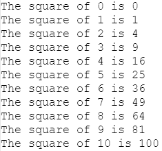

*firstPress: Creating JavaFX Classes and Objects*

*图 4-2. 平方数练习的输出*

祝您练习愉快！

现在您已经学习了 `WordGridModelTester.fx` 程序中的代码，并使用它测试了 `WordGridModel` 类的功能，我想通过从 `WordGridModel` 类中提取更多 JavaFX 概念来向您展示。

**检查单词搜索背后的模型**

**网格**

您即将检查的类代表了单词搜索生成器应用程序视图背后的大部分模型。其操作、函数、触发器和绑定运算符提供了大量的*控制器*功能，这是 JavaFX 设计支持的模型-视图-控制器模式的一部分。这种控制器功能为视图提供与模型相关的服务，并保护模型的完整性。`WordGridModel` 类有一个“殊荣”：它是单词搜索生成器应用程序中所有文件中代码行数最多的。请简要浏览清单 4-5，了解其内容，之后我将指出一些代码片段，帮助您理解更多 JavaFX 概念。

*清单 4-5. WordGridModel.fx 程序*

package wordsearch_jfx.model;

import javafx.ui.*;

import java.lang.Math;

import wordsearch_jfx.ui.WordGridRect;

import wordsearch_jfx.ui.WordGridView;

*firstPress: Creating JavaFX Classes and Objects* 95

import wordsearch_jfx.ui.WordListsView;

class WordGridModel {

    // 网格中的行数
    attribute rows: Integer;

    // 网格中的列数
    attribute columns: Integer;

    // 在网格中操作的行和列
    // 这些绑定到文本字段
    public attribute rowStr: String;
    public attribute columnStr: String;

    // 要添加到未放置单词列表中的单词，并绑定到文本字段
    public attribute newWord:String;

    // 绑定到对话框中选择的单词方向
    public attribute selectedDirection:Integer;

    // 与未放置列表框和未放置单词网格条目相关
    public attribute unplacedListBox:ListBox;
    public attribute selectedUnplacedWordIndex:Integer;
    public attribute selectedUnplacedWord:String;
    public attribute unplacedGridEntries:WordGridEntry*;

    // 与已放置列表框和已放置单词网格条目相关
    public attribute placedListBox:ListBox;
    public attribute selectedPlacedWordIndex:Integer;
    public attribute selectedPlacedWord:String;
    public attribute placedGridEntries:WordGridEntry*;

    // 对模型视图的引用
    public attribute wordGridView:WordGridView;
    public attribute wordListsView:WordListsView;

    // 对象数组，每个对象代表单词网格上的一个单元格
    public attribute gridCells:WordGridCell*;

    // 保存填充字母是否在网格上的状态，
    // 更改此值会导致填充字母在网格上出现或消失。
    public attribute fillLettersOnGrid:Boolean;

*firstPress: Creating JavaFX Classes and Objects*

    // 操作和函数
    public operation WordGridModel(rows:Integer, columns:Integer);
    public operation placeWord(word:String):Boolean;
    public operation placeWordSpecific(word:String, row:Integer, column:Integer, direction:Integer):Boolean;
    public operation canPlaceWordSpecific(word:String, row:Integer, column:Integer, direction:Integer,
        cellAppearance:WordGridRect):Boolean;
    public operation selectPlacedWord(word:String);
    public operation unplaceWord(word:String):Boolean;
    public operation unplaceGridEntries();


public operation addWord(word:String):Boolean;

public operation deleteWord(word:String):Boolean;

public operation highlightWordsOnCell(cellNum:Integer);

private operation initializeGrid();

private function getLetter(row:Integer, column:Integer):String; private operation copyFillLettersToGrid();

private operation refreshWordsOnGrid();

private operation placeWordGridEntry(wge:WordGridEntry);

private operation getXIncr(direction:Integer):Integer;

private operation getYIncr(direction:Integer):Integer;

private operation getGridEntryByWord(word:String):WordGridEntry;

}

// 常量，表示某个操作不涉及任何单元格。用作 highlightWordsOnCell() 的参数 NO_CELL:Integer = -1;

// 触发器

/**

* 用随机字母填充（或移除）所有未被已放置单词占据的网格单元格。

* 这些随机字母在创建 WordGridModel 实例时生成。

*/

trigger on WordGridModel.fillLettersOnGrid = onGrid {

if (onGrid) {

initializeGrid();

copyFillLettersToGrid();

refreshWordsOnGrid();

fillLettersOnGrid = true;

}

*firstPress: Creating JavaFX Classes and Objects* 97

else {

initializeGrid();

refreshWordsOnGrid();

fillLettersOnGrid = false;

}

}

/**

* 根据未放置单词的 ListBox 中选中的单元格，更新模型中未放置的选中单词。

*/

trigger on WordGridModel.selectedUnplacedWordIndex[oldValue] = newValue {

selectedUnplacedWord = unplacedListBox.cells[selectedUnplacedWordIndex].text;

}

/**

* 根据已放置单词的 ListBox 中选中的单元格，更新模型中已放置的选中单词。

*/

trigger on WordGridModel.selectedPlacedWordIndex = newIndex {

selectedPlacedWord = placedListBox.cells[newIndex].text;

}

/**

* 作为 WordGridModel 类的构造函数的方法

*/

operation WordGridModel.WordGridModel(rows, columns) {

this.rows = rows;

this.columns = columns;

selectedPlacedWordIndex = -1;

unplacedGridEntries = [];

placedGridEntries = [];

gridCells = [];

fillLettersOnGrid = false;

initializeGrid();

}

/**

* 在网格上放置一个单词，不指定位置或方向。

* 从随机行、列和方向开始，尝试每个可用位置，如果都不行则返回 false。

* 如果成功，则放置该单词并返回 true。

*/

*firstPress: Creating JavaFX Classes and Objects*

operation WordGridModel.placeWord(word) {

var success = false;

var startingRow:Integer = (Math.random() * rows).intValue(); var startingColumn:Integer = (Math.random() * columns).intValue(); for (y in [0.. rows - 1]) {

for (x in [0.. columns - 1]) {

var startingOrientId = (Math.random() * NUM_ORIENTS:Integer).intValue(); for (d in [0.. NUM_ORIENTS:Integer - 1]) {

var wordDirection = WordOrientation {

id: (startingOrientId + d) % NUM_ORIENTS:Integer

};

success = placeWordSpecific(word,

(startingRow + y) % rows,

(startingColumn + x) % columns,

wordDirection.id);

if (success) {

return true;

}

}

}

}

return false;

}

/**

* 在网格上指定位置和方向放置一个单词。该单词必须已在单词列表中。

* 如果成功放置，此方法会设置关联的 WordGridEntry 的内部状态，包括行、列、方向以及已放置的事实。

*/

operation WordGridModel.placeWordSpecific(word, row, column, direction) {

// 确保该单词在 WordGridEntry 数组中

var wge = getGridEntryByWord(word);

if (wge == null) {

// 单词列表中未找到该单词

return false;

}

else {

if (wge.placed) {

// 单词已放置

return false;

}

*firstPress: Creating JavaFX Classes and Objects* 99

}

// 检查该单词是否可以放置在此处

if (not canPlaceWordSpecific(word, row, column, direction, DEFAULT_LOOK:WordGridRect)) {

return false;

}

// 单词可以放置，现在进行放置

wge.row = row;

wge.column = column;

wge.direction = direction;

placeWordGridEntry(wge);

delete unplacedGridEntries[w | w == wge];

insert wge into placedGridEntries;

wge.placed = true;

return true;

}

/**


* 检查一个单词是否可以放置在网格的指定位置

* 和方向上。它还指定了单元格应具有的外观状态。

*/

operation WordGridModel.canPlaceWordSpecific(word, row, column, direction, cellAppearance) {

var xPos = column;

var yPos = row;

// 每个方向后续字母的增量 var xIncr = 0;

var yIncr = 0;

var canPlaceWord = true;

// 检查以确保单词可以放置在那里

xIncr = getXIncr(direction);

yIncr = getYIncr(direction);

// 使网格中的所有单元格具有默认外观

highlightWordsOnCell(NO_CELL:Integer);

*首次按下：创建 JavaFX 类和对象*

// 确保单词可以放置

for (i in [0.. word.length() - 1]) {

if (xPos > columns - 1 or yPos > rows - 1 or xPos < 0 or yPos <0) {

// 单词无法放置，因为其中一个字母超出了网格 canPlaceWord = false;

break;

}

// 检查放置的字母是空格还是相同的字母 else if ((gridCells[yPos * columns + xPos].cellLetter <> SPACE:String) and (gridCells[yPos * columns + xPos].cellLetter <> word.substring(i, i+1))) {

// 单词无法放置，因为与网格上的另一个字母冲突

canPlaceWord = false;

}

if (cellAppearance == DRAGGING_LOOK:WordGridRect) {

gridCells[yPos * columns + xPos].appearance = DRAGGING_LOOK;

}

else if (cellAppearance == CANT_DROP_LOOK:WordGridRect) {

gridCells[yPos * columns + xPos].appearance = CANT_DROP_LOOK;

}

else if (i == 0) {

// 这是单词的第一个字母

gridCells[yPos * columns + xPos].appearance = DEFAULT_FIRST_LETTER_LOOK;

}

else {

gridCells[yPos * columns + xPos].appearance = DEFAULT_LOOK;

}

xPos += xIncr;

yPos += yIncr;

}

return canPlaceWord;

}

/**

* 在已放置的单词列表中查找并选择一个给定的单词

*/

operation WordGridModel.selectPlacedWord(word) {

var selected = -1;

for (i in [0.. sizeof placedGridEntries - 1]) {

if (placedGridEntries[i].word.equalsIgnoreCase(word)) {

selected = i;

*首次按下：创建 JavaFX 类和对象* 101

break;

}

}

selectedPlacedWordIndex = selected;

}

/**

* 从网格中取消放置一个单词。这不会从单词列表中删除该单词。

* 它仅将其从网格中取消放置，标记为未放置。

*/

operation WordGridModel.unplaceWord(word) {

var wge = getGridEntryByWord(word);

if (wge == null) {

// 在 WordGridModel 单词列表中未找到该单词

return false;

}

else {

if (not wge.placed) {

// 单词已经处于未放置状态

return false;

}

}

var xPos = wge.column;

var yPos = wge.row;

var xIncr = getXIncr(wge.direction);

var yIncr = getYIncr(wge.direction);

var i = 0;

while (i < word.length()) {

gridCells[yPos * columns + xPos].cellLetter = SPACE:String;

// 将此 WordGridEntry 与网格视图上的单元格解除关联 var wges = gridCells[yPos * columns + xPos].wordEntries;

delete wges[w | w == wge];

xPos += xIncr;

yPos += yIncr;

i++;

}

insert wge into unplacedGridEntries;

delete placedGridEntries[w | w == wge];

wge.placed = false;

*首次按下：创建 JavaFX 类和对象*

initializeGrid();

refreshWordsOnGrid();

return true;

}

/**

* 从网格中取消放置所有单词

*/

operation WordGridModel.unplaceGridEntries() {

for (wge in placedGridEntries) {

unplaceWord(wge.word);

}

}

/**

* 向单词列表中添加一个单词。单词列表由所有可出现在网格上的单词组成。

* 每个单词由其自身的 WordGridEntry 类实例表示。请注意，添加的单词不会

* 自动放置在网格上。

*/

operation WordGridModel.addWord(word) {

if (getGridEntryByWord(word) == null) {

var wge = WordGridEntry {

word: word

};

insert wge into unplacedGridEntries;

return true;

}

else {

return false;

}

}

/**

* 从单词列表中删除一个单词。单词列表由所有可出现在网格上的单词组成。

* 每个单词由其自身的 WordGridEntry 类实例表示。

*/

operation WordGridModel.deleteWord(word) {

var wge = getGridEntryByWord(word);

if (wge <> null) {

if (wge.placed) {

unplaceWord(word);

*首次按下：创建 JavaFX 类和对象* 103

}


delete unplacedGridEntries[w | w == wge];

return true;

}

else {

return false;

}

}

/**

* 设置模型中每个单词的 highlightCell 属性，该单词的任一字母位于给定单元格中。

*/

operation WordGridModel.highlightWordsOnCell(cellNum) {

var xPos;

var yPos;

var xIncr;

var yIncr;

for (i in [0.. sizeof gridCells - 1]) {

gridCells[i].appearance = DEFAULT_LOOK:WordGridRect;

}

if (cellNum <> NO_CELL:Integer) {

for (wge in gridCells[cellNum].wordEntries) {

xPos = wge.column;

yPos = wge.row;

xIncr = getXIncr(wge.direction);

yIncr = getYIncr(wge.direction);

for (i in [0.. wge.word.length()- 1]) {

if (i == 0) {

gridCells[yPos * columns + xPos].appearance =

SELECTED_FIRST_LETTER_LOOK:WordGridRect;

}

else {

gridCells[yPos * columns + xPos].appearance =

SELECTED_LOOK:WordGridRect;

}

xPos += xIncr;

yPos += yIncr;

}

}

}

}

*firstPress: Creating JavaFX Classes and Objects*

/**

* 用空格填充网格（存储单词搜索谜题字母的二维数组），以及填充对包含与网格中给定单元格关联的 WordGridEntry 实例数组的对象的引用。

*/

operation WordGridModel.initializeGrid() {

if (sizeof gridCells == 0) {

for (i in [0.. (rows * columns) - 1]) {

insert WordGridCell{} into gridCells;

}

}

else {

for (i in [0.. sizeof gridCells - 1]) {

gridCells[i].cellLetter = SPACE:String;

gridCells[i].wordEntries = [];

}

}

}

/**

* 返回网格指定行和列处的字母。

*/

function WordGridModel.getLetter(row, column) {

return gridCells[row * columns + column].cellLetter;

}

/**

* 将随机生成的填充字母从存储它们的数组复制到存储单词搜索谜题字母的数组中。

*/

operation WordGridModel.copyFillLettersToGrid() {

for (i in [0.. sizeof gridCells - 1]) {

gridCells[i].cellLetter = gridCells[i].fillLetter;

}

}

/**

* 此方法使用已放置的单词刷新网格。例如，当用户请求显示“填充字母”时会调用此方法，因为在网格填充了填充字母后，需要将已放置的单词放回网格上。

*/

operation WordGridModel.refreshWordsOnGrid() {

for (i in [0..sizeof placedGridEntries - 1]) {

placeWordGridEntry(placedGridEntries[i]);

}

}

/**

* 此方法接收一个 WordGridEntry，并根据 WordGridEntry 中存储的位置和方向，将单词中的每个字母放置到网格上。

*/

operation WordGridModel.placeWordGridEntry(wge) {

var xPos = wge.column;

var yPos = wge.row;

var xIncr = getXIncr(wge.direction);

var yIncr = getYIncr(wge.direction);

var word = wge.word;

for (i in [0.. word.length()- 1]) {

gridCells[yPos * columns + xPos].cellLetter = word.substring(i, i + 1);

// 将此 WordGridEntry 与网格视图上的单元格关联起来 insert wge into gridCells[yPos * columns + xPos].wordEntries; xPos += xIncr;

yPos += yIncr;

}

}

/**

* 此方法计算应添加到放置前一个字母的列的数字，以便计算应放置下一个字母的列。这基于单词要放置的方向。例如，如果单词要水平放置，此方法将返回 1；但如果要垂直放置，则返回 0。

*/

operation WordGridModel.getXIncr(direction) {

var xIncr:Integer = 1;

if (direction == VERT:WordOrientation.id) {

xIncr = 0;

}

return xIncr;

}

*firstPress: Creating JavaFX Classes and Objects*

/**

* 此方法计算应添加到放置前一个字母的行的数字，以便计算应放置下一个字母的位置。例如，如果单词要水平放置，此方法将返回 0；但如果要垂直放置，则返回 1。

*/

operation WordGridModel.getYIncr(direction) {

var yIncr:Integer = 1;

if (direction == HORIZ:WordOrientation.id) {

yIncr = 0;

}

else if (direction == DIAG_UP:WordOrientation.id) {

yIncr = -1;

}

return yIncr;

}

/**

* 返回包含传入单词的 WordGridEntry。

*/

operation WordGridModel.getGridEntryByWord(word) {

var wges;

wges = foreach (entry in unplacedGridEntries

where entry.word.equalsIgnoreCase(word))

entry;

if (sizeof wges > 0) {

return wges[0];

}

wges = foreach (entry in placedGridEntries

where entry.word.equalsIgnoreCase(word))

entry;

if (sizeof wges > 0) {

return wges[0];

}

else {

return null;

}

}

当你浏览清单 4-5 时，可能已经注意到 WordGridModel 类的整体结构与之前我们逐步讲解的 WordGridModelTester 类非常相似。以下是我一直用于 JavaFX 类及其包含的 FX 文件的结构概要：

•

package 语句

•

import 语句

•

类声明

• 属性声明

• 操作和函数声明

•

属性初始化器

•

常量（也称为命名实例）

•

触发器定义（主体）

•

操作和函数定义（主体）

•

类中任何构造（例如，类定义、操作、函数或触发器）外部，但与类位于同一 FX 文件中的 JavaFX 代码。此代码通常需要使用该类。你已经见过以这种方式使用的代码示例，包括清单 4-3 中的 ForRangeExample.fx 程序，用于创建类的实例并执行实例的操作。稍后你将看到，清单 4-6 中的程序更广泛地使用了相同的思路。

这只是我组织类及其包含的 FX 文件的方式。JavaFX 在组织类和 FX 文件的方式上为你提供了很大的灵活性。

现在让我们将注意力转向数据类型的概念。我之前已经多次提到这个概念，但现在想更全面地介绍数据类型。

**理解 JavaFX 数据类型**

JavaFX 中有两大类数据类型。它们是原始（也称为基本）数据类型和*对象*类型。另一种不属于这两类中任何一类的数据类型称为序列。这些类型中的任何一种都可以分配给变量（使用 attribute 或 var 关键字）。表 4-1 包含了原始类别中四种数据类型的信息，包括表示值的字面量语法和属性的默认值。

*firstPress: Creating JavaFX Classes and Objects*

注意 ➡ 我们一直在介绍第二类数据类型（对象类型），并且在本章中将继续介绍它们。我已经简要介绍了序列，稍后将在本章中更详细地讨论。

*表 4-1\. JavaFX 原始数据类型*

**数据类型**

**字面量语法**

**属性的默认值**

String

"I'm a String" 或 'I am a

空（零长度）

String'

字符串

Boolean

true 或 false

false

Integer

Number

3.14159

从表 4-1 可以看出，Number 数据类型能够表示浮点数。我们现在正在研究的 WordGridModel 类在其属性声明中使用了四种基本数据类型中的三种，如下面的代码片段所示：

// 要添加到未放置单词列表的单词，并绑定到 TextField public attribute newWord:String;

// 绑定到对话框中选择的单词方向

public attribute selectedDirection:Integer;

**...省略部分代码...**

// 保存填充字母是否在网格上的状态，更改此值会导致填充字母在网格上显示或消失。

public attribute fillLettersOnGrid:Boolean;

**声明属性时的注意事项**


属性是*显式类型化*的，这意味着在声明属性时必须提供数据类型（在冒号之后）。当创建类的实例时，新实例中的原始属性会根据其数据类型包含默认值（如表 4-1 所示）。对于类类型的属性，默认值为 null。清单 4-6 中的 `AttributeDefaultValuesExample.fx` 程序演示了每种数据类型的属性默认值。

*firstPress: 创建 JavaFX 类和对象* 109

*清单 4-6. AttributeDefaultValuesExample.fx 程序* package jfx_book;

class AttributeDefaultValuesExample {

    attribute stri:String;

    attribute bool:Boolean;

    attribute inte:Integer;

    attribute numb:Number;

}

// 创建类的实例并打印每个属性的默认值 var example = AttributeDefaultValuesExample{};

println("具有原始数据类型的属性的默认值:"); println("String 属性的默认值为 '{example.stri}'

且 example.stri.length() 为:{example.stri.length()}"); println("Boolean 属性的默认值为 {example.bool}"); println("Integer 属性的默认值为 {example.inte}"); println("Number 属性的默认值为 {example.numb}"); 该程序产生的输出如下所示：

具有原始数据类型的属性的默认值: String 属性的默认值为 '

且 example.stri.length() 为:0

Boolean 属性的默认值为 false

Integer 属性的默认值为 0

Number 属性的默认值为 0

从清单 4-6 中的程序及其输出中，我们还可以了解到另外几点：

•

双引号括起来的字符串中间可以包含换行符。当字符串打印到控制台时，这些换行符也会被包含在内。

•

JavaFX 字符串实际上是由 Java String 类实现的，这使得所有 Java String 方法（例如前面展示的 `length()` 方法）都可以在 JavaFX 程序中使用。有关 Java String 类方法的文档，请参见以下网址：

[`java.sun.com/j2se/1.5.0/docs/api/java/lang/String.html#method_summary.`](http://java.sun.com/j2se/1.5.0/docs/api/java/lang/String.html#method_summary)

*firstPress: 创建 JavaFX 类和对象*

**声明 var 时的注意事项**

声明 var 与声明属性相比，有一些不同的注意事项。如前所述，var 没有默认值。var 也不要求显式声明其数据类型，在这种情况下，数据类型由赋给它的值来确定。请考虑清单 4-5 中 `WordGridModel` 类的 `placeWord()` 操作中的以下摘录。

var success = false;

var startingRow:Integer = (Math.random() * rows).intValue(); 在第一个声明中，名为 `success` 的变量的数据类型为 Boolean，因为赋给它的是一个 Boolean 值。这被称为隐式声明。JavaFX 是静态类型化的，因此在编译时就能确定名为 `success` 的变量是 Boolean 类型。

在第二个声明中，名为 `startingRow` 的变量与属性一样是显式类型化的。

注意 ➡ 属性与 var 之间的另一个重要区别是其*作用域*（生命周期）。只要属性所属的对象存在，该属性就存在。而 var 仅在其声明的操作或函数处于作用域内（正在执行）时才存在。var 也可以在顶层（任何操作或函数之外）声明，在这种情况下，其作用域是源文件的剩余部分。

关于此代码片段中为 `startingRow` 变量赋值，我希望你注意另外几点：

•

对于 Integer 变量，如果赋给它一个浮点数，小数部分将被截断。

•


此处使用名为 Math 的 Java 类，通过其 random() 方法生成随机数，这与我们之前使用 System 类的 exit() 方法的方式类似。这要求我们在 WordGridModel.fx 文件顶部导入 java.lang.Math 类，如清单 4-5 所示。有关 Java Math 类中方法的文档，请参见以下网址：

[`java.sun.com/j2se/1.5.0/docs/api/java/lang/Math.html.`](http://java.sun.com/j2se/1.5.0/docs/api/java/lang/Math.html)

现在，你已经对 JavaFX 基本数据类型以及在属性和 var 声明中使用它们时的注意事项有了更好的理解，接下来我们将把注意力转向研究如何在 JavaFX 中定义和使用*命名实例*。

*firstPress: 创建 JavaFX 类和对象* 111

**定义和使用命名实例（常量）**

在前面的练习中，你已经使用常量来表示颜色和字体，体验到了使用常量的好处之一，即可以用一个熟悉的名称（例如 blue 或 BOLD）来表示值。另一个好处是，命名实例中包含的值可以在一个地方（定义它的地方）进行更改，而任何使用它的代码都会反映这一更改。

以下是在 WordGridModel 类中定义命名实例的一个示例：

// 常量，表示某个操作

// 与任何单元格无关。用作 highlightWordsOnCell() 的参数

NO_CELL:Integer = -1;

这将创建一个值为 -1 的整数，并命名为 NO_CELL。

无论在哪里使用 NO_CELL:Integer，它都代表一个值为 -1 的整数——例如，在清单 4-5 中 WordGridModel.highlightWordsOnCell() 操作的以下代码中：

if (cellNum <> NO_CELL:Integer) {

在这个特定例子中，命名实例的类型是由 JavaFX 提供的。

你也可以创建自定义类型的命名实例。例如，看看下面来自 WordGridRect 类的摘录，该类位于我们将在下一章讨论的 wordsearch_jfx.ui 包中：

// 常量

SELECTED_LOOK:WordGridRect = WordGridRect {name: "SELECTED_LOOK"}; SELECTED_FIRST_LETTER_LOOK:WordGridRect =

WordGridRect {name: "SELECTED_FIRST_LETTER_LOOK"}; DRAGGING_LOOK:WordGridRect = WordGridRect {name: "DRAGGING_LOOK"}; CANT_DROP_LOOK:WordGridRect = WordGridRect {name: "CANT_DROP_LOOK"}; DEFAULT_FIRST_LETTER_LOOK:WordGridRect =

WordGridRect {name: "DEFAULT_FIRST_LETTER_LOOK"}; DEFAULT_LOOK:WordGridRect = WordGridRect {name: "DEFAULT_LOOK"}; 注意 ➡ 你可能在前面的代码摘录中注意到，赋值（=）运算符右侧的语法是对象字面量语法。然而，它的外观与我之前展示的其他示例不同，因为每个对象字面量只使用一行。当需要定义多个对象字面量且它们没有很多属性时，我会使用这种外观。

*firstPress: 创建 JavaFX 类和对象*

以下是在清单 4-5 的 WordGridModel.canPlaceWordSpecific() 操作中使用这些命名实例的示例。它们的目的是影响单词网格中单元格的外观。

if (cellAppearance == DRAGGING_LOOK:WordGridRect) {

gridCells[yPos * columns + xPos].appearance = DRAGGING_LOOK;

}

else if (cellAppearance == CANT_DROP_LOOK:WordGridRect) {

gridCells[yPos * columns + xPos].appearance = CANT_DROP_LOOK;

}

else if (i == 0) {

// 这是单词的第一个字母

gridCells[yPos * columns + xPos].appearance = DEFAULT_FIRST_LETTER_LOOK;

}

else {

gridCells[yPos * columns + xPos].appearance = DEFAULT_LOOK;

}

查看摘录中的第一行，请注意 DRAGGING_LOOK 常量的名称由类型限定，但在此示例的第二行中，DRAGGING_LOOK 常量的名称并未被限定。这是因为当将命名实例赋值给相同类型的属性（或任何变量）时，无需用其类型来限定命名实例。你会记得，在第 2 章中，与颜色和字体相关的命名实例在声明性代码中赋值给属性时，也无需用其类型来限定。

现在你已经了解了如何定义和使用命名实例，我们将进一步研究如何创建和使用操作与函数。

**创建操作和函数**

你已经在一些练习中使用过操作，但还有一些细节我尚未涉及。在本节中，你还将学习如何创建和使用函数。让我们首先向你展示如何定义操作的*参数*及其可选的*返回类型*。

**定义操作的参数和返回类型** 有些操作需要向它们传递*参数*，有些则不需要。同样，有些操作在被调用后会返回一个值，有些则不会。操作的名称加上所需参数和可选返回类型的配置，被称为操作的*签名*。操作的签名在类定义中定义，如下面来自 WordGridModel 类定义的摘录所示：

public operation canPlaceWordSpecific(word:String, row:Integer, column:Integer, direction:Integer,

cellAppearance:WordGridRect):Boolean;

public operation selectPlacedWord(word:String);

public operation unplaceWord(word:String):Boolean;

public operation unplaceGridEntries();

public operation addWord(word:String):Boolean;

public operation deleteWord(word:String):Boolean;

public operation highlightWordsOnCell(cellNum:Integer);

在前面的摘录中，你可以看到，如果操作有参数，它们会在操作名称后面的括号内指定。每个参数通过提供参数名称、冒号和其类型来定义。请注意，有些参数类型是四种基本数据类型之一，而其中一个（cellAppearance:WordGridRect）是对象类型。

还请留意，其中一些操作声明在右括号后包含一个冒号，后跟一个数据类型。这表明该操作返回一个值，因此在操作体中有一个返回语句，返回该类型的值。

要调用包含参数的操作，你需要指定操作名称，后跟一个用括号括起来的、以逗号分隔的值列表，这些值的顺序和类型与参数相匹配。以下代码摘录来自单词搜索构建器程序中的各种 FX 文件，展示了调用前面代码摘录中所示的一些操作的示例：

if (not canPlaceWordSpecific(word, row, column, direction, DEFAULT_LOOK:WordGridRect)) {

return false;

}

wgModel.selectPlacedWord(wge.word);

wgModel.unplaceGridEntries();

if (wgModel.unplaceWord(wge.word)) {

wgModel.placeWordSpecific(wge.word,

wge.row,

wge.column,

newOrient);

wgModel.highlightWordsOnCell(wge.row * columns +

wge.column);

}

*firstPress: 创建 JavaFX 类和对象*

正如你已经知道的，操作中包含的代码位于该操作的操作体中。看看下面 addWord() 操作的操作体，并将其与前面 addWord() 操作的声明进行比较。你会注意到，操作声明中表达的参数和返回值的数据类型不必在操作体中重复。你还会注意到，*访问修饰符*（例如本例中的 public）是在操作声明中指定的，并且不允许在操作体中指定。

operation WordGridModel.addWord(word) {

if (getGridEntryByWord(word) == null) {

var wge = WordGridEntry {

word: word

};

insert wge into unplacedGridEntries;

return true;

}

else {

return false;

}

}


注意 ➡ 截至撰写本文时，JavaFX 尚未完全实现访问修饰符，但一旦实现，可能会像 Java 一样有四种：public、private、protected 和 default（无修饰符）。public 操作、函数或属性可从任何其他类访问。private 操作、函数或属性只能从同一类内部访问。无访问修饰符（default）的操作、函数或属性可从同一包内的任何类访问。protected 操作、函数或属性可从同一包内的任何类或任何子类（无论其位于哪个包）访问。另一项近期提案指出，可能只有三种访问修饰符：public、protected 和 private（后者将成为默认值）。

我们稍后将更详细地探讨操作体可能包含的内容，包括 JavaFX 语句和运算符。不过，现在让我们将注意力转向一个特殊命名的操作，该操作在使用 `new` 运算符创建实例时执行。

**理解 new 运算符的作用**

有时，我们希望当创建对象实例时能自动执行某些代码。运行这些代码的目的通常是为了初始化对象的

*firstPress：创建 JavaFX 类和对象* 115

状态。在 JavaFX 中有两种方法可以实现这一点，它们对应于前面展示的两种创建对象实例的方式。回顾一下，这两种方式如下：

•

使用对象字面量，这是在 JavaFX 中创建新实例最典型的方式

•

使用 `new` 运算符，如下所示：

```
var wgModel = new WordGridModel(9, 9);
```

现在我们来探讨后一种方式，稍后将在讨论 `trigger` 关键字时介绍前一种方式。

在上述代码片段中，`new` 运算符后面跟着你想要创建实例的类名，类名后面是括号括起来的、以逗号分隔的参数列表。使用这种语法会调用一个与类同名的操作，在本例中，调用的是清单 4-5 中 `WordGridModel` 类里的 `WordGridModel` 操作，其声明如下：`public operation WordGridModel(rows:Integer, columns:Integer);` 以下是清单 4-5 中 `WordGridModel` 操作的主体：

```
/**
 * 一个充当 WordGridModel 类构造器的方法
 */
operation WordGridModel.WordGridModel(rows, columns) {
    this.rows = rows;
    this.columns = columns;
    selectedPlacedWordIndex = -1;
    unplacedGridEntries = [];
    placedGridEntries = [];
    gridCells = [];
    fillLettersOnGrid = false;
    initializeGrid();
}
```

请注意，在上述方法中，使用了一个名为 `this` 的关键字来访问 `WordGridModel` 类新实例的 `rows` 和 `columns` 属性，这将其与传入 `WordGridModel` 操作的值区分开来。与任何操作（或函数、触发器）一样，这些传入的值会成为局部变量，就好像它们是用 `var` 关键字声明的一样。顺便提一下，`this` 关键字可用于任何操作中，其目的是提供对当前类实例的引用。

说到函数，我们接着讨论如何创建一个函数。

*firstPress：创建 JavaFX 类和对象*

**创建 JavaFX 函数**

JavaFX *函数* 拥有操作的部分功能。它只能包含 `var` 声明和一个 `return` 语句。以下是清单 4-5 中 `WordGridModel` 类的一个函数声明示例：

```
private function getLetter(row:Integer, column:Integer):String;
```

以下是 `getLetter()` 函数的主体：

```
/**
 * 返回网格中指定行和列的字母。
 */
function WordGridModel.getLetter(row, column) {
    return gridCells[row * columns + column].cellLetter;
}
```

既然我们已经探讨了操作和函数，接下来让我们更仔细地看看 JavaFX 触发器。

**理解 JavaFX 触发器**


触发器是 JavaFX 的关键特性，它们在实现其声明式编程模型中扮演着重要角色。你已经接触过一种触发器形式：*断言* *触发器*。此时还有两种适合介绍的触发器声明形式：

•

创建触发器

•

替换触发器

*创建触发器*在包含它的类的新实例被创建时自动执行。创建触发器的用途与本章前面讨论过的、与类同名的特殊操作几乎相同。

以下是从 WordGridCell 类摘录的一个创建触发器示例。我们将在本章稍后更详细地查看清单 4-11 中所示的 WordGridCell 类。

*firstPress: 创建 JavaFX 类与对象* 117

trigger on new WordGridCell {

cellLetter = SPACE;

// 生成随机字母，用于在不包含单词的情况下填充此单元格

fillLetter = Character.forDigit(Math.random() * 26 + 10, 36).

toString().toUpperCase();

wordEntries = [];

}

*替换触发器*在触发器中命名的属性被赋予新值时自动执行。以下是从清单 4-5 的 WordGridModel 类中摘录的示例：

/**

* 根据未放置单词列表框中选中的单元格，更新模型中选中的未放置单词

*/

trigger on WordGridModel.selectedUnplacedWordIndex[oldValue] = newValue {

selectedUnplacedWord = unplacedListBox.cells[selectedUnplacedWordIndex].text;

}

当此触发器执行时，赋值运算符（=）右侧的变量包含赋予该属性的新值。可选地，如上述摘录所示，你可以在赋值运算符左侧的方括号中放置一个变量名。这会使该属性在被赋予新值之前的值存储在该变量中。这使你能够在触发器的代码中比较旧值和新值。

如果你熟悉 setter 和 getter 方法，你会意识到替换触发器使你可以省去代码中的 getter 和 setter。相反，你可以直接访问属性。任何可以放在 setter 方法中的验证或业务逻辑都可以放在触发器中。

替换触发器也可以与序列一起使用，我们尚未介绍的另外两种触发器类型也是如此：*插入触发器*和*删除触发器*。我将在本章稍后讨论序列时提及它们。

为了创建操作、触发器或函数的主体，你需要了解 JavaFX 中可用的*语句*和*运算符*。现在让我们深入了解它们。

*firstPress: 创建 JavaFX 类与对象*

**使用 JavaFX 语句和运算符**

到目前为止，本书中你已经检查并使用了几个 JavaFX 语句和运算符。例如，你在练习中使用了赋值运算符（=），在本章前面检查了 for 语句和 return 语句，并且也在本章前面接触了相等运算符（==）。在本节中，我们将查看清单 4-5 中 WordGridModel 类的几个我尚未解释的 JavaFX 语句和运算符示例。让我们从 placeWord() 操作开始寻找语句和运算符，并在遇到它们时提供解释。

注意 ➡ 为了方便参考，表 4-2 列出了 JavaFX 语句及其描述。表 4-3 至表 4-7 包含了 JavaFX 运算符的同类参考。

**if/else 语句**

请查看以下从 placeWord() 操作中摘录的片段：if (success) {

return true;

}

if 语句仅在条件（括号内的布尔表达式）求值为 true 时执行必需花括号内的语句。


可选地，`if` 语句可以有一个匹配的 `else` 子句，如下面来自 `addWord()` 操作的代码片段所示：

if (getGridEntryByWord(word) == null) {

var wge = WordGridEntry {

word: word

};

insert wge into unplacedGridEntries;

return true;

}

else {

return false;

}

*firstPress: Creating JavaFX Classes and Objects* 119

如果条件为假，则执行 `else` 子句必需花括号内的语句。`else` 子句唯一不需要花括号的情况是当该 `else` 子句本身是另一个 `if` 语句时。下面来自 `canPlaceWordSpecific()` 操作的代码片段展示了这一点：if (cellAppearance == DRAGGING_LOOK:WordGridRect) {

gridCells[yPos * columns + xPos].appearance = DRAGGING_LOOK;

}

else if (cellAppearance == CANT_DROP_LOOK:WordGridRect) {

gridCells[yPos * columns + xPos].appearance = CANT_DROP_LOOK;

}

else if (i == 0) {

// 这是单词的第一个字母

gridCells[yPos * columns + xPos].appearance = DEFAULT_FIRST_LOOK;

}

else {

gridCells[yPos * columns + xPos].appearance = DEFAULT_LOOK;

}

此外，还有一个 `if/then/else` 三元运算符。以下是该运算符的一个示例：var a = 3;

var b = 4;

println("a is {if a > b then "biggger" else "smaller"} than b"); 前面的示例还演示了可以在字符串表达式运算符中嵌套双引号。你也可以在嵌套的双引号内再嵌套字符串表达式，以此类推。

现在你已经了解了 `if` 语句的各种形式，接下来我们将介绍一种名为 `while` 语句的循环语句。

**while 语句**

`while` 语句在其必需花括号内执行语句，只要圆括号内的条件求值为真。请参见下面来自 `unplaceWord()` 操作的代码片段：

while (i < word.length()) {

gridCells[yPos * columns + xPos].cellLetter = SPACE:String;

// 将此 WordGridEntry 与网格视图上的单元格解除关联
var wges = gridCells[yPos * columns + xPos].wordEntries;

delete wges[w | w == wge];

*firstPress: Creating JavaFX Classes and Objects*

xPos += xIncr;

yPos += yIncr;

i++;

}

前面的代码片段引入了*小于运算符*（<），它将左侧表达式的值与右侧表达式的值进行比较。如果左侧表达式的值小于右侧表达式的值，则包含小于运算符（<）的表达式的值为真。有关 JavaFX 中每个*关系运算符*的列表和简要说明，请参见表 4-3。

该代码片段还引入了一些*算术运算符*，例如*加并赋值运算符*（+=）。该运算符将右侧表达式的值加到左侧变量的值上，并将结果赋值给左侧变量。*递增运算符*（++）将左侧变量的值加 1。有关 JavaFX 中每个算术运算符的列表和简要说明，请参见表 4-5。

**break 语句**

在 `for` 语句和 `while` 语句中，你可以使用 `break` 语句提前跳出循环。请参见来自 `canPlaceWordSpecific()` 操作的代码片段：for (i in [0.. word.length() - 1]) {

if (xPos > columns - 1 or yPos > rows - 1 or xPos < 0 or yPos <0) {

// 单词无法放置，因为其中一个字母超出了网格范围
canPlaceWord = false;

break;

}

// 检查要放置的字母是空格还是相同的字母
else if ((gridCells[yPos * columns + xPos].cellLetter <> SPACE:String) and (gridCells[yPos * columns + xPos].cellLetter <> word.substring(i, i+1))) {

// 单词无法放置，因为与网格上的另一个字母冲突
canPlaceWord = false;

}

**...部分代码已省略...**

}

在这种情况下，当该代码片段第二行中的 `if` 条件为真时，`for` 循环将在遍历完序列中的所有元素之前终止。执行将在 `for` 语句的结束花括号之后继续。

*firstPress: Creating JavaFX Classes and Objects* 121


JavaFX 中还有一个 continue 语句，其工作方式类似，区别在于它会立即继续执行 for 或 while 语句的下一次迭代，此时会评估条件以确定是否还需要进行更多迭代。

顺便提一下，你可能已经在这段摘录中发现了另外几个关系运算符，即*大于运算符* (>) 和*不等运算符* (<>)。这段摘录中还有几个布尔运算符（或运算符和与运算符）。

现在，我为你准备了一个练习，它将帮助你巩固本章到目前为止所学的几个概念。

**预约练习**

在本练习中，你将创建一个名为 `Appointment` 的类（放在其自己的 FX 文件中），该类表示一个预约，包含月、日、年、小时等属性。你还将创建一个名为 `AppointmentTester.fx` 的 JavaFX 程序，用于测试 `Appointment` 类的功能。以下是 `Appointment` 类的功能要求：

•

它必须至少包含以下属性：

•

`month:Integer`（预约的月份）。

•

`day:Integer`（预约的日期）。

•

`year:Integer`（预约的年份）。

•

`hour:Integer`（预约的开始时间，始终从整点开始）。

•

`pm:Boolean`（如果为上午则为 false，如果为下午则为 true）。

•

`durationHours:Number`（预约的持续时间，以小时为单位）。

• 它必须至少包含以下操作：

•

一个 `isConflict(otherAppt:Appointment):Boolean` 操作，你可以向其中传入 `Appointment` 类的另一个实例。`isConflict()` 操作应返回一个布尔值，指示两个预约是否相互冲突。

•

其他有助于 `isConflict()` 操作完成其工作的私有操作。

*firstPress: 创建 JavaFX 类和对象*

• 它必须为每个属性提供一个属性初始化器，以便实例包含有效的日期和时间，以及有效的持续时间。

• 它必须至少包含以下命名实例：

•

一个名为 `MAX_MONTH` 的命名实例，其类型为 `Integer`，值为 12。

•

一个名为 `MAX_DAY` 的命名实例，其类型为 `Integer`，值为 31。

•

一个名为 `MAX_HOUR` 的命名实例，其类型为 `Integer`，值为 12。

• 它必须至少包含以下触发器：

•

一个针对 `month` 属性的替换触发器。此触发器应保护 `month` 属性，防止其被更改为不在 1 到 `MAX_MONTH` 范围内的值。

•

一个针对 `day` 属性的替换触发器。此触发器应保护 `day` 属性，防止其被更改为不在 1 到 `MAX_DAY` 范围内的值。

•

一个针对 `hour` 属性的替换触发器。此触发器应保护 `hour` 属性，防止其被更改为不在 1 到 `MAX_HOUR` 范围内的值。

如果你愿意，可以使用清单 4-7 中显示的起始代码。此起始代码位于本书的代码下载中，文件名为 `AppointmentTemplate.fx`，你需要将其复制到名为 `Appointment.fx` 的文件中。用 JavaFX 语句填写标记为 `//...supply code here...` 的区域。然后，参考清单 4-8 中的代码，创建一个名为 `AppointmentTester.fx` 的文件，用于测试 `Appointment` 类的功能。图 4-3 是本练习示例解决方案输出的屏幕截图。

顺便提一下，请注意，当将对象引用传递给 `println()` 方法时，输出的是属性及其值的列表。

*清单 4-7. 创建 Appointment 类的一些起始代码* package chapter4;

import javafx.ui.*;

*firstPress: 创建 JavaFX 类和对象* 123

class Appointment {

attribute month:Integer;

attribute day:Integer;

attribute year:Integer;

attribute hour:Integer;

attribute pm:Boolean;

attribute durationHours:Number;

operation isConflict(otherAppt:Appointment):Boolean;

private operation getHourIn24HourTime(appt:Appointment):Integer; private operation isTimeOverlap(hourA:Integer, durationHoursA:Number, hourB:Integer):Boolean;

}


// 属性初始化器

attribute Appointment.month = 1;

//...在此处补充代码...

// 命名实例

MAX_MONTH:Integer = 12;

//...在此处补充代码...

// 保护 month 属性不被赋予无效值 trigger on Appointment.month[oldMonth] = newMonth {

if (newMonth <= 0 or newMonth > MAX_MONTH:Integer) {

month = oldMonth;

}

}

*firstPress: 创建 JavaFX 类和对象*

// 保护 day 属性不被赋予无效值 trigger on Appointment.day[oldDay] = newDay {

//...在此处补充代码...

}

// 保护 hour 属性不被赋予无效值 trigger on Appointment.hour[oldHour] = newHour {

//...在此处补充代码...

}

/**

* 此操作用于检查传入此方法的 Appointment 实例是否与此预约实例冲突（时间重叠）。

* 如果两个预约在同一天，它会调用 getHourIn24HourTime() 方法两次，

* 一次用于当前预约（提示：传入 this 关键字），

* 另一次用于传入此方法的预约。然后调用 isTimeOverlap() 操作

* 以确定考虑持续时间后的实际时间是否重叠。

*/

operation Appointment.isConflict(otherAppt) {

var conflict = false;

//...在此处补充代码...

return conflict;

}

/**

* 如果两个预约在同一天，则调用此操作。

* 它确定考虑最早时间的持续时间后，实际时间是否重叠。

*firstPress: 创建 JavaFX 类和对象* 125

*/

operation Appointment.isTimeOverlap(hourA, durationHoursA, hourB) {

//...在此处补充代码...

}

/**

* 此操作将带有 am/pm 的 12 小时制时间转换为 24 小时制时间。

*/

operation Appointment.getHourIn24HourTime(appt) {

var hourIn24hourTime;

//...在此处补充代码...

return hourIn24hourTime;

}

*列表 4-8. 名为 AppointmentTester.fx 的示例测试程序* package chapter4;

var appt1 =

Appointment {

month: 12

day: 31

year: 2007

hour: 8

pm: true

durationHours: 1.5

};

var appt2 =

Appointment {

*firstPress: 创建 JavaFX 类和对象*

month: 12

day: 31

year: 2007

hour: 9

pm: true

durationHours: 1

};

println("appt1 包含: {appt1}");

println("appt2 包含: {appt2}");

println("这两个预约冲突的情况为: {appt1.isConflict(appt2)}。"); println("");

println("尝试将 appt1 的月份改为 13"); appt1.month = 13;

println("appt1 包含: {appt1}");

println("尝试将 appt2 的日期改为 32"); appt2.day = 32;

println("appt2 包含: {appt2}");

println("");

println("尝试将 appt2 的日期改为 6"); appt2.day = 6;

println("appt2 包含: {appt2}");

println("");

println("这两个预约冲突的情况为: {appt1.isConflict(appt2)}。");

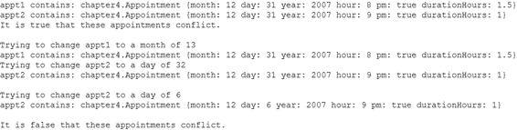

*firstPress: 创建 JavaFX 类和对象*

*图 4-3. 预约练习的示例输出* 警告 在属性的替换触发器内部更改该属性的值（如列表 4-7 所示），如果不小心，可能会导致不良结果。例如，我们试图保护 month 属性不被更改为非法值。因此，我们测试分配给 month 属性的值是否超出范围。如果是，则用赋值前的值覆盖该值。如果该原始值超出了该触发器中 if 语句条件的范围，则该赋值将再次递归调用触发器。

祝您玩得开心，并通过此练习获得大量经验知识！

现在让我们将注意力转向 JavaFX 序列的概念，我之前偶尔提到过，但现在将更深入地介绍。

**使用 JavaFX 序列**

序列（数组）是 JavaFX 中一个非常关键的特性，并在单词搜索生成器示例中广泛使用。我们将通过提取 WordGridModel 类中与以下两个序列属性声明相关的片段来详细研究序列：


public attribute unplacedGridEntries:WordGridEntry*;

public attribute gridCells:WordGridCell*;

*首次出版：创建 JavaFX 类与对象*

在此过程中，我还将向您展示一个示例程序（清单 4-9 中的 SequenceExample.fx 程序），该程序演示了 JavaFX 序列的许多可用特性。运行此程序时产生的输出如清单 4-10 所示。

*清单 4-9. SequenceExample.fx 程序*

package jfx_book;

// 字面定义行星序列，省略木星和天王星 var planets:String* = ["水星", "金星", "地球", "火星",

"土星", "海王星"];

// 打印数组中的第三个元素，即索引为 2 的元素

// 因为数组是从零开始索引的。

println("第三颗行星是：{planets[2]}");

// 通过遍历行星序列打印所有行星 for (planet in planets) {

println("{planet} 是太阳系中的一颗行星");

}

println("");

// 在海王星（当前位于位置 5）之前插入天王星 println("正在海王星之前插入天王星");

insert "天王星" before planets[5];

// 在火星（当前位于位置 3）之后插入木星 println("正在火星之后插入木星");

insert "木星" after planets[3];

// 将冥王星添加到序列末尾。

println("正在将冥王星添加为最后一颗行星");

insert "冥王星" into planets;

// 将太阳添加到序列开头

println("正在将太阳插入到开头"); insert "太阳" as first into planets;

// 通过遍历一个与行星序列大小相同的序列，并引用行星数组中对应的元素

// 来打印所有行星。

for (i in [0.. sizeof planets - 1]) {

*首次出版：创建 JavaFX 类与对象* 129

println("{planets[i]} 是太阳系中的一颗行星");

}

println("");

// 删除太阳（当前位于位置 0）

println("正在删除位置 0 的太阳");

delete planets[0];

// 查询冥王星的索引并删除它

println("正在查询冥王星的索引");

var indices = foreach (planet in planets

where planet == "冥王星") indexof planet;

println("冥王星位于位置 {indices}");

if (sizeof indices >= 0) {

println("正在删除冥王星");

delete planets[indices];

}

// 查询并以逆序打印所有行星连在一起的字符串 var allPlanetsRunTogether = select planet from planet in reverse planets; println(allPlanetsRunTogether);

println("");

// 使用 select 查询所有字符数超过 5 个的行星 var somePlanets;

somePlanets = select "{planet}," from planet in planets where planet.length() > 5;

println("字符数超过 5 个的 {sizeof somePlanets} 颗行星是：

{somePlanets}");

println("");

// 使用 foreach 查询所有以字母 "N" 或之后字母开头的行星

somePlanets = foreach (planet in planets where planet >= "N") "{planet},"; println("字母表后半部分的 {sizeof somePlanets} 颗行星是：

{somePlanets}");

如果您还没有运行，请执行上述 SequenceExample.fx 程序。

您应该会收到如下所示的输出：

*首次出版：创建 JavaFX 类与对象*

清单 4-10. SequenceExample.fx 程序的输出

第三颗行星是：地球

水星是太阳系中的一颗行星

金星是太阳系中的一颗行星

地球是太阳系中的一颗行星

火星是太阳系中的一颗行星

土星是太阳系中的一颗行星

海王星是太阳系中的一颗行星

正在海王星之前插入天王星

正在火星之后插入木星

正在将冥王星添加为最后一颗行星

正在将冥王星添加为最后一颗行星

太阳是太阳系中的一颗行星

水星是太阳系中的一颗行星

金星是太阳系中的一颗行星

地球是太阳系中的一颗行星

火星是太阳系中的一颗行星

木星是太阳系中的一颗行星

土星是太阳系中的一颗行星

天王星是太阳系中的一颗行星

海王星是太阳系中的一颗行星

冥王星是太阳系中的一颗行星

正在删除位置 0 的太阳

正在查询冥王星的索引

冥王星位于位置 8

正在删除冥王星

海王星天王星土星木星火星地球金星水星


字符数超过 5 个的 5 颗行星是：

水星、木星、土星、天王星、海王星，

字母表后半部分中的 4 颗行星是：

金星、土星、天王星、海王星，

**序列字面量**

在本书中，你已经多次体验过使用序列字面量语法来直接定义序列，最早始于第 2 章，当时我们将一组 FontStyle 实例赋值给 Font 实例的 style 属性，如下面摘自 HelloJFXBind.fx 程序的代码片段所示：

Font {

faceName: "Sans Serif"

// 具有值集合的属性示例

style: [

BOLD,

ITALIC]

size: 24

}

此外，在本章前面部分，我还使用了范围表达式来创建几个数字序列。

清单 4-9（见下方摘录）中的第一行可执行代码直接定义了一个序列，并将其赋值给一个显式声明为 String 实例序列类型的变量。请注意，`:String*` 并非必需，因为 JavaFX 会根据赋值运算符（=）右侧的表达式隐式推断变量类型。

// 直接定义行星序列，省略木星和天王星 var planets:String* = ["Mercury", "Venus", "Earth", "Mars",

"Saturn", "Neptune"];

**访问序列中的特定元素**

如下方清单 4-9 的摘录所示，要直接访问序列中的某个元素，只需将基于零的元素索引放在序列名称后的方括号中：

// 打印数组中的第三个元素，即元素 2

// 因为数组索引从零开始。

println("第三颗行星是：{planets[2]}");

在 WordGridModel 类中也使用了相同的语法，如下所示，用于访问单词网格中对应特定行和列的 WordGridCell 实例。JavaFX 不支持多维序列，因此使用方括号中所示的公式来访问所需的 WordGridCell 实例：

gridCells[yPos * columns + xPos].appearance = DRAGGING_LOOK; 在上述示例中，一个表达式被赋值给序列中的一个元素。如前所述，如果该序列存在替换触发器，那么当序列中某个元素的值被替换时，该触发器将会执行。有关序列替换触发器的更多信息，请参阅以下网址：

[`openjfx.dev.java.net/JavaFX_Programming_Language.html#replace_trig`](https://openjfx.dev.java.net/JavaFX_Programming_Language.html#replace_trig)

*firstPress: 创建 JavaFX 类和对象*

**遍历序列**

在本章前面部分，你已经看到 for 语句以几种方式用于遍历序列。清单 4-9 中的 SequenceExample.fx 程序也使用了这两种技术，如下所示：

// 通过遍历行星序列打印所有行星 for (planet in planets) {

println("{planet} 是我们太阳系中的一颗行星");

}

// 通过遍历一个与行星序列大小相同的序列，并引用行星数组中对应的元素

// 来打印所有行星。

for (i in [0.. sizeof planets - 1]) {

println("{planets[i]} 是我们太阳系中的一颗行星");

}

请注意使用 sizeof 运算符来确定序列中的元素数量。

**插入序列元素**

要向序列中插入元素，请使用 insert 语句，如下面清单 4-9 的摘录所示：

// 在海王星（当前位于位置 5）之前插入天王星 println("在天王星之前插入海王星");

insert "Uranus" before planets[5];

// 在火星（当前位于位置 3）之后插入木星 println("在火星之后插入木星");

insert "Jupiter" after planets[3];

// 将冥王星添加到序列末尾。

println("将冥王星作为最后一颗行星插入");

insert "Pluto" into planets;

// 将太阳添加到序列开头

println("将太阳插入到开头"); insert "Sun" as first into planets;

如上述摘录所示，insert 语句有几种变体：


*firstPress：创建 JavaFX 类与对象* 133

•

将 *element* 插入 *sequence*：此操作用于插入冥王星。这种形式的 insert 语句会将元素添加到序列的末尾。该变体的更正式写法是 insert *element* as last into *sequence*。

•

将 *element* 作为第一个元素插入 *sequence*：此操作用于插入太阳。这种形式的 insert 语句会将元素插入到序列的开头。

•

将 *element* 插入到 *sequence[index]* 之前：此操作用于插入天王星。这种形式的 insert 语句会将元素插入到序列中某个已存在元素的前面。

•

将 *element* 插入到 *sequence[index]* 之后：此操作用于插入木星。这种形式的 insert 语句会将元素插入到序列中某个已存在元素的后面。

在 Word Search Builder 应用程序中，insert 语句被用于 WordGridModel.addWord() 操作，以便将 WordGridEntry 实例插入到未放置的单词网格条目序列中，如下所示：

insert wge into unplacedGridEntries;

insert 语句还被用于 WordGridModel.initializeGrid() 操作，以初始填充 gridCells 序列：

for (i in [0.. (rows * columns) - 1]) {

insert WordGridCell{} into gridCells;

}

如前所述，可以定义一个 insert 触发器，当元素被插入到序列中时执行。有关 insert 触发器的详细信息，请参见以下网址：

[`openjfx.dev.java.net/JavaFX_Programming_Language.html#replace_trig.`](https://openjfx.dev.java.net/JavaFX_Programming_Language.html#replace_trig)

**查询序列**

你可以查询序列以检索其元素的子集。清单 4-9 中的示例展示了两种*列表推导式*运算符：select 和 foreach。以下是一些摘录：

somePlanets = select "{planet}," from planet in planets where planet.length() > 5;

println("The {sizeof somePlanets} planets with more than 5 characters are:

{somePlanets}");

*firstPress：创建 JavaFX 类与对象*

这个 select 查询选择了 planets 序列中所有字符数超过五个的元素。结果保存在由变量 somePlanets 引用的序列中。一个名为 planet 的变量被隐式创建，它持有对每个匹配查询的元素的引用。如你所见，在 select 运算符之后，我决定在将每个返回的元素放入 somePlanets 数组之前，先在其后拼接一个逗号。

// 使用 foreach 查询所有以字母 "N" 或之后字母开头的行星

somePlanets = foreach (planet in planets where planet >= "N") "{planet},"; println("The {sizeof somePlanets} planets in the second half of the alphabet are:

{somePlanets}");

前面的 foreach 查询所做的几乎与 select 查询相同，只是使用了不同的语法。这里功能上的唯一区别在于条件中的标准。

下面展示的是另一个 foreach 查询的示例，它返回一个数字序列，这些数字是匹配查询的每个元素的索引。该数字序列被放在 delete 语句的方括号内，以便删除这些索引处的元素。

// 查询冥王星的索引并删除它

println("Querying for the indexof Pluto");

var indices = foreach (planet in planets

where planet == "Pluto") indexof planet;

println("Pluto is in position {indices}");

if (sizeof indices >= 0) {

println("Deleting Pluto");

delete planets[indices];

}

下面展示的是另一个 select 查询，它以相反顺序检索 planets 序列中的所有元素：

var allPlanetsRunTogether = select planet from planet in reverse planets; **删除序列元素**

要从序列中删除一个元素，请使用 delete 语句，如清单 4-9 中的以下摘录所示：

delete planets[0];

*firstPress：创建 JavaFX 类与对象* 135


此操作会从 `planets` 序列中删除索引为 0 的元素。如前一示例所示，你也可以在 `delete` 运算符的谓词（方括号内）中放入一个数字序列。

以下是在 Word Search Builder 应用程序的 `WordGridModel.placeWordSpecific` 操作中使用 `delete` 运算符的示例：
`delete unplacedGridEntries[w | w == wge];`
`insert wge into placedGridEntries;`

从 `unplacedGridEntries` 中删除一个 `WordGridEntry` 实例后，此代码会将相同的值插入到 `placedGridEntries` 序列中。

可以定义一个删除触发器，当从序列中删除元素时执行。有关删除触发器的详细信息，请参阅以下 URL：

[`openjfx.dev.java.net/JavaFX_Programming_Language.html#delete_trig.`](https://openjfx.dev.java.net/JavaFX_Programming_Language.html#delete_trig)

**将序列置零**

要使数组不包含任何元素，请使用方括号内为空的序列字面量表示法，如下面摘自 `WordGridModel.WordGridModel` 操作的示例所示：

`unplacedGridEntries = [];`
`placedGridEntries = [];`
`gridCells = [];`

正如所承诺的，以下是一些表格（见表 4-2 至 4-7），其中汇总了 JavaFX 语句和 JavaFX 运算符，供你参考。

*firstPress: 创建 JavaFX 类和对象*

**JavaFX 语句**

*表 4-2. JavaFX 语句*

**语句**

**描述**

`return`

退出当前操作或触发器，可选择向调用者返回一个值。

`if/else`

当条件为真时，执行 `if` 语句体中的语句。如果存在 `else` 子句，则当 `if` 条件为假时执行 `else` 子句体。

`for`

遍历一个序列，在每次迭代中执行 `for` 循环体中的语句。

`while`

当条件为真时，执行 `while` 循环体中的语句。

`break`

跳出 `for` 或 `while` 循环，继续执行循环体之后的代码。

`continue`

立即继续执行 `for` 或 `while` 循环的下一次迭代，并评估循环条件。

`insert`

与序列一起使用，`insert` 语句将一个元素插入到序列中。

`delete`

与序列一起使用，`delete` 语句从序列中删除元素。

`try/catch/finally`

用于异常处理，`try` 语句包含一个主体，其中尝试执行一个或多个语句。如果发生异常（错误条件），则立即在相应的 `catch` 子句处继续执行。无论是否发生异常，都会执行可选的 `finally` 子句。

`throw`

与异常处理结合使用，`throw` 语句会导致抛出异常，该异常通常会被 `try` 语句捕获。

`do`, `do later`

用于并发处理。

*firstPress: 创建 JavaFX 类和对象* 137

**JavaFX 运算符**

*表 4-3. JavaFX 关系运算符*

**运算符**

**描述**

`==`

等于运算符

`<>`

不等于运算符

`<`

小于运算符

`<=`

小于等于运算符

`>`

大于运算符

`>=`

大于等于运算符

*表 4-4. JavaFX 布尔运算符*

**运算符**

**描述**

`and`

逻辑与运算符

`or`

逻辑或运算符

`not`

一元取反运算符

*表 4-5. JavaFX 算术运算符*

**运算符**

**描述**

`*`

乘法运算符

`/`

除法运算符

`+`

加法运算符

`-`

减法及一元取反运算符

*(续)*

*firstPress: 创建 JavaFX 类和对象*

**运算符**

**描述**

`%`

取模（求余）运算符

`++`

一元递增运算符

`--`

一元递减运算符

`=`

赋值运算符

`*=`

乘后赋值运算符

`/=`

除后赋值运算符

`+=`

加后赋值运算符

`-=`

减后赋值运算符

`%=`

取模后赋值运算符

*表 4-6. 序列相关的 JavaFX 运算符*

**运算符**

**描述**

`sizeof`

序列中的元素数量

`indexof`

元素在序列中的序号位置

`select`

查询序列

`foreach`

查询序列

`[]`

序列选择

`reverse`


反转序列中的元素

[number1, next..number2]

数值范围表达式

*首版印刷：创建 JavaFX 类与对象* 139

*表 4-7\. 其他 JavaFX 运算符*

**运算符**

**描述**

if e1 then e2 else e3

三元运算符/条件表达式。

new

创建类的实例，并为其分配内存。

op()

运算符/函数调用。

x.op()

对 x 引用的对象进行运算符/函数调用。

this

引用上下文实例（自引用）。

.

成员访问。

instanceof

如果左侧对象是类（或子类）的实例，则计算结果为 true。

(expr)

表达式分组。

{}

在双引号括起的字符串字面量内部使用，此运算符计算表达式并将其插入字符串中。

bind [lazy]

用右侧表达式的值增量更新左侧变量。`lazy` 选项会延迟更新，直到访问左侧变量为止。

:

急切初始化。

format as

字符串格式化。

<<>>

标识符引号。允许将 JavaFX 关键字用作标识符。

现在你已经检查了负责模型大部分功能的 `WordGridModel` 类，并从中汲取了许多 JavaFX 概念，接下来让我们检查构成单词搜索构建器应用程序模型的其他类。

**每个单词搜索网格单元格背后的模型**

正如你在检查 `WordGridModel` 类时所看到的，它有一个名为 `gridCells` 的属性，其中包含对 `WordGridCell` 实例序列的引用：

// 对象数组，每个对象代表单词网格上的一个单元格
public attribute gridCells:WordGridCell*;

这些实例中的每一个都代表单词搜索谜题中的一个单元格，并保存诸如占据该单元格的字母等信息。清单 4-11 包含了 `WordGridCell` 类的代码。

*首版印刷：创建 JavaFX 类与对象*

*清单 4-11\. WordGridCell 类*

package wordsearch_jfx.model;

import javafx.ui.*;

import java.lang.Character;

import java.lang.Math;

import wordsearch_jfx.ui.WordGridRect;

class WordGridCell {

// 放置在此单元格中的字母（或可能包含一个空格）
attribute cellLetter:String;

// 此单元格中的随机字母
attribute fillLetter:String;

// 指示此单元格应具有哪种外观
//（例如，SELECTED_LOOK、DRAGGING_LOOK 或 DEFAULT_LOOK）
attribute appearance:WordGridRect;

// 与此单元格关联的单词网格条目
attribute wordEntries:WordGridEntry*;

}

trigger on new WordGridCell {

cellLetter = SPACE;

// 生成随机字母，用于在该单元格不包含单词时填充它
fillLetter = Character.forDigit(Math.random() * 26 + 10, 36).
toString().toUpperCase();

wordEntries = [];

}

// 与 WordGridCell 相关的常量，当该单元格为空（包含一个空格）时
SPACE:String = " ";

除了保存占据单元格的字母（或空格）之外，此类还生成并保存一个随机字母，当用户选择在网格上显示填充字母时显示该字母。这个随机字母是在创建此类实例时由 *new 触发器* 调用的以下语句中生成的：

// 生成随机字母，用于在该单元格不包含单词时填充它
*首版印刷：创建 JavaFX 类与对象* 141
// 在它不包含单词的情况下
fillLetter = Character.forDigit(Math.random() * 26 + 10, 36).
toString().toUpperCase();

刚刚显示的语句调用了 Java 的 Character、Math 和 String 类的方法。

此类还负责维护一个 `WordGridEntry` 实例序列，这些实例表示包含此 `WordGridCell` 实例所代表的任何字母的单词。这连同 `appearance` 属性，有助于实现高亮显示网格上与鼠标光标所指字母相交的单词的功能。

**单词列表框背后的模型**


如前所示，`WordGridModel` 类有一个名为 `unplacedGridEntries` 的属性，该属性包含对一系列 `WordGridEntry` 实例的引用，每个实例代表 UI 中“未放置单词”列表框中的一个单词：`public attribute unplacedGridEntries:WordGridEntry*;`

`WordGridModel` 类还有一个名为 `placedGridEntries` 的属性，该属性同样包含对一系列 `WordGridEntry` 实例的引用，每个实例代表 UI 中“已放置单词”列表框中的一个单词：

`public attribute placedGridEntries:WordGridEntry*;`

每个 `WordGridEntry` 实例不仅保存一个单词，还保存该单词是否已放置在网格上、单词首字母所在的行和列，以及单词在网格上的方向（朝向）。清单 4-12 包含了 `WordGridEntry` 类的代码。

*firstPress：创建 JavaFX 类和对象*

*清单 4-12. WordGridEntry 类*

package wordsearch_jfx.model;

import javafx.ui.*;

public class WordGridEntry {

// 包含此 WordGridEntry 所代表的单词

attribute word:String;

// 指示此单词是否已放置在网格上。可能存在

// 未放置在网格上的 WordGridEntry 对象。

public attribute placed:Boolean;

// 包含此单词在网格中起始的行号。

attribute row:Integer;

// 包含此单词在网格中起始的列号。

attribute column:Integer;

// 包含此单词在网格上的方向（朝向）。可能的

// 取值是 WordOrientation 类中的方向常量。

public attribute direction:Integer;

}

trigger on WordGridEntry.word = newWord {

word = newWord.toUpperCase();

}

当为此类的实例赋值一个单词时，替换触发器会调用 Java `String` 类的 `toUpperCase()` 方法，您还记得，该方法为 JavaFX `String` 数据类型提供了大部分功能。

在“单词搜索构建器”UI 背后的模型中，还有另一个类，其目的是定义命名实例，这些实例代表放置在网格上的单词可能具有的方向。清单 4-13 包含了 `WordOrientation` 类的代码。

*firstPress：创建 JavaFX 类和对象* 143

*清单 4-13. WordOrientation.fx 程序*

package wordsearch_jfx.model;

import javafx.ui.*;

public class WordOrientation {

public attribute id: Integer;

}

HORIZ:WordOrientation = WordOrientation {

id: 0

};

DIAG_DOWN:WordOrientation = WordOrientation {

id: 1

};

VERT:WordOrientation = WordOrientation {

id: 2

};

DIAG_UP:WordOrientation = WordOrientation {

id: 3

};

NUM_ORIENTS:Integer = 4;

现在您已经了解了所有 JavaFX 标识符（例如类、属性、变量、操作、函数和命名实例），我想让您更全面地理解命名它们的规则和约定。

**JavaFX 标识符的命名规则和约定**

JavaFX 中标识符的命名规则是：必须以字母、下划线字符（_）或美元符号（$）开头。标识符名称中的后续字符可以是数字、字母、下划线字符或美元符号。实际上，美元符号很少用于标识符，数字也极少使用。对于每种类型的标识符，都有一些命名约定，这些约定将帮助您编写其他 JavaFX

*firstPress：创建 JavaFX 类和对象*

程序员易于阅读的代码。表 4-8 描述了每种标识符类型的命名约定。

*表 4-8. 标识符命名约定*

**标识符类型**

**命名约定**

class

以大写字母开头，由一个或多个

驼峰式单词组成。类名通常是一个

名词。例如 `WordGridCell` 和 `Planet`。

attribute/variable

以小写字母开头，由一个或多个

驼峰式单词组成。例如 `wordEntries` 和

`numMoons`。有些开发者会在属性前加上

字符（如下划线（_）或 `m_`），以

将其与局部变量区分开来。

operation/function


以小写字母开头，由一个或多个驼峰式单词组成。操作或函数的名称通常表示动作。示例包括 `highlightWordsOnCell()` 和 `rotate()`。

命名实例

命名实例通常全部使用大写字母，复合词之间用下划线分隔。偶尔，命名实例全部使用小写字母，且复合词之间没有任何分隔符，例如表示颜色的命名实例就是如此。示例包括 `DIAG_DOWN` 和 `blue`。

包

包名全部使用小写字母，复合词之间用下划线分隔。通常，包名会以组织的域名开头（域名类型在前）。示例包括 `com.apress.javafx_book` 和 `wordsearch_jfx.model`。

**总结**

在本章中，你再次涉猎广泛，学到了更多关于 JavaFX 的知识。你已学习和体验的一些概念包括：

•

创建一个程序来测试模型。

•

使用 `javafx.bat` 或 `javafx.sh` 从命令行执行 JavaFX 程序。

•

使用触发器在特定条件下自动执行代码，具体包括：

*firstPress: 创建 JavaFX 类和对象* 145

• 在断言时

• 当替换属性或序列中的元素时

• 当创建类的新实例时

• 当向序列中插入元素时

• 当从序列中删除元素时

•

理解 JavaFX 类的结构，并思考如何标准化你所创建的类的结构。

•

使用属性初始化器为属性赋值，而不是让其采用默认值。

•

在类声明中声明操作（包括其参数和返回类型），然后创建操作的主体，并用 JavaFX 代码填充它。

•

使用 Java 的 `System.out.println()` 和 `System.out.print()` 方法，以及 JavaFX 的 `println()` 操作将输出发送到控制台。

•

使用 `{}` 运算符创建字符串表达式。

•

调用操作和函数，既可以在同一个类中调用，也可以在不同的类中调用。

•

学习如何使用 JavaFX 中的所有语句和许多运算符。

•

学习范围表达式，以及如何使用 `for` 语句对其进行迭代。

•

理解何时使用声明式代码，何时使用类/操作/函数/触发器，以及何时使用任何类上下文之外的过程式代码。

•

学习属性声明中的基数符号。

•

了解更多关于数据类型的信息，包括四种基本类型、对象类型和序列。

•

理解每种基本数据类型对应的属性的默认值。

•

探讨使用属性与局部变量时的一些注意事项。

•

创建 Java 类的实例并调用其方法。

•

创建和使用命名实例。

*firstPress: 创建 JavaFX 类和对象*

•

理解 `new` 运算符，以及它调用与 JavaFX 类同名的操作这一事实。

•

学习如何使用 `this` 关键字。

•

理解如何创建和使用序列，包括如何使用 `foreach` 和 `select` 运算符插入元素、替换元素、删除元素以及查询序列。

在下一章（也是最后一章）中，我们将继续第 3 章的内容，探索如何创建 JavaFX 用户界面，同时你也会接触到 JavaFX 非常出色的 2D 图形功能。

**资源**

以下是一些可供你参考的资源：

•

*JavaFX Script 编程语言参考*：可在 Project OpenJFX 网站上通过以下 URL 获取：

[`openjfx.dev.java.net/JavaFX_Programming_Language.html.`](https://openjfx.dev.java.net/JavaFX_Programming_Language.html)

•

*Java SE 1.5 API*：当你想要使用 Java 类（例如我们在示例中已经使用过的 System、Math 和 Character 类）时，这是一个很好的参考。以下是 Java SE 1.5 版本的链接：


[`java.sun.com/j2se/1.5.0/docs/api/index.html`](http://java.sun.com/j2se/1.5.0/docs/api/index.html)

**第 5 章**

**更多 UI 乐趣，包含 2D 绘图**

*他（米老鼠）在 20 年前从我的脑海中跃然纸上，那是在从曼哈顿开往好莱坞的火车上，当时我和哥哥罗伊的事业正处于最低谷，灾难似乎近在咫尺。*

——沃尔特·迪士尼

在上一章中，你学到了很多关于创建 JavaFX 类和对象的知识，包括为操作和触发器这样的构造编写代码的细节。在本章中，你将再次专注于 UI 编程，尤其是在 JavaFX 擅长简化的领域：2D 图形。

**理解 JavaFX 2D 图形**

JavaFX 使用强大的声明式语法进行 2D 绘图、变换、显示图像和动画。有许多可用的形状，例如线条、矩形、多边形，正如你在第 2 章中所体验到的，Text 对象也是可用形状之一。

我们将暂时搁置 Word Search Builder 程序，探索一些 2D 绘图的示例，这些示例将帮助你理解 wordsearch_jfx.ui 包中的其余代码。我们将从一个基于 HelloJFX.fx 程序（本书中的第一个 JavaFX 程序）稍作扩展的程序开始。该程序位于源代码下载的 Chapter05/jfx_book 文件夹中的 TextAndEllipse.fx 文件中。请继续运行该程序，输出应如图 5-1 所示。

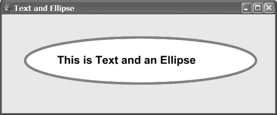

*firstPress：更多 UI 乐趣，包含 2D 绘图*

*图 5-1. TextAndEllipse.fx 程序的输出*

让我们看看清单 5-1 中除了你在 HelloJFX.fx 程序中已经学过的内容之外的新概念。

*清单 5-1. TextAndEllipse.fx 程序*

package jfx_book;

import javafx.ui.*;

import javafx.ui.canvas.*;

Frame {

title: "Text and Ellipse"

height: 250

width: 600

visible: true

content:

Canvas {

content: [

Ellipse {

transform: translate(300, 100)

strokeWidth: 5

stroke: red

fill: white

cx: 0

cy: 0

radiusX: 250

radiusY: 50

},

Text {

*firstPress：更多 UI 乐趣，包含 2D 绘图* 149

font:

Font {

faceName: "Sans Serif"

style: BOLD

size: 24

}

x: 120

y: 90

content: "This is Text and an Ellipse"

}

]

}

}

**绘制和填充形状**

你已经知道 Text 类实际上是一种可以绘制的形状；在这个程序中，你还将学习如何绘制椭圆。如清单 5-1 所示，要定义一个椭圆，我们需要定义椭圆中心点的 x 和 y 坐标（使用 cx 和 cy 属性），这些坐标相对于绘制椭圆的画布。椭圆的水平半径由 radiusX 属性指定，垂直半径由 radiusY 属性指定。

为了指定 Ellipse 对象的轮廓宽度、颜色和填充颜色，我使用了你在第 2 章中学习 Text 对象时了解到的相同属性，如下所示：strokeWidth: 5

stroke: red

fill: white

表 5-1 列出了 JavaFX 中可绘制的形状列表：*表 5-1. JavaFX 形状*

**形状**

**描述**

Arc

由边界矩形、起始角度、角度跨越的度数以及闭合类型定义的椭圆弧

Circle

由中心点和半径定义的圆

*(续)*

*firstPress：更多 UI 乐趣，包含 2D 绘图*

CubicCurve

由起点、两个控制点和终点定义的三次曲线段

Ellipse

由中心点、水平半径和垂直半径定义的椭圆

Line

由起点和终点定义的直线

Path

由直线和曲线构成的潜在复杂形状

Polygon

由一系列点定义的多边形

Polyline

由一系列点定义的一组连接线

QuadCurve

由起点、控制点和终点定义的二次曲线段

Rect

由左上角点、宽度、高度以及可选圆角定义的矩形

Star


一个由中心点、点数、内半径、外半径以及可选的第一个点起始角度定义的星形

文本

文本的图形化表示

**变换图形对象**

你可能想知道为什么这个程序的输出没有将椭圆绘制在画布的 (0, 0) 点（左上角）。原因是我使用了 Ellipse 类的 transform 属性（如下所示）将椭圆在 x 方向（向右）平移了 300 像素，在 y 方向（向下）平移了 100 像素。

transform: translate(300, 100)

顺便提一下，所有 JavaFX 形状都支持这个 transform 属性。

除了平移之外，2D 图形对象（也称为*图形节点*，或简称为*节点*）还有几种其他类型的变换可用。例如，你可以旋转、缩放和倾斜图形节点。我很快就会向你介绍这些，但与此同时，我想向你展示如何将 2D 节点组合在一起，从而能够创建作为一个整体运行的复杂 2D 图形。

**使用 Group 节点将形状组合在一起**

通常，你需要构建由多个图形节点组成的 2D 结构。例如，在图 5-1 和清单 5-1 的 TextAndEllipse.fx 程序中，Ellipse 和 Text 对象彼此独立运行。如果你想改变它们在屏幕上的位置，你必须在以下几行代码中分别更改每个对象。对于椭圆，你需要更改这一行中的值：transform: translate(300, 100)

对于 Text 对象，你需要更改这几行中的值：x: 120

y: 90

同样的思路也适用于你想要使用的其他效果，例如旋转和缩放，如图 5-2 中 GroupTextAndEllipse.fx 的输出所示。

*图 5-2. GroupTextAndEllipse.fx 程序的输出* 继续运行这个程序，并尝试以下影响 Ellipse 和 Text 图形节点的操作：

•

点击椭圆内的任意位置，每次点击它都会进一步放大。

*firstPress: 更多 UI 乐趣，包括 2D 绘图*

•

按住 Shift 键的同时点击椭圆，每次点击它都会缩小。

•

按住 Ctrl 键的同时点击椭圆，它会顺时针旋转 10 度。

•

按住 Ctrl 和 Shift 键的同时点击椭圆，它会逆时针旋转 10 度。

•

在屏幕上点击并拖动椭圆。

让我们检查一下清单 5-2 中的 GroupTextAndEllipse.fx 程序，看看如何使用 Group 对象来帮助实现这一点。

*清单 5-2. GroupTextAndEllipse.fx 程序*

package jfx_book;

import javafx.ui.*;

import javafx.ui.canvas.*;

Frame {

title: "组中的文本和椭圆"

height: 600

width: 600

visible: true

content:

Canvas {

content:

Group {

var rotAngle = 0

var scaleFactorX = 1

var scaleFactorY = 1

var transX = 300

var transY = 200

transform: bind [

translate(transX, transY),

rotate (rotAngle, 0, 0),

scale (scaleFactorX, scaleFactorY)

]

content: [

Ellipse {

var: self

onMouseEntered: operation(mEvt) {

self.cursor = HAND;

}

*firstPress: 更多 UI 乐趣，包括 2D 绘图* 153

onMouseClicked: operation(mEvt) {

if (mEvt.isControlDown() and mEvt.isShiftDown()) {

rotAngle -= 10;

}

else if (mEvt.isControlDown()) {

rotAngle += 10;

}

else if (mEvt.isShiftDown()) {

scaleFactorX *= .8;

scaleFactorY *= .8;

}

else {

scaleFactorX *= 1.25;

scaleFactorY *= 1.25;

}

}

onMouseDragged: operation(mEvt) {

transX += mEvt.dragTranslation.x;

transY += mEvt.dragTranslation.y;

}

strokeWidth: 5

stroke: red

fill: white

cx: 0

cy: 0

radiusX: 250

radiusY: 50

},

Text {

font:

Font {

faceName: "Sans Serif"

style: BOLD

size: 24

}

x: -180

y: -10

content: "组中的文本和椭圆"

}

]

}

}

}

*firstPress: 更多 UI 乐趣，包括 2D 绘图*


与清单 5-1 不同，Canvas 对象的`content`属性并不包含一个由 Ellipse 对象和 Text 对象组成的序列。相反，它包含一个单独的 Group 对象，该对象的`content`属性则包含一个由 Ellipse 和 Text 对象组成的序列。

可以为该组指定变换，这些变换将应用于组内的所有图形对象。此外，Group 拥有自己的坐标空间，该组内包含的所有图形对象共享此空间，因此组内对象指定的任何坐标都是相对于该 Group 的坐标空间的。这就是为什么 Text 节点的`x`和`y`属性被赋予的值与清单 5-1 中赋予的值截然不同的原因。

请查看清单 5-3 中 Group 节点的`transform`属性。

*清单 5-3\. GroupTextAndEllipse.fx 程序中绑定到 Group 节点的变换* Group {

var rotAngle = 0

var scaleFactorX = 1

var scaleFactorY = 1

var transX = 300

var transY = 200

transform: bind [

translate(transX, transY),

rotate (rotAngle, 0, 0),

scale (scaleFactorX, scaleFactorY)

]

我将逐一讲解这三个指定的变换，但在此之前，请注意它们都绑定到了`transform`属性。随着给定变换参数值的变化，该变换的效果也会随之改变。注意，这些变换在`transform`属性中出现的顺序很重要，因为运行时将按照这个顺序应用它们。

平移变换有两个参数，名为`transX`和`transY`。当这些值在其他地方发生变化时，它们将被应用于此平移变换，从而导致此 Group 节点（及其包含的任何节点）在屏幕上移动到新位置。在此程序中，当用户交互触发事件处理程序时（回想之前示例中的`action`和`onClose`属性），这些值会发生变化。在这种情况下，下面显示的名为`onMouseDragged`的属性包含了当用户在椭圆上点击并拖动鼠标时的事件处理程序： onMouseDragged: operation(mEvt) {

transX += mEvt.dragTranslation.x;

transY += mEvt.dragTranslation.y;

}

*首次出版：更多 UI 乐趣，包括 2D 绘图* 155

注意 ➡ 此处定义的操作被称为*匿名*操作，因为它是在现场定义且没有命名。由于此操作不会从其他地方调用，因此无需为其命名。

**Canvas 鼠标事件**

当鼠标被拖动时，分配给`onMouseDragged`属性的操作会被调用，并反复传递一个`CanvasMouseEvent`类的实例作为参数。如上所示，自上次调用以来在 x 方向上拖动的像素数（向左为负，向右为正）会被加到`transX`变量中。同样，自上次调用以来在 y 方向上拖动的像素数（向上为负，向下为正）会被加到`transY`变量中。当这种情况发生时，绑定到`transform`属性的`translate()`函数会更新，从而导致该 Group 中的 Ellipse 和 Text 节点随着鼠标拖动在屏幕上移动。

提示 ➡ `CanvasMouseEvent`类还有一个名为`localDragTranslation`的属性，它与`dragTranslation`属性类似，区别在于它包含的是在本地图形对象坐标中的拖动平移量，而不是 Canvas 坐标中的拖动平移量。

我们 Group 节点中的第二个变换是旋转变换，它使节点围绕一个中心点旋转给定的角度。请再次参考清单 5-3 以查看旋转变换，然后检查以下摘录，其中包含改变传递给`rotate()`变换函数的`rotAngle`变量中旋转角度的事件处理程序。

onMouseClicked: operation(mEvt) {

if (mEvt.isControlDown() and mEvt.isShiftDown()) {

rotAngle -= 10;

}


else if (mEvt.isControlDown()) {

rotAngle += 10;

}

else if (mEvt.isShiftDown()) {

scaleFactorX *= .8;

scaleFactorY *= .8;

*firstPress: 更多 UI 乐趣，包括 2D 绘图*

}

else {

scaleFactorX *= 1.25;

scaleFactorY *= 1.25;

}

}

如上述代码片段所示，当用户在椭圆上点击鼠标时，会执行分配给 `onMouseClicked` 属性的匿名操作。`if` 语句中的前两个条件调用了 `CanvasMouseEvent` 对象的方法，以判断用户是否按下了我们与旋转 Group 相关联的修饰键。

Group 节点中的第三个变换（请再次参见清单 5-3）是缩放变换，它根据为 x 和 y 方向提供的缩放因子，使节点增大或减小尺寸。当用户在椭圆上点击鼠标时，上述代码片段中的最后两个条件会修改 `scaleFactorX` 和 `scaleFactorY` 变量的值，这些变量会被传入 `scale()` 变换函数。

`GroupTextAndEllipse.fx` 程序中还使用了另一个鼠标事件处理器，如下面的代码片段所示：

Ellipse {

var: self

onMouseEntered: operation(mEvt) {

self.cursor = HAND;

}

}

当鼠标进入 Ellipse 节点的边界时，这个匿名事件处理器会将鼠标光标更改为手形，表示用户可以在屏幕上拖动椭圆。请注意，此代码片段中有一个名为 `var` 的属性。这实际上是一个*伪属性*，我们将在下一节中介绍。同时，请查看表 5-2，了解画布上可能发生的鼠标事件相关属性的信息。

*firstPress: 更多 UI 乐趣，包括 2D 绘图* 157

*表 5-2\. JavaFX CanvasMouseEvents*

**事件**

**描述**

onMouseClicked

当在图形对象上点击鼠标（按下并释放）时发生

onMouseDragged

当在对象中点击鼠标并拖动时发生

onMouseEntered

当鼠标进入对象时发生

onMouseExited

当鼠标离开对象时发生

onMouseMoved

当鼠标在对象内移动时发生

onMousePressed

当鼠标在对象中按下时发生

onMouseReleased

当鼠标在对象中释放时发生

**使用 var 伪属性**

在第 4 章中，您了解到 `this` 关键字是对操作、函数或触发器正在执行的实例的引用。这被称为*上下文实例*。在 JavaFX 声明式代码中，要获取对上下文实例的引用，您可以使用 `var` 伪属性（如上述代码片段所示）来创建一个局部变量，此处任意命名为 `self`。由于 `var` 伪属性被用作 Ellipse 实例的一个属性，因此名为 `self` 的变量是对正在定义的 Ellipse 实例的引用。因此，在分配给 `onMouseEntered` 属性的操作中，我们可以使用 `self` 变量来访问 Ellipse 实例的 `cursor` 属性，并将 `Cursor` 类的命名实例 `HAND` 赋值给它。

提示 ➡ 定义 `var` 伪属性的语法与定义局部变量的语法非常相似，很容易混淆。前者在 `var` 关键字后面有一个冒号，而后者没有。

在我们继续讨论更多 JavaFX 2D 图形概念之前，请查看表 5-3，其中包含了每个 JavaFX 变换的信息。

*firstPress: 更多 UI 乐趣，包括 2D 绘图*

*表 5-3\. JavaFX 变换*

**变换操作**

**描述**

matrix(a, b, c, d, e, f)

执行 2D 仿射变换（用于翻转、剪切等）。此变换使用 Java 的 `AffineTransform` 类，您可以在以下 URL 阅读更多相关信息：

[`java.sun.com/j2se/1.5.0/docs/api/java/awt/geom/AffineTra`](http://java.sun.com/j2se/1.5.0/docs/api/java/awt/geom/AffineTra)

nsform.html。

rotate(angle, cx, cy)

围绕点 (cx, cy) 将图形对象旋转给定的角度（以度为单位，正角度为顺时针方向，负角度为逆时针方向）。


逆时针为负角度）。

translate(x, y)

将对象水平移动 x 像素（正值为向右），垂直移动 y 像素（正值为向下）。

scale(x, y)

将对象水平缩放 x 倍，垂直缩放 y 倍。

skew(x, y)

将对象水平倾斜 x 度，垂直倾斜 y 度。

**创建自定义图形组件**

有时，我们希望创建一个可在其他 JavaFX 程序中重复使用的自定义组件。例如，如果有人创建了一个很棒的组件，可以弹出一个月历供用户选择日期，那么重复使用该组件会比重新发明轮子更好。我将向你展示如何创建一个可在画布上使用的自定义图形组件。以下是我将用到的示例 JavaFX 文件：

•   SuperDuckComponent.fx，包含我们的 SuperDuckComponent 自定义组件类的代码，如清单 5-4 所示
•   SuperDuckExample.fx，如清单 5-5 所示，这是一个使用 SuperDuckComponent 自定义组件类的示例

在查看清单之前，请先运行 SuperDuckExample.fx 程序，该程序位于本书代码下载的 Chapter05 文件夹中。请注意，这些文件位于 jfx_book 包中，此外，SuperDuckComponent 类使用了位于 Chapter05/images 文件夹中的图形图像文件。图 5-3 显示了该程序的初始输出。

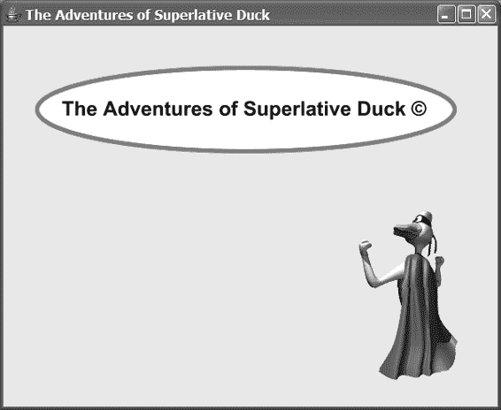

*firstPress: 更多 UI 乐趣，包括 2D 绘图*

*图 5-3. SuperDuckExample.fx 程序的输出*

注意 ➡ Superlative Duck（在本书中我将简称为 Super Duck）是 Marty、Kaleb 和 Kelvin Hutchins 创造的一个虚构角色，旨在促进关于品格、美德和价值观的交流（就像任何典型的超级英雄一样）。

SuperDuckComponent 具有与之前示例相同的功能（例如，拖拽、缩放和旋转椭圆），以及与 Super Duck 图像相关的以下功能：

•   拖拽 Super Duck 图像将在屏幕上移动该图像。
•   在 Super Duck 图像上点击并释放鼠标将使他执行规避动作，以以下方式飞到屏幕上的随机位置：

*firstPress: 更多 UI 乐趣，包括 2D 绘图*

•   他会同时变得半透明，并旋转指向他即将飞行的方向。
•   当他飞向新位置时，他会慢慢变得不那么透明，到达目的地时完全不透明。在飞行过程中，他会旋转到直立位置。

请尝试使用此功能，之后我们将一起查看代码。

*清单 5-4. SuperDuckComponent 类*

package jfx_book;

import javafx.ui.*;

import javafx.ui.canvas.*;

import java.lang.Math;

class SuperDuckComponent extends CompositeNode {

attribute theCanvas:Canvas;

}

operation SuperDuckComponent.composeNode() {

return

Group {

content: [

Group {

var rotAngle = 0

var scaleFactorX = 1

var scaleFactorY = 1

var transX = 290

var transY = 100

transform: bind [

translate(transX, transY),

rotate (rotAngle, 0, 0),

scale (scaleFactorX, scaleFactorY)

]

content: [

Ellipse {

var: self

onMouseEntered: operation(mEvt) {

self.cursor = HAND;

*firstPress: 更多 UI 乐趣，包括 2D 绘图* 161

}

onMouseClicked: operation(mEvt) {

if (mEvt.isControlDown() and mEvt.isShiftDown()) {

rotAngle -= 10;

}

else if (mEvt.isControlDown()) {

rotAngle += 10;

}

else if (mEvt.isShiftDown()) {

scaleFactorX *= .8;

scaleFactorY *= .8;

}

else {

scaleFactorX *= 1.25;

scaleFactorY *= 1.25;

}

}

onMouseDragged: operation(mEvt) {

transX += mEvt.dragTranslation.x;

transY += mEvt.dragTranslation.y;

}

strokeWidth: 5

stroke: red

fill: white

cx: 0

cy: 0

radiusX: 250

radiusY: 50

},

Text {

font:

Font {

faceName: "Sans Serif"

style: BOLD

size: 24

}

x: -220

y: -10

content: "The Adventures of Superlative Duck \u00A9"

}

]

},

ImageView {

*firstPress: 更多 UI 乐趣，包括 2D 绘图*

var: self

var x = 400

var y = 300

var rotAngle = 0

var cx = 0

var cy = 0

var opa = 1

opacity: bind opa

transform: bind [

translate (x, y),


rotate (rotAngle, cx, cy)

]

image:

Image {

url: "file:images/super_duck_trans.gif"

}

onMouseEntered: operation(mEvt) {

self.cursor = HAND;

}

onMouseDragged: operation(mEvt) {

x += mEvt.localDragTranslation.x;

y += mEvt.localDragTranslation.y;

}

onMouseClicked: operation(mEvt) {

var newX = Math.random() * (theCanvas.width - self.currentWidth); var newY = Math.random() * (theCanvas.height - self.currentHeight); cx = self.currentWidth / 2;

cy = self.currentHeight / 2;

var startAngle = (Math.toDegrees(Math.atan2((newY - self.currentY), (newX - self.currentX)))+90) % 360;

rotAngle = [startAngle .. 0] dur 3000 easeout;

x = [self.currentX..newX] dur 3000 easeout;

y = [self.currentY..newY] dur 3000 easeout;

opa = [0.01, 0.02 .. 1] dur 3000;

}

}

]

};

}

*firstPress: 更多 UI 乐趣，包括 2D 绘图* 163

**扩展 CompositeNode**

要创建一个可直接放置在画布上的自定义组件，你的组件必须是`CompositeNode`类的子类。这可以通过使用`extends`关键字来实现，如下面的代码片段所示。通过这样做，`SuperDuckComponent`类就成为了`CompositeNode`的一种类型，继承了它的所有能力。

class SuperDuckComponent extends CompositeNode {

attribute theCanvas:Canvas;

}

请注意，在类声明中，我们还定义了一个名为`theCanvas`的属性，其类型为`Canvas`。这将帮助我们的`SuperDuckComponent`自定义组件获得对其将要放置的画布的引用。

我们扩展的`CompositeNode`类包含一个名为`composeNode()`的操作，我们必须在`SuperDuckComponent`类中实现该操作，以提供我们期望自定义组件拥有的功能（参见下面的代码片段）。

该功能通过一个由该操作返回的声明式表达式来表达。

operation SuperDuckComponent.composeNode() {

return

Group {

content: [

**...省略了大量代码...**

当 JavaFX 运行时需要在画布上显示自定义组件时，会自动调用此操作。

如前所述，我为此示例添加了一些额外的功能，这让我们有机会讨论更多概念：处理图像、控制不透明度以及动画。

**在画布上处理图像**

除了在画布上放置形状，你还可以放置图像。如下面的清单 5-4 片段所示，你可以使用`ImageView`来实现这一点：

*firstPress: 更多 UI 乐趣，包括 2D 绘图*

ImageView {

var: self

var x = 400

var y = 300

var rotAngle = 0

var cx = 0

var cy = 0

var opa = 1

opacity: bind opa

transform: bind [

translate (x, y),

rotate (rotAngle, cx, cy)

]

image:

Image {

url: "file:images/super_duck_trans.gif"

}

`ImageView`有一个`image`属性，该属性被赋值为一个包含`url`属性的`Image`对象。你可能还记得，我在`WordSearchMain.fx`文件中使用了一个`Image`对象来表示工具栏上的图像。

如前所述，超级鸭子图像的功能与椭圆非常相似（你可以拖动它，并且它会旋转）。此外，我还使用了所有节点（可以放置在画布上的对象）都具备的一项能力，即控制节点*不透明度*的能力。

**控制节点的不透明度**

如前面的片段所示，`opacity`属性绑定到了一个名为`opa`的变量，该变量的初始值为 1。`opacity`属性的取值范围是 0 到 1，其中 0 表示完全透明，1 表示完全不透明。当鼠标点击超级鸭子图像时，会调用下面片段中显示的事件处理代码：onMouseClicked: operation(mEvt) {

var newX = Math.random() * (theCanvas.width - self.currentWidth); var newY = Math.random() * (theCanvas.height - self.currentHeight); cx = self.currentWidth / 2;

cy = self.currentHeight / 2;

var startAngle = (Math.toDegrees(Math.atan2((newY - self.currentY), (newX - self.currentX)))+90) % 360;

rotAngle = [startAngle .. 0] dur 3000 easeout;

*firstPress: 更多 UI 乐趣，包括 2D 绘图* 165


x = [self.currentX..newX] dur 3000 easeout;

y = [self.currentY..newY] dur 3000 easeout;

opa = [0.01, 0.02 .. 1] dur 3000;

}

在这段代码的最后一行中，`dur` 运算符用于将一个序列按时间跨度进行时序化。在此例中，从 0.01、0.02 到 1 的范围表达式在 3000 毫秒的时间段内被时序化。当这个时序化的范围表达式被赋值给 `opa` 变量时，范围表达式中的每个元素会随时间依次赋值给 `opa`。因此，在 3 秒的时间范围内，`opa` 将依次包含从 0.01、0.02 到 1 的值。

**动画化一个节点**

由于不透明度属性绑定到了 `opa` 变量，当 `opa` 变量被赋予范围表达式中的值时，超级鸭子图像的外观会随之变化。如前述代码所示，绑定到变换（如下所示）的变量也被赋予了时序化的范围表达式。对于平移变换，`x` 和 `y` 的值范围是从当前位置到一个随机计算出的位置。对于旋转变换，`cx` 和 `cy` 的值被设置为 `ImageView` 的中点，而 `rotAngle` 的范围是从指向新位置的角度到 0（垂直方向）。

transform: bind [

translate (x, y),

rotate (rotAngle, cx, cy)

]

某些 `dur` 关键字后的 `easeout` 关键字表示，在指定时间段接近结束时，值的变化会变慢。其他选项包括 `easein`、`linear` 和 `easeboth`（此为默认值）。

**在程序中使用自定义组件**

如前所述，清单 5-5 中所示的 `SuperDuckExample.fx` 程序是一个使用了 `SuperDuckComponent` 自定义组件类的示例。

*清单 5-5. SuperDuckExample.fx 程序*

package jfx_book;

import javafx.ui.*;

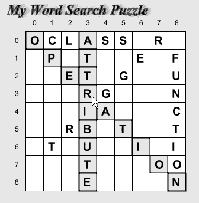

*firstPress: 更多 UI 乐趣，包括 2D 绘图*

Frame {

title: "超级鸭子的冒险"

height: 600

width: 600

visible: true

content:

BorderPanel {

center:

Canvas {

var: self

content:

SuperDuckComponent {

theCanvas: self

}

}

}

}

你会注意到，我们获取了一个对 `Canvas` 的引用，并将其赋值给我们在 `SuperDuckComponent` 类中声明的 `theCanvas` 属性。

**检查 WordGridView 自定义图形组件**

单词搜索生成器应用程序包含一个扩展了 `CompositeNode` 的自定义组件，名为 `WordGridView`。为了唤起你的记忆，图 5-4 包含了该组件的截图。

*图 5-4. WordGridView 自定义组件*

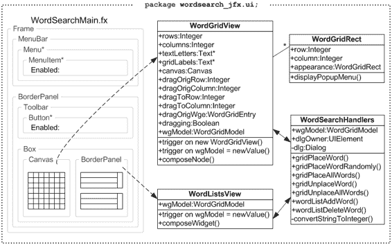

*firstPress: 更多 UI 乐趣，包括 2D 绘图*

由于我们将再次把注意力转向单词搜索生成器的 UI 部分，请查看图 5-5 中的图表，该图放大了第 3 章图 3-12 中的 `wordsearch_jfx.ui` 包。

*图 5-5. 单词搜索生成器 wordsearch_jfx.ui 包框图*

现在你已经回到了单词搜索生成器 UI 的思维模式中，请查看清单 5-6 中的 `WordGridView.fx` 文件，之后我将指出该清单中一些值得注意的地方。

*firstPress: 更多 UI 乐趣，包括 2D 绘图*

*清单 5-6. WordGridView 类*

package wordsearch_jfx.ui;

import javafx.ui.*;

import javafx.ui.canvas.*;

import javafx.ui.filter.*;

import wordsearch_jfx.model.WordGridEntry;

import wordsearch_jfx.model.WordGridModel;

class WordGridView extends CompositeNode {

attribute wgModel:WordGridModel;

attribute wsHandlers:WordSearchHandlers;

attribute rows:Integer;

attribute columns:Integer;

// 单词网格上的矩形

attribute wgRects:WordGridRect*;

// 网格上的字母

attribute textLetters:Text*;

// 网格顶部和左侧的数字标签

attribute gridLabels:Text*;

attribute canvas:Canvas;

// 用于在网格上拖拽单词：

// 待拖拽单词首字母的行和列

attribute dragOrigRow:Integer;

attribute dragOrigColumn:Integer;

// 单词首字母被拖拽到的目标单元格的行和列

attribute dragToRow:Integer;


attribute dragToColumn:Integer;

// 正在被拖拽的单词的网格条目

attribute dragOrigWge:WordGridEntry;

// 该变量保存单词是否正在被拖拽的状态 attribute dragging:Boolean;

}

*首次按下：更多 UI 乐趣，包括 2D 绘图* 169

// 常量

CELL_WIDTH:Integer = 30;

// 触发器

trigger on new WordGridView {

canvas = Canvas {};

dragging = false;

dragOrigWge = null;

}

trigger on WordGridView.wgModel = newValue {

var letterFont = new Font("Sans Serif", "BOLD", 20); wgRects = [];

textLetters = [];

for (yPos in [0.. rows - 1]) {

for (xPos in [0.. columns - 1]) {

insert WordGridRect {

var: self

row: yPos

column: xPos

x:(xPos * CELL_WIDTH:Integer)

y:(yPos * CELL_WIDTH:Integer)

height:CELL_WIDTH:Integer

width:CELL_WIDTH:Integer

appearance:

bind wgModel.gridCells[yPos * columns + xPos].appearance

wsHandlers: wsHandlers

wgModel: wgModel

onMouseEntered: operation(evt:CanvasMouseEvent) {

wgModel.highlightWordsOnCell(yPos * columns + xPos);

}

onMouseMoved: operation(evt:CanvasMouseEvent) {

wgModel.highlightWordsOnCell(yPos * columns + xPos);

}

onMouseExited: operation(evt:CanvasMouseEvent) {

wgModel.highlightWordsOnCell(NO_CELL:Integer);

}

onMouseClicked: operation(evt:CanvasMouseEvent) {

if (wgModel.fillLettersOnGrid) {

*首次按下：更多 UI 乐趣，包括 2D 绘图*

return;

}

if (evt.button == 3 or evt.isControlDown()) {

// 点击了上下文菜单按钮

self.displayPopupMenu(evt, canvas);

}

else if (evt.button == 1) {

if (evt.isShiftDown()) {

// 在按下 Shift 键的同时点击了鼠标左键，
// 因此为单词寻找下一个可用的方向并放置在那里。

if (sizeof wgModel.gridCells[yPos * columns + xPos].wordEntries > 0) {

var wge:WordGridEntry =

wgModel.gridCells[yPos * columns + xPos].wordEntries[0];

for (d in [1.. NUM_ORIENTS:Integer]) {

var newOrient = (d + wge.direction) % NUM_ORIENTS:Integer; if (wgModel.canPlaceWordSpecific(wge.word,

wge.row,

wge.column,

newOrient,

DEFAULT_LOOK:WordGridRect)) {

if (wgModel.unplaceWord(wge.word)) {

wgModel.placeWordSpecific(wge.word,

wge.row,

wge.column,

newOrient);

wgModel.highlightWordsOnCell(wge.row * columns +

wge.column);

}

break;

}

}

}

}

}

}

onMousePressed: operation(evt:CanvasMouseEvent) {

// 如果填充字母未在网格上，由于鼠标正在被按下，
// 则设置状态以便能够在网格上拖拽单词。

if (wgModel.fillLettersOnGrid) {

return;

}

*首次按下：更多 UI 乐趣，包括 2D 绘图* 171

cursor = DEFAULT;

dragging = false;

if (evt.button == 1) {

if (sizeof wgModel.gridCells[yPos * columns + xPos].

wordEntries > 0) {

dragOrigWge =

wgModel.gridCells[yPos * columns + xPos].wordEntries[0];

if (dragOrigWge.row == yPos and

dragOrigWge.column == xPos) {

dragOrigRow = yPos;

dragOrigColumn = xPos;

dragToRow = yPos;

dragToColumn = xPos;

dragging = true;

}

}

}

}

onMouseDragged: operation(evt:CanvasMouseEvent) {

// 如果填充字母未在网格上，使用 CanvasMouseEvent
// 来了解用户正在将鼠标拖拽到哪里。向用户提供反馈，
// 指示单词是否可以放置在其当前被拖拽到的位置。

if (wgModel.fillLettersOnGrid) {

return;

}

if (dragging) {

if (dragOrigWge <> null) {

dragToRow = ((evt.localY) / CELL_WIDTH:Integer).intValue(); dragToColumn = ((evt.localX) / CELL_WIDTH:Integer).intValue();

// 检查单词是否可以放置，为正在考虑中的单元格赋予“被拖拽”的外观。

if (not wgModel.canPlaceWordSpecific(dragOrigWge.word,

dragToRow,

dragToColumn,

dragOrigWge.direction,

DRAGGING_LOOK:WordGridRect)) {

// 单词无法放置，因此调用相同的方法，传入一个参数
// 使单元格具有“无法放置”的外观 wgModel.canPlaceWordSpecific(dragOrigWge.word,

dragToRow,

dragToColumn,

*首次按下：更多 UI 乐趣，包括 2D 绘图*

dragOrigWge.direction,

CANT_DROP_LOOK:WordGridRect);

}

}

}

}

onMouseReleased: operation(evt:CanvasMouseEvent) {

// 如果填充字母未在网格上，并且用户在拖拽单词后释放了
// 鼠标左键，则尽可能将该单词放置在网格上。

if (wgModel.fillLettersOnGrid) {

return;

}

if (dragging and evt.button == 1) {


dragging = false;

if (dragOrigWge <> null) {

if (wgModel.canPlaceWordSpecific(dragOrigWge.word,

dragToRow,

dragToColumn,

dragOrigWge.direction,

DEFAULT_LOOK:WordGridRect)) {

if (wgModel.unplaceWord(dragOrigWge.word)) {

if (wgModel.placeWordSpecific(dragOrigWge.word,

dragToRow,

dragToColumn,

dragOrigWge.direction)) {

}

}

}

}

}

dragOrigWge = null;

}

} into wgRects;

// 用网格单元格中的字母填充 textLetters 数组 insert Text {

x: bind wgRects[yPos * columns + xPos].x

y: bind wgRects[yPos * columns + xPos].y

content: bind wgModel.gridCells[yPos * columns + xPos].cellLetter font: letterFont

}

into textLetters;

*首次按下：更多 UI 乐趣，包括 2D 绘图* 173

var rowColumnNumberFont = new Font("Sans Serif", "PLAIN", 12); if (yPos == 0) {

// 绘制列号

insert Text {

x: (xPos + 1) * CELL_WIDTH:Integer

y: yPos

content: "{xPos}"

font: rowColumnNumberFont

}

into gridLabels;

}

if (xPos == 0) {

// 绘制行号

insert Text {

x: xPos

y: (yPos + 1) * CELL_WIDTH:Integer

content: "{yPos}"

font: rowColumnNumberFont

}

into gridLabels;

}

}

}

}

}

// 属性初始化器

attribute WordGridView.rows = bind wgModel.rows;

attribute WordGridView.columns = bind wgModel.columns;

/**

* 此方法会被自动调用，其返回值是定义此自定义图形组件的声明式脚本

*/

operation WordGridView.composeNode() {

return Group {

content: [

Text {

filter: ShadowFilter

x: 10

y: 10

content: "我的单词搜索谜题"

stroke: blue

*首次按下：更多 UI 乐趣，包括 2D 绘图*

font: new Font("Serif", ["BOLD", "ITALIC"], 24)

},

Group {

transform: translate(45, 55)

content: [

wgRects,

View {

// 此画布作为 PopupMenu 的拥有者

content: canvas

}

]

},

Group {

transform: translate(53, 63)

content: textLetters

},

Group {

transform: translate(27, 36)

content: gridLabels

}

]

};

}

与 SuperDuckComponent 自定义组件一样，这个 WordGridView 自定义组件也有一个 composeNode() 操作，其目的是在 Node 类（Group 类是其子类）的子类中返回自定义组件。这在清单 5-6 的最后部分有所展示，你可以看到它在 Group 节点内返回了四个节点：

•

一个 Text 节点，包含文字 *我的单词搜索谜题*。你会注意到它有一个 filter 属性，被赋值为 ShadowFilter。如图 5-4 所示，这为文本添加了阴影效果。ShadowFilter 是可用于增强任何图形节点外观的几种*滤镜*之一。这些滤镜位于 javafx.ui.filter 包中，这解释了本清单顶部附近的 import javafx.ui.filter.*; 语句。

•

一个 Group 节点，包含以下内容：

• 对 WordGridRect 实例序列的引用（在 wgRects 属性中）。

WordGridRect 类（如清单 5-7 所示）扩展了 JavaFX 的 Rect 类，Rect 是一个 2D 矩形节点。这个矩形数组是在 WordGridView.wgModel = newValue 触发器中被创建并赋值给 wgRects 属性的。这里需要注意的一点是，每个 WordGridRect 实例的 appearance 属性都绑定到模型中对应 WordGridCell 实例的 appearance 属性。当用户与网格交互时（例如，拖动单词），WordGridModel 类中的操作会改变 WordGridCell 实例的 appearance 属性，由于这种绑定关系，这些变化会反映在屏幕上。最终效果是，网格从 translate() 函数指定的左侧 45 像素、顶部 55 像素的位置开始绘制在我们的自定义组件上，并且网格中的每个单元格都具有适当的外观（例如，填充颜色和 strokeWidth）。

• 一个 View 节点，这是一个特殊的类，可以显示小部件（任何继承自 Widget 类的 JavaFX 类）。出于稍后我们将讨论的与显示 PopupMenu 相关的原因，我们在此自定义组件上放置了一个 Canvas 小部件。

•


一个包含对文本图形对象序列的引用（通过 `textLetters` 属性）的 Group 节点。在 `on WordGridView.wgModel = newValue` 触发器中，该序列中每个 Text 对象的 `content` 属性被绑定到模型中对应 `WordGridCell` 实例的 `cellLetter` 属性。在同一触发器中，该序列中每个 Text 对象的 `x` 和 `y` 属性被绑定到对应 `WordGridRect` 实例的 `x` 和 `y` 属性（我们在检查前一个 Group 节点时讨论过）。其效果是，字母被绘制在我们的自定义组件上，起始位置距离左侧 53 像素、距离顶部 63 像素，如 `translate()` 函数中所指定。

•

一个包含对文本图形对象序列的引用（通过 `gridLabels` 属性）的 Group 节点。在 `on WordGridView.wgModel = newValue` 触发器中，该序列中每个 Text 对象的 `content` 属性被赋予所需的 `x`、`y`、`content` 和 `font` 属性。其效果是，行号和列号标签被绘制在我们的自定义组件上，起始位置距离左侧 27 像素、距离顶部 36 像素，如 `translate()` 函数中所指定。

*firstPress: 更多 UI 乐趣，包括 2D 绘图*

**使用 PopupMenu 控件**

PopupMenu 控件负责显示第 3 章图 3-7 中所示的上下文菜单。然而，要显示 PopupMenu，你必须指定一个 Widget 的子类作为该 PopupMenu 的所有者。要了解这一点，请暂时查看清单 5-7 中 `WordGridRect` 类的 `displayPopupMenu()` 操作。

由于这个自定义组件扩展了 `CompositeNode`，它由绘制在画布上的 2D 图形（Node）对象组成。Widget 类的子类（例如 `Button` 或 `Canvas`）不能直接放在画布上。我们必须找到一种方法，为 PopupMenu 提供一个可以作为其所有者的 Widget。这就是为什么我在清单 5-6 的 `composeNode()` 操作中使用了如下所示的 View 对象。

View {

// 此画布作为 PopupMenu 的所有者

content: canvas

}

我认为 View 类就像一个适配器，因为它可以放置在画布上，而 Widget 可以放置在视图上。问题得以解决，因为我放置在视图上的画布被用作 PopupMenu 的所有者。

*清单 5-7. WordGridRect 类*

package wordsearch_jfx.ui;

import javafx.ui.*;

import javafx.ui.canvas.*;

import wordsearch_jfx.model.WordGridModel;

class WordGridRect extends Rect {

attribute wsHandlers:WordSearchHandlers;

attribute wgModel:WordGridModel;

attribute row:Integer;

attribute column:Integer;

attribute appearance:WordGridRect;

// 用于 ..._LOOK 常量

attribute name:String;

operation displayPopupMenu (cmEvt:CanvasMouseEvent, canvas:Canvas);

}

*firstPress: 更多 UI 乐趣，包括 2D 绘图* 177

// 常量

SELECTED_LOOK:WordGridRect = WordGridRect {name: "SELECTED_LOOK"}; SELECTED_FIRST_LETTER_LOOK:WordGridRect =

WordGridRect {name: "SELECTED_FIRST_LETTER_LOOK"}; DRAGGING_LOOK:WordGridRect = WordGridRect {name: "DRAGGING_LOOK"}; CANT_DROP_LOOK:WordGridRect = WordGridRect {name: "CANT_DROP_LOOK"}; DEFAULT_FIRST_LETTER_LOOK:WordGridRect =

WordGridRect {name: "DEFAULT_FIRST_LETTER_LOOK"}; DEFAULT_LOOK:WordGridRect = WordGridRect {name: "DEFAULT_LOOK"};

// 触发器

trigger on new WordGridRect {

appearance = DEFAULT_LOOK;

}

trigger on WordGridRect.appearance = newAppearance {

if (newAppearance == SELECTED_LOOK:WordGridRect) {

strokeWidth = 2;

stroke = black;

fill = yellow;

cursor = DEFAULT;

}

else if (newAppearance == SELECTED_FIRST_LETTER_LOOK:WordGridRect) {

strokeWidth = 2;

stroke = black;

fill = yellow;

cursor = HAND;

}

else if (newAppearance == DRAGGING_LOOK:WordGridRect) {

strokeWidth = 1;

stroke = cyan;

fill = cyan;

cursor = HAND;

}

else if (newAppearance == CANT_DROP_LOOK:WordGridRect) {

strokeWidth = 1;

stroke = red;

fill = red;

cursor = MOVE;

}

else if (newAppearance == DEFAULT_FIRST_LETTER_LOOK:WordGridRect) {

strokeWidth = 1;

*firstPress: 更多 UI 乐趣，包括 2D 绘图*

stroke = black;

fill = white;

cursor = HAND;

}


else if (newAppearance == DEFAULT_LOOK:WordGridRect) {

strokeWidth = 1;

stroke = black;

fill = white;

cursor = DEFAULT;

}

}

// 操作与函数

operation WordGridRect.displayPopupMenu (cmEvt, canvas) {

PopupMenu {

items: bind

foreach (wge in wgModel.gridCells[row * wgModel.columns + column].wordEntries) MenuItem {

text: "Unplace {wge.word}"

enabled: bind not wgModel.fillLettersOnGrid

action:

operation() {

wgModel.selectPlacedWord(wge.word);

wsHandlers.gridUnplaceWord();

}

}

owner: canvas

x:cmEvt.localX

y:cmEvt.localY

visible: true

};

}

现在你已经了解了如何创建一个主要用于 2D 绘图并放置在画布上的自定义图形组件，我想向你展示另一种自定义组件，它主要用于容纳 UI 控件，例如按钮、文本字段和布局控件。

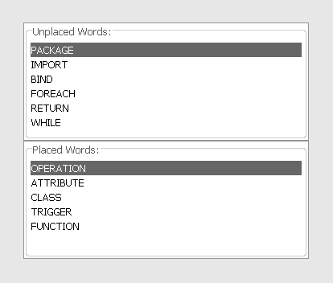

*firstPress: 更多 UI 乐趣，包括 2D 绘图*

**创建自定义控件**

WordGridView 自定义组件非常侧重于 2D 图形，而 WordListsView 自定义组件（如图 5-6 所示）则非常侧重于 UI 控件。

*图 5-6. WordListsView 自定义组件截图* 对于这种自定义组件，我们不扩展 CompositeNode 类，而是扩展 CompositeWidget 类，如清单 5-8 所示。

*清单 5-8. WordListsView 类*

package wordsearch_jfx.ui;

import javafx.ui.*;

import javafx.ui.canvas.*;

import wordsearch_jfx.model.WordGridModel;

class WordListsView extends CompositeWidget {

attribute wgModel:WordGridModel;

attribute wsHandlers:WordSearchHandlers;

}

trigger on WordListsView.wgModel = newValue {

wgModel.selectedUnplacedWordIndex = -1;

wgModel.selectedPlacedWordIndex = -1;

*firstPress: 更多 UI 乐趣，包括 2D 绘图*

}

/**

* 此方法会被自动调用，其返回值是定义此自定义控件的声明式脚本

*/

operation WordListsView.composeWidget() {

var selectedWord:String;

// 注意：为了将列表框变量传递给 WordGridModel，这里创建了这些变量。

// 当 JavaFX 实现 ListBox 的 selectedCell 属性后，此操作将不再必要。

// 构建“未放置单词”列表框

var unplacedListBox = ListBox {

border:

TitledBorder {

title: "未放置的单词:"

}

selection: bind wgModel.selectedUnplacedWordIndex

cells: bind foreach (wge in wgModel.unplacedGridEntries)

ListCell {

text: wge.word

}

action: operation() {

if (not wgModel.fillLettersOnGrid) {

wsHandlers.gridPlaceWordRandomly();

}

}

};

// 构建“已放置单词”列表框

var placedListBox = ListBox {

border:

TitledBorder {

title: "已放置的单词:"

}

selection: bind wgModel.selectedPlacedWordIndex

cells: bind foreach (wge in wgModel.placedGridEntries)

ListCell {

text: wge.word

}

action: operation() {

*firstPress: 更多 UI 乐趣，包括 2D 绘图* 181

if (not wgModel.fillLettersOnGrid) {

wsHandlers.gridUnplaceWord();

}

}

};

wgModel.unplacedListBox = unplacedListBox;

wgModel.placedListBox = placedListBox;

// 将两个列表框放入一个 GridPanel 中，并返回此自定义控件 return GridPanel {

rows: 2

columns: 1

cells: [

unplacedListBox,

placedListBox

]

};

}

**提供 composeWidget() 操作**

在创建基于 CompositeWidget 的自定义组件时，你需要在自定义组件类中提供一个 composeWidget() 操作，如清单 5-7 所示。此操作必须返回一个 Widget 类的子类对象（GridPanel 就是 Widget 的子类）。

**创建和使用 ListBox 控件**

如图 5-6 所示，WordListsView 自定义组件中有两个列表框。

要创建每个列表框，如清单 5-8 所示，我提供了四个属性：

•

cells 属性，它包含一个 ListCell 实例序列。在这里，我使用 foreach 和 bind 运算符来查询模型中的相应序列，并将其元素动态绑定到 ListBox 的单元格。每当向序列中添加或从序列中移除 WordGridEntry 时，ListBox 都会自动反映此更改。

*firstPress: 更多 UI 乐趣，包括 2D 绘图*

•


`selection` 属性保存了 ListBox 中选中单元格的从零开始的索引，并绑定到模型中相应的属性。当该属性的值为 -1 时，表示没有选中任何单元格。

•

`action` 属性，为其分配了一个匿名操作，当用户在 ListBox 单元格上双击（或按下 Enter 键）时将执行该操作。

•

`border` 属性，如你所知，可用于任何小部件。这里我使用了一个 `TitledBorder` 来为每个 ListBox 添加标签。

现在你已经了解了如何开发两种自定义组件（基于 Node 和基于 Widget），让我们来看一下 Word Search Builder 应用程序中的最终清单，在此过程中你将学习如何在 JavaFX 中创建对话框。

**创建对话框**

如图 5-5 和第 3 章图 3-12 所示，`WordSearchHandlers` 类的目的是处理由 `WordSearchMain.fx` 文件、`WordGridView` 类和 `WordListsView` 类中的代码发出的请求。有些请求直接发送给 `WordGridModel` 类，但需要显示对话框的请求则由 `WordSearchHandlers` 类处理，然后该类再向 `WordGridModel` 类发出请求。请花点时间浏览清单 5-9 中的 `WordSearchHandlers.fx` 代码，我们将介绍三种创建对话框的方法。

*清单 5-9. WordSearchHandlers 类*

package wordsearch_jfx.ui;

import javafx.ui.*;

import wordsearch_jfx.model.WordGridModel;

import wordsearch_jfx.model.WordGridCell;

import wordsearch_jfx.model.WordOrientation;

import java.lang.NumberFormatException;

import java.lang.Math;

import java.lang.System;

import java.util.Scanner;

public class WordSearchHandlers {

*初版：更多 UI 乐趣，包括 2D 绘图* 183

attribute wgModel:WordGridModel;

attribute dlgOwner:UIElement;

private attribute dlg:Dialog;

operation gridPlaceWord();

operation gridPlaceWordRandomly();

operation gridPlaceAllWords();

operation gridUnplaceWord();

operation gridUnplaceAllWords();

operation wordListAddWord();

operation wordListDeleteWord();

private operation convertStringToInteger(str:String):Integer;

}

operation WordSearchHandlers.gridPlaceWord() {

if (wgModel.selectedUnplacedWordIndex < 0) {

MessageDialog {

title: "未选择单词"

message: "请从“未放置单词”列表中选择一个单词"

messageType: ERROR

visible: true

}

return;

}

else {

wgModel.selectedDirection = HORIZ:WordOrientation.id;

wgModel.rowStr = "";

wgModel.columnStr = "";

dlg = Dialog {

modal: true

owner: dlgOwner

title: "在网格上放置单词"

content:

Box {

orientation: VERTICAL

content: [

GroupPanel {

var wordRow = Row { alignment: BASELINE }

var rowNumRow = Row { alignment: BASELINE }

var columnNumRow = Row { alignment: BASELINE }

var labelsColumn = Column {

*初版：更多 UI 乐趣，包括 2D 绘图*

alignment: TRAILING

}

var fieldsColumn = Column {

alignment: LEADING

resizable: true

}

rows: [wordRow, rowNumRow, columnNumRow]

columns: [labelsColumn, fieldsColumn]

content: [

SimpleLabel {

row: wordRow

column: labelsColumn

text: "单词："

},

SimpleLabel {

row: wordRow

column: fieldsColumn

text: wgModel.selectedUnplacedWord

},

SimpleLabel {

row: rowNumRow

column: labelsColumn

text: "行 (0-{wgModel.rows - 1})："

},

TextField {

row: rowNumRow

column: fieldsColumn

columns: 3

value: bind wgModel.rowStr

},

SimpleLabel {

row: columnNumRow

column: labelsColumn

text: "列 (0-{wgModel.columns - 1})："

},

TextField {

row: columnNumRow

column: fieldsColumn

columns: 3

value: bind wgModel.columnStr

}

]

},

*初版：更多 UI 乐趣，包括 2D 绘图* 185

GridPanel {

border:

TitledBorder {

title: "方向"

}

rows: 4

columns: 1

var directionButtonGroup = ButtonGroup {

selection: bind wgModel.selectedDirection

}

cells: [

RadioButton {

buttonGroup: directionButtonGroup

text: "水平"

},

RadioButton {

buttonGroup: directionButtonGroup

text: "对角线向下"

},

RadioButton {

buttonGroup: directionButtonGroup

text: "垂直"

},

RadioButton {

buttonGroup: directionButtonGroup

text: "对角线向上"

}

]

}

]

}

buttons: [

Button {

text: "确定"

defaultButton: true

action:

operation() {

var row = 0;


var column = 0;

try {

row = convertStringToInteger(wgModel.rowStr);

*首次按下：更多 UI 乐趣，包括 2D 绘图*

column = convertStringToInteger(wgModel.columnStr);

}

catch (nfe:NumberFormatException) {

row = -1; // 强制将行设为无效数字

}

if (row < 0 or

row > wgModel.rows - 1 or

column < 0 or

column > wgModel.columns - 1) {

<<javax.swing.JOptionPane>>.showMessageDialog(null,

"请输入有效的行号和列号",

"无效的行号或列号",

<<javax.swing.JOptionPane>>.INFORMATION_MESSAGE); wgModel.selectedDirection = HORIZ:WordOrientation.id;

wgModel.rowStr = "";

wgModel.columnStr = "";

}

else {

// 用户输入了有效的行数和列数

if (wgModel.placeWordSpecific(wgModel.selectedUnplacedWord, row,

column,

wgModel.selectedDirection)) {

dlg.hide();

}

else {

MessageDialog {

owner: dlg

title: "放置错误"

message: "无法在指定位置放置单词"

messageType: ERROR

visible: true

}

}

}

},

Button {

text: "取消"

defaultCancelButton: true

action:

operation() {

*首次按下：更多 UI 乐趣，包括 2D 绘图* 187

dlg.hide();

return;

}

}

]

};

dlg.show();

}

}

operation WordSearchHandlers.gridPlaceWordRandomly() {

if (wgModel.selectedUnplacedWordIndex < 0) {

MessageDialog {

title: "未选择单词"

message: "请从“未放置单词”列表中选择一个单词"

messageType: ERROR

visible: true

}

return;

}

else {

var resp = <<javax.swing.JOptionPane>>.showConfirmDialog(null,

"放置单词：{wgModel.selectedUnplacedWord}？",

"在网格上随机放置单词",

<<javax.swing.JOptionPane>>.OK_CANCEL_OPTION,

<<javax.swing.JOptionPane>>.QUESTION_MESSAGE); if (resp == <<javax.swing.JOptionPane>>.OK_OPTION) {

if (not wgModel.placeWord(wgModel.selectedUnplacedWord)) {

MessageDialog {

owner: dlg

title: "放置错误"

message: "未在网格上放置单词"

messageType: ERROR

visible: true

}

}

}

}

}

operation WordSearchHandlers.gridPlaceAllWords() {

*首次按下：更多 UI 乐趣，包括 2D 绘图*

var resp = <<javax.swing.JOptionPane>>.showConfirmDialog(null,

"您确定要放置所有单词吗？",

"确认",

<<javax.swing.JOptionPane>>.YES_NO_OPTION,

<<javax.swing.JOptionPane>>.QUESTION_MESSAGE); if (resp == <<javax.swing.JOptionPane>>.YES_OPTION) {

for (wge in wgModel.unplacedGridEntries) {

if (not wgModel.placeWord(wge.word)) {

System.out.println("单词 {wge.word} 未放置"); MessageDialog {

title: "单词未放置"

message: "未放置单词：{wge.word}"

messageType: INFORMATION

visible: true

}

}

}

}

}

operation WordSearchHandlers.gridUnplaceWord() {

if (wgModel.selectedPlacedWordIndex < 0) {

MessageDialog {

title: "未选择单词"

message: "请从“已放置单词”列表中选择一个单词"

messageType: INFORMATION

visible: true

}

return;

}

else {

var resp = <<javax.swing.JOptionPane>>.showConfirmDialog(null,

"移除单词：{wgModel.selectedPlacedWord}？",

"从网格中移除单词",

<<javax.swing.JOptionPane>>.OK_CANCEL_OPTION,

<<javax.swing.JOptionPane>>.QUESTION_MESSAGE); if (resp == <<javax.swing.JOptionPane>>.OK_OPTION) {

wgModel.unplaceWord(wgModel.selectedPlacedWord);

}

}

}

*首次按下：更多 UI 乐趣，包括 2D 绘图* 189

operation WordSearchHandlers.gridUnplaceAllWords() {

var resp = <<javax.swing.JOptionPane>>.showConfirmDialog(null,

"您确定要移除所有单词吗？",

"确认",

<<javax.swing.JOptionPane>>.YES_NO_OPTION,

<<javax.swing.JOptionPane>>.QUESTION_MESSAGE); if (resp == <<javax.swing.JOptionPane>>.YES_OPTION) {

wgModel.unplaceGridEntries();

}

}

operation WordSearchHandlers.wordListAddWord() {

wgModel.newWord = "";

dlg = Dialog {

modal: true

owner: dlgOwner

title: "将单词添加到单词列表"

content:

GroupPanel {

var newWordRow = Row { alignment: BASELINE }

var labelsColumn = Column {

alignment: TRAILING

}

var fieldsColumn = Column {

alignment: LEADING

resizable: true

}

var tf = TextField {

row: newWordRow

column: fieldsColumn

columns: 15

}

rows: [newWordRow]

columns: [labelsColumn, fieldsColumn]

content: [

SimpleLabel {

row: newWordRow

column: labelsColumn

text: "新单词："

},

TextField {

*首次按下：更多 UI 乐趣，包括 2D 绘图*

row: newWordRow

column: fieldsColumn

columns: 15

value: bind wgModel.newWord

}

]

}

buttons: [


Button {

text: "确定"

defaultButton: true

action:

operation() {

var word = wgModel.newWord.trim();

if (word.length() < 3) {

MessageDialog {

title: "输入错误"

message: "单词必须至少包含 3 个字母"

messageType: ERROR

visible: true

}

wgModel.newWord = "";

}

else if (word.indexOf(SPACE:String) >= 0) {

MessageDialog {

owner: dlg

title: "输入错误"

message: "单词不能包含空格"

messageType: ERROR

visible: true

}

wgModel.newWord = "";

}

else {

if (wgModel.addWord(wgModel.newWord)) {

dlg.hide();

}

else {

MessageDialog {

owner: dlg

title: "输入错误"

message: "{wgModel.newWord} 已在单词列表中"

messageType: ERROR

*firstPress: 更多 UI 乐趣，包括 2D 绘图* 191

visible: true

}

wgModel.newWord = "";

}

}

}

},

Button {

text: "取消"

defaultCancelButton: true

action:

operation() {

dlg.hide();

return;

}

}

]

};

dlg.show();

}

operation WordSearchHandlers.wordListDeleteWord() {

var selWord = "";

if (wgModel.selectedUnplacedWordIndex >= 0) {

selWord = wgModel.selectedUnplacedWord;

}

else if (wgModel.selectedPlacedWordIndex >= 0) {

selWord = wgModel.selectedPlacedWord;

}

else {

MessageDialog {

title: "未选择单词"

message: "请从“未放置单词”或“已放置单词”列表中选择单词"

messageType: ERROR

visible: true

}

return;

}

var resp = <<javax.swing.JOptionPane>>.showConfirmDialog(null,

"删除单词: {selWord}?",

"从单词列表中删除单词",

<<javax.swing.JOptionPane>>.OK_CANCEL_OPTION,

<<javax.swing.JOptionPane>>.QUESTION_MESSAGE);


*firstPress: 更多 UI 乐趣，包括 2D 绘图*

if (resp == <<javax.swing.JOptionPane>>.OK_OPTION) {

wgModel.deleteWord(selWord);

}

}

operation WordSearchHandlers.convertStringToInteger(str) {

var scanner = new Scanner(str);

if (scanner.hasNextInt()) {

return new Scanner(str).nextInt();

}

else {

throw new NumberFormatException("{str} 不是数字");

}

}

**使用 JavaFX MessageDialog 类**

清单 5-9 中展示的制作对话框的第一种方法是使用声明式语句中的 MessageDialog 类，如下所示：

MessageDialog {

title: "未选择单词"

message: "请从“未放置单词”列表中选择一个单词"

messageType: ERROR

visible: true

}

这将导致出现图 5-7 所示的对话框。

*图 5-7. 由 JavaFX MessageDialog 类创建的对话框* 这是一种向用户显示消息的好方法，用户可以通过单击“确定”按钮来确认——但这也就是其能力的极限了。


*firstPress: 更多 UI 乐趣，包括 2D 绘图*

**使用 Java Swing JOptionPane 类**

清单 5-9 中展示的制作消息对话框的另一种方法是使用 Java Swing JOptionPane 类，如下所示：

<<javax.swing.JOptionPane>>.showMessageDialog(null,

"请输入有效的行号和列号",

"无效的行号或列号",

<<javax.swing.JOptionPane>>.INFORMATION_MESSAGE); 这将产生图 5-8 所示的消息对话框。

*图 5-8. 使用 Java Swing JOptionPane 类创建的消息对话框* 注意 ➡ 上述代码片段中的尖括号（<<>>）在 JavaFX 中用作带引号的标识符。这允许你做一些事情，比如用 JavaFX 关键字来命名变量——例如，var <<for>> = 4;。

比消息对话框更高级的是确认对话框，它使用了 JOptionPane 类的另一个方法：

var resp = <<javax.swing.JOptionPane>>.showConfirmDialog(null,

"取消放置单词: {wgModel.selectedPlacedWord}?",

"从网格中取消放置单词",

<<javax.swing.JOptionPane>>.OK_CANCEL_OPTION,

<<javax.swing.JOptionPane>>.QUESTION_MESSAGE); if (resp == <<javax.swing.JOptionPane>>.OK_OPTION) {

wgModel.unplaceWord(wgModel.selectedPlacedWord);

}

这提供了确认用户是否真的想要执行请求操作的能力，例如从单词网格中取消放置一个单词，如图 5-9 所示。


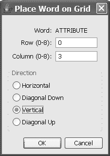

*firstPress: 更多 UI 乐趣，包括 2D 绘图*


*图 5-9：使用 Java Swing JOptionPane 类创建的确认对话框* 你可以在以下 URL 的 Java 文档中找到关于使用 Java Swing JOptionPane 类的更多信息：

[`java.sun.com/j2se/1.5.0/docs/api/javax/swing/JOptionPane.html.`](http://java.sun.com/j2se/1.5.0/docs/api/javax/swing/JOptionPane.html)

**使用 JavaFX Dialog 类**

当需要创建比前述更复杂的对话框时，可以使用 JavaFX Dialog 类。例如，图 5-10 展示了单词搜索构建器中的对话框，它要求用户提供单词放置位置的具体信息：

*图 5-10：使用 JavaFX Dialog 类创建的对话框* 使用 Dialog 类与使用 Frame 类类似，如清单 5-10 中的代码片段所示：

*firstPress：更多 UI 乐趣，包括 2D 绘图* 195

*清单 5-10：从 JavaFX Dialog 类创建对话框的代码* private attribute dlg:Dialog;

**...大量代码省略...**

dlg = Dialog {

modal: true

owner: dlgOwner

title: "在网格上放置单词"

content:

Box {

orientation: VERTICAL

content: [

GroupPanel {

var wordRow = Row { alignment: BASELINE }

var rowNumRow = Row { alignment: BASELINE }

var columnNumRow = Row { alignment: BASELINE }

var labelsColumn = Column {

alignment: TRAILING

}

var fieldsColumn = Column {

alignment: LEADING

resizable: true

}

rows: [wordRow, rowNumRow, columnNumRow]

columns: [labelsColumn, fieldsColumn]

content: [

SimpleLabel {

row: wordRow

column: labelsColumn

text: "单词："

},

SimpleLabel {

row: wordRow

column: fieldsColumn

text: wgModel.selectedUnplacedWord

},

SimpleLabel {

row: rowNumRow

column: labelsColumn

text: "行 (0-{wgModel.rows - 1})："

},

TextField {

*firstPress：更多 UI 乐趣，包括 2D 绘图*

row: rowNumRow

column: fieldsColumn

columns: 3

value: bind wgModel.rowStr

},

SimpleLabel {

row: columnNumRow

column: labelsColumn

text: "列 (0-{wgModel.columns - 1})："

},

TextField {

row: columnNumRow

column: fieldsColumn

columns: 3

value: bind wgModel.columnStr

}

]

},

GridPanel {

border:

TitledBorder {

title: "方向"

}

rows: 4

columns: 1

var directionButtonGroup = ButtonGroup {

selection: bind wgModel.selectedDirection

}

cells: [

RadioButton {

buttonGroup: directionButtonGroup

text: "水平"

},

RadioButton {

buttonGroup: directionButtonGroup

text: "对角线向下"

},

RadioButton {

buttonGroup: directionButtonGroup

text: "垂直"

},

RadioButton {

buttonGroup: directionButtonGroup

*firstPress：更多 UI 乐趣，包括 2D 绘图* 197

text: "对角线向上"

}

]

}

]

}

buttons: [

Button {

text: "确定"

defaultButton: true

action:

operation() {

**...部分代码省略...**

}

},

Button {

text: "取消"

defaultCancelButton: true

action:

operation() {

dlg.hide();

return;

}

}

]

};

dlg.show();

请注意，要以编程方式显示和隐藏对话框，需要使用 Dialog 类的 show()和 hide()操作。

**体验 GroupPanel 布局**

此对话框使用了一个名为 GroupPanel 的布局组件，该组件在布局对话框等方面非常有用。如清单 5-10 所示，要使用 GroupPanel 布局，需要定义每个行和列，然后将组件放置在这些行和列中。这种布局可以轻松创建整齐对齐的标签和值行，如图 5-10 顶部所示。

*firstPress：更多 UI 乐趣，包括 2D 绘图*

**使用 RadioButton 组件**

单选按钮为用户提供一组互斥的选择，如图 5-10 所示。要将 RadioButton 组件与组关联，请创建一个 ButtonGroup（如清单 5-10 所示），并将其分配给该组中每个 RadioButton 的 buttonGroup 属性。

**更多 JavaFX UI 组件**

虽然我已经向你展示了众多 JavaFX UI 组件，但还有更多可用的组件。

表 5-4 列出了一些更常用且有趣的 UI 组件。

*表 5-4：更多 JavaFX UI 组件*

组件

描述

BookPanel

一种布局组件，具有书籍的外观和功能，每个页面由 Widget 子类表示

CheckBox


一个表示两种状态（选中为 true 或 false）的控件。复选框可以关联代表这些状态的图标。

ColorChooser

一个允许用户选择颜色的对话框

ComboBox

一个下拉列表框，用户既可以从列表中选择，也可以输入文本

EditorPane

一个提供文本编辑功能的控件

FileChooser

一个允许用户从文件系统中选择文件的对话框

Label

一个支持 HTML 和超链接的文本标签

PasswordField

一个适合输入密码的文本字段

ProgressBar

一个显示操作进度的进度条

Slider

一个允许用户通过滑块选择数值的控件

Spinner

一个允许用户通过点击向上或向下符号从值列表中进行选择的控件

SplitPane

一个包含多个窗格，且窗格大小可由用户调整的控件

TabbedPane

一个包含多个选项卡，每个选项卡对应一个窗格的控件

Table

一个包含行和列的表格控件

TextArea

一个可滚动的多行文本字段

Tree

一个可折叠节点的分层列表

我还有一个练习要给你，它将帮助你内化本书中学到的许多概念：

*firstPress: 更多 UI 乐趣，包括 2D 绘图* 199

**JavaFX-a-Sketch 练习**

创建一个 JavaFX 程序，允许用户通过在画布上绘制来创建各种形状。例如，用户可以从菜单中选择一个圆形，在所需的中心点单击鼠标，然后拖动鼠标到所需的半径。当用户拖动鼠标时，圆形会动态调整大小。在绘制形状之前，用户还需要选择填充颜色、描边颜色和描边宽度。用户应该能够选择和删除一个形状。该程序应该有一个模型类，以及一个用于绘图区域的自定义组件。作为额外加分项，模型类应该有一个序列来保存每个已绘制形状的信息，并将一个 ListBox 绑定到该模型，这样当每个形状被添加或删除时，ListBox 会反映当前屏幕上形状对象的信息。

顺便说一句，我没有在代码下载中包含这个程序的示例解决方案，因为我希望鼓励你的创造力和足智多谋，而不是缩短学习过程。如果你愿意，请将你的解决方案（以 ZIP 文件形式）发送到 jim. weaver@jmentor.com，因为我想看看不同的读者是如何处理这个练习的。我计划在我网站 ([`jmentor.com/`](http://jmentor.com)) 上发布一个 Java Web Start 链接，指向我收到的一些解决方案，因此请在提交邮件中说明你是否同意将其在互联网上公开。

**总结**

再一次，你攀登了一条陡峭的学习曲线！在本章中，你学习了如何执行以下操作：

•

在画布上绘制多种形状，以及在画布上放置图像。

•

使用诸如 `translate()` 和 `rotate()` 之类的变换来控制形状的位置和外观。

•

将绑定运算符与变换和不透明度属性（结合画布鼠标事件）一起使用，以允许用户与形状和图像进行动态交互。

•

将 `dur` 运算符与范围表达式一起使用来制作图形对象的动画。

*firstPress: 更多 UI 乐趣，包括 2D 绘图*

•

创建一个匿名操作。

•

使用 `var` 伪属性在声明式代码中获取对上下文实例的引用（类似于 `this`）。

•

通过扩展 `CompositeNode` 类来创建基于 2D 图形的自定义组件。你学习了使用 `Group` 节点来组织组件中节点的分组。

•

在图形对象上创建并显示一个 `PopupMenu`。这是通过一个 `View` 适配器节点实现的，该节点可以放置在画布上，但可以容纳 `Widget` 子类。

•

通过扩展 `CompositeWidget` 类来创建面向 UI 控件的自定义组件。

•

使用 `ListBox` 和 `RadioButton` 控件。你还了解了许多其他 UI 组件的用途。

•

根据所需功能，以多种方式创建对话框。在此上下文中，你学习了使用 `GroupPanel` 布局控件。

教授你如何使用 JavaFX 创建程序是我的荣幸，我想鼓励你积极参与 Project OpenJFX 论坛和邮件列表，以及从 PlanetJFX wiki 学习并为其做出贡献。对于 JavaFX Script 来说，这是一个激动人心的时刻，因为这种非常简单、优雅且强大的语言正在不断发展和改进！

**资源**

以下是一些你可以探索的 JavaFX 资源，以补充本章所学内容：

•

*JavaFX Canvas 教程*：这是继续学习和练习 JavaFX 2D 功能的绝佳资源。它位于 Project OpenJFX 下载包的 trunk/demos/tutorial 文件夹中，可以通过该文件夹中的 tutorial.bat 或 tutorial.sh 脚本调用。

*firstPress: 更多 UI 乐趣，包括 2D 绘图* 201

•

*JavaFX API 参考*：它由包含 JavaFX 类库中属性、操作和函数文档的网页组成。这些文档是根据 JavaFX 库源代码中的注释生成的，并且随着源代码注释的日益完善，其价值也会增加。它位于 [`openjfx.dev.java.net/nonav/api/index.html`](https://openjfx.dev.java.net/nonav/api/index.html)，也包含在 Project OpenJFX 下载包中。

•

*其他程序*：Project OpenJFX 下载包中有几个程序可供学习，包括 SVG 到 JavaFX 转换器和 Casual Instant Messaging 客户端。

*firstPress: 更多 UI 乐趣，包括 2D 绘图*

