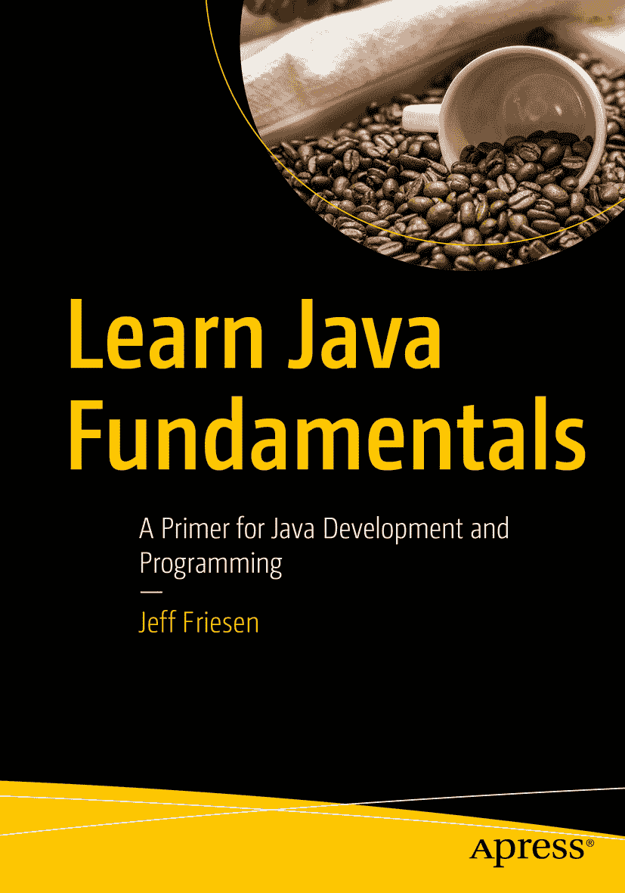

ISBN 979-8-8688-0350-5 e-ISBN 979-8-8688-0351-2 [`doi.org/10.1007/979-8-8688-0351-2`](https://doi.org/10.1007/979-8-8688-0351-2) © Jeff Friesen 2024
本作品受版权保护。所有权利均由出版商独家许可，涉及材料的全部或部分内容，特别是翻译、重印、重用插图、朗诵、广播、微缩胶片复制或任何其他物理形式的复制权，以及信息存储与检索的传输权、电子改编、计算机软件，或目前已知或未来开发的任何类似或不同方法的权利。本出版物中使用通用描述性名称、注册商标、商标、服务标志等，即使未作明确声明，也不意味着这些名称不受相关保护性法律和法规的约束，因此可自由通用。出版商、作者和编辑认为，本书中的建议和信息在出版之日是真实准确的。出版商、作者或编辑均不对本书所含内容或可能存在的任何错误或遗漏提供明示或暗示的担保。出版商对已出版地图中的管辖权主张和机构归属保持中立。

本 Apress 印记由注册公司 APress Media, LLC（Springer Nature 的一部分）出版。

注册公司地址为：1 New York Plaza, New York, NY 10004, U.S.A.

*献给我的主和救主耶稣基督*

*以及*

*献给我的父母和姐姐的回忆*

*以及*

*献给我的妹妹及其家人。*

引言

Java 是一种流行的编程语言和环境。由于许多公司的信息技术部门都在使用 Java，学习 Java 是提升职业生涯（并在当前经济困难时期赚取更多收入）的绝佳途径。

如果您从未接触过 Java，这本包含 14 个章节的书正适合您。第 1 章将带您轻松踏上学习 Java 基础知识的旅程。

第 2 章至第 11 章主要关注语言语法，同时也介绍了一些与语法密切相关的 API。

第 2 章重点介绍注释、标识符、类型、变量和字面量。这些特性是许多语言的基础，本章还将向您展示 Java 在这些特性的实现上与其他语言的不同之处。

第 3 章重点介绍表达式（和运算符），第 4 章重点介绍语句。同样，这些特性在许多语言中都很常见。您将使用这些构建块来构造简单的 Java 程序，并了解 Java 在表达式（和运算符）及语句的实现上与其他语言的不同之处。

第 5 章重点介绍数组。您将使用这种基本数据结构来创建处理数据项序列的程序。例如，您可能希望在员工 ID 序列中搜索特定的标识符。

如果 Java 仅提供这些功能，您将能够创建复杂的结构化程序。在结构化程序中，数据和操作数据的方法是分离的。然而，正如第 6 章至第 8 章所示，Java 的能力远不止创建结构化程序。

第 6 章向您介绍类和对象。类是制造对象的*模板*。它提供了一种架构，用于组织数据并将数据与操作数据的代码关联起来。*对象*是类的一个实例（有点像饼干是饼干模具的一个实例）。它存储数据，这些数据可以由对象从其类中继承的代码进行操作。（如果这看起来复杂，请不要担心。阅读第 6 章后，您将会有更好的理解。）

Java 和其他支持类和对象的语言被称为*基于对象的语言*。要超越基于对象并成为*面向对象的语言*，一种语言还必须支持继承。Java 支持继承，您将在第 7 章中了解这一点。

通过多态性（基于继承）可以使程序更高效。多态性背后的思想是，单个符号可以代表许多不同的类型（例如，`+`符号可以表示整数加法、浮点数加法或字符串拼接）。您将在第 8 章中了解多态性。

在您探索 Java 的众多 API 之前，还需要了解一些其他的语言特性。第 9 章首先向您介绍静态类、非静态类、局部类和匿名类。这些特性让您能够逻辑地组织代码，使其更具可读性和可维护性。

包允许您将相关的类组织在相当于文件夹的结构中。此功能通过将类库组织在单个前缀下，帮助您避免名称冲突。请查看第 10 章以了解包的相关知识。

Java 提供了一种健壮的异常处理机制，用于处理有缺陷的代码或意外困难，例如尝试打开一个不存在的文件。该机制在第 11 章中介绍。

最后三章将介绍一些您在许多 Java 程序中都会用到的基本 API。第 12 章重点介绍`Math`类及相关类型，第 13 章重点介绍`String`和`StringBuffer`，第 14 章重点介绍`System`。在探索了这些类型之后，您将能够自行探索更多的 API，以增加您的 Java 知识。

本书末尾有两个附录。附录 A 提供了 Java 支持的保留字的快速参考，附录 B 提供了 Java 支持的运算符的快速参考。

关于作者 关于技术审校者

