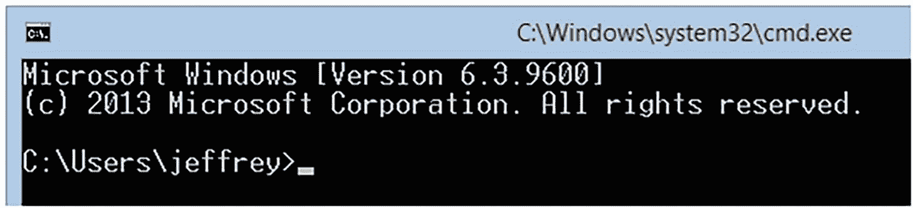

# 1. Java 入门

欢迎来到 Java 世界。这项技术在商业领域被广泛使用，您可能希望快速学习它，以便能在这些公司中谋得一份 Java 程序员的工作。尽管 Java 庞大且不断演进，但有许多基本特性是永恒且易于理解的。掌握这些基础知识后，您编写 Java 程序将会更加得心应手。

本章将带您开启 Java 基本特性的探索之旅。首先，您将得到“什么是 Java？”这个问题的答案。接着，您将了解 Java 开发工具包（JDK），这是在您的计算机上开发 Java 程序所必需的软件。然后，您将接触到您的第一个 Java 程序，该程序会输出一条简单的“hello, world”消息。最后，您将了解应用程序的架构。

注意

*程序*是供计算机执行的一系列指令。*应用程序*是一个具有单一执行入口点的程序。（相比之下，*小程序*——一种旧的、已不再广泛使用的 Java 程序形式——具有多个入口点。）例如，存储在`.exe`文件中的 Microsoft Windows 程序就有一个单一的入口点。当用 C 语言*源代码*（文本指令）表示时，该入口点由一个名为`main`的*函数*（一个命名的指令序列）定义。


## 什么是 Java？

Java 就像一枚硬币的两面。一方面，它是一种计算机编程语言。另一方面，它是一个用于运行用该语言编写的程序的虚拟*平台*（程序运行所需的硬件和软件环境）。

注意

Java 有一段有趣的历史。可以查阅维基百科上关于“Java（编程语言）”（[`http://en.wikipedia.org/wiki/Java_(programming_language)#History`](http://en.wikipedia.org/wiki/Java_(programming_language)%2523History)）和“Java（软件平台）”（[`http://en.wikipedia.org/wiki/Java_ (software_platform)#History`](http://en.wikipedia.org/wiki/Java_%20(software_platform)%2523History)）的词条来了解更多。

### Java 是一种编程语言

*Java* 是一种编程语言，其许多特性与 C 和 C++ 语言中的特性相同。这并非偶然。Java 的初始目标之一就是让 C/C++ 程序员能够轻松迁移到 Java，从而快速建立起一个初始程序员群体，帮助 Java 取得成功。

你会发现这些语言之间存在若干相似之处：

*   Java 和 C/C++ 中用于注释源代码的单行和多行注释方式相同。

*   Java 和 C/C++ 中存在各种相同的保留字，例如 `if`、`while`、`for` 和 `switch`。Java 和 C++ 中还存在其他一些 C 中没有的保留字，例如 `try`、`catch`、`class` 和 `public`。

*   这三种语言共享基本类型：例如字符型和整型。此外，这些类型的保留字在这些语言中也相同：例如 `char` 和 `int`。

*   Java 和 C/C++ 共享许多相同的运算符。例如算术运算符（如 `*` 和 `+`）和关系运算符（如 `==` 和 `<=`）。

*   最后，Java 和 C/C++ 都使用花括号（`{` 和 `}`）来界定语句块。

Java 在许多方面也与 C/C++ 有所不同。以下是众多差异中的一部分：

*   Java 支持一种额外的注释风格来记录源代码。这种注释风格被称为 *Javadoc*。

*   Java 提供了 C/C++ 中没有的保留字。例如 `strictfp` 和 `transient`。

*   Java 的字符类型比 C 和 C++ 中的字符类型更大。在那些语言中，一个字符占用一个字节的内存。相比之下，Java 的字符类型占用两个字节。

*   Java 不支持所有 C/C++ 的运算符。例如，你在 Java 中找不到 C/C++ 的 `sizeof` 运算符。此外，`>>>`（无符号右移）运算符是 Java 独有的。

*   Java 提供了带标签的 `break` 和 `continue` 语句。这些与不接受标签的 C/C++ 对应语句不同的变体，是 C/C++ 中 `goto` 语句的更安全替代方案，而 Java 不支持 `goto` 语句。

我将在本书的后续部分讨论注释、保留字、类型、运算符和语句。

Java 编程语言由各种规则严格定义，这些规则描述了其*语法*（结构）和*语义*（含义）。编译器在将程序的源代码转换为等效的*字节码*（程序可执行代码的可移植表示形式）时，会使用这些规则来验证正确性。此字节码存储在一个或多个*类文件*中，这些类文件相当于 Windows 程序的可执行文件（`.exe`）。

### Java 是一个虚拟平台

*Java* 是一个执行 Java 程序的虚拟平台。与由微处理器（例如 Intel 或 AMD 处理器）和操作系统（例如 Windows 11）组成的真实平台不同，Java 平台由虚拟机和执行环境软件组成。

*虚拟机*是一个基于软件的处理器，拥有自己的一套指令集。Java 虚拟机（JVM）相关的*执行环境*包含一个庞大的预构建引用类型库（可以理解为应用程序编程接口 [API]），Java 程序可以使用这些库来执行日常任务（例如打开文件）。执行环境还包含通过 Java 本地接口将 JVM 连接到底层操作系统的“胶水”代码。（本书不讨论 Java 本地接口，因为我认为它不是一个基本特性。）

注意

字节码和虚拟机的结合使得实现*可移植性*成为可能：同一个 Java 程序可以在所有支持该虚拟机的平台上运行。无需为每个平台重新编译程序的源代码。

Java 程序由一个特殊的可执行文件运行，我称之为*程序启动器*。由于程序由一个或多个类文件组成，启动器会接收*主类文件*（执行开始的类文件）的名称。在将 JVM 加载到内存后，它会告诉 JVM 使用其*类加载器*组件将主类文件加载到内存中。然后，JVM 会验证该类文件的字节码是否可以安全运行（例如，没有病毒），然后运行它。

注意

验证器和安全管理器架构使得实现*安全性*成为可能：当验证器检测到损坏的字节码时，Java 应用程序将不允许运行。此外，当安装了安全管理器时，应用程序将无法窃取敏感信息、删除文件或以其他方式损害用户的计算机。

在执行过程中，一个类文件可能会引用另一个类文件。发生这种情况时，JVM 会使用类加载器将引用的类文件加载到内存中，然后验证并（如果可以运行）执行该类文件的字节码。


## Java 开发工具包

Java 开发工具包（JDK）提供了创建 *Java 应用程序* 所需的必要软件。Java 应用程序是一类具有单一执行入口点的 Java 程序。它们与 *Java 小程序* 形成对比，后者是另一类嵌入在网页中运行的 Java 程序。如今小程序已很少使用。

请按照以下步骤下载 JDK：

1.  在浏览器中输入 [`www.oracle.com/java/technologies/`](http://www.oracle.com/java/technologies/)。这将带你进入 Oracle Java 网站的主页。

2.  在撰写本文时，最新的下载版本是 21.0.1。点击 **Java SE 21.0.1** 链接。（Java SE 代表 Java 标准版。这是其他版本所基于的基础版本，也是本书适用的版本。另一个版本是 Java EE，代表 Java 企业版。在开发涉及 Web 服务器、数据库管理系统和客户端计算机的复杂业务解决方案时，你会使用此版本。）

3.  在结果页面 **Java Downloads** 的 **JDK Development Kit 21.0.1 downloads** 部分，你将看到 **Linux**、**macOS** 和 **Windows** 选项卡。JDK 适用于所有这三种操作系统。选择适合你的那个。例如，我点击了 **Windows** 选项卡，因为我当时正在运行 Windows。然后我可以在不同类型的安装程序之间进行选择。我选择了文件名以 `.exe` 文件扩展名结尾的 x64 安装程序。我发现这是安装 JDK 最简单的方法。

下载安装程序（例如 `jdk-21_windows-x64_bin.exe`）后，运行此程序并按照屏幕提示安装 JDK。

JDK 包含用于应用程序开发的各种工具。其中四个工具是 Java 编译器（Windows 下载中的 `javac.exe`）、Java 程序启动器（Windows 下载中的 `java.exe`）、Java 文档生成器（Windows 下载中的 `javadoc.exe`）和 Java 归档工具（Windows 下载中的 `jar.exe`）。在本书中，你只需要使用这些工具。

JDK 的编译器、程序启动器、文档生成器、归档工具和其他工具被设计为在 *控制台*（一个特定于操作系统的构造，由一个用于查看输出的窗口和一个用于获取基于命令的输入的命令行组成）的上下文中从命令行运行。要在 Windows 操作系统上获取控制台，请执行以下任务：



控制台上半部分的屏幕截图。它包括以下提示符：C 冒号 反斜杠 Users 反斜杠 Jeffrey 右箭头。箭头旁边的矩形是光标。

图 1-1

在 Windows 8.1 机器上看到的控制台上半部分

1.  转到 **开始** 菜单并选择 **运行**。

2.  在 **运行** 对话框中，在文本字段中输入 **cmd**，然后点击 **确定** 按钮。在 Windows 操作系统上，你应该会看到一个类似于图 1-1 所示的窗口。

图 1-1 显示了 **C:\Users\jeffrey>**，这是在我的 Windows 8.1 机器上输入命令的提示符。**>** 右侧的矩形框是 *光标*，它指示了在命令行上输入文本的当前位置。

## “hello, world” – Java 风格

让我们创建一个简单的应用程序来体验一下 Java 代码。传统上，第一个应用程序除了在控制台上输出 `hello, world` 消息外什么也不做。清单 1-1 展示了一个实现此功能的 `HelloWorld` 应用程序的源代码。

```
class HelloWorld
{
public static void main(String[] args)
{
System.out.println("hello, world");
}
}
清单 1-1
HelloWorld.java
```

清单 1-1 声明了一个 `HelloWorld` 类（我将在第 6 章中解释类），该类作为 `main()` *方法*（一个在类上下文中执行的命名指令序列）的占位符。

注意

像 C 这样的语言使用函数而不是方法。*函数* 是一个在任何上下文之外执行的命名指令序列。

`main()` 方法作为应用程序的入口点。当应用程序运行时，`main()` 的代码被执行。

`main()` 方法头（`public static void main(String[] args)`）展示了一些有趣的特征：

*   该方法被标记为 `public`，以便 `Java` 程序启动器可以找到它。如果缺少 `public`，则在尝试运行应用程序时会输出错误消息。

*   该方法被标记为 `static`，这样就不需要创建 `HelloWorld` 对象来调用 `main()`。启动器直接调用 `main()`。它对对象一无所知。如果缺少 `static`，则在尝试运行应用程序时会输出错误消息。

*   该方法声明了一个由 `String[] args` 组成的参数列表，该列表标识了一个字符串参数数组，当启动器运行应用程序时，这些参数会在命令行上应用程序名称（`HelloWorld`）之后传递。*字符串* 是放在双引号（`"`）之间的一系列字符。

*   该方法声明了一个 `void` 返回类型，表示该方法不返回任何内容。

如果返回类型和参数列表等概念让你感到困惑，请不要担心。你将在本书后面学习这些概念。

`main()` 方法执行 `System.out.println("hello, world");` 以在控制台窗口上输出 `hello, world`。我将在第 14 章中探讨 `System.out` 及其对应的 `System.err` 和 `System.in`。

缩进、左花括号位置和代码分隔风格

程序员在缩进源代码时通常遵循一种风格，在定位块的左花括号字符时遵循另一种风格，在使用空行分隔源代码段时遵循第三种风格。（我将在第 4 章中简要讨论 *块*，即由 `{` 和 `}` 字符包围的代码序列。）

清单 1-1 演示了前两种风格类别。它展示了我倾向于将块中的所有行缩进三个空格。我发现这样做可以让我在根据需求变化更新源代码时更容易遵循其组织结构。

此外，清单 1-1 展示了我倾向于对齐左花括号（`{`）和右花括号（`}`）字符，这样我可以更容易地定位块的开始和结束。许多程序员更喜欢以下的花括号字符对齐方式：

```
class HelloWorld {
public static void main(String[] args) {
System.out.println("hello, world");
}
}
```

另一个风格问题涉及插入空行来分隔代码段，其中每个段由共同作用于程序某个方面的语句组成。这里有一个人为的例子，涉及一对类 `A` 和 `B`：


```
class A
{
void method1()
{
for (int i = 0; i < 10; i++)
System.out.println(i);
while (true)
{
// ... 在此处执行某些操作
}
}
void method2()
{
for (int i = 0; i < 10; i++)
System.out.println(i);
while (true)
{
// ... 在此处执行某些操作
}
}
}
class B
{
void method1()
{
for (int i = 0; i < 10; i++)
System.out.println(i);
while (true)
{
// ... 在此处执行某些操作
}
}
void method2()
{
for (int i = 0; i < 10; i++)
System.out.println(i);
while (true)
{
// ... 在此处执行某些操作
}
}
}
```

类 `A` 和 `B` 各自声明了两个方法：`method1()` 和 `method2()`。此外，`method1()` 和 `method2()` 各自声明了一个 `for` 语句，后跟一个 `while` 语句。

不必担心类、方法和语句。我将在第 6 章介绍类和方法的细节，并在第 4 章介绍语句的细节。

现在，请注意 `A` 和 `B` 中的空行风格。`A` 的风格是在每个方法之间以及每组相关语句之间放置一个空行。`B` 的风格是消除方法之间和语句之间的空行。

形成你自己的缩进、花括号放置和代码分隔风格。虽然这些风格不会影响生成的代码，但严格遵循它们能让你在程序员中脱颖而出，并使你的源代码更易于阅读和维护。我倾向于变化我的代码分隔风格，你将在本书的代码清单中发现这一点。

按如下方式编译源代码（必须包含 `.java` 文件扩展名）：

```
javac HelloWorld.java
```

如果一切顺利，你应该会在当前目录中看到一个 `HelloWorld.class` 文件。

现在，执行以下命令来运行 `HelloWorld.class`（不得包含 `.class` 文件扩展名）：

```
java HelloWorld
```

如果一切顺利，你应该会看到以下输出：

```
hello, world
```

恭喜！你已经成功运行了第一个 Java 应用程序。你应该感到自豪。

## 应用程序架构

一个应用程序至少包含一个类，并且这个类必须声明一个 `main()` 入口点方法，正如你在清单 1-1 中看到的那样。然而，许多应用程序将由多个类组成。所有这些类可以声明在同一个源文件中，或者每个类可以声明在自己的源文件中。请参考清单 1-2。

```
class A
{
static void a()
{
System.out.println("a() called");
}
}
class B
{
static void b()
{
System.out.println("b() called");
}
}
class C
{
public static void main(String[] args)
{
A.a();
B.b();
}
}
清单 1-2
Classes.java
```

清单 1-2 在同一个源文件 `Classes.java` 中声明了三个类（`A`、`B` 和 `C`）。类 `C` 是入口点类，因为它声明了 `main()` 方法。

按如下方式编译 `Classes.java`：

```
javac Classes.java
```

你应该会在当前目录中看到 `A.class`、`B.class` 和 `C.class` 类文件。

按如下方式运行此应用程序：

```
java C
```

你应该会看到以下输出：

```
a() called
b() called
```

如果你尝试执行 `A`（`java A`）或 `B`（`java B`），你会发现一条错误消息，因为这两个类都没有声明 `main()` 入口点方法。

这引出了一个有趣的观点。你可以在 `A` 和 `B` 中声明 `main()` 方法，并将这些类作为应用程序运行。然而，这可能会造成混淆。

你可能想在 `A` 和 `B` 中各声明一个 `main()` 方法来测试这些类，但除此之外可能没有其他好的理由这样做。最好只在入口点类中声明 `main()` 以避免混淆。

## 下一步是什么？

既然你已经初步体验了 Java，是时候通过探索语言特性来巩固这些知识了。第 2 章将从最基本的语言特性开始：注释、标识符（以及保留字）、类型、变量和字面量。

