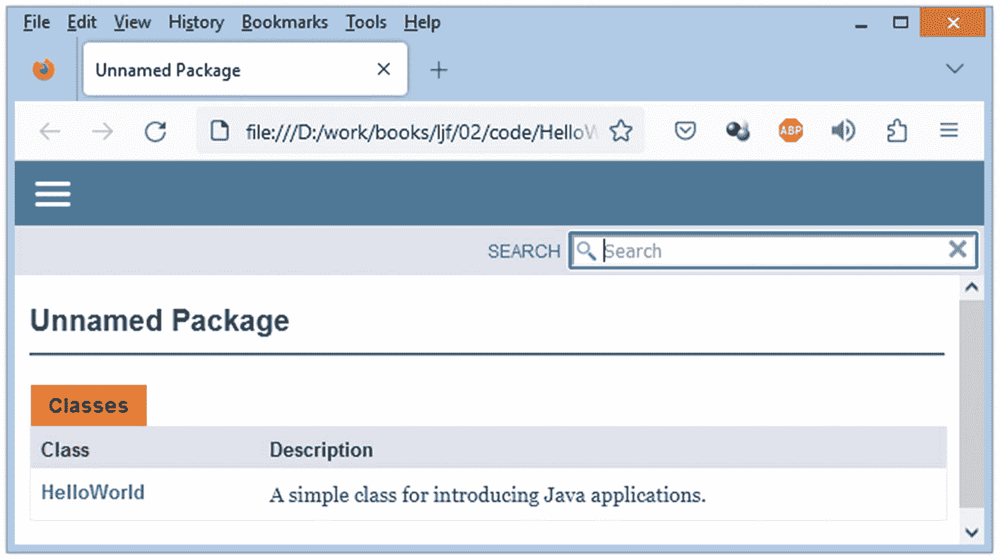
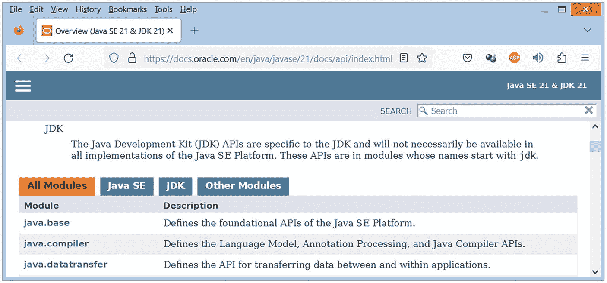
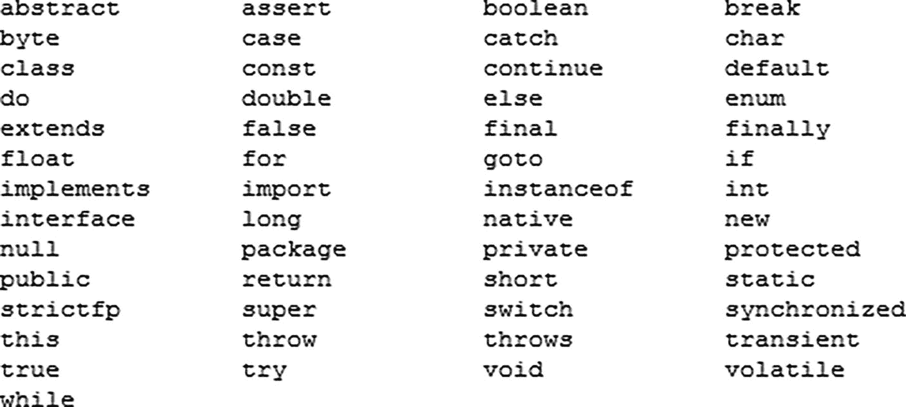

# 2. 注释、标识符、类型、变量和字面量

在学习一门新的编程语言时，最好从最基本的语言特性开始。这些特性包括注释、标识符（保留字是其子集）、类型、变量和字面量。本章将在 Java 的上下文中向你介绍这些特性。

## 注释

记录你的源代码非常重要，这样你和将来可能维护它的任何人都能理解代码的用途。随着年龄增长，我们的大脑容易遗忘，我们可能不理解当初为什么以某种方式编写代码。源代码应该在编写时就被记录。每当代码发生更改时，可能也需要修改这些文档，以便它能准确地解释新代码。

Java 提供了用于记录源代码的*注释*。当你编译源代码时，编译器会忽略注释——不会生成字节码。支持单行注释、多行注释和 Javadoc（文档）注释。

### 单行注释

*单行注释*出现在源代码的一行中。它以 `//` 字符序列开头，并持续到该行结束。编译器会忽略从 `//` 字符开始到该行末尾的所有内容。以下示例演示了一个单行注释：

```
double degrees = (5.0 / 9.0) * (x - 32.0); // 将 x 华氏度转换为摄氏度。
```

单行注释适用于指定简短但有意义的信息。它们不应用于插入无用的信息，例如 `// 这是一个注释`。

### 多行注释

*多行注释*通常跨越源代码的多行，尽管它也可以出现在单行中。此注释以 `/*` 开头，以 `*/` 结尾。编译器会忽略两者之间的所有内容（包括 `/*` 和 `*/`）。以下示例演示了一个多行注释：

```
/* 将电子邮件地址的两个部分提取到一个双元素数组中。
email_parts[0] 存储 "xyz"，email_parts[1] 存储 "gmail.com"。 */
String[] email_parts = "xyz@gmail.com".split("@", 2); // 提取
```

你不能将一个多行注释嵌套在另一个多行注释内部。例如，当编译器遇到以下嵌套注释时，会生成一个错误：

```
/*
/*
嵌套的多行注释是非法的。
*/
*/
```

警告

当编译器遇到嵌套的多行注释时，会报告一个错误。


### Javadoc 注释

*Javadoc 注释*是多行注释的一种变体。它以 `/**`（而不是 `/*`）开头，并以 `*/` 结尾（与多行注释一样）。从 `/**` 到 `*/` 之间的所有字符都会被编译器忽略。以下示例展示了一个 Javadoc 注释：

```
/**
*  应用程序入口点
*
*  @param args 传递给此方法的命令行参数数组
*/
public static void main(String[] args)
{
// TODO 代码应用逻辑在此处
}
```

此示例中的 Javadoc 注释描述了应用程序的 `main()` 方法。夹在 `/**` 和 `*/` 之间的是对该方法的描述以及 `@param` *Javadoc 标签*（一个以 `@` 为前缀、用于 `javadoc` 工具的指令）。

以下是一些常用 Javadoc 标签（包括 `@param`）的列表：

*   `@author` 标识源代码的作者。

*   `@deprecated` 标识不应再使用的源代码实体（例如方法）。

*   `@param` 标识方法的某个参数。

*   `@see` 提供“另请参阅”引用。

*   `@since` 标识该实体首次出现的软件版本。

*   `@return` 标识方法返回值的类型。

*   `@throws` 记录方法抛出的异常。

清单 2-1 展示了清单 1-1 中 `HelloWorld` 应用程序的更新源代码。此源代码包含一对 Javadoc 注释，用于记录 `HelloWorld` 类及其 `main()` 入口点方法。

```
/**
一个用于介绍 Java 应用程序的简单类。
@author Jeff Friesen
*/
public class HelloWorld
{
/**
应用程序入口点
@param args 传递给此方法的命令行参数数组
*/
public static void main(String[] args)
{
System.out.println("hello, world");
}
}
清单 2-1
HelloWorld.java
```

除了 Javadoc 注释之外，清单 2-1 与清单 1-1 的不同之处在于，它在 `HelloWorld` 类前添加了 `public` 关键字，这使得 `HelloWorld` 在其包外部也可访问。（我将在第 6 章讨论 `public`，在第 10 章讨论包。）

我使用 `javadoc` 工具为 `HelloWorld.java` 生成基于 HTML 的文档。此工具要求 `HelloWorld` 类前带有 `public` 关键字。此外，还需要 `.java` 文件扩展名：

```
javadoc HelloWorld.java
```

作为响应，`javadoc` 生成以下输出：

```
Loading source file HelloWorld.java...
Constructing Javadoc information...
Building index for all the packages and classes...
Standard Doclet version 20.0.1+9-29
Building tree for all the packages and classes...
Generating .\HelloWorld.xhtml...
HelloWorld.java:7: warning: use of default constructor, which does not provide a comment
public class HelloWorld
^
Generating .\package-summary.xhtml...
Generating .\package-tree.xhtml...
Generating .\overview-tree.xhtml...
Building index for all classes...
Generating .\allclasses-index.xhtml...
Generating .\allpackages-index.xhtml...
Generating .\index-all.xhtml...
Generating .\search.xhtml...
Generating .\index.xhtml...
Generating .\help-doc.xhtml...
1 warning
```

警告信息指的是一个未添加注释的默认构造函数。构造函数用于在创建对象时对其进行初始化。我将在第 6 章讨论构造函数、对象以及对象的创建。

我创建了 `HelloWorld.java` 的第二个版本，其中包含一个带注释的构造函数。你可以在本书的代码归档中找到此文件。获取代码归档的说明在本书的引言中提供。

生成的文档包含一个索引文件（`index.xhtml`），该文件描述了文档的起始页。图 2-1 展示了 `HelloWorld.java` 的起始页。



一张截图突出显示了未命名包部分。

图 2-1

为 HelloWorld.java 生成的 javadoc 文档

`javadoc` 工具也用于生成 JDK 21 引用类型库的文档。此文档的起始页位于 [`http://docs.oracle.com/en/java/javase/21/docs/api/index.xhtml`](http://docs.oracle.com/en/java/javase/21/docs/api/index.xhtml)。图 2-2 向你展示了此起始页的一部分。



一张截图突出显示了 javadoc 生成文档的概览。

图 2-2

为 JDK 21 引用类型库生成的 javadoc 文档

## 标识符

变量、语句、类以及其他语言特性需要被命名，以便在代码的其他位置引用。Java 通过标识符支持此功能。

*标识符*是由字母（A`–`Z、a`–`z 或其他人类字母表中等效的大写/小写字母）、数字（0`–`9 或其他人类字母表中的等效数字）、连接标点字符（如下划线）以及货币符号（例如 $ 符号）组成的序列。它必须以字母、货币符号或连接标点字符开头。其长度不能超过它所在的行。

注意

根据 JDK 21 的“Java 语言规范”第 28 页（[`http://docs.oracle.com/javase/specs/jls/se21/jls21.pdf`](http://docs.oracle.com/javase/specs/jls/se21/jls21.pdf)），“美元符号 [`$`] 应仅用于机械生成的源代码中，或者极少数情况下用于访问遗留系统上的现有名称。”

有效标识符的示例包括 `i`、`grade_letter`、`counter10` 和 `degreesCelsius`。无效标识符的示例包括 `6Age`（以数字开头）和 `last#Name`（`#` 不是有效的标识符符号）。

注意

Java 是一种区分大小写的语言。这意味着大小写不同的标识符被视为不同的标识符。例如，`age` 和 `Age` 是不同的标识符。

几乎任何有效的标识符都可以用于命名语言特性。然而，有些标识符被 Java 保留用于特殊用途。这些保留的标识符被称为*保留字*。图 2-3 展示了 Java 的 53 个保留字。



一张截图包含了 53 个 Java 保留字。

图 2-3

Java 保留标识符

JDK 9 将单个下划线字符（`_`）添加到了 Java 的保留字列表中。使用单个下划线来命名任何内容都是错误的。但是，使用多个下划线是可以的（尽管你可能不应该这样做）。

注意

Java 的大多数保留字也被称为*关键字*。三个例外是 `false`、`null` 和 `true`。它们是*字面量*（逐字表达的值）的示例。

此外，`const` 和 `goto` 被 Java 保留但未被使用。


## 类型

计算机处理不同类型的数据：整数、字符、浮点值、布尔真/假值、字符串等等。Java 为每个数据类别关联一个类型。

一个*类型*标识一组值（及其在内存中的表示形式）以及一组操作，这些操作将这些值转换为该集合中的其他值。例如，浮点类型标识带有小数部分的数值以及面向浮点的数学运算，例如将两个浮点值相加，生成另一个代表它们和的浮点值。

注意

*Java 是一种强类型*语言。每个表达式、变量等都有一个编译器已知的类型。这种能力有助于编译器在编译时检测类型相关的错误，而不是让这些错误在运行时才显现。表达式将在第 3 章讨论。变量将在本章后面讨论。

Java 支持原始类型、用户定义类型和数组类型。我在这里讨论原始类型和用户定义类型。数组类型将在第 5 章讨论。

### 原始类型

*原始类型*（也称为*值类型*）是一种基本类型，用户定义类型（本章后面讨论）由此构建。它标识一组值（例如整数）以及对这些值执行的操作（例如加法）。这些操作内置于 Java 虚拟机（JVM）中。

更具体地说，原始类型由一个保留字组成，该保留字描述了该类型实例的内存组织方式。该保留字也隐含了可以对该类型执行的操作。例如，布尔原始类型由保留字 `boolean` 组成，并隐含了诸如逻辑非 (`!`) 之类的操作，该操作将真转换为假，将假转换为真。

Java 支持布尔、字符、字节整数、短整数、整数、长整数、浮点数和双精度浮点数这些原始类型。它们在表 2-1 中进行了描述。

表 2-1

Java 的原始类型

| 原始类型 | 保留字 | 大小 | 最小值 | 最大值 |
| --- | --- | --- | --- | --- |
| 布尔 | `boolean` | -- | -- | -- |
| 字符 | `char` | 16 位 | Unicode 0 | Unicode 2¹⁶ - 1 |
| 字节整数 | `byte` | 8 位 | -128 | +127 |
| 短整数 | `short` | 16 位 | -32768 | +32767 |
| 整数 | `int` | 32 位 | -2³¹ | +2³¹ - 1 |
| 长整数 | `long` | 64 位 | -2⁶³ | +2⁶³ - 1 |
| 浮点数 | `float` | 32 位 | IEEE 754 | IEEE 754 |
| 双精度浮点数 | `double` | 64 位 | IEEE 754 | IEEE 754 |

表 2-1 根据每个原始类型的保留字、大小、最小值和最大值进行了描述。-- 条目表示该条目所在列不适用于该行描述的原始类型。

大小列标识保存一个值所需的位数。除了布尔类型（其大小取决于 JVM）外，每种类型的实现都有特定的大小。

最小值和最大值列标识该类型表示的最小值和最大值。除了只有真和假值的布尔类型外，每种类型都有最小值和最大值。

字符类型的最小值和最大值指的是 *Unicode*，这是一个用于对世界上大多数书写系统表达的文本进行一致编码、表示和处理的标​​准（更多信息请参见 [`http://en.wikipedia.org/wiki/Unicode`](http://en.wikipedia.org/wiki/Unicode)）。

注意

字符类型是无符号的，其范围也表明了这一点（最小值为 0）。相比之下，字节整数、短整数、整数和长整数类型是有符号的。

四种整数类型的最小值和最大值显示，负值比正值多一个（0 通常不被视为正数）。这种不平衡与整数在*二进制补码*（[`http://en.wikipedia.org/wiki/Two's_complement`](http://en.wikipedia.org/wiki/Two%2527s_complement)）格式中的表示方式有关。相比之下，浮点类型的最小值和最大值由 IEEE 754（[`http://en.wikipedia.org/wiki/IEEE_754`](http://en.wikipedia.org/wiki/IEEE_754)）规范定义。

### 用户定义类型

*用户定义类型*是原始类型和用户定义类型的组合。例如，一个用于表示“人”概念的用户定义类型，可能会将一个基于字符串的用户定义名称与一个基于整数的原始年龄组合在一起。以下代码片段展示了如何将 `Man` 指定为用户定义类型：

```
class Man
{
// 用于表示一组 Man 值的结构实现
String name;
int age;
// 对这些值执行的操作的实现
int getName()
{
return name;
}
void setName(String name_)
{
return name = name_;
}
int getAge()
{
return age;
}
void setAge(int age_)
{
return age = age_;
}
}
```

保留字 `class` 将 `Man` 引入为用户定义类型。通常，用户定义类型的名称以大写字母开头。

类的主体根据实现 `Man` 值的结构以及对这些值执行的操作来描述 `Man` 的实现。

该结构由两个*字段*（存储类类型值的变量——有关字段的介绍，请参见第 6 章）组成。`Man` 将其值存储在 `name` 和 `age` 字段中：

*   `name` 存储一个人的姓名。此字段的类型是 `String`，它是一个特殊的用户定义类型，表示一个*字符串*（放在双引号 [`"`] 之间的字符序列）。JDK 21 的引用类型库包含预先创建的 `String` 类型。（我将在第 13 章讨论 `String`。）

*   `age` 存储一个人的年龄。此字段的类型是 `int`，它是一个表示 32 位整数的原始类型。

这些操作由四个*方法*（在类的上下文中执行的函数——有关方法的介绍，请参见第 6 章）组成。`Man` 提供了 get 和 set 操作：

*   get 通过检索其 `name` 和 `age` 字段的值来返回一个 `Man` 值。它为此提供了 `getName()` 和 `getAge()` 方法。

*   set 通过更改其 `name` 和 `age` 字段的值来改变一个 `Man` 值。它为此提供了 `setName()` 和 `setAge()` 方法。

用户定义类型也称为*引用类型*，因为一个类型为用户定义的变量存储的是对该类型值的一个*引用*（一个内存地址或其他位置标识符）。相比之下，原始类型的变量存储的是该类型的值本身，而不是对值的引用。


## 变量

数据项存储在*变量*中，变量通过其名称符号化地标识存储这些数据项的内存位置。对于基本类型，数据项直接存储在变量中。对于用户定义类型，数据项是存储在内存其他位置的对象，而对该对象的引用则存储在变量中。

变量在使用前必须先声明。声明至少包含一个类型名，后跟一个标识该变量的名称。以下是一些示例：

```
boolean first; // 判断是否首次进入循环。
int counter; // 统计文件被打开的次数。
char gradeLetter; // 标识学生在某门课程中的年终成绩等级。
double temperature; // 指定当前温度。
String direction; // 风正在往哪个方向吹？
```

第一个示例声明了一个名为 `first` 的布尔变量。第二个示例声明了一个名为 `counter` 的整型变量。第三个示例声明了一个名为 `gradeLetter` 的字符变量。第四个示例声明了一个名为 `temperature` 的双精度浮点变量。第五个示例声明了一个名为 `direction` 的 `String` 变量。

当一个变量被声明但未显式初始化（本章后面会演示）时，它会被隐式初始化为一个默认值。`Boolean` 变量被初始化为 false，四种整型变量被初始化为 0，字符变量被初始化为 Unicode 字符 0，浮点类型变量被初始化为 0.0，而 `String` 变量被初始化为 null。

声明 vs. 定义

当我在程序源代码中为一个新变量、方法或其他相关语言特性引入标识符及其相关语法时，我使用术语*声明*。（无论我是否初始化变量、指定非抽象方法等，我都使用声明。我将在第 [6 章介绍方法，并在第 8 章介绍抽象方法。] 一些程序员更喜欢使用术语*定义*而非声明，这导致了混淆。如果你想知道这有什么大不了的，请记住，术语的精确性可以最大限度地减少错误并澄清混淆——你将避免因看似琐碎的事情争论不休而带来的许多头痛问题。然而，如果你花时间在试图捍卫自己立场时变得激动和愤怒，那么这些事情就不能算是琐碎的。）

根据由 Brian Kernighan 和已故的 Dennis Ritchie（C 语言的创造者）编写的 C 语言权威参考书 *The C Programming Language* ([`http://en.wikipedia.org/wiki/The_C_Programming_Language`](http://en.wikipedia.org/wiki/The_C_Programming_Language))，两者是有区别的。1978 年版的第 76 页指出：“区分外部变量的声明和其定义非常重要。声明宣告了变量的属性（其类型、大小等）；而定义还会导致存储空间的分配。”

关于 Java，解决这个问题的最佳资源可能是 *The Java*^® *Language Specification* ([`http://docs.oracle.com/javase/specs/jls/se21/jls21.pdf`](http://docs.oracle.com/javase/specs/jls/se21/jls21.pdf))。第 6 章（涵盖名称）使用了术语*声明*。相比之下，StackOverflow 上关于“Java 中声明和定义的区别”主题 ([`http://stackoverflow.com/questions/11715485/what-is-the-difference-between-declaration-and-definition-in-java`](http://stackoverflow.com/questions/11715485/what-is-the-difference-between-declaration-and-definition-in-java)) 最受欢迎的答案指出，声明涉及变量、方法等的存在性，而定义则涉及“某事物如何被实现”——即它是什么。该答案接着指出，在 Java 中声明和定义之间几乎没有区别。此外，该答案还指出，“声明不仅包括标识符，还包括其定义。”

## 字面量

*字面量*是在源代码中逐字表达的值。Java 支持用于其基本类型、初始化引用类型变量以及一种称为 `String` 的特殊引用类型（在第 13 章讨论）的字面量。

注意

字面量也被称为*简单表达式*。我将在第 3 章从简单和复合变体的角度讨论表达式。

布尔字面量由关键字 `true` 或 `false` 组成。

字符字面量由单引号括起来的单个 Unicode 字符组成（例如，`'6'`）。

整数字面量由一串数字组成。整数字面量的类型是 `int`（一个 32 位值）。你可以通过在字面量后添加 `l` 或 `L`（后者更易读）后缀来将类型更改为 `long`。

整数字面量可以以十进制、十六进制、八进制和二进制格式指定：

*   十进制格式是默认格式，例如 `127`。

*   十六进制格式要求字面量以 `0x` 或 `0X` 为前缀，后跟十六进制数字（`a–f` 和/或 `A–F`），例如 `0x3FB2`。

*   八进制格式要求字面量以 `0` 为前缀，后跟八进制数字（`0–7`），例如 `0276`。

*   二进制格式要求字面量以 `0b` 或 `0B` 为前缀，后跟 0 和 1，例如 `0b11010110`。

从 JDK 7 开始，你可以通过在数字之间插入下划线来提高可读性。例如，`204_555_1212` 比 `2045551212` 更容易阅读。虽然你可以在数字之间插入多个连续的下划线（例如 `987___235`），但不能插入前导下划线（`_4222`）。如果你尝试这样做，编译器会报告错误。同样，当你指定尾随下划线时，例如 `99_`，编译器也会报告错误。

浮点字面量由整数部分、小数点、小数部分、指数（以字母 `E` 或 `e` 开头）和类型后缀（`D` 或 `d` 表示双精度浮点；`F` 或 `f` 表示浮点——浮点字面量默认为双精度浮点）组成。大部分部分是可选的，但你必须指定足够的信息以将浮点字面量与整数字面量区分开来。示例包括 `0.9`（双精度浮点）、`36F`（浮点）、`900D`（双精度浮点——`D` 将 32 位整数 `900` 更改为等效的双精度浮点值）和 `33.8E+22`（双精度浮点）。

`null` 字面量被赋值给引用变量，以指示该变量不引用任何对象。它表示没有有意义的值。

警告

当你尝试将 `null` 赋值给具有基本（值）类型（例如 `int`）的变量时，编译器会报告错误。

使用 `null` 时可能会遇到麻烦。例如，当用户定义的变量包含 null 引用而不是对象的引用，并且你尝试访问字段或*调用*方法时，你将遇到可怕的 `NullPointerException`。（我将在第 6 章讨论对象、字段和方法。此外，我将在第 11 章讨论异常并提及 `NullPointerException`。）

注意

你可以通过阅读 Yoshitaka Shiotsu 的优秀文章“Java 中的 Null：理解基础” ([`www.upwork.com/resources/what-is-null-in-java`](http://www.upwork.com/resources/what-is-null-in-java)) 来了解更多关于*空性*（being null）和 `NullPointerException` 的概念。


最后，字符串字面量由一对双引号包围的 Unicode 字符序列组成，例如 `"What is the weather like today?"`。它还可能包含*转义序列*，这是一种特殊语法，用于表示某些可打印和不可打印字符，这些字符通常无法直接出现在字面量中。例如，`"The title of the book is \"Mastering Java\" and is written by John Doe."` 这个示例使用了 `\"` 转义序列，用双引号将 `Mastering Java` 括起来。

支持以下转义序列：`\\`（反斜杠）、`\"`（双引号）、`\'`（单引号）、`\b`（退格）、`\f`（换页）、`\n`（换行）、`\r`（回车）和 `\t`（制表符）。

字符串字面量还可能包含 *Unicode 转义序列*，这是一种表示 Unicode 字符的特殊语法。Unicode 转义序列以 `\u` 开头，后跟四个十六进制数字（`0–9`、`A–F` 或 `a–f`），中间没有空格。例如，`\u0043` 表示大写字母 C，`\u20ac` 表示欧盟货币符号。

以下示例使用字面量初始化前面介绍的变量：

```
boolean first = true;
int counter = 10;
char gradeLetter = 'A';
double temperature = 37.9;
String direction = "East";
```

## 综合运用

清单 2-2 展示了一个 `VarInit` 应用程序的源代码，该程序通过前面的示例演示了标识符、类型、变量和字面量。你可以修改 `VarInit` 的源代码来引入自己的示例，并进一步了解这些基本语言特性。

```
class VarInit
{
public static void main(String[] args)
{
boolean first = true;
int counter = 10;
char gradeLetter = 'A';
double temperature = 37.9;
String direction = "East";
System.out.println(first);
System.out.println(counter);
System.out.println(gradeLetter);
System.out.println(temperature);
System.out.println(direction);
}
}
清单 2-2
VarInit.java
```

按如下方式编译清单 2-2：

```
javac VarInit.java
```

按如下方式运行应用程序：

```
java VarInit
```

你应该会看到以下输出：

```
true

A
37.9
East
```

VAR

JDK 10 引入了 `var`，这是声明和初始化变量的快捷方式。为了减少按键次数，你不再需要输入变量的类型名称，因为编译器会在初始化期间根据字面量（或其他表达式）的类型推断变量的类型。例如，在 `var ch = 'C';` 中，编译器推断变量 `ch` 的类型为 `char`，因为 `'C'` 的类型是 `char`。如果没有 `var`，你需要指定 `char ch = 'C';`。虽然你只节省了一次按键，看起来不多，但在更长的语法上下文中，你可以节省更多按键，例如 `var amount = 10.0;` 代替 `double amount = 10.0;`。

使用 `var` 时请记住两个重要点：

*   你必须在初始化上下文中使用 `var`，而不能仅用于声明。换句话说，你必须始终为变量赋值一个字面量或其他表达式。如果你单独指定 `var` 和变量名，例如 `var ch;`，编译器将报告错误，因为它无法推断 `ch` 的类型。

*   `var` 标识符看起来像保留字（如果你愿意，也可以称为关键字），但事实并非如此。你不能使用保留字来命名变量。但是，以下声明是合法的：`var var = 10.0;`。在此示例中，`var` 是一个双精度浮点变量，初始化为 10.0。

我建议不要使用 `var` 来命名变量（例如 `var var`），因为结果可能会让阅读你源代码的人感到困惑。此外，`var` 将来可能会成为保留字。

### 下一步是什么？

既然你已经掌握了注释、标识符、类型、变量和字面量，接下来可以探索运算符和表达式。这些语言特性让你能够操作数据项以生成新的数据项，这在各种程序中都会用到，从企业工资单应用程序到机器学习演示。

