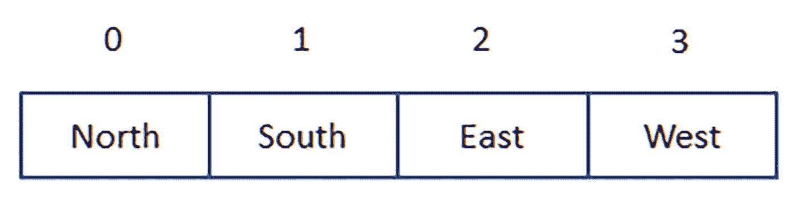
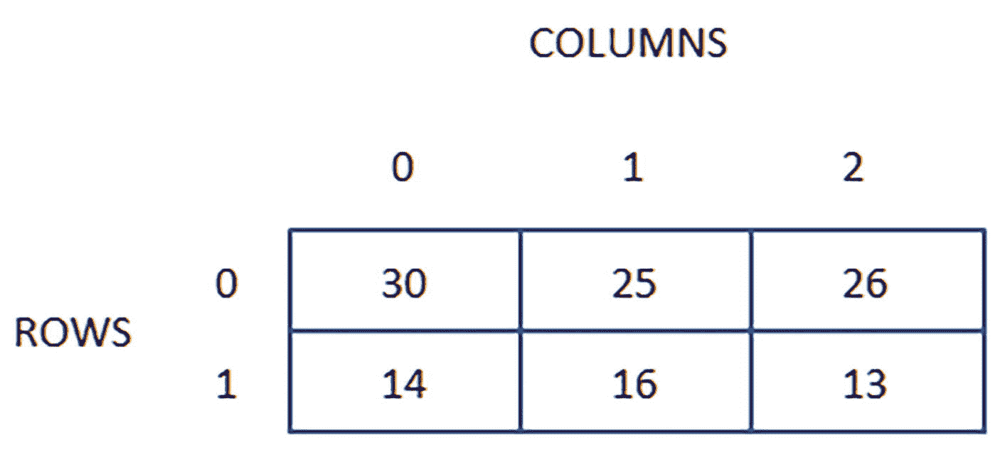
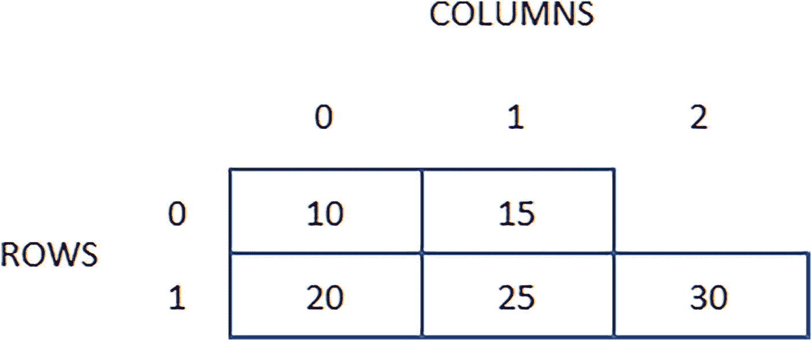
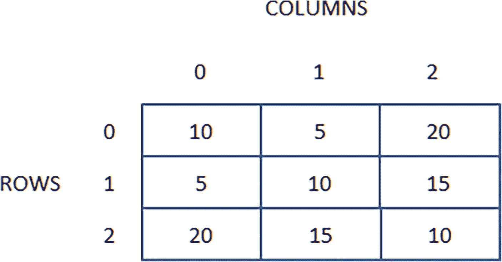
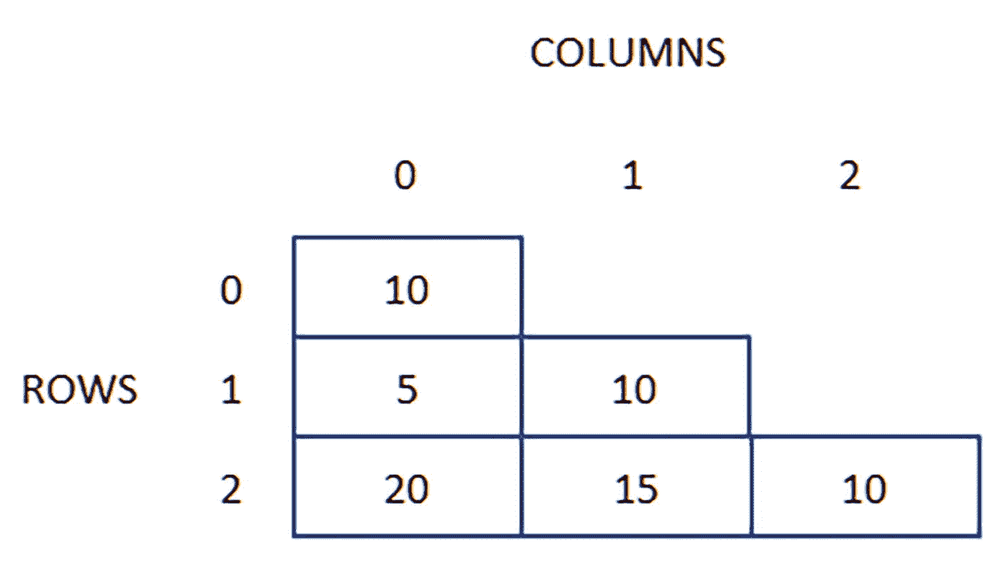
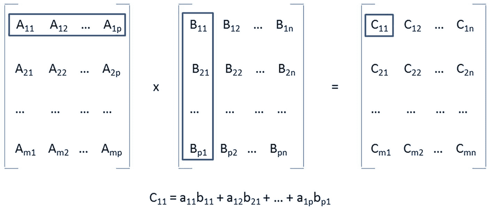

# 5. 数组

Java 支持数组，这是最古老且使用最广泛的数据结构之一（“一种通常为了高效访问数据而选择的数据组织、管理和存储格式”——更多信息请参见 [`http://en.wikipedia.org/wiki/Data_structure`](http://en.wikipedia.org/wiki/Data_structure)）。本章将介绍 Java 在一维数组和二维数组方面对数组的支持，并通过搜索和排序演示一维数组，通过矩阵乘法演示二维数组。

## 数组简介

*数组*是一种*数据结构*，由一系列具有相同内存大小的*元素*（存储在数组中的值）组成，其中每个元素至少与一个*索引*（唯一标识一个元素的非负整数）相关联。与元素关联的索引数量称为数组的*维度*。

在 Java 中，数组具有固定大小。你不能扩展或收缩数组。相反，你需要创建一个所需大小的新数组，将当前数组中的元素复制到新数组，然后销毁当前数组。

## 一维数组

*一维数组*（1D 数组——也称为*向量*）是一种将每个元素与一个索引关联的数组。它用于存储值的列表。数组通过数组变量存储，其语法如下：

```
type '[' ']' identifier
```

或

```
type identifier '[' ']'
```

方括号可以出现在*类型*名称之后（推荐方式），或出现在命名变量的*标识符*之后（这种方式是为了让 C 和 C++ 程序员平滑过渡到 Java 而引入的）。它们表示*标识符*引用了一个一维数组，其元素具有指定的*类型*。该数组的类型是 *type*`[]`。

### 创建一维数组

创建一维数组有三种方法：仅使用初始化器、仅使用关键字 `new`，以及将关键字 `new` 与初始化器结合使用。

#### 仅使用初始化器

仅使用初始化器的方法遵循以下语法：

```
'{' [expr (',' expr)*]  '}'
```

该语法表明，一维数组是一个可选的、由逗号分隔的表达式列表，出现在左大括号和右大括号字符之间。此外，所有表达式的类型必须兼容。例如，一个表达式不能是字符串，而另一个表达式是整数。

注意

上述语法使用了特殊符号来提供紧凑的表示形式。此外，程序员必须提供的值放在单引号（`'`）或双引号（`"`）之间。`[` 和 `]` 之间的所有内容都是可选的。`(` 和 `)` 之间的所有内容被视为一个整体。`*` 表示重复 `(` 和 `)` 之间的内容零次或多次。`+` 表示重复 `(` 和 `)` 之间的内容一次或多次。我在前面的章节中已经介绍过这种语法的一部分，并将在后续章节中继续使用。

以下示例演示了使用初始化器创建一维数组的方法：

```
String[] directions = {"North", "South", "East", "West"};
```

该示例创建了一个包含四个字符串的一维数组，并将该一维数组的引用赋值给 `directions`。图 5-1 展示了该数组的概念视图。



四个矩形块分别表示：North 0。South 1。East 2。West 3。

图 5-1

赋值给 directions 的数组的概念视图

`North` 位于索引 0，`South` 位于索引 1，`East` 位于索引 2，`West` 位于索引 3。

#### 仅使用关键字 new

仅使用关键字 `new` 的方法遵循以下语法：

```
'new' type '[' int_expr ']'
```

关键字 `new` 为数组分配内存。元素的数量由 *int_expr*（一个通常大于 0 的非负整数）指定，每个元素的大小由 *type* 隐含。所有元素都会被清零（并解释为 `0`、`0L`、`0.0F`、`0.0`、`false`、`null` 或 `'\u0000'`）。

预分配零大小的数组

有时，*int_expr* 会指定为 `0`。当程序员编写一个方法来预分配数组，并且该方法需要知道数组的元素类型时，会指定零——该方法不关心数组的大小。例如，你可以指定以下内容：

```
ArrayList list = new ArrayList(100);
int[] copy = list.toArray(new int[0]);
```

此示例首先创建一个数组列表，并将其引用赋值给类型为 `ArrayList` 的列表变量。然后，它调用 `ArrayList` 的 `toArray()` 方法（关于方法的讨论请参见第 6 章）将数组列表转换为数组。表达式 `new int[0]` 被传递给 `toArray()`，以便该方法预分配一个可以容纳列表中所有元素的 `int[]` 数组。（我们假设每个元素都是 `int` 类型。）此外，`toArray()` 返回该数组。但是，如果你指定了以下内容：

```
double[] copy = list.toArray(new double[0]);
```

`toArray()` 方法将返回一个类型为 `double[]` 的数组。`toArray()` 能够改变其返回类型是*泛型*的一个特性，这是对 Java 类型系统的增强，允许类型或方法操作各种类型的对象，同时提供编译时类型安全。（我在本书中不讨论泛型，因为我认为它不是基础特性。）

前面的示例（不包括元素值）可以表示如下：

```
String[] directions = new String[4];
```

值将在稍后填充。

#### 将关键字 new 与初始化器结合使用

创建数组的最后一种方法是将关键字 `new` 与初始化器结合使用。这种方法具有以下语法：

```
'new' type '[' ']' '{' [expr (',' expr)*] '}'
```

该语法融合了前两种语法。由于元素的数量可以从逗号分隔的表达式列表中确定，因此不需要（也不允许）在方括号之间提供 *int_expr*。

以下示例演示了将关键字 `new` 与初始化器结合使用创建一维数组的方法：

```
String[] directions = new String[] {"North", "South", "East", "West"};
```

仅使用初始化器方法的语法是第三种方法的*语法糖*（使语言更易于使用的语法）。你可以使用数组索引运算符来索引此数组并访问元素。

### 访问一维数组元素

一维数组变量与一个 `.length` 属性相关联，该属性将关联的一维数组的长度作为正 `int` 值返回；例如，`directions.length` 返回 4。这个值在访问一维数组的元素时很重要。

给定一个一维数组变量，你可以通过指定符合以下语法的表达式来访问任何元素：

```
array_var '[' index ']'
```

这里，*index* 是一个正 `int` 值，范围从零（Java 数组是基于零的）到 `.length` 属性返回值减一。

考虑之前的 `directions` 数组。以下示例引用了第一个元素：

```
directions[0]
```

你可以按如下方式打印此元素：

```
System.out.println(directions[0]);
```

你可以使用 `for` 循环打印所有元素，如下所示：

```
for (int i = 0; i < directions.length; i++)
System.out.println(directions[i]);
```

你可以按如下方式修改第三个元素：

```
directions[2] = "EAST"; // 因为 Java 数组是基于 0 的，所以 directions[2]
// 访问的是第三个元素。
```

如果你指定了负索引或大于等于数组长度的索引，Java 将创建并抛出一个 `ArrayIndexOutOfBoundsException` 对象。当我在第 11 章讨论异常时，我会对此主题进行更多说明。


## 搜索与排序

程序员经常编写代码来在一维数组中搜索特定元素，并将一维数组的元素按值升序或降序排序。两种常用的搜索算法是*线性搜索*和*二分搜索*。*冒泡排序*是一种简单的排序算法，但对于大型数组效率不高。

### 线性搜索

*线性搜索*通过从最低索引到最高索引比较元素，在一维数组的 *n* 个元素中搜索特定元素，直到找到该元素或没有更多元素可供比较。

我创建了一个演示线性搜索的 `LSearch` 应用程序。清单 5-1 展示了该应用程序的源代码。

```
class LSearch
{
public static void main(String[] args)
{
int[] grades = { 86, 92, 68, 75, 79, 81 };
int gradeToSearch = 68;
int i;
for (i = 0; i < grades.length; i++)
if (grades[i] == gradeToSearch)
{
System.out.println("Found " + gradeToSearch + " at position " + i);
break;
}
if (i == grades.length)
System.out.println("Could not find " + gradeToSearch);
gradeToSearch = 74;
for (i = 0; i < grades.length; i++)
if (grades[i] == gradeToSearch)
{
System.out.println("Found " + gradeToSearch + " at position " + i);
break;
}
if (i == grades.length)
System.out.println("Could not find " + gradeToSearch);
}
}
清单 5-1
LSearch.java
```

`LSearch` 首先在 `grades` 数组中搜索元素 `68`。它找到了该元素并输出成功消息。然后它在 `grades` 中搜索元素 `74`。由于该元素不存在，`LSearch` 输出失败消息。

假设您已将清单 5-1 复制到名为 `LSearch.java` 的文件中，请按如下方式编译清单 5-1：

```
javac LSearch.java
```

如果编译成功，您应该会在当前目录中看到一个 `LSearch.class` 文件。按如下方式运行此应用程序：

```
java LSearch
```

您应该会看到以下输出：

```
Found 68 at position 2
Could not find 74
```

### 二分搜索

线性搜索是一种易于实现的算法。然而，对于非常长的数组，其完成任务的速度相当慢。在最坏的情况下，当所需元素位于最后一个数组槽位时，它可能需要检查所有元素。平均而言，它需要搜索大约一半的数组。幸运的是，存在一种更快的搜索一维数组的算法。

*二分搜索*通过遵循以下步骤，在一维数组的 *n* 个元素中搜索特定元素：

1.  将低位和高位索引变量分别设置为数组第一个和最后一个元素的索引。

2.  当低位索引大于高位索引时终止。表示搜索的元素不在数组中。

3.  通过将低位和高位索引相加并除以 2 来计算中间索引。

4.  将搜索的元素与中间索引处的数据项进行比较。如果相同则终止。表示已找到搜索的元素。

5.  如果搜索的元素大于中间索引处的元素，则将低位索引设置为中间索引加一，并跳转到步骤 2 执行。二分搜索在数组的上半部分重复搜索。

6.  搜索的元素必定小于中间索引处的元素，因此将高位索引设置为中间索引减一，并跳转到步骤 2 执行。二分搜索在数组的下半部分重复搜索。

虽然不如线性搜索直观易懂，但二分搜索要快得多。例如，面对一个包含 4294967296 个元素的一维数组时，线性搜索平均需要执行 2147483648 次比较。相比之下，二分搜索最多执行 32 次比较。

我创建了一个演示二分搜索的 `BSearch` 应用程序。清单 5-2 展示了该应用程序的源代码。

```
class BSearch
{
public static void main(String[] args)
{
int[] nums = { 4, 5, 8, 11, 19, 33, 42, 51, 67, 69, 83, 84, 86, 91, 93, 98 };
int high = nums.length - 1, low = 0, mid;
int srchint = 83;
while (low  nums[mid])
low = mid + 1;
else
if (srchint  high)
System.out.println("Could not find " + srchint);
high = nums.length - 1;
low = 0;
srchint = 27;
while (low  nums[mid])
low = mid + 1;
else
if (srchint < nums[mid])
high = mid - 1;
else
{
System.out.println("Found " + srchint);
break;
}
}
System.out.println("Could not find " + srchint);
}
}
清单 5-2
BSearch.java
```

`BSearch` 首先在 `nums` 数组中搜索元素 `83`。它找到了该元素并输出成功消息。然后它在 `grades` 中搜索元素 `27`。由于该元素不存在，`BSearch` 输出失败消息。

假设您已将清单 5-2 复制到名为 `BSearch.java` 的文件中，请按如下方式编译清单 5-2：

```
javac BSearch.java
```

如果编译成功，您应该会在当前目录中看到一个 `BSearch.class` 文件。按如下方式运行此应用程序：

```
java BSearch
```

您应该会看到以下输出：

```
Found 83
Could not find 27
```

### 冒泡排序

与线性搜索不同，二分搜索要求一维数组是已排序的。一种简单但效率不高的排序算法是冒泡排序。

*冒泡排序*将一维数组的 *n* 个元素按升序或降序排序。一个外层循环对数组进行 *n* - 1 次遍历。每次遍历调用一个内层循环来交换元素，使得下一个最小（升序排序）或最大（降序排序）的元素“冒泡”到数组的开头。

内层循环的每次迭代将当前遍历编号的元素与每个后续元素进行比较。如果后续元素小于（升序排序）或大于（降序排序）当前遍历编号的元素，则将该后续元素与当前遍历编号的元素交换。

我创建了一个 `BSort` 应用程序来演示冒泡排序。清单 5-3 展示了该应用程序的源代码。

```
class BSort
{
public static void main(String[] args)
{
int[] grades = { 86, 92, 68, 75, 79, 81 };
for (int pass = 0; pass  pass; i--)
if (grades[i] < grades[pass])
{
// 交换 grades[i] 与 grades[pass]。
int temp = grades[i];
grades[i] = grades[pass];
grades[pass] = temp;
}
for (int i = 0; i < grades.length; i++)
System.out.println(grades[i]);
}
}
清单 5-3
BSort.java
```

`BSort` 将一个成绩数组按升序排序。它对 `grades` 数组进行 `grades.length - 1` 次遍历。每次遍历交换元素，直到下一个最小的元素被放置到正确的位置。

假设您已将清单 5-3 复制到名为 `BSort.java` 的文件中，请按如下方式编译清单 5-3：

```
javac BSort.java
```

如果编译成功，您应该会在当前目录中看到一个 `BSort.java` 文件。按如下方式运行此应用程序：

```
java BSort
```

您应该会看到以下输出：

```

```

## 二维数组

*二维数组*（2D 数组——也称为*表格*或*矩阵*）是一种将每个元素与两个索引关联的数组。它用于存储值的表格。该数组通过一个数组变量存储，其语法如下所示：

```
type '[' ']' '[' ']' identifier
```

或

```
type identifier '[' ']' '[' ']'
```

这两对方括号可以出现在*类型*名称之后，或命名变量的*标识符*之后。它们表示*标识符*引用了一个元素具有指定*类型*的二维数组。该数组的类型是 *type*`[][]`。

### 创建二维数组

创建二维数组有三种方法：仅使用初始化器、仅使用关键字 `new`，以及将关键字 `new` 与初始化器结合使用。


#### 仅使用初始化器

仅使用初始化器的方法遵循以下语法：

```
'{' [rowInitializer (',' rowInitializer)*] '}'
```

其中 *rowInitializer* 具有以下语法：

```
'{' [expr (',' expr)*] '}'
```

该语法表明，二维数组是一个可选的、以逗号分隔的行初始化器列表，位于左花括号和右花括号之间。此外，每个行初始化器是一个可选的、以逗号分隔的表达式列表，位于左花括号和右花括号之间。与一维数组一样，所有表达式必须求值为兼容类型。

以下示例演示了使用初始化器创建二维数组的方法：

```
int[][] tempsForNextThreeDays = { {30, 25, 26}, {14, 16, 13} };
```

该示例创建了一个二维数组，用于存储未来三天的高温（第 0 行）和低温（第 1 行），并将该二维数组的引用赋值给 `tempsForNextThreeDays`。图 5-2 展示了该数组的概念视图。



一个两行三列的表格包含以下元素：30、25、26、14、16、13。

图 5-2

赋值给 `tempsForNextThreeDays` 的数组的概念视图

值 `30` 位于第 0 行第 0 列，`25` 位于第 0 行第 1 列，`26` 位于第 0 行第 2 列。值 `14` 位于第 1 行第 0 列，`16` 位于第 1 行第 1 列，`13` 位于第 1 行第 2 列。

#### 仅使用关键字 new

仅使用关键字 `new` 的方法遵循以下语法：

```
'new' type '[' int_expr1 ']' '[' int_expr2 ']'
```

关键字 `new` 为数组分配内存。行元素的数量由 *int_expr1*（一个通常大于 0 的非负整数）指定，列元素的数量由 *int_expr2* 指定，每个元素的大小由 *type* 隐含。所有元素共享相同的类型，并被初始化为零值（解释为 `0`、`0L`、`0.0F`、`0.0`、`false`、`null` 或 `'\u0000'`）。

前面的示例（不包括元素值）可以表示为：

```
int[][] tempsForNextThreeDays = new int[3][3];
```

值将在稍后填充。

#### 将关键字 new 与初始化器结合使用

还有另一种创建数组的方法：将关键字 `new` 与初始化器结合使用。你需要遵循以下语法：

```
'new' type '[' ']' [' ']' '{' [rowInitializer (',' rowInitializer)*] '}'
```

其中 *rowInitializer* 具有以下语法：

```
'{' [expr (',' expr)*] '}'
```

该语法融合了前两种语法。由于元素的数量可以从逗号分隔的表达式列表中确定，因此不需要（也不允许）在方括号之间提供 *int_expr*。

以下示例演示了将关键字 `new` 与初始化器结合使用创建二维数组的方法：

```
int[][] tempsForNextThreeDays = new int[][] { {30, 25, 26}, {14, 16, 13} };
```

第一种语法是第三种方法的语法糖。

### 访问二维数组元素

Java 将二维数组实现为一维列数组组成的一维行数组。行数组中的每个元素都引用一个列数组。

二维数组变量关联了一个用于其行数组的 `.length` 属性，该属性返回此数组的长度（一个正 `int`）；例如，`tempsForNextThreeDays.length` 返回 2（有两行）。在访问一维数组的元素时，这个值很重要。

给定一个二维数组变量，你可以通过指定符合以下语法的表达式来访问行数组中的任何元素：

```
array_var '[' index ']'
```

这里，*index* 是一个正 `int`，其范围从零（Java 数组从零开始索引）到 `.length` 属性返回值减一。

考虑之前的 `tempsForNextThreeDays` 数组。以下示例引用了第一个行元素：

```
tempsForNextThreeDays[0]
```

你可以按如下方式打印此元素：

```
System.out.println(tempsForNextThreeDays[0]);
```

作为响应，你会看到一些看起来类似如下的奇怪内容：

```
[I@372f7a8d
```

这是一个特殊代码，表示 `tempsForNextThreeDays[0]` 引用了一个数组。

要打印第一个元素（位于第 0 行第 0 列），你可以执行以下代码：

```
System.out.println(tempsForNextThreeDays[0][0]); // 输出 30
```

你可以使用 `for` 循环按如下方式打印所有元素：

```
int[][] tempsForNextThreeDays = new int[][] { {30, 25, 26}, {14, 16, 13} };
for (int row = 0; row < tempsForNextThreeDays.length; row++)
{
for (int col = 0; col < tempsForNextThreeDays[row].length; col++)
System.out.print(tempsForNextThreeDays[row][col] + " ");
System.out.println();
}
```

注意

`System.out.print()` 输出文本，但不会在文本后输出换行符。因此，后续打印会输出到同一行。`System.out.println()` 在 `(` 和 `)` 之间不包含任何内容时，仅输出一个换行符，以便后续输出出现在下一行。这两种方法调用的组合，其行为类似于你在本书前面看到的带参数的 `System.out.println()` 方法调用。

你可以按如下方式修改第二行的第三个元素：

```
tempsForNextThreeDays[1][2] = 15;
```

对于行数组或某个列数组，如果你指定了负索引，或者索引大于等于数组的长度，Java 将创建并抛出一个 `ArrayIndexOutOfBoundsException` 对象。在讨论第 11 章的异常时，我会对此主题进行更多说明。


### 不规则数组

Java 支持创建每行具有不同列数的二维数组。这种结果被称为*不规则数组*。图 5-3 展示了一个示例。



一个具有 2 行 3 列的二维数组。单元格中给出了从 10 到 30 的元素。

图 5-3

一个每行具有不同列数的二维数组

在此示例中，第 0 行有两列，第 1 行有三列。

你可以通过三种方式创建此不规则数组：

```
int[][] table1 = { { 10, 15 }, { 20, 25, 30 } };
int[][] table2 = new int[2][];
int[][] table3 = new int[][] { { 10, 15 }, { 20, 25, 30 } };
```

第一个和第三个示例创建了一个二维数组，其中第一行包含两列，第二行包含三列。第二个示例创建了一个具有两行但列数未指定的数组。

创建 `table2` 的行数组后，必须使用对新列数组的引用来填充其元素。以下示例演示了为第一行分配两列，为第二行分配三列，并使用图 5-3 中所示的元素填充这些列：

```
table2[0] = new int[2];
table2[0][0] = 10;
table2[0][1] = 15;
table2[1] = new int[3];
table2[1][0] = 20;
table2[1][1] = 25;
table2[1][2] = 30;
```

然后，你可以遍历不规则数组（例如 `table1`）并打印其元素，如下所示：

```
for (int i = 0; i < table1.length; i++)
{
for (int j = 0; j < table1[i].length; j++)
System.out.print(table1[i][j] + " ");
System.out.println();
}
```

你将观察到与图 5-3 相同的输出。

这些代码片段摘自本书代码存档附带的 `RagArray` 应用程序。

为什么要使用不规则数组？当*方阵*（行数和列数相同的表格）沿对角线镜像其元素时，它们可以节省内存。请查看图 5-4。



一个具有 3 行 3 列的二维数组。单元格中给出了从 5 到 20 的元素。镜像行和列中的元素相同。

图 5-4

一个沿对角线镜像其元素的二维数组

每个对角线元素都是 10。请注意，第 0 行第 1 列（5）与第 1 行第 0 列（5）相同；第 0 行第 2 列（20）与第 2 行第 0 列（20）相同；第 1 行第 2 列（15）与第 2 行第 1 列（15）相同。由于元素相同，因此无需存储对角线右上方的元素。这引出了图 5-5。



一个具有 3 个对角线元素数量的数组。它们是 10、5、20、15。

图 5-5

一个将元素数量减少 3 个的不规则数组

在处理非常大的*对角矩阵*（主对角线以外的元素全为零——参见 [`http://en.wikipedia.org/wiki/Diagonal_matrix`](http://en.wikipedia.org/wiki/Diagonal_matrix)）时，不规则数组在线性代数中非常有用。因为对角矩阵是方阵，所以通过不存储主对角线上方的 0 元素，可以节省大量内存。

## 矩阵乘法

*线性代数*是数学的一个分支，涉及*线性*（直线）方程。它广泛使用*矩阵*（表格）。

将一个矩阵与另一个矩阵相乘是计算机图形学、经济学、运输行业和其他领域的常见任务。例如，*矩阵乘法*算法可用于确定在将几种不同产品运送到几个不同城市时，哪个城市能带来最大收入。

矩阵乘法的工作原理如下。设 A 表示一个具有 m 行 p 列的矩阵。设 B 表示一个具有 p 行 n 列的矩阵。将 A 乘以 B 得到矩阵 C，C 具有 m 行 n 列。C 中的每个 C[ij] 条目是通过将 A 的第 i 行中的所有条目与 B 的第 j 列中的相应条目相乘，然后将结果相加得到的。图 5-6 向你展示了这些操作。



一个矩阵乘法。A 中的每一行与 B 相乘并相加，最终得到 C 中的一个条目。

图 5-6

观察 A 中的每一行如何与 B 中的相应列相乘并相加，以生成 C 中的一个条目

注意

矩阵乘法要求左侧矩阵 (A) 的列数 (p) 等于右侧矩阵 (B) 的行数 (p)。否则，此算法将无法工作。

我创建了一个 `MatMult` 应用程序来演示矩阵乘法。清单 5-4 展示了此应用程序的源代码。

```
class MatMult
{
public static void main(String[] args)
{
// 分配两个要相乘的矩阵。
// m1 是一个 2 行 2 列的矩阵。
// m2 是一个 2 行 1 列的矩阵。
int[][] m1 = {{ 80, 60 }, { 59, 32 }};
int[][] m2 = {{ 4 }, { 19 }};
// 打印 m1。
for (int i = 0; i < m1.length; i++)
{
for (int j = 0; j < m1[0].length; j++)
System.out.print(m1[i][j] + " ");
System.out.println();
}
System.out.println();
// 打印 m2。
for (int i = 0; i < m2.length; i++)
{
for (int j = 0; j < m2[0].length; j++)
System.out.print(m2[i][j] + " ");
System.out.println();
}
System.out.println();
// 分配结果 2 行 1 列矩阵。
int[][] m3 = new int[m1.length][m2[0].length];
// 将 m1 乘以 m2 并将结果累加到 m3。
for (int i = 0; i < m1.length; i++)
for (int j = 0; j < m2[0].length; j++)
for (int k = 0; k < m1[0].length; k++) // 或 k < m2.length
m3[i][j] += m1[i][k] * m2[k][j];
// 打印 m3。
for (int i = 0; i < m3.length; i++)
{
for (int j = 0; j < m3[0].length; j++)
System.out.print(m3[i][j] + " ");
System.out.println();
}
}
}
清单 5-4
MatMult.java
```

`MatMult` 首先声明一对矩阵 `m1` 和 `m2`，并打印它们的内容。然后，它为结果矩阵 `m3` 分配空间，用于保存乘法结果。执行乘法，并打印 `m3` 的内容。

假设你已经将清单 5-4 复制到名为 `MatMult.java` 的文件中，请按如下方式编译清单 5-4：

```
javac MatMult.java
```

如果编译成功，你应该会在当前目录中看到一个 `MatMult.java` 文件。按如下方式运行此应用程序：

```
java MatMult
```

你应该会看到以下输出：

```
80 60
59 32

```

## 接下来是什么？

数组是从数组类型创建的对象，数组类型类似于类。我将在第 6 章中重点介绍类和对象。

