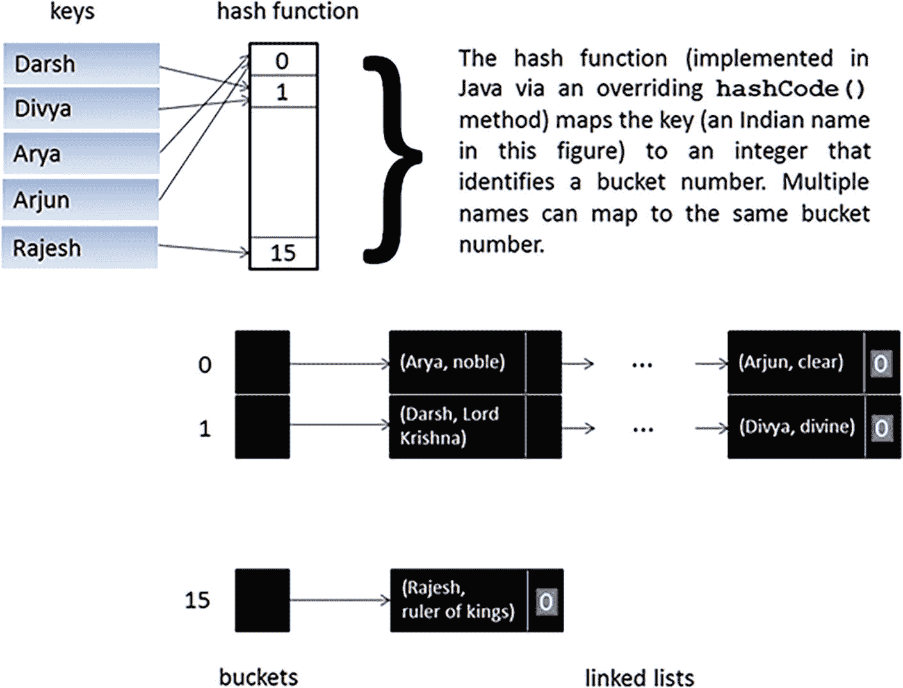

# 7. 通过继承和组合复用类

第 6 章向你介绍了类，它们*封装*（组合）了字段（存储状态）、方法（实现行为）和构造函数（实例化对象）。这种安排被称为*基于对象的编程*。

Java 提供了一种继承机制，用于从一个类派生出另一个类。其思想是以更专业化的方式复用这个其他类。这种安排被称为*面向对象编程*。

Java 还提供了一种组合机制，用于将一个类定义为其各个部分的总和。换句话说，类的字段由其他类实现。组合提供了复用其他类的另一种方式。

本章首先向你介绍继承。然后向你介绍组合。

## 继承

*继承*是一种用于类复用的编程技术，通过它你可以从一个类派生出另一个类。它允许你从更泛化的类创建更专门的类。

考虑第 6 章的 `Vehicle` 类。`Vehicle` 概括了成为一辆交通工具的含义。一辆交通工具具有品牌、型号和年份。此外，一辆交通工具可以被驾驶。

假设你想建模一辆卡车。你可以从 `Vehicle` 派生一个 `Truck` 类，该类将继承 `Vehicle` 的 `make`、`model` 和 `year` 字段，以及通过 `Vehicle` 的 `drive()` 方法进行驾驶的能力。然后，你可以添加任何必要的字段和方法来区分 `Truck` 和 `Vehicle`。

你可以用类似的方式建模自行车、摩托车、船或滑板。

在这些例子中，继承都用于在一对类之间形成*是一个关系*。`Truck` 是一个 `Vehicle`。对于 `Bicycle`、`Motorcycle`、`Boat` 和 `SkateBoard` 也是如此。

本节首先向你展示如何使用 Java 的类扩展功能来形成 is-a 关系。然后讨论方法覆盖，并介绍所有类的最终祖先。


### 类扩展

Java 的类扩展功能由 `extends` 关键字实现。当 `extends` 出现时，它指定了两个类之间的父子关系。这种关系通过以下语法描述：

```
'class' 子类 'extends' 父类
'{'
// 类体
'}'
```

根据此语法，*子*类扩展了*父*类，并继承了父类中可访问的成员。

注意

`extends` 后面不能指定多个类名，因为 Java 不支持基于类的多重继承。

例如，我将使用 `extends` 在 `Vehicle` 和 `Truck` 类之间建立关系，然后在 `Account` 和 `CheckingAccount` 类之间建立关系：

```
class Vehicle
{
// 成员声明
}
class Truck extends Vehicle
{
// 继承 Vehicle 中可访问的成员
// 提供自己的成员声明
}
class Account
{
// 成员声明
}
class CheckingAccount extends Account
{
// 继承 Account 中可访问的成员
// 提供自己的成员声明
}
```

这些示例体现了“是一个”关系。`Truck` 是一种专门的 `Vehicle`，`CheckingAccount` 是一种专门的 `Account`。`Vehicle` 和 `Account` 被称为*基类*、*父类*或*超类*。`Truck` 和 `CheckingAccount` 被称为*派生类*、*子类*或*子类*。

注意

出于安全或其他原因，你可能希望声明一个不应被扩展的类。Java 提供了 `final` 关键字来防止类被扩展。只需在类头前加上 `final`，例如 `final class Password`。有了这个声明，当有人试图扩展 `Password` 时，编译器将报告错误。

子类从其父类和其他祖先类继承可访问的字段和方法。它们从不继承构造函数。相反，子类声明自己的构造函数。此外，它们可以声明自己的字段和方法，以区别于其父类。请参考清单 7-1。

```
class Account
{
private String name;
private long amount;
Account(String name, long amount)
{
this.name = name;
setAmount(amount);
}
void deposit(long amount)
{
this.amount += amount;
}
String getName()
{
return name;
}
long getAmount()
{
return amount;
}
void setAmount(long amount)
{
this.amount = amount;
}
}
清单 7-1
Account.java
```

清单 7-1 描述了一个通用的银行账户类，包含一个名称和一个初始金额，两者都在构造函数中设置。此外，它允许用户进行存款。（你可以通过存入负金额来取款，但我们忽略这种可能性。）请注意，账户名称必须在创建账户时设置。

注意

我选择用 `long` 类型来表示货币值，其中值以美分计数存储。你可能更倾向于使用 `double` 或 `float` 来存储美元和美分值，但这可能导致不精确。第 12 章提供了一个更好的替代方案。

清单 7-2 展示了一个 `CheckingAccount` 子类，它扩展了其 `Account` 超类。

```
class CheckingAccount extends Account
{
CheckingAccount(long amount)
{
super("checking", amount);
}
void withdraw(long amount)
{
setAmount(getAmount() - amount);
}
}
清单 7-2
CheckingAccount.java
```

`CheckingAccount` 类继承自 `Account`，并提供了一个构造函数，通过将 `"checking"` 和 `amount` 传递给超类构造函数，来初始化其超类中的 `amount` 和 `name` 字段。

该构造函数使用保留字 `super` 将这些值传递给其对应的超类构造函数。它通过 `super("checking", amount);` 在调用上下文中使用 `super`。这类似于使用 `this()` 调用上下文将参数传递给同一类中的另一个构造函数。

警告

正如 `this()` 必须是调用同一类中另一个构造函数的构造函数中的第一个元素一样，`super()` 也必须是调用其超类中构造函数的构造函数中的第一个元素。如果你违反此规则，编译器将报告错误。当编译器在方法中检测到 `super()` 调用时，也会报告错误；`super()` 只能在构造函数中调用。

`CheckingAccount` 还提供了一个 `withdraw()` 方法，该方法通过要取出的金额减少账户余额。由于 `Account` 的 `amount` 字段是 `private` 的，`CheckingAccount` 无法直接访问它。相反，它调用从 `Account` 继承的 `setAmount()` 和 `getAmount()` 方法，从 `getAmount()` 的返回值中减去其 `amount` 参数值，并将差值传递给 `setAmount()`。

清单 7-3 展示了一个 `SavingsAccount` 子类，它扩展了其 `Account` 超类。

```
class SavingsAccount extends Account
{
SavingsAccount(long amount)
{
super("savings", amount);
}
}
清单 7-3
SavingsAccount.java
```

`SavingsAccount` 类很简单，因为它不需要声明额外的字段或方法。不过，它确实声明了一个构造函数，用于初始化其 `Account` 超类中的字段。初始化发生在通过 Java 的 `super` 关键字（后跟带括号的参数列表）调用 `Account` 的构造函数时。

警告

如果在子类构造函数中没有指定 `super()`，并且超类没有声明无参构造函数，那么编译器将报告错误。这是因为当 `super()` 不存在时，子类构造函数必须调用一个无参的超类构造函数。

我创建了一个 `AccountDemo` 应用程序类，演示了 `Account` 超类及其 `CheckingAccount` 和 `SavingsAccount` 子类。清单 7-4 展示了 `AccountDemo` 的源代码。

```
class AccountDemo
{
public static void main(String[] args)
{
SavingsAccount sa = new SavingsAccount(40000);
System.out.println("账户名称: " + sa.getName());
System.out.println("初始金额: " + sa.getAmount());
sa.deposit(3500);
System.out.println("存款后新金额: " + sa.getAmount());
CheckingAccount ca = new CheckingAccount(2000);
System.out.println("账户名称: " + ca.getName());
System.out.println("初始金额: " + ca.getAmount());
ca.deposit(6000);
System.out.println("存款后新金额: " + ca.getAmount());
ca.withdraw(1500);
System.out.println("取款后新金额: " + ca.getAmount());
}
}
清单 7-4
AccountDemo.java
```

假设 `Account.java`、`CheckingAccount.java`、`SavingsAccount.java` 和 `AccountDemo.java` 位于同一目录下，执行以下命令来编译所有四个源文件：

```
javac *.java
```

执行以下命令来运行应用程序：

```
java AccountDemo
```

你应该会看到以下输出：

```
账户名称: savings
初始金额: 40000
存款后新金额: 43500
账户名称: checking
初始金额: 2000
存款后新金额: 8000
取款后新金额: 6500
```


### 方法重写

子类可以*重写*（替换）继承的方法，从而调用子类自身版本的方法。重写方法必须指定与被重写方法相同的名称、参数列表和返回类型。我在清单 7-5 的 `Vehicle` 类中声明了一个 `info()` 方法来演示这一点。

```
class Vehicle
{
private String make;
private String model;
private int year;
Vehicle(String make, String model, int year)
{
this.make = make;
this.model = model;
this.year = year;
}
String getMake()
{
return make;
}
String getModel()
{
return model;
}
int getYear()
{
return year;
}
void info()
{
System.out.println("Make: " + make + ", Model: " + model + ", Year: " + year);
}
}
清单 7-5
Vehicle.java
```

接下来，我在清单 7-6 的 `Truck` 类中重写了 `info()` 方法。

```
class Truck extends Vehicle
{
private boolean isExtendedCab;
Truck(String make, String model, int year, boolean isExtendedCab)
{
super(make, model, year);
this.isExtendedCab = isExtendedCab;
}
boolean isExtendedCab()
{
return isExtendedCab;
}
void info()
{
super.info();
System.out.println("Is extended cab: " + isExtendedCab);
}
}
清单 7-6
Truck.java
```

`Truck` 的 `info()` 方法与 `Vehicle` 的 `info()` 方法具有相同的名称、返回类型和参数列表。同时请注意，`Truck` 的 `info()` 方法首先通过 `super` 后跟成员选择运算符（`.`）来调用 `Vehicle` 的 `info()` 方法。通常，先执行超类逻辑再执行子类逻辑是一个好习惯。

注意

要从重写方法的子类中调用超类方法，请在方法名前加上 `super` 和 `.` 运算符。否则，最终会递归调用子类的重写方法。在某些情况下，子类会通过声明同名字段来屏蔽非 `private` 的超类字段。你可以使用 `super` 和 `.` 来访问这些非 `private` 的超类字段。

清单 7-7 通过展示 `VehicleDemo` 应用程序类的源代码完成了这个示例。

```
class VehicleDemo
{
public static void main(String[] args)
{
Truck truck = new Truck("Ford", "F150", 2023, true);
System.out.println("Make = " + truck.getMake());
System.out.println("Model = " + truck.getModel());
System.out.println("Year = " + truck.getYear());
System.out.println("Is extended cab = " + truck.isExtendedCab());
truck.info();
}
}
清单 7-7
VehicleDemo.java
```

按如下方式编译清单 7-7 及其他源文件：

```
javac VehicleDemo.java
```

或

```
javac *.java
```

假设没有编译错误，按如下方式运行 `VehicleDemo` 应用程序：

```
java VehicleDemo
```

你应该会看到以下输出：

```
Make = Ford
Model = F150
Year = 2023
Is extended cab = true
Make: Ford, Model: F150, Year: 2023
Is extended cab: true
```

最后两行输出是调用 `truck.info()` 的结果。第一行 `Make: Ford, Model: F150, Year: 2023` 是 `Truck` 的 `info()` 方法通过 `super.info()` 调用其 `Vehicle` 超类的 `info()` 方法产生的。第二行执行 `System.out.println("Is extended cab: " + isExtendedCab);` 来输出该卡车是否为加长驾驶室。

注意

出于安全或其他原因，你可能需要声明一个不应被重写的方法。Java 提供了 `final` 关键字来防止方法被重写。只需在方法头前加上 `final`，例如 `final String getMake()`。有了这个声明，当有人试图重写 `getMake()` 时，编译器会报告错误。

#### 方法重载而非重写

假设你将清单 7-6 中的 `info()` 方法替换为以下允许同时输出许可证号的 `info()` 方法：

```
void info(String licenseNumber)
{
System.out.print("License number: " + licenseNumber);
super.info();
}
```

修改后的 `Truck` 类现在有两个 `info()` 方法：上面显式声明的方法和从 `Vehicle` 继承的方法。

`void info(String licenseNumber)` 方法并没有重写 `Vehicle` 的 `info()` 方法。相反，它*重载*了 `info()` 方法（提供了另一个同名但不同的方法）。调用 `truck.info()` 不会调用 `void info(String licenseNumber)`。

你可以通过在子类的方法头前加上 `@Override` *注解*（附加到方法上的额外信息）来在编译时检测到试图重载而非重写方法的行为。以下 `info()` 方法演示了这一点：

```
@Override
void info(String licenseNumber)
{
System.out.print("License number: " + licenseNumber);
super.info();
}
```

指定 `@Override` 告诉编译器该方法重写了另一个方法。如果有人试图重载该方法，编译器会报告错误。如果没有这个注解，编译器不会报告错误，因为方法重载是合法的。（本书不进一步讨论注解，因为我认为它们不是 Java 语言的基本特性。）

提示

养成在重写方法前加上 `@Override` 的习惯。这个习惯将帮助你更早地发现重载错误。

#### 方法重写与受保护方法

Java 提供了 `protected` 关键字用于方法重写的场景。你也可以对字段使用 `protected`。该关键字通常用于标识那些设计为被重写的方法，因为并非所有可访问的方法都应该被重写。

当你将方法或字段声明为 `protected` 时，该成员对于同一包中任何类内的所有代码都是可访问的。对于子类，无论它们位于哪个包中，该成员也是可访问的。（我将在第 10 章讨论包。）


### 所有类的终极祖先

Java 提供了一个庞大的类库和其他引用类型，让程序员能够处理文件和数据库、对象集合、并发等。这个库包含了 `Object` 类，它充当所有类的终极祖先。可以把 `Object` 想象成终极超类。

每个类都直接或间接地扩展了 `Object` 类。例如，`class Employee extends Object` 和 `class Vehicle` 都扩展了 `Object`。`Employee` 直接扩展了 `Object`，而 `Vehicle` 间接扩展了 `Object`。扩展 `Object` 是可选的（并且按照惯例通常不这样做），因为 Java 不支持多重继承。

注意

*多重继承*涉及扩展多个类。Java 中不这样做，因为可能会出现问题。例如，两个类可能提供具有不同实现的相同方法。如果一个类扩展了这两个类，它会继承哪个方法？如果允许，类上下文中的多重继承将被称为*多重实现继承*。

接口支持多重继承，这是另一种引用类型，我将在第 8 章中探讨。因为接口不支持方法体，所以当一个类实现两个或多个标识了相同方法的接口时，不会发生冲突。接口上下文中的多重继承被称为*多重接口继承*。

`Object` 声明了以下方法：

*   `protected Object clone()`

*   `boolean equals(Object obj)`

*   `protected void finalize()`

*   `final Class<?> getClass()`

*   `int hashCode()`

*   `final void notify()`

*   `final void notifyAll()`

*   `String toString()`

*   `final void wait()`

*   `final void wait(long timeout)`

*   `final void wait(long timeout, int nanos)`

这些方法执行所有类通用的任务。例如，`clone()` 允许你创建并返回调用此方法的对象的副本。

我将在以下各节中介绍这些方法中的大部分。我不会介绍 `notify()`、`notifyAll()` 和重载的 `wait()` 方法，因为它们在我的 *Java Threads and the Concurrency Utilities* 一书（[`www.amazon.ca/Java-Threads-Concurrency-Utilities-FRIESEN/dp/1484216997/`](http://www.amazon.ca/Java-Threads-Concurrency-Utilities-FRIESEN/dp/1484216997/)）中已有介绍。

#### 克隆对象

`clone()` 方法创建并返回调用它的对象的副本。克隆有两种形式：浅克隆和深克隆。在讨论这些形式之后，本节将探讨数组克隆。

##### 浅克隆

*浅克隆*（也称为*浅拷贝*）复制对象的字段，但不复制这些字段引用的对象。清单 7-8 展示了一个 `CloneDemo` 应用程序的源代码，向你展示了如何实现浅克隆。

```
class Date
{
private int year, month, day;
Date(int year, int month, int day)
{
this.year = year;
this.month = month;
this.day = day;
}
int getDay()
{
return day;
}
int getMonth()
{
return month;
}
int getYear()
{
return year;
}
}
class Employee implements Cloneable
{
private String name;
private int age;
private Date hireDate;
Employee(String name, int age, Date hireDate)
{
this.name = name;
this.age = age;
this.hireDate = hireDate;
}
String getName()
{
return name;
}
int getAge()
{
return age;
}
Date getHireDate()
{
return hireDate;
}
@Override
public Object clone() throws CloneNotSupportedException
{
return super.clone();
}
}
class CloneDemo
{
public static void main(String[] args) throws CloneNotSupportedException
{
Employee john = new Employee("John Doe", 37, new Date(1999, 10, 8));
System.out.println("Name: " + john.getName() +
", Age: " + john.getAge() +
", Hire Date: " + john.getHireDate());
Employee john2 = (Employee) john.clone();
System.out.println("Name: " + john2.getName() +
", Age: " + john2.getAge() +
", Hire Date: " + john2.getHireDate());
}
}
清单 7-8
CloneDemo.java
```

清单 7-8 首先声明了一个简单的 `Date` 类，它用年、月、日整数字段来描述日期。构造函数更新这些字段，getter 方法返回它们的值。

清单 7-8 接下来声明了一个 `Employee` 类，其对象将被克隆。这个类必须实现空的 `Cloneable` 接口，以告知 `clone()` 方法对 `Employee` 对象进行逐字段复制是合法的。（我将在第 8 章介绍接口。）当未实现 `Cloneable` 时，`clone()` 会抛出 `CloneNotSupportedException`。（我将在第 11 章讨论异常。）

因为 `clone()` 被标记为 `protected`，所以必须在 `Employee` 中重写它。注意 `@Override` 注解的存在，我在本章前面简要提到过它。

重写 `clone()` 时必须指定 `public` 访问说明符。当你不指定访问说明符时（表示包私有访问），编译器会报告试图分配更弱的访问权限。

当你指定 `private` 时，编译器会报告 `clone()` 在 `Employee` 中具有私有访问权限，此外还试图分配更弱的访问权限。当你指定 `protected` 时，源代码可以编译，但在运行时抛出 `CloneNotSupportedException` 对象。

`Employee` 的 `clone()` 方法执行 `super.clone()` 来调用 `Object` 的 `clone()` 方法，该方法对实现 `Cloneable` 的类执行逐字段复制。在这种情况下，`Object` 的 `clone()` 方法复制调用 `Employee` 对象的 `name`、`age` 和 `hireDate` 字段。

`main()` 方法中的 `Employee john2 = (Employee) john.clone();` 语句演示了克隆操作。它将 `john.clone()` 的返回类型转换为 `Employee`，因为 `clone()` 的返回类型是 `Object`。

按如下方式编译清单 7-8：

```
javac CloneDemo.java
```

按如下方式运行生成的应用程序：

```
java CloneDemo
```

你应该会看到以下输出（`@` 符号后的十六进制数字可能不同）：

```
Name: John Doe, Age: 37, Hire Date: Date@28a418fc
Name: John Doe, Age: 37, Hire Date: Date@28a418fc
```

你可能期望看到以年、月、日形式显示的员工雇佣日期。相反，你看到的是 `Date` 对象的默认字符串表示。这种表示由 `Date` 类名、`@` 符号和一个十六进制值（代表哈希码，将在本章后面讨论）组成。这种默认字符串表示是直观地表示对象引用的一种方式。

你可以看到原始的 `Employee` 对象及其克隆引用同一个 `Date` 对象，因为每个对象的默认字符串表示是相同的。这是浅克隆的一个例子。

要成为真正的克隆，`Employee` 克隆应该引用一个记录雇佣日期的新 `Date` 对象。换句话说，`Employee` 对象应该被深克隆。


##### 深克隆

*深克隆*（也称为*深拷贝*）在执行浅克隆的基础上，还会递归地复制对象字段中引用的对象，以及这些对象字段中引用的对象，以此类推。清单 7-9 展示了 `CloneDemo` 应用程序第二个版本的源代码，演示了如何实现深克隆。

```
class Date implements Cloneable
{
private int year, month, day;
Date(int year, int month, int day)
{
this.year = year;
this.month = month;
this.day = day;
}
int getDay()
{
return day;
}
int getMonth()
{
return month;
}
int getYear()
{
return year;
}
@Override
public Object clone() throws CloneNotSupportedException
{
return super.clone();
}
}
class Employee implements Cloneable
{
private String name;
private int age;
private Date hireDate;
Employee(String name, int age, Date hireDate)
{
this.name = name;
this.age = age;
this.hireDate = hireDate;
}
String getName()
{
return name;
}
int getAge()
{
return age;
}
Date getHireDate()
{
return hireDate;
}
@Override
public Object clone() throws CloneNotSupportedException
{
Date hire_Date = (Date) hireDate.clone();
Employee emp = new Employee(name, age, hire_Date);
return emp;
}
}
class CloneDemo
{
public static void main(String[] args) throws CloneNotSupportedException
{
Employee john = new Employee("John Doe", 37, new Date(1999, 10, 8));
System.out.println("Name: " + john.getName() +
", Age: " + john.getAge() +
", Hire Date: " + john.getHireDate());
Employee john2 = (Employee) john.clone();
System.out.println("Name: " + john2.getName() +
", Age: " + john2.getAge() +
", Hire Date: " + john2.getHireDate());
}
}
清单 7-9
CloneDemo.java（版本 2）
```

清单 7-9 更新了 `Date` 类，使其能够浅克隆自身。它通过实现 `Cloneable` 接口并重写 `clone()` 方法来调用 `super.clone()`，进而调用 `Object` 的 `clone()` 方法执行实际的克隆操作。这与之前清单中 `Employee` 类浅克隆自身的方式相同。

然而，`Employee` 重写的 `clone()` 方法已被修改。它首先克隆 `Employee` 的 `hireDate` 字段，返回一个新的 `Date` 对象，其引用被赋值给 `hire_Date`。作为深拷贝的一部分，会创建一个新的 `Employee` 对象，并用 `name`、`age` 和 `hire_Date` 的值进行填充。最后返回该 `Employee` 对象的引用。

你可能想知道为什么没有克隆 `name` 字段。该字段的类型是 `String`，并且无法被克隆，因为 `String` 对象是*不可变的*（不可更改）。不可变性是实现一种称为*字符串驻留*（interning）的特性所必需的，这样 `String` 对象就可以通过相等运算符（`==` 和 `!=`）进行比较，从而极大地提升性能。关于这一点，我在此不再赘述，你可以在第 13 章中了解详情。

按如下方式编译清单 7-9：

```
javac CloneDemo.java
```

运行生成的应用程序：

```
java CloneDemo
```

你应该会看到类似如下的输出（`@` 符号后的十六进制数字可能与您看到的不同）：

```
Name: John Doe, Age: 37, Hire Date: Date@28a418fc
Name: John Doe, Age: 37, Hire Date: Date@eed1f14
```

##### 数组克隆

数组类型可以访问 `clone()` 方法，该方法允许你浅克隆一个数组。在数组上下文中使用时，你无需将 `clone()` 的返回值强制转换为数组类型。清单 7-10 演示了数组克隆。

```
class Date
{
private int year, month, day;
Date(int year, int month, int day)
{
this.year = year;
this.month = month;
this.day = day;
}
int getYear()
{
return year;
}
int getMonth()
{
return month;
}
int getDay()
{
return day;
}
}
class CloneDemo
{
public static void main(String[] args)
{
int[] populations = { 100000000, 50000000, 10000 };
for (int i = 0; i < populations.length; i++)
System.out.print(populations[i] + " ");
System.out.println();
int[] populations2 = populations.clone();
for (int i = 0; i < populations.length; i++)
System.out.print(populations[i] + " ");
System.out.println();
System.out.println();
Date[] dates = { new Date(1983, 10, 15), new Date(2022, 5, 6) };
for (int i = 0; i < dates.length; i++)
System.out.print(dates[i] + " ");
System.out.println();
Date[] dates2 = dates.clone();
for (int i = 0; i < dates.length; i++)
System.out.print(dates[i] + " ");
System.out.println();
}
}
清单 7-10
CloneDemo.java（版本 3）
```

清单 7-10 声明了一个 `Date` 类，用于根据年、月、日分量记录日期。它还声明了一个 `CloneDemo` 类，其 `main()` 方法演示了数组克隆。

`main()` 首先声明了一个表示人口数量的整数数组。输出该数组的值后，它克隆了该数组——注意这里没有使用强制类型转换运算符。接着，它输出了克隆后相同的人口数值。

注意

克隆数组时不需要强制类型转换运算符，这是因为*协变返回类型*（covariant return types）的存在，这是 JDK 5 引入的一个特性，我将在第 8 章中讨论。StackOverflow 上的文章“为什么克隆数组不需要类型转换？”（[`http://stackoverflow.com/questions/15501032/why-can-clone-array-without-type-cast`](http://stackoverflow.com/questions/15501032/why-can-clone-array-without-type-cast)）解释了为什么不需要强制类型转换运算符。

接着，`main()` 创建了一个 `Date` 对象数组，输出这些日期，克隆该数组，并输出克隆后数组中的日期。作为浅克隆的证据，输出将显示各自数组中对应位置的 `Date` 对象具有相同的字符串表示形式。

按如下方式编译清单 7-10：

```
javac CloneDemo.java
```

按如下方式运行生成的应用程序：

```
java CloneDemo
```

你应该会看到类似如下的输出（哈希码可能不同，但第一对 `Date` 对象的哈希码会相同，第二对 `Date` 对象的哈希码也会相同[但不同于第一对]）：

```
100000000 50000000 10000
100000000 50000000 10000
Date@33c7353a Date@3af49f1c
Date@33c7353a Date@3af49f1c
```


#### 确定对象相等性

在第 3 章中，你了解到相等运算符不比较对象，而是比较它们的引用，这比比较各个字段（浅克隆和深克隆）以及从任何引用字段引用的对象（仅深克隆）要快得多。然而，通常需要根据对象的字段来比较对象。一个例子是将对象存储在容器对象中，例如数组列表或链表。

`Object` 提供了 `equals()` 方法，让你可以根据对象的内容进行比较。然而，所有其他类继承的默认实现是根据对象的引用来比较对象。如果你想根据内容比较某个类的对象，则必须在该类中重写 `equals()`。

重写 `equals()` 时必须遵循以下规则：

*   **自反性**：对于任何非空引用值 *x*，*x*`.equals(`*x*`)` 应返回 true。

*   **对称性**：对于任何非空引用值 *x* 和 *y*，*x*`.equals(`*y*`)` 应返回 true，当且仅当 *y*`.equals(`*x*`)` 返回 true。

*   **传递性**：对于任何非空引用值 *x*、*y* 和 *z*，如果 *x*`.equals(`*y*`)` 返回 true 且 *y*`.equals(`*z*`)` 返回 true，那么 *x*`.equals(`*z*`)` 应返回 true。

*   **一致性**：对于任何非空引用值 *x* 和 *y*，多次调用 *x*`.equals(`*y*`)` 应一致地返回 true 或一致地返回 false，前提是对象上用于 equals 比较的信息未被修改。

*   此外，对于任何非空引用值 *x*，*x*`.equals(null)` 应返回 false。

清单 7-11 展示了一个 `EqualsDemo` 应用程序的源代码，该代码向你展示了如何正确重写 `equals()` 以满足这些规则。

```
class Employee
{
private String name;
private int age;
Employee(String name, int age)
{
this.name = name;
this.age = age;
}
String getName()
{
return name;
}
int getAge()
{
return age;
}
@Override
public boolean equals(Object obj)
{
if (!(obj instanceof Employee))
return false;
Employee emp = (Employee) obj;
return emp.getName().equals(name) && emp.getAge() == age;
}
}
class EqualsDemo
{
public static void main(String[] args)
{
Employee john = new Employee("John Doe", 29);
System.out.println("Name: " + john.getName() +
", Age: " + john.getAge());
Employee jane = new Employee("Jane Doe", 33);
System.out.println("Name: " + jane.getName() +
", Age: " + jane.getAge());
Employee john2 = new Employee("John Doe", 27 + 2);
System.out.println("Name: " + john2.getName() +
", Age: " + john2.getAge());
Employee john3 = new Employee("John Doe", 30 - 1);
System.out.println("Name: " + john3.getName() +
", Age: " + john3.getAge());
System.out.println();
// Demonstrate reflexivity.
System.out.println("Demonstrating reflexivity...");
System.out.println();
System.out.println("john.equals(john): " + john.equals(john));
System.out.println();
// Demonstrate symmetry.
System.out.println("Demonstrating symmetry...");
System.out.println();
System.out.println("john.equals(jane): " + john.equals(jane));
System.out.println("jane.equals(john): " + jane.equals(john));
System.out.println("john.equals(john2): " + john.equals(john2));
System.out.println("john2.equals(john): " + john2.equals(john));
System.out.println("jane.equals(john2): " + jane.equals(john2));
System.out.println("john2.equals(jane): " + john2.equals(jane));
System.out.println();
// Demonstrate transitivity.
System.out.println("Demonstrating transitivity...");
System.out.println();
System.out.println("john.equals(john2): " + john.equals(john2));
System.out.println("john2.equals(john3): " + john2.equals(john3));
System.out.println("john.equals(john3): " + john.equals(john3));
System.out.println();
// Demonstrate consistency.
System.out.println("Demonstrating consistency...");
System.out.println();
for (int i = 0; i < 5; i++)
{
System.out.println("john.equals(jane): " + john.equals(jane));
System.out.println("john.equals(john2): " + john.equals(john2));
}
System.out.println();
// Demonstrate the null check.
System.out.println("Demonstrating null check...");
System.out.println();
System.out.println("john.equals(null): " + john.equals(null));
}
}
清单 7-11
EqualsDemo.java
```

`Employee` 重写的 `equals()` 方法首先验证传入的是否是一个 `Employee` 对象。如果不是，则返回 false。此检查依赖于 `instanceof` 运算符，当 `null` 作为参数传入时，该运算符也会计算为 false。这满足了前面提到的最后一条规则：“对于任何非空引用值 *x*，*x*`.equals(null)` 应返回 false。”

注意

当你计划将类的对象存储在容器对象中时，需要重写 `equals()` 和 `hashCode()`。否则，在使用基于哈希的容器时可能会遇到问题。我将在本章后面讨论 `hashCode()`。

接着，对象参数被转换为 `Employee`。你无需担心可能出现的 `ClassCastException`，因为之前的 `instanceof` 测试保证了参数的类型是 `Employee`。转换之后，比较两个 `name` 字段（这依赖于 `String` 的 `equals()` 方法，我将在第 13 章讨论 `String`），并比较两个 `age` 字段。

按如下方式编译清单 7-11：

```
javac EqualsDemo.java
```

按如下方式运行生成的应用程序：

```
java EqualsDemo
```

你应该会看到以下输出：

```
Name: John Doe, Age: 29
Name: Jane Doe, Age: 33
Name: John Doe, Age: 29
Name: John Doe, Age: 29
Demonstrating reflexivity...
john.equals(john): true
Demonstrating symmetry...
john.equals(jane): false
jane.equals(john): false
john.equals(john2): true
john2.equals(john): true
jane.equals(john2): false
john2.equals(jane): false
Demonstrating transitivity...
john.equals(john2): true
john2.equals(john3): true
john.equals(john3): true
Demonstrating consistency...
john.equals(jane): false
john.equals(john2): true
john.equals(jane): false
john.equals(john2): true
john.equals(jane): false
john.equals(john2): true
john.equals(jane): false
john.equals(john2): true
john.equals(jane): false
john.equals(john2): true
Demonstrating null check...
john.equals(null): false
```

注意

你可以在数组引用上调用 `equals()`，如下所示：

`int[] grades = { 89, 90, 73 };`

`int[] grades2 = { 89, 90, 73 };`

`System.out.println(grades.equals(grades2));`

不要这样做。这个功能没有用，因为在数组上下文中，`equals()` 比较的是数组引用而不是数组元素。由于 `grades` 和 `grades2` 被分配了不同的引用，`System.out.println(grades.equals(grades2));` 输出的是 `false` 而不是 `true`。


#### 终结方法

`finalize()` 方法用于*终结*（清理）当前对象。当 Java 的垃圾回收器（稍后介绍）确定不再有对该对象的引用时，会调用此方法。子类重写 `finalize()` 以关闭打开的文件、释放系统资源以及执行其他清理任务。

注意

*垃圾回收器*是编程语言运行时系统或运行时环境（例如 Java 虚拟机，简称 JVM）的一部分，用于自动管理内存。它通过促进内存分配（通常用于对象）和回收不再*可达*（程序可访问）的内存（先前由对象占用）来实现这一点。

通过自动处理内存分配和释放，垃圾回收器使程序员无需执行这些任务。相反，他们可以专注于编写代码并提高生产力。

`Object` 类中的 `finalize()` 版本不执行任何操作；它被重写以提供所需的清理代码。由于 JVM 可能在应用程序结束前不会调用 `finalize()`，因此应提供一个在需要时被调用的清理方法。同时，让 `finalize()` 调用此方法，以防该方法未被调用。

警告

`finalize()` 方法已被弃用，并将在未来的 JDK 版本中移除。由于 `finalize()` 可能导致安全、性能和可靠性问题，除了在讨论第 14 章的垃圾回收时提供一个简短示例外，我将不再进一步讨论它。

#### 获取 Class 对象

`getClass()` 方法返回调用此方法的对象的运行时类。运行时类由 `Class` 对象表示。

`Class` 是 Java 反射 API 的入口点。Java 应用程序使用 `Class` 和 Java 反射 API 的其他部分来了解其自身的结构。（本书不讨论 `Class` 和 Java 反射 API 的其他部分，因为我认为它们不是 Java 的基础部分。）

#### 哈希码

`hashCode()` 方法返回一个 32 位整数，用于标识当前对象的*哈希码*，这是一个通过对大量数据应用数学函数而得到的小值。此值的计算过程称为*哈希*。

##### 哈希映射

哈希码用于处理*哈希映射*（也称为*哈希表*），这些数据结构是基于哈希码的映射实现。

注意

*映射*是键（也称为名称）与值之间的关联。*键*是唯一标识映射中名称-值条目的标识符。*值*是要记录在映射中的所需信息，并且始终与键/名称相关联。

映射可以通过哈希映射、树或其他类型的数据结构来实现。

哈希映射使用*哈希*（一种加扰操作）将（通常是基于字符串的）键转换为从 0 开始的正整数。这个正整数称为哈希码，由 `hashCode()` 方法提供。

哈希码索引到一个*桶*数组（数组槽位）。理想情况下，每个键都会映射到其自己的桶，该桶存储与该键关联的值。然而，对于非常多的键，可能没有足够的内存来存储它们的值。

注意

想象实现一个电子表格，它可能包含数百万个单元格。大多数单元格不会被使用，因此你不会想为每个单元格的行/列编号组合创建一个桶而浪费内存。

由于内存有限，通常需要减少桶的数量，使得键的数量远远超过桶的数量。因此，存在*冲突*的可能性，即多个键哈希到同一个桶。你不能在桶中存储一个值，因为每个键可能关联不同的值。

解决方案是使用桶来存储指向节点链表的引用，这些节点存储（键，值）对。链表中的所有节点共享相同的哈希码。例如，假设你创建一个哈希映射来存储英语单词及其定义。该实现可以使用 26 个桶，每个桶代表以英语字母表（a–z）中单个字母开头的所有单词。

在存储或查找值时，键被哈希，生成的哈希码标识指向其链表中第一个节点的桶。然后搜索链表，查找键与已哈希的键匹配的节点。如果未找到，则要么创建一个新节点，填充键值对，并将其附加到链表（用于存储操作）；要么返回 null（用于查找操作）。搜索链表的行为称为*线性探测*。

图 7-1 展示了哈希映射的组织结构。



一幅插图展示了哈希映射的组织结构。键与哈希函数相连。

图 7-1

哈希映射的组织结构

为了演示 `hashCode()`，我创建了一个哈希映射的实现。该实现由 `Node` 和 `HashMap` 类组成。清单 7-12 展示了 `Node` 的实现。

```
class Node
{
Node next;
Object key;
Object value;
Node(Object key, Object value)
{
this.key = key;
this.value = value;
}
}
清单 7-12
Node.java
```

`Node` 表示链表中的一个节点，并声明了 `key` 和 `value`（用于存储键值对）以及 `next`（指向列表中的下一个节点）。这些字段由构造函数初始化。

清单 7-13 展示了 `HashMap` 的实现。


```
class HashMap
{
private static final int SIZE = 16;
private Node[] buckets;
public HashMap()
{
buckets = new Node[SIZE];
}
public void put(Object key, Object value)
{
int index = Math.abs(key.hashCode()) % SIZE;
Node node = buckets[index];
while (node != null)
{
if (node.key.equals(key))
{
node.value = value;
return;
}
node = node.next;
}
Node newNode = new Node(key, value);
newNode.next = buckets[index];
buckets[index] = newNode;
}
public Object get(Object key)
{
int index = Math.abs(key.hashCode()) % SIZE;
Node node = buckets[index];
while (node != null)
{
if (node.key.equals(key))
return node.value;
node = node.next;
}
return null;
}
public void remove(Object key)
{
int hashCode = key.hashCode();
int index = hashCode % SIZE;
Node node = buckets[index];
Node prev = null;
while (node != null)
{
if (node.key.equals(key))
{
if (prev != null)
prev.next = node.next;
else
buckets[index] = node.next;
return;
}
prev = node;
node = node.next;
}
}
}
清单 7-13
HashMap.java
```

清单 7-13 中的 `HashMap` 类实现了前面描述的哈希映射。它首先声明了一个 `SIZE` 常量，表示 `buckets` 数组的初始大小。

接下来，`HashMap` 声明了 `buckets`。每个槽位存储一个指向键值对链表的引用，这些键值对的键都哈希到同一个桶索引。

`HashMap` 的构造函数使用一个新的 `Node` 对象数组来初始化 `buckets` 数组。该数组中的元素数量由常量 `SIZE` 指定。

接着，`HashMap` 声明了一个 `void put(Object key, Object value)` 方法。该方法将一个 `key`-`value` 对插入到哈希映射中。

`put()` 方法首先使用 `key.hashCode()` 计算 `key` 的哈希码。然后取哈希码的绝对值，并使用取模运算符（`%`）来确定该键值对在 `buckets` 数组中的存储索引。

接着，`put()` 遍历该索引处的链表。如果找到具有相同键的节点，则更新其值并返回。如果没有找到，`put()` 会创建一个新节点并将其添加到链表中。

`HashMap` 接着声明了一个 `Object get(Object key)` 方法。该方法用于检索与给定键关联的值。

`get()` 方法以与 `put()` 方法类似的方式计算索引。然后遍历该索引处的链表。如果找到具有匹配 `key` 的节点，则返回关联的值。

`HashMap` 最后声明了一个 `void remove(Object key)` 方法。该方法从哈希映射中移除一个键值对。

`remove()` 方法首先根据键的哈希码计算索引。然后遍历该索引处的链表。如果找到具有匹配 `key` 的节点，则从链表中移除该节点。（如果存在多个具有相同 `key` 的节点，`remove()` 只会移除它遇到的第一个节点。）

##### 演示哈希映射

我创建了一个简单的应用程序来演示 `HashMap`（和 `Node`）。清单 7-14 展示了源代码。

```
class HashCodeDemo
{
public static void main(String[] args)
{
HashMap westernProvinceCapitals = new HashMap();
westernProvinceCapitals.put("British Columbia", "Victoria");
westernProvinceCapitals.put("Alberta", "Edmonton");
westernProvinceCapitals.put("Saskatchewan", "Regina");
westernProvinceCapitals.put("Manitoba", "Winnipeg");
System.out.println(westernProvinceCapitals.get("Manitoba"));
System.out.println(westernProvinceCapitals.get("Saskatchewan"));
System.out.println(westernProvinceCapitals.get("British Columbia"));
System.out.println(westernProvinceCapitals.get("Alberta"));
System.out.println(westernProvinceCapitals.get("Quebec"));
}
}
清单 7-14
HashCodeDemo.java
```

`HashCodeDemo` 的 `main()` 方法首先实例化 `HashMap`，并将其引用赋值给局部变量 `westernProvinceCapitals`。然后，它通过此引用调用 `HashMap` 的 `put()` 方法，用省份键和首府城市值填充哈希映射。

接着，`main()` 方法对各个省份名称调用 `get()` 来检索它们的值，然后通过 `System.out.println()` 方法调用输出这些值。我特意加入了一个以 `Quebec` 为键的 `get()` 调用，以展示当 `get()` 在映射中找不到键时返回 null 的情况。

按如下方式编译清单 7-14：

```
javac HashCodeDemo.java
```

按如下方式运行生成的应用程序：

```
java HashCodeDemo
```

您应该会观察到以下输出：

```
Winnipeg
Regina
Victoria
Edmonton
null
```


##### 同时重写 `hashCode()` 和 `equals()`

重写 `equals()` 时必须同时重写 `hashCode()`，并遵循 `hashCode()` 的 Java 文档中规定的以下约定：

*   在 Java 应用程序执行期间，对同一对象多次调用 `hashCode()` 时，只要该对象中用于 `equals()` 比较的信息未被修改，`hashCode()` 就必须始终返回相同的整数。但是，该整数无需在应用程序的不同执行之间保持一致。例如，`hashCode()` 在一次执行中每次调用可能返回 5000，而在另一次执行中每次调用可能返回 8700。

*   如果根据重写的 `equals()` 方法两个对象相等，那么对这两个对象分别调用 `hashCode()` 必须产生相同的整数结果。

*   如果根据重写的 `equals()` 方法两个对象不相等，那么对这两个对象调用 `hashCode()` 返回的整数可以相同。但是，让 `hashCode()` 为不相等的对象返回不同的值可能会提高哈希表的性能。

如果不遵守此约定，你的类的实例将无法与前面提到的 `HashMap` 类正常工作。

如果你重写了 `equals()` 但没有重写 `hashCode()`，那么你最主要违反了约定中的第二条：相等对象的哈希码也必须相等。这种违反可能导致严重后果，如清单 7-15 和 7-16 所示。

```
class Point
{
int x, y;
Point(int x, int y)
{
this.x = x; this.y = y;
}
int getX()
{
return x;
}
int getY()
{
return y;
}
@Override
public boolean equals(Object o)
{
if (!(o instanceof Point))
return false;
Point p = (Point) o;
return p.x == x && p.y == y;
}
}
清单 7-15
Point.java
```

`Point` 类通过一对基于 `int` 的 `x` 和 `y` 字段来描述一个点。它声明了一个 `Point(x, y)` 构造函数来初始化这些字段，以及返回其值的 `getX()` 和 `getY()` 方法。它还重写了 `equals()` 方法，以确定两个 `Point` 对象是否相同（基于相同的 `x` 和 `y` 值）。

```
class HashCodeDemo
{
public static void main(String[] args)
{
HashMap map = new HashMap();
Point p = new Point(10, 20);
map.put(p, "some point");
System.out.println(map.get(p));
System.out.println(map.get(new Point(10, 20)));
}
}
清单 7-16
HashCodeDemo.java (版本 2)
```

`HashMapDemo` 的 `main()` 方法首先实例化 `HashMap` 并将其引用赋值给局部变量 `map`。然后实例化 `Point` 并将其引用赋值给局部变量 `p`，并将对象初始化为 `10` (x) 和 `20` (y)。

随后的 `map.put()` 调用将 `p` 的引用和 `"some point"` 字符串对象的引用存储到哈希映射中。

接下来，`HashMapDemo` 调用 `get(p)` 返回与 `Point` 对象键关联的 `"some point"` 值。然后通过 `System.out.println()` 输出该值。

第二个 `System.out.println()` 调用输出与 `new Point(10, 20)` 描述的键关联的值。

按如下方式编译清单 7-16：

```
javac HashCodeDemo.java
```

按如下方式运行生成的应用程序：

```
java HashCodeDemo
```

你应该会看到以下输出：

```
some point
null
```

你可能会期望输出 `some point`，因为 `new Point(10, 20)` 和赋值给 `p` 的 `Point(10, 20)` 对象在逻辑上描述的是同一个键。然而，情况并非如此：反而输出了 `null`。

尽管 `p` 引用的 `Point` 对象和 `new Point(10, 20)` 描述的对象在逻辑上是等价的，但这些对象具有不同的哈希码，导致每个对象引用哈希映射中的不同条目。如果某个条目中没有存储对象（通过 `put()`），`get()` 将返回空引用。

纠正此问题需要重写 `hashCode()`，使其为逻辑等价的对象返回相同的整数值。这正是 `String` 类所做的，这就是为什么在存储基于 `String` 的键时不会遇到问题。

让我们修复这个问题。考虑清单 7-17 中升级后的 `Point` 类。

```
class Point
{
int x, y;
Point(int x, int y)
{
this.x = x; this.y = y;
}
int getX()
{
return x;
}
int getY()
{
return y;
}
@Override
public boolean equals(Object o)
{
if (!(o instanceof Point))
return false;
Point p = (Point) o;
return p.x == x && p.y == y;
}
@Override
public int hashCode()
{
int result = 17; // 以质数开头
result = 31 * result + x; // 与 x 组合
result = 31 * result + y; // 与 y 组合
return result;
}
}
清单 7-17
Point.java (版本 3)
```

此版本 `Point` 与之前版本之间的唯一区别是增加了 `hashCode()` 方法。该方法的工作原理如下：

1.  第一行 `int result = 17;` 将局部变量 `result` 初始化为 `17`。此起始值是任意的，并选择为质数。质数有助于降低冲突的可能性。

2.  第二行 `result = 31 * result + x;` 将 `result` 的当前值与 `Point` 的 `x` 字段值组合。通常将 `result` 的值乘以 `31`，因为 31 是奇质数，有助于产生更唯一的结果。此行将 `x` 的值混合到哈希码中。

3.  第三行 `result = 31 * result + y;` 类似地将 `result` 的当前值与 `Point` 的 `y` 字段值组合，将 `y` 的值混合到哈希码中。

4.  最后一行 `return result;` 将生成的哈希码返回给此方法的调用者。

总而言之，此 `hashCode()` 方法实现为每个 `Point` 对象创建了一个唯一的哈希码。此唯一哈希码基于组合 `Point` 的 `x` 和 `y` 字段值（这些值指定点的坐标）。在计算中使用质数（17 和 31）有助于更均匀地分布哈希码，从而降低冲突的可能性。

请注意，此实现适用于大多数情况。但是，根据你的应用程序，你可能需要进一步调整实现。你需要确保被视为相等的对象（根据 `equals()` 方法）产生相同的哈希码。

按如下方式编译清单 7-17：

```
javac HashCodeDemo.java
```

按如下方式运行生成的应用程序：

```
java HashCodeDemo
```

你应该会看到以下输出：

```
some point
some point
```


#### 字符串表示与调试

`toString()` 方法返回调用它的对象的字符串表示形式。返回的字符串可用于调试。请参考清单 7-18 至 7-20。

```
class VehicleDemo
{
public static void main(String[] args)
{
Truck truck = new Truck("Ford", "F150", 2023, true);
System.out.println("Make = " + truck.getMake());
System.out.println("Model = " + truck.getModel());
System.out.println("Year = " + truck.getYear());
System.out.println("Is extended cab = " + truck.isExtendedCab());
System.out.println(truck.toString());
}
}
清单 7-20
VehicleDemo.java
```

```
class Truck extends Vehicle
{
private boolean isExtendedCab;
Truck(String make, String model, int year, boolean isExtendedCab)
{
super(make, model, year);
this.isExtendedCab = isExtendedCab;
}
boolean isExtendedCab()
{
return isExtendedCab;
}
@Override
public String toString()
{
return super.toString() + "\n" + "Is extended cab: " + isExtendedCab;
}
}
清单 7-19
Truck.java
```

```
class Vehicle
{
private String make;
private String model;
private int year;
Vehicle(String make, String model, int year)
{
this.make = make;
this.model = model;
this.year = year;
}
String getMake()
{
return make;
}
String getModel()
{
return model;
}
int getYear()
{
return year;
}
@Override
public String toString()
{
return "Make: " + make + ", Model: " + model + ", Year: " + year;
}
}
清单 7-18
Vehicle.java
```

清单 7-18 展示了 `Vehicle` 类。请注意，它移除了 `info()` 方法，并重写了从 `Object` 间接继承的 `toString()` 方法。

清单 7-19 展示了 `Truck` 类。它也移除了 `info()` 方法，并重写了从 `Vehicle` 直接继承的 `toString()` 方法。

清单 7-20 展示了 `VehicleDemo` 类。其 `main()` 方法调用 `truck.toString()` 返回 `truck` 的字符串表示形式，并通过 `System.out.println()` 输出。

注意

我本可以指定 `System.out.println(truck);` 而不是 `System.out.println(truck.toString());`。前者调用的是 `System.out.println(Object o)` 重载的 `println()` 方法，而后者调用的是 `System.out.println(String s)` 重载的 `println()` 方法。

通过 `javac *.java` 或 `javac VehicleDemo.java` 编译这三个源文件。通过 `java VehicleDemo` 运行生成的应用程序。您应该会看到以下输出：

```
Make = Ford
Model = F150
Year = 2023
Is extended cab = true
Make: Ford, Model: F150, Year: 2023
Is extended cab: true
```

注意

当 `toString()` 方法未被重写时，会调用 `Object` 的 `toString()` 版本。它返回一个格式为 *类名@十六进制哈希码* 的字符串。例如，如果 `Truck` 中的 `toString()` 和 `Vehicle` 中的 `toString()` 都不存在，您会看到类似 `Truck@3af49f1c` 的输出。由于存在这两个重写的 `toString()` 方法，您不会看到这个默认输出。此外，如果您仅从 `Truck` 中移除 `toString()`，也不会看到这个默认输出，因为 `Truck` 会继承 `Vehicle` 重写的 `toString()` 方法。

## 组合

通过类扩展实现继承提供了一种复用类的方法。正如您所学到的，继承关注的是用一个新类扩展一个类，这基于它们之间的“是一个”关系：例如，`Truck` 是一个 `Vehicle`。

另一种类复用的方法是*组合*，它关注的是基于类之间的*有一个*关系，用其他类来组合成新类。例如，一辆 `Truck` 有一个 `Engine`、`Wheels` 和一个 `SteeringWheel`：

```
class Truck extends Vehicle
{
private Engine engine;
private Wheel[] wheels;
private SteeringWheel steeringWheel;
}
```

这个例子表明组合和继承并非互斥。尽管未显示，`Truck` 除了提供自己的 `engine`、`wheels` 和 `steeringwheel` 实例字段外，还从其父类 `Vehicle` 继承了各种成员。

### 继承的问题

继承可能会带来问题，因为它破坏了*封装*——如果您还记得，封装是将字段、方法和构造函数组合到类中。在继承中，子类依赖于其父类中的实现细节。如果父类的实现细节发生变化，子类可能会出现问题。当开发者无法完全控制父类，或者父类在设计时未考虑扩展性且未提供相应文档时，这个问题尤为严重。

组合为这个问题提供了解决方案。本节将展示一个演示该问题的示例，然后向您展示如何通过组合来解决它。


#### 记录预约

要理解这个问题，假设你购买了一个实现预约日历功能的类库。虽然你无法访问其源代码，但假设清单 7-21 描述了主要的 `ApptCal` 类。

```
class ApptCal
{
private final static int MAX_APPT = 1000;
private Appointment[] appointments;
private int size;
ApptCal()
{
appointments = new Appointment[MAX_APPT];
size = 0;
}
void addAppointment(Appointment appointment)
{
if (size == appointments.length)
return; // 数组已满
appointments[size++] = appointment;
}
void addAppointments(Appointment[] appointments)
{
for (int i = 0; i < appointments.length; i++)
addAppointment(appointments[i]);
}
}
清单 7-21
ApptCal.java
```

`ApptCal` 存储了一个预约数组，每个预约由 `Appointment` 对象描述。在本讨论中，`Appointment` 的细节并不重要；它甚至可以是一个空的 `Appointment` 类——参见清单 7-22。

```
class Appointment
{
}
清单 7-22
Appointment.java
```

假设你想将每次预约记录到文件中。由于该类库没有提供日志记录功能，你通过清单 7-23 中的 `LoggingApptCal` 类扩展了 `ApptCal`，该类在重写的 `addAppointment()` 和 `addAppointments()` 方法中添加了日志记录行为。

```
class LoggingApptCal extends ApptCal
{
LoggingApptCal()
{
}
@Override
void addAppointment(Appointment appointment)
{
Logger.log(appointment.toString());
super.addAppointment(appointment);
}
@Override
void addAppointments(Appointment[] appointments)
{
for (int i = 0; i < appointments.length; i++)
Logger.log(appointments[i].toString());
super.addAppointments(appointments);
}
}
清单 7-23
LoggingApptCal.java
```

`LoggingApptCal` 类依赖于一个 `Logger` 类（参见清单 7-24），其 `void log(String msg)` 类方法将字符串记录到文件中。`Appointment` 对象通过 `toString()` 转换为字符串，然后传递给 `log()`。

```
class Logger
{
static void log(String msg)
{
System.out.println(msg);
}
}
清单 7-24
Logger.java
```

虽然 `LoggingApptCal` 看起来没问题，但它的运行结果可能与你预期不符。假设你实例化了这个类，并通过 `addAppointments()` 向该对象添加了几个 `Appointment` 对象，清单 7-25 中的 `ApptCalDemo` 类完成了这一操作。

```
class ApptCalDemo
{
public static void main(String[] args)
{
Appointment[] appointments =
{
new Appointment(),
new Appointment(),
new Appointment()
};
LoggingApptCal lapptcal = new LoggingApptCal();
lapptcal.addAppointments(appointments);
}
}
清单 7-25
ApptCalDemo.java
```

按如下方式编译此代码：

*   `javac ApptCalDemo.java`（或 `javac *.java`）

按如下方式运行应用程序：

```
java ApptCalDemo
```

你应该会看到以下输出（哈希码可能不同）：

```
Appointment@5305068a
Appointment@279f2327
Appointment@2ff4acd0
Appointment@5305068a
Appointment@279f2327
Appointment@2ff4acd0
```

输出了六条消息。预期的三条消息（每个 `Address` 对象一条）每条都重复了一次。

当调用 `LoggingAB` 的 `addAddresses()` 方法时，它首先为传递给 `addAddresses()` 的 `addresses` 数组中的每个 `Address` 对象调用 `Logger.log()`。然后，该方法通过 `super.addAddresses(addresses);` 调用 `AB` 的 `addAddresses()` 方法。

`AB` 的 `addAddresses()` 方法会为其 `addresses` 数组参数中的每个 `Address` 对象调用 `LoggingAB` 重写的 `addAddress()` 方法。`addAddress()` 方法随后执行 `Logger.log(address.toString());`，记录其 `address` 参数的字符串表示，于是你又得到了三条额外的日志消息。

如果你没有重写 `addAddresses()` 方法，这个问题应该会消失。但即便如此，子类仍然依赖于一个实现细节：`AB` 的 `addAddresses()` 方法调用了 `addAddress()`。

依赖一个未记录的实现细节并非明智之举。（回想一下，你无法访问 `AB` 的源代码。）当一个细节未被记录时，它可能会在类的新版本中发生变化。

由于基类的更改可能会破坏子类，这个问题被称为*脆弱的基类问题*。另一个导致脆弱性的相关原因（也与重写方法有关）是在后续版本中向超类添加新方法时发生。

例如，假设该类库的新版本在 `AB` 类中引入了一个 `void addAddress(Address address, boolean unique)` 方法。当 `unique` 为 false 时，该方法将地址添加到通讯录中。当 `unique` 为 true 时，仅当该地址之前未被添加过时才会添加。

由于此方法是在创建 `LoggingAB` 类之后添加的，因此 `LoggingAB` 并未重写新的 `addAddress()` 方法以调用 `Logger.log()`。结果，传递给新 `addAddress()` 方法的 `Address` 对象不会被记录。

另一个问题是：你在子类中引入了一个超类中没有的方法。超类的新版本提供了一个与子类方法签名和返回类型匹配的新方法。你的子类方法现在重写了超类方法，并且很可能无法满足超类方法的约定。


#### 组合对象与转发：解决方案

通过使用*组合对象*（一种其状态引用其他对象的对象），你可以部分消除所有这些问题。例如，一个`Vehicle`对象包含`String make`和`model`字段，这些字段引用存储车辆品牌和型号的字符串（在 Java 中为对象）。我们说`Vehicle`由这些字符串组合而成。

在一个新的`LoggingApptCal`类中声明一个“`private ApptCal`”字段，并使该字段引用原`ApptCal`超类的一个实例（`LoggingApptCal`将不再继承`ApptCal`）。这种变通方法在新类（`LoggingApptCal`）与原超类（`ApptCal`）之间形成了*has-a 关系*，因此你的技术被称为*组合*。

此外，你可以让新类的每个对象方法调用对应的超类方法，并返回被调用方法的返回值。你通过保存在`private`字段中的超类对象来实现这一点。这种任务被称为*转发*，而新的方法被称为*转发方法*。

清单 7-26 展示了一个改进的`LoggingApptCal`类，它使用组合和转发来永久消除脆弱的基类问题以及未预料到的方法重写问题。

```
class LoggingApptCal
{
private ApptCal apptcal; // 在新类中创建一个私有字段。
LoggingApptCal(ApptCal apptcal)
{
this.apptcal = apptcal;
}
void addAppointment(Appointment appointment)
{
Logger.log(appointment.toString());
apptcal.addAppointment(appointment);
}
void addAppointments(Appointment[] appointments)
{
for (int i = 0; i < appointments.length; i++)
Logger.log(appointments[i].toString());
apptcal.addAppointments(appointments);
}
}
清单 7-26
LoggingApptCal.java
```

在这个例子中，`LoggingApptCal`类不依赖于`ApptCal`类的实现细节。你可以向`ApptCal`添加新方法，而不会破坏`LoggingApptCal`。

注意

清单 7-26 中的`LoggingApptCal`类是一个*包装类*的示例，包装类是其对象包装其他对象的类。每个`LoggingApptCal`对象包装一个`ApptCal`对象。

要使用新的`LoggingApptCal`类，你必须先实例化`ApptCal`，并将生成的对象作为参数传递给`LoggingApptCal`的构造函数。`LoggingApptCal`对象包装`ApptCal`对象，如下所示：

```
LoggingApptCal lapptcal = new LoggingApptCal(new ApptCal());
```

编译并运行这个重构后的应用程序，你应该会看到类似以下的输出：

```
Appointment@5305068a
Appointment@279f2327
Appointment@2ff4acd0
```

## 下一步是什么？

当创建一个更具体的`Truck`对象更合适时，开发者可能会创建一个`Vehicle`对象。Java 提供了一种抽象类特性，可用于防止`Vehicle`被实例化。第 8 章将向你介绍抽象类。同时，它还将介绍相关的接口概念，这是另一种抽象形式。

