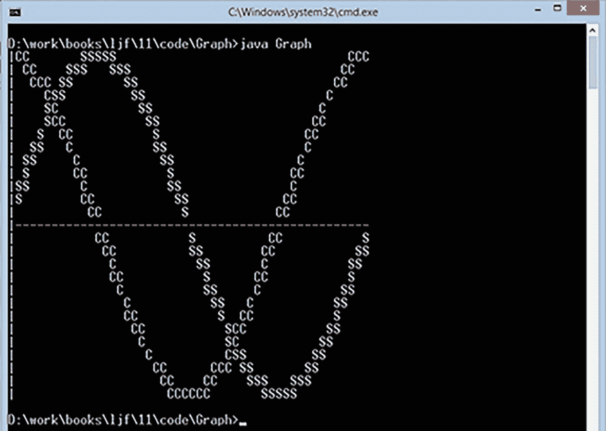

# 12. 数学、BigDecimal 和 BigInteger

数学运算是计算的重要组成部分。你在第 3 章学习了基本的数学运算符（例如加法和乘法）。Java 还在 `java.lang` 包中提供了 `Math` 类，并在 `java.math` 包中提供了 `BigDecimal` 和 `BigInteger` 类。本章将向你介绍这些类。

## Math

`Math` 类通过有用的 `static` 常量和方法来增强基本数学运算符的功能。本节将介绍这些常量，并探讨其中一些方法。

注意

你可能对配套的 `java.lang.StrictMath` 类感兴趣。`StrictMath` 看起来与 `Math` 相同，但它更严格地定义了各种数学运算，使其在平台之间 100% 可移植。请查阅 `Math` 的 JDK 文档以了解更多关于 `StrictMath` 的信息。

Java 还提供了 `strictfp`（严格浮点）关键字，用作类和方法的修饰符。它是在 Java 1.2 版本中引入的，用于限制浮点计算并确保在每个平台上得到相同的结果。然而，它已不再被使用（参见 [`http://en.wikipedia.org/wiki/Strictfp`](http://en.wikipedia.org/wiki/Strictfp)）。

### Math 常量

JDK 21 的 `Math` 类声明了三个常量：

*   `E`：最接近 e（自然对数的底数）的 `double` 值。
*   `PI`：最接近 pi（π，圆的周长与其直径之比）的 `double` 值。
*   `TAU`：最接近 tau（τ，圆的周长与其半径之比）的 `double` 值。

`PI` 常量在计算圆的周长和面积时非常有用。清单 12-1 展示了一个执行此操作的 `Circle` 应用程序。

```
public class Circle
{
public static void main(String[] args)
{
if (args.length != 1)
{
System.out.println("usage: java Circle diameter");
return;
}
double diameter = Double.parseDouble(args[0]);
System.out.println("Diameter: " + diameter);
System.out.println("Circle area: " + Math.PI * diameter);
double radius = diameter / 2;
System.out.println("Circle circumference: " +
Math.PI * radius * radius);
}
}
清单 12-1
Circle.java
```

`Circle` 接受一个命令行参数，该参数指定圆的直径。我利用 `java.lang.Double` 类的 `parseDouble()` 方法将基于字符串的直径解析为 `double`。`Circle` 的其余部分不言自明。

注意

`Double` 是*包装类*的一个例子，因为 `Double` 对象将自身包裹在一个双精度浮点值周围。包装类的其他示例包括 `Long`、`Character` 和 `Float`。

包装类将基于原始类型的值转换为可以存储在容器对象中的对象，例如由 Java 集合框架中的容器类型（`ArrayList`、`TreeSet`、`HashMap` 等）创建的对象。为简洁起见，我对包装类着墨不多，并且不在本书中讨论 Java 的集合框架。

`Double` 和其他包装类也包含有用的实用方法。`Double` 的 `parseDouble()` 方法就是一个例子。

按如下方式编译清单 12-1：

```
javac Circle.java
```

按如下方式运行生成的 `Circle.class` 应用程序：

```
java Circle 10
```

你应该会看到以下输出：

```
Diameter: 10.0
Circle area: 31.41592653589793
Circle circumference: 78.53981633974483
```

### 三角函数方法

`Math` 声明了几个用于执行三角运算的方法。考虑以下用于获取角度的余弦、正弦和正切的重载三角函数方法：

*   `double cos(double a)`
*   `double sin(double a)`
*   `double tan(double a)`

对于每个方法，传递给 `a` 的角度必须以弧度表示。

我创建了一个 `Graph` 应用程序来演示 `cos()` 和 `sin()`。`Graph` 在控制台上显示余弦波和正弦波的图形。清单 12-2 展示了其源代码。

```
public class Graph
{
final static int ROWS = 27; // 必须为奇数
final static int COLS = 50;
public static void main(String[] args)
{
char[][] screen = new char[ROWS][COLS];
double scaleX = COLS / 360.0;
// 在缓冲区中绘制正弦波和余弦波。
for (int degree = 0; degree < 360; degree++)
{
double radian = Math.toRadians(degree);
int row = (int) Math.round(ROWS / 2 *
Math.cos(radian)) + ROWS / 2;
int col = (int) (degree * scaleX);
screen[row][col] = 'C';
row = (int) Math.round(ROWS / 2 *
Math.sin(radian)) + ROWS / 2;
screen[row][col] = screen[row][col] == 'C' ? '*' : 'S';
}
// 将缓冲区输出到控制台。
for (int row = ROWS - 1; row >= 0; row--)
{
for (int col = 0; col < COLS; col++)
System.out.print(screen[row][col]);
System.out.println();
}
}
}
清单 12-2
Graph.java
```

清单 12-2 中的 `Graph` 类首先引入了常量 `COLS` 和 `ROWS`，它们指定了用作离屏缓冲区来存储图形的表格尺寸。`ROWS` 必须赋值为奇数；否则，会抛出 `java.lang.ArrayIndexOutOfBoundsException`。当某个 `row` 计算产生的值等于 `ROWS` 时，就会发生此异常：`row` 只能取从 `0` 到 `ROWS - 1` 的值。此外，使用奇数行数会使图形看起来更好。

注意

`Graph` 演示了尽可能使用常量的价值。源代码更易于维护，因为你只需在一个地方更改常量的值，而无需在整个源代码中更改每个对应的值。

`main()` 方法首先创建 `screen`，这是一个二维数组，用作存储图形的离屏缓冲区。图形在缓冲区中绘制，然后复制到控制台，因为无法在控制台上定位光标。

接下来，`main()` 方法计算一个水平缩放值，用于水平缩放每个正弦波和余弦波，以便代表度数的 360 个水平位置能够适应 `NCOLS` 指定的列数。

然后，`main()` 进入一个 `for` 循环，对于每个正弦波和余弦波，为每个度数创建（行，列）坐标，并在这些坐标处为 screen 数组赋值。字符 `C` 表示余弦波，`S` 表示正弦波，`*` 表示波相交的位置。

行计算调用 `Math` 的 `double toRadians(double angdeg)` 方法，将其角度参数从度转换为弧度，这是 `sin()` 和 `cos()` 方法所要求的。这些方法返回的值范围从 -1 到 1，然后乘以 `ROWS / 2`，以将该值缩放到 `screen` 数组行数的一半。

通过 `Math` 的 `long round(double a)` 方法将结果四舍五入到最接近的长整数后，`main()` 通过 `(int)` 强制转换将此长整数转换为 `int`。将该 `int` 值加到 `ROWS / 2` 上，以偏移行坐标，使其相对于数组的中间行。列计算更简单，将度数乘以水平缩放因子。

最后，`main()` 方法通过一对嵌套的 `for` 循环将 `screen` 数组转储到控制台。外层的 `for` 循环垂直反转数组，使其正立显示——第 0 行应该最后输出。

按如下方式编译清单 12-2：

```
javac Graph.java
```

按如下方式运行生成的 `Graph.class` 应用程序类文件：

```
java Graph
```

你应该会看到图 12-1 中所示的输出。



一张截图显示了 90 度时的余弦波和正弦波。

图 12-1

余弦波和正弦波彼此相差 90 度相位


### 随机数生成

`Math` 类通过其 `double random()` 方法支持生成伪随机数。每次调用 `random()` 都会返回一个算法选择的双精度浮点数，范围从 0.0 到接近 1.0。

注意

维基百科的“随机数生成器”主题（[`http://en.wikipedia.org/wiki/Random_number_generation`](http://en.wikipedia.org/wiki/Random_number_generation)）更详细地讨论了随机数生成器和伪随机数。为方便起见，我将使用常规术语“随机”来代替“伪随机”。

随机数生成在计算机游戏中非常重要。例如，我们可以使用 `random()` 创建一个猜数字游戏。请查看清单 12-3。

```
import java.util.Scanner;
public class Guess
{
public static void main(String[] args)
{
int answer = rnd(100) + 1;
while (true)
{
System.out.print("Enter guess (1 - 100): ");
int guess = new Scanner(System.in).nextInt();
if (guess  answer)
{
System.out.println("Too high");
continue;
}
else
{
System.out.println("Correct");
break;
}
}
}
/*
rnd() - Return random integer.
Parameters:
limit - Specifies the largest integer less 1 that
may be returned. 0 is the smallest integer.
Return:
random integer from 0 through limit - 1.
*/
static int rnd(int limit)
{
return (int) (Math.random() * limit);
}
}
清单 12-3
Guess.java
```

清单 12-3 展示了一个 `Guess` 应用程序的源代码，该程序生成一个 1 到 100 之间的随机整数，并持续提示你猜测生成了哪个整数。如果猜得太低或太高，程序会提示你。如果猜对了，程序也会提示你，然后结束。

下面这行代码可能会让人困惑：

```
int guess = new Scanner(System.in).nextInt();
```

这行代码使用了 `java.util.Scanner` 类（来自 Java 的引用类型库）及其 `nextInt()` 方法来获取用户输入的整数。`System``.in` 参数指定控制台为输入源。（除了本次演示，我不会讨论 `Scanner`。）

最重要的是 `rnd()` 方法和 `return (int) (Math.random() * limit);` 语句。`rnd()` 方法返回一个随机选择的整数，范围从 0 到 `limit` - 1。例如，当传入 `100` 时，`rnd()` 返回一个从 0 到 99 之间随机选择的整数。这就是为什么要在 `rnd()` 返回的结果上加 1。

`return (int) (Math.random() * limit);` 语句首先通过 `Math.random()` 调用获取一个从 0.0 到接近 1.0 的随机 `double` 值，然后将此值乘以 `limit`。`(int)` 强制类型转换在将 `double` 转换为 `int` 时截断了小数部分。然后通过 `return` 将结果值返回给调用者。

按如下方式编译清单 12-3：

```
javac Guess.java
```

按如下方式运行应用程序：

```
java Guess
```

以下是使用 `Guess` 的一次会话示例：

```
Enter guess (1 - 100): 50
Too high
Enter guess (1 - 100): 25
Too high
Enter guess (1 - 100): 12
Too high
Enter guess (1 - 100): 6
Too high
Enter guess (1 - 100): 3
Correct
```

我使用了二分查找算法（参见第 5 章）来确定 3 是正确的数字。在猜数字游戏的上下文中，该算法的工作原理是在搜索空间的中间选择一个值。如果猜得太高，则选择搜索空间的下半部分继续搜索。如果猜得太低，则选择搜索空间的上半部分继续搜索。该算法以递归方式重复。

你可以让这个游戏变得有趣得多。例如，在用户猜对数字后，游戏可以提示用户是否继续下一轮。在你学习了更多 Java 知识后，你还可以添加一个计时器功能，这样用户必须在时间间隔内猜对，否则将输掉这一轮（并且无法得知该数字）。

`Math` 还声明了许多其他方法。例如，重载的 `abs()` 方法让你可以获取一个数的绝对值，重载的 `max()` 和 `min()` 方法让你可以获取两个值中的最大值和最小值，而 `double sqrt(double a)` 返回其参数的平方根。（负参数的平方根是 NaN。）


## BigDecimal

许多开发者使用 `double` 和 `float` 类型来表示货币金额。然而，这种做法并不被推荐。问题在于“`float` 和 `double` 无法精确表示我们用于货币的十进制倍数”。我从 [`http://stackoverflow.com/questions/3730019/why-not-use-double-or-float-to-represent-currency`](http://stackoverflow.com/questions/3730019/why-not-use-double-or-float-to-represent-currency) 摘录了此答案，该答案随后对此进行了深入阐述。

开发者也会使用 `int` 和 `long` 类型来表示以“分”为单位的货币金额，但这种方法同样存在问题。针对 Stack Overflow 上“为什么应用程序通常不使用 `int` 在内部表示货币金额？”的问题（[`http://stackoverflow.com/questions/5356123/why-dont-applications-typically-use-int-to-internally-represent-currency-values`](http://stackoverflow.com/questions/5356123/why-dont-applications-typically-use-int-to-internally-represent-currency-values)），Matt 解释道：

“这并不能简化编码。1.10 美元转换为 110 美分。没问题，但当你需要计算税金时（例如，1.10 美元 * 4.225% —— 密苏里州的税率，结果为 0.046475 美元）该怎么办？为了将所有金额保持为整数，你还必须将销售税转换为整数（4225），这需要将 110 美分进一步转换为 11000000。那么计算就变成了 11000000 * 4225 / 100000 = 464750。这就产生了一个问题，因为现在我们有了以美分的小数部分表示的值（分别为 11000000 和 464750）。这一切都是为了将货币存储为整数。

因此，以本币单位进行思考和编码更为容易。在美国，这将是美元，美分作为小数部分（例如，1.10 美元）。用 110 美分来编码则不那么自然。使用十进制浮点数（例如 Java 的 `BigDecimal` 和 .NET 的 `Decimal`）对于货币值来说通常足够精确（相比于像 `Float` 和 `Double` 这样的二进制浮点数）。”

`BigDecimal` 类描述了不可变的、任意精度的有符号十进制数。根据 `BigDecimal` 的 JDK 文档，“一个 `BigDecimal` 由一个任意精度的整数未缩放值和一个 32 位整数标度组成。如果标度为零或正数，则标度表示小数点右侧的位数。如果标度为负数，则数字的未缩放值乘以 10 的标度绝对值次幂。因此，由 `BigDecimal` [类] 表示的数字的值为 (unscaledValue × 10^(-scale))。”

`BigDecimal` 是进行货币计算的理想选择。清单 12-4 展示了源代码。

```
// BigDecimal Demo
import java.math.BigDecimal;
import java.math.RoundingMode;
class BDD
{
public static void main(String[] args)
{
BigDecimal purchaseAmount = new BigDecimal("586.32");
BigDecimal pstRate = new BigDecimal("0.06");
System.out.println("Purchase amount: " + purchaseAmount);
System.out.println("PST rate: " + pstRate);
// Calculate provincial sales tax on purchase.
BigDecimal pst = purchaseAmount.multiply(pstRate);
System.out.println("PST: " + pst);
pst = pst.setScale(2, RoundingMode.HALF_UP);
System.out.println("PST: " + pst);
}
}
清单 12-4
BDD.java
```

清单 12-4 展示了一个演示 `BigDecimal` 的简单应用程序的源代码。

`main()` 方法首先调用 `BigDecimal(String val)` 构造函数来构造一个 `BigDecimal` 对象，表示 586 美元 32 美分的购买金额，然后构造一个 `BigDecimal` 对象，表示 6% 的省销售税率（我住在加拿大）。

然后，该方法在每个对象上调用 `System.out.println()` 来输出其值（在幕后，`System.out.println()` 调用 `BigDecimal` 的 `toString()` 方法将 `BigDecimal` 对象转换为字符串，然后输出）。

此时，`main()` 调用 `BigDecimal` 的 `BigDecimal multiply(BigDecimal multiplicand)` 方法，将购买金额乘以 PST 税率。返回的 `BigDecimal` 对象的引用被赋值给局部变量 `pst`。

返回的 `BigDecimal` 对象显示了四位小数（美分）。在处理货币时，我们习惯使用两位小数。我们可以通过调用 `BigDecimal` 的 `BigDecimal setScale(int newScale, RoundingMode roundingMode)` 方法来实现两位小数。`main()` 方法调用此方法，将 `2` 作为新的标度（我们需要两位小数），并将 `RoundingMode.HALF_UP` 作为舍入模式——四舍五入是我们上学时学到的舍入模式。

注意

`RoundingMode` 是*枚举类型*的一个例子，它是一种引用类型，由作为对象实现的命名常量组成。我在本书中没有讨论枚举类型，因为我认为它不是一个基础特性。

最后，`main()` 输出四舍五入后的 PST 值。

按如下方式编译清单 12-4：

```
javac BDD.java
```

按如下方式运行应用程序：

```
java BDD
```

您应该会看到以下输出：

```
Purchase amount: 586.32
PST rate: 0.06
PST: 35.1792
PST: 35.18
```


## BigInteger

`BigDecimal` 类使用 `BigInteger` 类来表示任意精度的整数未缩放值。与 `BigDecimal` 一样，`BigInteger` 对象是不可变的——它们不能被更改。所有操作的行为都如同 `BigInteger` 是用二进制补码表示法（就像 Java 的基本整数类型一样）表示的。

`BigInteger` 提供了 Java 所有基本整数运算符的模拟，以及 `Math` 类中的所有相关方法。此外，`BigInteger` 还提供了模运算、GCD（最大公约数）计算、素数测试、素数生成、位操作以及其他一些杂项操作。

`BigInteger` 非常适合表示在天文学、物理学和化学中遇到的巨大整数。例如，*阿伏伽德罗常数*（一摩尔物质中的粒子数）是 6.02214076×10²³。此外，100 万光年的米数是 9.46052840500002×10²¹。相比之下，`long` 类型能表示的最大正整数略小于 10¹⁹。

我创建了一个简单的应用程序来演示 `BigInteger` 的一部分功能。清单 12-5 展示了源代码。

```
// BigInteger Demo
import java.math.BigInteger;
class BID
{
public static void main(String[] args)
{
BigInteger bi1 = new BigInteger("100");
BigInteger bi2 = new BigInteger("25");
System.out.println("bi1 = " + bi1);
System.out.println("bi2 = " + bi2);
System.out.println("bi1 + bi2: " + bi1.add(bi2));
System.out.println("bi1 - bi2: " + bi1.subtract(bi2));
System.out.println("bi1 * bi2: " + bi1.multiply(bi2));
System.out.println("bi1 / bi2: " + bi1.divide(bi2));
}
}
清单 12-5
BID.java
```

清单 12-5 的 `main()` 方法首先调用 `BigInteger(String val)` 构造函数来构造一对 `BigInteger` 对象。输出它们的值后，它调用 `BigInteger` 的 `BigInteger add(BigInteger val)`、`BigInteger subtract(BigInteger val)`、`BigInteger multiply(BigInteger val)` 和 `BigInteger divide(BigInteger val)` 方法，分别将 `val` 加到调用 `BigInteger` 上、从调用 `BigInteger` 中减去 `val`、将调用 `BigInteger` 乘以 `val`、以及将调用 `BigInteger` 除以 `val`。在每种情况下，都会返回一个新的 `BigInteger` 对象（与 `BigDecimal` 对象一样，`BigInteger` 对象不能被更改——它们是不可变的）。结果被输出。

按如下方式编译清单 12-5：

```
javac BID.java
```

按如下方式运行生成的应用程序：

```
java BID
```

您应该会看到以下输出：

```
bi1 = 100
bi2 = 25
bi1 + bi2: 125
bi1 - bi2: 75
bi1 * bi2: 2500
bi1 / bi2: 4
```

## 接下来是什么？

在本书中，我多次提到字符串和 `java.lang.String` 类。第 13 章将探讨 `String` 以及相关的 `java.lang.StringBuffer` 类。

