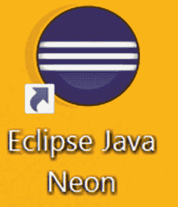
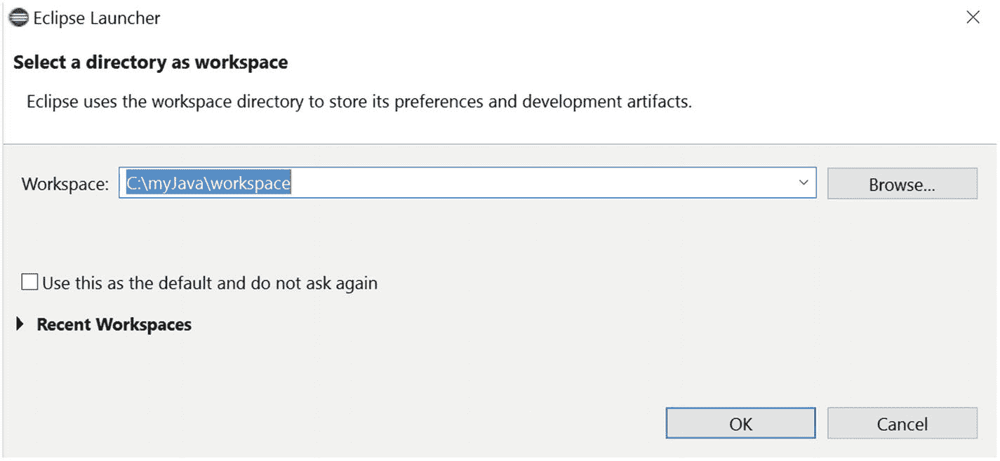
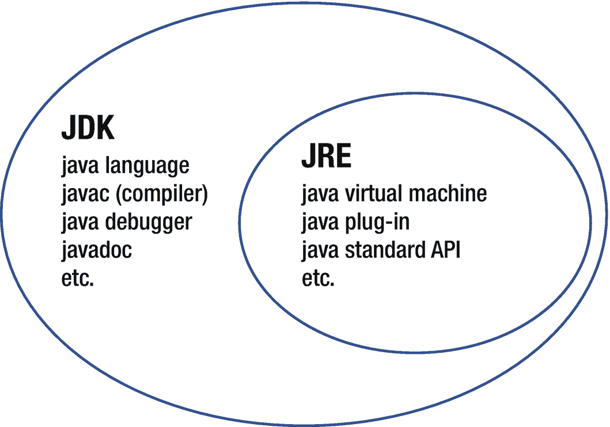
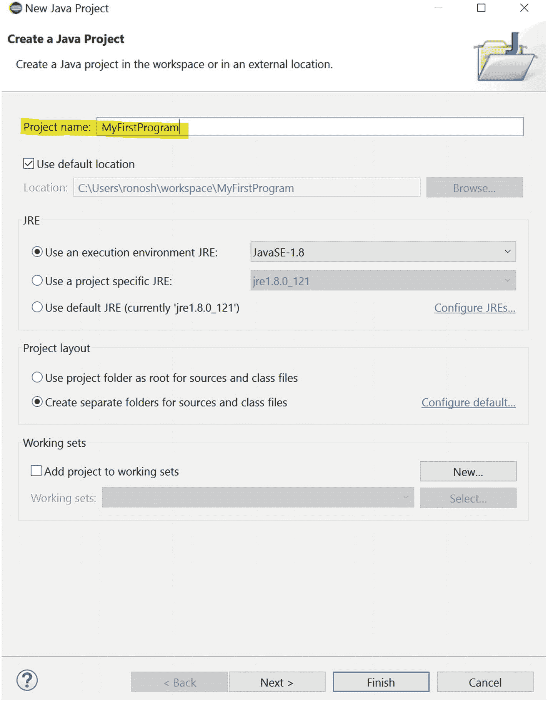

# 四、开始玩 Java 吧

下载并安装一个 Java 运行时环境(根据你电脑的操作系统选择合适的版本): [`https://www.java.com/en/download/manual.jsp`](https://www.java.com/en/download/manual.jsp)

下载安装 Eclipse(寻找最近的稳定版本): [`http://www.eclipse.org/downloads/`](http://www.eclipse.org/downloads/)

安装后，您应该会在桌面上看到一个图标，如图所示——“Neon”版本。



一旦您启动 Eclipse，您将需要指定工作空间(图 [4-1](#Fig1) )。



图 4-1

指定工作空间

## JRE 和 JDK 有什么区别？

JRE 是“Java 运行时环境”。它是你的 Java 程序运行的地方。JDK 是“Java 开发工具包”，它是 Java 的全功能软件开发工具包，包括 JRE、编译器和用于创建和编译程序的工具(例如 JavaDoc、Java 调试器)。

当您只想在浏览器或计算机上运行 Java 程序时，您将安装 JRE。但是如果你想做一些 Java 编程，你还需要安装 JDK。

图 [4-2](#Fig2) 显示了 JRE 和 JDK 之间的清晰关系，以及它们的基本特征区域。



图 4-2

JDK 和 JRE 比较

## 什么是工作空间、源代码和包？

“工作区”用于将一组相关的项目组合在一起。通常这些项目会组成一个应用程序。

“源代码”是指源代码，即 Java 程序和相关代码。

“包”表示文件的集合。

## 什么是编辑、编译和执行？

“编辑”用 Java 语言编写代码。

“编译”将 Java 源代码转换成 Java 字节码。

“执行”运行程序。

*   编辑创建`*.java`文件

*   编译生成`*.class`文件

## 创建您的第一个程序

让我们开始吧:

1.  Once Eclipse is launched, left-click on “File” in the top menu bar and left-click on “New” in the drop-down menu. Then select “Java Project” from another drop-down menu as shown in Figure [4-3](#Fig3).

    

    图 4-3

    在我们创建 Java 项目或 Java 类之前

2.  Now create a Java project named `MyFirstProgram`, as shown in Figure [4-4](#Fig4). Click “Finish.”

    

    图 4-4

    创建 Java 项目

3.  Select File ➤ New ➤ Class to create a Java class (name: “`Welcome`”), as shown in Figure [4-5](#Fig5). Make sure you select “public static void main(String[] args).” Click on “Finish.”

    

    图 4-5

    创建 Java 类

4.  自动创建`Welcome`类和`public static void main(String[] args)`方法，如图 [4-6](#Fig6) 所示。然后手动添加以下输出行:

1.  Click on “Run” from the top menu bar, and then click on “Run” from its drop-down menu, we will see output text in the Console window as shown in Figure [4-6](#Fig6).

    

    图 4-6

    运行应用程序

```java
System.out.println("Hello, friend, you are welcome!");

```

## 探索类和 main()

正如你在第 [3](03.html) 章中看到的,“类”是一个模板，它描述了一个对象应该显示的行为。您可以从类中创建单个对象。这被称为“类实例化”一个类有局部变量、实例变量、类变量和许多方法。

`main()`是一个方法名。当您的 Java 程序被执行时，运行时通过首先调用它的`main()`方法来启动您的程序。`main()`方法是 Java 程序的一个入口点。

### 为什么是“public static void main(String[]args)”。

这是由 Java 语言和 JVM 设计的一个约定(如果其中一些没有意义，请不要担心，我们将在本书的后面回到它)。

*   `main`是方法的名称；

*   `String[] args`是将`main()`方法输入的参数作为字符串数组的数据类型；传递给`main()`方法的字符串值称为参数；它们可以作为可选值，在程序启动时发送给程序；

*   `void`表示`main()`方法调用没有返回数据；

*   `public`表示`main()`方法可供 JVM 调用，以启动整个程序的执行；

*   `static`表示不能用对象实例调用`main()`方法；换句话说，JVM 可以直接调用它，而不必创建额外的结构来调用它。

如果您将`public`更改为`private`，您将在运行时看到以下错误。

```java
Error: Main method not found in class <your class name>, please define the main method as:
   public static void main(String[] args)
or a JavaFX application class must extend javafx.application.Application

```

## 问题

1.  `Something.java`档和`Something.class`档有什么区别？
    1.  一个`.java`文件是一个大得多的二进制文件，而一个`.class`文件是一个较小的压缩版本。

    2.  `.class`文件用于面向对象编程，而`.java`文件用于过程编程。

    3.  一个`.java`文件包含用 Java 语言编写的代码，一个`.class`文件包含用 C++语言编写的代码。

    4.  程序员先写`.class`文件，后面自动生成`.java`文件。

    5.  `Something.java`是程序员打出的源代码文件，`Something.class`是编译好的可执行类文件，由计算机运行。

2.  下面哪个方法头是正确的？
    1.  `public static foo void[]`

    2.  `public static void foo()`

    3.  `public void static foo{}`

    4.  `public void static foo()`

    5.  `public static foo()`