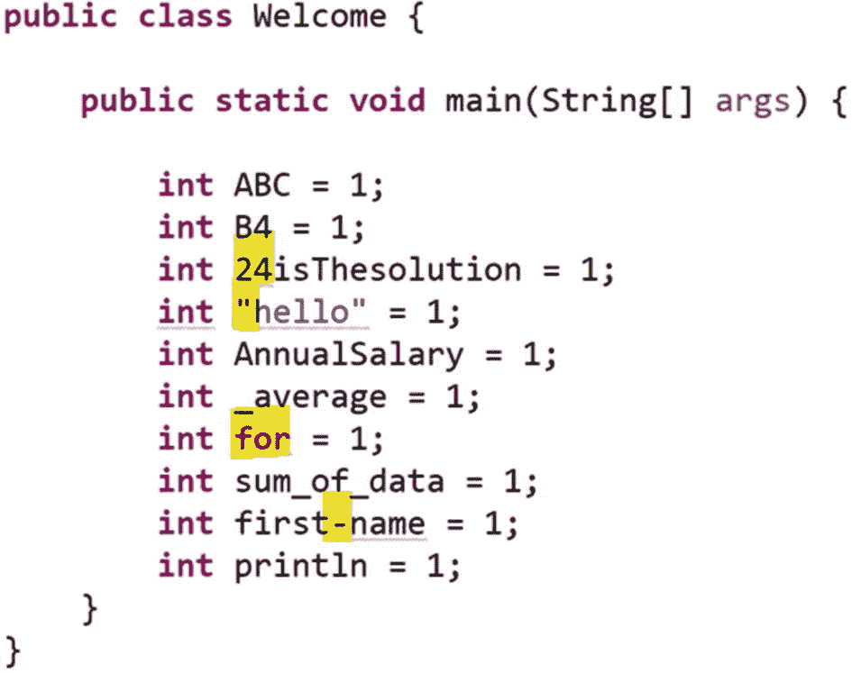

# 五、变量

一个变量是:

*   存储的位置

*   存储某种信息供以后使用的容器

*   可通过引用描述所述信息的名称来检索

有不同类型的变量:

*   局部变量

    它们是仅在局部范围内有效的变量，例如在方法内部或代码块内部。

*   类变量和实例变量

    我们将在后面的章节中学习基本的类概念时看到例子。类变量定义类字段和属性的数据类型。当从一个类创建一个对象时，该对象的类变量成为实例变量。类变量和实例变量都在类中声明，但是它们不属于该类的任何方法。

*   方法参数

    参数也是变量，用于将值从方法外部传递到方法中。

## 定义变量名

变量名:

*   不能以数字或某些特殊符号开头，如引号(`"`)或类似于`)`的括号等。，但可以以下划线(`_`)或美元符号(`$`)开头。

*   不能是该语言中已经使用的任何关键字，也称为保留字，例如，`if`、`else`等。

### 例子

以下哪一项可以在 Java 程序中用作标识符？答案不止一个。

1.  `ABC`

2.  `B4`

3.  `24isThesolution`

4.  `"hello"`

5.  `AnnualSalary`

6.  `_average`

7.  `for`

8.  `sum_of_data`

9.  `first-name`

10.  `println`

答案:1、2、5、6、8 和 10

您可以键入如图 [5-1](#Fig1) 所示的简单代码来检查哪些字符串不适合变量名，因为在 Eclipse 的 Java 代码编辑器中，所有语法错误都用红色下划线标出。



图 5-1

突出显示错误

### Java 中不同类型的变量

变量的类型将定义数据的类型以及它们存储在变量中时的大小。Java 提供了八种基本的数据类型。Java 还支持非原始数据类型的引用或对象数据类型。

原始类型:

*   `int`

*   `long`

*   `short`

*   `float`

*   `double`

*   `char`

*   `byte`

*   `boolean`

参考类型:

*   `String`

*   对象、数组等等

当我们在程序中声明一个变量时，我们实际上是在计算机的内存中为操作预留了空间。有必要了解常见的数据类型及其占用的内存空间。此表显示了数据类型、它们的位(和字节)大小以及它们所代表的值类型的列表。

<colgroup><col class="tcol1 align-left"> <col class="tcol2 align-left"> <col class="tcol3 align-left"></colgroup> 
| 

类型

 | 

位数

 | 

价值

 |
| --- | --- | --- |
| （同 Internationalorganizations）国际组织 | 32 位元(= 4 位元组) | 整数 |
| 短的 | 16 位(= 2 字节) | 整数 |
| 长的 | 64 位元(= 8 位元组) | 整数 |
| 字节 | 8 位(= 1 字节) | 整数 |
| 漂浮物 | 32 位元(= 4 位元组) | 浮点 |
| 两倍 | 64 位元(= 8 位元组) | 浮点 |
| 茶 | 16 位(= 2 字节) | unicode 字符 |
| 布尔 | 见下文 | 对/错 |

对于布尔数据类型，只有两个不同的值，`true`或`false`。一个小小的空间似乎正合适。事实上，Java 实际上为布尔数据类型准备了至少一个字节的空间，尽管它只使用了一位的空间。确切地说，它没有明确定义，因为它将依赖于平台的虚拟机。

## 给变量赋值

以下是如何将值或内容分配给特定类型的变量:

```java
int number1 = 3;
int number2 = 7;
int total = number1 + number2;
boolean flag = true;
String a = "welcome";
String b = "my friend";
String c = a + b;

```

然后，您可以使用下面的方法来显示和验证变量的当前值。例如，这一行将显示字符串变量`c`的当前值:

```java
System.out.println(c);

```

### 实验室工作

参照我们创建的第一个程序，按照描述使用`System.out.println()`语句；编译并运行它；然后在控制台窗口中，验证每个操作后每个变量的结果值。

基本数学运算:

```java
int number = 9 / 8;
double number = 9 / 8;

```

有序的数学运算:

```java
int number = 6 + 8 * 5;
int number = (6 – 8) * (5 + 3);

```