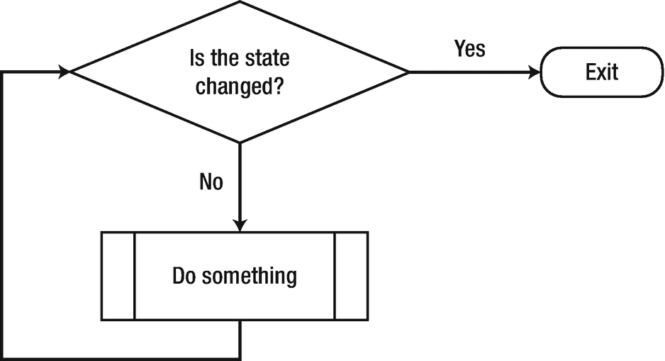
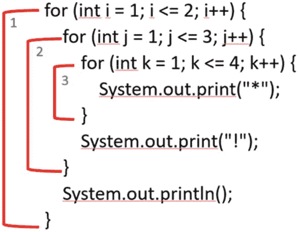

# 八、循环结构——`for`循环

简单来说，循环结构重复做一些事情，直到状态改变(见图 [8-1](#Fig1) )。



图 8-1

for 循环结构

## 例子

这里有一个例子:

```java
        for (int i = 0; i < 100; i++) {
               <do something>
        }

```

`for`陈述中有三个关键要素:

*   `int i = 0`:声明一个计数器变量，并给它赋一个初始值；

*   `i < 100`:定义继续`for`循环的条件；只要这个条件为真，循环就会运行，当它不为真时，我们停止并退出`for`循环；

*   `i++`:递增计数器值；`i++`和`i = i + 1.`是一回事

那么，“<do something="">”在上面的代码中会重复多少次呢？</do>

## 实验室工作

1.  使用`for`循环输出“Hello！”10 次。

2.  使用`for`循环打印出从 1 到 25 的所有整数，包括 1 和 25。

3.  打印出从 1 到 25 的所有整数。

4.  输出从 3 到 99 的所有偶数。

## for 循环公式

`for`循环背后的数学模型实际上是一个算术序列:

```java
for (int counter=firstTerm;
       counter <= lastTerm;
       counter=counter + difference) {
        ......
}

```

`counter`系列中的第 n 项等于:

*   第一项+差值×(n–1)

## 求算术数列的“for 循环”公式

例如，下面是一个数字列表:

*   -4, 5, 14, 23, 32, 41, 50, 59, 68, 77, 86.

*   它遵循一个算术序列。

*   firstItem = -4

*   lastItem = 86

*   差值= 5-(-4)= 9

*   将此转化为一个`for`循环:

```java
for(int i=-4; i <= 86; i=i+9) { ...... }

```

它将遍历列表中的每一个数字。

## 数学:战略计数

你可以用手指数，但是当你的数列中有非常多的数字时，那就没用了。正确的做法是通过重组来准备这些数字。目的是找到一个好的模式，以便我们可以系统地计数。

在这里寻找一个模式就是找出一个代表数列中每个数字的基本公式。

看看这个例子:3，4，5，6，....，100，所以我们知道数字的总数是:

*   100 – 3 + 1 = 98.

一种常见的方法是将数列转换成更简单的形式。如果我们从数列的每个数字中减去 2，我们得到 1，2，3，4，......, 98.我们现在知道总数是 98。并且，表示每个数的公式将是 x(i) = i + 2，(i=1，2，......,98).

那 5，8，11，14 呢，......, 101?怎么用“`for`循环”把它打印出来？

它看起来比上一个更复杂，但您可以尝试相同的方法。

1.  每个数字减 5；它变成了 0，3，6，9，......, 96

2.  除以 3，它就变成 0，1，2，3，......, 32

3.  从 0 开始，一个一个数，一直数到 32，并不难。总数是 33。

4.  数列中第 I 个数的通称将是 x(i) = 3 * i + 5，(i=0，1，2，......, 32).

现在，回到`for`循环结构，很明显答案应该是这样的:

```java
        for (i=0; i <= 32; i++) {
               System.out.println(3 * i + 5);
        }

```

## 实验室工作

*   编写一个`for`循环，生成以下数字列表:

    1 4 9 16 25 36 49 64 81 100

    (提示:寻找一个共同的模式。)

## 例子

以下循环序列的输出是什么？



它打印出以下内容:

```java
****!****!****!
****!****!****!

```

外部`for`循环(标记为“1”)有两次迭代，因此输出将有两行，由`println()`。

中间的`for`循环(标记为“2”)有三次迭代，所以它将打印出 2 x 3 = 6“！”总计通过`print()`。

内部的`for`循环(标记为“3”)有四次迭代，所以`print()`总共会打印出 2×3×4 = 24 个`*`。

## 实验室工作

*   写一个方法`exp()`来计算一个指数结果，给定一个基数和一个幂(也叫指数)。例如，`exp(3, 4)`返回 81。限制是基数和指数不能为负。

## 问题

1.  以下循环序列的输出是什么？

    ```java
    for (int i = 1; i <= 2; i++) {
        for (int j = 1; j <= 3; j++) {
            System.out.print(i + ""*"" + j + ""= "" + i * j + "";  ");
        }
        System.out.println();
    }

    ```

2.  编写一个`for`循环，生成以下数字列表:

    5 10 17 26 37 50

3.  编写一个`for`循环，生成以下数字列表:

    1 8 27 64 125

4.  编写一个`for`循环，生成以下数字列表:

    -1 0 7 26 63 124

5.  使用`for`循环产生以下输出:

    ```java
    *****
    *****
    *****
    *****

    ```

6.  编写`for`循环代码，输出以下内容:

    one

    Twenty-two

    Three hundred and thirty-three

    Four thousand four hundred and forty-four