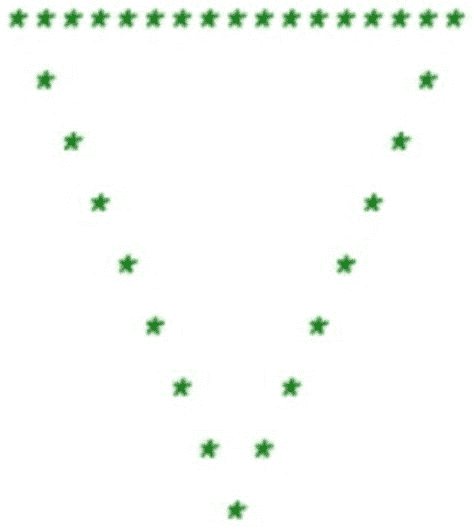
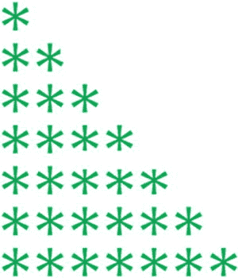
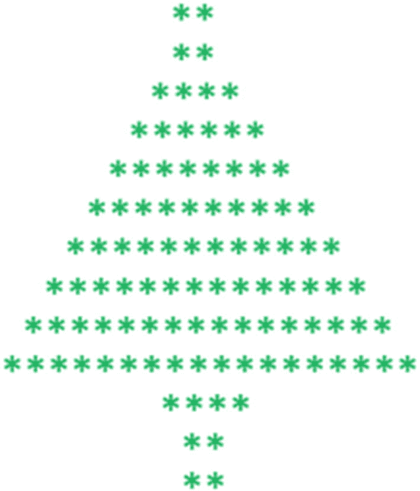

# 十三、Java 基础项目

1.  编写代码打印出下图。

1.  编写代码来绘制以下形状。

1.  写代码做这个三角形。

1.  写一个函数来检查一个整数是否能被另一个整数整除。

    例如:

    (1)给定输入 10，5，输出为“是，2”；

    (2)给定输入 11，2，输出为"否"；

2.  写 Java 代码画圣诞树。

1.  写代码找出给定正整数的所有因子。

    例如，当用户输入“10”时，你的程序应该输出 1，2，5，10

2.  编写一个方法，该方法接受一个月(即 1 到 12 之间的整数)作为参数，并返回当前年份中该月的天数。

3.  编写代码，生成从控制台输入的两个数字的乘积:

    请输入两个数进行乘法运算

    下一个数字- > 7

    下一个数字- > 15

    产品= 105

4.  写一个检查正整数是否是质数的方法。

5.  编写一个方法，将一个整数转换成用二进制表示的字符串。例如，给定一个参数“19”，它应该返回“10011”。