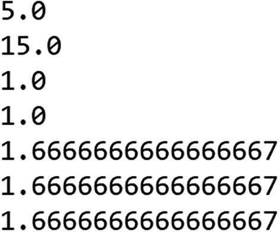

# 十七、强类型编程

正如我们在本书第一部分开始时了解到的，Java 编程语言已经定义了整数、双精度、布尔、字符串等。，作为基本类型。在 Java 中，如果没有预先定义变量的类型，我们就不能给变量赋值。只有在一个变量被一个类型明确定义后，例如，integer，我们才被允许给它分配一个整数值，并开始在计算中使用它作为一个整数。从逻辑上讲，一旦定义了变量的类型，就不能再给它赋不同类型的值。例如，如果一个变量被定义为布尔值，它就不能被赋予整数值。否则，我们将得到一个类型不匹配的编译错误。

## 铅字铸造

但是，如果一个变量被定义为 double，我们怎么给它赋一个整数值呢？让我们做一些实验。

```java
       public static void main(String[] args) {
              double a = 5;
              System.out.println(a);
              double b = 3 * 5;
              System.out.println(b);
              double x = 5 / 3;
              System.out.println(x);
              double y = (double)(5 / 3);
              System.out.println(y);
              double z = (double)5 / 3;
              System.out.println(z);
              double t = 5.0 / 3;
              System.out.println(t);
              double u = 5 / 3d;
              System.out.println(u);
       }

```

这是输出:



下面的模式是我们从这个实验中学到的:

*   当整数 5 被赋给双精度类型变量时，该变量将得到一个带小数点表示的等效值，即 double value 5.0。

*   当一个整数除以另一个整数时，结果遵循相同的整数类型，例如 5 / 3 = 1。但是，当分数“5 / 3”被赋给双精度类型变量时，结果值将自动转换为双精度值 1.0。

*   `(double)(5 / 3)`将`(5/ 3)`的整数结果转换为双精度值。这叫做类型转换。结果是 1.0，一个双精度值。

我们如何从 5 / 3 得出一个精确的值？诀窍是用`(double)5 / 3`，而不是`5 / 3`。`(double)5 / 3`的结果是一个双精度值。或者，您可以使用 5.0 / 3 来产生相同的结果。另一种方式是`5d / 3`，或`5 / 3d`。两个表达式的结果都是相同的双精度值。

## 数学:直线的斜率

在 x-y 2D 笛卡尔坐标系中，点(x1，y1)和(x2，y2)之间的直线的斜率等于(y2 - y1) / (x2 - x1)。

**例子**

实现一个名为`double getSlope()`的公共方法，该方法返回一条线的斜率。如果两个点有相同的 x 坐标，分母为零，斜率未定义，所以在这种情况下应该抛出一个`IllegalArgumentException`。这将停止您的程序运行，并显示指定的错误信息。

**回答**

在一个`Line`类中，我们定义了两个点和一个构造函数:

```java
       private Point p1;
       private Point p2;
       public Line(Point p1, Point p2) {
              this.p1 = p1;
              this.p2 = p2;
       }

```

`Point`类被设计为:

```java
public class Point {
       private int x;
       private int y;
       public Point() {
       }

       public void setX(int x) {
              this.x = x;
       }

       public int getX() {
              return x;
       }

       public void setY(int y) {
              this.y = y;
       }

       public int getY() {
              return y;
       }
}

```

现在我们在`Line`类中添加一个名为`getSlope()`的方法。

```java
public double getSlope() {
       if (this.p1.getX() == this.p2.getX()) {
              throw new IllegalArgumentException("Denominator cannot be 0");
       }
       return (double)(this.p2.getY() - this.p1.getY()) / (this.p2.getX() - this.p1.getX());
}

```

该方法看起来很容易，但棘手的部分是我们将两个整数相除的结果转换为 double 值，也就是说，

```java
(double)(this.p2.getY() - this.p1.getY()) / (this.p2.getX() - this.p1.getX())

```

## 数学:共线性

如果可以画一条直线来连接点，那么这些点就是共线的。两个基本的例子是三个点具有相同的 x 或 y 坐标。更一般的情况可以通过计算每对点之间的直线的斜率并检查所有对点的斜率是否相同来确定。

我们使用公式(y2 - y1) / (x2 - x1)来确定两点(x1，y1)和(x2，y2)之间的斜率。

将以下方法添加到您的`Line`类中:

```java
public boolean isCollinear(Point p)

```

如果给定点与这条线的点共线，它需要返回 true。