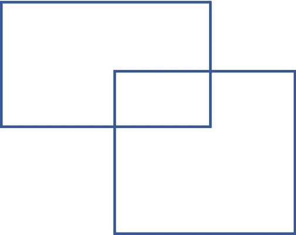
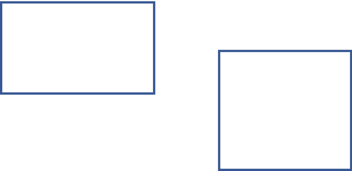

# 三十一、IOU 计算

IOU 的意思是“交集大于并集”它被用作图像检测技术中的度量。此指标计算两个矩形之间的重叠面积与其联合面积的比率。为了简单起见，这两个矩形在同一个方向，正如你在图 31-1 中看到的 R1 和 R2。



图 31-1

两个矩形及其重叠

为了计算这个比率，我们需要找出它们的重叠区域 x。如果两个矩形的面积分别是 R1.area 和 R2.area，那么

*   IOU = X/(R1 . area+R2 . area–X)

我们用`x_min`、`y_min`、`x_max`和`y_max`来定义矩形的位置。它的四个顶点可以用四个坐标来表示:(`x_min`、`y_min`)、(`x_min`、`y_max`)、(`x_max`、`y_max`)、(`x_max`、`y_min`)，从左下顶点开始，顺时针方向。

我们先来看看什么情况下 R1 和 R2 不会有重叠区域，如图 31-2 所示。



图 31-2

两个彼此分开的矩形

它将在以下时间出现:

*   R1.x_max <= R2.x_min，(1)

*   或者 R1.x_min >= R2.x_max，(2)

*   或者 R1.y_max <= R2.y_min，(3)

*   或者 R1.y_min >= R2.y_max (4)

如果从(1)到(4)的条件之一有效，则重叠面积为 0。

接下来，我们注意到重叠区域实际上被四条线所包围，如图 31-3 所示。


图 31-3

两个矩形及其重叠区域

*   x =最大值(R1.x_min，R2.x_min)，x =最小值(R1.x_max，R2.x_max)

*   y =最大值(R1.y_min，R2.y_min)，y =最小值(R1.y_max，R2.y_max)

根据数学推理，我们可以得出如下所示的编码设计方案:

有两类，`Rectangle`和`IntersectionOverUnion`。

`Rectangle`类为 x-y 坐标系上的矩形定义了一个数据模型。

```java
public class Rectangle {
       public float x_min;
       public float x_max;
       public float y_min;
       public float y_max;

       public Rectangle(float xmin, float ymin, float xmax, float ymax) {
              if (xmin >= xmax || ymin >= ymax) {
throw new IllegalArgumentException("Not a valid rectangle!");
              }
              this.x_min = xmin;
              this.y_min = ymin;
              this.x_max = xmax;
              this.y_max = ymax;
       }

       public float getWidth() {
              return this.x_max - this.x_min;
       }
       public float getHeight() {
              return this.y_max - this.y_min;
       }
}

```

`IntersectionOverUnion`类包含驱动执行的`main()`方法。

```java
public class IntersectionOverUnion {
       public static void main(String[] args) {
              // test case 1
              Rectangle r1 = new Rectangle(3f, 2f, 5f, 7f);
              Rectangle r2 = new Rectangle(4f, 1f, 6f, 8f);
              System.out.println("IOU=" + getIOU(r1, r2));

              // test case 2
              r1 = new Rectangle(3f, 2f, 5f, 7f);
              r2 = new Rectangle(1f, 1f, 6f, 8f);
              System.out.println("IOU=" + getIOU(r1, r2));

              // test case 3
              r1 = new Rectangle(3f, 2f, 5f, 7f);
              r2 = new Rectangle(6f, 1f, 7f, 8f);
              System.out.println("IOU=" + getIOU(r1, r2));
       }

       public static float getIOU(Rectangle r1, Rectangle r2) {
              float areaR1 = r1.getHeight() * r1.getWidth();
              float areaR2 = r2.getHeight() * r2.getWidth();
              float overlapArea = 0f;
              if (r1.x_min >= r2.x_max || r1.x_max <= r2.x_min ||
                     r1.y_min >= r2.y_max || r1.y_max <= r2.y_min) {
                     return 0f;
              }
              overlapArea = computeOverlap(
                                   Math.max(r1.x_min, r2.x_min),
                                   Math.min(r1.x_max, r2.x_max),
                                   Math.max(r1.y_min, r2.y_min),
                                   Math.min(r1.y_max, r2.y_max));
              System.out.println(overlapArea + " / (" + areaR1
                            + " + " + areaR2 + " - " + overlapArea + ")");
              return overlapArea / (areaR1 + areaR2 - overlapArea);
       }

       private static float computeOverlap(
                                   float x1,
                                   float x2,
                                   float y1,
                                   float y2) {
              float w = x2 - x1;
              if (w < 0) w = -w;
              float h = y2 - y1;
              if (h < 0) h = -h;
              return w * h;
       }
}

```

我们还没完。我们需要经常思考如何改进我们的类设计和优化代码。在`Rectangle`类中，有`getWidth()`和`getHeight()`方法。如果我们给`Rectangle`类添加一个叫做`getArea()`的方法会怎么样？

`Rectangle`类更新为:

```java
public class Rectangle {
       public float x_min;
       public float x_max;
       public float y_min;
       public float y_max;

       public Rectangle(float xmin, float ymin, float xmax, float ymax) {
              if (xmin >= xmax || ymin >= ymax) {
throw new IllegalArgumentException("Not a valid rectangle!");
              }
              this.x_min = xmin;
              this.y_min = ymin;
              this.x_max = xmax;
              this.y_max = ymax;
       }

       public float getWidth() {
              return this.x_max - this.x_min;
       }
       public float getHeight() {
              return this.y_max - this.y_min;
       }
       public float getArea() {
              return this.getWidth() * this.getHeight();
       }
}

```

剩下的代码看起来会像这样:

```java
import java.lang.Math;
public class IntersectionOverUnion {
       public static void main(String[] args) {
              // test case 1
              Rectangle r1 = new Rectangle(3f, 2f, 5f, 7f);
              Rectangle r2 = new Rectangle(4f, 1f, 6f, 8f);
              System.out.println("IOU=" + getIOU(r1, r2));

              // test case 2
              r1 = new Rectangle(3f, 2f, 5f, 7f);
              r2 = new Rectangle(1f, 1f, 6f, 8f);
              System.out.println("IOU=" + getIOU(r1, r2));

              // test case 3
              r1 = new Rectangle(3f, 2f, 5f, 7f);
              r2 = new Rectangle(6f, 1f, 7f, 8f);
              System.out.println("IOU=" + getIOU(r1, r2));
       }

       public static float getIOU(Rectangle r1, Rectangle r2) {
              float areaR1 = r1.getArea();
              float areaR2 = r2.getArea();
              float overlapArea = 0f;
              if (r1.x_min >= r2.x_max || r1.x_max <= r2.x_min ||
                     r1.y_min >= r2.y_max || r1.y_max <= r2.y_min) {
                     return 0f;
              }
              overlapArea = computeOverlap(
                                   Math.max(r1.x_min, r2.x_min),
                                   Math.min(r1.x_max, r2.x_max),
                                   Math.max(r1.y_min, r2.y_min),
                                   Math.min(r1.y_max, r2.y_max));
              System.out.println(overlapArea + " / (" + areaR1
                            + " + " + areaR2 + " - " + overlapArea + ")");
              return overlapArea / (areaR1 + areaR2 - overlapArea);
       }

       private static float computeOverlap(
                                   float x1,
                                   float x2,
                                   float y1,
                                   float y2) {
              float w = x2 - x1;
              if (w < 0) w = -w;
              float h = y2 - y1;
              if (h < 0) h = -h;
              return w * h;
       }
}

```

面积的计算现在封装在`Rectangle`类中。这个变化本身并不大，但是我们应该习惯于在我们仍然能够逐步改进我们的程序设计的时候做一些小的改变。