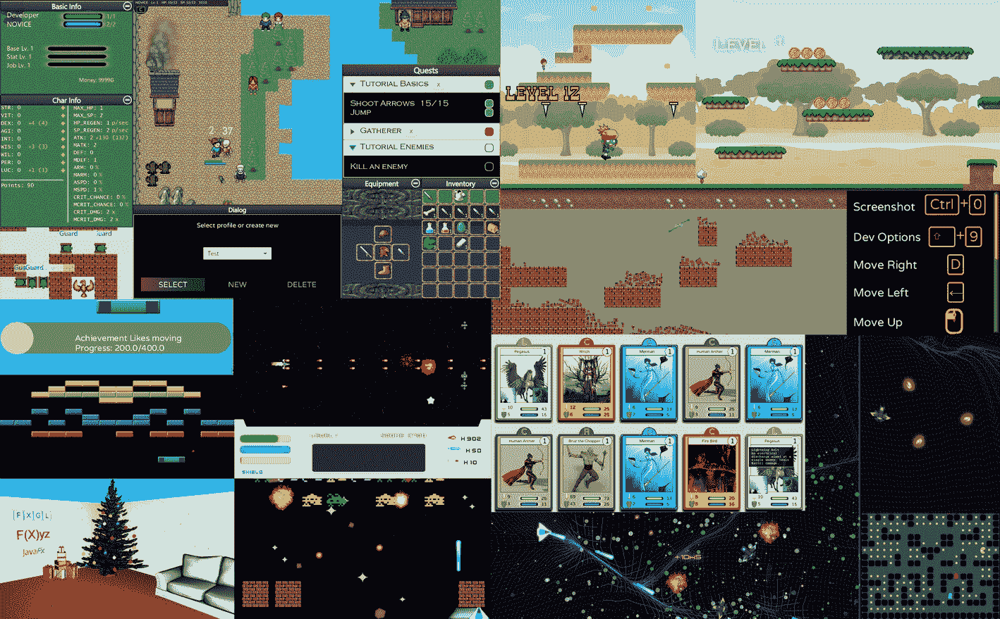
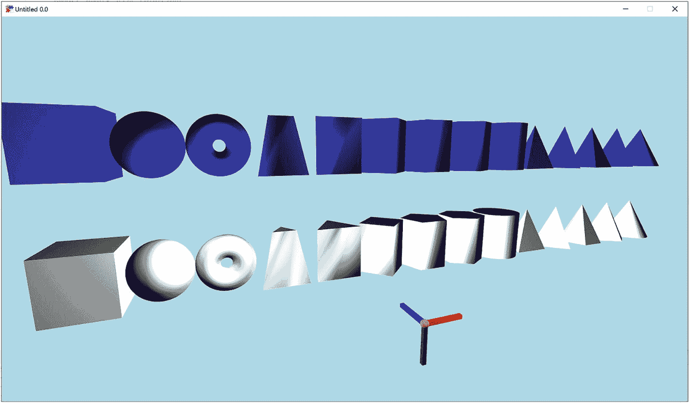

# 1. 引言

JavaFX 是一个用于 Java 的现代高性能图形用户界面（GUI）工具包。它在包括桌面、移动和嵌入式在内的多种平台上提供硬件加速支持，从而能够开发跨平台应用程序。然而，要使用 JavaFX 高效地开发游戏，需要掌握许多特定领域的知识。为了满足这一需求，FXGL 游戏引擎扩展了 JavaFX，并引入了对真实游戏开发技术的支持（示例如图 1-1 所示）。这些技术包括实体-组件模型、寻路、物理、粒子系统、精灵表动画以及许多其他功能。因此，JavaFX 开发者可以借助 FXGL 更快速、更高效地制作游戏，并轻松将游戏打包为原生平台镜像，包括 Android 和 iOS。

一张截图展示了使用 FXGL 游戏引擎开发的不同游戏场景的截图合集。

图 1-1

使用 FXGL 开发的游戏截图合集

FXGL 游戏引擎是完全开源的。这使得任何 FXGL 用户都可以向项目贡献新功能或修复 Bug。该项目完全由社区用户（无论是个人还是公司）支持。在撰写本书时，所有开发团队成员都是利用自己的业余时间参与该项目。项目源代码可在 [`https://github.com/AlmasB/FXGL`](https://github.com/AlmasB/FXGL) 找到。

FXGL 项目最初只是一组代码片段，用于帮助在布莱顿大学讲授游戏开发课程，并协助制作 YouTube 教程。随着代码库的增长，将其开发成一个公开可用的 Java 游戏引擎变得顺理成章。因此，FXGL 并非旨在与现有引擎竞争，而是为 Java 用户提供一种替代工具，用于开发高性能应用程序。在开发的早期阶段，以下软件项目对引擎的架构和实现产生了重要影响：Unity、Unreal Engine、libGDX、jMonkey、CRYENGINE、X-Ray、OpenJK、Duality 和 Phaser。

底层基础设施和渲染引擎由 JavaFX GUI 工具包提供。JavaFX 是 Swing 的现代替代品，用于在 Java 中构建富客户端应用程序。它与许多个人和公司合作开发，不断改善其在广泛支持平台上的表现。基于这种支持，FXGL 能够开发出真正跨平台且具备众多游戏特定功能的游戏。

FXGL 提供的功能可分为以下几类：内部框架服务、游戏逻辑、人工智能（AI）、物理、游戏玩法、输入、用户界面（UI）、图形、音频、文件输入输出（IO）、网络、硬件访问和外部工具集成。这些类别可描述如下：

一张截图展示了多个不同颜色的 3D 形状。

图 1-2

FXGL 中 3D 场景的示例

*   内部框架服务提供对引擎计时器和生命周期的访问，允许监听特定事件并从代码中适当处理它们。

*   在 FXGL 中，游戏逻辑通过实体-组件模型（定义游戏对象）和游戏世界（作为游戏对象的容器）的组合来实现。与任何流行的数据结构一样，游戏世界允许查询和过滤数据（游戏对象），以满足开发者的需求。

*   AI 类别主要包括两个领域：导航和行为。导航系统允许游戏对象在游戏关卡中自行寻路而不穿过障碍物，而行为逻辑则为游戏对象提供一定水平的人工智能。

*   物理类别也可分为两类：碰撞检测和刚体模拟。前者用于判断两个游戏对象是否重叠，进而可用于各种游戏机制，例如拾取医疗包。后者也称为刚体动力学，可用于模拟游戏对象交互的一系列物理属性，例如摩擦力、弹性和密度。

*   在游戏玩法方面，FXGL 提供了成就系统、游戏内通知、快速反应事件以及内置小游戏等功能。

*   用户输入通过用户操作（例如射击或跳跃）与触发器（例如空格键或鼠标左键）之间直观的绑定集来处理。相同的 API（可从代码访问的函数集）可用于在移动设备上运行时模拟物理触发器。

*   引擎的用户界面部分构建在 JavaFX 之上，并增强了其视觉控件。例如，FXGL 提供了游戏内菜单、覆盖层、摄像机动画和九宫格 UI 生成。

*   FXGL 的图形功能也构建在 JavaFX 提供的功能之上，因为该引擎使用了 JavaFX 的渲染管线。改进之处包括高度可定制的粒子系统、运行时纹理操作以及可编辑的自定义 3D 形状。图 1-2 展示了一个包含一些内置 3D 形状的示例应用程序。

*   音频服务允许开发者播放短音效和长背景音乐文件。它还控制某些音频属性，例如音量。

*   所有 IO 调用都由文件系统服务封装，这简化了对本地存储（无论是在桌面端还是移动端）的写入和读取操作。

*   网络服务是通过扩展标准 JDK（Java 开发工具包）功能来实现的。例如，高级接口不区分 TCP 和 UDP 连接，并提供统一的方式来处理传入和传出的消息。

*   硬件支持包括 Xbox 和 PlayStation 手柄，以及来自 Gluon Attach 项目的一系列 API，该项目提供了对移动硬件功能的访问。

*   最后，支持以下外部工具：用于构建游戏世界关卡的 Tiled 地图编辑器，以及用于轻松生成游戏角色之间复杂对话的 FXGL 对话编辑器。

为完整起见，应注意这些功能并非 FXGL 独有。进入 Java 游戏开发世界时，还有其他替代方案。特别是，流行的框架和引擎包括 libGDX 和 jMonkeyEngine。与 FXGL 相比，这两个项目都开发了更长的时间。这些项目为 Java 游戏开发者提供了大量成熟的游戏开发工具。FXGL 项目并非旨在与这些技术竞争；相反，其目标是提供一种替代的 Java 游戏开发方法，特别是针对那些已经熟悉 JavaFX API 集的 JavaFX 开发者。

本书旨在适合 Java 和/或 JavaFX 的初学者和专家，他们希望使用 FXGL 开发应用程序和游戏，同时提升 Java 和/或 JavaFX 技能。完成本书后，读者将能够：

*   运用高级 Java 和 JavaFX 概念
*   用通用编程语言（如 Java）解释和实现现实世界的游戏开发概念
*   使用 FXGL 游戏引擎开发专业的跨平台（包括桌面和移动端）应用程序和游戏
*   在 FXGL 中设计和实现涉及物理、人工智能和图形系统的可扩展游戏特定功能
*   使用特定于平台的原生镜像部署 JavaFX 和 FXGL 应用程序和游戏

本书的高层概述如下：

*   在第 2 章中，我们涵盖了本书中将使用的 Java 和 JavaFX 的必要概念。我们还将向读者介绍 FXGL 游戏引擎及其开发工作流程。
*   我们在第 3 章开始游戏开发之旅，开发一个类似于 Pong 的街机游戏。通过这个过程，我们将学习 FXGL 中用于创建游戏世界强大抽象的实体-组件模型。
*   我们在第 4 章中以此为基础，使用物理引擎开发一个平台游戏，并学习碰撞检测。
*   第 5 章通过开发一个类似 Pac-Man 的迷宫动作游戏，涵盖了游戏 AI 的一个重要概念。
*   第 6 章将讨论许多与图形和渲染相关的视觉复杂功能。在本章中，我们还涵盖了 FXGL 中的 UI 元素和动画系统。
*   第 7 章专注于可以使用 FXGL 开发的通用（非游戏）应用程序。这些包括商业应用程序、图形编辑器和可视化工具。本章还涵盖了 JavaFX 和 FXGL 应用程序（包括游戏）的打包，以便后续部署给最终用户。
*   最后，在第 8 章中，我们进行总结，并讨论可以在本书内容基础上构建的未来项目的细节。

每一章都以前一章为基础逐步构建，并引入一个新主题。本书中提供的代码片段要么是 Java 代码，要么是类似于 Java 的伪代码。给出的示例使用了以下软件版本：

*   Java 17
*   JavaFX 17
*   FXGL 17
*   IntelliJ 2021

下一章将提供一个使用这些技术的示例设置项目。鼓励读者使用相同或更新的版本。但是，应注意较新版本的工作流程可能不完全相同，可能需要进行一些调整。就此而言，让我们开始使用 FXGL 17 的旅程。

