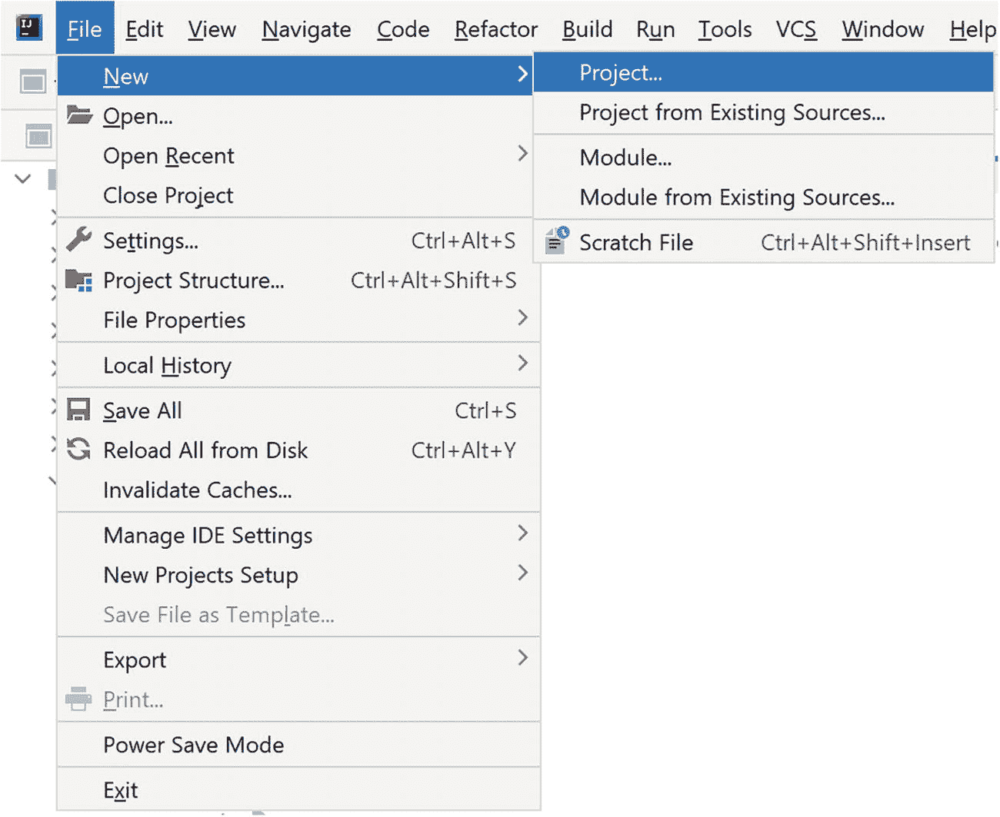
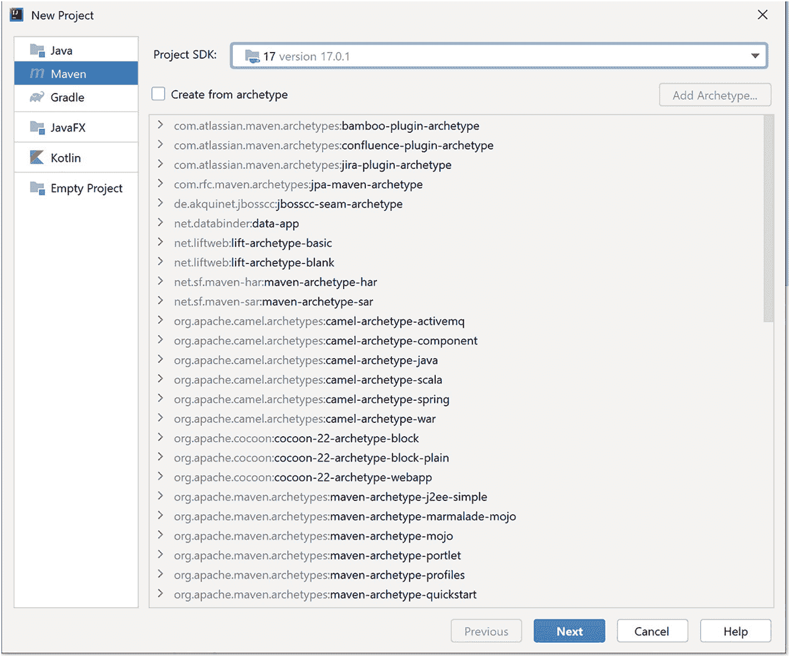
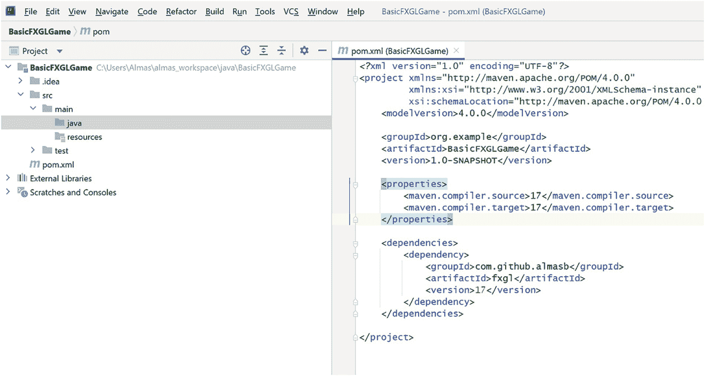
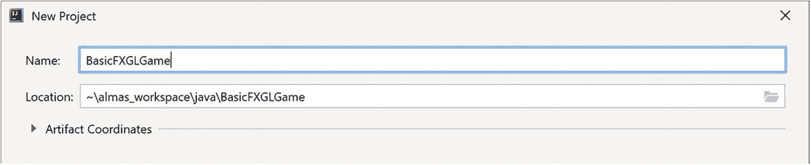
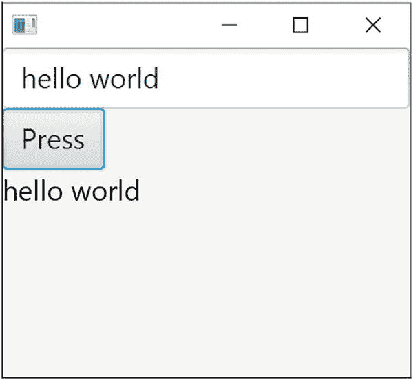
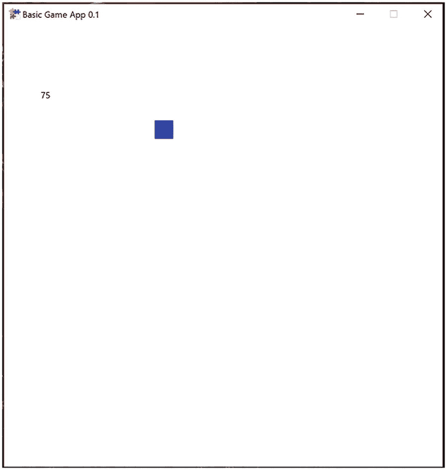

# 2. 必要概念

在本章中，我们将涵盖 Java、JavaFX 和 FXGL 的基本概念。理解本书内容需要这些知识。更具体地说，我们将了解：

*   Java 理论——类和方法
*   如何使用 IntelliJ 和 Maven 添加外部依赖
*   如何创建一个带有基本用户界面控件的简单 JavaFX 应用程序
*   如何创建一个简单的 FXGL 应用程序

熟悉这些主题的读者可以跳过本章或其中的部分内容。

## Java 基础

本节将介绍（或为已熟悉这些概念的读者复习）Java 基础知识，包括类和方法。我们将考虑如何创建类、实例级（非静态）变量和类级（静态）变量。我们还将复习如何向类添加非静态和静态方法。最后，我们将简要讨论继承和 `@Override` 注解。


### 类

在 Java 及许多其他编程语言中，类是对象的模板。类用于建模或表示某些抽象概念（例如碰撞检测处理器）或现实世界中的事物（例如椅子）。定义一个类非常简单：

```
class Chair { }
```

上述代码通常存储在名为 `Chair.java` 的文件中，文件名需与类名保持一致。需要注意的是，根据 Java 语言的命名规范，类名以大写字母开头。如果类名包含多个单词，每个单词的首字母也需大写。因此，如果我们为另一种类型的椅子（例如“木椅”）定义一个类，其名称应为 `WoodenChair`。

创建类的实例被称为实例化该类：

```
Chair diningChair = new Chair();
```

在上述代码中，我们创建了一个名为 `diningChair` 的 `Chair` 类实例。该实例（`diningChair`）也被称为对象。对象就是任何类的实例。类可以包含变量，用于存储信息。当在类定义中添加变量时，该类的每个实例都会拥有这些变量的独立副本，并可对其进行操作。例如，我们可以添加一个 `int` 类型的变量（注意，`int` 或整数表示整数值）：

```
class Chair {
int cost;
}
```

变量 `cost` 可用于存储与单个椅子价格相关的信息：

```
diningChair.cost = 50;
```

因此，椅子 `diningChair` 的价格为 50 个货币单位。我们可以从同一个类创建另一个对象，并为其赋予不同的价格值：

```
Chair officeChair = new Chair();
officeChair.cost = 75;
```

请注意，尽管对象 `diningChair` 和 `officeChair` 都是 `Chair` 类型，但它们是两个不同的对象：椅子 `diningChair` 价格为 50，而椅子 `officeChair` 价格为 75。如果我们更改 `diningChair` 中某些变量的值，`officeChair` 中变量的值不会随之改变。这是面向对象编程的核心概念之一：每个对象都拥有自己的属性。

我们刚刚讨论了属于对象的变量。这种仅影响其所属实例的变量被称为实例级变量。在上述示例中，变量 `cost` 就是一个实例级变量。除了实例级变量，我们还可以定义类级变量，即静态变量。顾名思义，它们属于类，而非对象。请看以下示例：

```
class Chair {
static int quality;
int cost;
}
```

我们刚刚创建了一个名为 `quality` 的 `int` 类型静态变量，它属于 `Chair` 类，而非 `Chair` 类型的某个具体对象。由于 `quality` 是类级变量，我们通常通过类而非对象来访问它：

```
Chair.quality = 3;
```

我们会注意到，所有访问 `quality` 值的对象都将读取到相同的值 3，因为只有一个静态变量。在介绍了“类”概念的基础知识后，我们现在来讨论方法。

### 方法

如前所述，变量允许我们按对象或按类存储信息。方法则允许我们定义可执行的操作，同样也是按对象或按类进行。我们将继续使用 `Chair` 类，并为其添加一个名为 `move` 的简单方法，如代码清单 2-1 所示。

```
class Chair {
static int quality;
int cost;
void move(int x, int y) {
// some code
}
}
代码清单 2-1
向类中添加方法的示例
```

方法（在某些语言中称为函数或过程）是可重用的代码块。一个方法定义包含四个重要部分：

*   **名称：** 我们的方法名称为“move”。通常，名称应是一个有意义的动作，因为方法定义了操作——即对象能做什么。按照惯例，方法名以小写字母开头，后续每个单词的首字母大写。

*   **返回类型：** 在我们的示例中，返回类型是 `void`，这是一个特殊关键字，表示该方法不返回任何值。可以使用任何类型（例如 `int`）替代“void”，以表示该方法返回该类型的值。从方法中返回值是从方法中提取结果的一种常见方式。但在我们的示例中，没有预期需要返回的有意义结果，因此我们使用了“void”。

*   **参数列表：** 参数列表显示了方法在被调用时期望接收的参数类型。在上述示例中，有两个 `int` 类型的预期参数：`x` 和 `y`。使用参数是开发者向方法传递信息的一种常见方式。

*   **方法体：** 最后，方法体是位于该方法的花括号“{”和“}”之间的代码块。在我们的示例中，为了清晰说明，我们添加了“// some code”占位符来代替方法体。方法体本质上是在方法被调用时（即方法被调用时）将要执行的代码。

与变量可以是静态的一样，方法也可以使用 `static` 关键字作为前缀，在这种情况下，它们属于类。假设我们希望有一个操作，能够确定通过调用 `new Chair()` 生成的椅子对象的材质。假设在我们的抽象模型中，所有椅子都具有相同的材质（某种名为 `Material` 的类型），那么 `c1` 的材质和 `c2` 的材质之间就没有区别。如果是这种情况，我们可以简单地在 `Chair` 类中添加一个名为 `getMaterial()` 的静态方法，如代码清单 2-2 所示。

```
class Chair {
static int quality;
int cost;
static Material getMaterial() {
// some code
}
void move(int x, int y) {
// some code
}
}
代码清单 2-2
静态方法的示例
```

与静态变量的访问方式类似（即通过类访问），静态方法也以这种方式访问。因此，要调用新创建的方法，我们会编写 `Chair.getMaterial()`，而不是 `c1.getMaterial()`。如果在后续开发中，我们决定每把椅子可以拥有自己的材质，那么我们可以从方法中移除 `static` 关键字。此时该方法变为非静态方法，我们需要像之前一样通过 `c1.getMaterial()` 或 `c2.getMaterial()` 来调用它。

有时，定义具有相似但不同类型特征的类会很有用。例如，考虑餐椅和办公椅。这两者都属于椅子类型，并且它们确实有一些共同的功能，但它们的全部功能集并不相同。一个简单的例子是，办公椅有轮子，而餐椅没有。如果我们为这两种椅子分别创建单独的类，例如：

```
class DiningChair
class OfficeChair
```


那么我们会很容易发现需要重复编写大量代码。显然，这并不是一个理想的解决方案。为了避免这种情况，Java 作为一种语言，提供了继承特性。简单来说，我们可以定义一个名为 Chair 的“超类型”，在其中保留椅子应具备的所有通用功能，然后定义从 Chair “扩展”而来的“子类型”（或子类）`DiningChair` 和 `OfficeChair`，它们只包含与自身相关的代码。因此，通过这种方法，我们可以为代码重复这个小问题提供一个简洁干净的解决方案。要扩展一个类，可以编写如下代码：

```
class DiningChair extends Chair {}
class OfficeChair extends Chair {}
```

在某些情况下，两个（或更多）子类型可能共享功能（比如方法），但每个子类型都以自己的方式执行该功能。针对这个概念，我们换一个与椅子无关的例子。许多教科书常用的是 `Animal` 类及其 `speak()` 方法。

```
class Animal {
void speak() { }
}
```

假设 Animal 有两个子类型：Cat 和 Dog。两种类型都能说话，但方式不同。因此，虽然功能保持不变，但 Animal 的每个子类型执行该功能的方式却各不相同。

要在 Java 中实现此功能，我们有 `@Override` 注解，可以将其添加到方法上，以表明它覆盖了超类型类中同名的方法。让我们看一下清单 2-3 中的具体示例。首先要注意的是 `speak()` 方法上的 `@Override` 注解。它告诉开发者，`Cat` 类中的 `speak()` 覆盖了 `Animal` 类中的 `speak()` 方法。因此，当用户调用 `speak()` 时，如果调用对象是 `Cat` 类型，则会调用 `Cat` 类中的 `speak()` 方法，而不是 `Animal` 类中的那个。在构建 FXGL 游戏时，我们会在几个地方使用“覆盖”；因此，随着本书的深入，这个概念会变得越来越重要。当用到时，我们会提醒读者其用法。

```
class Dog extends Animal {
@Override
void speak() {
// 汪汪叫
}
}
class Cat extends Animal {
@Override
void speak() {
// 喵喵叫
}
}
清单 2-3
使用 @Override 注解的示例
```

回顾了 Java 基础知识后，我们现在将考虑如何向 Java 项目添加库。库是可重用的预构建代码集合，是解决已知问题的常见方式。它们是任何开发者工具库中的重要工具。

## 添加外部库

在本节中，我们将了解如何使用 IntelliJ IDE 和内置的 Maven 支持向 Java 项目添加外部库。我们还将下载任何必要的软件。如果你的系统上尚未安装 JDK 17，可以从 [`https://jdk.java.net/17/`](https://jdk.java.net/17/) 下载适用于所有主流操作系统平台（Windows、macOS 和 Linux）的通用 JDK 17 版本。你只需下载相应的“.zip”文件并将其解压到所选位置即可。

在 Java 中，有几种方法可以向项目添加外部库。你可以使用 Maven、Gradle 或独立的“.jar”文件。我们将考虑一种使用 Maven 的常见方法，Maven 是一种依赖管理（或构建）工具。构建工具负责下载软件项目所需的依赖项（例如 JavaFX 和 FXGL），这样开发者就不必浪费时间手动安装这些外部库。现代开发工具，如 IntelliJ 编辑器（可从 [`www.jetbrains.com/idea/`](http://www.jetbrains.com/idea/) 获取），已经内置了 Maven 支持。为了简化任务，我们将使用此支持并创建一个简单的 Maven 项目。



截图显示了一个菜单栏，其中文件、新建和项目被高亮显示。

图 2-1

IntelliJ IDE 2021.2.2（社区版）中的文件 ➤ 新建 ➤ 项目菜单

打开 IntelliJ，然后按照图 2-1 所示的菜单选项进行操作。具体来说，选项是文件 ➤ 新建 ➤ 项目。此序列将引导你进入图 2-2 中的窗口。首先要确保你的项目 SDK 显示为 17（或更高版本）。在图 2-2 中，项目 SDK（靠近图像顶部）显示版本 17.0.1，即 JDK 17。如果你选择了不同的版本，可以单击下拉菜单并选择适当的版本，或单击“添加 JDK”，然后导航到你从之前给出的链接下载的 JDK 安装文件夹。现在，既然你已选择了合适的 JDK，我们将选择左侧的 Maven 项目（见图 2-2），然后单击“下一步”。在下一个窗口中，我们可以为项目命名，例如 JavaFXApp（或 BasicFXGLGame），并选择源代码将存储的目录。



新建项目向导窗口的截图显示左侧有 6 个选项卡，其中 Maven 被选中。选项卡右侧是一个标签“项目 SDK”，显示 17，版本 17.0.1。中央是原型列表，底部有 4 个按钮，其中“下一步”按钮被高亮显示。

图 2-2

IntelliJ IDE 中的新建项目向导窗口

图 2-3 显示了如何修改 Maven 项目详细信息。一旦你为项目选择了名称，可以保持其他部分为默认值不变。单击“完成”。IntelliJ 现在应该会生成一个项目，其视图类似于图 2-4，但没有 FXGL 依赖项。你在右侧看到的 xml 文件称为项目对象模型文件，简称 pom.xml。此文件包含构建项目所需的信息。更高级的 pom 文件还可能包含与如何管理项目资源、测试生成的构建、生成项目文档甚至部署最终产物相关的额外详细信息。



窗口截图，包含菜单栏、工具和构建项目的信息。窗口右侧是标题为 pom.xml 的代码行。

图 2-4

带有生成的项目对象模型 (pom.xml) 和额外 FXGL 依赖项的 Maven 项目



标题为“新建项目”的窗口截图显示两个文本框，标签和内容如下：1. 名称：Basic FXGL game。2. 位置：tilde slash Almas underscore workspace slash java slash basic FXGL game。

图 2-3

IntelliJ 中的新建 Maven 项目窗口

现在，我们将通过在 pom.xml 文件中添加一个新的“dependency”项，向项目添加 FXGL 依赖项（其中包含 JavaFX）。一个依赖项包含三个部分：组 ID、工件名称和版本。这些详细信息在图 2-4 和清单 2-4 中给出。

按照图 2-4 所示添加依赖项后，单击 IntelliJ IDE 右上角的“刷新”图标，FXGL 依赖项将自动下载并可供使用。

```

com.github.almasb
fxgl

清单 2-4
在 xml 文件中添加 FXGL 依赖项
```

此步骤完成了使用 IntelliJ 和 Maven 向 Java 项目添加外部库的操作。现在，我们将继续使用 JavaFX 和 FXGL 构建一些示例应用程序。


## JavaFX 基础：创建简单应用

在本节中，我们将构建一个包含常用控件的简单 JavaFX 应用。首先从一个最小化的 JavaFX 应用开始，其代码如清单 2-5 所示。

```
import javafx.application.Application;
import javafx.scene.Scene;
import javafx.scene.layout.Pane;
import javafx.stage.Stage;
public class FXApp extends Application {
@Override
public void start(Stage stage) throws Exception {
stage.setScene(new Scene(new Pane(), 800, 600));
stage.show();
}
public static void main(String[] args) {
launch(args);
}
}
清单 2-5
一个最小化的 JavaFX 应用
```

要运行此应用，请使用 IntelliJ，首先在项目的 `src/main/java` 目录下创建一个名为 `FXApp` 的新 Java 类——该目录在图 2-4 中已高亮显示。然后将清单 2-5 中的代码输入到新创建的 FXApp.java 文件中。最后，右键单击该文件并选择“运行”，即可看到这个简单的 JavaFX 应用运行起来。

这段源代码中有几个关键点需要注意：

*   任何 JavaFX 应用都会有一个继承 Application 的类。通常这个类也包含程序的入口点——`public static void main(String[] args)`，它仅调用 `launch(args)`。这是大多数 JavaFX 和 FXGL 应用的启动方式。

*   另一个重要的代码片段是 `start()` 方法，它重写了 Application 类中同名的方法。这是一个必要的重写，允许开发者在启动阶段配置他们的 JavaFX 应用。在我们的例子中，我们做了两件事：将场景设置到舞台对象上，并显示舞台。Stage 类是对操作系统特定窗口的抽象，我们将在第 6 章讨论图形时更详细地介绍。

现在我们将介绍基础知识，包括用户输入、交互和输出。为此，我们在之前的最小示例基础上，扩展出清单 2-6 中的独立示例，它给出了如何实现这三个基本概念的总体思路。

```
import javafx.application.Application;
import javafx.scene.Parent;
import javafx.scene.Scene;
import javafx.scene.control.Button;
import javafx.scene.control.TextField;
import javafx.scene.layout.VBox;
import javafx.scene.text.Font;
import javafx.scene.text.Text;
import javafx.stage.Stage;
public class BasicApp extends Application {
@Override
public void start(Stage stage) throws Exception {
stage.setScene(new Scene(createContent()));
stage.show();
}
private Parent createContent() {
TextField input = new TextField();
Text output = new Text();
Button button = new Button("Press");
button.setOnAction(e -> {
output.setText(input.getText());
});
VBox root = new VBox(input, button, output);
root.setPrefSize(600, 600);
return root;
}
public static void main(String[] args) {
launch(args);
}
}
清单 2-6
一个基础 JavaFX 应用的示例
```

清单 2-6 中主要的增加部分是 `createContent()` 方法——其他部分都相当直接。我们将详细分析这个方法：

1.  首先，我们创建 TextField，用于接收用户输入。

2.  接着，我们创建 Text 对象，它将作为向用户输出某些信息的载体。

3.  在输出之后，我们创建一个名为“Press”的按钮，并提供一些在按钮按下时要执行的代码。具体来说，这段代码会将输入的文本数据设置到输出文本中。

4.  最后，我们创建根布局容器，它定义了控件（输入框、按钮、输出文本）在屏幕上的放置方式。这里我们使用 VBox，它会将其内部的所有控件垂直排列。我们还为此布局容器设置了首选大小，以便窗口自动调整以适应此尺寸。然后，该方法返回根容器，将其设置为场景的根节点。

如果你运行该应用（和之前一样，右键单击 Java 文件并点击运行），结果应类似于图 2-5 中的截图。正如我们所见，项目的布局是垂直排列的。



程序输出显示一个窗口。窗口右上角有最小化、最大化和关闭选项。在左上角，从上到下，窗口显示一行文本，内容为 hello world，接着是一个标有 press 的按钮，以及一行文本，内容为 hello world。

图 2-5

一个包含三个基本控件（TextField、Button 和 Text 对象）的基础 JavaFX 应用

最后一个要考虑的主要特性是 JavaFX 属性以及如何将一个属性绑定到另一个属性。在 JavaFX 中，属性充当值的包装器。这些值可以是任何类型。一些常用的类型包括 int、double、boolean、String 和通用 Object。与我们已经熟悉的 int 等类型相比，使用属性的主要优势在于绑定的属性会自动更新。假设我们有一个要求用户输入姓名的 `TextField` 和一个仅复制用户输入姓名的 Text 对象。如果没有属性，我们必须监听 `TextField` 上的每个按键事件，然后在用户输入或删除字符时手动更新 Text 对象：

```
text.setText(textField.getText());
```

使用属性，上述功能可以以一种简洁的方式实现，只需调用一次，无需为任何监听器编写代码。

```
text.textProperty().bind(textField.textProperty());
```

至此，本书后续将使用的基本 JavaFX 特性概述完毕。现在我们将专注于构建一个简单的 FXGL 应用。


## FXGL 基础：创建简单应用

在本节中，我们将构建一个简单的 FXGL 应用程序，这将是我们的第一个游戏示例。在开始之前，让我们先为这个简单游戏定义一些需求：

1.  游戏将有一个 600×600 的窗口。

2.  屏幕上有一个玩家，由一个蓝色矩形表示。

3.  玩家可以通过键盘上的 W、S、A 和 D 键进行控制。

4.  用户界面（UI）由一段文本表示，显示玩家移动了多少像素。

5.  当玩家移动时，UI 文本将相应地更新。

在本节结束时，你应该拥有一个类似于图 2-6 所示的游戏。虽然这看起来可能远非一个真正的游戏，但它的开发将帮助你理解 FXGL 中的基本特性。因此，完成本节后，你将能够构建各种简单的游戏。



程序输出显示一个标题为“basic game app 0 dot 1”的窗口。窗口右上角有最小化、最大化和关闭选项。窗口内显示一个彩色方块，方块左上角显示数字 75。

图 2-6

一个基本的 FXGL 应用程序

第一步是准备我们的开发环境。从上一节中，你应该已经清楚如何创建新项目并将 FXGL 添加为依赖项；因此，我们将立即从在 `src/main/java` 中为我们的游戏创建一个 Java 包开始。为简单起见，我们将该包命名为“tutorial”。在该包中，我们将创建一个名为“BasicGameApp”的 Java 类。在 JavaFX 应用程序中，通常会在包含 `main()` 方法的类名后附加“App”。这使其他开发人员能够轻松识别应用程序的主入口点。为了让你后续步骤更轻松，我们可以打开 BasicGameApp 类并添加清单 2-7 中给出的常用 FXGL 导入。

```
import com.almasb.fxgl.app.GameApplication;
import com.almasb.fxgl.app.GameSettings;
import com.almasb.fxgl.dsl.FXGL;
import com.almasb.fxgl.entity.Entity;
import com.almasb.fxgl.input.Input;
import com.almasb.fxgl.input.UserAction;
import javafx.scene.input.KeyCode;
import javafx.scene.paint.Color;
import javafx.scene.shape.Rectangle;
import javafx.scene.text.Text;
import java.util.Map;
清单 2-7
常用的 FXGL 导入
```

现在我们可以开始编写一些代码了。要开始使用 FXGL，你的“App”类需要继承 `GameApplication` 并重写 `initSettings()` 方法：

```
public class BasicGameApp extends GameApplication {
@Override
protected void initSettings(GameSettings settings) {}
}
```

一旦你添加了 extends 子句，你的 IDE 很可能会提示自动生成重写的方法。在接下来的小节中，我们将介绍其他常用的重写方法。

通过 `initSettings()` 方法和 `settings` 对象，你可以更改大量游戏设置，并以适合你需求的方式配置应用程序。然而，目前我们只想尽快让应用程序运行起来。因此，我们暂时先不处理这个方法。我们要添加的下一个方法是：

```
public static void main(String[] args) {
launch(args);
}
```

我们已经在前面章节中介绍过一个简单的 JavaFX 应用程序，所以这个方法并不新鲜。这是启动普通 JavaFX 应用程序的方式。由于 FXGL 与 JavaFX 无缝集成，这也是启动 FXGL 应用程序的方式。随着你阅读本书的深入，你会意识到 FXGL 就是带有游戏开发功能的 JavaFX。此时，你的应用程序已经可以运行，因此你可以启动游戏（通常通过右键单击并选择“运行”），查看结果，最后关闭它。

### 需求 1：打开窗口

现在，我们将依次实现之前定义的每个需求，来开发我们的游戏。第一个需求是打开一个 600×600 的窗口，我们的游戏将在其中运行。正如我们之前提到的，要更改设置，我们可以使用 `initSettings()` 方法，如清单 2-8 所示。

```
@Override
protected void initSettings(GameSettings settings) {
settings.setWidth(600);
settings.setHeight(600);
settings.setTitle("Basic Game App");
settings.setVersion("0.1");
}
清单 2-8
initSettings() 方法允许提供游戏特定的设置
```

使用 settings 对象，我们将宽度和高度更改为 600。我们还设置了游戏的标题和版本。一旦设置完成，这些设置在运行时就不能更改。这并不意味着你不能调整应用程序的大小；相反，这意味着提供的值是启动时要使用的设置。现在你可以在 IDE 中点击“运行”，这将启动一个 600×600 的窗口，窗口标题为“Basic Game App”。至此，我们完成了第一个需求。你可以看到这个需求实现起来很简单。你会注意到其他需求也并不复杂。这就是 FXGL 的总体目标：让 JavaFX 游戏开发变得显著更简单、更高效。

### 需求 2：添加玩家

第二个需求是向我们的游戏添加一个玩家对象。我们将在 `initGame()` 中完成此操作。简而言之，这是你设置游戏开始前需要准备好的所有内容的地方。代码如清单 2-9 所示。

```
private Entity player;
@Override
protected void initGame() {
player = FXGL.entityBuilder()
.at(300, 300)
.view(new Rectangle(25, 25, Color.BLUE))
.buildAndAttach();
}
清单 2-9
initGame() 方法允许设置游戏及其游戏对象
```

我们将逐一方法地慢慢讲解。

*   有一个名为 player 的实例级字段，类型为 Entity。实体本质上是一个游戏对象，正如 FXGL 所定义的那样。这是现阶段你需要了解的全部内容。我们将在下一章更详细地讨论实体。`FXGL.entityBuilder()` 是构建实体的首选方式。

*   接下来，通过调用 `.at()`，我们可以设置正在创建的实体的位置。在本例中，x = 300，y = 300。请注意，任何实体的位置都在其左上角点，与 JavaFX 中一样。

*   然后，我们告诉实体构建器创建我们实体的视图。具体来说，我们希望使用 Rectangle 对象，它直接来自 JavaFX，所以这里没有新内容。我们通过提供宽度 = 25、高度 = 25 和颜色来构造矩形。这里需要注意的重要一点是，你可以使用任何 JavaFX Node 而不是矩形来传递给 view 方法，从而提供实体的视觉表示。

*   最后，我们调用 `.buildAndAttach()`。通过调用 build，我们可以获得正在构建的实体的引用。至于 attach 部分，它方便地允许我们将构建好的实体直接添加到游戏世界中。我们将在下一章介绍游戏世界及其含义。现在，只需将其视为实体存在和生存的地方。

如果你现在运行游戏，你应该会在窗口中心附近看到一个蓝色矩形。这一步完成了需求 2。


### 需求 3：添加输入

需求 3 指出，我们应该能够使用键盘控制玩家实体。现在我们将着手处理用户输入。在 FXGL 中，通常所有与输入相关的代码都放在 `initInput()` 方法中。清单 2-10 中的代码展示了如何添加一个输入动作。FXGL 中的大部分输入都以此格式处理。开发者需要指定一个动作（要运行的代码），然后将其绑定到一个触发器（鼠标按钮、按键或某种其他输入方式，例如控制器）。

```
@Override
protected void initInput() {
FXGL.onKey(KeyCode.D, () -> {
player.translateX(5); // 向右移动 5 像素
});
}
清单 2-10
initInput() 方法允许将用户输入绑定到游戏内动作
```

让我们逐行分析清单 2-10。通过调用 FXGL 的 `onKey()` 方法，我们实际上是在说“当某个键被按下时，执行一个动作”。在这个例子中，按键是 `KeyCode.D`。同样，如果你之前使用过 JavaFX，你就会知道这些与标准事件处理器中使用的键码完全相同。正如你所注意到的，要使用 FXGL 的大部分功能，你只需调用 `FXGL.***`，你的 IDE 就会通过自动补全显示所有可能的函数。

回顾需求，我们希望执行的动作是移动玩家。所以当按下 D 键时，我们希望将玩家向右移动。我们调用 `player.translateX(5)`，这会将实体的 X 坐标移动 5 像素。请注意，“translate”是计算机图形学（以及 JavaFX）中使用的术语，意思是移动。你会注意到 FXGL 的 API 非常简洁。这种简洁的 API 在 FXGL 的上下文中通常被称为 DSL（领域特定语言）。如果我们使用静态导入，这甚至可以进一步简化。你可以通过添加以下导入行来静态导入 FXGL 调用：

```
import static com.almasb.fxgl.dsl.FXGL.*;
```

既然我们已经熟悉了单个按键的输入处理，那么剩下的代码就很简单了，如清单 2-11 所示。

```
@Override
protected void initInput() {
FXGL.onKey(KeyCode.D, () -> {
player.translateX(5); // 向右移动 5 像素
});
FXGL.onKey(KeyCode.A, () -> {
player.translateX(-5); // 向左移动 5 像素
});
FXGL.onKey(KeyCode.W, () -> {
player.translateY(-5); // 向上移动 5 像素
});
FXGL.onKey(KeyCode.S, () -> {
player.translateY(5); // 向下移动 5 像素
});
}
清单 2-11
所有四个方向的 initInput() 方法实现
```

填充了 `initInput()` 方法后，需求 3 就完成了。

### 需求 4：添加 UI

下一个需求是 UI，我们在 `initUI()` 方法中处理，如清单 2-12 所示。

```
@Override
protected void initUI() {
Text textPixels = new Text();
textPixels.setTranslateX(50); // x = 50
textPixels.setTranslateY(100); // y = 100
FXGL.getGameScene().addUINode(textPixels); // 添加到屏幕
}
清单 2-12
initUI() 方法允许在屏幕上添加用户界面对象
```

在清单 2-12 中，`Text` 类是直接来自 JavaFX 的。实际上，对于大多数 UI 对象，我们直接使用 JavaFX 控件，因为没必要重复造轮子。你应该注意到，当我们向世界添加实体时，游戏场景会自动识别该实体具有关联的视图。因此，游戏场景会神奇地将该实体添加到场景图中。对于 UI 对象，我们需要负责将它们添加到场景图中，而调用 `getGameScene().addUINode()` 正是为了完成这个操作。稍后我们将处理 UI 更新，例如玩家移动的像素数。

### 需求 5：更新 UI

为了完成最后一个需求，我们将使用一个游戏变量。在 FXGL 中，可以从游戏的任何部分访问和修改游戏变量。从某种意义上说，它是一个全局变量，其作用域绑定到 FXGL 游戏实例。此外，这些变量可以像 JavaFX 属性一样进行绑定。我们首先创建这样一个变量：

```
@Override
protected void initGameVars(Map vars) {
vars.put("pixelsMoved", 0);
}
```

上述代码创建了一个名为“pixelsMoved”的游戏变量，初始值为 0。请注意，FXGL 会根据初始值自动推断变量的类型，在本例中为整数。例如，如果我们使用 0.0，那么游戏变量的类型将是双精度浮点数。接下来，我们需要在玩家移动时更新该变量。我们可以在代码的输入处理部分执行此操作。

```
FXGL.onKey(KeyCode.D, () -> {
player.translateX(5); // 向右移动 5 像素
FXGL.inc("pixelsMoved", +5);
});
```

你可以对剩下的移动动作（即向左、向上和向下）执行相同的操作。最后一步是将我们之前创建的 UI 文本对象绑定到变量 `pixelsMoved`。最终，这允许 FXGL 根据 `pixelsMoved` 的值自动更新 UI，这样我们就不需要手动更新 UI 了。在 `initUI()` 中，一旦我们创建了 `textPixels` 对象，就可以执行以下操作：

```
textPixels.textProperty().bind(FXGL.getWorldProperties().intProperty("pixelsMoved").asString());
```

进一步解释一下，我们获取 `textPixels` UI 对象的文本属性，并将其绑定到 `pixelsMoved` 值，由于该值是整数，需要先将其转换为字符串。这是我们对这个示例所做的最后一项更改，现在你应该拥有一个简单的 FXGL 游戏了。

我们还有很多领域没有涉及，例如资源加载、物理、AI 和图形——这些以及其他特性将在我们继续阅读本书的过程中讨论。

## 本章小结

在本章中，我们介绍了本书中使用的必要概念。我们回顾了关于类和方法的 Java 基础知识。我们了解了如何创建一个类来模拟抽象或现实世界中的对象，以及方法如何为这些类提供功能。接下来，我们使用 IntelliJ 通过内置的 Maven 支持添加了 JavaFX（通过 FXGL）外部库，这简化了流程。随后，我们使用 JavaFX 库创建了一个包含三个 UI 控件（文本输出、文本输入和按钮）的简单应用程序。最后，我们使用 FXGL 库作为外部依赖，实现了一个简单的游戏演示。该演示向我们展示了如何使用输入、创建实体（即游戏对象），以及如何与 JavaFX UI 控件交互。在下一章中，我们将进一步了解实体以及它们如何帮助我们创建复杂的游戏世界。

