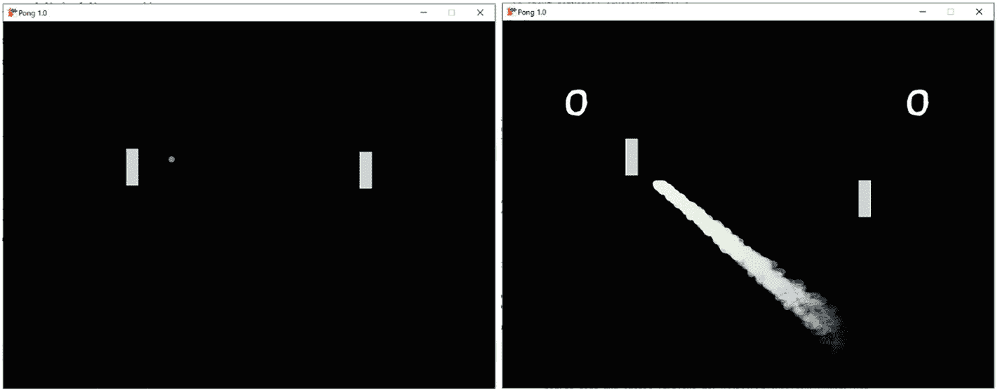

# 3. 实体-组件案例研究：开发 Pong 游戏

在本章中，我们将开始游戏开发之旅，开发一个 Pong 街机游戏的克隆版。我们将开始构建你关于使用 FXGL 进行游戏开发过程的知识。通过这个过程，我们将学习：

*   实体及其如何表示游戏对象
*   组件及其如何向实体添加数据和行为
*   游戏世界以及如何执行查询以访问世界中的特定实体

游戏对象构成了任何游戏的基本概念。游戏越大，游戏对象的实现就应该越健壮，以便能够适当地扩展。具有深厚面向对象编程背景的开发者可能会陷入一个陷阱，即继承最终与游戏对象功能交织在一起，导致软件架构的可扩展性降低。继承倾向于垂直层次结构，在一系列用例中（包括中小型游戏）非常有益。然而，实体-组件模型倾向于水平层次结构，它提供了自身的优势，并且可能更适合大型游戏项目。随着你继续阅读本章，这种模型的好处将变得更加清晰。我们将从定义什么是实体开始。


## 实体

你能想到的任何游戏对象（例如：玩家、敌人、金币、子弹、强化道具、墙壁、泥土、武器、宝箱等等）都是一个实体。就其本身而言，实体只是一个通用对象。如果不添加组件，几乎无法区分一个实体与另一个实体。组件是关键对象，它们携带数据和行为，以独特的方式定义每个实体。我们将在接下来的章节中对此进行详细阐述。

在 FXGL 中，有许多有用的方法可以在实体上调用。

这些方法包括：

*   `addComponent(Component c)` / `removeComponent(Component c)` – 允许添加新组件和移除现有组件。

*   `setProperty(String key, Object value)` – 允许向实体添加任何类型的变量。如果你不想创建新组件来存储数据，这些变量会很有用。可以通过调用 `getInt(String key)`、`getString(String key)`、`getObject(String key)` 以及其他类似方法来获取这些值。

*   `getComponents()` – 检索附加到实体上的所有组件列表。

*   `getPosition()` / `setPosition(Point2D p)` – 返回/设置实体在二维空间中的位置。更具体地说，该方法会请求 `TransformComponent` 提供/修改此数据（正如我们所知，实体本身不存储任何数据，只有它们的组件才存储数据）。

*   `translate(Point2D vector)` – 按给定的向量移动实体。更具体地说，该方法会请求 `TransformComponent` 修改位置数据。

*   `isVisible()` / `setVisible(boolean b)` – 检查实体是否正在被绘制/如果设置为 false，则实体将不会被绘制。

*   `getType()` / `setType(Object type)` – 允许检索/设置实体类型。通常，枚举类值被用作类型。

现在我们对实体是什么以及可以在其上调用哪些方法有了更多了解，接下来我们将考虑组件。

## 作为数据的组件

在本节中，我们将看到组件如何向实体添加数据。在 FXGL 的实体-组件模型上下文中，组件是实体的一部分。一个组件可以携带你希望实体拥有的任何数据。我们将借助在 Java 中向类定义添加实例字段的类比来说明：

```
class Car {
    int moveSpeed;
    Color color;
}
```

因此，如果我们想为汽车添加一个新属性（字段），就必须修改前面的类。在游戏中，对象通常会“失去”旧属性并“获得”新属性，这意味着我们需要有能力在运行时修改前面的类，而这并非易事。

此外，让我们考虑使用 `Car` 类更深层次的含义。在前面的例子中，`Car` 类包含一个实例字段 `moveSpeed`，这意味着它可以移动。现在，想象一下我们还有一个玩家角色，它也可以移动。我们可以将 `moveSpeed` 添加到 `Player` 类中。然而，还有许多其他可移动的游戏对象。所以也许我们应该改用继承，并创建一个抽象类 `MovableGameObject`，或者更好的做法是使用一个接口 `Movable`。这固然很好，但如果我们想要一个有时可以移动、有时不能移动的对象呢？例如，由玩家控制的汽车可以移动，但它自身不能移动。我们不能简单地移除一个接口，然后在需要时再把它附加回去。很明显，使用继承无法简单地解决这个问题。

好消息是，在计算机科学中，对于任何给定的问题通常都有不止一种解决方案。继承并不是我们武器库中唯一的工具。你可能听说过“组合优于继承”这句话。嗯，组件在某种程度上是这种思想的极端版本。它们允许我们在运行时附加字段和方法——这有多酷？考虑一下代码清单 3-1 中的代码片段，它是 `Car` 类的等价物，但用组件重写了：

```
Entity entity = new Entity();
entity.addComponent(new MoveSpeedComponent());
entity.addComponent(new ColorComponent());
// 一段时间后，我们可以让它不可移动
entity.removeComponent(MoveSpeedComponent.class);
// 或者像普通字段一样更改组件的值
entity.getComponentOptional(ColorComponent.class).ifPresent(color -> {
    color.setValue(Color.RED);
});
代码清单 3-1
添加、移除和访问组件的示例
```

我们可以看到，使用组件，我们之前描述的继承问题变得非常容易解决。这种问题表示方式的改变是计算机科学中的一种常用技术。这种技术允许以一种易于通过已知方法解决的方式重新表述问题。此外，使用组件的方法将逻辑隔离在每个组件中。这意味着我们可以将这个 `MoveSpeedComponent` 附加到任何实体上。我们还可以向一个实体添加任意数量的不同组件，这使得这种方法具有高度的可扩展性。最后，它严格遵守单一职责原则（来自 SOLID 原则），因此所有需要修改（例如，移动）的更改都将发生在一个单独的组件内，即 `MoveSpeedComponent`。

在创建实体时，最好预先添加你知道实体将拥有的所有组件。然后，你可以根据需要启用或禁用组件。例如，`CollidableComponent` 表示一个实体可以与其他物体碰撞。假设我们不希望实体在创建时可碰撞。与其在实体变得可碰撞时再添加组件，不如在创建时直接添加组件并将其值设置为 false（在 Java 中，我们可以使用 `var` 代替左侧的类型来缩短代码）：

```
var c = new CollidableComponent();
c.setValue(false);
entity.addComponent(c);
```

在考虑了组件作为数据容器的情况之后，我们现在将重点讨论如何使用组件向实体添加行为。

## 作为行为的组件

组件也可以携带行为信息，从而有效地让实体获得新方法并能够执行新操作。事实上，我们之前演示了将带有数据的组件类比为向类添加字段。嗯，添加带有行为的组件就像添加方法。组件允许我们让实体做一些事情，从而定义实体的行为。在我们创建自定义组件之前，让我们先考虑一下 `Component` 类中的内置方法：

*   `onAdded()` – 当组件被添加到实体时，会调用此回调函数。

*   `onRemoved()` – 当组件从实体中移除时，会调用此回调函数。

*   `onUpdate()` – 每帧都会调用此回调函数，以允许组件更新其逻辑。

*   `pause()` – 调用此方法将使组件暂停处理 `onUpdate()` 中的任何更新。

*   `resume()` – 调用此方法将使组件恢复处理 `onUpdate()` 中的任何更新。

任何继承自 `Component` 的自定义类都可以访问这些方法。


### 自定义组件

假设我们希望实体成为一个升降机，以便能将玩家运送到山顶。如前所述，为实体添加这样一个组件非常简单：

```
entity.addComponent(new LiftComponent());
```

现在我们来考虑如何实现这样一个 `LiftComponent`。每个组件都有一个 `onUpdate()` 方法，可以通过重写该方法来提供所需的功能（回顾第 2 章，此类重写需使用 `@Override` 注解）。利用这种方法，我们可以构建如代码清单 3-2 所示的代码片段，该代码能将任何实体变成一个升降机。

```
public class LiftComponent extends Component {
LocalTimer timer = ...;
boolean isGoingUp = true;
double speed = ...;
@Override
public void onUpdate(double tpf) {
if (timer.elapsed(duration)) {
isGoingUp = ! isGoingUp;
timer.capture();
}
entity.translateY(isGoingUp? -speed * tpf : speed * tpf);
}
}
代码清单 3-2
一个自定义组件的示例
```

你会注意到，我们无需初始化对“entity”对象的引用。当我们将其添加到实体时，它会自动注入到组件中。这个 FXGL 特性极大地简化了开发者的代码。另一个避免额外样板代码的类似特性是组件注入。

### 组件注入

自动组件注入的常见用例是当你拥有两个组件，即 `Component1` 和 `Component2`，并且 `Component2` 需要持有对 `Component1` 的引用时：

```
class Component1 extends Component {}
class Component2 extends Component {
private Component1 comp;
}
```

在这种情况下，你无需在 `Component2` 类中手动获取对 `Component1` 的引用。在组件添加过程中，FXGL 会自动将该对象注入到“comp”字段中。需要注意的是，`Component2` 要求实体上必须存在 `Component1`，因为它是一个依赖项。对所需组件的检查会在组件添加时执行，因此确保所有必需的组件都先被添加至关重要。在这种情况下，`Component1` 应该在 `Component2` 之前添加；否则，FXGL 会抛出异常。

让我们看看这种注入在实践中是如何工作的。例如，代码清单 3-3 展示了一个非常简单的玩家组件，其中包含 up、down、left 和 right 方法，这些方法允许对组件将要附加到的实体进行基本移动。

```
public class PlayerComponent extends Component {
// 注意：此组件是自动注入的
private TransformComponent position;
private double speed = 0;
@Override
public void onUpdate(double tpf) {
speed = tpf * 60;
}
public void up() {
position.translateY(-5 * speed);
}
public void down() {
position.translateY(5 * speed);
}
public void left() {
position.translateX(-5 * speed);
}
public void right() {
position.translateX(5 * speed);
}
}
代码清单 3-3
自定义 PlayerComponent 类的一种可能实现
```

我们可以看到，`position` 组件字段无需由开发者初始化。它会被 FXGL 自动注入，从而减少了代码量。

现在我们已经熟悉了实体和组件，是时候关注游戏世界了，实体的大部分生命周期都在其中度过。

## 游戏世界

在本节中，我们将探讨游戏世界及其在有效存储和查询实体方面的重要性。游戏世界本质上是一个包含实体的数据结构。它还负责向游戏添加、更新和移除实体。最后，游戏世界提供了通过各种条件查询（在世界中搜索）实体的方法。例如，你可以收集所有敌人实体，以便在玩家升级时提升它们的属性。

将实体添加到世界也意味着将其添加到游戏中。同样，要从游戏中移除实体，你只需将其从世界中移除即可。当前在游戏世界中的实体被视为活跃的——它们的 `isActive()` 方法将返回 true。让我们创建一个简单的实体并将其添加到游戏世界中。在 FXGL 中，可以通过调用以下代码获取游戏世界：

```
var world = FXGL.getGameWorld();
```

要向其中添加一个实体 `e`，我们可以调用：

```
world.addEntity(e);
```

最后，要移除该实体，我们可以调用：

```
world.removeEntity(e);
```

我们现在能够根据需要添加和移除实体了，因此我们的注意力转向了游戏世界查询。

### 世界查询

在世界中搜索实体的方法有多种。通常，这类方法以“get”开头。例如，`getEntitiesByType()`。我们将依次考虑通过以下方式查询实体：

*   **类型（需要 TypeComponent）** – 假设我们有一个名为 EntityType 的枚举，其中包含游戏中实体的有效类型。你可能希望获取游戏中的所有敌人，以便对它们应用增益效果，以此增加游戏难度。这可以通过调用以下代码轻松实现：

*   **ID（需要 IDComponent）** – 假设你可能允许复制实体。这对于 RPG 类游戏尤其有用，因为这类游戏中会有大量重复的物品。所以，我们可能在游戏世界中放置了多个熔炉，并为每个熔炉分配了一个唯一的 IDComponent。虽然名称相同，都是“熔炉”，但其数字 ID 是不同的。以下代码允许你获取游戏中特定熔炉的引用：

```
var enemies = world.getEntitiesByType(EntityType.ENEMY);
```

*   **单例** – 在很多情况下，某种类型的实体只有一个，例如玩家。通过遍历实体列表来获取我们想要的那个可能会很麻烦。因此，FXGL 为此提供了一个便捷的实用查询方法：

```
var forge123 = world.getEntityByID("Forge", 123);
```

*   **随机** – 在游戏玩法中，引入一些随机元素是很常见的。如果你想要炸毁一个随机敌人，可以通过以下方式获取一个随机的敌人实体：

```
var player = world.getSingleton(EntityType.PLAYER);
```

*   **组件** – 某些游戏内逻辑只应在具有特定组件的实体上执行。获取所有具有给定组件的实体的一种简单方法如下：

```
var enemy = world.getRandom(EntityType.ENEMY);
```

*   **范围** – 游戏玩法逻辑，例如触发与实体的交互或对半径范围内的实体造成伤害，可以通过查询特定范围内的实体来实现。例如，为了实现这一点，我们可以调用以下方法来获取位于给定矩形内（完全或部分）的所有实体：

```
var entsWithComponent = world.getEntitiesByComponent(MyComponent.class);
```

*   **过滤器** – 最后，我们可以通过使用自定义过滤器以通用方式查询实体。过滤器本质上是一个函数，给定一个实体，返回 true 或 false。如果结果为 true，则该实体将被添加到要返回的列表中：

```
var entitiesNearby = world.getEntitiesInRange(new Rectangle2D(5, 5, 30, 30));
```

```
var entsWithHP10 = world.getEntitiesFiltered(e -> e.getInt("hp") == 10);
```

至此，我们完成了对游戏世界及其与存储和查询实体相关的常见功能的概述。现在，我们将专注于在一个 Pong 克隆游戏中运用这些概念。


## 乒乓球

在本节中，我们将为乒乓球游戏构建一个功能完整的基础框架。最新的完整源代码可在 [`https://github.com/AlmasB/FXGLGames`](https://github.com/AlmasB/FXGLGames) 的 Pong 目录下获取。

在图 3-1（左侧图片）中，您可以看到本节将要实现的效果。诚然，游戏看起来略显单调，但您将学到大量关于 FXGL 工作流程的基础知识，以及如何以预设模板化的方式开发游戏。在本书后续内容中，您将学习图形效果，这将使您能够在保留原始美学风格的同时，让这款经典游戏在视觉上更具吸引力，如图 3-1（右侧图片）所示。



2 张截图。左侧屏幕显示有两条细小的垂直粗线。右侧屏幕显示有两条细小的垂直粗线、两个小圆圈以及一条带有图形效果的线条。

图 3-1

乒乓球游戏：简单版（左）与视觉增强版（右）

开发 FXGL 游戏时，一种常见的方法是首先定义我们计划在游戏中拥有的实体类型。在本示例中，我们将包含：

*   玩家球拍
*   敌方球拍
*   球
*   墙壁

如前所述，我们可以将类型定义为 Java 枚举。枚举是一种特殊的类，只能包含一组预定义的值。要实现这些类型，我们可以创建以下枚举：

```
public enum EntityType {
PLAYER_BAT, ENEMY_BAT, BALL, WALL
}
```

### 构建玩家球拍组件

正如我们之前通过组件所看到的，FXGL 架构提倡关注点分离，这使我们能够独立开发游戏的各个部分。这种独立开发的方式为开发者提供了灵活性，并符合单一职责原则（该原则是 SOLID 原则的一部分；更多信息可在网上找到）。基于此，我们可以通过先创建组件来开始构建游戏实体的逻辑。在乒乓球游戏中，有两种类型的对象：球拍（挡板）和球。我们将从 `BatComponent` 开始，其代码如代码清单 3-4 所示。

```
import com.almasb.fxgl.dsl.FXGL;
import com.almasb.fxgl.entity.component.Component;
import com.almasb.fxgl.physics.PhysicsComponent;
public class BatComponent extends Component {
private static final double BAT_SPEED = 420;
protected PhysicsComponent physics;
public void up() {
if (entity.getY() >= BAT_SPEED / 60)
physics.setVelocityY(-BAT_SPEED);
else
stop();
}
public void down() {
if (entity.getBottomY() <= FXGL.getAppHeight() - (BAT_SPEED / 60))
physics.setVelocityY(BAT_SPEED);
else
stop();
}
public void stop() {
physics.setLinearVelocity(0, 0);
}
}
代码清单 3-4
BatComponent 类
```

与其他代码片段一样，我们将全面介绍 `BatComponent` 类。首先，我们注意到三个导入语句，它们使我们能够使用 FXGL 方法、通用的 `Component` 类以及 `PhysicsComponent` 类。要创建自定义组件，我们需要定义名称（此处为 `BatComponent`）并继承 `Component`。

接下来，我们定义球拍移动速度的静态常量值。将其声明为顶部的变量（而不是在代码中作为硬编码值使用），以便于查找该变量并在以后需要修改时轻松更改其值。进一步思考，如果您希望在运行时能够更改变量，甚至可以移除“final”修饰符。

随后，我们声明了 `PhysicsComponent` 的引用，命名为 physics。回顾本章“组件注入”小节，我们不需要显式地为引用赋值，因为在实体创建过程中，组件会被自动注入。当然，我们需要记得在 `BatComponent` 之前添加 `PhysicsComponent`，这样才能正常工作。我们稍后会回到实体创建的话题，并了解在实体工厂类中如何添加组件。

`BatComponent` 包含三个方法：up、down 和 stop。顾名思义，这些方法负责移动球拍实体。这些方法的实现很简单——我们检查是否可以向某个方向（例如向上）移动，如果检查通过则执行移动。更具体地说，当尝试向上移动时，我们检查球拍实体的 Y 值是否低于游戏（屏幕）的顶部。这意味着有足够的空间可以移动。如果检查失败，我们通过将速度设置为 0 来停止球拍移动。

此时，您可能会对检查中使用的 `BAT_SPEED / 60` 而非直接使用 `BAT_SPEED` 感到疑惑。原因在于秒与帧之间的差异。我们通过物理系统设置的速度是每秒 `BAT_SPEED`，而通常每秒有 60 帧。因此，每帧我们实际移动 `BAT_SPEED / 60` 个单位。所以，我们使用这个值来检查是否有足够的空间供球拍实体移动。

### 构建敌方球拍组件

通过继承（回顾第 2 章中关于继承的概念）我们的 `BatComponent`，我们可以定义 `EnemyBatComponent`，因为大部分功能保持不变。`EnemyBatComponent` 可以编写为代码清单 3-5 所示。

```
import com.almasb.fxgl.entity.Entity;
public class EnemyBatComponent extends BatComponent {
private Entity ball;
@Override
public void onUpdate(double tpf) {
if (ball == null) {
ball = entity.getWorld()
.getSingletonOptional(EntityType.BALL)
.orElse(null);
} else {
moveAI();
}
}
private void moveAI() {
Entity bat = entity;
boolean isBallToLeft = ball.getRightX()  bat.getY()) {
if (isBallToLeft)
down();
else
up();
} else {
stop();
}
}
}
代码清单 3-5
EnemyBatComponent 类
```

让我们详细分析这个类。您会注意到，这个新组件包含一个对球实体的引用。在游戏开始时，我们不知道球是否存在于游戏世界中，因此我们在 `onUpdate()` 方法内部初始化球。为此，我们检查球是否为 `null`——在游戏开始时，它确实是 `null`。因此，在游戏运行的第一帧，将从游戏世界中查询球实体类型并进行初始化。通过查看 if 语句的“else”分支，我们可以看到调用了 `moveAI()`。本质上，从高层次来看，这个检查可以描述如下：如果球引用为 null，则初始化它；否则，移动敌方球拍。

敌方球拍的 AI 实际上非常简单。我们将在未来的章节中考虑复杂的 AI。目前，我们的 AI 仅由几个 if 语句组成。我们知道敌方球拍位于屏幕的右侧。因此，我们首先检查球是否在球拍的左侧，这意味着我们应该尝试接住它。相反，如果球在右侧，那么我们希望避免碰到它；否则，球会在球拍和墙壁之间不断弹跳，持续为玩家球拍加分。完成此检查后，唯一剩下的事情就是判断球是在敌方球拍的上方还是下方，并相应地移动。


### 构建球体组件

在考虑了双方球拍的逻辑之后，让我们深入探讨球体实体的逻辑。下一个组件是 `BallComponent`，如代码清单 3-6 所示。

```
import com.almasb.fxgl.entity.component.Component;
import com.almasb.fxgl.physics.PhysicsComponent;
import javafx.geometry.Point2D;
import static com.almasb.fxgl.dsl.FXGL.*;
import static java.lang.Math.*;
public class BallComponent extends Component {
private PhysicsComponent physics;
@Override
public void onUpdate(double tpf) {
limitVelocity();
checkOffscreen();
}
private void limitVelocity() {
// 防止 X 方向移动过慢
if (abs(physics.getVelocityX()) < 5 * 60) {
physics.setVelocityX(signum(physics.getVelocityX()) * 5 * 60);
}
// 防止 Y 方向移动过快
if (abs(physics.getVelocityY()) > 5 * 60 * 2) {
physics.setVelocityY(signum(physics.getVelocityY()) * 5 * 60);
}
}
// 我们使用了物理引擎，因此球有可能被推过墙壁而超出屏幕，故需进行此检查
private void checkOffscreen() {
var viewport = getGameScene().getViewport();
var visArea = viewport.getVisibleArea();
if (getEntity().getBoundingBoxComponent().isOutside(visArea)) {
physics.overwritePosition(new Point2D(
getAppWidth() / 2,
getAppHeight() / 2
));
}
}
}
代码清单 3-6
BallComponent 类
```

我们再次从查看 `onUpdate()` 方法开始。这里的高级逻辑是：(a) 限制球的速度，使其不会突破音障；(b) 检查球是否移出屏幕。每个元素都在各自的方法中实现。`limitVelocity()` 方法检查当前在 X 轴和 Y 轴上的速度，并根据需要将值限制在 `5 * 60`。最后，我们检查球是否在屏幕之外。这种情况可能发生，因为我们使用物理引擎来运行刚体的碰撞模拟。在某些情况下，球可能会被猛烈地推向墙壁，以至于正确的数值计算会将其置于墙壁之外。因此，有一个简单的检查来测试球是否在视口的可见区域内。如果不是，则只需将球移动到屏幕中心。

### 构建实体工厂

一旦我们通过前面提到的组件实现了每个实体的逻辑，就可以继续添加一个工厂来生成实体。工厂代码如代码清单 3-7 所示，其中有两个值得注意的方法。

```
import com.almasb.fxgl.entity.Entity;
import com.almasb.fxgl.entity.EntityFactory;
import com.almasb.fxgl.entity.SpawnData;
import com.almasb.fxgl.entity.Spawns;
import com.almasb.fxgl.entity.components.CollidableComponent;
import com.almasb.fxgl.physics.BoundingShape;
import com.almasb.fxgl.physics.HitBox;
import com.almasb.fxgl.physics.PhysicsComponent;
import com.almasb.fxgl.physics.box2d.dynamics.BodyType;
import com.almasb.fxgl.physics.box2d.dynamics.FixtureDef;
import javafx.scene.paint.Color;
import javafx.scene.shape.Rectangle;
import static com.almasb.fxgl.dsl.FXGL.entityBuilder;
import static com.almasb.fxgl.dsl.FXGL.getip;
public class PongFactory implements EntityFactory {
@Spawns("ball")
public Entity newBall(SpawnData data) {
PhysicsComponent physics = new PhysicsComponent();
physics.setBodyType(BodyType.DYNAMIC);
physics.setFixtureDef(new FixtureDef().density(0.3f).restitution(1.0f));
physics.setOnPhysicsInitialized(() -> physics.setLinearVelocity(5 * 60, -5 * 60));
return entityBuilder(data)
.type(EntityType.BALL)
.view(new Circle(5, 5, 5))
.bbox(new HitBox(BoundingShape.circle(5)))
.with(physics)
.with(new CollidableComponent(true))
.with(new BallComponent())
.build();
}
@Spawns("bat")
public Entity newBat(SpawnData data) {
boolean isPlayer = data.get("isPlayer");
PhysicsComponent physics = new PhysicsComponent();
physics.setBodyType(BodyType.KINEMATIC);
return entityBuilder(data)
.type(isPlayer ? EntityType.PLAYER_BAT : EntityType.ENEMY_BAT)
.viewWithBBox(new Rectangle(20, 60, Color.LIGHTGRAY))
.with(new CollidableComponent(true))
.with(physics)
.with(isPlayer ? new BatComponent() : new EnemyBatComponent())
.build();
}
}
代码清单 3-7
PongFactory 类
```

我们可以看到工厂类中的两个方法是 `newBall()` 和 `newBat()`。我们将按顺序查看它们，从 `newBall()` 方法开始。在方法内部，我们找到了一个物理组件，因为我们的球是由物理世界驱动的。我们需要初始化物理属性，赋予球某些特性：

*   将主体类型设置为动态（其他类型包括静态（无移动）和运动学（玩家控制移动）），这允许物理世界完全控制实体的移动。

*   设置物理实体的密度和恢复系数（弹性程度）。

*   在物理初始化时，设置实体的线速度，使球开始移动。

配置好物理组件后，我们将注意力转向实体构建器。构建器允许我们快速设置实体的许多属性。更具体地说，我们将类型设置为 `EntityType.BALL`，视图设置为半径为 5 的圆形，碰撞盒设置为半径为 5 的圆形形状。实体的所有组件都可以通过调用 `with()` 轻松设置。使用此方法，我们添加了物理、可碰撞和球体组件。至此，我们的球体实体构建完成，现在我们开始构建球拍实体。

回想一下，我们有两种不同类型的球拍实体：玩家和敌人。在构建球拍实体时，我们可以传递一个额外的参数来告诉工厂我们想要使用的是玩家球拍还是敌人球拍。因此，`newBat()` 方法中的第一行代码将此参数提取为一个布尔值 `isPlayer`。与 `newBall()` 方法一样，我们也需要一个物理组件。然而，该组件的配置更简单——我们只需将主体类型设置为运动学，以便玩家或 AI 可以控制球拍，而不是由物理世界控制。剩下的就是使用实体构建器构建球拍实体。我们根据布尔值 `isPlayer` 设置实体类型。视图是一个简单的 JavaFX 矩形，它也用于通过 `viewWithBBox()` 方法自动为实体生成碰撞盒。与球体实体一样，我们设置了可碰撞和物理组件。最后，使用布尔值 `isPlayer`，我们可以确定应该使用 `BatComponent` 还是 `EnemyBatComponent`。


### 构建应用程序类

最后，将 Pong 游戏所有部分整合在一起的类是 `PongApp`。这里我们将详细讨论这个类，但随着你阅读本书后续章节，我们通常会省略那些琐碎的细节，因为这些内容在前几章中已经介绍过了。

和之前一样，我们首先处理所有导入语句，如代码清单 3-8 所示。

```
import com.almasb.fxgl.animation.Interpolators;
import com.almasb.fxgl.app.GameApplication;
import com.almasb.fxgl.app.GameSettings;
import com.almasb.fxgl.core.math.FXGLMath;
import com.almasb.fxgl.entity.Entity;
import com.almasb.fxgl.entity.SpawnData;
import com.almasb.fxgl.input.UserAction;
import com.almasb.fxgl.physics.CollisionHandler;
import com.almasb.fxgl.physics.HitBox;
import com.almasb.fxgl.ui.UI;
import javafx.scene.input.KeyCode;
import javafx.scene.paint.Color;
import javafx.util.Duration;
import java.util.Map;
import static com.almasb.fxgl.dsl.FXGL.*;
代码清单 3-8
PongApp 类导入语句
```

接下来，我们将创建继承自 `GameApplication` 的 `PongApp` 类。该代码片段如代码清单 3-9 所示。我们将提供基本设置，例如游戏的标题和版本。回想一下，游戏宽度和高度默认自动设置为 800×600；不过，你可以根据需要设置自己的值。我们还会在 `main` 方法中添加游戏的入口点。

```
public class PongApp extends GameApplication {
@Override
protected void initSettings(GameSettings settings) {
settings.setTitle("Pong");
settings.setVersion("1.0");
}
public static void main(String[] args) {
launch(args);
}
}
代码清单 3-9
PongApp 类继承自 GameApplication
```

我们需要在整个游戏过程中访问玩家球拍，以便控制它。因此，创建一个实例级变量来存储玩家球拍组件是合理的：

```
private BatComponent playerBat;
```

一旦我们有了玩家球拍的引用，我们就希望能够上下移动它。换句话说，我们需要输入处理，这将在 `initInput()` 中处理，如代码清单 3-10 所示。你可以看到，我们没有使用前一章介绍的简单输入处理方式，而是通过 `getInput()` 方法采用了一种稍微复杂的方法。使用这个扩展 API 的好处是，我们可以使用 `onActionBegin()`、`onAction()` 和 `onActionEnd()` 回调函数，它们分别在按键首次按下（动作开始）、按住（动作中）和释放（动作结束）时触发。

```
@Override
protected void initInput() {
getInput().addAction(new UserAction("Up") {
@Override
protected void onAction() {
playerBat.up();
}
@Override
protected void onActionEnd() {
playerBat.stop();
}
}, KeyCode.W);
getInput().addAction(new UserAction("Down") {
@Override
protected void onAction() {
playerBat.down();
}
@Override
protected void onActionEnd() {
playerBat.stop();
}
}, KeyCode.S);
}
代码清单 3-10
PongApp 类输入处理
```

正如我们所见，我们的输入非常简单——我们只需要 W 和 S 键来让玩家球拍上下移动。`onAction()` 回调在按键被按住时调用，而 `onActionEnd()` 在按键释放时调用。这些调用正是我们让球拍移动或停止所需要的。

我们还需要跟踪玩家和敌人（或玩家 2）的得分。我们可以通过创建 FXGL 变量来实现这一点。回想一下，它们几乎就像你在 Java 中创建的普通变量，但具有额外的功能，例如能够监听其变化并绑定到它们。本质上，FXGL 变量就像 JavaFX 属性。在代码清单 3-11 中，我们创建了两个 FXGL 变量：`player1score` 和 `player2score`，两者都初始化为 0。稍后，在 `initGame()` 中（同样在代码清单 3-11 中），我们监听这些变量的变化，并根据值宣布获胜者——需要得 11 分才能赢得游戏。

```
@Override
protected void initGameVars(Map vars) {
vars.put("player1score", 0);
vars.put("player2score", 0);
}
@Override
protected void initGame() {
getWorldProperties().addListener("player1score", (old, newScore) -> {
if (newScore == 11) {
showGameOver("Player 1");
}
});
getWorldProperties().addListener("player2score", (old, newScore) -> {
if (newScore == 11) {
showGameOver("Player 2");
}
});
getGameWorld().addEntityFactory(new PongFactory());
getGameScene().setBackgroundColor(Color.rgb(0, 0, 5));
initScreenBounds();
initGameObjects();
}
代码清单 3-11
初始化游戏和变量
```

此外，我们还添加了之前实现的 `PongFactory`，并将游戏背景颜色设置为 RGB 0, 0, 5，这非常接近黑色。`initGame()` 中有三个方法我们还没有介绍：`showGameOver()`、`initScreenBounds()` 和 `initGameObjects()`。你应该能够通过它们的名称猜到这些方法的作用。我们将按照代码清单 3-12 中的顺序逐一介绍它们。

```
private void showGameOver(String winner) {
getDialogService().showMessageBox(winner + " won! Demo over\nThanks for playing", getGameController()::exit);
}
private void initScreenBounds() {
Entity walls =
entityBuilder()
.type(EntityType.WALL)
.collidable()
.buildScreenBounds(150);
getGameWorld().addEntity(walls);
}
private void initGameObjects() {
Entity ball = spawn("ball", getAppWidth() / 2 - 5, getAppHeight() / 2 - 5);
Entity bat1 = spawn("bat", new SpawnData(getAppWidth() / 4, getAppHeight() / 2 - 30).put("isPlayer", true));
Entity bat2 = spawn("bat", new SpawnData(3 * getAppWidth() / 4 - 20, getAppHeight() / 2 - 30).put("isPlayer", false));
playerBat = bat1.getComponent(BatComponent.class);
}
代码清单 3-12
游戏玩法方法
```

`showGameOver()` 方法的实现很简单。我们显示一个消息框，显示谁赢得了游戏，一旦消息框被关闭，我们就退出游戏。接下来，在 `initScreenBounds()` 中，我们希望围绕屏幕创建墙壁，以便球可以撞击这些墙壁并弹回游戏的可玩区域。

代码清单 3-12 中的最后一个方法是 `initGameObjects()`，我们在这里简单地创建了游戏中可以看到的所有实体：球和两个球拍。我们还要记得在创建球拍时传递 `isPlayer` 布尔变量。这是因为我们的工厂需要知道哪个是玩家球拍，哪个是敌人球拍。该方法的最后一行获取了 `BatComponent` 的引用，以初始化我们之前定义的 `playerBat` 变量。


现在剩下的工作就是设置游戏的物理部分。由于我们所有的实体都附加了 `PhysicsComponent`，它们由物理世界管理（更多内容将在下一章介绍）。这意味着我们对物理世界所做的任何设置也会影响这些实体。例如，默认情况下，物理世界会施加一个典型的重力向量，该向量在 X 轴上的速度为 0，在 Y 轴上的速度约为 10。在乒乓球游戏中我们不需要这个；否则，球会严重偏向屏幕底部。让我们考虑清单 3-13 中 `initPhysics()` 的实现。

```
@Override
protected void initPhysics() {
getPhysicsWorld().setGravity(0, 0);
getPhysicsWorld().addCollisionHandler(new CollisionHandler(EntityType.BALL, EntityType.WALL) {
@Override
protected void onHitBoxTrigger(Entity a, Entity b, HitBox boxA, HitBox boxB) {
if (boxB.getName().equals("LEFT")) {
inc("player2score", +1);
} else if (boxB.getName().equals("RIGHT")) {
inc("player1score", +1);
}
}
});
}
清单 3-13
初始化物理
```

在该方法中，我们做的第一件事就是有效禁用任何方向上的重力。然后我们设置碰撞处理器——这些是当两种实体类型之间发生碰撞时被调用的回调方法。例如，在上述情况中，我们希望知道球与墙壁之间何时发生碰撞。基于此，我们可以相应地增加玩家 1 或玩家 2 的分数。要添加碰撞处理器，我们首先通过传递两种实体类型（这里是 `EntityType.BALL` 和 `EntityType.WALL`）来构造它，然后重写 `onHitBoxTrigger()` 方法，以便检查球击中了墙壁的哪一侧。至于增加分数变量，这很简单——我们调用 `inc()` 方法并提供要增加变量的数值。

### 游戏结构回顾

至此，乒乓球克隆游戏的实现就完成了。你现在应该能够运行应用程序，并看到我们在本节中实现的游戏的完整功能。现在我们将简要回顾一下所构建应用程序的高级架构，以作总结：

*   有三个组件：`PlayerBatComponent`、`EnemyBatComponent` 和 `BallComponent`。每个组件都附加到不同的实体上，分别将它们（及其行为）转变为玩家球拍、敌方球拍和球。

*   （始终）有一个名为 `PongFactory` 的实体工厂类。它的唯一职责是创建和配置游戏中的实体。

*   （始终）有一个名为 `PongApp` 的应用程序类。它负责将所有其他类整合在一起，并提供程序入口点（`main()` 方法）。

`PongApp` 类还按以下顺序初始化游戏：

*   `initSettings()` 用于设置游戏设置，例如游戏尺寸、游戏版本和标题
*   `initInput()` 用于设置输入绑定，以便用户能够控制玩家实体
*   `initGameVars()` 用于设置游戏变量，这些变量在整个引擎和游戏代码中都可访问
*   `initGame()` 用于设置 `PongFactory`、游戏实体和游戏逻辑
*   `initPhysics()` 用于设置碰撞处理器和物理属性

## 总结

在本章中，我们介绍了实体-组件模型背后的理论，并探讨了该模型如何提供对游戏状态的强大抽象。特别是，实体允许我们表示游戏对象，而组件则为实体提供数据和行为。此外，我们还探讨了从游戏世界（游戏中实体的容器）查询实体的各种方法。最后，我们通过实现一个简单但富有洞察力的乒乓球游戏克隆，将这些理论付诸实践。在下一章中，我们将重点讨论游戏物理，更详细地考虑实体之间基于碰撞的交互。

