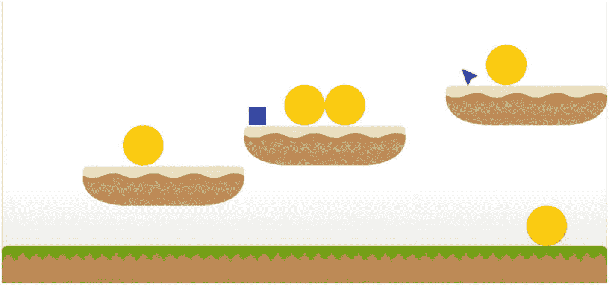
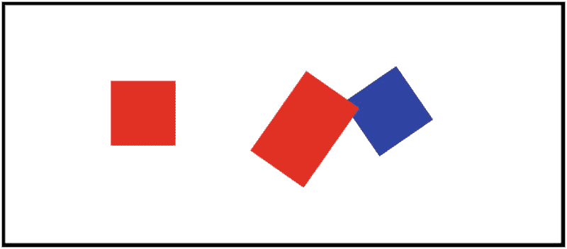
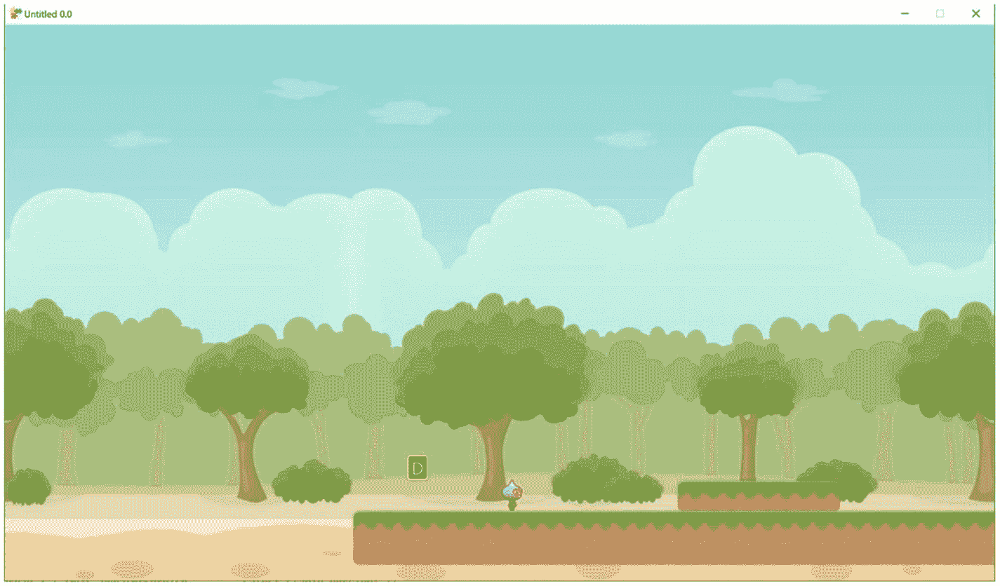
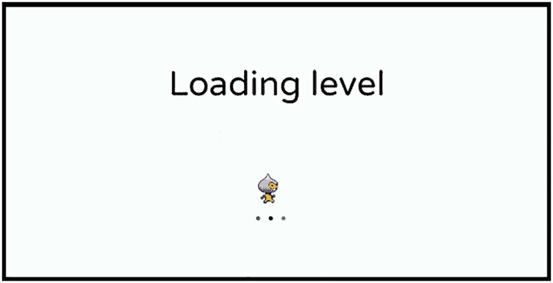
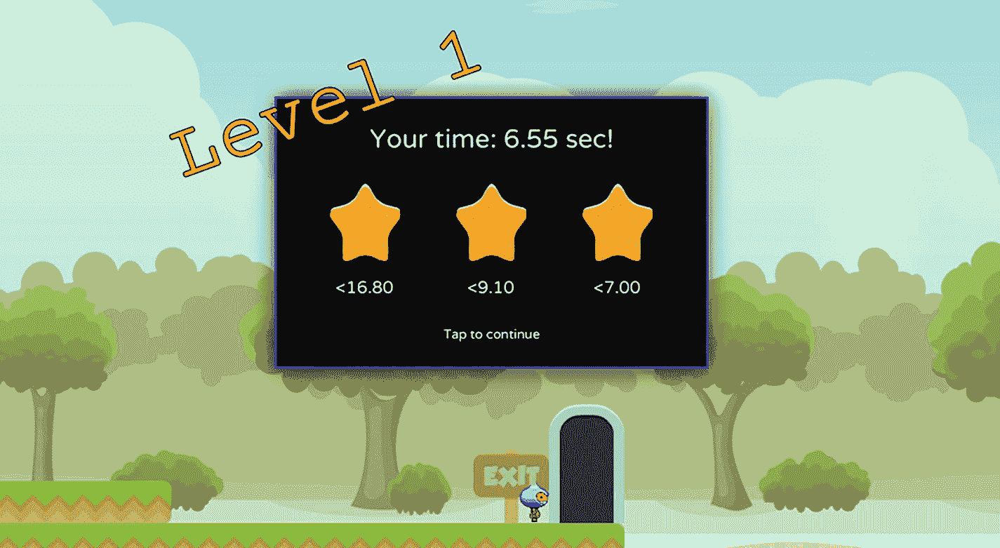

# 4. 物理案例研究：平台游戏

在本章中，我们将考虑游戏物理在游戏开发中的重要性。我们还将了解物理在 FXGL 游戏引擎中是如何实现的，以及如何在 FXGL 游戏中使用它。更具体地说，游戏物理通常有两个目的：碰撞检测和模拟，这两者都将在 FXGL 的背景下进行介绍。完成本章后，你将学习以下内容：

*   常用的碰撞检测技术及其实现方法
*   如何添加碰撞处理代码
*   物理世界及其属性
*   如何实现物理模拟
*   如何构建一个简单的平台游戏

在许多现代游戏中，玩家与游戏世界之间的很多交互都是通过物理实现的。例如，玩家角色接近游戏内对象时，会弹出一个提示，因为物理子系统会检测到这两个实体之间的接近。另一个例子是将一个重物放在压力板上，这样物品的物理属性（在这种情况下是质量）会触发压力板。在本章中，我们将看到如何实现类似的例子，从碰撞检测开始。为简单起见，我们只关注 2D 情况。


## 碰撞检测

碰撞检测用于判断两个实体是否发生碰撞（重叠）。如前所述，这是实现游戏对象之间交互的有用工具。例如，玩家实体与金币实体碰撞，玩家因此能够拾取金币。图 4-1 展示了这一场景，其中玩家是一个蓝色方块，金币是一个黄色圆圈。



一张平台游戏截图展示了如下实体：底部有一个长平台，上面右侧有一个彩色圆圈；从下到上不同高度的三个小平台上分别包含：一个彩色圆圈；一个彩色方块和两个彩色圆圈；一个彩色箭头和一个彩色圆圈。

图 4-1

一个展示可能实体交互的平台游戏示例

碰撞检测技术分为两大类：宽阶段和窄阶段。宽阶段技术或算法的目标是避免对距离较远（因此不可能碰撞）的实体执行昂贵的计算。这些技术通常速度快但精度较低；也就是说，它们仅适用于快速过滤掉不可能碰撞的实体对。宽阶段技术通常无法判断两个实体是否正在碰撞；因此，一旦我们得到可能碰撞的实体对，就会采用窄阶段技术。与宽阶段相比，窄阶段技术速度较慢但极其精确，能够识别两个实体之间是否发生了碰撞。

在宽阶段，FXGL 使用基于网格的空间索引算法来提高碰撞检测的性能。大多数宽阶段技术，如四叉树和 k-d 树，都利用某种形式的空间索引，根据实体之间的距离将不可能碰撞的实体分组。然而，为简洁起见，本书不讨论宽阶段算法，而是专注于窄阶段技术。

有多种碰撞检测技术可用于计算两个实体在二维空间中是否重叠，包括：

*   轴对齐包围盒（每个实体用一个包围它的矩形包裹，然后检查矩形是否重叠）
*   分离轴定理（使用几个预定义的轴，绘制分离线；如果存在至少一条这样的线，则没有重叠）
*   圆-圆相交（用圆包围每个实体，并检查圆是否重叠）
*   多边形（用多边形，通常是凸多边形，包围每个实体，并检查这些形状是否重叠）
*   基于图像像素（如果实体使用图像作为视图，则识别图像的交集区域，如果交集中至少有一个像素，则实体之间发生碰撞）
*   基于网格（如果游戏基于网格，则检查实体是否占据相同或相邻的单元格）

上述列表应该能让你了解一般方法：用某种已知形状包围实体，以便相对容易地检测碰撞。在本书中，我们只考虑前两种在游戏开发中常用的方法：轴对齐包围盒和分离轴定理。我们不会深入太多细节，因为 FXGL 已经实现了这些方法，并提供了简便的访问方式。

轴对齐包围盒（AABB）算法因其性能和易于实现而在任何碰撞检测技术中都至关重要。该算法可描述如下：用包围盒包裹每个实体，包围盒是能完全包围实体的最小矩形。接下来，检查两个矩形（包裹两个待检测实体的盒子）是否重叠。如果重叠，则记录碰撞；如果不重叠，则没有碰撞。

实现 AABB 算法的一种直接方式如下：

```
return box2.maxX >= box1.minX &&
box2.maxY >= box1.minY &&
box2.minX <= box1.maxX &&
box2.minY <= box1.maxY
```

如果所有这些检查都成功，则 `box1` 和 `box2` 之间存在碰撞；因此，这些盒子所代表的实体之间也存在碰撞。

然而，AABB 方法存在局限性。主要局限性在于，正如该技术名称所示，包围盒必须与轴对齐。这意味着如果至少有一个实体发生了旋转（即旋转角度不为零），则该方法不适用。在这种情况下，我们可以使用另一种称为分离轴定理（简称 SAT）的技术。SAT 指出，如果存在一个轴，两个物体沿该轴有分离，则这两个物体没有重叠。与前面给出的包围盒方法不同，即使实体发生旋转（角度不为零度），该方法也能检查碰撞。例如，在图 4-2 中，右侧两个旋转实体之间的碰撞将被 SAT 正确报告。



一张示意图展示了三个实体：左侧是一个彩色方块；右侧是一个矩形和一个方块，颜色不同，且因旋转而发生碰撞。

图 4-2

实体的零度与非零度旋转角

在 FXGL 中，这两种方法都像大多数内置算法一样，通过用户友好的 API 封装。假设我们有两个实体 `e1` 和 `e2`。要检查它们是否碰撞，在代码中可以调用方法 `e1.isColliding(e2)`，该方法返回一个直观的布尔值。

现在我们已经讨论了碰撞检测背后的基本理论，是时候将注意力转向如何处理这些碰撞了。


## 碰撞处理

在本节中，我们将探讨 FXGL 中用于处理碰撞的 API，即调用游戏逻辑代码来执行碰撞导致的游戏内操作。之前我们已经使用过玩家-金币碰撞的示例，因此我们将在此基础上继续深入。如前所述，当玩家与金币碰撞时，通常会执行三个操作：移除金币、增加玩家分数、播放音效以提示用户事件发生。在上一章中，我们已经使用了一些简单的碰撞处理 DSL API，但这里我们将探索完整的 API，因为它提供了更多选项。为了实现这一游戏逻辑，我们创建一个继承自 `CollisionHandler` 的类。在构造函数中，我们指定该处理器所针对的两种实体类型。接下来，我们考虑需要重写的方法。

```
public class PlayerCoinHandler extends CollisionHandler {
public PlayerCoinHandler() {
super(EntityType.PLAYER, EntityType.COIN);
}
@Override
protected void onHitBoxTrigger(Entity p, Entity c, HitBox boxA, HitBox boxB) { }
@Override
protected void onCollisionBegin(Entity p, Entity c) {
c.removeFromWorld();
FXGL.inc("score", +2);
FXGL.play("pickup_coin.wav");
}
@Override
protected void onCollision(Entity p, Entity c) { }
@Override
protected void onCollisionEnd(Entity p, Entity c) { }
}
清单 4-1
碰撞处理器示例
```

从清单 4-1 中可以看出，共有四个这样的方法（如果你对所有可能的物理相关方法感兴趣，可以访问 [`https://github.com/AlmasB/FXGL/tree/dev/fxgl-entity/src/main/java/com/almasb/fxgl`](https://github.com/AlmasB/FXGL/tree/dev/fxgl-entity/src/main/java/com/almasb/fxgl) 查看）：

*   onHitBoxTrigger() – 这是碰撞发生时第一个被调用的方法。它允许我们检查哪些碰撞框发生了碰撞。这在格斗游戏中非常有用：根据角色被击中的部位，我们可以决定扣除多少生命值。

*   onCollisionBegin() – 该方法在碰撞发生的同一帧被调用，且仅调用一次。通常，这是用于收集类物品（如金币）的回调函数。在示例代码中，我们实现了之前描述的游戏逻辑：移除金币、增加分数、播放音效。

*   onCollision() – 该方法在碰撞持续期间每帧都会被调用。可用于对与尖刺碰撞的玩家持续造成伤害。或者，该回调也可用于奖励处于得分区域的玩家分数。

*   onCollisionEnd() – 该方法在碰撞停止发生的同一帧被调用。可用于隐藏用户交互提示，因为玩家已离开可交互区域。

要使碰撞处理器生效，两个实体必须满足以下要求；它们必须同时具备：

*   已附加 `CollidableComponent` 组件
*   拥有碰撞框
*   拥有类型
*   通过调用 `addCollisionHandler()` 将碰撞处理器附加到物理世界

如果满足这些要求，碰撞处理器将正确处理两个实体之间发生的碰撞（调用重写的方法）。最后，当不再需要时，你可以通过调用 `removeCollisionHandler()` 将其移除。

## 物理世界

到目前为止，我们讨论的都是由开发者控制的实体。还有一种方式可以让物理世界参与游戏逻辑，那就是让物理世界控制实体。在这种情况下，我们实际上是在运行一个模拟，例如刚体动力学。为了运行模拟，实体需要附加一个 `PhysicsComponent` 组件。通过该组件可以设置几种常用的配置选项：

*   setFixtureDef() – 夹具定义提供了实体的物理属性，如摩擦力、恢复系数（弹性）、密度和形状。常见的形状有矩形、圆形、链形和多边形。

*   setOnPhysicsInitialized() – 允许开发者提供一个回调函数，该函数在实体的物理初始化完成后被调用。

*   setLinearVelocity() – 允许开发者手动设置支持物理的实体的速度。该速度随后将由物理世界应用。

*   setBodyType() – 可选类型为静态、运动学或动态。静态实体质量为零且速度为零。这些通常是不会移动的物体，例如平台和墙壁。运动学实体质量为零，但速度可由开发者设置为非零值。运动学实体由物理世界移动，通常代表玩家控制的对象，例如《Pong》或《Breakout》中的球拍。动态实体具有正质量，且速度由施加在实体上的力计算得出。与运动学实体类似，动态实体也由物理世界移动。它们通常代表不需要玩家控制的对象，例如子弹或《Pong》与《Breakout》中的球。

在刚体动力学中，实体获得一个刚体（固体）。当两个这种形式的实体碰撞时，物理引擎会尝试将它们分离，使实体不占据同一空间。一旦实体被视为物理世界的一部分，你可能希望配置一些常用的世界选项。这些选项可通过物理世界对象访问：

*   setGravity() – 设置应用于世界中动态实体的重力。

*   raycast() – 你可以从世界中的任意位置“发射”一条线到特定点。该方法将返回该线击中的第一个实体。如果你想知道某个实体是否在另一个实体的视线范围内，这将非常有用。

*   toMeters() / toPixels() – 允许在像素和米之间进行便捷转换。请注意，游戏基于像素单位运行，而物理世界使用米作为单位。

*   toPoint() / toVector() – 与之前类似，此方法将点/向量从一个上下文（游戏或物理世界）转换到另一个上下文（物理世界或游戏）。


## 平台游戏

在本节中，我们将把本章学到的所有物理知识付诸实践，构建一个如图 4-3 所示的演示程序。为此，我们将开发一个简单的平台游戏。与上一章开发的乒乓球游戏不同，这个平台游戏将使用外部资源——素材，其中也包括一个在 Tiled Editor 中预构建的关卡。为了简化开发，我们将使用公开可用的免费图片和精灵表。请确保你已下载并将素材放置在相应的目录中（以下链接提供了素材目录结构的详细信息）。完成这些步骤后，你就能跟随本节给出的实现进行操作。所使用的素材，以及这些素材的原始来源和作者的链接，均可在 FXGLGames GitHub 仓库中找到：[`https://github.com/AlmasB/FXGLGames/tree/master/Mario`](https://github.com/AlmasB/FXGLGames/tree/master/Mario)。



一张图片展示了一个平台游戏演示，背景中有云朵和树木。深色背景上的字母 D 位于中央，玩家图像在平台上。

图 4-3

使用 FXGL 开发的平台游戏演示

按照惯例，第一步是确定游戏中将包含哪些实体类型。在我们开发的平台游戏中，这些类型如下：

```
public enum EntityType {
PLAYER, COIN, PLATFORM, EXIT_TRIGGER, KEY_PROMPT, EXIT_SIGN, BUTTON, DOOR_TOP, DOOR_BOT
}
```

其中一些类型不言自明，而其他类型则会在我们逐步开发的过程中变得更加清晰。

接下来，我们将按以下顺序逐一分析游戏中的每个类：

*   PlayerComponent

*   PlayerButtonHandler

*   PlatformerFactory

*   MainLoadingScene

*   LevelEndScene

*   PlatformerApp

每个类都管理游戏的一个方面。

### 游戏逻辑

我们首先来检查 `PlayerComponent` 类。回顾上一章的内容，组件允许我们向实体添加数据和行为。此外，我们还可以通过添加方法来通过组件控制实体。和之前一样，我们将按顺序逐一分析清单 4-2 中的类及其方法，并提供与其用途相关的必要细节。

```
import com.almasb.fxgl.entity.component.Component;
import com.almasb.fxgl.physics.PhysicsComponent;
import com.almasb.fxgl.texture.AnimatedTexture;
import com.almasb.fxgl.texture.AnimationChannel;
import javafx.geometry.Point2D;
import javafx.scene.image.Image;
import javafx.util.Duration;
import static com.almasb.fxgl.dsl.FXGL.image;
public class PlayerComponent extends Component {
private PhysicsComponent physics;
private AnimatedTexture texture;
private AnimationChannel animIdle;
private AnimationChannel animWalk;
private int jumps = 2;
public PlayerComponent() {
Image image = image("player.png");
animIdle = new AnimationChannel(image, 4, 32, 42, Duration.seconds(1), 1, 1);
animWalk = new AnimationChannel(image, 4, 32, 42, Duration.seconds(0.66), 0, 3);
texture = new AnimatedTexture(animIdle);
texture.loop();
}
@Override
public void onAdded() {
entity.getTransformComponent().setScaleOrigin(new Point2D(16, 21));
entity.getViewComponent().addChild(texture);
physics.onGroundProperty().addListener((obs, old, isOnGround) -> {
if (isOnGround) {
jumps = 2;
}
});
}
@Override
public void onUpdate(double tpf) {
if (physics.isMovingX()) {
if (texture.getAnimationChannel() != animWalk) {
texture.loopAnimationChannel(animWalk);
}
} else {
if (texture.getAnimationChannel() != animIdle) {
texture.loopAnimationChannel(animIdle);
}
}
}
public void left() {
getEntity().setScaleX(-1);
physics.setVelocityX(-170);
}
public void right() {
getEntity().setScaleX(1);
physics.setVelocityX(170);
}
public void stop() {
physics.setVelocityX(0);
}
public void jump() {
if (jumps == 0)
return;
physics.setVelocityY(-300);
jumps--;
}
}
清单 4-2
PlayerComponent 类
```

这个类包含五个字段、一个构造函数和六个方法。这些字段分别是：物理组件（稍后我们将像往常一样在工厂类中将其添加到实体中）、动画纹理（允许我们使用精灵表）、两个动画通道（一个用于待机动画，一个用于行走动画），以及最后我们允许玩家跳跃的次数。构造函数负责设置动画。请注意，`image()`（完整调用是 `FXGL.image()`）可用于从 `/assets/textures` 加载任何图像作为 JavaFX 的 `Image`。我们的图像名为 player.png，因此这就是我们传递给 `image()` 方法的参数。使用加载的图像，我们构建了两个动画通道，并循环播放待机动画。

在 `onAdded()` 回调中（当此组件 `PlayerComponent` 被添加到实体时调用），我们需要做三件事：设置缩放原点（以便我们能够根据移动方向正确地将玩家向左或向右翻转）、添加动画纹理，以及注册一个监听器，该监听器会在玩家落地时通知我们，以便重置跳跃次数。请注意，我们将玩家实体的缩放原点设置为点 (16, 21)，这是玩家动画单帧（32×42）的中心点。

在下一个回调 `onUpdate()` 中，我们确定要循环播放两个动画（行走或待机）中的哪一个。物理组件可以告诉我们实体是否正在沿特定轴移动。在我们的用例中，沿 X 轴移动意味着玩家并非处于待机状态。因此，如果 `isMovingX()` 返回 true，我们想要循环播放行走动画，否则播放待机动画。


不出所料，`left()` 和 `right()` 方法有着相似的实现。将实体在 X 轴上缩放为负值意味着实体将面向另一个（左）方向。使用正值进行相同操作则会将实体缩放为面向右侧。可以基于游戏手感来设置 X 轴上的速度。将 X 速度设置为 0 将完全停止实体，因此该方法得名 `stop()`。最后一个方法 `jump()` 会检查我们是否可以跳跃：如果跳跃次数为 0，则不能。实际的跳跃实现只是将 Y 速度设置为负值。请注意，在 FXGL（以及 JavaFX）中，Y 轴正方向是向下的。现在我们有了一个功能性的玩家组件。

接下来，我们将在代码清单 4-3 中定义我们的第一个碰撞处理类。请注意，我们之前已经简要地使用过匿名碰撞处理器，现在我们将把处理代码正确地隔离到一个单独的类中。这里的碰撞将在玩家和可交互按钮之间处理。当玩家与按钮碰撞时，会触发一个提示变为可见，以指示该按钮可以被按下。当碰撞结束时，按键提示将再次变为不可见。我们可以通过将实体的不透明度分别设置为 1 和 0 来打开和关闭可见性。请注意，也可以调用 `setVisible(true / false)`，这将达到相同的视觉效果。

```
import com.almasb.fxgl.entity.Entity;
import com.almasb.fxgl.physics.CollisionHandler;
import com.almasb.fxglgames.platformer.EntityType;
import static com.almasb.fxgl.dsl.FXGL.getGameWorld;
public class PlayerButtonHandler extends CollisionHandler {
public PlayerButtonHandler() {
super(EntityType.PLAYER, EntityType.BUTTON);
}
@Override
protected void onCollisionBegin(Entity player, Entity btn) {
Entity keyEntity = btn.getObject("keyEntity");
if (!keyEntity.isActive()) {
keyEntity.setProperty("activated", false);
getGameWorld().addEntity(keyEntity);
}
keyEntity.setOpacity(1);
}
@Override
protected void onCollisionEnd(Entity player, Entity btn) {
Entity keyEntity = btn.getObject("keyEntity");
if (!keyEntity.getBoolean("activated")) {
keyEntity.setOpacity(0);
}
}
}
代码清单 4-3
PlayerButtonHandler 类
```

与我们在上一章中实现的乒乓球游戏相比，我们的平台游戏中的实体类型要多得多。因此，工厂类也大得多。考虑代码清单 4-4 中的工厂实现，我们也将逐个方法地检查它。虽然有很多内容需要过一遍，但你一次只需要关注一个方法。

```
import com.almasb.fxgl.dsl.components.LiftComponent;
import com.almasb.fxgl.dsl.views.ScrollingBackgroundView;
import com.almasb.fxgl.entity.Entity;
import com.almasb.fxgl.entity.EntityFactory;
import com.almasb.fxgl.entity.SpawnData;
import com.almasb.fxgl.entity.Spawns;
import com.almasb.fxgl.entity.components.CollidableComponent;
import com.almasb.fxgl.entity.components.IrremovableComponent;
import com.almasb.fxgl.input.view.KeyView;
import com.almasb.fxgl.physics.BoundingShape;
import com.almasb.fxgl.physics.HitBox;
import com.almasb.fxgl.physics.PhysicsComponent;
import com.almasb.fxgl.physics.box2d.dynamics.BodyType;
import com.almasb.fxgl.physics.box2d.dynamics.FixtureDef;
import com.almasb.fxgl.ui.FontType;
import javafx.geometry.Point2D;
import javafx.scene.CacheHint;
import javafx.scene.input.KeyCode;
import javafx.scene.paint.Color;
import javafx.util.Duration;
import static com.almasb.fxgl.dsl.FXGL.*;
import static com.almasb.fxglgames.platformer.EntityType.*;
public class PlatformerFactory implements EntityFactory {
@Spawns("background")
public Entity newBackground(SpawnData data) {
return entityBuilder()
.view(new ScrollingBackgroundView(texture("background/forest.png").getImage(), getAppWidth(), getAppHeight()))
.zIndex(-1)
.with(new IrremovableComponent())
.build();
}
@Spawns("platform")
public Entity newPlatform(SpawnData data) {
return entityBuilder(data)
.type(PLATFORM)
.bbox(new HitBox(BoundingShape.box(data.get("width"), data.get("height"))))
.with(new PhysicsComponent())
.build();
}
@Spawns("exitTrigger")
public Entity newExitTrigger(SpawnData data) {
return entityBuilder(data)
.type(EXIT_TRIGGER)
.bbox(new HitBox(BoundingShape.box(data.get("width"), data.get("height"))))
.with(new CollidableComponent(true))
.build();
}
@Spawns("doorTop")
public Entity newDoorTop(SpawnData data) {
return entityBuilder(data)
.type(DOOR_TOP)
.opacity(0)
.build();
}
@Spawns("doorBot")
public Entity newDoorBot(SpawnData data) {
return entityBuilder(data)
.type(DOOR_BOT)
.bbox(new HitBox(BoundingShape.box(data.get("width"), data.get("height"))))
.opacity(0)
.with(new CollidableComponent(false))
.build();
}
@Spawns("player")
public Entity newPlayer(SpawnData data) {
PhysicsComponent physics = new PhysicsComponent();
physics.setBodyType(BodyType.DYNAMIC);
physics.addGroundSensor(new HitBox("GROUND_SENSOR", new Point2D(16, 38), BoundingShape.box(6, 8)));
// this avoids player sticking to walls
physics.setFixtureDef(new FixtureDef().friction(0.0f));
return entityBuilder(data)
.type(PLAYER)
.bbox(new HitBox(new Point2D(5,5), BoundingShape.circle(12)))
.bbox(new HitBox(new Point2D(10,25), BoundingShape.box(10, 17)))
.with(physics)
.with(new CollidableComponent(true))
.with(new IrremovableComponent())
.with(new PlayerComponent())
.build();
}
@Spawns("exitSign")
public Entity newExit(SpawnData data) {
return entityBuilder(data)
.type(EXIT_SIGN)
.bbox(new HitBox(BoundingShape.box(data.get("width"), data.get("height"))))
.with(new CollidableComponent(true))
.build();
}
@Spawns("keyPrompt")
public Entity newPrompt(SpawnData data) {
return entityBuilder(data)
.type(KEY_PROMPT)
.bbox(new HitBox(BoundingShape.box(data.get("width"), data.get("height"))))
.with(new CollidableComponent(true))
.build();
}
@Spawns("keyCode")
public Entity newKeyCode(SpawnData data) {
String key = data.get("key");
KeyCode keyCode = KeyCode.getKeyCode(key);
var lift = new LiftComponent();
lift.setGoingUp(true);
lift.yAxisDistanceDuration(6, Duration.seconds(0.76));
var view = new KeyView(keyCode, Color.YELLOW, 24);
view.setCache(true);
view.setCacheHint(CacheHint.SCALE);
return entityBuilder(data)
.view(view)
.with(lift)
.zIndex(100)
.build();
}
@Spawns("button")
public Entity newButton(SpawnData data) {
var keyEntity = getGameWorld().create("keyCode", new SpawnData(data.getX(), data.getY() - 50).put("key", "E"));
keyEntity.getViewComponent().setOpacity(0);
return entityBuilder(data)
.type(BUTTON)
.viewWithBBox(texture("button.png", 20, 18))
.with(new CollidableComponent(true))
.with("keyEntity", keyEntity)
.build();
}
}
代码清单 4-4
PlatformerFactory 类
```


在 FXGL 中，实体工厂类允许将每个实体的创建便捷地隔离到各自的方法中。现在我们将按顺序逐一介绍这些方法，从背景实体开始。该实体基于一个循环滚动的图像，形成无限滚动的视图。内置的 `ScrollingBackgroundView` 类正好可以实现这一点。我们还添加了一个之前未使用过的新组件 `IrremovableComponent`。由于这个平台游戏包含多个关卡，我们需要不时地销毁现有关卡并设置新关卡。大多数关卡都共享一些实体，例如背景和玩家。因此，每次切换关卡时都无需重新创建这些实体。在这种情况下，`IrremovableComponent` 就非常有用，因为它能锁定所附加的实体，使其无法从世界中移除。

下一个实体类型是平台。平台仅包含一个边界框和一个物理组件。默认情况下，物理组件已经具有静态刚体，因此我们无需修改它。请注意，我们不需要为平台创建视图，因为它直接从 Tiled 的“.tmx”关卡文件中加载。

出口触发器是一个实体，当它与玩家碰撞时，会启用（使其可见）通往下一关卡的出口门。在游戏中，触发器本身通常不可见，仅作为碰撞对象工作。正如预期，我们为其创建了一个边界框，并添加了可碰撞组件。

关于门实体，它被分为门顶和门底两部分，因为门由两个图块组成。你会从代码中注意到，只有门的底部被设置为可碰撞，以避免与玩家触发两次碰撞。

玩家实体是此游戏中最复杂的实体之一。首先，我们将物理组件配置为动态刚体类型，以便其受到物理力的影响。我们还添加了一个地面传感器，使开发者能够知道玩家何时落地，即玩家实体不在空中。为了避免玩家粘在墙上，我们还将摩擦力设置为 0。将其设置为非零正值可能会影响游戏玩法和手感，因此你可以进行实验以达到合适的效果。这里需要注意的另一件事是，玩家有两个边界框：一个用于头部，另一个用于身体，以更精确地表示碰撞形状。最后，我们附加了可碰撞、不可移除和玩家组件，这很直接。

出口标志实体为玩家与游戏世界之间增加了一点动态交互。其思路是，当玩家与标志碰撞时，标志会亮起。在这个用例中，这并不是一个极其重要的功能；然而，它应该能为你提供一些关于如何在你自己游戏中实现类似功能的思路。

按键提示实体用于帮助玩家识别需要按下哪个键来与世界交互。例如，回想一下你最近玩过的任何游戏，无论是 2D 还是 3D，当你靠近一扇门或一个物品时，游戏会视觉提示你按下特定键进行交互。这正是我们在这里通过按键提示实体所做的事情。

按钮实体是游戏玩法的一部分，玩家需要激活按钮才能推进关卡。在我们使用的关卡中，按钮将使门可见，从而让玩家能够进入下一关卡。至此，工厂类概述完毕，接下来我们将介绍游戏示例中的其他类。

### 游戏视觉效果：子场景

为了让我们的平台游戏示例更像一个游戏，我们将引入几个子场景。场景及其交互超出了本书的范围，因此这里只做非常简短的介绍。游戏中将有两个自定义场景：一个在游戏加载时显示，另一个在关卡结束时显示。



加载场景的截图从上到下描绘了以下内容：显示“Loading level”的文本、一个玩家图像以及三个点。

图 4-4

主加载场景的截图

如图 4-4 所示，我们创建了一个 JavaFX 文本对象，内容为“Loading level”，显示玩家图像，并添加了三个点。这在代码清单 4-5 中通过一个构造函数调用实现，该调用设置了场景中使用的动画。这些点使用 FXGL 内置的淡入动画进行动画处理（更多关于动画的内容请参见第 6 章）。最后，我们将文本居中放置，并添加了一个玩家图像。该图像被设置为从 0 度到 360 度旋转并无限循环。

```
import com.almasb.fxgl.animation.Interpolators;
import com.almasb.fxgl.app.scene.LoadingScene;
import javafx.geometry.Rectangle2D;
import javafx.scene.layout.HBox;
import javafx.scene.paint.Color;
import javafx.scene.shape.Rectangle;
import javafx.util.Duration;
import static com.almasb.fxgl.dsl.FXGL.*;
public class MainLoadingScene extends LoadingScene {
public MainLoadingScene() {
var bg = new Rectangle(getAppWidth(), getAppHeight(), Color.AZURE);
var text = getUIFactoryService().newText("Loading level", Color.BLACK, 46.0);
centerText(text,getAppWidth()/2,getAppHeight()/3 +25);
var hbox = new HBox(5);
for (int i = 0; i < 3; i++) {
var textDot = getUIFactoryService().newText(".", Color.BLACK, 46.0);
hbox.getChildren().add(textDot);
animationBuilder(this)
.autoReverse(true)
.delay(Duration.seconds(i * 0.5))
.repeatInfinitely()
.fadeIn(textDot)
.buildAndPlay();
}
hbox.setTranslateX(getAppWidth() / 2 - 20);
hbox.setTranslateY(getAppHeight() / 2);
var t = texture("player.png").subTexture(new Rectangle2D(0, 0, 32, 42));
t.setTranslateX(getAppWidth() / 2 - 32/2);
t.setTranslateY(getAppHeight() / 2 - 42/2);
animationBuilder(this)
.duration(Duration.seconds(1.25))
.repeatInfinitely()
.autoReverse(true)
.interpolator(Interpolators.EXPONENTIAL.EASE_IN_OUT())
.rotate(t)
.from(0)
.to(360)
.buildAndPlay();
getContentRoot().getChildren().setAll(bg,text,hbox,t);
}
}
代码清单 4-5
MainLoadingScene 类
```

接下来要介绍的场景是玩家完成任意关卡后显示的。该场景将提供各种信息，告知玩家表现如何以及获得了多少颗星。



关卡结束场景的截图从上到下描绘了以下内容：显示“Level 1”的文本、一个带有时间和分数的深色背景，以及一个位于出口板和门前的玩家图像。

图 4-5

关卡结束场景的截图

代码清单 4-6 中给出的 `LevelEndScene` 的大部分代码用于设置图 4-5 中所示的视图。由于其中大部分内容源自 JavaFX，我们不会深入讨论细节。这里最重要的一点是，该场景类继承自 `SubScene`，这使得该场景可以添加到现有场景之上，例如，像图 4-5 中那样添加到游戏场景之上，其中游戏场景和关卡结束场景都可见。要添加任何视觉效果和 UI，你可以使用普通的 JavaFX 节点，并将它们添加到场景内容根节点中，同时还可以添加任何你希望应用的动画。


```
import com.almasb.fxgl.animation.Interpolators;
import com.almasb.fxgl.input.UserAction;
import com.almasb.fxgl.scene.SubScene;
import com.almasb.fxgl.texture.Texture;
import com.almasb.fxgl.ui.FontFactory;
import javafx.beans.property.BooleanProperty;
import javafx.beans.property.SimpleBooleanProperty;
import javafx.geometry.Insets;
import javafx.geometry.Point2D;
import javafx.geometry.Pos;
import javafx.scene.effect.DropShadow;
import javafx.scene.input.MouseButton;
import javafx.scene.layout.HBox;
import javafx.scene.layout.Priority;
import javafx.scene.layout.StackPane;
import javafx.scene.layout.VBox;
import javafx.scene.paint.Color;
import javafx.scene.shape.Rectangle;
import javafx.scene.text.Text;
import javafx.util.Duration;
import static com.almasb.fxgl.dsl.FXGL.*;
public class LevelEndScene extends SubScene {
private static final int WIDTH = 400;
private static final int HEIGHT = 250;
private Text textUserTime = getUIFactoryService().newText("", Color.WHITE, 24.0);
private HBox gradeBox = new HBox();
private FontFactory levelFont = getAssetLoader().loadFont("level_font.ttf");
private BooleanProperty isAnimationDone = new SimpleBooleanProperty(false);
public LevelEndScene() {
var bg = new Rectangle(WIDTH, HEIGHT, Color.color(0, 0, 0, 0.85));
bg.setStroke(Color.BLUE);
bg.setStrokeWidth(1.75);
bg.setEffect(new DropShadow(28, Color.color(0,0,0, 0.9)));
VBox.setVgrow(gradeBox, Priority.ALWAYS);
var textContinue = getUIFactoryService().newText("Tap to continue", Color.WHITE, 11.0);
textContinue.visibleProperty().bind(isAnimationDone);
animationBuilder(this)
.repeatInfinitely()
.autoReverse(true)
.scale(textContinue)
.from(new Point2D(1, 1))
.to(new Point2D(1.25, 1.25))
.buildAndPlay();
var vbox = new VBox(15, textUserTime, gradeBox, textContinue);
vbox.setAlignment(Pos.CENTER);
vbox.setPadding(new Insets(25));
var root = new StackPane(
bg, vbox
);
root.setTranslateX(1280 / 2 - WIDTH / 2);
root.setTranslateY(720 / 2 - HEIGHT / 2);
var textLevel = new Text();
textLevel.textProperty().bind(getip("level").asString("Level %d"));
textLevel.setFont(levelFont.newFont(52));
textLevel.setRotate(-20);
textLevel.setFill(Color.ORANGE);
textLevel.setStroke(Color.BLACK);
textLevel.setStrokeWidth(3.5);
textLevel.setTranslateX(root.getTranslateX() - textLevel.getLayoutBounds().getWidth() / 3);
textLevel.setTranslateY(root.getTranslateY() + 25);
getContentRoot().getChildren().addAll(root, textLevel);
getInput().addAction(new UserAction("Close Level End Screen") {
@Override
protected void onActionBegin() {
if (!isAnimationDone.getValue())
return;
getSceneService().popSubScene();
}
}, MouseButton.PRIMARY);
}
public void onLevelFinish() {
isAnimationDone.setValue(false);
Duration userTime = Duration.seconds(getd("levelTime"));
LevelTimeData timeData = geto("levelTimeData");
textUserTime.setText(String.format("Your time: %.2f sec!", userTime.toSeconds()));
gradeBox.getChildren().setAll(
new Grade(Duration.seconds(timeData.star1), userTime),
new Grade(Duration.seconds(timeData.star2), userTime),
new Grade(Duration.seconds(timeData.star3), userTime)
);
for (int i = 0; i  isAnimationDone.setValue(true));
}
builder.translate(gradeBox.getChildren().get(i))
.from(new Point2D(0, -500))
.to(new Point2D(0, 0))
.buildAndPlay();
}
getSceneService().pushSubScene(this);
}
private static class Grade extends VBox {
private static final Texture STAR_EMPTY = texture("star_empty.png", 65, 72).darker();
private static final Texture STAR_FULL = texture("star_full.png", 65, 72);
public Grade(Duration gradeTime, Duration userTime) {
super(15);
HBox.setHgrow(this, Priority.ALWAYS);
setAlignment(Pos.CENTER);
getChildren().add(userTime.lessThanOrEqualTo(gradeTime) ? STAR_FULL.copy() : STAR_EMPTY.copy());
getChildren().add(getUIFactoryService().newText(String.format("<%.2f", gradeTime.toSeconds()), Color.WHITE, 16.0));
}
}
public static class LevelTimeData {
private final double star1;
private final double star2;
private final double star3;
/**
* @param star1 in seconds
* @param star2 in seconds
* @param star3 in seconds
*/
public LevelTimeData(double star1, double star2, double star3) {
this.star1 = star1;
this.star2 = star2;
this.star3 = star3;
}
}
}
清单 4-6
LevelEndScene 类
```

你可以将此处给出的关卡结束场景代码仅视为一个示例，而非参考实现。游戏视觉效果和美学并非一门精确科学，需要开发者通过大量试错才能获得恰到好处的游戏体验。这通常需要人类参与者的反馈，他们可以试玩你的游戏，并为游戏设计提供宝贵的见解。

### 结合逻辑与视觉效果

现在，我们可以将所有类（无论是逻辑相关还是视觉效果相关）与 `PlatformerApp` 类连接起来。根据 FXGL 的标准架构，我们开发的所有功能都将在一个名为 "App" 的类中使用。在本例中，它就是 `PlatformerApp`。这是一个相当复杂的类，因此我们将分节处理，逐一介绍各个方法。顺序如下：

*   `initSettings()` – 初始化游戏设置

*   `initInput()` – 初始化控制游戏角色的用户操作

*   `initGameVars()` – 初始化全局可访问的游戏变量

*   `initGame()` – 初始化游戏其余部分及玩法

*   `initPhysics()` – 初始化物理设置和碰撞处理器

*   `makeExitDoor()` – 使出口门在游戏中可见

*   `onUpdate()` – 每帧调用，用于增加游戏时间并检查玩家是否死亡

*   `nextLevel()` – 将游戏推进到下一关卡

*   `setLevel()` – 通过从 Tiled 的 ".tmx" 文件加载来设置指定关卡

所有这些方法都在清单 4-7 中提供。在 `initInput()` 中，我们需要绑定四个按键：A（向左移动）、D（向右移动）、W（跳跃）和 E（使用）。我们之前使用过更简洁的输入 API 集；但在这里，我们需要使用完整的 API，以便重写 `onAction()` 和 `onActionEnd()`。对于 A、D 和 W 键，实际的输入实现很简单，因为我们只需调用之前创建的玩家组件的方法。E 键的实现稍微复杂一些。我们需要找到游戏中所有按钮实体，然后检查该按钮是否可碰撞且当前正与玩家碰撞。如果是，我们就更新按钮视图，使其显示已被按下，然后调用 `makeExitDoor()`，稍后我们将介绍该方法。

在 `initGameVars()` 中，我们初始化游戏变量，使其在源代码的任何位置都可访问。我们存储两样东西：当前关卡和在该关卡上花费的时间。利用时间值，在关卡结束时，我们可以在关卡结束场景中检查并相应地授予星星，该场景我们之前已经构建。

下一个方法是 `initGame()`，大部分游戏初始化过程在此进行。我们添加平台游戏工厂类，以便 FXGL 知道如何创建我们的实体。我们创建关卡、生成玩家并生成背景（注意，由于背景的 z-index，我们不必在其他任何东西之前生成背景；z-index 可以很好地处理任何排序问题）。最后，我们将视口（游戏的可视区域）绑定到玩家实体。这最后一步使视口跟随玩家实体，并提供你在平台游戏中常见的横向卷轴效果。我们将在第 6 章讨论视口及其重要性。


在 `initPhysics()` 中，我们设置了游戏的物理配置。具体来说，我们首先根据玩家控制的手感，将重力设置为一个任意值 760。如果玩家感觉太轻，你可能希望增加该值。同样，如果玩家跳跃高度太低，你可以减小该值。回想一下，在注册碰撞处理器时，有两种方法可供使用：一种是创建一个碰撞处理器类，就像我们在上面的 `PlayerButtonHandler` 中所做的那样；另一种是使用 FXGL 提供的 DSL API。当玩家与出口标志、出口触发器和出口门碰撞时，我们只想触发一次碰撞处理代码。因此，我们使用了 `onCollisionOneTimeOnly()`。这三种实体类型的一次性碰撞处理器内部的代码都很直接。在 `initPhysics()` 中注册的最后一个碰撞处理器是玩家与按键提示之间的碰撞。我们不希望这些类型之间的碰撞只发生一次，而是希望在每次发生碰撞时都得到通知；因此，我们使用了之前见过的 `onCollisionBegin()`。处理器内部的代码会生成一个按键提示实体，该实体漂浮几秒钟，向玩家指示可以按下特定按键来触发某种游戏机制。

`makeExitDoor()` 方法只是获取世界中构成出口门的两个实体（上半部分和下半部分）的引用。我们启用了门上的碰撞注册，并通过将两者的不透明度设置为 1（因此透明度为 0）使它们在游戏中可见。

在 `onUpdate()` 内部，我们将关卡时间增加一个等于每帧时间的值，如果以每秒 60 帧运行，该值通常为 0.016(6)。该方法中唯一的其他代码是检查玩家的 Y 值。如果它大于游戏高度，那么玩家一定是（因错过平台跳跃而）掉出了关卡，因此我们重新开始同一关卡。

`nextLevel()` 方法负责设置下一个关卡，或者在没有更多关卡时显示游戏结束消息。首先执行此检查，以查看我们的关卡是否是游戏中拥有的最大关卡。如果检查失败，我们将关卡编号增加 1，并将其设置为当前关卡。

`setLevel()` 方法是关卡生成发生的地方。我们将玩家的位置重置到游戏起点，并重置关卡时间。`setLevelFromMap()` 方法由 FXGL 提供，用于自动将“.tmx”文件解析为 FXGL 关卡。我们还可以查询与“.tmx”文件关联的各种属性，例如在关卡中获得三颗星所需的 `shortestTime` 自定义属性。最后，我们基于此数据构建一个新的关卡结束场景。

总结一下清单 4-7，应用程序类只是将我们在其他文件中实现的所有独立组件、逻辑和视图相关类整合在一起。在使用 FXGL 进行开发的过程中，你会发现这种模式（先开发功能类，然后在应用程序类中组合它们）贯穿始终。


```
import com.almasb.fxgl.animation.Interpolators;
import com.almasb.fxgl.app.ApplicationMode;
import com.almasb.fxgl.app.GameApplication;
import com.almasb.fxgl.app.GameSettings;
import com.almasb.fxgl.app.scene.GameView;
import com.almasb.fxgl.app.scene.LoadingScene;
import com.almasb.fxgl.app.scene.SceneFactory;
import com.almasb.fxgl.app.scene.Viewport;
import com.almasb.fxgl.core.util.LazyValue;
import com.almasb.fxgl.entity.Entity;
import com.almasb.fxgl.entity.SpawnData;
import com.almasb.fxgl.entity.components.CollidableComponent;
import com.almasb.fxgl.entity.level.Level;
import com.almasb.fxgl.input.UserAction;
import com.almasb.fxgl.input.view.KeyView;
import com.almasb.fxgl.input.virtual.VirtualButton;
import com.almasb.fxgl.physics.PhysicsComponent;
import javafx.geometry.Point2D;
import javafx.scene.input.KeyCode;
import javafx.scene.paint.Color;
import javafx.util.Duration;
import java.util.Map;
import static com.almasb.fxgl.dsl.FXGL.*;
import static com.almasb.fxglgames.platformer.EntityType.*;
public class PlatformerApp extends GameApplication {
private static final int MAX_LEVEL = 5;
private static final int STARTING_LEVEL = 0;
private LazyValue levelEndScene = new LazyValue(() -> new LevelEndScene());
private Entity player;
@Override
protected void initSettings(GameSettings settings) {
settings.setWidth(1280);
settings.setHeight(720);
settings.setSceneFactory(new SceneFactory() {
@Override
public LoadingScene newLoadingScene() {
return new MainLoadingScene();
}
});
}
@Override
protected void initInput() {
getInput().addAction(new UserAction("Left") {
@Override
protected void onAction() {
player.getComponent(PlayerComponent.class).left();
}
@Override
protected void onActionEnd() {
player.getComponent(PlayerComponent.class).stop();
}
}, KeyCode.A);
getInput().addAction(new UserAction("Right") {
@Override
protected void onAction() {
player.getComponent(PlayerComponent.class).right();
}
@Override
protected void onActionEnd() {
player.getComponent(PlayerComponent.class).stop();
}
}, KeyCode.D);
getInput().addAction(new UserAction("Jump") {
@Override
protected void onActionBegin() {
player.getComponent(PlayerComponent.class).jump();
}
}, KeyCode.W);
getInput().addAction(new UserAction("Use") {
@Override
protected void onActionBegin() {
getGameWorld().getEntitiesByType(BUTTON)
.stream()
.filter(btn -> btn.hasComponent(CollidableComponent.class) && player.isColliding(btn))
.forEach(btn -> {
btn.removeComponent(CollidableComponent.class);
Entity keyEntity = btn.getObject("keyEntity");
keyEntity.setProperty("activated", true);
KeyView view = (KeyView) keyEntity.getViewComponent().getChildren().get(0);
view.setKeyColor(Color.RED);
makeExitDoor();
});
}
}, KeyCode.E);
}
@Override
protected void initGameVars(Map vars) {
vars.put("level", STARTING_LEVEL);
vars.put("levelTime", 0.0);
}
@Override
protected void initGame() {
getGameWorld().addEntityFactory(new PlatformerFactory());
player = null;
nextLevel();
// player must be spawned after call to nextLevel, otherwise player gets removed
// before the update tick _actually_ adds the player to game world
player = spawn("player", 50, 50);
set("player", player);
spawn("background");
Viewport viewport = getGameScene().getViewport();
viewport.setBounds(-1500, 0, 250 * 70, getAppHeight());
viewport.bindToEntity(player, getAppWidth() / 2, getAppHeight() / 2);
viewport.setLazy(true);
}
@Override
protected void initPhysics() {
getPhysicsWorld().setGravity(0, 760);
getPhysicsWorld().addCollisionHandler(new PlayerButtonHandler());
onCollisionOneTimeOnly(PLAYER, EXIT_SIGN, (player, sign) -> {
var texture = texture("exit_sign.png").brighter();
texture.setTranslateX(sign.getX() + 9);
texture.setTranslateY(sign.getY() + 13);
var gameView = new GameView(texture, 150);
getGameScene().addGameView(gameView);
runOnce(() -> getGameScene().removeGameView(gameView), Duration.seconds(1.6));
});
onCollisionOneTimeOnly(PLAYER, EXIT_TRIGGER, (player, trigger) -> {
makeExitDoor();
});
onCollisionOneTimeOnly(PLAYER, DOOR_BOT, (player, door) -> {
levelEndScene.get().onLevelFinish();
// the above runs in its own scene, so fade will wait until
// the user exits that scene
getGameScene().getViewport().fade(() -> {
nextLevel();
});
});
onCollisionBegin(PLAYER, KEY_PROMPT, (player, prompt) -> {
String key = prompt.getString("key");
var entity = getGameWorld().create("keyCode", new SpawnData(prompt.getX(), prompt.getY()).put("key", key));
spawnWithScale(entity, Duration.seconds(1), Interpolators.ELASTIC.EASE_OUT());
runOnce(() -> {
despawnWithScale(entity, Duration.seconds(1), Interpolators.ELASTIC.EASE_IN());
}, Duration.seconds(2.5));
});
}
private void makeExitDoor() {
var doorTop = getGameWorld().getSingleton(DOOR_TOP);
var doorBot = getGameWorld().getSingleton(DOOR_BOT);
doorBot.getComponent(CollidableComponent.class).setValue(true);
doorTop.setOpacity(1);
doorBot.setOpacity(1);
}
@Override
protected void onUpdate(double tpf) {
inc("levelTime", tpf);
if (player.getY() > getAppHeight()) {
setLevel(geti("level"));
}
}
private void nextLevel() {
if (geti("level") == MAX_LEVEL) {
showMessage("You finished the demo!");
return;
}
inc("level", +1);
setLevel(geti("level"));
}
private void setLevel(int levelNum) {
if (player != null) {
player.getComponent(PhysicsComponent.class).overwritePosition(new Point2D(50, 50));
player.setZIndex(Integer.MAX_VALUE);
}
set("levelTime", 0.0);
Level level = setLevelFromMap("tmx/level" + levelNum  + ".tmx");
var shortestTime = level.getProperties().getDouble("star1time");
var levelTimeData = new LevelEndScene.LevelTimeData(shortestTime * 2.4, shortestTime*1.3, shortestTime);
set("levelTimeData", levelTimeData);
}
public static void main(String[] args) {
launch(args);
}
}
**清单 4-7**
**PlatformerApp 类**
```

至此，我们的平台游戏示例就完成了。需要注意的是，构建任何游戏都有不同的方法。本章介绍的案例研究仅提供了一种可能的实现方式。随着你对 JavaFX 和 FXGL 的深入学习，你会发现解决同一问题的不同方法，甚至可能是更优的方法。这在游戏开发和计算机科学领域都很常见。尽管如此，基于这个示例，你现在应该能够构建一个由物理引擎驱动的简单平台游戏了。

## 总结

在本章中，我们探讨了物理在游戏开发中的一系列应用。我们思考了如何使用几种不同的技术进行碰撞检测，并讨论了它们在 FXGL 中的实现细节。接着，我们研究了一些可用于处理实体间交互（例如发生碰撞时）的游戏逻辑代码。我们看到了碰撞处理的重要性，因为它允许玩家与游戏世界互动，也允许非玩家实体之间相互交互。在考虑 3D 游戏时，这种重要性尤为突出，因为交互是沉浸感的基础。最后，我们构建了一个简单的平台游戏，它大量运用了本章所涵盖的内容。在下一章中，我们将继续探讨如何为不受玩家控制的实体定义 AI。


