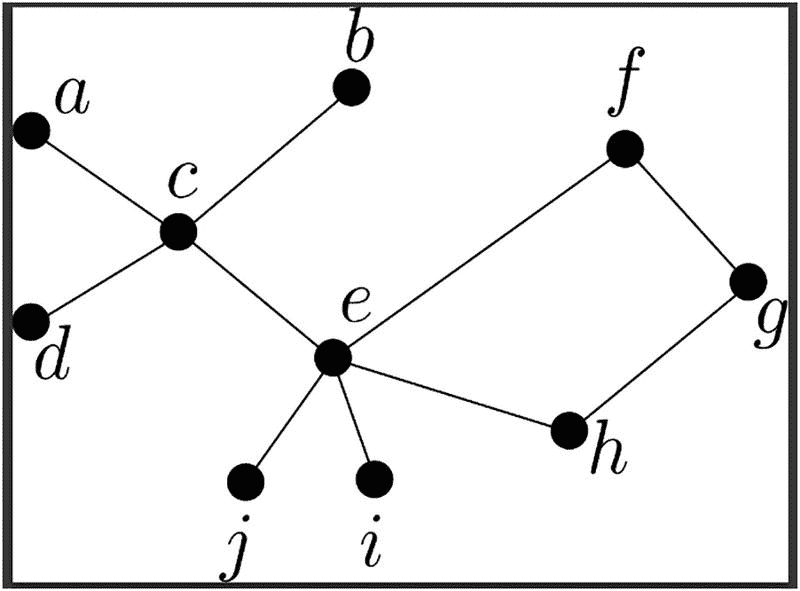
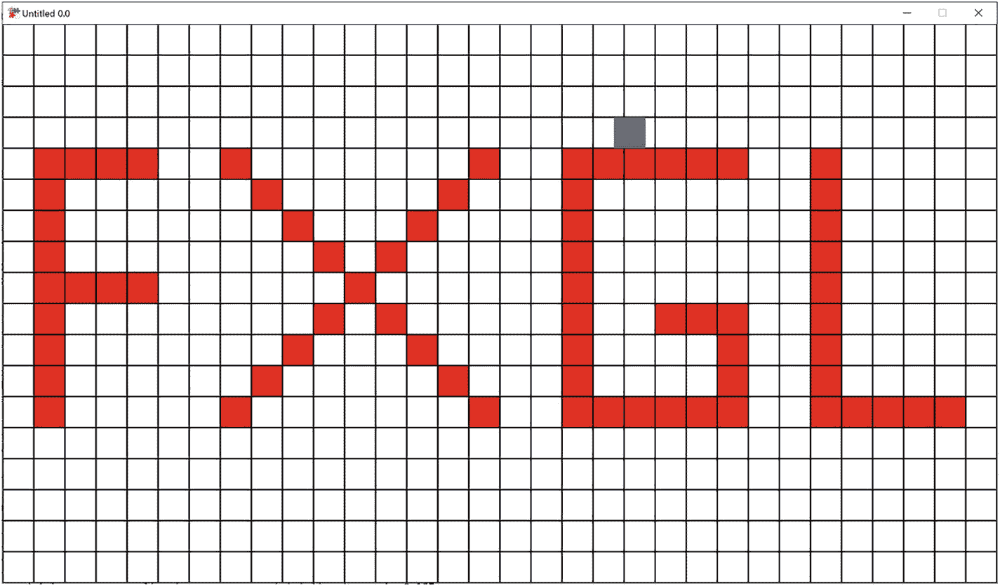
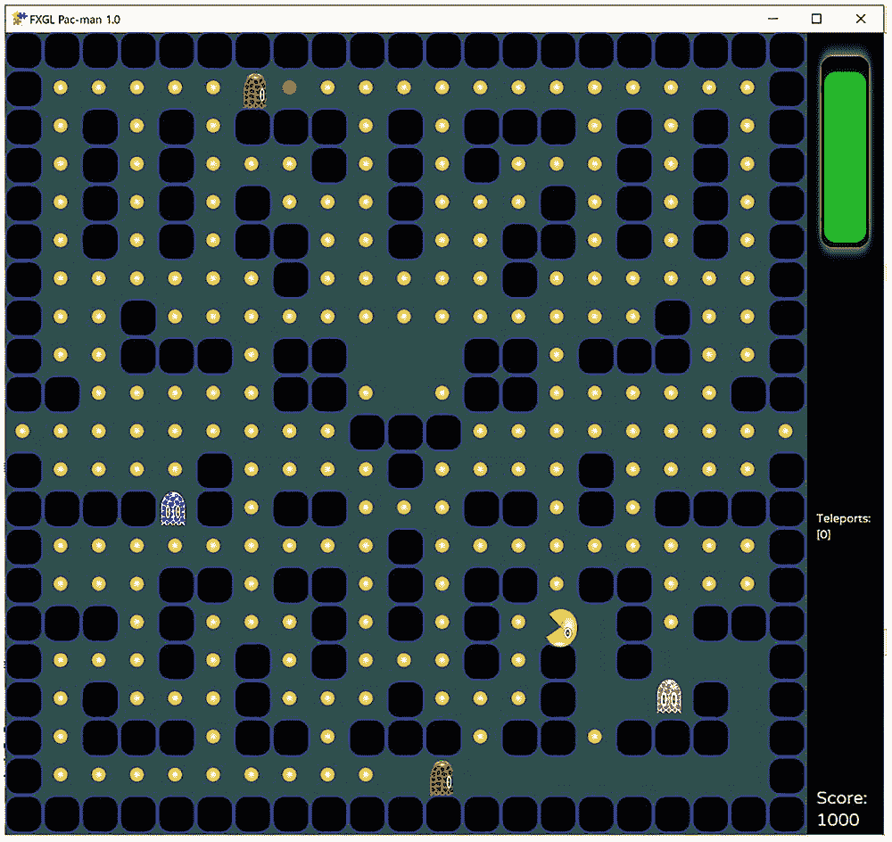
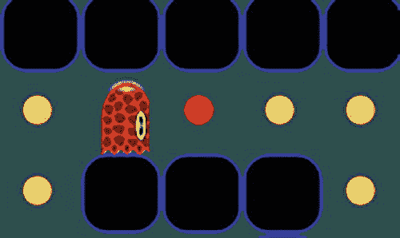

# 5. AI 案例研究：开发迷宫动作游戏

在本章中，我们将探讨 AI 的基础知识：它能帮助我们在游戏中实现什么，以及如何在 FXGL 中实现一系列 AI 行为。AI 是游戏开发的关键领域之一。没有它，大多数单人游戏的吸引力和趣味性将大打折扣。AI 赋予 NPC 和敌人准智能的决策能力，其目标是为玩家带来娱乐体验。更具体地说，作为游戏开发者，我们应致力于让 AI 足够复杂以匹配玩家的技能水平，但又足够浅显以给予玩家隐形的优势。如果设计和实现得当，这样的 AI 角色将与玩家产生有趣且富有挑战性的互动，但也会在适当的时候“认输”。

我们将 AI 分为两类：寻路和行为。寻路 AI 处理在二维（或三维）平面中两点之间搜索路径的问题。例如，一个“追踪者”敌人能够追捕玩家，同时避开游戏关卡内的所有障碍物。行为 AI 主要关注实体在任何给定时刻所执行的动作。在本章中，我们将探索几种实现行为的方法。完成本章后，你将学到：

*   图论基础知识和 A* 寻路算法
*   如何使用 `AStarMoveComponent` 在游戏世界中寻找两点之间的路径
*   如何使用自定义组件定义简单的 AI 行为
*   如何使用有限状态机定义具有多种状态的 AI 行为
*   如何利用简单的 AI 行为实现一个动作游戏

寻路通常是在一种允许应用常见计算机科学搜索算法的数据结构上进行的。本章首先探讨一种称为“图”的数据结构。

## 图论与寻路概念

存在一系列基于图搜索的寻路算法。图是节点集合与连接节点的边集合的统称。图 5-1 展示了一个示例，其中有十个节点（圆形）和十条边（线条）。图论是计算机科学中研究图及其应用的基础领域。有许多针对特定任务定制的图搜索算法。在游戏中，一种常用于寻找两点之间路径的算法被称为 A*（读作“A star”）算法。



一个连通图描绘了 10 个节点。节点 a、b、c、d、e、f、g、h、i 和 j 由 10 条边连接。

图 5-1
一个图

在应用包括 A* 在内的任何搜索算法之前，首要任务是将游戏世界转换为图。假设在你的 2D 游戏世界中，有相互连接的房间或单元格，你可以从一个房间移动到其相邻的房间。但也会存在无法移动的情况，例如某个房间是封闭的。将这样的世界转换为图的一个简单算法是：为每个房间创建一个节点，如果可以从 A 移动到 B（且移动单位为一个单元），则在节点 A 和 B 之间创建一条边。由此产生的结构就是你的图。例如，如果图 5-1 中的图是以这种方式生成的，那么我们可以从一个移动单位从房间“a”移动到房间“c”。然而，要从“a”移动到“b”，我们需要先到达“c”。

假设在图 5-1 中，我们希望从节点“a”移动到节点“g”。当然，我们可以使用暴力方法，简单地检查从“a”到“g”的所有可能路径，然后选择一条合适的。在这样的小型图上，这种方法通常没问题。但是，想象一个像《GTA V》那样广阔的世界，其底层图会变得过于庞大而无法使用暴力方法，尤其是在我们只有几分之一秒的时间来计算路径的情况下。显然，我们需要一种更有效的方法来解决这类通用问题。这正是 A* 寻路算法能够发挥巨大作用的地方。

## FXGL 中的 A* 寻路

为了在 FXGL 中使用 A* 算法，我们首先需要根据游戏世界构建一个 `AStarGrid` 对象。`AStarGrid` 是一个由 `AStarCell` 对象组成的二维网格，这些对象可以处于两种状态之一：`WALKABLE`（可通行）或 `NOT_WALKABLE`（不可通行）。接下来，我们需要向希望在网格中移动的实体添加几个组件。这些组件是 `CellMoveComponent` 和 `AStarMoveComponent`。

`CellMoveComponent` 允许实体在基于单元格的环境（如网格、图或瓦片地图）中移动。`AStarMoveComponent` 利用 `CellMoveComponent` 并提供必要的路径信息，使实体不会穿过墙壁或其他障碍物。为了帮助巩固这些理论概念，我们将构建一个小型独立应用程序，其代码见清单 5-1。在继续之前，请务必记下所需的导入语句。

```
import com.almasb.fxgl.app.GameApplication;
import com.almasb.fxgl.app.GameSettings;
import com.almasb.fxgl.dsl.FXGL;
import com.almasb.fxgl.entity.Entity;
import com.almasb.fxgl.pathfinding.CellMoveComponent;
import com.almasb.fxgl.pathfinding.CellState;
import com.almasb.fxgl.pathfinding.astar.AStarGrid;
import com.almasb.fxgl.pathfinding.astar.AStarMoveComponent;
import javafx.scene.input.MouseButton;
import javafx.scene.paint.Color;
import javafx.scene.shape.Rectangle;
import javafx.scene.shape.StrokeType;
import static com.almasb.fxgl.dsl.FXGL.*;
public class PathfindingSample extends GameApplication {
@Override
protected void initSettings(GameSettings settings) {
settings.setWidth(1280);
settings.setHeight(720);
}
@Override
protected void initGame() {
var grid = new AStarGrid(1280 / 40, 720 / 40);
var agent = entityBuilder()
.viewWithBBox(new Rectangle(40, 40, Color.BLUE))
.with(new CellMoveComponent(40, 40, 150))
.with(new AStarMoveComponent(grid))
.zIndex(1)
.anchorFromCenter()
.buildAndAttach();
for (int y = 0; y  {
if (event.getButton() == MouseButton.PRIMARY) {
agent.getComponent(AStarMoveComponent.class)
.moveToCell(finalX, finalY);
} else if (event.getButton() == MouseButton.SECONDARY) {
grid.get(finalX, finalY).setState(CellState.NOT_WALKABLE);
view.setFill(Color.RED);
}
});
}
}
}
public static void main(String[] args) {
launch(args);
}
}
清单 5-1
PathfindingSample 类
```

让我们详细分析清单 5-1 中的代码。首先，我们可以看到 `AStarGrid` 是以适当的尺寸构建的。请注意，提供的值是单元格数量，而非像素，这就是为什么我们将 1280 和 720 除以 40（本例中单个单元格的大小）。接下来，使用 `EntityBuilder`，我们构建了代理实体。你已从前面的章节熟悉了构建实体的过程，因此我们可以跳过细节。在本例中，该实体是一个带有 `CellMoveComponent` 和 `AStarMoveComponent` 的蓝色方块。请注意，后一个组件需要能够访问我们构建的网格，以便在关卡中智能移动。如你所见，实际的网格遍历实现细节对开发者是隐藏的，从而使 API 易于使用。

现在，我们将构建实体，使我们（用户）能够看到游戏世界并识别哪些单元格是可通行的，哪些是不可通行的。每个实体将有一个方形视图，默认颜色为白色。我们将为每个实体的 `ViewComponent` 添加一个点击处理程序，这样当我们点击它时，可以执行两个操作：(1) 如果左键点击，我们使用其 `AStarMoveComponent` 将代理移动到该单元格；(2) 如果右键点击，我们将该单元格设置为不可通行，并将其颜色更改为红色。左键和右键点击事件是标准的 JavaFX 事件，因此你可以为任何游戏示例使用类似的设置进行快速原型开发。


我们的小示例现已完成。你应该能够运行它，并看到一个带有蓝色方形智能体的二维网格。左键单击任意单元格，智能体将使用内置的 A* 寻路算法移动到该单元格。你可以尝试操作，看看右键单击如何创建障碍物，以及智能体如何避开它们。图 5-2 给出了一个示例截图，其中拼出“FXGL”的红色障碍物阻挡了蓝色智能体的路径。



该截图描绘了一个网格，其中一些方块以深色填充，拼出了 F X G L 字样。G 上方的一个方块以不同颜色填充。

图 5-2

一个展示 FXGL 中 A* 寻路功能的示例应用程序

## 行为

我们已经介绍了 AI 如何利用世界数据在二维世界中移动以到达目标。现在，我们将注意力转向 AI 到达目标后应该做什么。在本节中，我们将探讨为敌方实体添加 AI 行为的多种方式。虽然所有这些方式都是添加 AI 的有效方法，但根据你的用例，某些方法更为合适。当你的实体行为主要承担单一任务时，最直接的方法是使用自定义组件。例如，假设你有一个敌方实体，其作用是保持静止，并在玩家靠近时向其他 AI 实体发出信号。我们可以通过创建一个 `SignalComponent` 来实现此行为，如代码清单 5-2 所示。

本质上，该组件的 `onUpdate()` 方法执行了此简单行为背后的所有逻辑。首先，我们需要获取玩家实体的引用，以便检查玩家与我们（信号实体）之间的距离。为此，你可以使用我们在第 3 章中介绍的众多查询方法之一。回想一下，当从组件内部调用时，`getEntity()` 会返回该组件所附加的实体，即信号实体。通过一个简单的 if 语句，我们可以检查是否应该“因为玩家靠近而向其他 AI 发出信号”。你也可以添加 else 分支，虽然这里不需要，但它应该能让你了解如何实现类似的用例。

```
public class SignalComponent extends Component {
@Override
public void onUpdate(double tpf) {
Entity player = ...
if (getEntity().distance(player) < 100) {
// 持续向其他 AI 发出信号：玩家靠近了
}
}
}
代码清单 5-2
SignalComponent 类
```

让我们考虑代码清单 5-3 中的另一个示例。此 AI 行为专注于跟随任何实体。给定对任何实体（例如玩家）的引用后，`onUpdate()` 方法将不断将 AI 智能体移向该实体的方向。总的来说，你可能已经注意到，在 FXGL 中，update 方法是处理实体逻辑和 AI 代码的合适位置。

```
public class FollowComponent extends Component {
@Override
public void onUpdate(double tpf) {
Entity player = ...
getEntity().translateTowards(player.getPosition(),10);
}
}
代码清单 5-3
FollowComponent 类
```

从代码清单 5-2 和 5-3 可以看出，FXGL 中的行为实现相当直接。然而，在游戏中会出现各种用例，这种简单的实现方式并不那么适用。到目前为止，我们介绍的行为主要承担单一任务：发出信号或跟随。当 AI 行为具有两个或更多不同的状态时，我们可以使用现有的 `StateComponent` 来帮助我们以更有效的方式定义 AI 功能。`StateComponent` 本质上允许我们使用有限状态机（FSM），其中 AI 智能体一次只能处于预定义状态之一。要在 FXGL 中实现这一点，首先，将 `StateComponent` 添加到你的实体中。接下来，实现你的状态，如代码清单 5-4 所示。

```
private EntityState GUARD = new EntityState() {
@Override
protected void onUpdate(double tpf) {
// 处于此状态时要运行的代码
}
};
代码清单 5-4
定义 EntityState
```

最后，我们可以使用实体的 `StateComponent` 并设置创建的状态：`entity.getComponent(StateComponent.class).changeState(GUARD)`。从此刻起，实体将调用 `GUARD` 状态中的 `onUpdate()`，使开发者能够隔离特定于该状态的行为，再次遵循单一职责原则。任何其他状态都可以用完全相同的方式创建。你可以看到，这种方法可以提升灵活性，因为状态不一定需要依赖其他状态的存在。但是，如果你愿意，就像下一个示例那样，你仍然可以在单个文件中声明所有状态，并从现有的不同状态切换到新状态。

现在，我们将看一个使用 FSM 的小型 FXGL 应用程序。具体来说，让我们设想一个即时战略游戏中的资源采集 AI，例如《魔兽争霸 3》、《要塞：十字军东征》或该类型的许多其他游戏。这种 AI 会自动移动到任何指定的资源处进行采集。一旦其“背包”满了，AI 就会移动到最近的“库存点”存放采集到的资源，从而清空其背包。接着，它会重新开始循环并继续采集资源。这种 AI 组件在许多即时战略游戏中非常有用，其中“工人”类型的实体可以为玩家采集资源。最终，我们可以识别出三种状态：采集、移动和存放。前两种状态是持续性的，意味着实体将在其中花费一些时间。然而，存放是一个单一动作，不一定需要实现为一个状态。此 AI 的实现可以在代码清单 5-5 中看到。我们现在对其进行详细检查。


```
import com.almasb.fxgl.dsl.FXGL;
import com.almasb.fxgl.entity.Entity;
import com.almasb.fxgl.entity.component.Component;
import com.almasb.fxgl.entity.component.Required;
import com.almasb.fxgl.entity.state.EntityState;
import com.almasb.fxgl.entity.state.StateComponent;
import com.almasb.fxgl.time.LocalTimer;
import javafx.geometry.Point2D;
import javafx.util.Duration;
public class GathererComponent extends Component {
private StateComponent stateComponent;
private Entity target;
private Point2D targetPosition;
private Entity prevTarget;
private EntityState GATHERING = new EntityState() {
private LocalTimer gatherTimer = FXGL.newLocalTimer();
private ResourceComponent resourceComponent;
@Override
public void onEnteredFrom(EntityState entityState) {
resourceComponent = target.getComponent(ResourceComponent.class);
gatherTimer.capture();
}
@Override
public void onUpdate(double tpf) {
if (isBackpackFull()) {
FXGL.getGameWorld()
.getClosestEntity(entity, e -> e.isType(EntityType.STOCKPILE))
.ifPresent(s -> sendTo(s));
return;
}
if (resourceComponent.isEmpty()) {
FXGL.getGameWorld()
// 并匹配资源类型...
.getClosestEntity(entity, e -> e.hasComponent(ResourceComponent.class) && !e.getComponent(ResourceComponent.class).isEmpty())
.ifPresent(resource -> sendTo(resource));
return;
}
if (gatherTimer.elapsed(Duration.seconds(2))) {
resourceComponent.gather();
entity.getProperties().increment(resourceComponent.getType().toString(), +1);
gatherTimer.capture();
}
}
};
private EntityState MOVING = new EntityState() {
@Override
protected void onUpdate(double tpf) {
// 到达目的地，停止移动
if (entity.getPosition().distance(targetPosition) < 5) {
if (target != null) {
if (target.hasComponent(ResourceComponent.class)) {
// 目标是资源
stateComponent.changeState(GATHERING);
} else if (target.isType(EntityType.STOCKPILE)) {
// 目标是库存点
depositResources(target);
if (prevTarget != null) {
sendTo(prevTarget);
} else {
// 无目标，保持空闲
stateComponent.changeStateToIdle();
}
}
} else {
// 无目标，保持空闲
stateComponent.changeStateToIdle();
}
return;
}
entity.translateTowards(targetPosition, 5);
}
};
private boolean isBackpackFull() {
return entity.getInt(ResourceType.WOOD.toString()) + entity.getInt(ResourceType.STONE.toString()) == 10;
}
private void depositResources(Entity stockpile) {
for (var resourceType : ResourceType.values()) {
int qty = entity.getInt(resourceType.toString());
stockpile.getProperties().increment(resourceType.toString(), qty);
entity.setProperty(resourceType.toString(), 0);
}
}
public void sendTo(Entity target) {
this.prevTarget = this.target;
this.target = target;
sendTo(target.getPosition());
}
public void sendTo(Point2D point) {
targetPosition = point;
stateComponent.changeState(MOVING);
}
}
清单 5-5
`GathererComponent` 类的示例实现
```

该组件包含四个变量字段和两个状态字段：

*   `stateComponent` – 对 `StateComponent` 的引用，会自动注入。
*   `target` – 实体的当前目标，若无目标则为 `null`。
*   `targetPosition` – 当前目标的位置，若无目标则为实体正在移动的目标点。
*   `prevTarget` – 实体的上一个目标。
*   `GATHERING` 状态 – 在此状态下，实体收集资源。
*   `MOVING` 状态 – 在此状态下，实体移动，前往资源点或库存点。

在 `GATHERING` 状态下，重写的 `onUpdate()` 方法首先检查背包是否已满。我们需要执行此检查，因为如果没有空间存放资源，收集资源就没有意义。如果检查结果为 `true`，表示背包已满，则将 AI 送回“基地”。接下来，我们需要检查资源是否确实可供采集，因为资源可能已被耗尽。如果资源不可用，则将 AI 发送到最近的匹配资源实体，以继续其采集工作。完成这些检查后，我们检查采集计时器是否已超时，因为我们不希望每帧都采集资源，而是在示例中每 2 秒（约 120 帧）采集一次。

在 `MOVING` 状态下，`onUpdate()` 方法负责更改 AI 实体在游戏世界中的位置。我们首先检查实体是否已到达目的地；如果已到达，则检查我们在此处的原因（采集资源或存放已采集的资源）；否则，让实体继续朝目标方向移动。

清单 5-5 中的其他方法用于简化状态的实现，建议您自行阅读。因此，您可以看到，归根结底，我们的 AI 实际上只是一系列条件语句。然而，如果这些语句实现得当，并与适当的概念（如 FSM）相结合，它们就能为玩家营造出强大的对抗幻觉。现在我们已经介绍了不同类型的 AI 及其简单实现，接下来将进入一个更具体的游戏示例。

## 迷宫动作游戏

在本节中，我们将构建一个包含迷宫元素的简单动作游戏。本质上，这是一个稍作修改的《吃豆人》克隆版，非常适合作为本章的示例。游戏在一个充满硬币的迷宫式关卡中设有四个敌人。玩家必须穿越迷宫并收集硬币，同时避开敌人。我们不会制作一个完整的克隆版，而是为游戏添加一些原创元素，例如时间条和传送能力。所有资源（包括其使用许可）和代码均可通过以下链接下载：[`https://github.com/AlmasB/FXGLGames/tree/master/Pacman`](https://github.com/AlmasB/FXGLGames/tree/master/Pacman)。您可以在图 5-3 中看到游戏截图。



一张截图展示了《吃豆人》游戏的修改版克隆。

图 5-3

《吃豆人》的修改版克隆


### 自定义组件

按照惯例，我们首先定义游戏中存在的实体类型。在我们的《吃豆人》克隆版中，只有四种类型：

```
public enum PacmanType {
PLAYER, ENEMY, BLOCK, COIN
}
```

由于这款游戏专注于人工智能，大部分功能都包含在组件中。我们之前提到过有四种类型的敌人。它们是 `GuardCoinComponent`、`DelayedChasePlayerComponent`（一种带延迟，一种不带延迟）以及 `RandomAStarMoveComponent`，后者是 FXGL 中提供的预构建组件。我们将考虑前两个文件的实现。至于 `RandomAStarMoveComponent`，它只有一个简单的目标，即使用 A* 寻路算法在关卡内随机移动实体。因此，我们在此不讨论其实现细节。不过，欢迎您浏览 GitHub 上 FXGL 仓库中该组件的源代码。

关于自定义组件类，本游戏示例中有四个。它们是：

*   **GuardCoinComponent** – 这是一个 AI 组件，用于让敌人实体守护游戏中选定的硬币。
*   **DelayedChasePlayerComponent** – 这是一个 AI 组件，用于让敌人追逐玩家实体。该组件有两种模式：即时模式（无延迟）和延迟模式。在即时模式下，它会使用最短路径直接前往玩家位置；而在延迟模式下，它会选择一条稍长的路径，给玩家一些喘息空间。
*   **PaletteChangingComponent** – 这本身并非 AI 组件，但它通过改变每个敌人的配色方案来帮助 AI 迷惑玩家，使玩家无法轻易判断自己面对的是哪种 AI。
*   **PlayerComponent** – 该组件允许玩家实体执行游戏操作，例如移动和传送。

然后，我们将按照之前提到的顺序逐一介绍这四个组件，第一个是 `GuardCoinComponent`，如代码清单 5-6 所示。

```
import com.almasb.fxgl.core.collection.grid.Cell;
import com.almasb.fxgl.entity.Entity;
import com.almasb.fxgl.entity.component.Component;
import com.almasb.fxgl.entity.component.Required;
import com.almasb.fxgl.pathfinding.astar.AStarMoveComponent;
import com.almasb.fxgl.texture.Texture;
import com.almasb.fxglgames.pacman.PacmanType;
import javafx.scene.paint.Color;
public class GuardCoinComponent extends Component {
private AStarMoveComponent astar;
private Entity targetCoin;
@Override
public void onUpdate(double tpf) {
if (targetCoin == null || !targetCoin.isActive()) {
entity.getWorld()
.getRandom(PacmanType.COIN)
.ifPresent(coin -> {
highlight(coin);
targetCoin = coin;
});
} else {
if (astar.isAtDestination()) {
int x = targetCoin.call("getCellX");
int y = targetCoin.call("getCellY");
Cell cell = astar.getGrid().get(x, y);
astar.getGrid()
.getRandomCell(c -> c.getState().isWalkable() && c.distance(cell) < 5)
.ifPresent(astar::moveToCell);
}
}
}
private void highlight(Entity coin) {
var texture = (Texture) coin.getViewComponent().getChildren().get(0);
var newTexture = texture.multiplyColor(Color.RED).brighter();
coin.getViewComponent().removeChild(texture);
coin.getViewComponent().addChild(newTexture);
}
}
代码清单 5-6
游戏示例中守卫 AI 的实现
```

该组件中只有两个字段：对 `AStarMoveComponent` 的引用（我们已经熟悉）和硬币实体。这枚硬币就是该 AI 将要守卫的目标。在 `onUpdate()` 方法中，我们首先检查目标硬币是否存在且位于游戏世界中，否则就随机选择一枚硬币作为目标。如果硬币存在，我们只需在硬币附近选择一个随机位置，并将我们的 AI 移动到该单元格。你在代码清单 5-6 中看到的高亮方法，可以让我们选中的硬币脱颖而出，这样玩家就能知道它的位置，并据此做出游戏决策。高亮效果会将硬币变为红色，如图 5-4 所示。



一张游戏截图，顶部和底部有一些深色方块，一个 AI 和 6 枚硬币。左侧 2 枚和右侧 3 枚硬币颜色较浅。中间的 AI 和它旁边的硬币颜色较深。

图 5-4

被 AI 守卫的硬币以红色高亮显示

接下来要探索的自定义 AI 组件是 `DelayedChasePlayerComponent`，其代码如代码清单 5-7 所示。

```
import com.almasb.fxgl.dsl.FXGL;
import com.almasb.fxgl.entity.component.Component;
import com.almasb.fxgl.entity.component.Required;
import com.almasb.fxgl.pathfinding.astar.AStarMoveComponent;
import com.almasb.fxglgames.pacman.PacmanType;
@Required(AStarMoveComponent.class)
public class DelayedChasePlayerComponent extends Component {
private AStarMoveComponent astar;
private boolean isDelayed = false;
@Override
public void onUpdate(double tpf) {
if (!isDelayed) {
move();
} else {
// 如果延迟，仅在到达目的地时移动
if (astar.isAtDestination()) {
move();
}
}
}
private void move() {
var player = FXGL.getGameWorld().getSingleton(PacmanType.PLAYER);
int x = player.call("getCellX");
int y = player.call("getCellY");
astar.moveToCell(x, y);
}
public DelayedChasePlayerComponent withDelay() {
isDelayed = true;
return this;
}
}
代码清单 5-7
游戏示例中玩家追逐 AI 的实现
```

这个 AI 组件的实现相对简单，只有两个字段：`AStarMoveComponent` 引用（以便 AI 知道如何移动）和一个标志位，用于指示 AI 是应该延迟移动，还是立即前往玩家位置而没有任何表面上的延迟。在 `move()` 方法中，你会注意到我们调用了 `player.call("getCellX");`。这是一个通用快捷方式，允许我们的实体调用其附加组件中的方法。例如，如果没有这个快捷方式，我们就必须调用完整的 API：`player.getComponent(CellMoveComponent.class).getCellX();`。因此，在调用明确无误的情况下，可以在实体上使用 `call()` 方法。

我们的下一个组件，如代码清单 5-8 所示，展示了如何为敌人实体实现随机调色板交换。虽然原版游戏中的敌人不会这样做（它们会变成幽灵，但不会不断切换颜色），但这对我们的克隆版来说是一个有趣的补充，因为玩家将无法轻易分辨哪个敌人拥有哪种 AI。


```
import com.almasb.fxgl.core.math.FXGLMath;
import com.almasb.fxgl.entity.component.Component;
import com.almasb.fxgl.texture.Texture;
import javafx.geometry.Rectangle2D;
public class PaletteChangingComponent extends Component {
private Texture texture;
private double lastX = 0;
private double lastY = 0;
private double timeToSwitch = 0;
private int spriteColor = 0;
public PaletteChangingComponent(Texture texture) {
this.texture = texture;
}
@Override
public void onAdded() {
entity.getViewComponent().addChild(texture);
}
@Override
public void onUpdate(double tpf) {
timeToSwitch += tpf;
if (timeToSwitch >= 5.0) {
spriteColor = (int) (160 * FXGLMath.random(0, 2) * 0.24);
timeToSwitch = 0;
}
double dx = entity.getX() - lastX;
double dy = entity.getY() - lastY;
lastX = entity.getX();
lastY = entity.getY();
if (dx == 0 && dy == 0) {
// 未移动
return;
}
if (Math.abs(dx) > Math.abs(dy)) {
// 移动方向为水平
if (dx > 0) {
texture.setViewport(new Rectangle2D(130*3 * 0.24, spriteColor, 130 * 0.24, 160 * 0.24));
} else {
texture.setViewport(new Rectangle2D(130*2 * 0.24, spriteColor, 130 * 0.24, 160 * 0.24));
}
} else {
// 移动方向为垂直
if (dy > 0) {
texture.setViewport(new Rectangle2D(0, spriteColor, 130 * 0.24, 160 * 0.24));
} else {
texture.setViewport(new Rectangle2D(130 * 0.24, spriteColor, 130 * 0.24, 160 * 0.24));
}
}
}
}
}
代码清单 5-8
`PaletteChangingComponent` 类的实现
```

`PaletteChangingComponent` 的实现重点在于：从敌人精灵表单中随机选择一行，并根据实体的移动方向选取正确的移动图像。代码中的注释指明了移动方向是水平还是垂直。获取该信息后，剩下的问题就是判断移动是向左还是向右（水平方向），或是向上还是向下（垂直方向）。这可以通过当前位置与上一位置的差值来确定。如果差值为正，则移动方向为向右（水平方向）或向下（垂直方向）。如果差值为负，则方向相反。

我们要探讨的最后一个组件是 `PlayerComponent` 类。其完整实现见代码清单 5-9。该组件的全部逻辑就是利用 A* 组件将玩家向正确的方向移动。我们有四个方法（上、下、左、右），可以从输入处理代码中调用，使玩家向特定方向移动。在 `onUpdate()` 方法中，我们会检查是否真的能朝该方向移动，并在可能的情况下执行移动。由于 A* 网格 API 的灵活性，`teleport()` 方法的实现非常简单。该代码获取一个随机可通行单元格的引用，并将玩家实体（或者说传送它）直接移动到该单元格。

```
import com.almasb.fxgl.entity.component.Component;
import com.almasb.fxgl.entity.component.Required;
import com.almasb.fxgl.pathfinding.CellMoveComponent;
import com.almasb.fxgl.pathfinding.astar.AStarCell;
import com.almasb.fxgl.pathfinding.astar.AStarMoveComponent;
import static com.almasb.fxglgames.pacman.components.PlayerComponent.MoveDirection.*;
@Required(AStarMoveComponent.class)
public class PlayerComponent extends Component {
enum MoveDirection {
UP, RIGHT, DOWN, LEFT
}
private CellMoveComponent moveComponent;
private AStarMoveComponent astar;
private MoveDirection currentMoveDir = RIGHT;
private MoveDirection nextMoveDir = RIGHT;
public void up() {
nextMoveDir = UP;
}
public void down() {
nextMoveDir = DOWN;
}
public void left() {
nextMoveDir = LEFT;
}
public void right() {
nextMoveDir = RIGHT;
}
@Override
public void onUpdate(double tpf) {
var x = moveComponent.getCellX();
var y = moveComponent.getCellY();
if (x == 0 && currentMoveDir == LEFT) {
astar.stopMovementAt(astar.getGrid().getWidth() - 1, moveComponent.getCellY());
return;
} else if (x == astar.getGrid().getWidth() - 1 && currentMoveDir == RIGHT) {
astar.stopMovementAt(0, moveComponent.getCellY());
return;
}
if (astar.isMoving())
return;
switch (nextMoveDir) {
case UP:
if (astar.getGrid().getUp(x, y).filter(c -> c.getState().isWalkable()).isPresent())
currentMoveDir = nextMoveDir;
break;
case RIGHT:
if (astar.getGrid().getRight(x, y).filter(c -> c.getState().isWalkable()).isPresent())
currentMoveDir = nextMoveDir;
break;
case DOWN:
if (astar.getGrid().getDown(x, y).filter(c -> c.getState().isWalkable()).isPresent())
currentMoveDir = nextMoveDir;
break;
case LEFT:
if (astar.getGrid().getLeft(x, y).filter(c -> c.getState().isWalkable()).isPresent())
currentMoveDir = nextMoveDir;
break;
}
switch (currentMoveDir) {
case UP:
astar.moveToUpCell();
break;
case RIGHT:
astar.moveToRightCell();
break;
case DOWN:
astar.moveToDownCell();
break;
case LEFT:
astar.moveToLeftCell();
break;
}
}
public void teleport() {
astar.getGrid()
.getRandomCell(AStarCell::isWalkable)
.ifPresent(c -> astar.stopMovementAt(c.getX(), c.getY()));
}
}
代码清单 5-9
`PlayerComponent` 类
```

现在我们已经介绍了游戏示例中使用的所有自定义组件类，接下来该将注意力转向工厂类的实现了。


### 构建关卡与实体

工厂实现代码见清单 5-10。如我们所知，实体工厂负责实例化游戏中出现的所有实体。共有四种实体类型，因此有四个使用 `@Spawns` 注解的方法来创建这些实体。在介绍它们之前，我们先说明关卡是如何生成的。关卡以纯文本文件形式存储，其中每个符号字符代表一个实体。例如：

```
11E1

P111
```

你可以这样理解这个简单示例：“1”代表方块，“0”代表金币，“P”代表玩家，“E”代表敌人。实际关卡会稍大一些，但遵循相同的约定。

现在我们来看清单 5-10 中的每个主要方法。第一个方法是 `newBlock()`，它生成一个新的方块类型实体。你会注意到 `@Spawns` 注解的参数是“1”。这正是我们之前示例中用来标识方块的字符。方块是不可穿越的单元格，起到障碍物的作用。在视图方面，它是一个简单的带有圆角的 JavaFX 矩形。金币实体通过 `newCoin()` 方法从“0”生成，并关联了一个纹理。我们偏移了纹理使其在单元格中居中，并添加了一个边界框。本书前面章节已介绍过这些方法中的大部分。

玩家和敌人实体的构建稍微复杂一些。对于玩家实体，我们首先从精灵表中创建一个动画纹理。对于任何纹理，FXGL 都允许我们使用 `toAnimatedTexture()` 方法轻松创建动画纹理，该方法接受两个参数：帧数和动画总时长。在设置玩家实体的视图时，我们需要记得调用 `loop()` 方法，以便动画无限循环。玩家构建代码的其余部分只是添加相关组件，但有一个调用特别值得注意：

```
new AStarMoveComponent(new LazyValue(() -> geto("grid"))).
```

在之前的示例中，你已经看到我们如何使用 A* 网格构建 `AStarMoveComponent`。然而，在本游戏中创建玩家实体时，网格尚未存在，因此我们传递了一个带有回调函数的 `LazyValue` 对象，以便在运行时获取网格对象。你会发现构建敌人实体时也采用了相同的方法。敌人实体的主要区别之一在于我们如何获取 AI 组件。为了避免为创建四种敌人类型而编写四个不同的方法，我们将 AI 组件的构建提取到一个单独的方法中，该方法会循环遍历这些组件，每次调用时返回一个不同的组件。至此，工厂类及其生成方法的概述就完成了。建议你回顾前面章节中关于我们未在此处详细讨论的代码内容。

```
import com.almasb.fxgl.core.util.LazyValue;
import com.almasb.fxgl.dsl.components.RandomAStarMoveComponent;
import com.almasb.fxgl.entity.Entity;
import com.almasb.fxgl.entity.EntityFactory;
import com.almasb.fxgl.entity.SpawnData;
import com.almasb.fxgl.entity.Spawns;
import com.almasb.fxgl.entity.component.Component;
import com.almasb.fxgl.entity.components.CollidableComponent;
import com.almasb.fxgl.pathfinding.CellMoveComponent;
import com.almasb.fxgl.pathfinding.astar.AStarMoveComponent;
import com.almasb.fxgl.physics.BoundingShape;
import com.almasb.fxgl.physics.HitBox;
import com.almasb.fxgl.texture.AnimatedTexture;
import com.almasb.fxglgames.pacman.components.PaletteChangingComponent;
import com.almasb.fxglgames.pacman.components.PlayerComponent;
import com.almasb.fxglgames.pacman.components.ai.DelayedChasePlayerComponent;
import com.almasb.fxglgames.pacman.components.ai.GuardCoinComponent;
import javafx.geometry.Point2D;
import javafx.scene.paint.Color;
import javafx.scene.shape.Rectangle;
import javafx.util.Duration;
import java.util.Map;
import java.util.function.Supplier;
import static com.almasb.fxgl.dsl.FXGL.*;
import static com.almasb.fxglgames.pacman.PacmanApp.BLOCK_SIZE;
import static com.almasb.fxglgames.pacman.PacmanType.*;
public class PacmanFactory implements EntityFactory {
@Spawns("1")
public Entity newBlock(SpawnData data) {
var rect = new Rectangle(38, 38, Color.BLACK);
rect.setArcWidth(25);
rect.setArcHeight(25);
rect.setStrokeWidth(1);
rect.setStroke(Color.BLUE);
return entityBuilder(data)
.type(BLOCK)
.viewWithBBox(rect)
.zIndex(-1)
.build();
}
@Spawns("0")
public Entity newCoin(SpawnData data) {
var view = texture("coin.png");
view.setTranslateX(5);
view.setTranslateY(5);
return entityBuilder(data)
.type(COIN)
.bbox(new HitBox(new Point2D(5, 5), BoundingShape.box(30, 30)))
.view(view)
.zIndex(-1)
.with(new CollidableComponent(true))
.with(new CellMoveComponent(BLOCK_SIZE, BLOCK_SIZE, 50))
.scale(0.5, 0.5)
.build();
}
@Spawns("P")
public Entity newPlayer(SpawnData data) {
AnimatedTexture view = texture("player.png").toAnimatedTexture(2, Duration.seconds(0.33));
return entityBuilder(data)
.type(PLAYER)
.bbox(new HitBox(new Point2D(4, 4), BoundingShape.box(32, 32)))
.anchorFromCenter()
.view(view.loop())
.with(new CollidableComponent(true))
.with(new CellMoveComponent(BLOCK_SIZE, BLOCK_SIZE, 200).allowRotation(true))
// 网格尚未构建，因此延迟传递
.with(new AStarMoveComponent(new LazyValue(() -> geto("grid"))))
.with(new PlayerComponent())
.rotationOrigin(35 / 2.0, 40 / 2.0)
.build();
}
private Supplier aiComponents = new Supplier() {
private Map> components = Map.of(
0, () -> new DelayedChasePlayerComponent().withDelay(),
1, GuardCoinComponent::new,
2, RandomAStarMoveComponent::new,
3, DelayedChasePlayerComponent::new
);
private int index = 0;
@Override
public Component get() {
if (index == 4) { // 共有 4 个敌人
index = 0;
}
return components.get(index++).get();
}
};
@Spawns("E")
public Entity newEnemy(SpawnData data) {
return entityBuilder(data)
.type(ENEMY)
.bbox(new HitBox(new Point2D(2, 2), BoundingShape.box(36, 36)))
.anchorFromCenter()
.with(new CollidableComponent(true))
.with(new PaletteChangingComponent(texture("spritesheet.png", 695 * 0.24, 1048 * 0.24)))
.with(new CellMoveComponent(BLOCK_SIZE, BLOCK_SIZE, 125))
// 网格尚未构建，因此延迟传递
.with(new AStarMoveComponent(new LazyValue(() -> geto("grid"))))
.with(aiComponents.get())
.build();
}
}
清单 5-10
实体工厂类实现
```

在通过应用程序类连接游戏所有部分之前，我们先来看一个通过 FXML 实现的简单用户界面（UI），以便玩家了解时间限制和其他游戏内机制。


### 构建用户界面

使用 FXML 标记编写 UI 是 JavaFX 中的常见方法。因此，FXGL 为 FXML 文件提供了一流支持。清单 5-11 展示了一个用 FXML 编写的 UI 示例。该示例以 `Pane` 作为根节点，仅包含三个子节点：一个作为 UI 背景的矩形，以及两个标签，一个用于显示分数，另一个用于指示玩家可使用的传送次数。

```

清单 5-11
包含我们游戏 UI 定义的 FXML 文件
```

为了在 FXGL 中使用此 UI，我们需要一个控制器类，例如清单 5-12 中提供的类。该类的唯一职责是将我们定义的标签文本绑定到其游戏内属性，并附加一个额外的 UI 元素——时间进度条。回想一下，玩家需要在指定时间内完成游戏演示，因此我们的进度条将让玩家随时了解演示结束前还剩多少时间。

```
import com.almasb.fxgl.ui.ProgressBar;
import com.almasb.fxgl.ui.UIController;
import javafx.fxml.FXML;
import javafx.scene.control.Label;
import javafx.scene.layout.Pane;
import javafx.scene.paint.Color;
import static com.almasb.fxgl.dsl.FXGL.getUIFactoryService;
import static com.almasb.fxgl.dsl.FXGL.getip;
public class PacmanUIController implements UIController {
@FXML
private Pane root;
private ProgressBar timeBar;
@FXML
private Label labelScore;
@FXML
private Label labelTeleport;
@Override
public void init() {
timeBar = new ProgressBar(false);
timeBar.setHeight(50);
timeBar.setTranslateX(-60);
timeBar.setTranslateY(100);
timeBar.setRotate(-90);
timeBar.setFill(Color.GREEN);
timeBar.setLabelVisible(false);
timeBar.setMaxValue(PacmanApp.TIME_PER_LEVEL);
timeBar.setMinValue(0);
timeBar.setCurrentValue(PacmanApp.TIME_PER_LEVEL);
timeBar.currentValueProperty().bind(getip("time"));
root.getChildren().addAll(timeBar);
labelScore.setFont(getUIFactoryService().newFont(18));
labelTeleport.setFont(getUIFactoryService().newFont(12));
labelScore.textProperty().bind(getip("score").asString("Score:\n%d"));
labelTeleport.textProperty().bind(getip("teleport").asString("Teleports:\n[%d]"));
}
}
清单 5-12
UI 控制器类
```

软件“拼图”的最后一块是 `PacmanApp` 类，它将所有其他类整合在一起。

### 构建应用程序类

与上一章中的前一个游戏示例不同，这个类非常简单。这是因为游戏侧重于 AI，而我们已经涵盖了其所需的组件。在清单 5-13 中，我们首先定义了与关卡时间、方块大小、地图和 UI 相关的常量变量。这些常量随后以直接的方式在 `initSettings()` 中使用。在 `initInput()` 中，我们简单地调用了玩家组件和我们创建的五个动作。游戏中有四个重要的变量，因此我们在 `initGameVars()` 中创建它们。这些变量用于跟踪玩家分数、游戏中剩余的金币数量、玩家可以使用的传送次数以及完成关卡剩余的时间。

`initGame()` 代码尤为重要，因为它向我们展示了如何将文本文件解析为游戏世界，并随后从该游戏世界生成 A* 网格。为了生成关卡，我们使用带有 `TextLevelLoader` 的 `AssetLoader`，并提供相关细节，例如方块大小。至于生成 A* 网格（以便敌人能够智能移动），本质上，我们调用 `AStarGrid.fromWorld` 并提供关于地图和方块大小的详细信息。我们还告诉 FXGL 哪些类型的实体是不可行走的。在这种情况下，`BLOCK` 实体是唯一不可行走的实体类型，因此我们使用一个“if”语句来指明它。在此方法中，我们还将网格对象添加到变量列表中。回想一下，在创建玩家实体时，我们使用惰性值传递了 A* 网格，向 FXGL 指示此类对象将在运行时存在。我们现在只是在履行那个承诺。生成游戏世界后，我们可以轻松计算游戏中的金币数量：`getGameWorld().getEntitiesByType(COIN).size());`。最后，在此初始化方法中，我们安排游戏计时器每秒运行一次，以便“时间”变量被适当递减；并且我们为其添加一个监听器，以便当它达到 0 时，游戏结束。

与 FXGL 游戏的典型架构一样，在 `initPhysics()` 中，我们设置碰撞处理器，例如玩家与敌人之间以及玩家与金币之间的碰撞处理器。`initUI()` 方法展示了一个新的 `loadUI()` 调用，我们在其中将 FXML 文件和 UI 控制器类连接在一起，这两个文件都是我们之前创建的。`PacmanApp` 类中实现的其他方法都很简单。


```java
import com.almasb.fxgl.app.GameApplication;
import com.almasb.fxgl.app.GameSettings;
import com.almasb.fxgl.entity.Entity;
import com.almasb.fxgl.entity.level.Level;
import com.almasb.fxgl.entity.level.text.TextLevelLoader;
import com.almasb.fxgl.pathfinding.CellState;
import com.almasb.fxgl.pathfinding.astar.AStarGrid;
import com.almasb.fxgl.ui.UI;
import com.almasb.fxglgames.pacman.components.PlayerComponent;
import javafx.scene.input.KeyCode;
import javafx.scene.paint.Color;
import javafx.util.Duration;
import java.util.Map;
import static com.almasb.fxgl.dsl.FXGL.*;
import static com.almasb.fxglgames.pacman.PacmanType.*;
public class PacmanApp extends GameApplication {
public static final int BLOCK_SIZE = 40;
public static final int MAP_SIZE = 21;
private static final int UI_SIZE = 80;
// 秒
public static final int TIME_PER_LEVEL = 110;
public Entity getPlayer() {
return getGameWorld().getSingleton(PLAYER);
}
public PlayerComponent getPlayerComponent() {
return getPlayer().getComponent(PlayerComponent.class);
}
@Override
protected void initSettings(GameSettings settings) {
settings.setWidth(MAP_SIZE * BLOCK_SIZE + UI_SIZE);
settings.setHeight(MAP_SIZE * BLOCK_SIZE);
settings.setTitle("FXGL 吃豆人");
settings.setVersion("1.0");
}
@Override
protected void initInput() {
onKey(KeyCode.W, () -> getPlayerComponent().up());
onKey(KeyCode.S, () -> getPlayerComponent().down());
onKey(KeyCode.A, () -> getPlayerComponent().left());
onKey(KeyCode.D, () -> getPlayerComponent().right());
onKeyDown(KeyCode.F, () -> {
if (geti("teleport") > 0) {
inc("teleport", -1);
getPlayerComponent().teleport();
}
});
}
@Override
protected void initGameVars(Map vars) {
vars.put("score", 0);
vars.put("coins", 0);
vars.put("teleport", 1);
vars.put("time", TIME_PER_LEVEL);
}
@Override
protected void initGame() {
getGameScene().setBackgroundColor(Color.DARKSLATEGREY);
getGameWorld().addEntityFactory(new PacmanFactory());
Level level = getAssetLoader().loadLevel("pacman_level0.txt", new TextLevelLoader(40, 40, ' '));
getGameWorld().setLevel(level);
// 初始化 A* 底层网格，并将有方块阻挡的单元格标记为不可行走
AStarGrid grid = AStarGrid.fromWorld(getGameWorld(), MAP_SIZE, MAP_SIZE, BLOCK_SIZE, BLOCK_SIZE, (type) -> {
if (type == BLOCK)
return CellState.NOT_WALKABLE;
return CellState.WALKABLE;
});
set("grid", grid);
// 计算金币数量
set("coins", getGameWorld().getEntitiesByType(COIN).size());
run(() -> inc("time", -1), Duration.seconds(1));
getWorldProperties().addListener("time", (old, now) -> {
if (now == 0) {
onPlayerKilled();
}
});
}
@Override
protected void initPhysics() {
onCollisionBegin(PLAYER, ENEMY, (p, e) -> onPlayerKilled());
onCollisionCollectible(PLAYER, COIN, c -> onCoinPickup());
}
@Override
protected void initUI() {
UI ui = getAssetLoader().loadUI("pacman_ui.fxml", new PacmanUIController());
ui.getRoot().setTranslateX(MAP_SIZE * BLOCK_SIZE);
getGameScene().addUI(ui);
}
@Override
protected void onUpdate(double tpf) {
if (requestNewGame) {
requestNewGame = false;
getGameController().startNewGame();
}
}
public void onCoinPickup() {
inc("coins", -1);
inc("score", +50);
inc("teleport", +1);
if (geti("coins") == 0) {
gameOver();
}
}
private boolean requestNewGame = false;
public void onPlayerKilled() {
requestNewGame = true;
}
private void gameOver() {
getDialogService().showMessageBox("演示结束。按确定退出", getGameController()::exit);
}
public static void main(String[] args) {
launch(args);
}
}
代码清单 5-13
游戏应用类
```

至此，迷宫动作游戏的实现就完成了。一旦你拥有了所有类，就应该能够运行游戏。观察每个 AI 如何以各自独特的方式行动，并试图捕捉或威胁玩家。

不同的游戏对 AI 有不同的要求。有些会像我们的示例一样使用 A*寻路算法，另一些则需要编写条件（if）语句来让玩家误以为 AI 在学习，还有些情况会用到成熟的计算机科学算法。总而言之，游戏 AI 的实现没有单一的方法。不过，你现在已经对该领域有了总体了解，并知晓了常见的实现技术。现在，我们来总结本章涵盖的关键要点。

## 总结

在本章中，我们介绍了游戏 AI 的基础知识。在游戏中加入 AI 非常重要，因为它能显著提升玩家的参与度。具体来说，我们探讨了 AI 代理如何利用 FXGL 中的 A*寻路功能在游戏世界中导航。A*算法在二维网格或图（一种包含节点和边的数据结构）上运行，并计算两个节点之间的最短路径（可能存在多条）。随后，我们讨论了为 AI 代理添加行为。行为使代理能够参与游戏玩法并与玩家互动，执行各种动作。在 FXGL 中，可以通过使用自定义组件或有限状态机来添加此类行为。最后，我们整合了一个带有原创附加功能的《吃豆人》克隆版。我们讨论了如何在游戏中实现每个 AI 代理的行为，并展示了 FXGL 在允许用户编写自定义逻辑方面的灵活性。下一章将重点介绍如何增强 FXGL 游戏的视觉效果。

