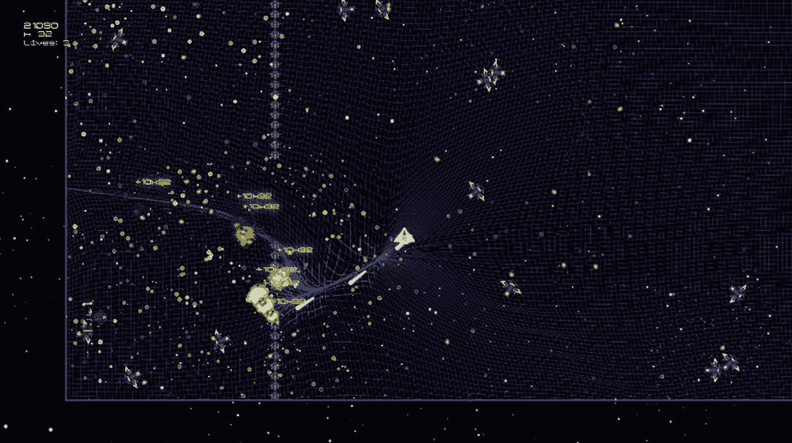
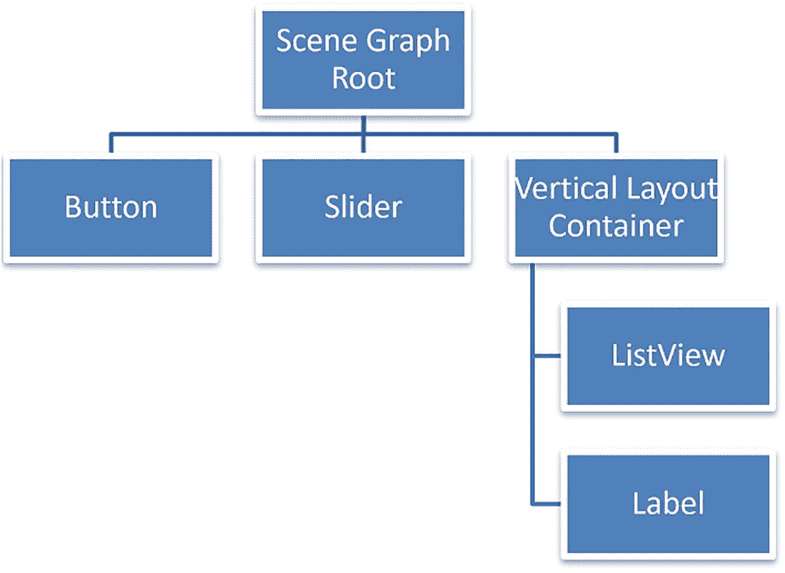
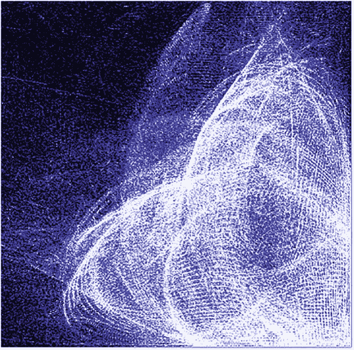
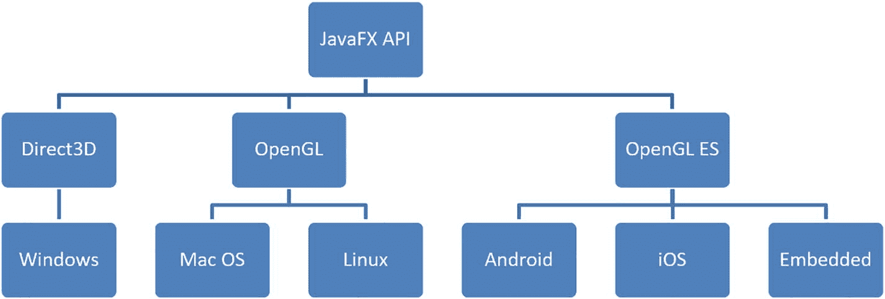
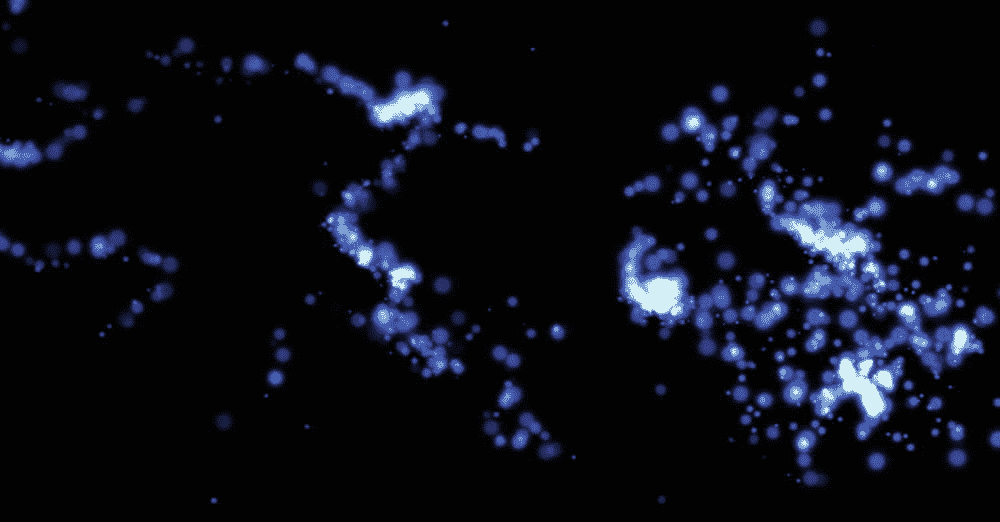
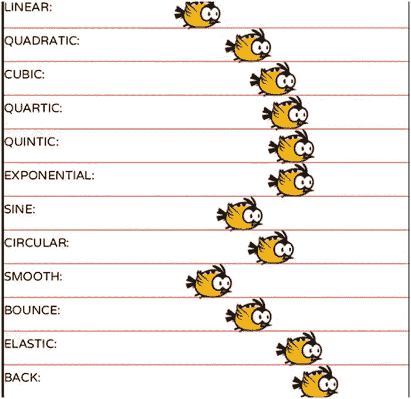

# 6. 图形、视觉效果和用户界面

本章将讨论许多与图形和渲染相关的视觉复杂特性。我们还将详细讲解 FXGL 中的粒子系统和动画系统。具体来说，我们将探讨：

*   FXGL 中的渲染管线以及对底层绘制的抽象
*   游戏层与 UI 层的分离
*   粒子系统、其配置以及如何在游戏世界中使用它
*   如何使用 FXGL API 平移、旋转和缩放游戏及 UI 元素

图形和视觉效果是现代游戏的关键方面，对于 AAA 级游戏尤其如此。虽然 FXGL 无法达到如此高强度的图形计算水平，但它仍然能够产生令人印象深刻的效果。例如，图 6-1 展示了一款应用了大量视觉效果的“射击”游戏。



一张截图展示了这款俯视角射击游戏中的场景，其中包含大量视觉效果。

图 6-1
一个使用 FXGL 开发的俯视角射击游戏示例

为了对渲染的工作原理以及所使用的概念有一个总体了解，我们通过探讨计算机图形学背后的理论以及它在 FXGL 中的实现来开启本章。在后续内容中，我们将互换使用 JavaFX 和 FXGL，因为 FXGL 中的大部分渲染管线都是由 JavaFX 提供的。


## 高级渲染与用户界面

我们从渲染流程的最顶层开始图形学之旅，这一层封装在平台特定的窗口表示中，然后一路深入，探究每个后端如何原生渲染窗口内的元素。在 JavaFX 中，原生操作系统窗口由 `Stage` 类抽象表示。在窗口渲染方面，常见的选项包括：

*   **独占全屏**（窗口独占图形适配器，使其成为显示器上唯一渲染的内容；这种方式可能导致窗口间切换困难）。
*   **窗口模式**（这是任何桌面应用的典型状态，通常可以看到窗口装饰，包括最小化、最大化和关闭按钮）。这是默认提供的选项。
*   **无边框全屏**（窗口最大化，移除边框以实现全屏效果；但由于没有独占访问权限，窗口间切换更为便捷）。

如你所知，在 `Stage` 对象内部，我们有一个 `Scene`，所有应用内容都在其中渲染。在渲染模式方面，图形学中通常区分“保留模式”和“立即模式”。在保留模式下，你通常创建 UI 对象并设置其属性；而在立即模式下，你通常通过图形调用来绘制图元。例如，假设我们希望用两种方法绘制一个矩形。使用保留模式，我们构造一个新的 `Rectangle()` 对象，并设置其 x、y、宽度和高度属性。然后，基于这些属性，JavaFX 将知道如何绘制矩形。使用立即模式，我们通常会调用四次 `drawLine()` 并传入适当参数来绘制矩形的四条边。这里使用 `drawLine()` 方法是为了提供对比示例，但需要注意的是，某些 API 可能提供直接调用 `drawRect()` 的方法来绘制矩形。我们现在探讨这些理论方法如何与 JavaFX 实现相关联，首先从保留模式开始。

### 保留模式

JavaFX 中的保留模式渲染通过场景图完成，这是一种经过轻微修改的图（回顾一下我们在前一章中介绍的图）数据结构，称为树。树数据结构有一个特殊的节点，称为根节点。场景图的根节点是顶层容器，驱动场景中 UI 对象的布局。场景图层次结构的一个示例如图 6-2 所示，该图展示了 JavaFX UI 对象（节点）如何在场景中组织。场景图从上到下、从左到右读取。



组织结构图描绘了场景图层次结构如下：场景图根节点分为按钮、滑块和垂直布局容器。垂直布局容器包含列表视图和标签。

图 6-2

一个 JavaFX 场景图示例

在图中，你会注意到某些节点包含其他节点。例如，包含 `ListView` 和 `Label` 对象的垂直布局容器被特意重命名，以演示容器内部可以包含多个节点（这些节点称为子节点）。在 JavaFX 中，垂直布局节点的实际名称是 `VBox`。不是布局容器且从用户角度旨在交互的节点通常称为控件。这些节点没有子节点。控件的示例包括 `Button` 和 `Slider`。

JavaFX 中的场景图管理应用中所有活跃 UI 对象的逻辑表示。基于此信息，场景图可以非常高效地管理这些对象。例如，如果某个 UI 对象不可见，则无需绘制它。另一个例子是“部分重绘”，即如果自上一帧以来没有重大变化，则仅重绘场景图的一部分。通常，场景图保留方法是 JavaFX 中显示视觉对象的首选方式，对于 FXGL 也是如此。这里需要注意的是，可见场景中的所有 UI 节点只能从 JavaFX 应用程序线程修改，以避免任何图形问题。在实践中，这意味着在 FXGL 中，你只应在 `initUI()` 或 `onUpdate()` 方法内部修改 UI。或者，你可以将 UI 属性绑定到 FXGL 的游戏内变量，正如我们在前几章中所做的那样，以避免手动修改视图的需要。

让我们考虑如何将保留渲染方法应用于我们的游戏世界。回想一下，实体本身不一定携带其视觉表示的信息，因为并非所有实体都需要视觉表示。为了在屏幕上显示实体，我们通常需要通过 `ViewComponent` 配置并附加其视图，然后该组件会向场景图提供渲染数据。

```
Rectangle view = new Rectangle();
// 按需配置视图
entity.getViewComponent().addChild(view);
```

将此实体添加到游戏世界将自动将其添加到场景图，因为它包含一个带有相关视图的 `ViewComponent`。在前面的示例中，我们使用了一个软件生成的形状——矩形。然而，大多数情况下，你会使用纹理作为视图。有一个 `Texture` 类正是为此设计的：

```
Texture t = FXGL.texture("player.png");
```

需要注意的是，`Texture` 也是一个 JavaFX 节点，因此你可以在 UI 中的任何位置使用它，而不仅仅用于 FXGL 实体。

在 FXGL 的保留模式下，场景图被分为两部分：游戏层和顶部的 UI 层。游戏层是你的世界显示的地方。游戏层中的坐标可以延伸到可见视口之外（我们将在本节稍后介绍视口概念）。随着你的玩家移动，世界的其他部分将变得可见。尽管游戏层的大部分由实体组成，但也可以添加不与任何实体关联的视图：


```
Node node = ...
getGameScene().addGameView(new GameView(node, 0));
```

传递给 `GameView` 构造函数的 0 值是该视图的 z-index。z-index 是一个整数值，用于定义视图在 FXGL 场景图中游戏层部分的绘制顺序。该值越高，视图就越接近绘制堆栈的顶部。换句话说，z-index 为 1 的节点将绘制在任何索引低于 1 的节点之上。类似地，如果我们添加一个 z-index 为 2 的节点，它将被绘制在 z-index 为 0 和 1 的节点之上。

UI 层是您的 HUD（抬头显示）和各种 UI 元素（包括菜单）所在的位置。它通常用于提供关于游戏和玩家状态的信息。该视图固定在可见视口中，其坐标系始终在 (0, 0) 到 (width, height) 范围内。这意味着当玩家可以在世界中自由移动时，UI 保持固定在一个位置。固定的坐标也简化了 UI 元素的设计和定位。要将节点添加到 UI 层，您可以调用以下代码：

```
Node node = ...
// 使用 setLayout / setTranslate 方法定位
getGameScene().addUINode(node);
```

关于 UI 层中的菜单，FXGL 使用工厂模式来处理这些对象。要提供您自己的菜单实现，我们需要做两件事：首先，创建您的菜单类，该类继承 `FXGLMenu`；其次，创建您的工厂类，该类继承 `SceneFactory`。例如：

```
public class MyMenu extends FXGLMenu {
public MyMenu(MenuType type) {
super(type);
getContentRoot().getChildren().addAll( ... );
}
}
```

`MenuType.MAIN_MENU` 是在应用程序启动时显示的菜单。当主菜单显示时，游戏尚未初始化。`MenuType.GAME_MENU` 是玩家在游戏过程中可以打开的菜单。这两种菜单的视图和功能都可以通过继承 `FXGLMenu` 来实现。完成后，我们需要告诉 FXGL 如何构造您的自定义菜单，这通过场景工厂来完成：

```
public class MySceneFactory extends SceneFactory {
public FXGLMenu newMainMenu() {
return new MyMenu(MenuType.MAIN_MENU);
}
public FXGLMenu newGameMenu() {
return new MyMenu(MenuType.GAME_MENU);
}
}
```

最后，剩下唯一要做的事情就是告诉 FXGL 使用哪个工厂类。这可以通过在 `initSettings()` 方法中设置场景工厂来实现，如下所示：

```
settings.setSceneFactory(new MySceneFactory());.
```

### 即时模式

在介绍了 FXGL 中保留模式的基础知识之后，我们现在简要地考虑一下即时模式。如果您尝试运行过一些 FXGL 示例，或者只是浏览过代码，您可能已经注意到，并没有显式的 `render()` 方法需要重写来提供您自己的渲染例程。部分原因是 FXGL 旨在提供非常高级的 API，并将大部分底层代码隐藏在引擎幕后。实际原因是 JavaFX 只允许访问保留图形模式，这意味着我们不是自己绘制对象，而是指定要绘制什么。尽管如此，如果确实需要，我们可以使用 `GraphicsContext` 对象来模拟直接绘制。可以通过首先构造一个 `Canvas` 对象并将其添加到 UI 层来获得它，如下所示：

```
@Override
protected void initGame() {
Canvas canvas = new Canvas(width, height);
addUINode(canvas);
}
```

接下来，在应用程序的 `onUpdate()` 方法中，我们可以获取对 `GraphicsContext` 对象的引用，然后手动在其上绘制。

```
@Override
protected void onUpdate(double tpf) {
GraphicsContext g = canvas.getGraphicsContext();
}
```

我们可以像直接绘制到屏幕上一样在 `g` 上绘制。在这种情况下，图形上下文位于游戏层中所有元素的顶部（因为它被添加到 UI 层）。因此，您用它绘制的任何内容都将绘制在现有游戏和实体视图之上。值得注意的是，只有当您的游戏需要更高性能或需要显示许多实体时，才应该使用 `GraphicsContext`；否则，场景图（保留）模式可能更优。

为了使用即时模式获得更高的渲染性能，您可以查看 `PixelBuffer`，它是在 JavaFX 13 中引入的，允许通过 `WritableImage` 直接绘制到屏幕的可见区域。一个有用的额外好处是这种绘制可以并行化。换句话说，您可以将绘制区域分成多个部分，使得每个部分由单独的线程并行绘制，从而可能进一步提高渲染性能。然而，这种方法的主要缺点是 `PixelBuffer` 本身不提供任何光栅化手段。这意味着如果您想绘制一个矩形，您需要逐像素地绘制它。可以想象，这是一个相当大的限制，因此，只有在您明确需要性能时才应使用此方法。如果您确实想尝试这种渲染方法，搜索“JavaFX `PixelBuffer` example”会得到一些有用的结果。至此，我们完成了对 FXGL 中两种高级渲染方法的概述，现在我们的注意力转向低级渲染能力和视口。


## 底层渲染与视口

视口是通往游戏世界的窗口，也是用户看到的可见区域。实际上，FXGL 中的视口承担了摄像头的职责。当构建的游戏世界大于单个屏幕时，FXGL 允许调整视口，以便“摄像头”可以移动，显示游戏世界的其他部分。你可以通过以下方式获取视口的引用：

```
Viewport viewport = getGameScene().getViewport();
```

你可以通过调用以下方法手动更改视口的 x 和 y 值：

```
viewport.setX(...);
viewport.setY(...);
```

虽然你可以使用 JavaFX 的 X 和 Y 属性来绑定到任何实体的 X 和 Y，但 API 提供了一个内置方法来绑定视口，使其自动跟随实体：

```
Entity player = ...;
// distX, distY 定义了原点与实体之间的距离
viewport.bindToEntity(player, distX, distY);
```

当视口跟随玩家时，它可能会超出关卡边界。你可以设置视口可以“游荡”的边界范围：

```
viewport.setBounds(minX, minY, maxX, maxY);
```

使用这种方法，你可以确保视口始终渲染游戏边界内的视图。

我们已经了解了如何通过保留模式和立即模式进行高级绘制，包括如何使用视口修改屏幕的可见区域。然而，在底层，大致了解像素如何运作以及绘制单个像素需要哪些信息也很重要。单个像素的颜色可以用 RGBA 对象表示，其中字母分别代表红色、绿色、蓝色和 Alpha 通道。根据每个通道值的表示方式，它可以是 0.0 到 1.0 之间的浮点数范围，也可以是 0 到 255 之间的整数。通过组合红色、绿色和蓝色的值，可以构建出一系列颜色。最终结果还由 Alpha 通道决定，其中 0.0（或 0）表示颜色完全透明（实际上不可见），1.0（或 255）表示颜色完全不透明。此范围内的任何值都提供一定程度的透明度，使得可以看穿这个特定像素。通过使用不同透明度值的组合，可以实现许多视觉上吸引人的效果，例如图 6-3 中所示的效果，其中多个椭圆形重叠，每个椭圆形都以自己的不透明度绘制。



一个视觉效果截图，通过重叠多个具有不同不透明度的椭圆形创建。

图 6-3

叠加多个具有不同不透明度（Alpha 通道值）的像素

当像素重叠时，最终颜色通过混合模式确定。混合可以描述为一个函数，它接收两个像素——底部已经绘制好的像素和顶部即将绘制的像素——并返回组合后的颜色。由于该函数可以自由实现任何混合两种颜色以获得最终颜色的方式，因此可能存在无限多种混合函数，尽管有些（如 `SRC_OVER` 和 `ADD`）比其他函数更常见。例如，JavaFX 使用的默认混合函数称为 `SRC_OVER`，它简单地返回顶部颜色。`ADD` 混合函数将两种颜色相加并返回结果。在 FXGL 中，`Texture` 类提供了一系列这些混合函数，由于它们作用于底层图像数据，因此没有渲染开销。但是，如果你需要动态混合，仍然可以使用 JavaFX 的 `BlendMode`，但如果节点数量很大，它可能会很耗费资源。

现在我们已经了解了像素的最终颜色是如何处理的，渲染堆栈的最后一部分是如何将所有像素信息显示到屏幕上。最终，这些像素将由特定于目标平台（应用程序运行所在的平台）的后端实现来绘制。我们已经看到，JavaFX 管道提供了一组可用于实现高性能渲染的高级 API。这些 API 由一系列平台特定的本地代码类实现。渲染背后使用的技术包括 Windows 上的 Direct3D、macOS 和 Linux 上的 OpenGL，以及移动和嵌入式设备（如树莓派）上的 OpenGL ES。该堆栈的可视化表示见图 6-4。macOS 上的现代图形实现也利用 Metal 进行精细调整的性能优化。



一个组织结构图。Java F X A P I 被分类为 Direct 3 D、Open G L、Open G L E S。Direct 3 D 用于 Windows。Open G L 用于 Mac O S 和 Linux。Open G L E S 用于 Android、I O S、嵌入式设备。

图 6-4

不同的 JavaFX 渲染后端

至此，我们完成了对 FXGL 渲染管线的概述，接下来将介绍可以使用此管线生成的视觉效果。

## 视觉效果系统

FXGL 中存在许多系统，允许使用视觉上吸引人的效果。所有这些系统都建立在上述渲染堆栈之上，并提供用户友好的 API 来访问所需功能。常用的系统包括粒子系统、动画系统和插值系统，以下小节将对它们进行详细说明。


### 粒子系统

粒子效果是一组视觉效果，其中每个独立的视图被称为一个粒子。这些效果通常色彩丰富且富有动感，因此能轻松让任何游戏元素变得生动。在 FXGL（以及其他引擎）中，控制所有粒子及其行为的系统被称为粒子系统。一个粒子可以由一个微小的几何（可能带有纹理）对象来表示，并具有某些属性，例如速度、加速度、缩放、生命周期、不透明度等等。最后，粒子发射器是一种构造，用于配置粒子如何以及何时被创建。单个粒子在绘制时，可能看起来就像任何其他普通的游戏对象。然而，当大量绘制时，这些粒子可以创造出非凡的视觉效果，例如图 6-5 中所示的效果。



一张由大量粒子创建的视觉效果截图。

图 6-5

FXGL 中粒子效果的一个示例

在 FXGL 中使用粒子系统的常见方法包括：获取一个内置发射器（FXGL 在 `ParticleEmitters` 类中提供了几个内置发射器），然后根据需要进行配置，以产生所需的视觉效果。粒子发射器本身不是一个图形对象；因此，它需要一个“桥梁”才能被添加到 FXGL 的场景图中。有两个这样的桥梁：`ParticleComponent` 和 `ParticleSystem`。你可能已经猜到，前者允许将发射器附加到一个实体上，从而将发射器添加到游戏层，而后者则将发射器附加到 UI 层。

配置发射器通常很简单。例如，代码清单 6-1 中的发射器使用了一个现有的爆炸发射器配置，并将最大发射次数设置为 2，每次发射的粒子数设置为 50，最后，将发射率设置为 0.5（1 表示每帧发射一次；0.5 表示每两帧发射一次）。在实践中，该发射器将发射两次：第一次在第一帧，第二次在跳过一个帧之后。每次发射将产生 50 个粒子。从 代码清单 6-1 中可以看出，还可以设置各种其他属性，因此鼓励读者尝试这些设置，以观察它们对视觉效果的影响。

```
var emitter = ParticleEmitters.newExplosionEmitter(300);
emitter.setMaxEmissions(2);
emitter.setNumParticles(50);
emitter.setEmissionRate(0.5);
emitter.setSize(1, 24);
emitter.setScaleFunction(i -> FXGLMath.randomPoint2D());
emitter.setExpireFunction(i -> Duration.seconds(2.5));
emitter.setAccelerationFunction(() -> Point2D.ZERO);
emitter.setBlendMode(BlendMode.ADD);
// ... 其他属性
代码清单 6-1
配置粒子发射器
```

一旦发射器配置完成，我们可以使用 `ParticleComponent` 使发射器成为游戏的一部分：

```
var e = new Entity();
e.addComponent(new ParticleComponent(emitter);
```

将 `e` 添加到游戏世界也会自动将粒子效果添加到 FXGL 场景图中，从而使其在游戏中可见。类似地，要从游戏中移除粒子效果，我们只需要从世界中移除该实体（效果所附加到的实体）。

### 动画系统

除了粒子效果之外，还有其他方法可以让任何静态图像变得生动。我们现在介绍各种为视觉对象添加动画的方法。动画是任何动态游戏元素或视觉上吸引人的用户界面的常见组成部分。从根本上说，动画是某个值随时间的变化。如果我们改变的值直接影响任何可见属性，那么我们在屏幕上看到的内容就会变得动态。常用的动画属于以下类别之一：

*   平移（沿 X、Y 或 Z 轴改变对象的位置）
*   旋转（沿 X、Y 或 Z 轴改变对象的角度）
*   缩放（沿 X、Y 或 Z 轴改变对象的大小）
*   不透明度（在 0% 到 100% 之间改变对象的透明度）
*   颜色（改变对象的 RGBA 值）
*   自定义（改变对象的自定义属性）

让我们考虑 代码清单 6-2 中的示例。在这个例子中，我们有一个标准的 JavaFX `Rectangle`（尽管你也可以使用一个实体），我们将沿 X 轴平移它。与你熟悉的实体构建器一样，我们可以使用动画构建器来简化动画的构建。一旦通过 `animationBuilder()` 获得了构建器的引用，我们就可以设置单个周期的持续时间、动画重复的次数，以及在交替周期中是否应该自动反转。接下来，我们决定要使用前面提到的哪个类别来制作动画。由于我们选择了平移，在 代码清单 6-2 中，我们调用了 `translate()`，它进而允许我们使用特定属性（例如 `from` 和 `to` 点）进一步配置动画。最后，我们调用 `buildAndPlay()`，顾名思义，它将构建动画并开始播放。默认情况下，动画在游戏场景内播放。如果你需要更改执行动画的场景，例如菜单场景，那么你可以在调用动画构建器时简单地传递对场景对象的引用。要构建其他动画类型，存在相应的方法，例如 `rotate()`、`scale()`、`fade()`，以及其他更通用的方法，例如 `animate()`。

```
var node = new Rectangle();
animationBuilder()
.duration(Duration.seconds(2.0))
.repeat(2)
.autoReverse(true)
.translate(node)
.from(new Point2D(0.0, 100.0))
.to(new Point2D(200.0, 100.0))
.buildAndPlay();
代码清单 6-2
为 JavaFX 节点添加动画
```


### 插值系统

如果动画是数值的变化，那么插值（也称为缓动或补间）就是这种变化的速率。例如，假设你有一个淡出动画，会在两秒内将玩家实体的不透明度从 `1.0` 变为 `0.0`。默认情况下，FXGL 使用线性插值器，这意味着动画每秒的进度是相同的。因此，如果从 `1.0` 到 `0.0` 需要两秒，那么显而易见，一秒后玩家的不透明度将是 `0.5`。如果我们使用任何非线性插值器，那么动画的速率就会不同，因此一秒后，不透明度值可能大于或小于 `0.5`。从视觉上看，这意味着玩家淡出的速度会变慢或变快。

我们应该注意，使用不同的插值器不会改变动画的起始值、结束值或持续时间。相反，插值器会影响动画期间计算出的数值。实际上，插值就是时间与进度之间的比率，其中线性插值器仅提供 1:1 的比率，即经过 50% 的时间等同于完成 50% 的进度。因此，插值器可以很容易地表示为一个函数：

```
double interpolate(double time) {
double progress = ...
return progress;
}
```

这个函数可以使用任意数学运算，将介于 0 和 1 之间的时间值转换为（同一范围内的）进度值。你可以在图 6-6 中看到常见插值器（FXGL 已提供）的结果。鸟实体动画在两秒内将其从左侧平移到右侧。当时间值为 0 时，所有鸟实体，无论其插值器如何，都将从左侧开始；当时间值为 1 时，它们都将到达右侧的同一位置（沿 X 轴）。该图显示的时间值接近 0.4。



一张图表描绘了不同插值器在时间值接近 0.4 时的效果。对于弹性（elastic）和回退（back）插值器，鸟实体更接近 X 轴的末端。对于线性（linear）和平滑（smooth）插值器，鸟实体更接近 X 轴的起点。对于二次（quadratic）、三次（cubic）、四次（quartic）、五次（quintic）、指数（exponential）、正弦（sine）、圆形（circular）和弹跳（bounce）插值器，鸟实体位于两者之间。

图 6-6

不同插值器对动画进度的影响

最后需要指出的是，从动画的角度来看，JavaFX 节点和 FXGL 实体之间没有区别。因此，两者的 API 是相同的。基于此，我们完成了对 FXGL 视觉系统的概述。

## 总结

在本章中，我们研究了渲染基础以及它们在 FXGL 中的实现方式。我们了解了如何将标准的 JavaFX 控件添加到 FXGL UI，以及 UI 层如何与游戏层分离。使用 JavaFX 控件是一个重要特性，因为它表明 JavaFX 开发者无需学习新的 API，可以直接使用他们已有的知识。我们学习了如何使用粒子系统构建复杂的视觉效果，并对其进行配置以适配我们的游戏。最后，我们介绍了如何为游戏和 UI 元素添加动画，以及如何使用插值器配置动画。本章的关键信息是，尽管图形理论可能是一个非常复杂的主题，但 JavaFX 和 FXGL 中的高级抽象允许开发者充分利用目标平台的渲染能力，而无需访问底层实现细节。

