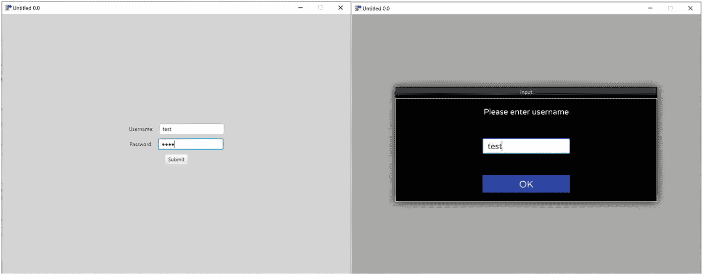
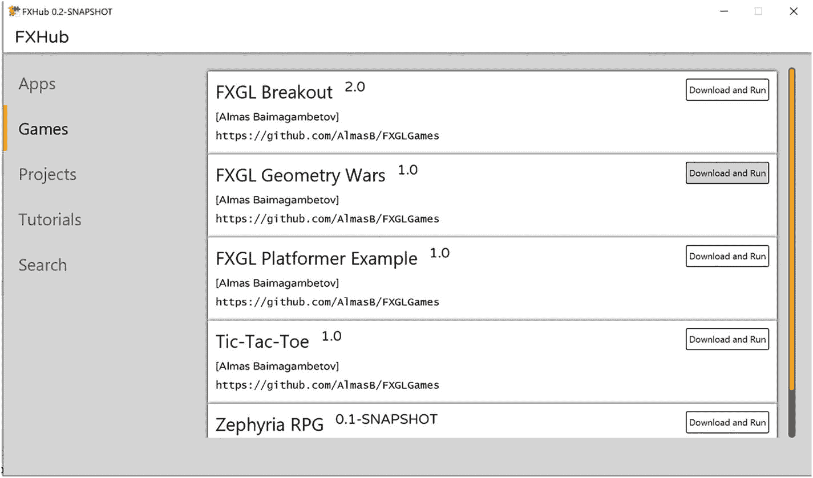
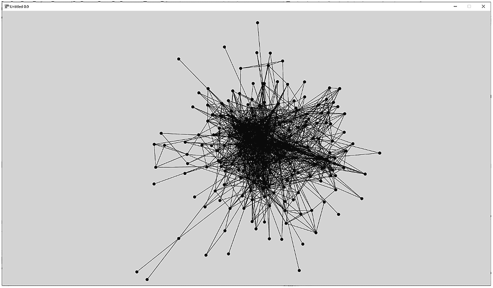
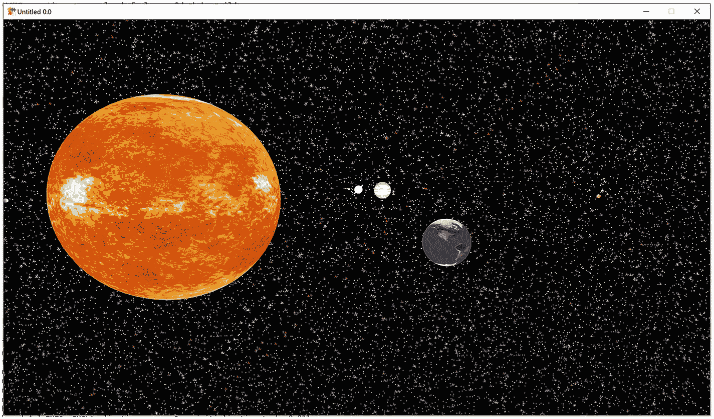

# 7. 通用应用程序与打包

本章专门介绍可以使用 FXGL 开发的通用（非游戏）应用程序。这些包括商业应用程序、图形编辑器和可视化工具。从高层次来看，游戏应用程序与前端的商业应用程序并没有太大区别。它们都在一个无限循环中运行，直到用户退出应用程序。它们都接收输入，更新应用程序状态，最后将状态渲染到屏幕上。为了证明 FXGL 可用于开发游戏和非游戏应用程序，我们将介绍：

*   一个带有登录界面和业务逻辑的应用程序
*   一个图形数据可视化工具
*   我们太阳系的简单 3D 表示

我们还将介绍 JavaFX 和 FXGL 应用程序（包括游戏）的打包和跨平台部署，以便交付给最终用户。这简化了运行最终用户应用程序的过程，并且可以通过使用 OpenJFX 和 GluonFX Maven 插件来实现。


## 业务应用

我们将从一个简单且琐碎的例子开始探索通用型应用。我们构建的应用会获取用户凭证，检查其是否有效，并提供创建新账户的 API。图 7-1 展示了登录界面和主用户界面。



两张截图。第一张展示了一个用户界面，包含两个分别标记为“用户名”和“密码”的文本框。文本框下方是一个提交按钮。第二张展示了一个用户界面，其标题居中显示为“输入”。标题下方有一段文字“请输入用户名”，接着从上到下依次是一个文本框和一个确定按钮。

图 7-1

一个结合了标准 JavaFX 和内置 FXGL 控件的草图用户界面

整个应用的代码见代码清单 7-1。如你所见，有两个实例级变量 `loginRoot` 和 `mainRoot`，分别代表登录界面和主界面。代码的关键部分在 `initGame()` 方法内，应用的大部分初始化工作都在此完成。在图 7-1 的左侧，我们看到界面有两个字段：一个用于输入用户名，一个用于输入密码。我们在 `initGame()` 中创建这些字段，并用水平布局框将它们包裹起来，该布局框还包含描述标签，以帮助用户了解应输入什么内容。接下来，我们创建“提交”按钮，其作用是检查输入是否有效，如果有效，则显示主视图（即，将根节点切换为 `mainRoot`）。在实际应用中，当提交的凭证无效时，我们可能还需要执行某些操作。例如，我们可以显示一条通用通知，告知用户输入了无效凭证。最后，你会注意到 `loginRoot` 对象只是一个包含我们创建对象的垂直布局框，而 `mainRoot` 则是一个仅包含一个项目——`btnAddNew` 按钮的容器，点击该按钮会显示图 7-1 中的对话框。

```
import com.almasb.fxgl.app.*;
import javafx.geometry.Pos;
import javafx.scene.Cursor;
import javafx.scene.Node;
import javafx.scene.control.*;
import javafx.scene.layout.*;
import javafx.scene.paint.Color;
import static com.almasb.fxgl.dsl.FXGL.*;
public class BusinessApp extends GameApplication {
private VBox loginRoot;
private StackPane mainRoot;
@Override
protected void initSettings(GameSettings settings) { }
@Override
protected void initGame() {
getGameScene().setBackgroundColor(Color.LIGHTGRAY);
getGameScene().setCursor(Cursor.DEFAULT);
var fieldUsername = new TextField();
var fieldPassword = new PasswordField();
var box1 = new HBox(10, new Label("Username: "), fieldUsername);
var box2 = new HBox(10, new Label("Password: "), fieldPassword);
box1.setAlignment(Pos.CENTER);
box2.setAlignment(Pos.CENTER);
var btn = new Button("Submit");
btn.setOnAction(e -> {
if (isValid(fieldUsername.getText(), fieldPassword.getText())) {
showMainView();
}
});
loginRoot = new VBox(10, box1, box2, btn);
loginRoot.setAlignment(Pos.CENTER);
loginRoot.setPrefSize(getAppWidth(), getAppHeight());
var btnAddNew = new Button("Add New");
btnAddNew.setOnAction(e -> {
showAddNewDialog();
});
mainRoot = new StackPane(btnAddNew);
mainRoot.setPrefSize(getAppWidth(), getAppHeight());
addUINode(loginRoot);
}
private boolean isValid(String name, String password) {
return true;   // code to check if account is valid
}
private void showMainView() {
removeUINode(loginRoot);
addUINode(mainRoot);
}
private void showAddNewDialog() {
getDialogService().showInputBox("Please enter name", name -> {
getDialogService().showInputBox("Please enter password", password -> {
// code to add new accounts
});
});
}
public static void main(String[] args) {
launch(args);
}
}
代码清单 7-1
一个带有登录界面的业务应用示例实现
```

在这个虽显刻意但富有洞察力的业务应用中，我们主要使用了内置的 JavaFX 控件。然而，需要注意的是，FXGL 用户界面并不局限于普通的 JavaFX 控件，其视图可以像普通 JavaFX 应用一样通过 CSS 进行自定义。图 7-2 展示了一个名为 FXHub 的 FXGL 应用示例，其视图比我们构建的应用略为复杂。这应该能让你了解从用户界面美学角度可以实现什么样的效果。现在，我们将进入下一节的示例，该示例将说明并非所有应用都需要传统的用户界面才能发挥作用和具有实用性。



一张截图展示了一个用户界面，标题为“F x hub”。页面有 5 个标签页，包括“应用”、“游戏”、“项目”、“教程”和“搜索”。“游戏”标签页左侧列出了 5 款游戏及其版本和 URL。每款列出的游戏右侧都有一个“下载并运行”按钮。

图 7-2

使用 FXGL 构建的 FXHub 软件的主用户界面


## 图数据可视化工具

在本节中，我们将使用来自 [`https://snap.stanford.edu/data/`](https://snap.stanford.edu/data/) 的 Twitter 社交网络数据子集，并开发一个 FXGL 应用程序，以图形形式可视化这些数据。回顾第 5 章，图是由节点（项目）集合和连接节点的边集合组成的。图数据来源于多个领域：从文件系统和社交网络到足球比赛和生物医学科学。通常使用图可视化来识别项目之间的连接，或探索项目组之间的关系。我们构建的应用程序截图如图 7-3 所示，其中可以看到一个中等复杂程度的图。



该截图展示了一个复杂图，其中包含大量节点和大量相互连接节点的边。

图 7-3

一个示例 Twitter 网络的可视化

我们从上述来源获取的数据采用特定的纯文本格式，其中每一行由两个数字（ID）组成，中间用单个空格分隔，如下所示：

```
number1 number2
number3 number4
...
```

每个数字（ID）标识一个节点（在我们的上下文中指人）：这些节点在图 7-3 中绘制为小圆圈。每行文本表示两个节点（人）之间存在一条边（关系）：这些关系在图 7-3 中绘制为线条。本质上，高级算法如下：为每个节点绘制一个圆圈，并为每条边绘制一条线。该算法以及 FXGL 应用程序在清单 7-2 中实现，我们现在将详细探讨。

`GraphVisSample` 类中有三个字段：一个用于存储表示节点的圆圈的半径，一个用于存储从节点 ID 到应用程序中关联实体的映射，最后一个用于存储图数据中的边（如果愿意，也可以将其存储为列表）。此外，还有五个值得注意的方法：`initGame()`、`onUpdate()`、`makeNode()`、`forceBounds()` 和 `hash()`。

在 `initGame()` 中，我们：

*   将图数据（采用之前定义的纯文本格式）加载为 `List<String>`，其中列表中的每个项都是一行文本
*   在列表上调用 `forEach()` 来处理每一行
*   将每一行拆分为两个标记（两个整数节点 ID），并让 `makeNode()` 从节点 ID 构造一个实体
*   在两个节点之间添加一条新边，因为每行文本表示一种关系

我们看到每条边的起点和终点都绑定到可视化节点的实体的位置上。使用这种方法，我们在移动节点时无需手动移动边。为了避免为每条边添加一个实体，我们构造了一个名为“background”的单一实体，并将所有边附加到该实体上。最后，我们通过使用 `hash()` 对两个节点 ID 进行“哈希处理”来存储边数据。这种方法使我们能够为给定的一对节点生成唯一标识符，无论这对节点的顺序如何。

在 `onUpdate()` 中，我们基于 Fruchterman-Reingold 力模型实现图节点和边的布局算法。关于图布局算法的讨论超出了本书的范围；然而，简单来说，有边相连的节点相互吸引，而没有边的节点相互排斥。因此，我们只需要将有线条连接的节点移近，并将没有连接的节点移远。该算法可以通过遍历应用程序中的每一对节点并应用适当的移动来实现。我们需要注意，这些移动调用可能会将节点移出屏幕边界。通常我们不希望发生这种情况，因此在每次检查结束时，我们调用 `forceBounds()` 来将所有节点保持在屏幕的可见部分内。

`forceBounds()` 方法很简单，包含四个“if”语句检查，分别对应屏幕的四个边。如果实体（节点）超出其中某一边，它会被拉回以保持在屏幕边界内。

`makeNode()` 方法构造一个以 `Circle` 作为其视图的实体，并最初将其随机放置在屏幕上。我们还附加了一个之前未使用过的内置组件 `DraggableComponent`。通过将其附加到任何实体，我们可以点击该实体并用鼠标在屏幕上拖动它。由于图布局算法使所有节点持续运动，拖动一个节点会使图自行重新排列，从而为用户带来吸引人的交互体验。事实上，通过添加一个点击处理程序，在点击时显示关于该节点的一些信息，我们可以轻松扩展此应用程序。此功能的实现留给读者自行探索。


```
import com.almasb.fxgl.app.GameApplication;
import com.almasb.fxgl.app.GameSettings;
import com.almasb.fxgl.core.math.FXGLMath;
import com.almasb.fxgl.dsl.components.DraggableComponent;
import com.almasb.fxgl.entity.Entity;
import javafx.geometry.Rectangle2D;
import javafx.scene.paint.Color;
import javafx.scene.shape.Circle;
import javafx.scene.shape.Line;
import java.util.HashMap;
import java.util.Map;
import static com.almasb.fxgl.dsl.FXGL.*;
public class GraphVisSample extends GameApplication {
private static final double NODE_RADIUS = 5;
private Map nodes = new HashMap();
private Map edges = new HashMap();
@Override
protected void initSettings(GameSettings settings) {
settings.setWidth(1600);
settings.setHeight(900);
}
@Override
protected void initGame() {
getGameScene().setBackgroundColor(Color.LIGHTGRAY);
Entity background = new Entity();
getGameWorld().addEntity(background);
getAssetLoader().loadText("twitter_edges.txt")
.forEach(line -> {
var tokens = line.split(" +");
int n1 = Integer.parseInt(tokens[0]);
int n2 = Integer.parseInt(tokens[1]);
Entity e1 = nodes.get(n1);
if (e1 == null)
e1 = makeNode(n1)
Entity e2 = nodes.get(n2);
if (e2 == null)
e2 = makeNode(n2);
var edge = new Line();
edge.startXProperty().bind(e1.xProperty().add(NODE_RADIUS));                      edge.startYProperty().bind(e1.yProperty().add(NODE_RADIUS));
edge.endXProperty().bind(e2.xProperty().add(NODE_RADIUS)          edge.endYProperty().bind(e2.yProperty().add(NODE_RADIUS));
background.getViewComponent().addChild(edge);
edges.put(hash(e1, e2), true);
});
}
@Override
protected void onUpdate(double tpf) {
double K = 50;
var entities = getGameWorld().getEntities();
// 从索引 1 开始，跳过背景实体
for (int i = 1; i  e2
var v = e2.getPosition()
.subtract(e1.getPosition());
double d = v.magnitude();
// 如果 e1 和 e2 之间存在边
if (edges.containsKey(hash(e1, e2))) {
double force = d * d / K * tpf;
e1.translate(v.normalize().multiply(force));
e2.translate(v.normalize().multiply(-force));
}
if (d > 0.0) {
double force = K * K / d * tpf;
e1.translate(v.normalize().multiply(-force));
e2.translate(v.normalize().multiply(force));
forceBounds(e1);
forceBounds(e2);
}
}
}
}
private Entity makeNode(int id) {
var e = entityBuilder()
.at(FXGLMath.randomPoint(new Rectangle2D(0, 0, getAppWidth(), getAppHeight())))
.view(new Circle(NODE_RADIUS,NODE_RADIUS,NODE_RADIUS))
.with("id", id)
.with(new DraggableComponent())
.buildAndAttach();
nodes.put(id, e);
return e;
}
private void forceBounds(Entity e) {
if (e.getX()  getAppWidth())
e.setX(getAppWidth() - 10);
if (e.getY() + 10 > getAppHeight())
e.setY(getAppHeight() - 10);
}
private int hash(Entity e1, Entity e2) {
var hash1 = e1.hashCode();
var hash2 = e2.hashCode();
return hash1 > hash2
? 31 * (31 + hash1) + hash2
: 31 * (31 + hash2) + hash1;
}
public static void main(String[] args) {
launch(args);
}
}
代码清单 7-2
一个图可视化应用的示例实现
```

可以看到，借助这个相对简单的图绘制应用，我们已经开发出了一款在实际世界中可用的软件。具体来说，这个演示程序让我们能够探索来自各种来源的图数据——这些数据不一定来自社交网络。至此，我们的可视化演示程序就完成了，接下来我们将进入下一个激动人心的应用，它将空间、3D 和动态模拟结合在一起。

## 3D 太阳系

在本节中，我们将首次使用 FXGL 的 3D 功能。虽然本节并非旨在全面概述 3D 能实现的所有功能，但它演示了在 FXGL 中此类应用的基本原理。当你学习完本节内容后，你会注意到，除了渲染之外，2D 和 3D 之间几乎没有区别。

### 天体数据与逻辑

你可能已经见过太阳系的不同表现形式。图 7-4 就是其中一种，它是我们将要开发的应用的截图。回想一下，在构建游戏时，我们通常会从定义实体类型开始。在这个应用中，由于我们没有不同的实体类型（图 7-4 中显示的所有实体都只是天体），因此我们转而从定义天体的属性开始。由于这些天体的对象是预定义的，也就是说我们不会在运行时引入任何新天体，因此使用名为 `CelestialBody` 的 `enum` 来定义它们是合理的。完整的定义见代码清单 7-3。简单来说，每个天体都有以公里为单位的直径、以公里/秒为单位的自转速度、以 10⁶ 公里为单位的与太阳的距离、以天为单位的公转周期，以及最后用于该天体的纹理图像。这些天体使用的图像资源来自 [`www.solarsystemscope.com/textures/`](http://www.solarsystemscope.com/textures/)，遵循 CC-BY 4.0 许可，不过你也可以使用任何合适的图像。最后，天体的数值数据来自 [`https://nssdc.gsfc.nasa.gov/planetary/factsheet/`](https://nssdc.gsfc.nasa.gov/planetary/factsheet/)。

```
import javafx.scene.image.Image;
import static com.almasb.fxgl.dsl.FXGL.image;
public enum CelestialBody {
// 按 0.2 比例缩小，以便其他天体可见
SUN(1392680 * 0.2, 1.997, 0, 0, image("2k_sun.jpg")),
MERCURY(4879, 0.003026, 57.9, 88, image("2k_mercury.jpg")),
VENUS(12104, 0.00181, 108.2, 224.7, image("2k_venus_surface.jpg")),
EARTH(12756, 0.4651, 149.6, 365.2, image("2k_earth_daymap.jpg")),
MARS(6792, 0.24117, 228.0, 687.0, image("2k_mars.jpg")),
JUPITER(142984, 12.6, 778.5, 4331, image("2k_jupiter.jpg")),
SATURN(120536, 9.87, 1432.0, 10747, image("2k_saturn.jpg")),
URANUS(51118, 2.59, 2867.0, 30589, image("2k_uranus.jpg")),
NEPTUNE(49528, 2.68, 4515.0, 59800, image("2k_neptune.jpg"));
// 直径，单位：公里
private double diameter;
// 自转速度，单位：公里/秒
private double rotationSpeed;
// 与太阳的距离，单位：10⁶ 公里
private double distanceFromSun;
// 公转周期，单位：天
private double orbitalPeriod;
private Image image;
CelestialBody(double diameter, double rotationSpeed, double distanceFromSun, double orbitalPeriod, Image image) {
this.diameter = diameter;
this.rotationSpeed = rotationSpeed;
this.distanceFromSun = distanceFromSun;
this.orbitalPeriod = orbitalPeriod;
this.image = image;
}
public double getDiameter() {
return diameter;
}
public double getRadiusScaled(double scale) {
return diameter * scale / 2.0;
}
public double getRotationSpeed() {
return rotationSpeed;
}
public double getDistanceFromSun() {
return distanceFromSun * 1_000_000;
}
public double getOrbitalPeriod() {
return orbitalPeriod;
}
public Image getImage() {
return image;
}
}
代码清单 7-3
模拟中使用的数据定义与属性
```



一张描绘太阳系草图的截图。太阳在左侧，地球在右侧，另外两颗行星在中间。背景为深色，散布着浅色粒子。

图 7-4

FXGL 中太阳系的草图表示（太阳未按精确比例缩小，以便其他实体清晰可见）


由于演示中的所有实体均为天体且仅需一种行为，我们将为它们统一使用一个组件，其实现见代码清单 7-4。你会注意到它相对简单。利用天体的`enum`数据，我们构建并应用了两个动画：一个用于绕自身轴旋转，另一个用于绕太阳公转。要绕特定点旋转，需调用`origin()`方法设置该点。但需注意，第一个动画无需调用`origin()`方法，因为默认情况下 3D 旋转是围绕实体中心进行的，而这正是我们所需。对于第二个动画，旋转需要围绕另一个点进行，具体来说是太阳实体的中心。由于我们将太阳放置在`(0,0,0)`处，将原点设置为`(-entity.getX(),0,0)`即可，因为每个实体的 X 值等于其到世界中心`(0,0,0)`的距离。

```
import com.almasb.fxgl.entity.component.Component;
import javafx.geometry.Point3D;
import javafx.scene.shape.Sphere;
import javafx.util.Duration;
import static com.almasb.fxgl.dsl.FXGL.animationBuilder;
public class CelestialBodyComponent extends Component {
private CelestialBody data;
private Sphere view;
public CelestialBodyComponent(CelestialBody data) {
this.data = data;
}
@Override
public void onAdded() {
view = (Sphere) entity.getViewComponent().getChildren().get(0);
animationBuilder()
.duration(Duration.seconds(data.getRotationSpeed() * 3))
.repeatInfinitely()
.rotate(view)
.from(new Point3D(0, 0, 0))
.to(new Point3D(0, 360, 0))
.buildAndPlay();
animationBuilder()
.duration(Duration.seconds(data.getOrbitalPeriod() * 0.1))
.repeatInfinitely()
.rotate(entity)
.origin(new Point3D(-entity.getX(), 0, 0))
.from(new Point3D(0, 0, 0))
.to(new Point3D(0, 360, 0))
.buildAndPlay();
}
}
代码清单 7-4
CelestialBodyComponent 类的实现
```

至此，整个模拟的逻辑就完成了。我们剩下的工作就是告诉 FXGL 如何通过工厂构建实体，以及如何设置我们的 3D 场景。

### 天体构建

众所周知，要构建实体，我们需要创建一个工厂。代码清单 7-5 展示了工厂类的实现。由于所有实体类型相同，因此只有一个方法。我们来详细分析这个方法。

```
import com.almasb.fxgl.entity.*;
import com.almasb.fxgl.scene3d.Torus;
import javafx.geometry.Point3D;
import javafx.scene.AmbientLight;
import javafx.scene.paint.*;
import javafx.scene.shape.Sphere;
import javafx.util.Duration;
import static com.almasb.fxgl.dsl.FXGL.entityBuilder;
import static com.almasb.fxglgames.CelestialBody.SATURN;
import static com.almasb.fxglgames.CelestialBody.SUN;
public class SolarSystemFactory implements EntityFactory {
@Spawns("body")
public Entity newBody(SpawnData data) {
// 从公里转换为 3D 单位
var sizeScale = 0.00005;
var distanceScale = 0.00000016;
CelestialBody bodyData = data.get("data");
// 太阳与天体之间的距离，加上每个天体的半径偏移
var x = (bodyData.getDistanceFromSun() + SUN.getRadiusScaled(1.0) + bodyData.getRadiusScaled(1.0)) * distanceScale;
var r = bodyData.getRadiusScaled(sizeScale);
var mat = new PhongMaterial();
mat.setDiffuseMap(bodyData.getImage());
var view = new Sphere(r);
view.setMaterial(mat);
var e = entityBuilder(data)
.at(x, 0, 0)
.view(view)
.with(new CelestialBodyComponent(bodyData))
.build();
if (bodyData == SATURN) {
var torus = new Torus(r * 1.5, r * 0.3 / 3.0);
e.getViewComponent().addChild(torus);
}
return e;
}
}
代码清单 7-5
SolarSystemFactory 类
```

我们首先定义缩放单位。这样做是因为实际距离和尺寸的公里数值对于我们的应用来说过大，尤其是公里与 3D 单位之间的比例并非一比一。我们对距离和尺寸使用不同的缩放比例，以便在模拟中能看到大多数实体。我们并不追求科学级别的精确度，因此这种差异是可以接受的。接下来，我们通过调用`data.get("data")`获取天体数据，因此在生成实体时，必须确保实际传入这个`enum`数据。这样我们就能计算出天体在 3D 单位中的位置和大小。

3D 中的视图可以附加`Material`对象，用于决定视图的外观。我们使用默认的`PhongMaterial`，并将天体的纹理应用到其上。最终，每个天体在演示中都表现为一个球体，因此我们使用预先计算好的半径`r`构建一个`Sphere`对象，并应用材质。实体本身的构建很简单，就是一系列我们已经熟悉的调用。实体构建完成后，有一个针对土星的特殊情况，我们为其添加了一个额外的`Torus`视图，从而产生环绕行星的标志性光环效果。

### 构建 3D 应用程序类

最后，我们之前创建的类可以在`SolarSystemApp`游戏应用程序类中整合起来，其实现见代码清单 7-6。该类中唯一的实例级字段是对 3D 摄像机的引用。在 2D 中，我们在上一章介绍的视口移动（影响 2D 摄像机）很简单，包括沿 X 轴和 Y 轴的平移。然而在 3D 中，对摄像机进行抽象比使用视口要方便得多。在初始化和控制摄像机之前，我们必须先在`initSettings()`中启用 3D 模式。这将使 FXGL 正确构建场景，并意识到实体将存在于 3D 世界中，而非 2D。在`initInput()`中，基于“WASD”键的摄像机移动只需调用`Camera3D`类中的相应方法即可。

在游戏初始化过程中，我们从游戏场景中获取摄像机引用。然后设置其属性，例如移动速度、摄像机的可视距离以及初始位置（我们将摄像机沿 Z 轴平移 10 个单位，这样当摄像机生成时，它会看向原点 0,0,0）。最后，我们将摄像机设置为 FPS（第一人称射击）模式，这意味着当我们移动鼠标时，摄像机视图会随之匹配并相应旋转。我们还使光标不可见，为用户创造更沉浸的体验。

接下来，我们添加之前创建的实体工厂，这样 FXGL 就知道如何创建天体。其余的方法用于初始化光照、天空盒（可以理解为 3D 背景）以及天体本身。我们的模拟中将有两种光源：一种照亮整个场景的`AmbientLight`，另一种看似从太阳位置辐射出来的`PointLight`。天空盒是一个术语，用于描述绘制在包围整个 3D 游戏场景的假想立方体六个内侧面上的图像集合。如果这个立方体足够大且足够远，那么这六张图像就会在摄像机周围营造出广阔空间的错觉。天空盒或其替代品在游戏中常用于隐藏游戏世界的有限边界。为了营造这种错觉，在`initSkybox()`方法中，我们构建了一个 1024×1024 的图像，并遍历每个像素将其着色为白色或黑色。白色只有 2%的几率出现，因此整个图像很可能大部分是黑色，偶尔出现白色，从而创造出我们在图 7-3 中看到的带有星星的夜空效果。最后，天体的创建很简单，因为所有逻辑都已封装在工厂类中。我们遍历每个天体的`enum`项，并使用数据生成它们各自的实体。


```
import com.almasb.fxgl.app.GameApplication;
import com.almasb.fxgl.app.GameSettings;
import com.almasb.fxgl.app.scene.Camera3D;
import com.almasb.fxgl.core.math.FXGLMath;
import com.almasb.fxgl.entity.SpawnData;
import com.almasb.fxgl.scene3d.SkyboxBuilder;
import com.almasb.fxgl.texture.ColoredTexture;
import com.almasb.fxgl.texture.ImagesKt;
import javafx.geometry.Point2D;
import javafx.scene.*;
import javafx.scene.image.WritableImage;
import javafx.scene.input.KeyCode;
import javafx.scene.paint.Color;
import javafx.util.Duration;
import java.util.ArrayList;
import java.util.stream.Collectors;
import static com.almasb.fxgl.dsl.FXGL.*;
public class SolarSystemApp extends GameApplication {
private Camera3D camera3D;
@Override
protected void initSettings(GameSettings settings) {
settings.setWidth(1280);
settings.setHeight(720);
settings.set3D(true);
}
@Override
protected void initInput() {
onKey(KeyCode.W, () -> camera3D.moveForward());
onKey(KeyCode.S, () -> camera3D.moveBack());
onKey(KeyCode.A, () -> camera3D.moveLeft());
onKey(KeyCode.D, () -> camera3D.moveRight());
onKey(KeyCode.L, () -> getGameController().exit());
}
@Override
protected void initGame() {
camera3D = getGameScene().getCamera3D();
camera3D.setMoveSpeed(40);
camera3D.getPerspectiveCamera().setFarClip(500000);
var transform = getGameScene().getCamera3D().getTransform();
transform.translateZ(-10);
getGameScene().setFPSCamera(true);
getGameScene().setCursorInvisible();
getGameWorld().addEntityFactory(new SolarSystemFactory());
initLight();
initSkybox();
initBodies();
}
private void initLight() {
entityBuilder()
.at(-5, 0, 0)
.view(new PointLight())
.view(new AmbientLight(Color.rgb(233, 233, 233, 0.2)))
.buildAndAttach();
}
private void initSkybox() {
var pixels = new ColoredTexture(1024, 1024, Color.RED)
.pixels()
.stream()
.map(p -> p.copy(FXGLMath.randomBoolean(0.02) ? Color.color(1, 1, 1, random(0.0, 1.0)) : Color.BLACK))
.collect(Collectors.toList());
Image image = ImagesKt.fromPixels(1024, 1024, pixels);
var skybox = new SkyboxBuilder(1024)
.front(image)
.back(image)
.left(image)
.right(image)
.top(image)
.bot(image)
.buildImageSkybox();
entityBuilder()
.view(skybox)
.buildAndAttach();
}
private void initBodies() {
for (CelestialBody body : CelestialBody.values()) {
spawn("body",
new SpawnData().put("data", body)
);
}
}
public static void main(String[] args) {
launch(args);
}
}
代码清单 7-6
SolarSystemApp 类
```

至此，模拟程序已完成，我们可以运行太阳系演示了。出于探索目的，你可能希望调整天体的各种属性，观察这些变化如何影响模拟效果。

## 打包与部署

本节将介绍 OpenJFX 和 GluonFX Maven 插件，利用它们我们可以生成多种最终用户包，包括特定平台的无依赖镜像以及原生镜像。我们将从前者开始，该包允许用户无需安装 Java 即可运行打包后的应用程序。

要使用 OpenJFX Maven 插件的 jlink 命令，通常需要创建一个 `module-info.java` 文件，位于源码根目录（通常是 `src/main/java`）。文件内容相当简单：只需为其命名（此处为 `mygame`），并声明包含 FXGL。

```
open module mygame {
requires com.almasb.fxgl.all;
}
```

下一步是将 Maven 插件添加到 pom.xml 文件的相应（插件）部分，如代码清单 7-7 所示。

```
org.openjfx
javafx-maven-plugin
0.0.8

mygame/com.mygame.GameApp

代码清单 7-7
OpenJFX Maven 插件
```

插件配置中显示的 main class 属性指向包含 `main()` 方法的类，本例中类名为 `GameApp`，位于 `com.mygame` 包中。现在我们可以使用命令行构建无依赖包了。打开操作系统（或 IDE）命令提示符，导航到 pom.xml 所在目录。假设命令提示符能识别 mvn 命令（如果不能，可能需要修改系统设置，让命令提示符知道 Maven 的安装位置），然后运行：

```
mvn compile
mvn javafx:jlink
```

这些命令成功执行后，`target` 目录将包含与当前运行平台对应的二进制文件子目录。例如，在 Windows 上执行命令会生成 Windows 的无依赖包。这意味着你可以将该包分发给 Windows 用户，他们无需安装 Java 或其他任何东西即可运行。要运行打包好的 Windows 特定应用程序，可以启动 `bin` 子目录中的 .bat 文件，该文件通过一系列调用最终会执行 `main()` 方法。

GluonFX Maven 插件则实现了不同的目标：它执行提前编译，生成完全原生的包，与之前的方法不同，它原生运行（而非通过 Java 虚拟机）。添加和配置该插件的最简单方式如代码清单 7-8 所示，其中我们使用了与 OpenJFX 插件相同的主类。

```
com.gluonhq
gluonfx-maven-plugin
1.0.13

com.mygame.GameApp

代码清单 7-8
GluonFX Maven 插件
```

使用此插件时，有两个值得注意的命令（其他命令超出本书范围）。第一个是：

```
mvn gluonfx:run
```

该命令允许你快速测试项目能否在 Java 虚拟机上成功编译和运行。当项目运行效果满意后，我们执行第二个命令：

```
mvn gluonfx:build
```

这是一个非常密集且要求高的任务，它将 Java 代码转换为特定平台的原生代码，生成可执行文件。例如，在 Windows 上，这可以是 .exe 或 .msi 文件。通过更改目标平台，我们还可以为移动设备和嵌入式设备构建原生包。更多信息请访问 [`https://github.com/gluonhq/gluonfx-maven-plugin/`](https://github.com/gluonhq/gluonfx-maven-plugin/)。

使用这两种方法，我们最终得到一组文件或包，可以分发给非开发者的系统，这些系统随后即可运行你用 JavaFX 构建的游戏或应用程序。由于 FXGL 应用程序本质上就是一个 JavaFX 应用程序，任何项目都可以通过这种方式构建、打包和部署。

## 本章小结

在本章中，我们探讨了 FXGL 适用的多种非游戏用例。FXGL 能够很好地支持这些用例并不令人意外，因为它本身就是 JavaFX 的直接扩展。因此，我们再次观察到，FXGL 应用程序可以完成 JavaFX 应用程序能做的所有事情。具体来说，我们看到了如何构建一个包含登录和业务逻辑的通用应用程序，接着是图形数据可视化，以及我们太阳系的 3D 模拟。最后，我们讨论了如何打包和部署 FXGL 应用程序，以便最终用户轻松运行。在下一章（即最后一章）中，我们将回顾本书涵盖的所有内容，并提供丰富的外部参考资料供读者参考。


