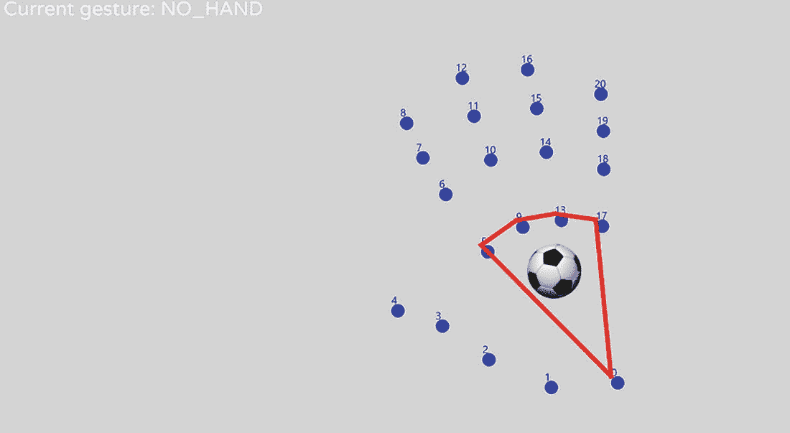
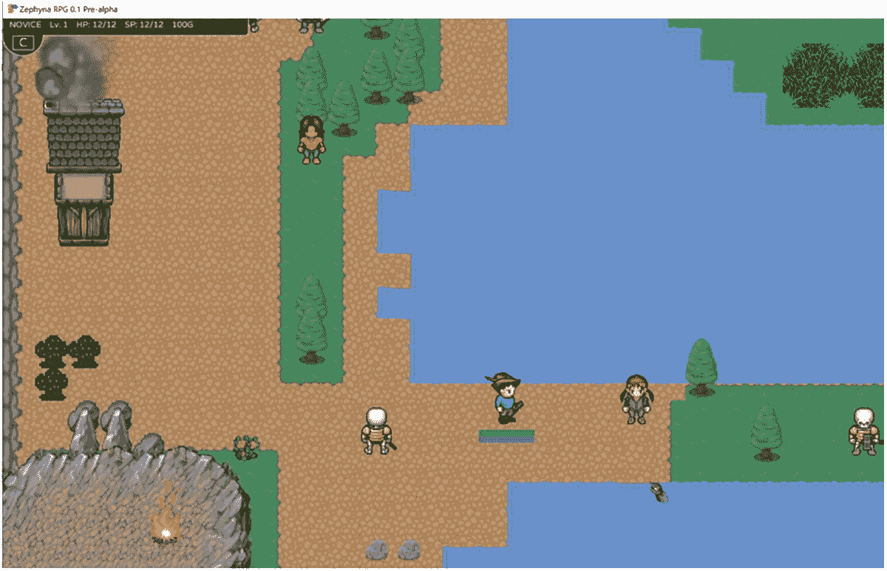
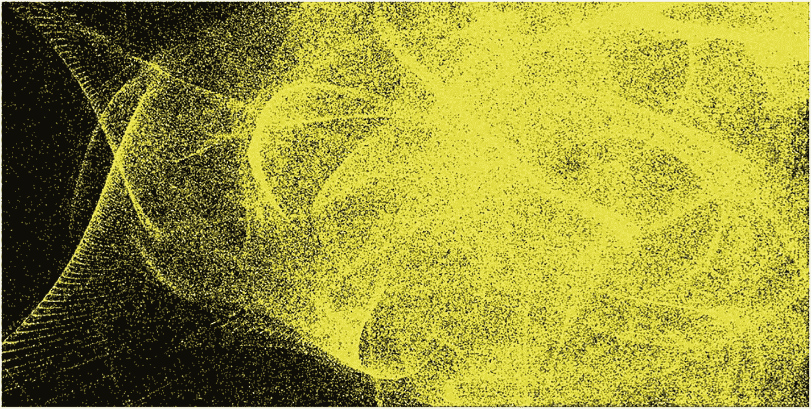

# 8. 结论

在最后一章中，我们通过简要总结各章节内容，并让读者有机会探索 FXGL 的更多可能性来作结。具体来说，我们回答了常见问题，然后讨论了可以基于本书内容构建的未来项目的细节。最后，将提供一个详尽的资源列表，供读者深入了解 FXGL。

在前面的章节中，我们探讨了 FXGL 游戏引擎的能力，以及它如何与 JavaFX 生态系统无缝集成。现在是时候回顾每章的关键要点：

*   第 2 章：我们回顾了关于类、对象和方法的 Java 基础知识。这使我们能够构建现实世界对象和抽象概念的 Java 表示。然后，我们使用带有 Maven 构建工具的 IntelliJ IDE，通过 FXGL 将 JavaFX 作为外部库加载。这种方法具有通用性，可用于加载任何外部库。我们还实现了一个 FXGL 演示。

*   第 3 章：我们学习了实体以及它们如何表示游戏对象。我们还学习了组件以及它们如何为实体提供数据和行为，将通用模板转变为独特的游戏对象。实体存在于游戏世界中，可以通过一系列属性（如实体类型、位置及其拥有的组件集）从世界中查询。在本章中，我们还构建了第一个游戏示例——一个乒乓球游戏。通过其开发过程，我们看到了实体-组件模型在游戏中的可扩展性。

*   第 4 章：我们涵盖了物理基础知识，并学习了检测碰撞的各种方法。碰撞检测是任何游戏的关键方面，因为它实现了游戏对象之间的交互。我们看到了 FXGL 如何允许开发者添加碰撞处理代码并修改物理驱动实体的属性。利用这些物理概念，我们开发了一个平台游戏，玩家必须通过与实体交互来到达关卡终点。

*   第 5 章：我们学习了一些图论知识、A* 寻路算法，以及如何通过搜索图来找到游戏关卡中两点之间的路径。在 FXGL 中，此功能由 `AStarMoveComponent` 提供，它使用关卡数据在游戏世界中导航。本章还重点介绍了 AI，以及开发者如何通过自定义组件或有限状态机实现为实体添加智能行为。最后，我们开发了一个迷宫动作游戏，其中每个敌人都有不同的 AI 行为集。

*   第 6 章：我们涵盖了图形学的基础知识，以及它如何转化为 FXGL（JavaFX）渲染管线。我们配置了一个粒子发射器来生成自定义视觉效果。我们看到了如何在 FXGL 环境中使用 JavaFX UI 对象。这是 FXGL 的一个显著优势，因为无需学习任何新的 API 即可生成复杂的用户界面。为了让这些界面生动起来，我们探索了动画系统和内置插值器，它们可以改变动画的整体外观。

*   第 7 章：我们看到了游戏和业务应用在实现方面有很多共同点。我们使用 FXGL 开发了简单的非游戏应用，包括一个带有业务逻辑的登录界面、一个图形数据可视化器，以及一个动画 3D 太阳系模型。最后，我们探讨了如何使用 Maven 插件来打包 FXGL 应用。

完成这些章节后，您已具备继续使用 FXGL 17 进行游戏或应用开发之旅的良好条件。以下部分提供了额外的资源，以帮助您更有效地实现目标。

## 常见问题解答

本节涵盖了与 FXGL 相关的各种问题，包括其 API、软件架构和开发，这些都是社区中常见的问题。

***如何更改全局设置？*** FXGL 提供了许多内置设置，可以通过 `initSettings()` 方法中的 `GameSettings` 对象轻松配置。以下是一些重要的示例：

*   setApplicationMode(ApplicationMode.DEBUG) – 启用所有调试日志记录调用。

*   setScaleOnResize(boolean) – 如果为 true，则在调整大小时，游戏内容会根据用户设备分辨率自动放大或缩小。

*   setFullscreenAllowedFromStart(boolean) – 如果为 true，则允许游戏在启动时立即进入全屏模式。

***如何更改音频音量？*** 可以通过访问运行时设置来更改音频音量，包括音效和音乐。请注意，这些设置与 `initSettings()` 方法中的设置对象不完全相同，尽管许多设置是重叠的。要获取运行时设置并更改音量，您可以调用：

```
getSettings().setGlobalSoundVolume(0.5);
getSettings().setGlobalMusicVolume(0.5);
```

以下问题侧重于 FXGL 的总体开发以及整个框架，而不是实现特定功能的代码。

***开发 FXGL 的原因是什么？*** 它最初是一组自定义 Java 类，构建在用于游戏开发基础讲座的现有 JavaFX 功能之上。随着代码库的增长和变得灵活，我继续使用它来帮助我在 YouTube 上运行 JavaFX 教程，这样我就可以避免在教程中重复输入相同的代码。随着我对代码及其 API 的迭代，最终这些简单的类形成了包，后来又形成了模块。因此，我决定将其制作成一个库，并与所有有兴趣学习 JavaFX 和（或）游戏开发的人分享。

***我正在做一个学校（学术）项目，可以使用 FXGL 吗？*** 如果您是学生，您应该向您的导师咨询，以确定您的项目中是否允许使用第三方库。如果您是导师，如果您需要帮助调整您的课程以使用 FXGL，请随时与我联系。世界上已有许多学术机构在其课程中使用了 FXGL。

***如果我在项目中使用 FXGL，是否需要担心许可或署名问题？*** 不需要。FXGL 代码库在 MIT 许可下提供，因此您可以随意使用它。像“Powered by FXGL”这样的字样会很好，但这取决于您。FXGL 适用于学术、爱好和商业项目。

***FXGL 会帮助我提高就业能力吗？*** 如果您认真对待游戏开发，并计划在该领域从事未来职业，为 AAA 级公司工作，我建议您使用 Unity (C#) 或 Unreal Engine (C++)，两者均可免费使用。它们是业界广泛认可的引擎。但是，如果您希望成为一名独立游戏开发者，为较小的公司工作，并且希望继续使用 Java，那么根据您的用例，FXGL、libGDX 和 JMonkey 都是不错的替代方案。

***在 FXGL 开发过程中学到了哪些关键点？*** FXGL 引擎自 2015 年以来一直（并且现在仍然）处于开发中。整个开发时间线可以分为两个阶段：早期阶段和后期阶段。在早期阶段，就软件架构和设计而言，一切都是暂定的。自上而下地设计引擎有助于确定重要的关注领域，例如游戏玩法、网络、文件系统访问和其他子系统。


在实现方面，前几个版本中，你只需对系统和代码进行探索。此阶段的目标是确定 API 和功能方面哪些有效、哪些无效。此时，为了快速测试功能，编写一次性代码进行原型设计是可以的。然而，开发者应意识到这些代码将被丢弃，因此不应做出任何重大决策，以避免代码僵化。

开发的早期阶段也适合确定所选软件（和硬件）栈的技术限制。例如，JavaFX 渲染管线的一个限制是它不支持外部着色器（可以改变绘制方式的 GPU 程序）。这一限制制约了开发者在设计游戏视觉效果时的创意发挥空间。

在开发的后期阶段，一旦你熟悉了 API 并了解用户如何使用系统，就可以开始专注于那些核心部分，并围绕它们构建其余功能。此时也开始为核心部分编写测试，以便明确它们应实现的功能。具体来说，你可以开始为引擎制定正式的规范，并通过测试证明它确实达到了规范要求。精确指定引擎试图实现的目标非常重要，这可以避免分心以及实现不必要的功能。最终，这能节省时间并提高核心项目的质量。

需要注意的是，在这个（后期）阶段，开发应保持稳定但缓慢。代码增长过快可能导致糟糕的设计决策，最终降低代码的可扩展性。应频繁咨询引擎用户，确保正在实现的功能确实被使用。让引擎用户参与开发过程是识别对他们重要的核心子系统的好方法。

开发过程中会学到各种底层和高层的技巧与窍门。然而，其中一个突出的方法是使用事件总线，它有助于解耦各种引擎系统。假设我们有两个所谓的系统：成就系统和音频系统。为了确保代码维护相对容易，我们希望一个系统不依赖于另一个系统（即，成就系统不调用音频系统的任何方法，反之亦然）。如果没有依赖关系，那么我们可以轻松地修改一个系统，而不会影响另一个系统的代码库。现在，假设我们的问题是每次解锁成就（成就系统中的一个功能）时播放音效（音频系统中的一个功能）。

为了解决上述问题，同时确保两个系统之间没有依赖关系，我们可以使用事件总线。在代码库的某处，有一个总揽全局的系统，我们称之为引擎，它维护着其他系统。在引擎系统中，我们可以有以下伪代码：

```
onAchievement(eventData) {
audioSystem.playSound( ... );
}
// 为简洁起见，我们将一个函数作为对象传递
eventBus.addEventHandler(EventType.ACHIEVEMENT, onAchievement)
```

当有新的成就解锁时，成就系统会触发一个类型为 `EventType.ACHIEVEMENT` 的事件。该事件被事件总线捕获并传递给引擎系统，引擎系统进而使用音频系统播放声音。使用所描述的方法，成就系统和音频系统的更改不会相互影响，但可能会影响（即导致公共 API 更改）引擎系统。以这种方式使用事件总线是在开发过程中学到的重要架构模式之一，它帮助构建了 FXGL 的健壮基础设施。

## 未来项目与额外资源

我们已经看到了许多可以用 FXGL 开发的不同项目。在本节中，我们将探讨哪些进一步的想法可以转化为可演示的原型。这些想法包括：

*   手部追踪可视化：[`https://github.com/AlmasB/HandTrackingFXGL`](https://github.com/AlmasB/HandTrackingFXGL)，

*   开放世界角色扮演游戏 (RPG)：[`https://github.com/AlmasB/zephyria`](https://github.com/AlmasB/zephyria)，以及

*   高性能渲染：[`https://github.com/AlmasB/FXGL-FastRender`](https://github.com/AlmasB/FXGL-FastRender)。

我们现在将按照上述顺序简要考虑每个项目。

要开发手部追踪可视化工具，我们首先需要获取数据。MediaPipe 库提供了对由机器学习应用程序处理的手部追踪数据的访问。有多种方法可以使用该库，对于这种情况，最简单的方法是使用 JavaScript 版本，它只需要几行代码。关键过程是从 JavaScript 捕获数据并将其发送到我们的 FXGL 应用程序，这可以使用 WebSocket 完成。幸运的是，有可用的 WebSocket 库，这意味着我们只需要正确设置它们，就可以将手部追踪数据从 MediaPipe 库流式传输到我们的工具中。此类可视化工具可能产生的示例如图 8-1 所示。欢迎您探索该仓库，并将此演示转化为可用的软件。



程序输出描绘了许多从 0 到 20 编号的彩色点。点 0、5、9、13 和 17 由一条深色线连接，形成一个锥形结构，其中包含一个足球图像。左上角的文字显示：当前手势：无手。

图 8-1

FXGL 手部追踪数据可视化工具草图

Zephyria 是一款完全用 Kotlin 编程语言编写的开放世界 RPG 游戏。它使用 Java 以外的语言这一事实意义重大，因为它表明 Kotlin 用户也可以访问 FXGL 的所有功能。该游戏拥有覆盖多达 250000 个图块的大型开放世界地图，每个图块是一个 32 像素大小的正方形。地图从 Tiled 关卡文件加载，并使用我们在第 5 章中介绍的 A* 算法进行遍历。游戏截图如图 8-2 所示。



截图描绘了游戏 Zephyria RPG 中的一个场景。

图 8-2

Zephyria RPG 中的示例地图

在第 6 章中，我们讨论了即时模式和保留模式渲染，以及即时模式如何提高性能。如果我们将即时模式与 GPU 并行计算相结合，则有可能获得进一步的性能提升。实际上，其理念是逻辑和渲染的配置方式使得每个计算都可以并行运行。如果该前提成立，并且计算单元足够简单以转换为 GPU 指令，那么在 GPU 上运行此类算法很可能会显著提升性能。例如，图 8-3 显示了使用 FXGL 渲染的包含 1000 万个粒子的粒子群。鼓励读者浏览前面提到的仓库链接，了解不同的渲染方法如何提高或降低性能。



程序输出描绘了一个粒子群，其中有大量浅色粒子。

图 8-3

使用 FXGL 的粒子群示例

我们现在提供用于进一步研究和开发的有用资源：


*   FXGLGames：[`https://github.com/AlmasB/FXGLGames`](https://github.com/AlmasB/FXGLGames) `–` 这是一个预构建的 FXGL 模板和示例演示的集合，包含完整的游戏。欢迎为仍在开发中的游戏向该仓库贡献代码。

*   在线资源：[`www.youtube.com/c/AlmasB0/videos`](http://www.youtube.com/c/AlmasB0/videos)`、` [`https://github.com/AlmasB/FXGL/wiki`](https://github.com/AlmasB/FXGL/wiki) `–` 这些资源会持续更新，以确保它们代表最新的 FXGL 版本。

*   社区文章和游戏：[`https://github.com/AlmasB/FXGL#community`](https://github.com/AlmasB/FXGL%2523community) `–` FXGL 用户社区正在稳步增长，无论是初学者、学生、爱好者还是专业人士。社区已经撰写了多篇文章来展示 FXGL 的各种功能，包括一些复杂的示例。

最后，如果你感到不知所措，可以随时加入位于 [`https://github.com/AlmasB/FXGL/discussions`](https://github.com/AlmasB/FXGL/discussions) 的 FXGL 讨论区，在那里你可以提出针对你具体用例的问题。

## 结语

如果你已经读到这里，那么我想感谢你的坚持，并祝贺你完成了 FXGL 17 的学习之旅。我衷心希望这本书能帮助你了解 JavaFX 和 FXGL 在游戏和应用程序开发方面的能力。虽然本书只涵盖了冰山一角，但你现在应该已经拥有了一个坚实的基础，可以继续在上面构建，而前面提到的资源可以帮助你做到这一点。祝你未来一切顺利，并期待看到你的项目！


索引 A A*算法 ADD 混合函数 addComponent AI 行为 动画系统 A*寻路 人工智能 (AI) 资源 AStarCell 对象 AStarGrid AStarGrid.fromWorld AStarMoveComponent 自动化组件注入 轴对齐包围盒 (AABB) 算法 B 球体组件 基础 JavaFX 应用 行为 AI BLOCK 实体 宽相位技术 业务应用 内置 JavaFX 控件 initGame() 登录和主用户界面 loginRoot 对象（含登录界面） mainRoot 对象 按钮实体 C 汽车类 天体 CelestialBodyComponent 类 CellMoveComponent Chair.java 圆-圆相交 类，Java CollidableComponent 碰撞检测 AABB 算法 轴对齐包围盒 宽相位技术/算法 窄相位技术 分离轴定理 技术 轴对齐包围盒 圆-圆相交 基于网格 基于图像像素 多边形 分离轴定理 碰撞检测处理器 碰撞处理器 碰撞处理 onCollision() onCollisionBegin() onCollisionEnd() onHitBoxTrigger() 需求 社区文章与游戏 com.mygame 包 组件 行为信息 组件注入 自定义组件作为数据容器 实体行为 控件 createContent() 方法 跨平台应用 D DelayedChasePlayerComponent 餐椅 门实体 DraggableComponent drawLine() 方法 E EnemyBatComponent 实体 实体-组件模型 EntityState EventType.ACHIEVEMENT 出口标志实体 出口触发器 F 有限状态机 (FSM) FollowComponent 类 FXGL 应用 基础 FXGL 应用 BasicGameApp 内置设置 通用 FXGL 导入 开发环境 initInput() 方法 initSettings() 方法 onKey() 方法 玩家对象，添加 player.translate(5) 简单游戏需求 600×600 窗口 UI 添加 UI 更新 FXGL 代码库 FXGL 依赖 FXGL 开发 FXGL 游戏引擎 特性 游戏逻辑 游戏玩法 目标 图形特性 内部框架服务 导航系统 物理 项目源代码 游戏截图 3D 形状 FXGL 游戏 FXGL 手部追踪数据可视化工具 FXGL 渲染管线 FXGL 17 FXHub 软件 FXML 文件 FXML 标记 G GameApp 游戏开发 游戏层 游戏逻辑 游戏与非游戏应用 游戏对象 乒乓球游戏 游戏视觉效果 游戏世界 GathererComponent 类 收集状态 getComponents() getEntity() getPosition()/setPosition(Point2D p) getType()/setType(Object type) GluonFX Maven 插件 GPU 并行计算 Gradle 图 图形与视觉效果 GraphicsContext 对象 图论 A*算法描述，图 图搜索算法 GraphVisSample 类 图可视化 图绘制应用 实现方法 注意事项 forceBounds() initGame() makeNode() onUpdate() Twitter 网络 基于网格的空间索引算法 基于网格的技术 GuardCoinComponent H 手部追踪可视化 硬件支持 高性能渲染 I JavaFX Image 图像像素 initGame() initGameVars() initInput() 方法 initPhysics() 方法 initSettings() 方法 initSkybox() 方法 实例级变量 IntelliJ IntelliJ 2021 IntelliJ IDE IntelliJ IDE 2021.2.2 内部框架服务 插值函数 插值系统 IrremovableComponent isVisible()/setVisible(boolean b) J Java 类 方法 主体功能 getMaterial() 参数列表 名称 @Override 注解 返回类型 静态方法 椅子类型 Java 基础 JavaFX 基础 JavaFX 应用 createContent() 方法 与 FXGL 应用 FXGL 游戏引擎 高性能 GUI 工具包 IntelliJ 最小 JavaFX 应用 属性 项目源代码 start() 方法 JavaFX 17 JavaFX 与 FXGL JavaFXApp JavaFX 应用 JavaFX 功能 JavaFX 节点 JavaFX UI 对象 Java 游戏开发 JavaScript Java 17 JDK 17 K 按键提示实体 L LevelEndScene 类 库 M MainLoadingScene 类 makeExitDoor() Maven 迷宫动作游戏 应用类 资源与代码 自定义组件 AStarMoveComponent DelayedChasePlayerComponent GuardCoinComponent PaletteChangingComponent PlayerComponent RandomAStarMoveComponent 关卡与实体 修改版 Pac-Man 克隆 用户界面 (UI) 实现 MediaPipe 库 现代开发工具 move() 方法 MoveSpeedComponent 移动状态 N 窄相位技术 网络服务 newBlock() 方法 newCoin() 方法 新建 Maven 项目窗口 nextLevel() 非游戏应用 非零正值 非零旋转角度 不可行走 O 面向对象编程 办公椅 onAdded() onCollision() onCollisionBegin() onCollisionEnd() onHitBoxTrigger() 在线资源 onRemoved() onUpdate() 方法 onUpdate() 重写方法 OpenJFX Maven 插件 开放世界角色扮演游戏 (RPG) origin() 方法 操作系统平台 P 打包的 Windows 特定应用 打包 PacmanApp 类 粒子效果 寻路 AI PathfindingSample 类 pause() PhysicsComponent JavaFX PixelBuffer 像素 pixelsMoved 平台游戏演示（含 FXGL） 字段 乒乓球游戏 游戏视觉效果 LevelEndScene 类 逻辑与视觉效果 initGame() initGameVars() initInput() initPhysics() initSettings() makeExitDoor() nextLevel() onUpdate() setLevel() MainLoadingScene 类 顺序 PlatformerApp 类 PlatformerFactory 类 PlayerButtonHandler 类 PlayerComponent 类 player.png 使用的资源 PlatformerApp 类 平台游戏演示 PlatformerFactory 类 平台游戏 平台特定的零依赖镜像 PlayerBatComponent PlayerButtonHandler 类 PlayerComponent 类 玩家实体 多边形 乒乓球游戏 球体组件 敌方球拍组件 实体工厂 FXGL 变量 GameApplication 游戏玩法方法 initGameObjects() 输入处理 onAction() 回调 顺序 PhysicsComponent 玩家球拍组件 PongApp PongFactory showGameOver() 方法 专业跨平台 项目对象模型文件 Q 查询实体 R RandomAStarMoveComponent raycast() 即时战略游戏 渲染性能 渲染过程 resume() 保留模式 RGBA 对象 刚体动力学 S 场景图 ScrollingBackgroundView 类 分离轴定理 setApplicationMode setBodyType() setFixtureDef() setFullscreenAllowedFromStart setGravity() setLevel() setLinearVelocity() setOnPhysicsInitialized() setProperty setScaleOnResize SignalComponent 类 简单 JavaFX 应用 单人游戏 单一职责原则 天空盒 3D 太阳系 天体构建 天体数据与逻辑 游戏初始化 天空盒 SolarSystemApp 游戏应用与 2D Stage 对象 标准 JavaFX 控件 stateComponent 子场景 T 3D 游戏 toAnimatedTexture() 方法 translate(Point2D vector) 透明度值 Twitter 网络 Twitter 社交网络数据 2D 游戏 2D 网格 U UI 层 V ViewComponent 视口 W, X, Y 窗口渲染 木椅 世界查询 Z Zephyria 零依赖包 零旋转角度 Z 轴索引
