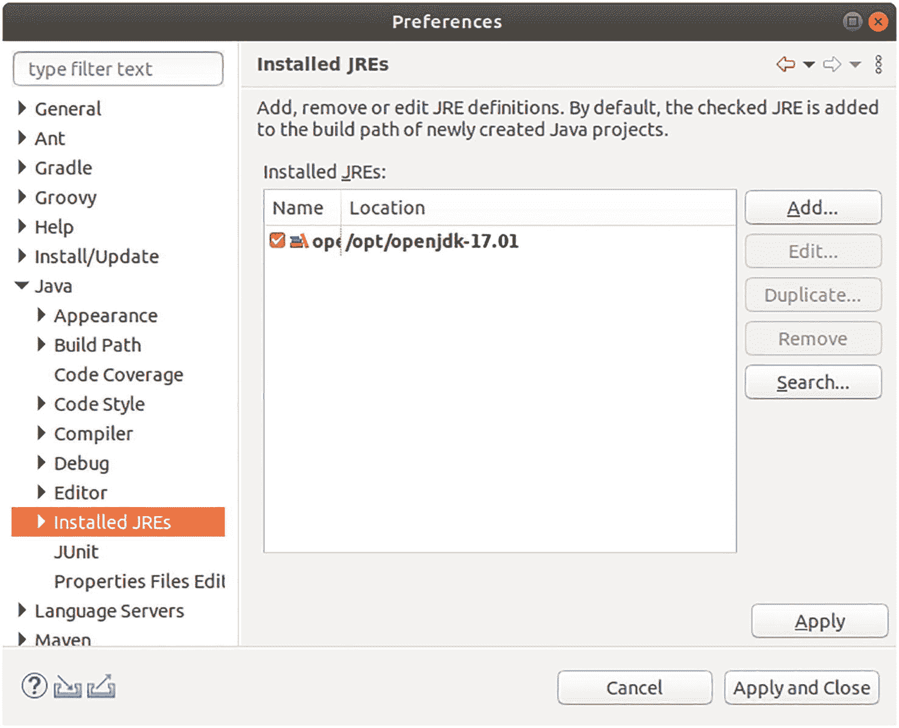
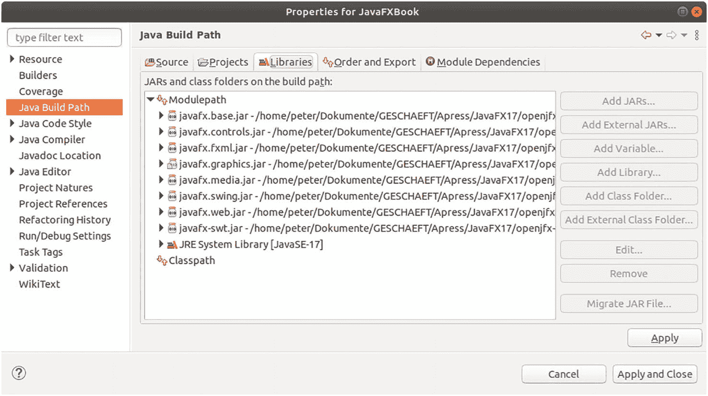
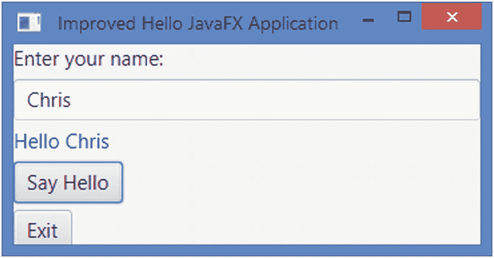

# 一、入门指南

在本章中，您将学习:

*   JavaFX 是什么

*   JavaFX 的历史

*   如何设置 Eclipse IDE 以使用 JavaFX 应用程序，以及如何编写您的第一个 JavaFX 应用程序

*   如何向 JavaFX 应用程序传递参数

*   如何启动 JavaFX 应用程序

*   JavaFX 应用程序的生命周期

*   如何终止 JavaFX 应用程序

## JavaFX 是什么？

JavaFX 是一个基于 Java 的开源框架，用于开发富客户端应用程序。它可以与市场上的其他框架(如 Adobe AIR 和 Microsoft Blazor)相媲美。在 Java 平台的图形用户界面(GUI)开发技术领域，JavaFX 也被视为 Swing 的继承者。JavaFX 库作为公共 Java 应用程序编程接口(API)提供。JavaFX 包含几个特性，这些特性使它成为开发富客户端应用程序的首选:

*   JavaFX 是用 Java 编写的，这使您能够利用所有 Java 特性，如多线程、泛型和 lambda 表达式。您可以使用自己选择的任何 Java IDE(如 NetBeans 或 Eclipse)来创作、编译、运行、调试和打包您的 JavaFX 应用程序。

*   JavaFX 通过其库支持数据绑定。

*   JavaFX 代码也可以使用任何 Java 虚拟机(JVM)支持的脚本语言编写，比如 Kotlin、Groovy 和 Scala。

*   JavaFX 提供了两种构建用户界面(UI)的方法:使用 Java 代码和使用 FXML。FXML 是一种基于 XML 的可脚本化标记语言，用于以声明方式定义 UI。Gluon 公司提供了一个名为 Scene Builder 的工具，这是一个 FXML 的可视化编辑器。

*   JavaFX 提供了丰富的多媒体支持，如播放音频和视频。它利用了平台上可用的编解码器。

*   JavaFX 允许您在应用程序中嵌入 web 内容。

*   JavaFX 为应用效果和动画提供了现成的支持，这对开发游戏应用程序非常重要。您可以通过编写几行代码来实现复杂的动画。

JavaFX API 背后有许多组件，可以利用 Java 本地库和可用的硬件和软件。JavaFX 组件如图 [1-1](#Fig1) 所示。


图 1-1

JavaFX 平台的组件

JavaFX 中的 GUI 被构造成一个场景图。场景图是视觉元素的集合，称为节点，以分层方式排列。使用公共 JavaFX API 构建场景图。场景图中的节点可以处理用户输入和用户手势。它们可以有效果、转换和状态。场景图中的节点类型包括简单的 UI 控件，如按钮、文本字段、二维(2D)和三维(3D)形状、图像、媒体(音频和视频)、web 内容和图表。

*Prism* 是一个硬件加速的图形管道，用于渲染场景图形。如果硬件加速渲染在平台上不可用，则使用 Java 2D 作为后备渲染机制。例如，在使用 Java 2D 进行渲染之前，它将尝试在 Windows 上使用 DirectX，在 Mac、Linux 和嵌入式平台上使用 OpenGL。

*Glass Windowing Toolkit* 使用本地操作系统提供图形和窗口服务，如 windows 和计时器。该工具包还负责管理事件队列。在 JavaFX 中，事件队列由一个名为 *JavaFX 应用线程*的操作系统级线程管理。所有用户输入事件都在 JavaFX 应用程序线程上调度。JavaFX 要求只能在 JavaFX 应用程序线程上修改实时场景图形。

Prism 使用一个单独的线程，而不是 JavaFX 应用程序线程来进行渲染。它通过在处理下一帧的同时渲染一帧来加速处理过程。当场景图形被修改时，例如，通过在文本字段中输入一些文本，Prism 需要重新渲染场景图形。使用称为*脉冲*事件的事件来实现场景图形与 Prism 的同步。当场景图形被修改并且需要重新渲染时，一个脉冲事件在 JavaFX 应用程序线程上排队。脉冲事件表示场景图形与 Prism 中的渲染层不同步，应该渲染 Prism 级别的最新帧。脉冲事件被限制在每秒最大 60 帧。

媒体引擎负责在 JavaFX 中提供媒体支持，例如，回放音频和视频。它利用了平台上可用的编解码器。媒体引擎使用单独的线程处理媒体帧，并使用 JavaFX 应用程序线程将帧与场景图形同步。媒体引擎基于 *GStreamer* ，这是一个开源的多媒体框架。

web 引擎负责处理嵌入在场景图中的 web 内容(HTML)。Prism 负责呈现 web 内容。web 引擎基于 *WebKit* ，这是一个开源的 web 浏览器引擎。支持 HTML5、级联样式表(CSS)、JavaScript 和文档对象模型(DOM)。

Quantum toolkit 是对 Prism、Glass、media engine 和 web engine 等底层组件的抽象。它还有助于低层组件之间的协调。

Note

在本书中，假设您已经掌握了 Java 编程语言的中级知识，包括 lambda 表达式和新的 Time API(从 Java 8 开始)。

## JavaFX 的历史

JavaFX 最初是由 Chris Oliver 在 SeeBeyond 开发的，它被称为 F3 (Form Follows Function)。F3 是一种易于开发 GUI 应用程序的 Java 脚本语言。它提供了声明性语法、静态类型、类型推断、数据绑定、动画、2D 图形和 Swing 组件。SeeBeyond 被 Sun Microsystems 收购，F3 于 2007 年更名为 JavaFX。甲骨文在 2010 年收购了太阳微系统公司。甲骨文随后在 2013 年开源了 JavaFX。

JavaFX 的第一个版本发布于 2008 年第四季度。版本号从 2.2 跃升到 8.0。从 Java 8 开始，Java SE 和 JavaFX 的版本号将是相同的。Java SE 和 JavaFX 的主要版本也将同时发布。JavaFX 的当前版本是 17.0 版。从 Java SE 11 开始，JavaFX 不再是 Java SE 运行时库的一部分。在 Java 11 中，您需要下载并包含 JavaFX 库来编译和运行您的 JavaFX 程序。表 [1-1](#Tab1) 包含 JavaFX 的发布列表。

表 1-1

JavaFX 版本

<colgroup><col class="tcol1 align-left"> <col class="tcol2 align-left"> <col class="tcol3 align-left"></colgroup> 
| 

出厂日期

 | 

版本

 | 

评论

 |
| --- | --- | --- |
| 2008 年第四季度 | JavaFX 1.0 | 这是 JavaFX 的最初版本。它使用一种称为 JavaFX Script 的声明语言来编写 JavaFX 代码。 |
| Q1，2009 年 | JavaFX 1.1 | 引入了对 JavaFX Mobile 的支持。 |
| Q2，2009 年 | JavaFX 1.2 | – |
| Q2，2010 年 | JavaFX 1.3 | – |
| 2010 年第三季度 | JavaFX 1.3.1 | – |
| 2011 年第四季度 | java fx 2.0 | 不再支持 JavaFX 脚本。它使用 Java 语言编写 JavaFX 代码。对 JavaFX Mobile 的支持已取消。 |
| 2012 年，Q2 | JavaFX 2.1 | 引入了对 Mac OS 桌面版的支持。 |
| 2012 年第三季度 | JavaFX 2.2 | – |
| 2014 年，Q1 | JavaFX 8.0 | JavaFX 版本从 2.2 跳到了 8.0。JavaFX 和 Java SE 版本将从 Java 8 开始匹配。 |
| 2015 年，Q2 | JavaFX 9.0 | 公开的一些内部 API，JEP253。 |
| 2018 年第三季度 | JavaFX 11.0.3 | JavaFX 不再是 Oracle Java JDK 的一部分。JavaFX 现在是一个可下载的开源模块，由 Gluon 公司提供。作为*端口*增加了对手持设备和其他嵌入式设备的支持。 |
| 2019 年，Q1 | JavaFX 12.0.1 | 错误修复和一些增强。 |
| 2019 年第三季度 | JavaFX 13.0 | 错误修复和一些增强。 |
| Q1，2020 年 | JavaFX 14.0 | 在 WebView 中支持 HTTP/2。更多的错误修复和一些增强。 |
| 2020 年第三季度 | JavaFX 15.0 | 提高稳定性(内存管理)。更多的错误修复和一些增强。 |
| Q1，2021 年 | JavaFX 16.0 | JavaFX 模块必须从模块路径加载，而不是从类路径加载(编译器警告)。更多的错误修复和一些增强。 |
| 2021 年第四季度 | JavaFX 17.0.1 | 小的改进和错误修复。 |

发行说明显示了更多详细信息。你可以在 [`https://github.com/openjdk/jfx/tree/master/doc-files`](https://github.com/openjdk/jfx/tree/master/doc-files) 看到它们。

## 系统需求

您需要在计算机上安装以下软件:

*   Java 开发工具包 17，来自 Oracle，或者 OpenJDK。

*   Eclipse IDE 2021-06 或更高版本。

*   适用于您平台的 JavaFX 17 SDK，下载并解压缩到您选择的文件夹中。前往 [`https://openjfx.io/`](https://openjfx.io/) 获取文档和下载链接。

Caution

如果您使用 Oracle 的 JDK，您需要输入一个付费程序，以防您将 JDK 用于商业项目。如果不希望这样，可以考虑使用 OpenJDK。

没有必要使用 Eclipse IDE 来编译和运行本书中的程序。您可以使用任何其他 IDE，例如 NetBeans、JDeveloper 或 IntelliJ IDEA。如果您愿意的话，您可以不使用任何 IDE，只使用命令行，也许还可以使用 Ant、Maven 或 Grails 之类的构建工具。

JavaFX 发行版还提供了一组预打包的 jmod 文件。然而，在编写这个版本时，由于类路径问题，还不能使用它们。如果你愿意，你可以试试 JMODs。我们将在本书中使用 SDK，它由一堆打包成 jar 文件的 Java 模块以及特定于平台的本地库组成。

## JavaFX 运行时库

在 PC 上下载并解压 JavaFX SDK 发行版后，您会发现 Java 模块 jar(Java FX . base、javafx.graphics 等。)以及特定于平台的本机库(。所以文件，。dll 文件等。)在 lib 文件夹中。为了编译和运行 JavaFX 应用程序，您必须引用这个 lib 文件夹中的 jar，并且所有特定于平台的本地库必须位于同一个文件夹中。

如果您使用 IDE 和/或 JavaFX 工具，可能会包含 JavaFX 模块和库，并为您进行配置。如果您是这种情况，请注意正确的 JavaFX 版本。最可靠的开发设置，尽管可能不是最方便的，是使用 Eclipse 编辑和编译 Java 文件，自己提供 JavaFX 库，并且*而不是*使用 IDE 的任何特殊 JavaFX 特性。

## JavaFX 源代码

有经验的开发人员有时更喜欢查看 JavaFX 库的源代码，以了解幕后是如何实现的。

JavaFX SDK 包括源代码—注意 lib 文件夹中的 src.zip 文件。这也是您可以从 Eclipse 内部使用的文件，用于将 JavaFX 源代码附加到 JavaFX API 库——然后您可以使用 F3 键来轻松导航到 JavaFX API 类源代码。

## 您的第一个 JavaFX 应用程序

让我们编写您的第一个 JavaFX 应用程序。它应该在一个窗口中显示文本“Hello JavaFX”。我将采用一种循序渐进的方法来解释如何开发第一个应用程序。我将添加尽可能少的代码行，然后解释代码做什么以及为什么需要它。

### 开始一个 Eclipse 项目

让我们首先看看如何建立一个 Eclipse 项目来开发 JavaFX 应用程序。

Note

如果您使用不同的 IDE，为了了解如何设置 JavaFX 项目，您必须查阅 IDE 的文档。

打开 Eclipse，使用您喜欢的任何工作空间。接下来，安装来自 JDK 17 的 JRE，如果你还没有这样做的话。为此，请转到首选项并注册 JRE，如图 [1-2](#Fig2) 所示。



图 1-2

在 Eclipse 中注册 JRE

启动一个名为 HelloFX 的新 Java 项目。确保新建项目向导创建了一个 module-info.java 文件。有一个复选框。在项目首选项中，添加 JavaFX 安装的 lib 文件夹中的所有模块 JARs 参见图 [1-3](#Fig3) 。



图 1-3

在 Eclipse 中添加 JavaFX 模块

确保将 jar 添加到 Modulepath 部分，而不是 Classpath 部分。

作为最后一个准备步骤，在 src 文件夹中创建一个包 com . jdojo . intro——在这里，我们添加应用程序类。

### 设置模块信息

为了让 JavaFX 在模块化环境中正确工作，请记住我们在 src 文件夹中添加了一个 module-info.java 文件，这相当于说“我们使用模块化环境”，我们需要在该文件中添加几个条目。打开它，将其内容更改为

```java
module JavaFXBook {
      requires javafx.graphics;
      requires javafx.controls;
      requires java.desktop;
      requires javafx.swing;
      requires javafx.media;
      requires javafx.web;
      requires javafx.fxml;
      requires jdk.jsobject;

      opens com.jdojo.intro to javafx.graphics, javafx.base;
}

```

在第一行中，使用您在创建项目时输入的任何内容作为模块名称。

### 创建 *HelloJavaFX* 类

一个`JavaFX application`是一个必须从`javafx.application`包中的`Application class`继承的类。您将把您的类命名为`HelloFXApp`，它将被存储在`com.jdojo.intro`包中。清单 [1-1](#PC2) 显示了`HelloFXApp`类的初始代码。请注意，`HelloFXApp`类此时不会编译。您将在下一节中修复它。

```java
// HelloFXApp.java
package com.jdojo.intro;

import javafx.application.Application;

public class HelloFXApp extends Application {
      public static void main(String[] args) {
            Application.launch(args);
      }
      // Application logic goes here
}

Listing 1-1Inheriting Your JavaFX Application Class from the javafx.application.Application Class

```

该程序包括一个包声明、一个导入语句和一个类声明。代码中没有类似 JavaFX 的内容。它看起来像任何其他 Java 应用程序。然而，通过从`Application`类继承`HelloFXApp`类，您已经满足了 JavaFX 应用程序的需求之一。

### 覆盖 *start()* 方法

如果您尝试编译`HelloFXApp`类，将会导致以下编译时错误: *HelloFXApp 不是抽象的，不会覆盖应用程序中的抽象方法 start(Stage)。*该错误表明`Application`类包含一个抽象的`start(Stage stage)`方法，该方法没有在`HelloFXApp`类中被覆盖。作为 Java 开发人员，您知道下一步该做什么:要么将`HelloFXApp`类声明为抽象类，要么为`start()`方法提供一个实现。这里，让我们为`start()`方法提供一个实现。`Application`类中的`start()`方法声明如下:

```java
public abstract void start(Stage stage) throws java.lang.Exception

```

清单 [1-2](#PC4) 显示了覆盖`start()`方法的`HelloFXApp`类的修改代码。

```java
// HelloFXApp.java
package com.jdojo.intro;

import javafx.application.Application;
import javafx.stage.Stage;

public class HelloFXApp extends Application {
      public static void main(String[] args) {
            Application.launch(args);
      }
      @Override
      public void start(Stage stage) {
               // The logic for starting the application goes here
      }
}

Listing 1-2Overriding the start() Method in Your JavaFX Application Class

```

在修订后的代码中，您加入了两件事:

*   您已经添加了一个另外的`import`语句来从`javafx.stage`包中导入`Stage`类。

*   您已经实现了`start()`方法。该方法的`throws`子句被删除，这符合 Java 中覆盖方法的规则。

`start()`方法是 JavaFX 应用程序的入口点。它由 JavaFX 应用程序启动器调用。注意，`start()`方法被传递了一个`Stage`类的实例，这个实例被称为应用程序的*初级阶段*。您可以根据需要在应用程序中创建更多阶段。但是，主阶段总是由 JavaFX 运行时为您创建的。

Tip

每个 JavaFX 应用程序类都必须从`Application`类继承，并为`start(Stage stage)`方法提供实现。

### 展示舞台

类似于现实世界中的舞台，JavaFX 舞台用于显示场景。场景具有视觉效果，如文本、形状、图像、控件、动画和效果，用户可以与这些视觉效果进行交互，所有基于 GUI 的应用程序都是如此。

在 JavaFX 中，主舞台是场景的容器。根据应用程序的运行环境，stage 的外观会有所不同。您不需要根据环境采取任何行动，因为 JavaFX 运行时会为您处理所有细节。由于该应用程序作为桌面应用程序运行，主舞台将是一个带有标题栏和显示场景区域的窗口。

由应用程序启动器创建的初级阶段没有场景。在下一节中，您将为您的舞台创建一个场景。

您必须展示舞台才能看到场景中包含的视觉效果。使用`show()`方法显示阶段。或者，您可以使用`setTitle()`方法为舞台设置一个标题。清单 [1-3](#PC5) 中显示了`HelloFXApp`类的修订代码。

```java
// HelloFXApp.java
package com.jdojo.intro;

import javafx.application.Application;
import javafx.stage.Stage;

public class HelloFXApp extends Application {
      public static void main(String[] args) {
            Application.launch(args);
      }
      @Override
      public void start(Stage stage) {
               // Set a title for the stage
               stage.setTitle("Hello JavaFX Application");

               // Show the stage
               stage.show();
       }
}

Listing 1-3Showing the Primary Stage in Your JavaFX Application Class

```

### 启动应用程序

现在您已经准备好运行您的第一个 JavaFX 应用程序了。您的 IDE 可能已经动态编译了您的类。Eclipse 就是这样工作的。

使用 Eclipse IDE 中的启动器运行`HelloFXApp`类。在类名上单击鼠标右键，然后调用作为➤ Java 应用程序运行。在命令行上，为了编译和运行，您必须添加所有的 modulepath 条目，这超出了本章的介绍范围。

如果成功启动，应用程序将显示一个带有标题栏的窗口，如图 [1-4](#Fig4) 所示。


图 1-4

没有场景的 JavaFX 应用程序

窗口的主要区域是空的。这是舞台将显示其场景的内容区域。因为您还没有舞台场景，所以您会看到一个空白区域。标题栏显示您在`start()`方法中设置的标题。

您可以使用窗口标题栏中的关闭菜单选项关闭应用程序。在 Windows 中使用 Alt + F4 关闭窗口。您可以使用平台提供的任何其他选项来关闭窗口。

Tip

直到所有窗口都关闭或者应用程序使用`Platform.exit()`方法退出，类`Application`的`launch()`方法才返回。`Platform`级在`javafx.application`包里。

您还没有在 JavaFX 中看到任何令人兴奋的东西！你需要等待，直到你在下一部分创建一个场景。

### 向舞台添加场景

在`javafx.scene`包中的`Scene`类的一个实例代表一个场景。舞台包含一个场景，场景包含视觉内容。

场景的内容以树状层次排列。在层次结构的顶端是根节点*和 T4 节点。根节点可能包含子节点，子节点又可能包含它们的子节点，依此类推。必须有根节点才能创建场景。您将使用一个`VBox`作为根节点。`VBox`代表垂直框，将其子项垂直排列成一列。下面的语句创建了一个`VBox`:*

```java
 VBox root = new VBox();

```

Tip

从`javafx.scene.Parent`类继承的任何节点都可以用作场景的根节点。几个节点，称为布局窗格或容器，如`VBox`、`HBox`、`Pane`、`FlowPane`、`GridPane`或`TilePane`，可以用作根节点。`Group`是一个特殊的容器，将它的子容器组合在一起。

可以有子节点的节点提供了一个返回其子节点的`ObservableList`的`getChildren()`方法。要向节点添加子节点，只需将子节点添加到`ObservableList`中。下面的代码片段将一个`Text`节点添加到一个`VBox`中:

```java
 // Create a VBox node
VBox root = new VBox();

// Create a Text node
Text msg = new Text("Hello JavaFX");

// Add the Text node to the VBox as a child node
root.getChildren().add(msg);

```

`Scene`类包含几个构造器。您将使用允许您指定场景的根节点和大小的那个。以下语句创建一个以`VBox`为根节点的场景，宽度为 300 像素，高度为 50 像素:

```java
 // Create a scene
Scene scene = new Scene(root, 300, 50);

```

您需要通过调用`Stage`类的`setScene()`方法将场景设置为舞台:

```java
 // Set the scene to the stage
stage.setScene(scene);

```

就这样。您已经用一个场景完成了您的第一个 JavaFX 程序。清单 [1-4](#PC10) 包含完整的程序。程序显示如图 [1-5](#Fig5) 所示的窗口。


图 1-5

JavaFX 应用程序的场景有一个`Text`节点

```java
// HelloFXAppWithAScene.java
package com.jdojo.intro;

import javafx.application.Application;
import javafx.scene.Scene;
import javafx.scene.layout.VBox;
import javafx.scene.text.Text;
import javafx.stage.Stage;

public class HelloFXAppWithAScene extends Application {
       public static void main(String[] args) {
               Application.launch(args);
       }

       @Override
       public void start(Stage stage) {
               Text msg = new Text("Hello JavaFX");
               VBox root = new VBox();
               root.getChildren().add(msg);

               Scene scene = new Scene(root, 300, 50);
               stage.setScene(scene);
               stage.setTitle(
                   "Hello JavaFX Application with a Scene");
               stage.show();
       }
}

Listing 1-4A JavaFX Application with a Scene Having a Text Node

```

## 改进 HelloFX 应用程序

JavaFX 能够做的事情比您到目前为止看到的要多得多。让我们增强第一个程序，并添加更多的用户界面元素，如按钮和文本字段。这一次，用户将能够与应用程序进行交互。使用`Button`类的实例创建一个按钮，如下所示:

```java
 // Create a button with "Exit" text
Button exitBtn = new Button("Exit");

```

当一个按钮被点击时，一个`ActionEvent`被触发。您可以添加一个`ActionEvent`处理程序来处理该事件。使用`setOnAction()`方法为按钮设置一个`ActionEvent`处理程序。下面的语句为按钮设置了一个`ActionEvent`处理程序。处理程序终止应用程序。您可以使用 lambda 表达式或匿名类来设置`ActionEvent`处理程序。以下代码片段展示了这两种方法:

```java
// Using a lambda expression
exitBtn.setOnAction(e -> Platform.exit());

// Using an anonymous class
import javafx.event.ActionEvent;
import javafx.event.EventHandler;
...
exitBtn.setOnAction(new EventHandler<ActionEvent>() {
       @Override
       public void handle(ActionEvent e) {
               Platform.exit();
       }
});

```

清单 [1-5](#PC13) 中的程序展示了如何给场景添加更多的节点。该程序使用`Label`类的`setStyle()`方法将`Label`的填充颜色设置为蓝色。稍后我将讨论在 JavaFX 中使用 CSS。

```java
// ImprovedHelloFXApp.java
package com.jdojo.intro;

import javafx.application.Application;
import javafx.application.Platform;
import javafx.scene.Scene;
import javafx.scene.control.Button;
import javafx.scene.control.Label;
import javafx.scene.control.TextField;
import javafx.scene.layout.VBox;
import javafx.stage.Stage;

public class ImprovedHelloFXApp extends Application {
       public static void main(String[] args) {
               Application.launch(args);
       }

       @Override
       public void start(Stage stage) {
               Label nameLbl = new Label("Enter your name:");
               TextField nameFld = new TextField();

               Label msg = new Label();
               msg.setStyle("-fx-text-fill: blue;");

               // Create buttons
               Button sayHelloBtn = new Button("Say Hello");
               Button exitBtn = new Button("Exit");

               // Add the event handler for the Say Hello button
               sayHelloBtn.setOnAction(e -> {
                      String name = nameFld.getText();
                      if (name.trim().length() > 0) {
                             msg.setText("Hello " + name);
                      } else {
                             msg.setText("Hello there");
                      }

               });

               // Add the event handler for the Exit button
               exitBtn.setOnAction(e -> Platform.exit());

               // Create the root node
               VBox root = new VBox();

               // Set the vertical spacing between children to 5px
               root.setSpacing(5);

               // Add children to the root node
               root.getChildren().addAll(nameLbl, nameFld, msg,
                   sayHelloBtn, exitBtn);

               Scene scene = new Scene(root, 350, 150);
               stage.setScene(scene);
               stage.setTitle("Improved Hello JavaFX Application");
               stage.show();
       }
}

Listing 1-5Interacting with Users in a JavaFX Application

```

改进后的`HelloFX`程序显示如图 [1-6](#Fig6) 所示的窗口。该窗口包含两个标签、一个文本字段和两个按钮。一个`VBox`被用作场景的根节点。在文本栏中输入名称，然后点按“问好”按钮以查看问候信息。在不输入姓名的情况下点击“问好”按钮会显示消息`Hello there`。应用程序在`Label`控件中显示一条消息。单击退出按钮退出应用程序。



图 1-6

一个 JavaFX 应用程序，它的场景中有一些控件

## 向 JavaFX 应用程序传递参数

与 Java 应用程序一样，您可以在命令行上或者通过 IDE 中的一些启动配置将参数传递给 JavaFX 应用程序。

`Parameters`类是`Application`类的静态内部类，它封装了传递给 JavaFX 应用程序的参数。它将参数分为三类:

*   命名参数

*   未命名参数

*   原始参数(命名和未命名参数的组合)

您需要使用`Parameters`类的以下三个方法来访问三种类型的参数:

*   `Map<String, String> getNamed()`

*   `List<String> getUnnamed()`

*   `List<String> getRaw()`

参数可以是命名的，也可以是未命名的。命名参数由(名称，值)对组成。未命名的参数由单个值组成。`getNamed()`方法返回一个包含名称参数的键值对的`Map<String, String>`。`getUnnamed()`方法返回一个`List<String>`，其中每个元素都是一个未命名的参数值。

您只能将命名和未命名的参数传递给 JavaFX 应用程序。不传递原始类型参数。JavaFX 运行时通过`Parameters`类的`getRaw()`方法将所有已命名和未命名的参数作为`List<String>`传递给应用程序。下面的讨论将使这三种方法的返回值之间的区别变得清晰。

`Application`类的`getParameters()`方法返回`Application.Parameters`类的引用。对`Parameters`类的引用可以在`Application`类的`init()`方法和随后执行的代码中找到。参数在应用程序的构造器中不可用，因为它在`init()`方法之前被调用。调用构造器中的`getParameters()`方法返回`null`。

清单 [1-6](#PC14) 中的程序读取传递给应用程序的所有类型的参数，并将它们显示在一个`TextArea`中。一个`TextArea`是显示多行文本的 UI 节点。

```java
// FXParamApp.java
package com.jdojo.intro;

import java.util.List;
import java.util.Map;
import javafx.application.Application;
import javafx.scene.Group;
import javafx.scene.Scene;
import javafx.scene.control.TextArea;
import javafx.stage.Stage;

public class FXParamApp extends Application {
       public static void main(String[] args) {
               Application.launch(args);
       }

       @Override
       public void start(Stage stage) {
               // Get application parameters
               Parameters p = this.getParameters();
               Map<String, String> namedParams = p.getNamed();
               List<String> unnamedParams = p.getUnnamed();
               List<String> rawParams = p.getRaw();

               String paramStr = "Named Parameters: " + namedParams +
                      "\n" +
                      "Unnamed Parameters: " + unnamedParams + "\n" +
                      "Raw Parameters: " + rawParams;

               TextArea ta = new TextArea(paramStr);
               Group root = new Group(ta);
               stage.setScene(new Scene(root));
               stage.setTitle("Application Parameters");
               stage.show();
       }
}

Listing 1-6Accessing Parameters Passed to a JavaFX Application

```

让我们看几个将参数传递给`FXParamApp`类的例子。当您运行`FXParamApp`类时，以下情况中提到的输出显示在窗口的`TextArea`控件中。

### 案例 1

使用以下命令将该类作为独立应用程序运行:

```java
 java [options] com.jdojo.stage.FXParamApp Anna Lola

```

前面的命令没有传递命名参数和两个未命名参数:`Anna`和`Lola`。原始参数列表将包含两个未命名的参数。输出将如下所示:

```java
Named Parameters: {}
Unnamed Parameters: [Anna, Lola]
Raw Parameters: [Anna, Lola]

```

### 案例 2

要从命令行传递一个命名的参数，您需要在参数前面加两个连字符(`--`)。也就是说，应该在表单中输入命名参数

```java
 --key=value

```

使用以下命令将该类作为独立应用程序运行:

```java
java [options] com.jdojo.stage.FXParamApp \
    Anna Lola --width=200 --height=100

```

前面的命令传递两个命名参数:`width=200`和`height=100`。它传递两个未命名的参数:`Anna`和`Lola`。原始参数列表将包含四个元素:两个命名参数和两个未命名参数。原始参数列表中的命名参数值前面有两个连字符。输出将如下所示:

```java
Named Parameters: {height=100, width=200}
Unnamed Parameters: [Anna, Lola]
Raw Parameters: [Anna, Lola, --width=200, --height=100]

```

## 启动 JavaFX 应用程序

前面，我谈到了在开发第一个 JavaFX 应用程序时启动 JavaFX 应用程序的主题。本节提供了关于启动 JavaFX 应用程序的更多细节。

每个 JavaFX 应用程序类都继承自`Application`类。`Application`级在`javafx.application`包里。它包含一个静态的`launch()`方法。它的唯一目的是启动 JavaFX 应用程序。它是一个重载方法，有以下两种变体:

*   `static void launch(Class<? extends Application> appClass, String... args)`

*   `static void launch(String... args)`

注意，您不需要创建 JavaFX 应用程序类的对象来启动它。当调用`launch()`方法时，JavaFX 运行时创建应用程序类的一个对象。

Tip

您的 JavaFX 应用程序类必须有一个`no-args`构造器；否则，当试图启动它时，将会引发运行时异常。

`launch()`方法的第一个变体很清楚。您将应用程序类的类引用作为第一个参数传递，并且`launch()`方法将创建该类的一个对象。第二个参数由传递给应用程序的命令行参数组成。下面的代码片段展示了如何使用`launch()`方法的第一个变体:

```java
 public class MyJavaFXApp extends Application {
       public static void main(String[] args) {
               Application.launch(MyJavaFXApp.class, args);
       }

       // More code goes here
}

```

传递给`launch()`方法的类引用不必与调用该方法的类相同。例如，下面的代码片段从`MyAppLauncher`类启动`MyJavaFXApp`应用程序类，它没有扩展`Application`类:

```java
 public class MyAppLauncher {
       public static void main(String[] args) {
               Application.launch(MyJavaFXApp.class, args);
       }

       // More code goes here
}

```

`launch()`方法的第二个变体只有一个参数，即传递给应用程序的命令行参数。它使用哪个 JavaFX 应用程序类来启动应用程序？它试图根据调用者找到应用程序类名。它检查调用它的代码的类名。如果该方法作为从`Application`类直接或间接继承的类的代码的一部分被调用，则该类用于启动 JavaFX 应用程序。否则，将引发运行时异常。让我们看一些例子来说明这个规则。

在下面的代码片段中，`launch()`方法检测到它是从`MyJavaFXApp`类的`main()`方法中调用的。`MyJavaFXApp`类继承自`Application`类。因此，`MyJavaFXApp`类被用作应用程序类:

```java
public class MyJavaFXApp extends Application {
       public static void main(String[] args) {
               Application.launch(args);
       }

       // More code goes here
}

```

在下面的代码片段中，从`Test`类的`main()`方法调用了`launch()`方法。`Test`不从`Application`类继承。因此，会引发运行时异常，如代码下面的输出所示:

```java
public class Test {
       public static void main(String[] args) {
               Application.launch(args);
       }

       // More code goes here
}
Exception in thread "main" java.lang.RuntimeException: Error: class Test is not a subclass of javafx.application.Application
       at javafx.application.Application.launch(Application.java:308)
       at Test.main(Test.java)

```

在下面的代码片段中，`launch()`方法检测到它是从`MyJavaFXApp$1`类的`run()`方法中调用的。注意，`MyJavaFXApp$1`类是编译器生成的匿名内部类，是`Object`类的子类，而不是`Application`类，它实现了`Runnable`接口。因为对`launch()`方法的调用包含在`MyJavaFXApp$1`类中，而`MyJavaFXApp$1`类不是`Application`类的子类，所以会抛出一个运行时异常，如下面代码的输出所示:

```java
public class MyJavaFXApp extends Application {
       public static void main(String[] args) {
               Thread t = new Thread(new Runnable() {
                      public void run() {
                             Application.launch(args);
                      }
               });

               t.start();
       }

       // More code goes here
}

Exception in thread "Thread-0" java.lang.RuntimeException: Error: class MyJavaFXApp$1 is not a subclass of javafx.application.Application
       at javafx.application.Application.launch(Application.java:211)
       at MyJavaFXApp$1.run(MyJavaFXApp.java)
       at java.lang.Thread.run(Thread.java:722)

```

现在您已经知道了如何启动 JavaFX 应用程序，是时候学习启动 JavaFX 应用程序的最佳实践了:将`main()`方法中的代码限制为只有一条启动应用程序的语句，如以下代码所示:

```java
 public class MyJavaFXApp extends Application {
       public static void main(String[] args) {
               Application.launch(args);

               // Do not add any more code in this method
       }

       // More code goes here
}

```

Tip

`Application`类的`launch()`方法只能调用一次；否则，将引发运行时异常。对`launch()`方法的调用会一直阻塞，直到应用程序终止。

## JavaFX 应用程序的生命周期

JavaFX 运行时创建几个线程。在应用程序的不同阶段，线程用于执行不同的任务。在这一节中，我将只解释那些在生命周期中用来调用`Application`类的方法的线程。JavaFX 运行时在其他线程中创建了两个线程:

*   Java FX-启动器

*   JavaFX 应用程序线程

`Application`类的`launch()`方法创建这些线程。在 JavaFX 应用程序的生命周期中，JavaFX 运行时按顺序调用指定 JavaFX `Application`类的以下方法:

*   `no-args`构造器

*   `init()`法

*   `start()`法

*   `stop()`法

JavaFX 运行时在 JavaFX 应用程序线程上创建指定的`Application`类的对象。JavaFX 启动器线程调用指定的`Application`类的`init()`方法。`Application`类中的`init()`方法实现为空。您可以在应用程序类中重写此方法。不允许在 JavaFX 启动器线程上创建`Stage`或`Scene`。它们必须在 JavaFX 应用程序线程上创建。因此，不能在`init()`方法中创建`Stage`或`Scene`。试图这样做将引发运行时异常。创建 UI 控件是很好的，例如按钮或形状。

JavaFX 应用程序线程调用指定的`Application`类的`start(Stage stage)`方法。注意，`Application`类中的`start()`方法被声明为`abstract`，您必须在您的应用程序类中覆盖这个方法。

此时，`launch()`方法等待 JavaFX 应用程序完成。当应用完成时，JavaFX 应用线程调用指定的`Application`类的`stop()`方法。在`Application`类中，`stop()`方法的默认实现是空的。当应用程序停止时，您必须在您的`application`类中覆盖这个方法来执行您的逻辑。

清单 [1-7](#PC26) 中的代码展示了 JavaFX 应用程序的生命周期。它显示一个空的舞台。当显示 stage 时，您将看到输出的前三行。您需要关闭阶段才能看到输出的最后一行。

```java
// FXLifeCycleApp.java
package com.jdojo.intro;

import javafx.application.Application;
import javafx.scene.Group;
import javafx.scene.Scene;
import javafx.stage.Stage;

public class FXLifeCycleApp extends Application {
       public FXLifeCycleApp() {
               String name = Thread.currentThread().getName();
               System.out.println("FXLifeCycleApp() constructor: " +
                   name);
       }

       public static void main(String[] args) {
               Application.launch(args);
       }

       @Override
       public void init() {
               String name = Thread.currentThread().getName();
               System.out.println("init() method: " + name);
       }

       @Override
       public void start(Stage stage) {
               String name = Thread.currentThread().getName();
               System.out.println("start() method: " + name);

               Scene scene = new Scene(new Group(), 200, 200);
               stage.setScene(scene);
               stage.setTitle("JavaFX Application Life Cycle");
               stage.show();
       }

       @Override
       public void stop() {
               String name = Thread.currentThread().getName();
               System.out.println("stop() method: " + name);
       }
}

FXLifeCycleApp() constructor: JavaFX Application Thread
init() method: JavaFX-Launcher
start() method: JavaFX Application Thread
stop() method: JavaFX Application Thread

Listing 1-7The Life Cycle of a JavaFX Application

```

## 终止 JavaFX 应用程序

JavaFX 应用程序可以显式或隐式终止。您可以通过调用`Platform.exit()`方法显式终止 JavaFX 应用程序。当这个方法被调用时，在`start()`方法之后或者从该方法内部，调用`Application`类的`stop()`方法，然后 JavaFX 应用程序线程被终止。此时，如果只有守护线程在运行，JVM 将退出。如果从构造器或`Application`类的`init()`方法调用该方法，则`stop()`方法可能不会被调用。

当最后一个窗口关闭时，JavaFX 应用程序可以隐式终止。使用`Platform`类的静态`setImplicitExit(boolean implicitExit)`方法可以打开和关闭这种行为。将`true`传递给这个方法可以打开这个行为。将`false`传递给这个方法可以关闭这个行为。默认情况下，此行为是打开的。这就是为什么在迄今为止的大多数例子中，当你关闭窗口时，应用程序会被终止。当这个行为打开时，在终止 JavaFX 应用程序线程之前，调用`Application`类的`stop()`方法。终止 JavaFX 应用程序线程并不总是会终止 JVM。如果所有正在运行的非守护线程都终止了，JVM 也会终止。如果 JavaFX 应用程序的隐式终止行为被关闭，您必须调用`Platform`类的`exit()`方法来终止应用程序。

## 摘要

JavaFX 是一个开源的基于 Java 的 GUI 框架，用于开发富客户端应用程序。它是 Swing 在 Java 平台 GUI 开发技术领域的继承者。

JavaFX 中的 GUI 分阶段显示。stage 是`Stage`类的一个实例。舞台是桌面应用程序中的一个窗口。一个舞台包含一个场景。场景包含一组以树状结构排列的节点(图形)。

JavaFX 应用程序继承自`Application`类。JavaFX 运行时创建称为初级阶段的第一个阶段，并调用应用程序类的`start()`方法，传递初级阶段的引用。开发人员需要向舞台添加一个场景，并在`start()`方法中使舞台可见。

您可以使用`Application`类的`launch()`方法启动 JavaFX 应用程序。

在 JavaFX 应用程序的生命周期中，JavaFX 运行时以特定的顺序调用 JavaFX `Application`类的预定义方法。首先，调用该类的`no-args`构造器，然后调用`init()`和`start()`方法。当应用程序终止时，会调用 stop()方法。您可以通过调用`Platform.exit()`方法来终止 JavaFX 应用程序。

下一章将向您介绍 JavaFX 中的属性和绑定。