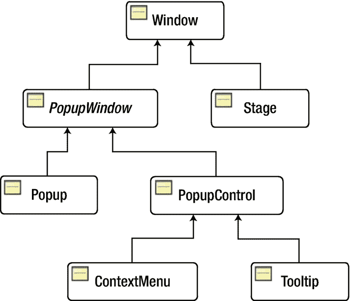
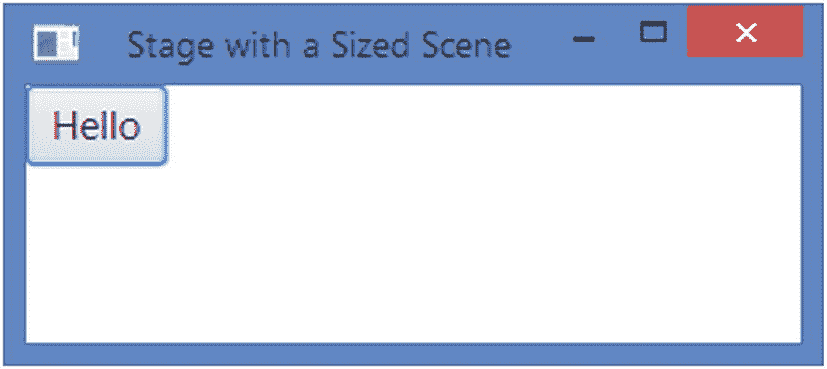
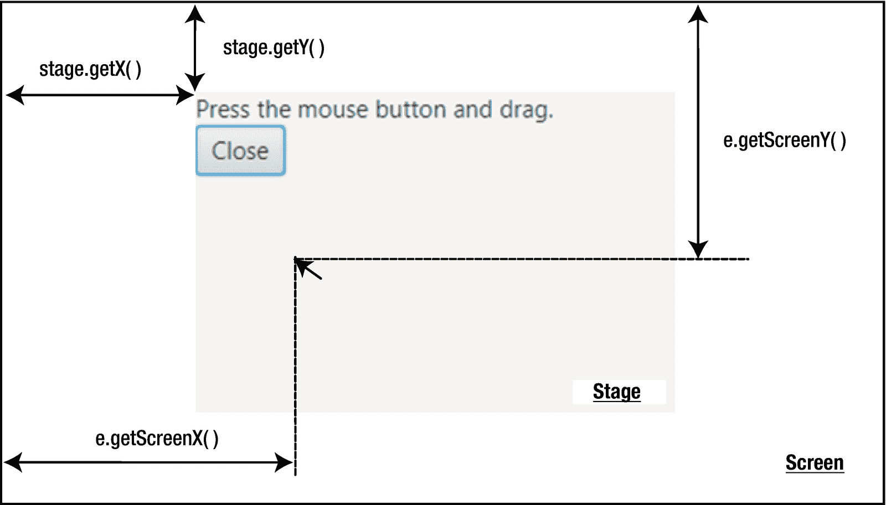

# 四、管理舞台

在本章中，您将学习:

*   如何获取屏幕的详细信息，如数量、分辨率和尺寸

*   JavaFX 中的舞台是什么，以及如何设置舞台的边界和样式

*   如何移动未装饰的舞台

*   如何设置舞台的形态和不透明度

*   如何调整舞台的大小以及如何在全屏模式下显示舞台

本章的例子在`com.jdojo.stage`包中。为了让它们工作，您必须在`module-info.java`文件中添加相应的一行:

```java
...
opens com.jdojo.stage to javafx.graphics, javafx.base;
...

```

## 了解屏幕的细节

`javafx.stage`包中的`Screen`类用于获取细节，例如，每英寸点数(DPI)设置和用户屏幕(或显示器)的尺寸。如果多个屏幕连接到一台计算机，其中一个屏幕被称为主屏幕，其他屏幕被称为非主屏幕。您可以使用`Screen`类的静态`getPrimary()`方法，用下面的代码获取主监视器的`Screen`对象的引用:

```java
// Get the reference to the primary screen
Screen primaryScreen = Screen.getPrimary();

```

静态的`getScreens()`方法返回一个`Screen`对象的`ObservableList`:

```java
ObservableList<Screen> screenList = Screen.getScreens();

```

您可以使用`Screen`类的`getDpi()`方法获得 DPI 中屏幕的分辨率，如下所示:

```java
Screen primaryScreen = Screen.getPrimary();
double dpi = primaryScreen.getDpi();

```

您可以使用`getBounds()`和`getVisualBounds()`方法分别获得边界和可视边界。这两个方法都返回一个`Rectangle2D`对象，该对象封装了一个矩形的左上角和右下角的(x，y)坐标、宽度和高度。`getMinX()`和`getMinY()`方法分别返回矩形左上角的 x 和 y 坐标。`getMaxX()`和`getMaxY()`方法分别返回矩形右下角的 x 和 y 坐标。`getWidth()`和`getHeight()`方法分别返回矩形的宽度和高度。

屏幕的边界覆盖了屏幕上可用的区域。可视边界表示在考虑本机窗口系统使用的区域(如任务栏和菜单)后，屏幕上可供使用的区域。通常，但不是必须的，屏幕的可视边界表示比其边界更小的区域。

如果桌面跨越多个屏幕，非主屏幕的边界相对于主屏幕。例如，如果桌面跨越两个屏幕，主屏幕左上角的(x，y)坐标为(0，0)，宽度为 1600，则第二个屏幕左上角的坐标为(1600，0)。

清单 [4-1](#PC5) 中的程序在有两个屏幕的 Windows 桌面上运行时打印屏幕细节。您可能会得到不同的输出。请注意一个屏幕的边界和可视边界的高度差异，而另一个屏幕则没有。主屏幕在底部显示一个任务栏，从可视边界中去掉部分高度。非主屏幕不显示任务栏，因此它的边界和可视边界是相同的。

Tip

虽然在 API 文档中没有提到`Screen`类，但是在 JavaFX 启动器启动之前，您不能使用这个类。也就是说，您无法在非 JavaFX 应用程序中获得屏幕描述。这就是为什么您要在 JavaFX 应用程序类的`start()`方法中编写代码的原因。不需要在 JavaFX 应用程序线程上使用`Screen`类。您也可以在您的类的`init()`方法中编写相同的代码。

```java
// ScreenDetailsApp.java
package com.jdojo.stage;

import javafx.application.Application;
import javafx.application.Platform;
import javafx.collections.ObservableList;
import javafx.geometry.Rectangle2D;
import javafx.stage.Screen;
import javafx.stage.Stage;

public class ScreenDetailsApp extends Application  {
       public static void main(String[] args) {
               Application.launch(args);
       }

       public void start(Stage stage) {
               ObservableList<Screen> screenList = Screen.getScreens();
               System.out.println("Screens Count: " + screenList.size());

               // Print the details of all screens
               for(Screen screen: screenList) {
                      print(screen);
               }

               Platform.exit();
       }

       public void print(Screen s) {
               System.out.println("DPI: " + s.getDpi());

               System.out.print("Screen Bounds: ");
               Rectangle2D bounds = s.getBounds();
               print(bounds);

               System.out.print("Screen Visual Bounds: ");
               Rectangle2D visualBounds = s.getVisualBounds();
               print(visualBounds);
               System.out.println("-----------------------");
       }

       public void print(Rectangle2D r) {
               System.out.format("minX=%.2f, minY=%.2f, width=%.2f,
                        height=%.2f%n",
                        r.getMinX(), r.getMinY(),
                        r.getWidth(), r.getHeight());
       }
}
Screens Count: 2
DPI: 96.0
Screen Bounds: minX=0.00, minY=0.00, width=1680.00, height=1050.00
Screen Visual Bounds: minX=0.00, minY=0.00, width=1680.00, height=1022.00
-----------------------
DPI: 96.0
Screen Bounds: minX = 1680.00, minY=0.00, width= 1680.00, height=1050.00
Screen Visual Bounds: minX = 1680.00, minY=0.00, width= 1680.00, height=1050.0
-----------------------

Listing 4-1Accessing Screen Details

```

## 什么是舞台？

JavaFX 中的舞台是承载场景的顶级容器，场景由可视元素组成。`javafx.stage`包中的`Stage`类表示 JavaFX 应用程序中的一个舞台。初级舞台由平台创建，并传递给`Application`类的`start(Stage s)`方法。您可以根据需要创建其他舞台。

Tip

JavaFX 应用程序中的舞台是顶级容器。这并不一定意味着它总是显示为一个单独的窗口。然而，对于本书的目的来说，一个舞台对应一个窗口，除非另有说明。

图 [4-1](#Fig1) 显示了从`Window`类继承而来的`Stage`类的类图。`Window`类是几个窗口行容器类的超类。它包含所有类型窗口共有的基本功能(例如，显示和隐藏窗口的方法；设置 x、y、宽度和高度属性。设置窗口的不透明度；等等。).`Window`类定义了`x`、`y`、`width`、`height`和`opacity`属性。它有`show()`和`hide()`方法分别显示和隐藏一个窗口。`Window`类的`setScene()`方法为窗口设置场景。`Stage`类定义了一个`close()`方法，与调用`Window`类的`hide()`方法效果相同。



图 4-1

`Stage`类的类图

必须在 JavaFX 应用程序线程上创建和修改一个`Stage`对象。回想一下在 JavaFX 应用程序线程上调用了`Application`类的`start()`方法，并且创建了一个主`Stage`并将其传递给该方法。注意，通过`start()`方法的初级舞台没有显示出来。需要调用`show()`方法来展示。

需要讨论使用舞台的几个方面。在接下来的部分中，我将从基础到高级逐一处理它们。

## 显示初级舞台

让我们从最简单的 JavaFX 应用程序开始，如清单 [4-2](#PC6) 所示。`start()`方法没有代码。当您运行应用程序时，您看不到窗口，也看不到控制台上的输出。应用程序将永远运行。您需要使用特定于系统的键来取消应用程序。如果你用的是 Windows，用你最喜欢的组合键 Ctrl + Alt + Del 来激活任务管理器！如果使用命令提示符，请使用 Ctrl + C。

```java
// EverRunningApp.java
package com.jdojo.stage;

import javafx.application.Application;
import javafx.stage.Stage;

public class EverRunningApp extends Application {
       public static void main(String[] args) {
               Application.launch(args);
       }

       @Override
       public void start(Stage stage) {
               // Do not write any code here
       }
}

Listing 4-2An Ever-Running JavaFX Application

```

要确定清单 [4-2](#PC6) 中的程序有什么问题，您需要理解 JavaFX 应用程序启动器是做什么的。回想一下，当调用`Platform.exit()`方法或关闭最后一个显示的舞台时，JavaFX 应用程序线程被终止。当所有非守护进程线程死亡时，JVM 终止。JavaFX 应用程序线程是非守护进程线程。当 JavaFX 应用程序线程终止时，`Application.launch()`方法返回。在前面的示例中，无法终止 JavaFX 应用程序线程。这就是应用程序永远运行的原因。

在`start()`方法中使用`Platform.exit()`方法可以解决这个问题。清单 [4-3](#PC7) 中显示了`start()`方法的修改代码。当你运行程序时，它不做任何有意义的事情就退出了。

```java
// ShortLivedApp.java
package com.jdojo.stage;

import javafx.application.Application;
import javafx.application.Platform;
import javafx.stage.Stage;

public class ShortLivedApp extends Application {
       public static void main(String[] args) {
               Application.launch(args);
       }

       @Override
       public void start(Stage stage) {
               Platform.exit(); // Exit the application
       }
}

Listing 4-3A Short-Lived JavaFX Application

```

让我们通过关闭初级舞台来尝试修复一直运行的程序。调用`start()`方法时只有一个舞台，关闭它应该会终止 JavaFX 应用程序线程。让我们用下面的代码修改`EverRunningApp`的`start()`方法:

```java
@Override
public void start(Stage stage) {
       stage.close(); // Close the only stage you have
}

```

即使有了这个用于`start()`方法的代码，`EverRunningApp`也会永远运行。如果舞台没有显示，则`close()`方法不会关闭舞台。初级舞台从未显示。因此，向`start()`方法添加一个`stage.close()`调用没有任何好处。下面的代码适用于`start()`方法。但是，这将导致舞台显示和关闭时屏幕闪烁:

```java
@Override
public void start(Stage stage) {
       stage.show();  // First show the stage
       stage.close(); // Now close it
}

```

Tip

`Stage`类的`close()`方法与调用`Window`类的`hide()`方法具有相同的效果。JavaFX API 文档没有提到试图关闭一个不显示的窗口没有任何效果。

## 设定舞台的界限

舞台的边界由四个属性组成:`x`、`y`、`width`和`height`。`x`和`y`属性决定舞台左上角的位置。`width`和`height`属性决定了它的大小。在本节中，您将学习如何在屏幕上定位舞台并调整其大小。您可以使用这些属性的 getters 和 setters 来获取和设置它们的值。

让我们从一个简单的例子开始，如清单 [4-4](#PC10) 所示。程序在显示前设置初级舞台的标题。当您运行这段代码时，您会看到一个带有标题栏、边框和空白区域的窗口。如果打开了其他应用程序，您可以透过舞台的透明区域看到它们的内容。窗口的位置和大小由平台决定。

Tip

当舞台没有场景并且其位置和大小没有明确设置时，其位置和大小由平台确定和设置。

```java
// BlankStage.java
package com.jdojo.stage;

import javafx.application.Application;
import javafx.stage.Stage;

public class BlankStage extends Application {
       public static void main(String[] args) {
               Application.launch(args);
       }

       @Override
       public void start(Stage stage) {
               stage.setTitle("Blank Stage");
               stage.show();
       }
}

Listing 4-4Displaying a Stage with No Scene and with the Platform Default Position and Size

```

让我们稍微修改一下逻辑。在这里，您将为舞台设置一个空场景，而不设置场景的大小。修改后的`start()`方法如下所示:

```java
import javafx.scene.Group;
import javafx.scene.Scene;
...
@Override
public void start(Stage stage) {
       stage.setTitle("Stage with an Empty Scene");
       Scene scene = new Scene(new Group());
       stage.setScene(scene);
       stage.show();
}

```

请注意，您已经设置了一个没有子节点的`Group`作为场景的根节点，因为没有根节点就无法创建场景。当您使用前面的代码作为其`start()`方法运行清单 [4-4](#PC10) 中的程序时，载物台的位置和大小由平台决定。这一次，内容区域将具有白色背景，因为场景的默认背景颜色是白色。

我们再修改一下逻辑。这里，我们给场景添加一个按钮。修改后的`start()`方法如下:

```java
import javafx.scene.control.Button;
...
@Override
public void start(Stage stage) {
       stage.setTitle("Stage with a Button in the Scene");
       Group root = new Group(new Button("Hello"));
       Scene scene = new Scene(root);
       stage.setScene(scene);
       stage.show();
}

```

当您使用前面的代码作为其`start()`方法运行清单 [4-4](#PC10) 中的程序时，舞台的位置和大小由场景的计算大小决定。舞台的内容区域足够宽，可以显示标题栏菜单或场景的内容，以较大者为准。舞台的内容区域足够高，可以显示场景的内容，在本例中只有一个按钮。载物台位于屏幕中央，如图 [4-2](#Fig2) 所示。


图 4-2

具有包含按钮的场景的舞台，其中场景的大小未指定

让我们通过在场景中添加一个按钮，并将场景的宽度和高度分别设置为 300 和 100，为逻辑添加另一个扭曲，如下所示:

```java
@Override
public void start(Stage stage) {
       stage.setTitle("Stage with a Sized Scene");
       Group root = new Group(new Button("Hello"));
       Scene scene = new Scene(root, 300, 100);
       stage.setScene(scene);
       stage.show();
}

```

当您使用前面的代码作为其`start()`方法运行清单 [4-4](#PC10) 中的程序时，舞台的位置和大小由场景的指定大小决定。舞台的内容区域与场景的指定大小相同。舞台的宽度包括两侧的边框，舞台的高度包括标题栏和下边框的高度。载物台位于屏幕中央，如图 [4-3](#Fig3) 所示。



图 4-3

具有特定大小场景的舞台

让我们在逻辑上再加一个转折。您将使用以下代码设置场景和舞台的大小:

```java
@Override
public void start(Stage stage) {
       stage.setTitle("A Sized Stage with a Sized Scene");
       Group root = new Group(new Button("Hello"));
       Scene scene = new Scene(root, 300, 100);
       stage.setScene(scene);
       stage.setWidth(400);
       stage.setHeight(100);
       stage.show();
}

```

当您使用前面的代码作为其`start()`方法运行清单 [4-4](#PC10) 中的程序时，舞台的位置和大小由舞台的指定大小决定。舞台在屏幕上居中，然后看起来如图 [4-4](#Fig4) 所示。


图 4-4

大小合适的舞台和大小合适的场景

Tip

舞台的默认居中方式是在屏幕上水平居中。舞台左上角的 y 坐标是屏幕高度的三分之一减去舞台高度。这是在`Window`类的`centerOnScreen()`方法中使用的逻辑。

让我回顾一下定位和调整舞台大小的规则。如果没有指定舞台的界限，并且

*   它没有场景，它的边界由平台决定。

*   它有一个没有可视节点的场景，它的边界由平台决定。在这种情况下，不指定场景的大小。

*   它有一个带有视觉节点的场景，它的边界由场景中的视觉节点决定。在这种情况下，不指定场景的大小，舞台在屏幕上居中。

*   它有一个场景，场景的大小是指定的，它的边界由场景的指定大小决定。舞台在屏幕中央。

如果您指定了舞台的大小，但没有指定其位置，则舞台将根据设置的大小调整大小，并在屏幕上居中，而不考虑是否存在场景以及场景的大小。如果您指定载物台的位置(x，y 坐标)，它会相应地定位。

Tip

如果您想要设置舞台的宽度和高度以适合其场景的内容，请使用`Window`类的`sizeToScene()`方法。如果您希望在运行时修改场景后将舞台的大小与其场景的大小同步，则方法非常有用。使用`Window`类的`centerOnScreen()`方法使舞台在屏幕上居中。

如果您希望舞台在屏幕上水平和垂直居中，请使用以下逻辑:

```java
Rectangle2D bounds = Screen.getPrimary().getVisualBounds();
double x = bounds.getMinX() + (bounds.getWidth() - stage.getWidth())/2.0;
double y = bounds.getMinY() + (bounds.getHeight() - stage.getHeight())/2.0;
stage.setX(x);
stage.setY(y);

```

使用前面的代码片段时要小心。它利用了舞台的大小。舞台的大小直到第一次演出时才知道。在显示舞台之前使用前面的逻辑不会真正使舞台在屏幕上居中。JavaFX 应用程序的以下`start()`方法将无法正常工作:

```java
@Override
public void start(Stage stage) {
       stage.setTitle("A Truly Centered Stage");
       Group root = new Group(new Button("Hello"));
       Scene scene = new Scene(root);
       stage.setScene(scene);

       // Wrong!!!! Use the logic shown below after the stage.show() call
       // At this point, stage width and height are not known. They are NaN.
       Rectangle2D bounds = Screen.getPrimary().getVisualBounds();
       double x = bounds.getMinX() + (bounds.getWidth() –
                 stage.getWidth())/2.0;
       double y = bounds.getMinY() + (bounds.getHeight() –
                 stage.getHeight())/2.0;
       stage.setX(x);
       stage.setY(y);

       stage.show();
}

```

## 初始化舞台的样式

舞台的区域可以分为两部分:内容区和装饰区。内容区域显示其场景的可视内容。通常，装饰由标题栏和边框组成。标题栏的存在及其内容根据平台提供的装饰类型而有所不同。一些装饰品提供了额外的功能，而不仅仅是美观。例如，标题栏可用于将舞台拖动到不同的位置；标题栏中的按钮可用于最小化、最大化、恢复和关闭舞台；或者可以使用边框来调整舞台的大小。

在 JavaFX 中，舞台的样式属性决定了它的背景颜色和装饰。根据样式，在 JavaFX 中可以有以下五种类型的舞台:

*   盛饰建筑的

*   未加装饰的

*   透明的

*   统一的

*   效用

一个*装饰的*舞台有纯白色的背景和平台装饰。一个没有装饰的舞台有纯白色的背景，没有任何装饰。一个*透明*的舞台，背景透明，没有任何装饰。*统一*舞台有平台装饰，客户区与装饰之间无边框；客户区背景与装饰相统一。要看统一舞台风格的效果，场景要用`Color.TRANSPARENT`填充。统一风格是有条件的特征。一个*实用*舞台有纯白色背景和最少的平台装饰。

Tip

一个舞台的风格仅仅决定了它的装饰。背景颜色由其场景背景控制，默认情况下是纯白色。如果你把一个舞台的风格设置为`TRANSPARENT`，你会得到一个纯白背景的舞台，这就是场景的背景。为了得到一个真正透明的舞台，你需要使用`setFill()`方法将场景的背景色设置为`null`。

您可以使用`Stage`类的`initStyle(StageStyle style)`方法来设置舞台的样式。一个舞台的风格必须在第一次展示之前设定好。在舞台显示后，第二次设置它会引发运行时异常。默认情况下，舞台是装饰的。

舞台的五种样式在`StageStyle`枚举中定义为五个常量:

*   `StageStyle.DECORATED`

*   `StageStyle.UNDECORATED`

*   `StageStyle.TRANSPARENT`

*   `StageStyle.UNIFIED`

*   `StageStyle.UTILITY`

清单 [4-5](#PC17) 展示了如何在舞台上使用这五种风格。在`start()`方法中，您一次只需要取消一条语句的注释，这将初始化 stage 的样式。您将使用一个`VBox`来显示两个控件:一个`Label`和一个`Button`。`Label`展示舞台的风格。提供`Button`是为了关闭舞台，因为不是所有的样式都提供带有关闭按钮的标题栏。图 [4-5](#Fig5) 显示了使用四种风格的舞台。背景中窗口的内容可以通过透明的舞台看到。这就是当您使用透明样式时，您会看到更多已添加到舞台的内容的原因。


图 4-5

使用不同风格的舞台

```java
// StageStyleApp.java
package com.jdojo.stage;

import javafx.application.Application;
import javafx.scene.Scene;
import javafx.scene.control.Button;
import javafx.scene.control.Label;
import javafx.scene.layout.VBox;
import javafx.scene.paint.Color;
import javafx.stage.Stage;
import javafx.stage.StageStyle;
import static javafx.stage.StageStyle.DECORATED;
import static javafx.stage.StageStyle.UNDECORATED;
import static javafx.stage.StageStyle.TRANSPARENT;
import static javafx.stage.StageStyle.UNIFIED;
import static javafx.stage.StageStyle.UTILITY;

public class StageStyleApp extends Application {
       public static void main(String[] args) {
               Application.launch(args);
       }

       @Override
       public void start(Stage stage) {
               // A label to display the style type
               Label styleLabel = new Label("Stage Style");

               // A button to close the stage
               Button closeButton = new Button("Close");
               closeButton.setOnAction(e -> stage.close());

               VBox root = new VBox();
               root.getChildren().addAll(styleLabel, closeButton);
               Scene scene = new Scene(root, 100, 70);
               stage.setScene(scene);

               // The title of the stage is not visible for all styles.
               stage.setTitle("The Style of a Stage");

               /* Uncomment one of the following statements at a time */
               this.show(stage, styleLabel, DECORATED);
               //this.show(stage, styleLabel, UNDECORATED);
               //this.show(stage, styleLabel, TRANSPARENT);
               //this.show(stage, styleLabel, UNIFIED);
               //this.show(stage, styleLabel, UTILITY);
       }

       private void show(Stage stage, Label styleLabel, StageStyle style) {
               // Set the text for the label to match the style
               styleLabel.setText(style.toString());

               // Set the style
               stage.initStyle(style);

               // For a transparent style, set the scene fill to null.
               // Otherwise, the content area will have the default white
               // background of the scene.
               if (style == TRANSPARENT) {
                      stage.getScene().setFill(null);
                      stage.getScene().getRoot().setStyle(
                             "-fx-background-color: transparent");
               } else if(style == UNIFIED) {
                      stage.getScene().setFill(Color.TRANSPARENT);
               }

               // Show the stage
               stage.show();
       }
}

Listing 4-5Using Different Styles for a Stage

```

## 移动未装饰的舞台

您可以通过拖动其标题栏将舞台移动到不同的位置。在未装饰或透明的舞台中，标题栏是不可用的。您需要编写几行代码，让用户通过在场景区域拖动鼠标来移动这种舞台。清单 [4-6](#PC18) 展示了如何编写代码来支持舞台的拖动。如果将舞台更改为透明，则需要通过仅在消息标签上拖动鼠标来拖动舞台，因为透明区域不会响应鼠标事件。

这个例子使用鼠标事件处理。我将在第 [9](09.html) 章详细介绍事件处理。这里简单介绍一下，以完成关于使用不同风格的舞台的讨论。

```java
// DraggingStage.java
package com.jdojo.stage;

import javafx.application.Application;

import javafx.scene.Scene;
import javafx.scene.control.Button;
import javafx.scene.control.Label;
import javafx.scene.input.MouseEvent;
import javafx.scene.layout.VBox;

import javafx.stage.Stage;
import javafx.stage.StageStyle;

public class DraggingStage extends Application {
       private Stage stage;
       private double dragOffsetX;
       private double dragOffsetY;

       public static void main(String[] args) {
               Application.launch(args);
       }

       @Override
       public void start(Stage stage) {
               // Store the stage reference in the instance variable to
               // use it in the mouse pressed event handler later.
               this.stage = stage;

               Label msgLabel = new Label(
                        "Press the mouse button and drag.");
               Button closeButton = new Button("Close");
               closeButton.setOnAction(e -> stage.close());

               VBox root = new VBox();
               root.getChildren().addAll(msgLabel, closeButton);

               Scene scene = new Scene(root, 300, 200);

               // Set mouse pressed and dragged even handlers for the
               // scene
               scene.setOnMousePressed(e -> handleMousePressed(e));
               scene.setOnMouseDragged(e -> handleMouseDragged(e));

               stage.setScene(scene);
               stage.setTitle("Moving a Stage");
               stage.initStyle(StageStyle.UNDECORATED);
               stage.show();
       }

       protected void handleMousePressed(MouseEvent e) {
               // Store the mouse x and y coordinates with respect to the
               // stage in the reference variables to use them in the
               // drag event
               this.dragOffsetX = e.getScreenX() - stage.getX();
               this.dragOffsetY = e.getScreenY() - stage.getY();
       }

       protected void handleMouseDragged(MouseEvent e) {
               // Move the stage by the drag amount
               stage.setX(e.getScreenX() - this.dragOffsetX);
               stage.setY(e.getScreenY() - this.dragOffsetY);
       }
}

Listing 4-6Dragging a Stage

```

以下代码片段将鼠标按下和鼠标拖动事件处理程序添加到场景中:

```java
scene.setOnMousePressed(e -> handleMousePressed(e));
scene.setOnMouseDragged(e -> handleMouseDragged(e));

```

当你在场景中(除了按钮区域)按下鼠标，就会调用`handleMousePressed()`方法。`MouseEvent`对象的`getScreenX()`和`getScreenY()`方法返回鼠标相对于屏幕左上角的 x 和 y 坐标。图 [4-6](#Fig6) 显示了坐标系的示意图。它显示舞台周围有一条细边框。但是，当您运行示例代码时，您将看不到任何边框。此处显示是为了区分屏幕区域和舞台区域。您将鼠标相对于舞台左上角的`x`和`y`坐标存储在实例变量中。



图 4-6

计算鼠标相对于载物台的坐标

拖动鼠标时，会调用`handleMouseDragged()`方法。方法使用鼠标按下时的位置和拖动时的位置来计算和设置舞台的位置。

## 初始化舞台的模态

在 GUI 应用程序中，你可以有两种类型的窗口:模态窗口和非模态窗口。当显示模式窗口时，用户不能使用应用程序中的其他窗口，直到模式窗口被关闭。如果一个应用程序显示多个非模态窗口，用户可以随时在它们之间切换。

JavaFX 为舞台提供了三种类型的模态:

*   没有人

*   窗口模式

*   应用模型

舞台的模态由`javafx.stage`包的`Modality`枚举中的以下三个常量之一定义:

*   `NONE`

*   `WINDOW_MODAL`

*   `APPLICATION_MODAL`

您可以使用`Stage`类的`initModality(Modality m)`方法设置舞台的形态，如下所示:

```java
// Create a Stage object and set its modality
Stage stage = new Stage();
stage.initModality(Modality.WINDOW_MODAL);

/* More code goes here.*/

// Show the stage
stage.show();

```

Tip

必须在显示之前设置舞台的形态。在显示舞台后设置它的模态会引发运行时异常。为主要舞台设置通道也会引发运行时异常。

一个`Stage`可以有一个所有者。一辆`Stage`的拥有者是另一辆`Window`。您可以使用`Stage`类的`initOwner(Window owner)`方法来设置`Stage`的所有者。必须在舞台显示之前设置`Stage`的所有者。一辆`Stage`的车主可能是`null`，在这种情况下，据说`Stage`没有车主。设置一个`Stage`的所有者会创建一个所有者拥有的关系。例如，如果所有者被最小化或隐藏，则`Stage`被最小化或隐藏。

`Stage`的默认设备是`NONE`。当显示带有模态`NONE`的`Stage`时，它不会阻挡应用程序中的任何其他窗口。它的行为就像一个无模式窗口。

带有`WINDOW_MODAL`模态的`Stage`阻塞其所有者层级中的所有窗口。假设有四个舞台:s1、s2、s3 和 s4。舞台 s1 和 s4 具有设置为`NONE`的模态，并且没有所有者；s1 是 s2 的所有者；s2 是 s3 的所有者。将显示所有四个舞台。如果 s3 的主机设置为`WINDOW_MODAL`，您可以使用 s3 或 s4，但不能使用 s2 和 s1。所有者-所有者关系被定义为 s1 到 s2 到 s3。当显示 s3 时，它会阻止 s2 和 s1，这两个节点位于其所有者层次结构中。因为 s4 不在 s3 的所有者层次结构中，所以您仍然可以使用 s4。

Tip

对于没有所有者的舞台，`WINDOW_MODAL`的形态具有与形态被设置为`NONE`相同的效果。

如果显示的`Stage`的模态设置为`APPLICATION_MODAL`，您必须使用`Stage`并将其关闭，然后才能使用应用程序中的任何其他窗口。继续上一段中显示四个舞台的相同示例，如果您将 s4 的模态设置为`APPLICATION_MODAL`，焦点将被设置为 s4，您必须先将其关闭，然后才能处理其他舞台。请注意，一个`APPLICATION_MODAL`舞台阻塞了同一应用程序中的所有其他窗口，而不管所有者拥有的关系如何。

清单 [4-7](#PC21) 显示了如何为一个舞台使用不同的模态。它用六个按钮显示初级舞台。每个按钮打开一个具有指定主机和所有者的次级舞台。按钮的文本告诉您它们将打开哪种次级舞台。当显示次要舞台时，尝试单击主要舞台。当第二舞台的模态阻塞第一舞台时，您将无法使用第一舞台；单击主要舞台会将焦点设置回次要舞台。

```java
// StageModalityApp.java
package com.jdojo.stage;

import javafx.application.Application;
import javafx.scene.Scene;
import javafx.scene.control.Button;
import javafx.scene.control.Label;
import javafx.scene.layout.VBox;
import javafx.stage.Stage;
import javafx.stage.Modality;
import static javafx.stage.Modality.NONE;
import static javafx.stage.Modality.WINDOW_MODAL;
import static javafx.stage.Modality.APPLICATION_MODAL;
import javafx.stage.Window;

public class StageModalityApp extends Application {
       public static void main(String[] args) {
               Application.launch(args);
       }

       @Override
       public void start(Stage stage) {
               /* Buttons to display each kind of modal stage */
               Button ownedNoneButton = new Button("Owned None");
               ownedNoneButton.setOnAction(e -> showDialog(stage, NONE));

               Button nonOwnedNoneButton = new Button("Non-owned None");
               nonOwnedNoneButton.setOnAction(e ->
                        showDialog(null, NONE));

               Button ownedWinButton = new Button("Owned Window Modal");
               ownedWinButton.setOnAction(e ->
                        showDialog(stage, WINDOW_MODAL));

               Button nonOwnedWinButton =
                        new Button("Non-owned Window Modal");
               nonOwnedWinButton.setOnAction(e ->
                        showDialog(null, WINDOW_MODAL));

               Button ownedAppButton =
                        new Button("Owned Application Modal");
               ownedAppButton.setOnAction(e ->
                        showDialog(stage, APPLICATION_MODAL));

               Button nonOwnedAppButton =
                        new Button("Non-owned Application Modal");
               nonOwnedAppButton.setOnAction(e ->
                        showDialog(null, APPLICATION_MODAL));

               VBox root = new VBox();
               root.getChildren().addAll(
                        ownedNoneButton, nonOwnedNoneButton,
                        ownedWinButton, nonOwnedWinButton,
                        ownedAppButton, nonOwnedAppButton);
               Scene scene = new Scene(root, 300, 200);
               stage.setScene(scene);
               stage.setTitle("The Primary Stage");
               stage.show();
       }

       private void showDialog(Window owner, Modality modality) {
               // Create a Stage with specified owner and modality
               Stage stage = new Stage();
               stage.initOwner(owner);
               stage.initModality(modality);

               Label modalityLabel = new Label(modality.toString());
               Button closeButton = new Button("Close");
               closeButton.setOnAction(e -> stage.close());

               VBox root = new VBox();
               root.getChildren().addAll(modalityLabel, closeButton);
               Scene scene = new Scene(root, 200, 100);
               stage.setScene(scene);
               stage.setTitle("A Dialog Box");
               stage.show();
       }
}

Listing 4-7Using Different Modalities for a Stage

```

## 设置舞台的不透明度

舞台的不透明度决定了您透过舞台可以看到的程度。您可以使用`Window`类的`setOpacity(double opacity)`方法设置舞台的不透明度。使用`getOpacity()`方法获得当前舞台的不透明度。

不透明度值的范围从 0.0 到 1.0。不透明度为 0.0 表示舞台完全半透明；不透明度为 1.0 表示舞台完全不透明。不透明度会影响舞台的整个区域，包括其装饰。并非所有 JavaFX 运行时平台都需要支持不透明性。在不支持不透明度的 JavaFX 平台上设置不透明度没有任何效果。以下代码片段将舞台的不透明度设置为半透明:

```java
Stage stage = new Stage();
stage.setOpacity(0.5); // A half-translucent stage

```

## 调整舞台大小

您可以通过使用其`setResizable(boolean resizable)`方法来设置用户是否可以调整舞台的大小。注意，对`setResizable()`方法的调用是对实现的一个*提示*，使 stage 可调整大小。默认情况下，舞台是可调整大小的。有时，您可能希望将调整舞台大小的使用限制在一定的宽度和高度范围内。`Stage`类的`setMinWidth()`、`setMinHeight()`、`setMaxWidth()`和`setMaxHeight()`方法允许您设置用户可以调整舞台大小的范围。

Tip

在`Stage`对象上调用`setResizable(false)`方法会阻止用户调整舞台的大小。您仍然可以通过编程方式调整舞台的大小。

经常需要打开一个占据整个屏幕空间的窗口。为此，您需要将窗口的位置和大小设置为屏幕的可视边界。清单 [4-8](#PC23) 提供了说明这一点的程序。它会打开一个空舞台，占据屏幕的整个可视区域。

```java
// MaximizedStage.java
package com.jdojo.stage;

import javafx.application.Application;
import javafx.geometry.Rectangle2D;
import javafx.scene.Group;
import javafx.scene.Scene;
import javafx.stage.Screen;
import javafx.stage.Stage;

public class MaximizedStage extends Application {
       public static void main(String[] args) {
               Application.launch(args);
       }

       @Override
       public void start(Stage stage) {
               stage.setScene(new Scene(new Group()));
               stage.setTitle("A Maximized Stage");

               // Set the position and size of the stage equal to the
               // position and size of the screen
               Rectangle2D visualBounds =
                        Screen.getPrimary().getVisualBounds();
               stage.setX(visualBounds.getMinX());
               stage.setY(visualBounds.getMinY());
               stage.setWidth(visualBounds.getWidth());
               stage.setHeight(visualBounds.getHeight());

               // Show the stage
               stage.show();
       }
}

Listing 4-8Opening a Stage to Take Up the Entire Available Visual Screen Space

```

## 以全屏模式显示舞台

`Stage`类有一个`fullScreen`属性，它指定舞台是否应该以全屏模式显示。全屏模式的实现取决于平台和配置文件。如果平台不支持全屏模式，JavaFX 运行时将通过显示最大化和未修饰的舞台来模拟它。一个 stage 可以通过调用`setFullScreen(true)`方法进入全屏模式。当舞台进入全屏模式时，会显示一条关于如何退出全屏模式的简短消息:您需要按 ESC 键退出全屏模式。您可以通过调用`setFullScreen(false)`方法以编程方式退出全屏模式。使用`isFullScreen()`方法检查载物台是否处于全屏模式。

## 展示一个舞台并等待它关闭

您通常希望显示一个对话框并暂停进一步的处理，直到它被关闭。例如，您可能希望向用户显示一个消息框，其中包含单击“是”和“否”按钮的选项，并且您希望根据用户单击的按钮执行不同的操作。在这种情况下，当消息框显示给用户时，程序必须等待它关闭，然后才能执行下一个逻辑序列。考虑以下伪代码:

```java
Option userSelection = messageBox("Close", "Do you want to exit?", YESNO);
if (userSelection == YES) {
       stage.close();
}

```

在这段伪代码中，当调用`messageBox()`方法时，程序需要等待执行后续的`if`语句，直到消息框被解除。

`Window`类的`show()`方法立即返回，使得在前面的例子中打开一个对话框没有用。您需要使用`showAndWait()`方法，该方法显示舞台并等待它关闭，然后返回给调用者。`showAndWait()`方法暂时停止处理当前事件，并开始一个嵌套的事件循环来处理其他事件。

Tip

必须在 JavaFX 应用程序线程上调用`showAndWait()`方法。不应在主要舞台调用它，否则将引发运行时异常。

您可以使用`showAndWait()`方法打开多个舞台。每次调用方法都会启动一个新的嵌套事件循环。当此方法调用后创建的所有嵌套事件循环都已终止时，对该方法的特定调用将返回给调用方。

这个规则在开始时可能会令人困惑。让我们看一个例子来详细解释这一点。假设您有三个舞台:s1、s2 和 s3。使用调用`s1.showAndWait()`打开舞台 s1。从 s1 中的代码开始，使用调用`s2.showAndWait()`打开舞台 s2。此时，有两个嵌套的事件循环:一个由`s1.showAndWait()`创建，另一个由`s2.showAndWait()`创建。对`s1.showAndWait()`的调用将只在 s1 和 s2 都关闭后返回，而不管它们关闭的顺序。s2 关闭后,`s2.showAndWait()`调用将返回。

清单 [4-9](#PC25) 包含一个程序，它允许你使用多个舞台进行`showAndWait()`方法调用。使用`Open`按钮打开初级舞台。点击`Open`按钮使用`showAndWait()`方法打开第二舞台。第二级有两个按钮——`Say Hello`和`Open`——分别在控制台上打印信息和打开另一个第二级。在调用`showAndWait()`方法前后，控制台上会显示一条消息。您需要打开多个次级舞台，通过单击`Say Hello`按钮打印消息，按照您想要的任何顺序关闭它们，然后在控制台上查看输出。

```java
// ShowAndWaitApp.java
package com.jdojo.stage;

import javafx.application.Application;
import javafx.scene.Scene;
import javafx.scene.control.Button;
import javafx.scene.layout.VBox;
import javafx.stage.Stage;

public class ShowAndWaitApp extends Application {
       protected static int counter = 0;
       protected Stage lastOpenStage;

       public static void main(String[] args) {
               Application.launch(args);
       }

       @Override
       public void start(Stage stage) {
               VBox root = new VBox();
               Button openButton = new Button("Open");
               openButton.setOnAction(e -> open(++counter));
               root.getChildren().add(openButton);
               Scene scene = new Scene(root, 400, 400);
               stage.setScene(scene);
               stage.setTitle("The Primary Stage");
               stage.show();

               this.lastOpenStage = stage;
       }

       private void open(int stageNumber) {
               Stage stage = new Stage();
               stage.setTitle("#" + stageNumber);

               Button sayHelloButton = new Button("Say Hello");
               sayHelloButton.setOnAction(
                  e -> System.out.println(
                        "Hello from #" + stageNumber));

               Button openButton = new Button("Open");
               openButton.setOnAction(e -> open(++counter));

               VBox root = new VBox();
               root.getChildren().addAll(sayHelloButton, openButton);
               Scene scene = new Scene(root, 200, 200);
               stage.setScene(scene);
               stage.setX(this.lastOpenStage.getX() + 50);
               stage.setY(this.lastOpenStage.getY() + 50);
               this.lastOpenStage = stage;

               System.out.println("Before stage.showAndWait(): " +
                        stageNumber);

               // Show the stage and wait for it to close
               stage.showAndWait();

               System.out.println("After stage.showAndWait(): " +
                        stageNumber);
       }
}

Listing 4-9Playing with the showAndWait() Call

```

Tip

JavaFX 不提供可用作对话框的内置窗口(消息框或提示窗口)。您可以通过为舞台设置适当的模态并使用`showAndWait()`方法显示来开发一个。

## 摘要

`javafx.stage`包中的`Screen`类用于获取与运行程序的机器挂钩的用户屏幕的详细信息，例如 DPI 设置和尺寸。如果有多个屏幕，其中一个屏幕称为主屏幕，其他的为非主屏幕。您可以使用`Screen`类的静态`getPrimary()`方法获取主监视器的`Screen`对象的引用。

JavaFX 中的舞台是承载场景的顶级容器，场景由可视元素组成。`javafx.stage`包中的`Stage`类表示 JavaFX 应用程序中的一个舞台。初级舞台由平台创建，并传递给`Application`类的`start(Stage s)`方法。您可以根据需要创建其他舞台。

一个舞台有包含其位置和大小的界限。舞台的边界由其四个属性定义:`x`、`y`、`width`和`height`。`x`和`y`属性决定舞台左上角的位置。`width`和`height`属性决定了它的大小。

舞台的区域可以分为两部分:内容区和装饰区。内容区域显示其场景的可视内容。通常，装饰由标题栏和边框组成。标题栏的存在及其内容根据平台提供的装饰类型而有所不同。JavaFX 中有五种类型的 stages:修饰的、未修饰的、透明的、统一的和实用的。

JavaFX 允许您拥有两种类型的窗口:模态窗口和非模态窗口。当显示模式窗口时，用户不能使用应用程序中的其他窗口，直到模式窗口被关闭。如果一个应用程序显示多个非模态窗口，用户可以随时在它们之间切换。JavaFX 为舞台定义了三种类型的模态:无模态、窗口模态和应用程序模态。“无”作为其模态的舞台是无模式窗口。将窗口模式作为其模式的舞台会阻止其所有者层次结构中的所有窗口。将应用程序模式作为其模式的舞台会阻塞应用程序中的所有其他窗口。

舞台的不透明度决定了您透过舞台可以看到的程度。您可以使用其`setOpacity(double opacity)`方法设置舞台的不透明度。不透明度值的范围从 0.0 到 1.0。不透明度为 0.0 表示舞台完全半透明；不透明度为 1.0 表示舞台完全不透明。不透明度会影响舞台的整个区域，包括其装饰。

您可以通过使用 stage 的`setResizable(boolean resizable)`方法来设置用户是否可以调整 stage 大小的提示。`Stage`类的`setMinWidth()`、`setMinHeight()`、`setMaxWidth()`和`setMaxHeight()`方法允许您设置用户可以调整舞台大小的范围。一个 stage 可以通过调用它的`setFullScreen(true)`方法进入全屏模式。

你可以使用`Stage`类的`show()`和`showAndWait()`方法来显示一个舞台。`show()`方法显示舞台并返回，而`showAndWait()`方法显示舞台并阻塞，直到舞台关闭。

下一章将向你展示如何创建场景和使用场景图。